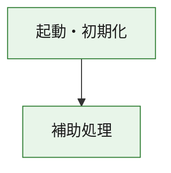
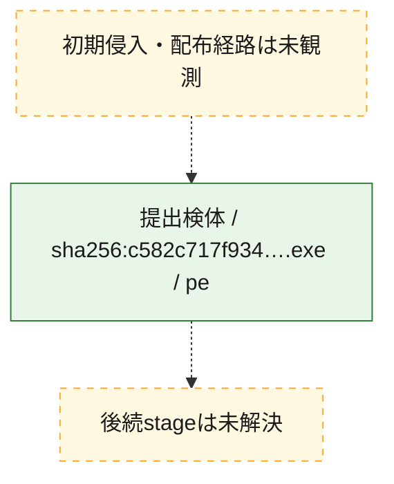
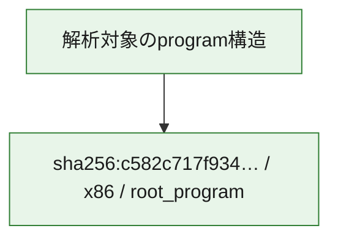

# 全体ロジック：c582c717f9344aee263bc697533c0c4d631c8cd5c8703fe1e1c8c973d4aa58db

代表関数の静的証跡から、起動・初期化の処理群を確認しました。

## 読み方

- phaseの掲載順は解析上の整理順です。observed_call_edgesがない段階間の実行順を断定しません。
- 図の実線は静的に観測した関係、点線と黄色のノードは未観測・未解決の関係を示します。
- 図は静的な要約であり、動的実行を再現するものではありません。
- 詳細な関数解説とfingerprintは[STATIC-LOGIC.md](STATIC-LOGIC.md)を参照してください。

## 静的可視化

### 実行フロー

### 感染チェーン

### モジュール関係

## 処理段階

### 1. 起動・初期化

entry pointから初期化と後続処理への移行を確認します。
確度: `confirmed_static_function_evidence`

- `c582c717f9344aee263bc697533c0c4d631c8cd5c8703fe1e1c8c973d4aa58db:ghidra:180001010` — 初期化と主要処理への分岐を行う入口関数です。 状態: `succeeded`、選定理由: `entry_point`, `meaningful_symbol_name`, `reviewed_call_centrality:22`, `role:entrypoint`, `small_program_complete_context`

### 2. 補助処理

主要処理を支える一般内部関数またはlibrary処理を確認します。
確度: `confirmed_static_function_evidence`

- `c582c717f9344aee263bc697533c0c4d631c8cd5c8703fe1e1c8c973d4aa58db:ghidra:180001240` — 検体内部の一般処理を実装する関数です。 状態: `succeeded`、選定理由: `context_representative`, `reviewed_call_centrality:2`, `small_program_complete_context`
- `c582c717f9344aee263bc697533c0c4d631c8cd5c8703fe1e1c8c973d4aa58db:ghidra:180001350` — 検体内部の一般処理を実装する関数です。 状態: `succeeded`、選定理由: `context_representative`, `reviewed_call_centrality:25`, `small_program_complete_context`
- `c582c717f9344aee263bc697533c0c4d631c8cd5c8703fe1e1c8c973d4aa58db:ghidra:180003780` — 検体内部の一般処理を実装する関数です。 状態: `succeeded`、選定理由: `context_representative`, `reviewed_call_centrality:2`, `small_program_complete_context`
- `c582c717f9344aee263bc697533c0c4d631c8cd5c8703fe1e1c8c973d4aa58db:ghidra:1800038e0` — 検体内部の一般処理を実装する関数です。 状態: `succeeded`、選定理由: `context_representative`, `reviewed_call_centrality:2`, `small_program_complete_context`

## 観測したcall関係

- `c582c717f9344aee263bc697533c0c4d631c8cd5c8703fe1e1c8c973d4aa58db:ghidra:180001010` → `c582c717f9344aee263bc697533c0c4d631c8cd5c8703fe1e1c8c973d4aa58db:ghidra:180001240` （`startup` → `support`）
- `c582c717f9344aee263bc697533c0c4d631c8cd5c8703fe1e1c8c973d4aa58db:ghidra:180001010` → `c582c717f9344aee263bc697533c0c4d631c8cd5c8703fe1e1c8c973d4aa58db:ghidra:180001350` （`startup` → `support`）
- `c582c717f9344aee263bc697533c0c4d631c8cd5c8703fe1e1c8c973d4aa58db:ghidra:180001350` → `c582c717f9344aee263bc697533c0c4d631c8cd5c8703fe1e1c8c973d4aa58db:ghidra:180001240` （`support` → `support`）
- `c582c717f9344aee263bc697533c0c4d631c8cd5c8703fe1e1c8c973d4aa58db:ghidra:180001350` → `c582c717f9344aee263bc697533c0c4d631c8cd5c8703fe1e1c8c973d4aa58db:ghidra:180003780` （`support` → `support`）
- `c582c717f9344aee263bc697533c0c4d631c8cd5c8703fe1e1c8c973d4aa58db:ghidra:180001350` → `c582c717f9344aee263bc697533c0c4d631c8cd5c8703fe1e1c8c973d4aa58db:ghidra:1800038e0` （`support` → `support`）
- `c582c717f9344aee263bc697533c0c4d631c8cd5c8703fe1e1c8c973d4aa58db:ghidra:180003780` → `c582c717f9344aee263bc697533c0c4d631c8cd5c8703fe1e1c8c973d4aa58db:ghidra:1800038e0` （`support` → `support`）
- `ghidra-function:40dba8c2bada833a4fb0bea4` → `ghidra-function:0e3a66d859cba2a1d25c2c11` （`unclassified` → `unclassified`）
- `ghidra-function:40dba8c2bada833a4fb0bea4` → `ghidra-function:1a0b45bd8dfeef51ecdd79c6` （`unclassified` → `unclassified`）
- `ghidra-function:40dba8c2bada833a4fb0bea4` → `ghidra-function:23f08510b90c1750f19a0fe4` （`unclassified` → `unclassified`）
- `ghidra-function:40dba8c2bada833a4fb0bea4` → `ghidra-function:5b6fda2f6198abc7884179b3` （`unclassified` → `unclassified`）
- `ghidra-function:40dba8c2bada833a4fb0bea4` → `ghidra-function:6bb9707c449db1938b61a0cd` （`unclassified` → `unclassified`）
- `ghidra-function:40dba8c2bada833a4fb0bea4` → `ghidra-function:913201744bdd55dee55cc2c7` （`unclassified` → `unclassified`）
- `ghidra-function:40dba8c2bada833a4fb0bea4` → `ghidra-function:9a9b0ea47964372c4fcfbfeb` （`unclassified` → `unclassified`）
- `ghidra-function:40dba8c2bada833a4fb0bea4` → `ghidra-function:a989441b53bd61aa8258e012` （`unclassified` → `unclassified`）
- `ghidra-function:40dba8c2bada833a4fb0bea4` → `ghidra-function:cdb5a5c69571161f402438b2` （`unclassified` → `unclassified`）
- `ghidra-function:40dba8c2bada833a4fb0bea4` → `ghidra-function:d5a05a590bfca7fd3bb31444` （`unclassified` → `unclassified`）
- `ghidra-function:40dba8c2bada833a4fb0bea4` → `ghidra-function:e8640087fccf16bcbb81a0c9` （`unclassified` → `unclassified`）
- `ghidra-function:40dba8c2bada833a4fb0bea4` → `ghidra-function:f66d4d4a5ae69f794ce33b38` （`unclassified` → `unclassified`）
- `ghidra-function:cdb5a5c69571161f402438b2` → `ghidra-external:1a4069e6b7cc40ee05b7aa9e` （`unclassified` → `unclassified`）
- `ghidra-function:cdb5a5c69571161f402438b2` → `ghidra-external:23c75fbc08ab25f7a1a07000` （`unclassified` → `unclassified`）
- `ghidra-function:cdb5a5c69571161f402438b2` → `ghidra-external:2a768566c35eab944cc30dad` （`unclassified` → `unclassified`）
- `ghidra-function:cdb5a5c69571161f402438b2` → `ghidra-external:2ae5071366b2f36b1241c9f0` （`unclassified` → `unclassified`）
- `ghidra-function:cdb5a5c69571161f402438b2` → `ghidra-external:6c69fc8677f88f8a0610b52a` （`unclassified` → `unclassified`）
- `ghidra-function:cdb5a5c69571161f402438b2` → `ghidra-external:8108a6dbc59e569ffb25e523` （`unclassified` → `unclassified`）
- `ghidra-function:cdb5a5c69571161f402438b2` → `ghidra-external:92e1db84d9c35a6911b5086e` （`unclassified` → `unclassified`）
- `ghidra-function:cdb5a5c69571161f402438b2` → `ghidra-external:93314242c17531b943c5cec7` （`unclassified` → `unclassified`）
- `ghidra-function:cdb5a5c69571161f402438b2` → `ghidra-external:9b5180f93d0f8945b866fec2` （`unclassified` → `unclassified`）
- `ghidra-function:cdb5a5c69571161f402438b2` → `ghidra-external:a8043766ec635b33cc0af0b9` （`unclassified` → `unclassified`）
- `ghidra-function:cdb5a5c69571161f402438b2` → `ghidra-external:b327d4d7943baff0122a0c1b` （`unclassified` → `unclassified`）
- `ghidra-function:cdb5a5c69571161f402438b2` → `ghidra-external:b88aa48538bd13398027d990` （`unclassified` → `unclassified`）
- `ghidra-function:cdb5a5c69571161f402438b2` → `ghidra-external:b8ea4f0a1227a4eb6619d1e1` （`unclassified` → `unclassified`）
- `ghidra-function:cdb5a5c69571161f402438b2` → `ghidra-external:c15c24f4a27c156cd82c6ad1` （`unclassified` → `unclassified`）
- `ghidra-function:cdb5a5c69571161f402438b2` → `ghidra-external:cf1e566126415f3207965ec7` （`unclassified` → `unclassified`）
- `ghidra-function:cdb5a5c69571161f402438b2` → `ghidra-external:d8940722d356dc390ce70e59` （`unclassified` → `unclassified`）
- `ghidra-function:cdb5a5c69571161f402438b2` → `ghidra-external:d9f5b9854965a669a7493d6d` （`unclassified` → `unclassified`）
- `ghidra-function:cdb5a5c69571161f402438b2` → `ghidra-external:e20730256ec33650eea0c580` （`unclassified` → `unclassified`）
- `ghidra-function:cdb5a5c69571161f402438b2` → `ghidra-external:e6cb0e279e2c56263f5292b8` （`unclassified` → `unclassified`）
- `ghidra-function:cdb5a5c69571161f402438b2` → `ghidra-external:e8c9c4ae1db3b65c947f6b0f` （`unclassified` → `unclassified`）
- `ghidra-function:cdb5a5c69571161f402438b2` → `ghidra-external:fb9b30805879835909d8d55b` （`unclassified` → `unclassified`）
- `ghidra-function:cdb5a5c69571161f402438b2` → `ghidra-function:1af75344ab59f34766547b2f` （`unclassified` → `unclassified`）
- `ghidra-function:cdb5a5c69571161f402438b2` → `ghidra-function:9a9b0ea47964372c4fcfbfeb` （`unclassified` → `unclassified`）
- `ghidra-function:cdb5a5c69571161f402438b2` → `ghidra-function:d30941039bd9ad093d8644ac` （`unclassified` → `unclassified`）
- `ghidra-function:d30941039bd9ad093d8644ac` → `ghidra-function:1af75344ab59f34766547b2f` （`unclassified` → `unclassified`）

## 解析範囲と制約

- 選定外関数は全体inventoryへ残しますが、関数本体の個別解説対象にはしていません。
- indirect call、難読化、packer、VM、壊れたcontrol flowによりcall関係が欠落する場合があります。
- 文書は静的解析に基づき、検体実行や外部通信による動的確認は行っていません。
