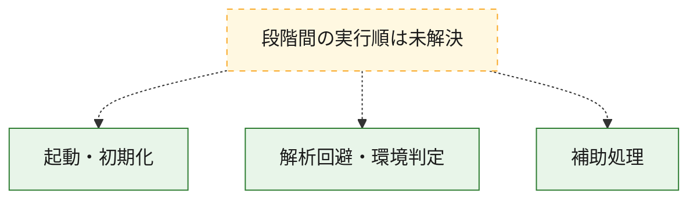
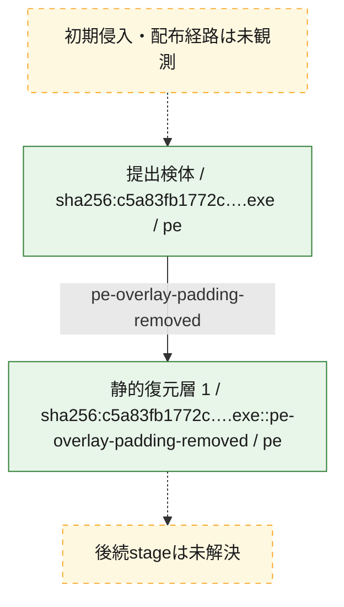
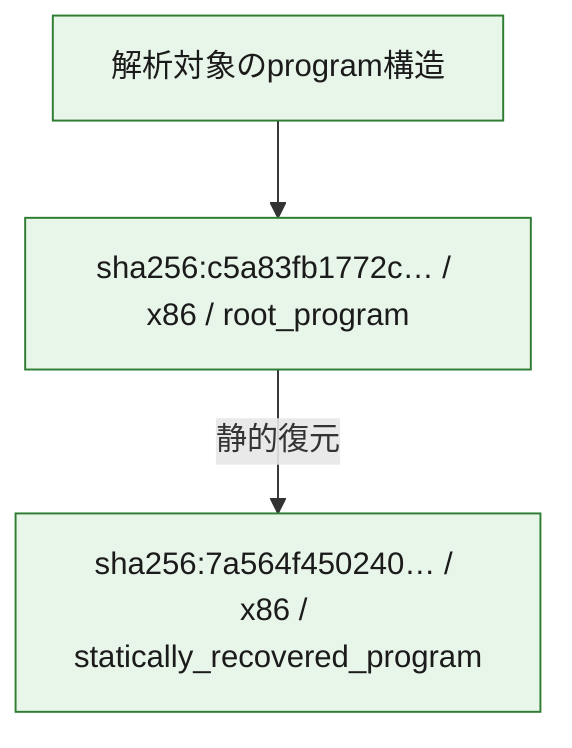

# 全体ロジック：c5a83fb1772c86bf4f5013734080f4023b5738fc8f6f491e6d1ee29c6d41cfdb

代表関数の静的証跡から、起動・初期化、解析回避・環境判定の処理群を確認しました。

## 読み方

- phaseの掲載順は解析上の整理順です。observed_call_edgesがない段階間の実行順を断定しません。
- 図の実線は静的に観測した関係、点線と黄色のノードは未観測・未解決の関係を示します。
- 図は静的な要約であり、動的実行を再現するものではありません。
- 詳細な関数解説とfingerprintは[STATIC-LOGIC.md](STATIC-LOGIC.md)を参照してください。

## 静的可視化

### 実行フロー

### 感染チェーン

### モジュール関係

## 処理段階

### 1. 起動・初期化

entry pointから初期化と後続処理への移行を確認します。
確度: `confirmed_static_function_evidence`

- `7a564f450240322d92813ee74adb206a2708282326ddd3773013ff41e936eab4:ghidra:140013f28` — 初期化と主要処理への分岐を行う入口関数です。 状態: `succeeded`、選定理由: `entry_point`, `meaningful_symbol_name`, `reviewed_call_centrality:22`, `role:entrypoint`
- `c5a83fb1772c86bf4f5013734080f4023b5738fc8f6f491e6d1ee29c6d41cfdb:ghidra:140013f28` — 初期化と主要処理への分岐を行う入口関数です。 状態: `succeeded`、選定理由: `entry_point`, `meaningful_symbol_name`, `reviewed_call_centrality:22`, `role:entrypoint`

### 2. 解析回避・環境判定

debugger、sandbox、仮想環境、時間差などの判定を確認します。
確度: `confirmed_static_function_evidence`

- `7a564f450240322d92813ee74adb206a2708282326ddd3773013ff41e936eab4:ghidra:1400031f0` — debugger、仮想環境、sandbox、または時間差の確認に関係する関数です。 状態: `succeeded`、選定理由: `context_representative`, `reviewed_call_centrality:22`, `role:anti_analysis`
- `c5a83fb1772c86bf4f5013734080f4023b5738fc8f6f491e6d1ee29c6d41cfdb:ghidra:1400031f0` — debugger、仮想環境、sandbox、または時間差の確認に関係する関数です。 状態: `succeeded`、選定理由: `context_representative`, `reviewed_call_centrality:22`, `role:anti_analysis`

### 3. 補助処理

主要処理を支える一般内部関数またはlibrary処理を確認します。
確度: `confirmed_static_function_evidence`

- `7a564f450240322d92813ee74adb206a2708282326ddd3773013ff41e936eab4:ghidra:140001000` — 検体内部の一般処理を実装する関数です。 状態: `succeeded`、選定理由: `context_representative`, `reviewed_call_centrality:9`
- `7a564f450240322d92813ee74adb206a2708282326ddd3773013ff41e936eab4:ghidra:140001070` — 検体内部の一般処理を実装する関数です。 状態: `succeeded`、選定理由: `context_representative`, `reviewed_call_centrality:4`
- `7a564f450240322d92813ee74adb206a2708282326ddd3773013ff41e936eab4:ghidra:1400010c0` — 検体内部の一般処理を実装する関数です。 状態: `succeeded`、選定理由: `context_representative`, `reviewed_call_centrality:8`
- `7a564f450240322d92813ee74adb206a2708282326ddd3773013ff41e936eab4:ghidra:140001240` — 検体内部の一般処理を実装する関数です。 状態: `succeeded`、選定理由: `context_representative`, `reviewed_call_centrality:1`
- `7a564f450240322d92813ee74adb206a2708282326ddd3773013ff41e936eab4:ghidra:140001280` — 検体内部の一般処理を実装する関数です。 状態: `succeeded`、選定理由: `context_representative`, `reviewed_call_centrality:1`
- `7a564f450240322d92813ee74adb206a2708282326ddd3773013ff41e936eab4:ghidra:1400012f0` — 検体内部の一般処理を実装する関数です。 状態: `succeeded`、選定理由: `context_representative`, `reviewed_call_centrality:1`
- `7a564f450240322d92813ee74adb206a2708282326ddd3773013ff41e936eab4:ghidra:140001330` — 検体内部の一般処理を実装する関数です。 状態: `succeeded`、選定理由: `context_representative`, `reviewed_call_centrality:3`
- `7a564f450240322d92813ee74adb206a2708282326ddd3773013ff41e936eab4:ghidra:1400013d0` — 検体内部の一般処理を実装する関数です。 状態: `succeeded`、選定理由: `context_representative`, `reviewed_call_centrality:2`
- `7a564f450240322d92813ee74adb206a2708282326ddd3773013ff41e936eab4:ghidra:140001420` — 検体内部の一般処理を実装する関数です。 状態: `succeeded`、選定理由: `context_representative`, `reviewed_call_centrality:5`
- `7a564f450240322d92813ee74adb206a2708282326ddd3773013ff41e936eab4:ghidra:140001440` — 検体内部の一般処理を実装する関数です。 状態: `succeeded`、選定理由: `context_representative`, `reviewed_call_centrality:4`
- `7a564f450240322d92813ee74adb206a2708282326ddd3773013ff41e936eab4:ghidra:140001460` — 検体内部の一般処理を実装する関数です。 状態: `succeeded`、選定理由: `context_representative`, `reviewed_call_centrality:2`
- `7a564f450240322d92813ee74adb206a2708282326ddd3773013ff41e936eab4:ghidra:140001520` — 検体内部の一般処理を実装する関数です。 状態: `succeeded`、選定理由: `context_representative`, `reviewed_call_centrality:27`
- `7a564f450240322d92813ee74adb206a2708282326ddd3773013ff41e936eab4:ghidra:140001b20` — 検体内部の一般処理を実装する関数です。 状態: `succeeded`、選定理由: `context_representative`, `reviewed_call_centrality:16`
- `7a564f450240322d92813ee74adb206a2708282326ddd3773013ff41e936eab4:ghidra:140001d70` — 検体内部の一般処理を実装する関数です。 状態: `succeeded`、選定理由: `context_representative`, `reviewed_call_centrality:15`
- `7a564f450240322d92813ee74adb206a2708282326ddd3773013ff41e936eab4:ghidra:140002040` — 検体内部の一般処理を実装する関数です。 状態: `succeeded`、選定理由: `context_representative`, `reviewed_call_centrality:7`
- `7a564f450240322d92813ee74adb206a2708282326ddd3773013ff41e936eab4:ghidra:1400021f0` — 検体内部の一般処理を実装する関数です。 状態: `succeeded`、選定理由: `context_representative`, `reviewed_call_centrality:7`
- `7a564f450240322d92813ee74adb206a2708282326ddd3773013ff41e936eab4:ghidra:1400023a0` — 検体内部の一般処理を実装する関数です。 状態: `succeeded`、選定理由: `context_representative`, `reviewed_call_centrality:3`
- `7a564f450240322d92813ee74adb206a2708282326ddd3773013ff41e936eab4:ghidra:140002420` — 検体内部の一般処理を実装する関数です。 状態: `succeeded`、選定理由: `context_representative`, `reviewed_call_centrality:11`
- `7a564f450240322d92813ee74adb206a2708282326ddd3773013ff41e936eab4:ghidra:140002690` — 検体内部の一般処理を実装する関数です。 状態: `succeeded`、選定理由: `context_representative`, `reviewed_call_centrality:6`
- `7a564f450240322d92813ee74adb206a2708282326ddd3773013ff41e936eab4:ghidra:140002750` — 検体内部の一般処理を実装する関数です。 状態: `succeeded`、選定理由: `context_representative`, `reviewed_call_centrality:10`
- `7a564f450240322d92813ee74adb206a2708282326ddd3773013ff41e936eab4:ghidra:140002870` — 検体内部の一般処理を実装する関数です。 状態: `succeeded`、選定理由: `context_representative`, `reviewed_call_centrality:7`
- `7a564f450240322d92813ee74adb206a2708282326ddd3773013ff41e936eab4:ghidra:140002a60` — 検体内部の一般処理を実装する関数です。 状態: `succeeded`、選定理由: `context_representative`, `reviewed_call_centrality:34`
- `7a564f450240322d92813ee74adb206a2708282326ddd3773013ff41e936eab4:ghidra:140002f40` — 検体内部の一般処理を実装する関数です。 状態: `succeeded`、選定理由: `context_representative`, `reviewed_call_centrality:5`
- `7a564f450240322d92813ee74adb206a2708282326ddd3773013ff41e936eab4:ghidra:140003010` — 検体内部の一般処理を実装する関数です。 状態: `succeeded`、選定理由: `context_representative`, `reviewed_call_centrality:3`
- `7a564f450240322d92813ee74adb206a2708282326ddd3773013ff41e936eab4:ghidra:140003070` — 検体内部の一般処理を実装する関数です。 状態: `succeeded`、選定理由: `context_representative`, `reviewed_call_centrality:1`
- `7a564f450240322d92813ee74adb206a2708282326ddd3773013ff41e936eab4:ghidra:1400030a0` — 検体内部の一般処理を実装する関数です。 状態: `succeeded`、選定理由: `context_representative`, `reviewed_call_centrality:7`
- `7a564f450240322d92813ee74adb206a2708282326ddd3773013ff41e936eab4:ghidra:140003810` — 検体内部の一般処理を実装する関数です。 状態: `succeeded`、選定理由: `context_representative`, `reviewed_call_centrality:9`
- `7a564f450240322d92813ee74adb206a2708282326ddd3773013ff41e936eab4:ghidra:140003920` — 検体内部の一般処理を実装する関数です。 状態: `succeeded`、選定理由: `context_representative`, `reviewed_call_centrality:4`
- `7a564f450240322d92813ee74adb206a2708282326ddd3773013ff41e936eab4:ghidra:1400039e0` — 検体内部の一般処理を実装する関数です。 状態: `succeeded`、選定理由: `context_representative`, `reviewed_call_centrality:2`
- `7a564f450240322d92813ee74adb206a2708282326ddd3773013ff41e936eab4:ghidra:140014474` — 検体内部の一般処理を実装する関数です。 状態: `succeeded`、選定理由: `meaningful_symbol_name`
- `c5a83fb1772c86bf4f5013734080f4023b5738fc8f6f491e6d1ee29c6d41cfdb:ghidra:140001000` — 検体内部の一般処理を実装する関数です。 状態: `succeeded`、選定理由: `context_representative`, `reviewed_call_centrality:9`
- `c5a83fb1772c86bf4f5013734080f4023b5738fc8f6f491e6d1ee29c6d41cfdb:ghidra:140001070` — 検体内部の一般処理を実装する関数です。 状態: `succeeded`、選定理由: `context_representative`, `reviewed_call_centrality:4`
- `c5a83fb1772c86bf4f5013734080f4023b5738fc8f6f491e6d1ee29c6d41cfdb:ghidra:1400010c0` — 検体内部の一般処理を実装する関数です。 状態: `succeeded`、選定理由: `context_representative`, `reviewed_call_centrality:8`
- `c5a83fb1772c86bf4f5013734080f4023b5738fc8f6f491e6d1ee29c6d41cfdb:ghidra:140001240` — 検体内部の一般処理を実装する関数です。 状態: `succeeded`、選定理由: `context_representative`, `reviewed_call_centrality:1`
- `c5a83fb1772c86bf4f5013734080f4023b5738fc8f6f491e6d1ee29c6d41cfdb:ghidra:140001280` — 検体内部の一般処理を実装する関数です。 状態: `succeeded`、選定理由: `context_representative`, `reviewed_call_centrality:1`
- `c5a83fb1772c86bf4f5013734080f4023b5738fc8f6f491e6d1ee29c6d41cfdb:ghidra:1400012f0` — 検体内部の一般処理を実装する関数です。 状態: `succeeded`、選定理由: `context_representative`, `reviewed_call_centrality:1`
- `c5a83fb1772c86bf4f5013734080f4023b5738fc8f6f491e6d1ee29c6d41cfdb:ghidra:140001330` — 検体内部の一般処理を実装する関数です。 状態: `succeeded`、選定理由: `context_representative`, `reviewed_call_centrality:3`
- `c5a83fb1772c86bf4f5013734080f4023b5738fc8f6f491e6d1ee29c6d41cfdb:ghidra:1400013d0` — 検体内部の一般処理を実装する関数です。 状態: `succeeded`、選定理由: `context_representative`, `reviewed_call_centrality:2`
- `c5a83fb1772c86bf4f5013734080f4023b5738fc8f6f491e6d1ee29c6d41cfdb:ghidra:140001420` — 検体内部の一般処理を実装する関数です。 状態: `succeeded`、選定理由: `context_representative`, `reviewed_call_centrality:5`
- `c5a83fb1772c86bf4f5013734080f4023b5738fc8f6f491e6d1ee29c6d41cfdb:ghidra:140001440` — 検体内部の一般処理を実装する関数です。 状態: `succeeded`、選定理由: `context_representative`, `reviewed_call_centrality:4`
- `c5a83fb1772c86bf4f5013734080f4023b5738fc8f6f491e6d1ee29c6d41cfdb:ghidra:140001460` — 検体内部の一般処理を実装する関数です。 状態: `succeeded`、選定理由: `context_representative`, `reviewed_call_centrality:2`
- `c5a83fb1772c86bf4f5013734080f4023b5738fc8f6f491e6d1ee29c6d41cfdb:ghidra:140001520` — 検体内部の一般処理を実装する関数です。 状態: `succeeded`、選定理由: `context_representative`, `reviewed_call_centrality:27`
- `c5a83fb1772c86bf4f5013734080f4023b5738fc8f6f491e6d1ee29c6d41cfdb:ghidra:140001b20` — 検体内部の一般処理を実装する関数です。 状態: `succeeded`、選定理由: `context_representative`, `reviewed_call_centrality:16`
- `c5a83fb1772c86bf4f5013734080f4023b5738fc8f6f491e6d1ee29c6d41cfdb:ghidra:140001d70` — 検体内部の一般処理を実装する関数です。 状態: `succeeded`、選定理由: `context_representative`, `reviewed_call_centrality:15`
- `c5a83fb1772c86bf4f5013734080f4023b5738fc8f6f491e6d1ee29c6d41cfdb:ghidra:140002040` — 検体内部の一般処理を実装する関数です。 状態: `succeeded`、選定理由: `context_representative`, `reviewed_call_centrality:7`
- `c5a83fb1772c86bf4f5013734080f4023b5738fc8f6f491e6d1ee29c6d41cfdb:ghidra:1400021f0` — 検体内部の一般処理を実装する関数です。 状態: `succeeded`、選定理由: `context_representative`, `reviewed_call_centrality:7`
- `c5a83fb1772c86bf4f5013734080f4023b5738fc8f6f491e6d1ee29c6d41cfdb:ghidra:1400023a0` — 検体内部の一般処理を実装する関数です。 状態: `succeeded`、選定理由: `context_representative`, `reviewed_call_centrality:3`
- `c5a83fb1772c86bf4f5013734080f4023b5738fc8f6f491e6d1ee29c6d41cfdb:ghidra:140002420` — 検体内部の一般処理を実装する関数です。 状態: `succeeded`、選定理由: `context_representative`, `reviewed_call_centrality:11`
- `c5a83fb1772c86bf4f5013734080f4023b5738fc8f6f491e6d1ee29c6d41cfdb:ghidra:140002690` — 検体内部の一般処理を実装する関数です。 状態: `succeeded`、選定理由: `context_representative`, `reviewed_call_centrality:6`
- `c5a83fb1772c86bf4f5013734080f4023b5738fc8f6f491e6d1ee29c6d41cfdb:ghidra:140002750` — 検体内部の一般処理を実装する関数です。 状態: `succeeded`、選定理由: `context_representative`, `reviewed_call_centrality:10`
- `c5a83fb1772c86bf4f5013734080f4023b5738fc8f6f491e6d1ee29c6d41cfdb:ghidra:140002870` — 検体内部の一般処理を実装する関数です。 状態: `succeeded`、選定理由: `context_representative`, `reviewed_call_centrality:7`
- `c5a83fb1772c86bf4f5013734080f4023b5738fc8f6f491e6d1ee29c6d41cfdb:ghidra:140002a60` — 検体内部の一般処理を実装する関数です。 状態: `succeeded`、選定理由: `context_representative`, `reviewed_call_centrality:34`
- `c5a83fb1772c86bf4f5013734080f4023b5738fc8f6f491e6d1ee29c6d41cfdb:ghidra:140002f40` — 検体内部の一般処理を実装する関数です。 状態: `succeeded`、選定理由: `context_representative`, `reviewed_call_centrality:5`
- `c5a83fb1772c86bf4f5013734080f4023b5738fc8f6f491e6d1ee29c6d41cfdb:ghidra:140003010` — 検体内部の一般処理を実装する関数です。 状態: `succeeded`、選定理由: `context_representative`, `reviewed_call_centrality:3`
- `c5a83fb1772c86bf4f5013734080f4023b5738fc8f6f491e6d1ee29c6d41cfdb:ghidra:140003070` — 検体内部の一般処理を実装する関数です。 状態: `succeeded`、選定理由: `context_representative`, `reviewed_call_centrality:1`
- `c5a83fb1772c86bf4f5013734080f4023b5738fc8f6f491e6d1ee29c6d41cfdb:ghidra:1400030a0` — 検体内部の一般処理を実装する関数です。 状態: `succeeded`、選定理由: `context_representative`, `reviewed_call_centrality:7`
- `c5a83fb1772c86bf4f5013734080f4023b5738fc8f6f491e6d1ee29c6d41cfdb:ghidra:140003810` — 検体内部の一般処理を実装する関数です。 状態: `succeeded`、選定理由: `context_representative`, `reviewed_call_centrality:9`
- `c5a83fb1772c86bf4f5013734080f4023b5738fc8f6f491e6d1ee29c6d41cfdb:ghidra:140003920` — 検体内部の一般処理を実装する関数です。 状態: `succeeded`、選定理由: `context_representative`, `reviewed_call_centrality:4`
- `c5a83fb1772c86bf4f5013734080f4023b5738fc8f6f491e6d1ee29c6d41cfdb:ghidra:1400039e0` — 検体内部の一般処理を実装する関数です。 状態: `succeeded`、選定理由: `context_representative`, `reviewed_call_centrality:2`
- `c5a83fb1772c86bf4f5013734080f4023b5738fc8f6f491e6d1ee29c6d41cfdb:ghidra:140014474` — 検体内部の一般処理を実装する関数です。 状態: `succeeded`、選定理由: `meaningful_symbol_name`

## 観測したcall関係

- 代表関数間で直接解決できた呼出関係はありません。

## 解析範囲と制約

- 選定外関数は全体inventoryへ残しますが、関数本体の個別解説対象にはしていません。
- indirect call、難読化、packer、VM、壊れたcontrol flowによりcall関係が欠落する場合があります。
- 文書は静的解析に基づき、検体実行や外部通信による動的確認は行っていません。
