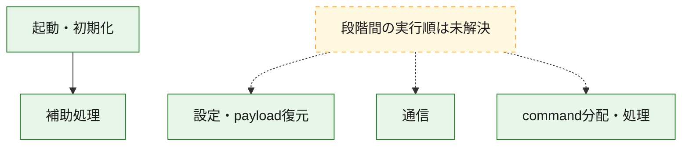
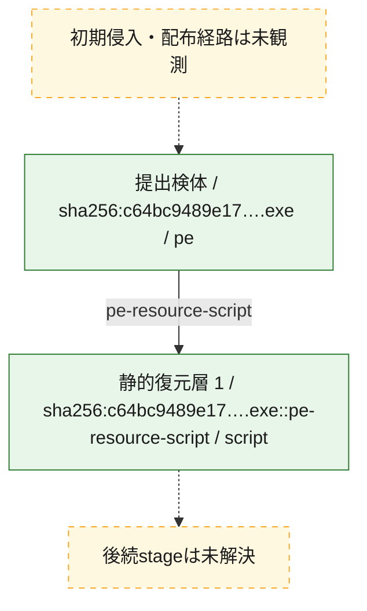
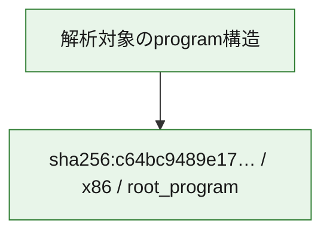

# 全体ロジック：c64bc9489e1711e146a6705470f5065094853bc15840ea02f0f0e38fd2552b5d

代表関数の静的証跡から、起動・初期化、設定・payload復元、通信、command分配・処理の処理群を確認しました。

## 読み方

- phaseの掲載順は解析上の整理順です。observed_call_edgesがない段階間の実行順を断定しません。
- 図の実線は静的に観測した関係、点線と黄色のノードは未観測・未解決の関係を示します。
- 図は静的な要約であり、動的実行を再現するものではありません。
- 詳細な関数解説とfingerprintは[STATIC-LOGIC.md](STATIC-LOGIC.md)を参照してください。

## 静的可視化

### 実行フロー

### 感染チェーン

### モジュール関係

## 処理段階

### 1. 起動・初期化

entry pointから初期化と後続処理への移行を確認します。
確度: `confirmed_static_function_evidence`

- `c64bc9489e1711e146a6705470f5065094853bc15840ea02f0f0e38fd2552b5d:ghidra:00646fc0` — 初期化と主要処理への分岐を行う入口関数です。 状態: `succeeded`、選定理由: `entry_point`, `meaningful_symbol_name`, `reviewed_call_centrality:22`, `role:entrypoint`

### 2. 設定・payload復元

設定、resource、payload、暗号化データの復元・変換を確認します。
確度: `confirmed_static_function_evidence_with_limits`

- `c64bc9489e1711e146a6705470f5065094853bc15840ea02f0f0e38fd2552b5d:ghidra:0064031e` — 設定、resource、payloadなどの解析・変換を行う関数です。 状態: `limited_bad_instruction_or_flow`、選定理由: `meaningful_symbol_name`, `reviewed_call_centrality:1`, `role:config_or_data_transform`

### 3. 通信

通信初期化、endpoint処理、送受信の役割を確認します。
確度: `confirmed_static_function_evidence_with_limits`

- `c64bc9489e1711e146a6705470f5065094853bc15840ea02f0f0e38fd2552b5d:ghidra:00640115` — 通信初期化、送受信、またはendpoint処理に関係する関数です。 状態: `limited_bad_instruction_or_flow`、選定理由: `meaningful_symbol_name`, `reviewed_call_centrality:1`, `role:network_communication`
- `c64bc9489e1711e146a6705470f5065094853bc15840ea02f0f0e38fd2552b5d:ghidra:00640364` — 通信初期化、送受信、またはendpoint処理に関係する関数です。 状態: `limited_bad_instruction_or_flow`、選定理由: `meaningful_symbol_name`, `reviewed_call_centrality:1`, `role:network_communication`
- `c64bc9489e1711e146a6705470f5065094853bc15840ea02f0f0e38fd2552b5d:ghidra:0066f35f` — 通信初期化、送受信、またはendpoint処理に関係する関数です。 状態: `limited_bad_instruction_or_flow`、選定理由: `meaningful_symbol_name`, `reviewed_call_centrality:1`, `role:network_communication`
- `c64bc9489e1711e146a6705470f5065094853bc15840ea02f0f0e38fd2552b5d:ghidra:0066f373` — 通信初期化、送受信、またはendpoint処理に関係する関数です。 状態: `limited_bad_instruction_or_flow`、選定理由: `meaningful_symbol_name`, `reviewed_call_centrality:1`, `role:network_communication`
- `c64bc9489e1711e146a6705470f5065094853bc15840ea02f0f0e38fd2552b5d:ghidra:0066f5ef` — 通信初期化、送受信、またはendpoint処理に関係する関数です。 状態: `limited_bad_instruction_or_flow`、選定理由: `meaningful_symbol_name`, `reviewed_call_centrality:1`, `role:network_communication`
- `c64bc9489e1711e146a6705470f5065094853bc15840ea02f0f0e38fd2552b5d:ghidra:0066f635` — 通信初期化、送受信、またはendpoint処理に関係する関数です。 状態: `failed`、選定理由: `meaningful_symbol_name`, `reviewed_call_centrality:1`, `role:network_communication`

### 4. command分配・処理

受信commandやtaskの解釈、分配、個別handlerへの移行を確認します。
確度: `confirmed_static_function_evidence_with_limits`

- `c64bc9489e1711e146a6705470f5065094853bc15840ea02f0f0e38fd2552b5d:ghidra:006403c8` — commandの解釈、分配、または個別処理を担当する関数です。 状態: `limited_bad_instruction_or_flow`、選定理由: `meaningful_symbol_name`, `reviewed_call_centrality:1`, `role:command_dispatch_or_handler`
- `c64bc9489e1711e146a6705470f5065094853bc15840ea02f0f0e38fd2552b5d:ghidra:006407ed` — commandの解釈、分配、または個別処理を担当する関数です。 状態: `limited_bad_instruction_or_flow`、選定理由: `meaningful_symbol_name`, `reviewed_call_centrality:1`, `role:command_dispatch_or_handler`
- `c64bc9489e1711e146a6705470f5065094853bc15840ea02f0f0e38fd2552b5d:ghidra:006407f7` — commandの解釈、分配、または個別処理を担当する関数です。 状態: `limited_bad_instruction_or_flow`、選定理由: `meaningful_symbol_name`, `reviewed_call_centrality:1`, `role:command_dispatch_or_handler`
- `c64bc9489e1711e146a6705470f5065094853bc15840ea02f0f0e38fd2552b5d:ghidra:0066f387` — commandの解釈、分配、または個別処理を担当する関数です。 状態: `limited_bad_instruction_or_flow`、選定理由: `meaningful_symbol_name`, `reviewed_call_centrality:1`, `role:command_dispatch_or_handler`

### 5. 補助処理

主要処理を支える一般内部関数またはlibrary処理を確認します。
確度: `confirmed_static_function_evidence_with_limits`

- `c64bc9489e1711e146a6705470f5065094853bc15840ea02f0f0e38fd2552b5d:ghidra:00408440` — 検体内部の一般処理を実装する関数です。 状態: `succeeded`、選定理由: `meaningful_symbol_name`, `reviewed_call_centrality:3`
- `c64bc9489e1711e146a6705470f5065094853bc15840ea02f0f0e38fd2552b5d:ghidra:0063fd4a` — 検体内部の一般処理を実装する関数です。 状態: `limited_bad_instruction_or_flow`、選定理由: `meaningful_symbol_name`, `reviewed_call_centrality:1`
- `c64bc9489e1711e146a6705470f5065094853bc15840ea02f0f0e38fd2552b5d:ghidra:0063fd65` — 検体内部の一般処理を実装する関数です。 状態: `limited_bad_instruction_or_flow`、選定理由: `meaningful_symbol_name`, `reviewed_call_centrality:1`
- `c64bc9489e1711e146a6705470f5065094853bc15840ea02f0f0e38fd2552b5d:ghidra:0063fd6f` — 検体内部の一般処理を実装する関数です。 状態: `limited_bad_instruction_or_flow`、選定理由: `meaningful_symbol_name`, `reviewed_call_centrality:1`
- `c64bc9489e1711e146a6705470f5065094853bc15840ea02f0f0e38fd2552b5d:ghidra:0063fd8a` — 検体内部の一般処理を実装する関数です。 状態: `limited_bad_instruction_or_flow`、選定理由: `meaningful_symbol_name`, `reviewed_call_centrality:1`
- `c64bc9489e1711e146a6705470f5065094853bc15840ea02f0f0e38fd2552b5d:ghidra:0063fdaa` — 検体内部の一般処理を実装する関数です。 状態: `limited_bad_instruction_or_flow`、選定理由: `meaningful_symbol_name`, `reviewed_call_centrality:1`
- `c64bc9489e1711e146a6705470f5065094853bc15840ea02f0f0e38fd2552b5d:ghidra:0063fdb4` — 検体内部の一般処理を実装する関数です。 状態: `limited_bad_instruction_or_flow`、選定理由: `meaningful_symbol_name`, `reviewed_call_centrality:1`
- `c64bc9489e1711e146a6705470f5065094853bc15840ea02f0f0e38fd2552b5d:ghidra:0063fdbe` — 検体内部の一般処理を実装する関数です。 状態: `limited_bad_instruction_or_flow`、選定理由: `meaningful_symbol_name`, `reviewed_call_centrality:1`
- `c64bc9489e1711e146a6705470f5065094853bc15840ea02f0f0e38fd2552b5d:ghidra:0063fdc8` — 検体内部の一般処理を実装する関数です。 状態: `limited_bad_instruction_or_flow`、選定理由: `meaningful_symbol_name`, `reviewed_call_centrality:1`
- `c64bc9489e1711e146a6705470f5065094853bc15840ea02f0f0e38fd2552b5d:ghidra:0063fe1a` — 検体内部の一般処理を実装する関数です。 状態: `limited_bad_instruction_or_flow`、選定理由: `meaningful_symbol_name`, `reviewed_call_centrality:1`
- `c64bc9489e1711e146a6705470f5065094853bc15840ea02f0f0e38fd2552b5d:ghidra:0063fe24` — 検体内部の一般処理を実装する関数です。 状態: `limited_bad_instruction_or_flow`、選定理由: `meaningful_symbol_name`, `reviewed_call_centrality:1`
- `c64bc9489e1711e146a6705470f5065094853bc15840ea02f0f0e38fd2552b5d:ghidra:0063fe2e` — 検体内部の一般処理を実装する関数です。 状態: `limited_bad_instruction_or_flow`、選定理由: `meaningful_symbol_name`, `reviewed_call_centrality:1`
- `c64bc9489e1711e146a6705470f5065094853bc15840ea02f0f0e38fd2552b5d:ghidra:0063fe38` — 検体内部の一般処理を実装する関数です。 状態: `limited_bad_instruction_or_flow`、選定理由: `meaningful_symbol_name`, `reviewed_call_centrality:1`
- `c64bc9489e1711e146a6705470f5065094853bc15840ea02f0f0e38fd2552b5d:ghidra:0063fe53` — 検体内部の一般処理を実装する関数です。 状態: `limited_bad_instruction_or_flow`、選定理由: `meaningful_symbol_name`, `reviewed_call_centrality:1`
- `c64bc9489e1711e146a6705470f5065094853bc15840ea02f0f0e38fd2552b5d:ghidra:0063fe5d` — 検体内部の一般処理を実装する関数です。 状態: `limited_bad_instruction_or_flow`、選定理由: `meaningful_symbol_name`, `reviewed_call_centrality:1`
- `c64bc9489e1711e146a6705470f5065094853bc15840ea02f0f0e38fd2552b5d:ghidra:0063fe67` — 検体内部の一般処理を実装する関数です。 状態: `limited_bad_instruction_or_flow`、選定理由: `meaningful_symbol_name`, `reviewed_call_centrality:1`
- `c64bc9489e1711e146a6705470f5065094853bc15840ea02f0f0e38fd2552b5d:ghidra:0063fe71` — 検体内部の一般処理を実装する関数です。 状態: `limited_bad_instruction_or_flow`、選定理由: `meaningful_symbol_name`, `reviewed_call_centrality:1`
- `c64bc9489e1711e146a6705470f5065094853bc15840ea02f0f0e38fd2552b5d:ghidra:0063fe7b` — 検体内部の一般処理を実装する関数です。 状態: `limited_bad_instruction_or_flow`、選定理由: `meaningful_symbol_name`, `reviewed_call_centrality:1`
- `c64bc9489e1711e146a6705470f5065094853bc15840ea02f0f0e38fd2552b5d:ghidra:0066fc20` — compiler生成処理または汎用library処理とみられる関数です。 状態: `succeeded`、選定理由: `entry_point`, `meaningful_symbol_name`, `reviewed_call_centrality:1`
- `c64bc9489e1711e146a6705470f5065094853bc15840ea02f0f0e38fd2552b5d:ghidra:0066fcb0` — compiler生成処理または汎用library処理とみられる関数です。 状態: `succeeded`、選定理由: `entry_point`, `meaningful_symbol_name`, `reviewed_call_centrality:2`

## 観測したcall関係

- `c64bc9489e1711e146a6705470f5065094853bc15840ea02f0f0e38fd2552b5d:ghidra:00646fc0` → `c64bc9489e1711e146a6705470f5065094853bc15840ea02f0f0e38fd2552b5d:ghidra:00408440` （`startup` → `support`）
- `c64bc9489e1711e146a6705470f5065094853bc15840ea02f0f0e38fd2552b5d:ghidra:0066fc20` → `c64bc9489e1711e146a6705470f5065094853bc15840ea02f0f0e38fd2552b5d:ghidra:00408440` （`support` → `support`）
- `c64bc9489e1711e146a6705470f5065094853bc15840ea02f0f0e38fd2552b5d:ghidra:0066fcb0` → `c64bc9489e1711e146a6705470f5065094853bc15840ea02f0f0e38fd2552b5d:ghidra:00408440` （`support` → `support`）
- `ghidra-function:07c48762cb6a747de96457c8` → `ghidra-external:c3e2a22b3e3dc155aa839b0e` （`unclassified` → `unclassified`）
- `ghidra-function:2748c3321206cd04b0d4ef2b` → `ghidra-external:c3e2a22b3e3dc155aa839b0e` （`unclassified` → `unclassified`）
- `ghidra-function:2c600d9b9aac3354b00cd430` → `ghidra-external:c3e2a22b3e3dc155aa839b0e` （`unclassified` → `unclassified`）
- `ghidra-function:2fec140a1b1b48d7ea2fd6f2` → `ghidra-external:c3e2a22b3e3dc155aa839b0e` （`unclassified` → `unclassified`）
- `ghidra-function:3540cb33bd7dfb2df3f27474` → `ghidra-external:7c90f01c997cd6c40cc775f1` （`unclassified` → `unclassified`）
- `ghidra-function:3540cb33bd7dfb2df3f27474` → `ghidra-function:cd7f7347486a8a04ba172fd1` （`unclassified` → `unclassified`）
- `ghidra-function:39344f4eff93ab9e2f7cb9a4` → `ghidra-external:c3e2a22b3e3dc155aa839b0e` （`unclassified` → `unclassified`）
- `ghidra-function:39e73a8e76732099d87921e2` → `ghidra-external:c3e2a22b3e3dc155aa839b0e` （`unclassified` → `unclassified`）
- `ghidra-function:49b9577fb5db1927e8ecc1cf` → `ghidra-external:c3e2a22b3e3dc155aa839b0e` （`unclassified` → `unclassified`）
- `ghidra-function:5583303a3c763e93a76a8064` → `ghidra-external:c3e2a22b3e3dc155aa839b0e` （`unclassified` → `unclassified`）
- `ghidra-function:577a7befae2af76a4c47766b` → `ghidra-external:c3e2a22b3e3dc155aa839b0e` （`unclassified` → `unclassified`）
- `ghidra-function:5a4ff5300f49ba635df47b96` → `ghidra-external:c3e2a22b3e3dc155aa839b0e` （`unclassified` → `unclassified`）
- `ghidra-function:60701d7469e64e4815391d0f` → `ghidra-external:c3e2a22b3e3dc155aa839b0e` （`unclassified` → `unclassified`）
- `ghidra-function:67ce2ed3ab874c9db5196ed8` → `ghidra-external:c3e2a22b3e3dc155aa839b0e` （`unclassified` → `unclassified`）
- `ghidra-function:76e5a38d6490cdb14168269d` → `ghidra-external:c3e2a22b3e3dc155aa839b0e` （`unclassified` → `unclassified`）
- `ghidra-function:84143821c9866590ac922c7b` → `ghidra-external:c3e2a22b3e3dc155aa839b0e` （`unclassified` → `unclassified`）
- `ghidra-function:8ae99e44bc2e3c87f7c57ed7` → `ghidra-external:c3e2a22b3e3dc155aa839b0e` （`unclassified` → `unclassified`）
- `ghidra-function:8c4e3a28301f4b712c5dab6c` → `ghidra-external:c3e2a22b3e3dc155aa839b0e` （`unclassified` → `unclassified`）
- `ghidra-function:9cd239edca297e6a7bf258fe` → `ghidra-external:c3e2a22b3e3dc155aa839b0e` （`unclassified` → `unclassified`）
- `ghidra-function:9e81ae086139972941145128` → `ghidra-external:c3e2a22b3e3dc155aa839b0e` （`unclassified` → `unclassified`）
- `ghidra-function:a26b2bf1147f499b5227c9c8` → `ghidra-external:c3e2a22b3e3dc155aa839b0e` （`unclassified` → `unclassified`）
- `ghidra-function:a9815261cfc2b6681fd7dc95` → `ghidra-external:c3e2a22b3e3dc155aa839b0e` （`unclassified` → `unclassified`）
- `ghidra-function:aac3787a6941507a9e90891e` → `ghidra-external:c3e2a22b3e3dc155aa839b0e` （`unclassified` → `unclassified`）
- `ghidra-function:b9767ed98276644e06af6cc8` → `ghidra-external:c3e2a22b3e3dc155aa839b0e` （`unclassified` → `unclassified`）
- `ghidra-function:bf1592f3a788640301bb8b8f` → `ghidra-external:04242feb25613d3510a68c59` （`unclassified` → `unclassified`）
- `ghidra-function:bf1592f3a788640301bb8b8f` → `ghidra-external:19b8636a7e912fd36f9c7267` （`unclassified` → `unclassified`）
- `ghidra-function:bf1592f3a788640301bb8b8f` → `ghidra-external:1feaffaa4aec81106e19bc1c` （`unclassified` → `unclassified`）
- `ghidra-function:bf1592f3a788640301bb8b8f` → `ghidra-external:2c2749e4d0293654a120bf2a` （`unclassified` → `unclassified`）
- `ghidra-function:bf1592f3a788640301bb8b8f` → `ghidra-external:30dfc95011abaae8d03aa2bd` （`unclassified` → `unclassified`）
- `ghidra-function:bf1592f3a788640301bb8b8f` → `ghidra-external:42e86a81a68187c5b3ed75d6` （`unclassified` → `unclassified`）
- `ghidra-function:bf1592f3a788640301bb8b8f` → `ghidra-external:45d8b5c00f5f6204c43efcd4` （`unclassified` → `unclassified`）
- `ghidra-function:bf1592f3a788640301bb8b8f` → `ghidra-external:52d772c888a2bb4a91700888` （`unclassified` → `unclassified`）
- `ghidra-function:bf1592f3a788640301bb8b8f` → `ghidra-external:5eb5c4bc8128f019fe571560` （`unclassified` → `unclassified`）
- `ghidra-function:bf1592f3a788640301bb8b8f` → `ghidra-external:817a04dfcbdcd16c365913ad` （`unclassified` → `unclassified`）
- `ghidra-function:bf1592f3a788640301bb8b8f` → `ghidra-external:82d1ce77676624bc3e59a012` （`unclassified` → `unclassified`）
- `ghidra-function:bf1592f3a788640301bb8b8f` → `ghidra-external:965ed8ed111e92429e418a06` （`unclassified` → `unclassified`）
- `ghidra-function:bf1592f3a788640301bb8b8f` → `ghidra-external:99648d96db4f36859c5e29b8` （`unclassified` → `unclassified`）
- `ghidra-function:bf1592f3a788640301bb8b8f` → `ghidra-external:bc8e336b53b1da80033e5f80` （`unclassified` → `unclassified`）
- `ghidra-function:bf1592f3a788640301bb8b8f` → `ghidra-external:cf92df970905d0688ec81fa5` （`unclassified` → `unclassified`）
- `ghidra-function:bf1592f3a788640301bb8b8f` → `ghidra-external:d8e019ef605fbaa8d3f11a8b` （`unclassified` → `unclassified`）
- `ghidra-function:bf1592f3a788640301bb8b8f` → `ghidra-external:e428b48a45b24a751c82d6d5` （`unclassified` → `unclassified`）
- `ghidra-function:bf1592f3a788640301bb8b8f` → `ghidra-external:f64744aba494c4024a7cc5dd` （`unclassified` → `unclassified`）
- `ghidra-function:bf1592f3a788640301bb8b8f` → `ghidra-external:f71680e8c40a8101a1ff57bf` （`unclassified` → `unclassified`）
- `ghidra-function:bf1592f3a788640301bb8b8f` → `ghidra-external:f9c77aa29599d25ff0548f98` （`unclassified` → `unclassified`）
- `ghidra-function:bf1592f3a788640301bb8b8f` → `ghidra-function:68edaf3182a83f99c847f15f` （`unclassified` → `unclassified`）
- `ghidra-function:bf1592f3a788640301bb8b8f` → `ghidra-function:cd7f7347486a8a04ba172fd1` （`unclassified` → `unclassified`）
- `ghidra-function:ce07fc0dc110e3253a8740c1` → `ghidra-external:c3e2a22b3e3dc155aa839b0e` （`unclassified` → `unclassified`）
- `ghidra-function:d62a3f8f26424b032c6293ca` → `ghidra-external:c3e2a22b3e3dc155aa839b0e` （`unclassified` → `unclassified`）
- `ghidra-function:de642edcbf755a7655d470d4` → `ghidra-external:c3e2a22b3e3dc155aa839b0e` （`unclassified` → `unclassified`）
- `ghidra-function:eae6054e9db8fe90b64d6adb` → `ghidra-external:c3e2a22b3e3dc155aa839b0e` （`unclassified` → `unclassified`）
- `ghidra-function:f2e2accd0989825728900ac8` → `ghidra-function:cd7f7347486a8a04ba172fd1` （`unclassified` → `unclassified`）
- `ghidra-function:f8e8633416d57994a88edcc6` → `ghidra-external:c3e2a22b3e3dc155aa839b0e` （`unclassified` → `unclassified`）
- `ghidra-function:fa5ac59f97d720ada99e4c30` → `ghidra-external:c3e2a22b3e3dc155aa839b0e` （`unclassified` → `unclassified`）

## 解析範囲と制約

- 選定外関数は全体inventoryへ残しますが、関数本体の個別解説対象にはしていません。
- indirect call、難読化、packer、VM、壊れたcontrol flowによりcall関係が欠落する場合があります。
- 文書は静的解析に基づき、検体実行や外部通信による動的確認は行っていません。
