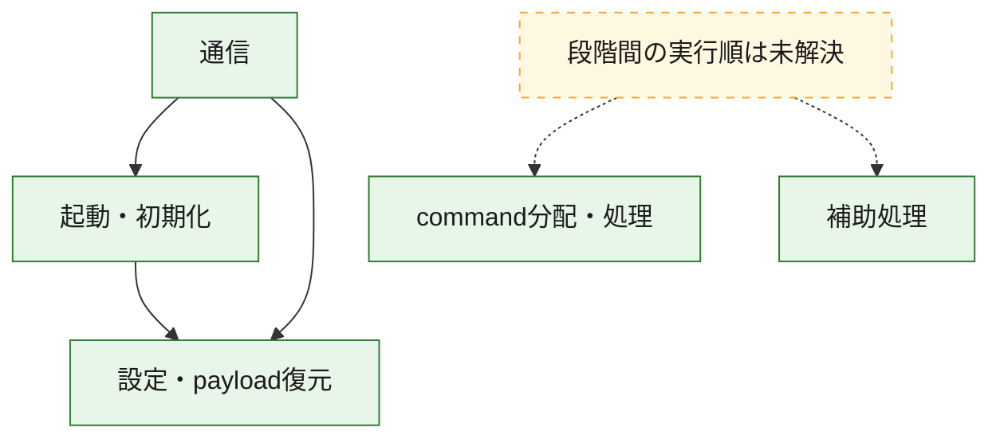
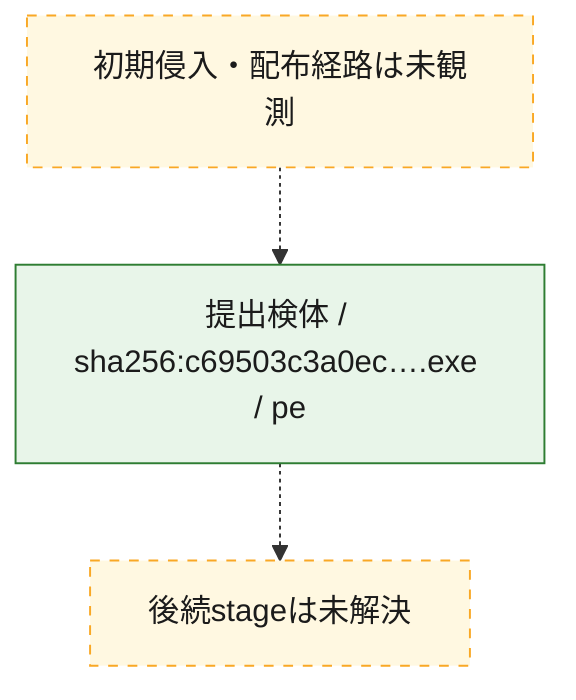
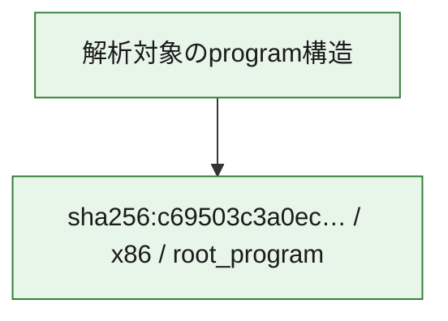

# 全体ロジック：c69503c3a0ec75e2b23aea930a12a879b96fb078c5f827a0eecaa9e766781dbc

代表関数の静的証跡から、起動・初期化、設定・payload復元、通信、command分配・処理の処理群を確認しました。

## 読み方

- phaseの掲載順は解析上の整理順です。observed_call_edgesがない段階間の実行順を断定しません。
- 図の実線は静的に観測した関係、点線と黄色のノードは未観測・未解決の関係を示します。
- 図は静的な要約であり、動的実行を再現するものではありません。
- 詳細な関数解説とfingerprintは[STATIC-LOGIC.md](STATIC-LOGIC.md)を参照してください。

## 静的可視化

### 実行フロー

### 感染チェーン

### モジュール関係

## 処理段階

### 1. 起動・初期化

entry pointから初期化と後続処理への移行を確認します。
確度: `confirmed_static_function_evidence`

- `c69503c3a0ec75e2b23aea930a12a879b96fb078c5f827a0eecaa9e766781dbc:ghidra:140009957` — 初期化と主要処理への分岐を行う入口関数です。 状態: `succeeded`、選定理由: `entry_point`, `meaningful_symbol_name`, `reviewed_call_centrality:7`, `role:entrypoint`
- `c69503c3a0ec75e2b23aea930a12a879b96fb078c5f827a0eecaa9e766781dbc:ghidra:14000fd04` — 初期化と主要処理への分岐を行う入口関数です。 状態: `succeeded`、選定理由: `entry_point`, `meaningful_symbol_name`, `probable_go_main_user_code`, `reviewed_call_centrality:23`, `role:entrypoint`

### 2. 設定・payload復元

設定、resource、payload、暗号化データの復元・変換を確認します。
確度: `confirmed_static_function_evidence`

- `c69503c3a0ec75e2b23aea930a12a879b96fb078c5f827a0eecaa9e766781dbc:ghidra:1400016e1` — 設定、resource、payloadなどの解析・変換を行う関数です。 状態: `succeeded`、選定理由: `meaningful_symbol_name`, `reviewed_call_centrality:1`, `role:config_or_data_transform`
- `c69503c3a0ec75e2b23aea930a12a879b96fb078c5f827a0eecaa9e766781dbc:ghidra:140001c94` — 設定、resource、payloadなどの解析・変換を行う関数です。 状態: `succeeded`、選定理由: `meaningful_symbol_name`, `reviewed_call_centrality:1`, `role:config_or_data_transform`
- `c69503c3a0ec75e2b23aea930a12a879b96fb078c5f827a0eecaa9e766781dbc:ghidra:1400022ae` — 暗号、hash、encoding、または復号処理に関係する関数です。 状態: `succeeded`、選定理由: `meaningful_symbol_name`, `reviewed_call_centrality:4`, `role:cryptographic_transform`
- `c69503c3a0ec75e2b23aea930a12a879b96fb078c5f827a0eecaa9e766781dbc:ghidra:140002ecc` — 暗号、hash、encoding、または復号処理に関係する関数です。 状態: `succeeded`、選定理由: `meaningful_symbol_name`, `reviewed_call_centrality:4`, `role:cryptographic_transform`
- `c69503c3a0ec75e2b23aea930a12a879b96fb078c5f827a0eecaa9e766781dbc:ghidra:140002fb6` — 暗号、hash、encoding、または復号処理に関係する関数です。 状態: `succeeded`、選定理由: `meaningful_symbol_name`, `reviewed_call_centrality:12`, `role:cryptographic_transform`
- `c69503c3a0ec75e2b23aea930a12a879b96fb078c5f827a0eecaa9e766781dbc:ghidra:1400031e9` — 設定、resource、payloadなどの解析・変換を行う関数です。 状態: `succeeded`、選定理由: `meaningful_symbol_name`, `reviewed_call_centrality:13`, `role:config_or_data_transform`
- `c69503c3a0ec75e2b23aea930a12a879b96fb078c5f827a0eecaa9e766781dbc:ghidra:140003c95` — 設定、resource、payloadなどの解析・変換を行う関数です。 状態: `succeeded`、選定理由: `meaningful_symbol_name`, `reviewed_call_centrality:1`, `role:config_or_data_transform`
- `c69503c3a0ec75e2b23aea930a12a879b96fb078c5f827a0eecaa9e766781dbc:ghidra:140005261` — 設定、resource、payloadなどの解析・変換を行う関数です。 状態: `succeeded`、選定理由: `meaningful_symbol_name`, `reviewed_call_centrality:2`, `role:config_or_data_transform`
- `c69503c3a0ec75e2b23aea930a12a879b96fb078c5f827a0eecaa9e766781dbc:ghidra:140005dfb` — 暗号、hash、encoding、または復号処理に関係する関数です。 状態: `succeeded`、選定理由: `meaningful_symbol_name`, `reviewed_call_centrality:2`, `role:cryptographic_transform`
- `c69503c3a0ec75e2b23aea930a12a879b96fb078c5f827a0eecaa9e766781dbc:ghidra:140005f7d` — 設定、resource、payloadなどの解析・変換を行う関数です。 状態: `succeeded`、選定理由: `meaningful_symbol_name`, `reviewed_call_centrality:12`, `role:config_or_data_transform`
- `c69503c3a0ec75e2b23aea930a12a879b96fb078c5f827a0eecaa9e766781dbc:ghidra:1400064c3` — 設定、resource、payloadなどの解析・変換を行う関数です。 状態: `succeeded`、選定理由: `meaningful_symbol_name`, `reviewed_call_centrality:9`, `role:config_or_data_transform`
- `c69503c3a0ec75e2b23aea930a12a879b96fb078c5f827a0eecaa9e766781dbc:ghidra:1400080a7` — 設定、resource、payloadなどの解析・変換を行う関数です。 状態: `succeeded`、選定理由: `meaningful_symbol_name`, `reviewed_call_centrality:1`, `role:config_or_data_transform`
- `c69503c3a0ec75e2b23aea930a12a879b96fb078c5f827a0eecaa9e766781dbc:ghidra:14000a50a` — 設定、resource、payloadなどの解析・変換を行う関数です。 状態: `succeeded`、選定理由: `meaningful_symbol_name`, `reviewed_call_centrality:7`, `role:config_or_data_transform`

### 3. 通信

通信初期化、endpoint処理、送受信の役割を確認します。
確度: `confirmed_static_function_evidence`

- `c69503c3a0ec75e2b23aea930a12a879b96fb078c5f827a0eecaa9e766781dbc:ghidra:140005b93` — 通信初期化、送受信、またはendpoint処理に関係する関数です。 状態: `succeeded`、選定理由: `meaningful_symbol_name`, `reviewed_call_centrality:3`, `role:network_communication`
- `c69503c3a0ec75e2b23aea930a12a879b96fb078c5f827a0eecaa9e766781dbc:ghidra:140006a82` — 通信初期化、送受信、またはendpoint処理に関係する関数です。 状態: `succeeded`、選定理由: `meaningful_symbol_name`, `reviewed_call_centrality:3`, `role:network_communication`
- `c69503c3a0ec75e2b23aea930a12a879b96fb078c5f827a0eecaa9e766781dbc:ghidra:140007539` — 通信初期化、送受信、またはendpoint処理に関係する関数です。 状態: `succeeded`、選定理由: `meaningful_symbol_name`, `reviewed_call_centrality:3`, `role:network_communication`
- `c69503c3a0ec75e2b23aea930a12a879b96fb078c5f827a0eecaa9e766781dbc:ghidra:140008e99` — 通信初期化、送受信、またはendpoint処理に関係する関数です。 状態: `succeeded`、選定理由: `meaningful_symbol_name`, `reviewed_call_centrality:20`, `role:network_communication`
- `c69503c3a0ec75e2b23aea930a12a879b96fb078c5f827a0eecaa9e766781dbc:ghidra:1400090d9` — 通信初期化、送受信、またはendpoint処理に関係する関数です。 状態: `succeeded`、選定理由: `meaningful_symbol_name`, `reviewed_call_centrality:5`, `role:network_communication`
- `c69503c3a0ec75e2b23aea930a12a879b96fb078c5f827a0eecaa9e766781dbc:ghidra:140009436` — 通信初期化、送受信、またはendpoint処理に関係する関数です。 状態: `succeeded`、選定理由: `meaningful_symbol_name`, `reviewed_call_centrality:3`, `role:network_communication`
- `c69503c3a0ec75e2b23aea930a12a879b96fb078c5f827a0eecaa9e766781dbc:ghidra:140009495` — 通信初期化、送受信、またはendpoint処理に関係する関数です。 状態: `succeeded`、選定理由: `meaningful_symbol_name`, `reviewed_call_centrality:4`, `role:network_communication`
- `c69503c3a0ec75e2b23aea930a12a879b96fb078c5f827a0eecaa9e766781dbc:ghidra:1400095d1` — 通信初期化、送受信、またはendpoint処理に関係する関数です。 状態: `succeeded`、選定理由: `meaningful_symbol_name`, `reviewed_call_centrality:9`, `role:network_communication`
- `c69503c3a0ec75e2b23aea930a12a879b96fb078c5f827a0eecaa9e766781dbc:ghidra:140009d45` — 通信初期化、送受信、またはendpoint処理に関係する関数です。 状態: `succeeded`、選定理由: `meaningful_symbol_name`, `reviewed_call_centrality:3`, `role:network_communication`
- `c69503c3a0ec75e2b23aea930a12a879b96fb078c5f827a0eecaa9e766781dbc:ghidra:140009e39` — 通信初期化、送受信、またはendpoint処理に関係する関数です。 状態: `succeeded`、選定理由: `meaningful_symbol_name`, `reviewed_call_centrality:15`, `role:network_communication`
- `c69503c3a0ec75e2b23aea930a12a879b96fb078c5f827a0eecaa9e766781dbc:ghidra:14000b3a7` — 通信初期化、送受信、またはendpoint処理に関係する関数です。 状態: `succeeded`、選定理由: `meaningful_symbol_name`, `reviewed_call_centrality:11`, `role:network_communication`

### 4. command分配・処理

受信commandやtaskの解釈、分配、個別handlerへの移行を確認します。
確度: `confirmed_static_function_evidence`

- `c69503c3a0ec75e2b23aea930a12a879b96fb078c5f827a0eecaa9e766781dbc:ghidra:14000ace9` — commandの解釈、分配、または個別処理を担当する関数です。 状態: `succeeded`、選定理由: `meaningful_symbol_name`, `reviewed_call_centrality:5`, `role:command_dispatch_or_handler`
- `c69503c3a0ec75e2b23aea930a12a879b96fb078c5f827a0eecaa9e766781dbc:ghidra:14000b564` — commandの解釈、分配、または個別処理を担当する関数です。 状態: `succeeded`、選定理由: `meaningful_symbol_name`, `reviewed_call_centrality:5`, `role:command_dispatch_or_handler`
- `c69503c3a0ec75e2b23aea930a12a879b96fb078c5f827a0eecaa9e766781dbc:ghidra:14000b96b` — commandの解釈、分配、または個別処理を担当する関数です。 状態: `succeeded`、選定理由: `meaningful_symbol_name`, `reviewed_call_centrality:7`, `role:command_dispatch_or_handler`

### 5. 補助処理

主要処理を支える一般内部関数またはlibrary処理を確認します。
確度: `confirmed_static_function_evidence`

- `c69503c3a0ec75e2b23aea930a12a879b96fb078c5f827a0eecaa9e766781dbc:ghidra:140001410` — 検体内部の一般処理を実装する関数です。 状態: `succeeded`、選定理由: `entry_point`, `meaningful_symbol_name`, `reviewed_call_centrality:1`
- `c69503c3a0ec75e2b23aea930a12a879b96fb078c5f827a0eecaa9e766781dbc:ghidra:1400104a0` — compiler生成処理または汎用library処理とみられる関数です。 状態: `succeeded`、選定理由: `entry_point`, `meaningful_symbol_name`, `reviewed_call_centrality:1`
- `c69503c3a0ec75e2b23aea930a12a879b96fb078c5f827a0eecaa9e766781dbc:ghidra:1400104d0` — compiler生成処理または汎用library処理とみられる関数です。 状態: `succeeded`、選定理由: `entry_point`, `meaningful_symbol_name`, `reviewed_call_centrality:2`

## 観測したcall関係

- `c69503c3a0ec75e2b23aea930a12a879b96fb078c5f827a0eecaa9e766781dbc:ghidra:140002fb6` → `c69503c3a0ec75e2b23aea930a12a879b96fb078c5f827a0eecaa9e766781dbc:ghidra:140002ecc` （`configuration` → `configuration`）
- `c69503c3a0ec75e2b23aea930a12a879b96fb078c5f827a0eecaa9e766781dbc:ghidra:1400031e9` → `c69503c3a0ec75e2b23aea930a12a879b96fb078c5f827a0eecaa9e766781dbc:ghidra:140002ecc` （`configuration` → `configuration`）
- `c69503c3a0ec75e2b23aea930a12a879b96fb078c5f827a0eecaa9e766781dbc:ghidra:140005dfb` → `c69503c3a0ec75e2b23aea930a12a879b96fb078c5f827a0eecaa9e766781dbc:ghidra:1400022ae` （`configuration` → `configuration`）
- `c69503c3a0ec75e2b23aea930a12a879b96fb078c5f827a0eecaa9e766781dbc:ghidra:1400064c3` → `c69503c3a0ec75e2b23aea930a12a879b96fb078c5f827a0eecaa9e766781dbc:ghidra:1400031e9` （`configuration` → `configuration`）
- `c69503c3a0ec75e2b23aea930a12a879b96fb078c5f827a0eecaa9e766781dbc:ghidra:1400064c3` → `c69503c3a0ec75e2b23aea930a12a879b96fb078c5f827a0eecaa9e766781dbc:ghidra:140005f7d` （`configuration` → `configuration`）
- `c69503c3a0ec75e2b23aea930a12a879b96fb078c5f827a0eecaa9e766781dbc:ghidra:140006a82` → `c69503c3a0ec75e2b23aea930a12a879b96fb078c5f827a0eecaa9e766781dbc:ghidra:140005b93` （`communication` → `communication`）
- `c69503c3a0ec75e2b23aea930a12a879b96fb078c5f827a0eecaa9e766781dbc:ghidra:1400090d9` → `c69503c3a0ec75e2b23aea930a12a879b96fb078c5f827a0eecaa9e766781dbc:ghidra:140008e99` （`communication` → `communication`）
- `c69503c3a0ec75e2b23aea930a12a879b96fb078c5f827a0eecaa9e766781dbc:ghidra:1400095d1` → `c69503c3a0ec75e2b23aea930a12a879b96fb078c5f827a0eecaa9e766781dbc:ghidra:140002fb6` （`communication` → `configuration`）
- `c69503c3a0ec75e2b23aea930a12a879b96fb078c5f827a0eecaa9e766781dbc:ghidra:1400095d1` → `c69503c3a0ec75e2b23aea930a12a879b96fb078c5f827a0eecaa9e766781dbc:ghidra:140009436` （`communication` → `communication`）
- `c69503c3a0ec75e2b23aea930a12a879b96fb078c5f827a0eecaa9e766781dbc:ghidra:140009e39` → `c69503c3a0ec75e2b23aea930a12a879b96fb078c5f827a0eecaa9e766781dbc:ghidra:140009957` （`communication` → `startup`）
- `c69503c3a0ec75e2b23aea930a12a879b96fb078c5f827a0eecaa9e766781dbc:ghidra:140009e39` → `c69503c3a0ec75e2b23aea930a12a879b96fb078c5f827a0eecaa9e766781dbc:ghidra:140009d45` （`communication` → `communication`）
- `c69503c3a0ec75e2b23aea930a12a879b96fb078c5f827a0eecaa9e766781dbc:ghidra:14000b3a7` → `c69503c3a0ec75e2b23aea930a12a879b96fb078c5f827a0eecaa9e766781dbc:ghidra:140009e39` （`communication` → `communication`）
- `c69503c3a0ec75e2b23aea930a12a879b96fb078c5f827a0eecaa9e766781dbc:ghidra:14000fd04` → `c69503c3a0ec75e2b23aea930a12a879b96fb078c5f827a0eecaa9e766781dbc:ghidra:1400064c3` （`startup` → `configuration`）
- `ghidra-function:14c72bd139ab81c59abf27e7` → `ghidra-external:516c5dc4cd97c6f47624991e` （`unclassified` → `unclassified`）
- `ghidra-function:14c72bd139ab81c59abf27e7` → `ghidra-external:5edea1e4a505a037d89c653c` （`unclassified` → `unclassified`）
- `ghidra-function:1cf3f64c06e72a7ab124662f` → `ghidra-external:0569af75d8966e8a959cc2b4` （`unclassified` → `unclassified`）
- `ghidra-function:1cf3f64c06e72a7ab124662f` → `ghidra-external:1c48ebfe65f65433e381207d` （`unclassified` → `unclassified`）
- `ghidra-function:1cf3f64c06e72a7ab124662f` → `ghidra-external:3f7b7b0657231657e22354d9` （`unclassified` → `unclassified`）
- `ghidra-function:1cf3f64c06e72a7ab124662f` → `ghidra-external:5ede00709dc13dea2e4248c5` （`unclassified` → `unclassified`）
- `ghidra-function:1cf3f64c06e72a7ab124662f` → `ghidra-external:5edea1e4a505a037d89c653c` （`unclassified` → `unclassified`）
- `ghidra-function:1cf3f64c06e72a7ab124662f` → `ghidra-function:0b3340f8d68d0d55579c3d0b` （`unclassified` → `unclassified`）
- `ghidra-function:1cf3f64c06e72a7ab124662f` → `ghidra-function:19f4bb4ed8321ecc258cd7b2` （`unclassified` → `unclassified`）
- `ghidra-function:1cf3f64c06e72a7ab124662f` → `ghidra-function:48f0d1cf0c92825aee60cdc1` （`unclassified` → `unclassified`）
- `ghidra-function:1cf3f64c06e72a7ab124662f` → `ghidra-function:8751c1607b5ca151230e8df8` （`unclassified` → `unclassified`）
- `ghidra-function:1cf3f64c06e72a7ab124662f` → `ghidra-function:9aa33fd75244ec1c31a754f8` （`unclassified` → `unclassified`）
- `ghidra-function:1cf3f64c06e72a7ab124662f` → `ghidra-function:b364051f73d9dd4fc334a70c` （`unclassified` → `unclassified`）
- `ghidra-function:24c2a06aca4a5f1a4c727493` → `ghidra-function:da1098358cfa58d80dda529a` （`unclassified` → `unclassified`）
- `ghidra-function:24c2a06aca4a5f1a4c727493` → `ghidra-function:db6cdb4ac2f03c2d2f5dabb2` （`unclassified` → `unclassified`）
- `ghidra-function:24c2a06aca4a5f1a4c727493` → `ghidra-function:e258368dfad9efe074740ef5` （`unclassified` → `unclassified`）
- `ghidra-function:29ff0c6fb142b745e25a3ac1` → `ghidra-function:1cffcc5c8e01ffe7a7cd218f` （`unclassified` → `unclassified`）
- `ghidra-function:29ff0c6fb142b745e25a3ac1` → `ghidra-function:283b6076cb0454fb1284bf66` （`unclassified` → `unclassified`）
- `ghidra-function:29ff0c6fb142b745e25a3ac1` → `ghidra-function:aa9f689c27c912b9c45376d9` （`unclassified` → `unclassified`）
- `ghidra-function:29ff0c6fb142b745e25a3ac1` → `ghidra-function:b08b5895fde128094bbf320c` （`unclassified` → `unclassified`）
- `ghidra-function:29ff0c6fb142b745e25a3ac1` → `ghidra-function:e44785c9a4a6452bc24472f6` （`unclassified` → `unclassified`）
- `ghidra-function:29ff0c6fb142b745e25a3ac1` → `ghidra-function:ea2281db938dd6a568b476a2` （`unclassified` → `unclassified`）
- `ghidra-function:29ff0c6fb142b745e25a3ac1` → `ghidra-function:eb8b026bdace04a23bbe2122` （`unclassified` → `unclassified`）
- `ghidra-function:2e0822235b4d6d91250d4404` → `ghidra-external:c707492688c303c3467e5fb4` （`unclassified` → `unclassified`）
- `ghidra-function:2e0822235b4d6d91250d4404` → `ghidra-function:872880eca53cb0775e70b367` （`unclassified` → `unclassified`）
- `ghidra-function:30c31ac897943df9540efde8` → `ghidra-function:14cfde6bb341577acc240a7b` （`unclassified` → `unclassified`）
- `ghidra-function:35893d48230084ee53729048` → `ghidra-external:1c48ebfe65f65433e381207d` （`unclassified` → `unclassified`）
- `ghidra-function:35893d48230084ee53729048` → `ghidra-function:01e259a65ef9d4c6f037e934` （`unclassified` → `unclassified`）
- `ghidra-function:35893d48230084ee53729048` → `ghidra-function:68b865763a3e40e9c8a68eb5` （`unclassified` → `unclassified`）
- `ghidra-function:35893d48230084ee53729048` → `ghidra-function:aea9c7af00a673152995f462` （`unclassified` → `unclassified`）
- `ghidra-function:3e4b9d4d9c9e847d7786f716` → `ghidra-external:943971687d99dbcae2ae4c1b` （`unclassified` → `unclassified`）
- `ghidra-function:3e4b9d4d9c9e847d7786f716` → `ghidra-external:95d0162c744ab5947592bcaf` （`unclassified` → `unclassified`）
- `ghidra-function:3e4b9d4d9c9e847d7786f716` → `ghidra-external:e1ab3a5b629b7157428a8cbf` （`unclassified` → `unclassified`）
- `ghidra-function:3e4b9d4d9c9e847d7786f716` → `ghidra-function:7a5d0dcca98da9cdb77002ea` （`unclassified` → `unclassified`）
- `ghidra-function:533385cf979ef6c6ebe5df9b` → `ghidra-external:943971687d99dbcae2ae4c1b` （`unclassified` → `unclassified`）
- `ghidra-function:533385cf979ef6c6ebe5df9b` → `ghidra-function:1cffcc5c8e01ffe7a7cd218f` （`unclassified` → `unclassified`）
- `ghidra-function:533385cf979ef6c6ebe5df9b` → `ghidra-function:283b6076cb0454fb1284bf66` （`unclassified` → `unclassified`）
- `ghidra-function:533385cf979ef6c6ebe5df9b` → `ghidra-function:62c54dfaf67009bf051cadf2` （`unclassified` → `unclassified`）
- `ghidra-function:533385cf979ef6c6ebe5df9b` → `ghidra-function:7650be0a6b634006e3c0a34f` （`unclassified` → `unclassified`）
- `ghidra-function:533385cf979ef6c6ebe5df9b` → `ghidra-function:b2dd66609b0c6f86ea0dbb8b` （`unclassified` → `unclassified`）
- `ghidra-function:533385cf979ef6c6ebe5df9b` → `ghidra-function:e44785c9a4a6452bc24472f6` （`unclassified` → `unclassified`）
- `ghidra-function:533385cf979ef6c6ebe5df9b` → `ghidra-function:ea2281db938dd6a568b476a2` （`unclassified` → `unclassified`）
- `ghidra-function:533385cf979ef6c6ebe5df9b` → `ghidra-function:ef9edde60daa4329623158f8` （`unclassified` → `unclassified`）
- `ghidra-function:638bc5e2598ba6ce8cdf7f77` → `ghidra-external:23b4d9b5a5868bc63fd732de` （`unclassified` → `unclassified`）
- `ghidra-function:638bc5e2598ba6ce8cdf7f77` → `ghidra-external:516c5dc4cd97c6f47624991e` （`unclassified` → `unclassified`）
- `ghidra-function:638bc5e2598ba6ce8cdf7f77` → `ghidra-external:5edea1e4a505a037d89c653c` （`unclassified` → `unclassified`）
- `ghidra-function:638bc5e2598ba6ce8cdf7f77` → `ghidra-external:764136e61de044a4e29d7c36` （`unclassified` → `unclassified`）
- `ghidra-function:638bc5e2598ba6ce8cdf7f77` → `ghidra-function:e3f89c716257eb66b980a0d3` （`unclassified` → `unclassified`）
- `ghidra-function:638bc5e2598ba6ce8cdf7f77` → `ghidra-function:f1d76cf65d8df464ef1f1c2d` （`unclassified` → `unclassified`）
- `ghidra-function:673a537d820cdb2b20cf29f3` → `ghidra-function:387d69c705df2b80fb7b07a7` （`unclassified` → `unclassified`）
- `ghidra-function:673a537d820cdb2b20cf29f3` → `ghidra-function:92d56724f2ece91a61dbedab` （`unclassified` → `unclassified`）
- `ghidra-function:6973487a30f54e7ae4209b6e` → `ghidra-external:3f7b7b0657231657e22354d9` （`unclassified` → `unclassified`）
- `ghidra-function:6973487a30f54e7ae4209b6e` → `ghidra-external:5edea1e4a505a037d89c653c` （`unclassified` → `unclassified`）
- `ghidra-function:6973487a30f54e7ae4209b6e` → `ghidra-function:48f0d1cf0c92825aee60cdc1` （`unclassified` → `unclassified`）
- `ghidra-function:6973487a30f54e7ae4209b6e` → `ghidra-function:8751c1607b5ca151230e8df8` （`unclassified` → `unclassified`）
- `ghidra-function:6973487a30f54e7ae4209b6e` → `ghidra-function:9aa33fd75244ec1c31a754f8` （`unclassified` → `unclassified`）
- `ghidra-function:6b30fdf98eedb89e27aeeac7` → `ghidra-function:56fce522301539fff0eb68b1` （`unclassified` → `unclassified`）
- `ghidra-function:6b30fdf98eedb89e27aeeac7` → `ghidra-function:e7d5c38e3cda5db490f4bd52` （`unclassified` → `unclassified`）
- `ghidra-function:7428de284926d4fd2486ad3b` → `ghidra-external:0569af75d8966e8a959cc2b4` （`unclassified` → `unclassified`）
- `ghidra-function:7428de284926d4fd2486ad3b` → `ghidra-external:1c48ebfe65f65433e381207d` （`unclassified` → `unclassified`）
- `ghidra-function:7428de284926d4fd2486ad3b` → `ghidra-external:5ede00709dc13dea2e4248c5` （`unclassified` → `unclassified`）
- `ghidra-function:7428de284926d4fd2486ad3b` → `ghidra-external:76d0620aa5281d1e90fa3625` （`unclassified` → `unclassified`）
- `ghidra-function:7428de284926d4fd2486ad3b` → `ghidra-function:1d98d227f49398f175284719` （`unclassified` → `unclassified`）
- `ghidra-function:7428de284926d4fd2486ad3b` → `ghidra-function:20c4aae4e105f874f0e3f12f` （`unclassified` → `unclassified`）
- `ghidra-function:7428de284926d4fd2486ad3b` → `ghidra-function:2c71365df7d2675a1c917cc9` （`unclassified` → `unclassified`）
- `ghidra-function:7428de284926d4fd2486ad3b` → `ghidra-function:3ae31b1d007253aa4837e573` （`unclassified` → `unclassified`）
- `ghidra-function:7428de284926d4fd2486ad3b` → `ghidra-function:4fc13c1fd1761085022ed402` （`unclassified` → `unclassified`）
- `ghidra-function:7428de284926d4fd2486ad3b` → `ghidra-function:5f1c10138cf7688bdf77da25` （`unclassified` → `unclassified`）
- `ghidra-function:7428de284926d4fd2486ad3b` → `ghidra-function:66ab3d9c4e6eeb6d19a7e109` （`unclassified` → `unclassified`）
- `ghidra-function:7428de284926d4fd2486ad3b` → `ghidra-function:778e75cc1b8bb55824abb4a4` （`unclassified` → `unclassified`）
- `ghidra-function:7428de284926d4fd2486ad3b` → `ghidra-function:7a6e549cffff0c2d3c33686d` （`unclassified` → `unclassified`）
- `ghidra-function:7428de284926d4fd2486ad3b` → `ghidra-function:8894f07dded7d4683fe0396f` （`unclassified` → `unclassified`）
- `ghidra-function:7428de284926d4fd2486ad3b` → `ghidra-function:a952b7a1a3e2cb7fcd0b2b99` （`unclassified` → `unclassified`）
- `ghidra-function:7428de284926d4fd2486ad3b` → `ghidra-function:b811345770a9d0dc8c19660f` （`unclassified` → `unclassified`）
- `ghidra-function:7428de284926d4fd2486ad3b` → `ghidra-function:d86e5cd163230981e6117f6c` （`unclassified` → `unclassified`）
- `ghidra-function:7428de284926d4fd2486ad3b` → `ghidra-function:d89f9ce8004cd25896bffd6f` （`unclassified` → `unclassified`）
- `ghidra-function:7428de284926d4fd2486ad3b` → `ghidra-function:e195de317f2953c9a51046fd` （`unclassified` → `unclassified`）
- `ghidra-function:7428de284926d4fd2486ad3b` → `ghidra-function:ea2281db938dd6a568b476a2` （`unclassified` → `unclassified`）
- `ghidra-function:74b0330a7a0ee547fd839f46` → `ghidra-external:12b20c600d0e6e3b5a796a01` （`unclassified` → `unclassified`）
- `ghidra-function:74b0330a7a0ee547fd839f46` → `ghidra-external:29fa5c9d91d11f7bde0fd2b2` （`unclassified` → `unclassified`）
- `ghidra-function:74b0330a7a0ee547fd839f46` → `ghidra-external:5edea1e4a505a037d89c653c` （`unclassified` → `unclassified`）
- `ghidra-function:74b0330a7a0ee547fd839f46` → `ghidra-external:62a86c4fc8b7e28878417731` （`unclassified` → `unclassified`）
- `ghidra-function:74b0330a7a0ee547fd839f46` → `ghidra-external:7b9e7add68cec4335d96e271` （`unclassified` → `unclassified`）
- `ghidra-function:74b0330a7a0ee547fd839f46` → `ghidra-external:bdcefae8970cda6f53ee3267` （`unclassified` → `unclassified`）
- `ghidra-function:74b0330a7a0ee547fd839f46` → `ghidra-external:e1ab3a5b629b7157428a8cbf` （`unclassified` → `unclassified`）
- `ghidra-function:74b0330a7a0ee547fd839f46` → `ghidra-function:56fce522301539fff0eb68b1` （`unclassified` → `unclassified`）
- `ghidra-function:74b0330a7a0ee547fd839f46` → `ghidra-function:6b30fdf98eedb89e27aeeac7` （`unclassified` → `unclassified`）
- `ghidra-function:74b0330a7a0ee547fd839f46` → `ghidra-function:e21a953ae0cee65cc6e440ec` （`unclassified` → `unclassified`）
- `ghidra-function:74b0330a7a0ee547fd839f46` → `ghidra-function:e7d5c38e3cda5db490f4bd52` （`unclassified` → `unclassified`）
- `ghidra-function:74b0330a7a0ee547fd839f46` → `ghidra-function:f1dffb3a9067bcad2052b0fe` （`unclassified` → `unclassified`）
- `ghidra-function:7650be0a6b634006e3c0a34f` → `ghidra-external:f02928068b94663ffe61a795` （`unclassified` → `unclassified`）
- `ghidra-function:7650be0a6b634006e3c0a34f` → `ghidra-function:3e9ec553459c76639fe55940` （`unclassified` → `unclassified`）
- `ghidra-function:778e75cc1b8bb55824abb4a4` → `ghidra-external:1c48ebfe65f65433e381207d` （`unclassified` → `unclassified`）
- `ghidra-function:778e75cc1b8bb55824abb4a4` → `ghidra-external:3798933f87d4a08cd0288d33` （`unclassified` → `unclassified`）
- `ghidra-function:778e75cc1b8bb55824abb4a4` → `ghidra-external:943971687d99dbcae2ae4c1b` （`unclassified` → `unclassified`）
- `ghidra-function:778e75cc1b8bb55824abb4a4` → `ghidra-function:01e259a65ef9d4c6f037e934` （`unclassified` → `unclassified`）
- `ghidra-function:778e75cc1b8bb55824abb4a4` → `ghidra-function:1cf3f64c06e72a7ab124662f` （`unclassified` → `unclassified`）
- `ghidra-function:778e75cc1b8bb55824abb4a4` → `ghidra-function:68b865763a3e40e9c8a68eb5` （`unclassified` → `unclassified`）
- `ghidra-function:778e75cc1b8bb55824abb4a4` → `ghidra-function:74b0330a7a0ee547fd839f46` （`unclassified` → `unclassified`）
- `ghidra-function:8d0c217440cbf7fa3c3c570f` → `ghidra-external:0010f77f7d284124e3f69570` （`unclassified` → `unclassified`）
- `ghidra-function:8d0c217440cbf7fa3c3c570f` → `ghidra-external:1c48ebfe65f65433e381207d` （`unclassified` → `unclassified`）
- `ghidra-function:8d0c217440cbf7fa3c3c570f` → `ghidra-external:209ef553530ffecc3bd6d0ea` （`unclassified` → `unclassified`）
- `ghidra-function:8d0c217440cbf7fa3c3c570f` → `ghidra-external:4a2ac087de5828398eb87c87` （`unclassified` → `unclassified`）
- `ghidra-function:8d0c217440cbf7fa3c3c570f` → `ghidra-external:5edea1e4a505a037d89c653c` （`unclassified` → `unclassified`）
- `ghidra-function:8d0c217440cbf7fa3c3c570f` → `ghidra-external:cdb65a0f3bafd3e484036a30` （`unclassified` → `unclassified`）
- `ghidra-function:8d0c217440cbf7fa3c3c570f` → `ghidra-external:f35b4356f7c4f621b18a6dec` （`unclassified` → `unclassified`）
- `ghidra-function:9d63a02f3bf9a66402898615` → `ghidra-external:0569af75d8966e8a959cc2b4` （`unclassified` → `unclassified`）
- `ghidra-function:9d63a02f3bf9a66402898615` → `ghidra-function:270ab49aa10dc3835e9bdf51` （`unclassified` → `unclassified`）
- `ghidra-function:9d63a02f3bf9a66402898615` → `ghidra-function:673a537d820cdb2b20cf29f3` （`unclassified` → `unclassified`）
- `ghidra-function:aea9c7af00a673152995f462` → `ghidra-external:1c48ebfe65f65433e381207d` （`unclassified` → `unclassified`）
- `ghidra-function:aea9c7af00a673152995f462` → `ghidra-external:3798933f87d4a08cd0288d33` （`unclassified` → `unclassified`）
- `ghidra-function:aea9c7af00a673152995f462` → `ghidra-external:4a2ac087de5828398eb87c87` （`unclassified` → `unclassified`）
- `ghidra-function:aea9c7af00a673152995f462` → `ghidra-external:4deb180b41ab2141ca374341` （`unclassified` → `unclassified`）
- `ghidra-function:aea9c7af00a673152995f462` → `ghidra-external:f35b4356f7c4f621b18a6dec` （`unclassified` → `unclassified`）
- `ghidra-function:aea9c7af00a673152995f462` → `ghidra-function:691a003f896be9671d8bcdbb` （`unclassified` → `unclassified`）
- `ghidra-function:aea9c7af00a673152995f462` → `ghidra-function:99d96fe135aedf7841ffe1fd` （`unclassified` → `unclassified`）
- `ghidra-function:aea9c7af00a673152995f462` → `ghidra-function:a9ee49a10548ebf4e271c5f2` （`unclassified` → `unclassified`）
- `ghidra-function:aea9c7af00a673152995f462` → `ghidra-function:c54b11e897011da0b7cfc6a2` （`unclassified` → `unclassified`）
- `ghidra-function:aea9c7af00a673152995f462` → `ghidra-function:d232596297082c1140f462d3` （`unclassified` → `unclassified`）
- `ghidra-function:aea9c7af00a673152995f462` → `ghidra-function:ecccf948e8d8dff64f7d0693` （`unclassified` → `unclassified`）
- `ghidra-function:aea9c7af00a673152995f462` → `ghidra-function:feb7f9b0f04f103e8538ef47` （`unclassified` → `unclassified`）
- `ghidra-function:b196420ffcd7687952e5024d` → `ghidra-function:24c2a06aca4a5f1a4c727493` （`unclassified` → `unclassified`）
- `ghidra-function:b196420ffcd7687952e5024d` → `ghidra-function:3db7573db3a85f45a759b1b1` （`unclassified` → `unclassified`）
- `ghidra-function:b2dd66609b0c6f86ea0dbb8b` → `ghidra-external:12b20c600d0e6e3b5a796a01` （`unclassified` → `unclassified`）
- `ghidra-function:b2dd66609b0c6f86ea0dbb8b` → `ghidra-external:62a86c4fc8b7e28878417731` （`unclassified` → `unclassified`）
- `ghidra-function:b2dd66609b0c6f86ea0dbb8b` → `ghidra-external:7b9e7add68cec4335d96e271` （`unclassified` → `unclassified`）
- `ghidra-function:b2dd66609b0c6f86ea0dbb8b` → `ghidra-external:bdcefae8970cda6f53ee3267` （`unclassified` → `unclassified`）
- `ghidra-function:b2dd66609b0c6f86ea0dbb8b` → `ghidra-external:e1ab3a5b629b7157428a8cbf` （`unclassified` → `unclassified`）
- `ghidra-function:b2dd66609b0c6f86ea0dbb8b` → `ghidra-function:1d98d227f49398f175284719` （`unclassified` → `unclassified`）
- `ghidra-function:b2dd66609b0c6f86ea0dbb8b` → `ghidra-function:56fce522301539fff0eb68b1` （`unclassified` → `unclassified`）
- `ghidra-function:b2dd66609b0c6f86ea0dbb8b` → `ghidra-function:6b30fdf98eedb89e27aeeac7` （`unclassified` → `unclassified`）
- `ghidra-function:b2dd66609b0c6f86ea0dbb8b` → `ghidra-function:e21a953ae0cee65cc6e440ec` （`unclassified` → `unclassified`）
- `ghidra-function:b2dd66609b0c6f86ea0dbb8b` → `ghidra-function:e7d5c38e3cda5db490f4bd52` （`unclassified` → `unclassified`）
- `ghidra-function:b2dd66609b0c6f86ea0dbb8b` → `ghidra-function:f1dffb3a9067bcad2052b0fe` （`unclassified` → `unclassified`）
- `ghidra-function:b65d32c1ade545ed52503df4` → `ghidra-function:34e120df46e9b68ea7cb0d72` （`unclassified` → `unclassified`）
- `ghidra-function:c1c8d9b77895486247cfe5ad` → `ghidra-function:4f59e73e0d98c4580daecf04` （`unclassified` → `unclassified`）
- `ghidra-function:c98f20078f543114238d5ffd` → `ghidra-external:5edea1e4a505a037d89c653c` （`unclassified` → `unclassified`）
- `ghidra-function:c98f20078f543114238d5ffd` → `ghidra-external:e1ab3a5b629b7157428a8cbf` （`unclassified` → `unclassified`）
- `ghidra-function:c98f20078f543114238d5ffd` → `ghidra-function:f3d7ede97d7420dbd4770304` （`unclassified` → `unclassified`）
- `ghidra-function:cf61d9313771b48cf79ef62f` → `ghidra-function:872880eca53cb0775e70b367` （`unclassified` → `unclassified`）
- `ghidra-function:ddcf07e00aaf743998021e02` → `ghidra-external:1c48ebfe65f65433e381207d` （`unclassified` → `unclassified`）
- `ghidra-function:ddcf07e00aaf743998021e02` → `ghidra-external:337e588d2b82a6b20a2bf4d1` （`unclassified` → `unclassified`）
- `ghidra-function:ddcf07e00aaf743998021e02` → `ghidra-external:5edea1e4a505a037d89c653c` （`unclassified` → `unclassified`）
- `ghidra-function:ddcf07e00aaf743998021e02` → `ghidra-external:65b31331cc0698e53481ba21` （`unclassified` → `unclassified`）
- `ghidra-function:ddcf07e00aaf743998021e02` → `ghidra-external:943971687d99dbcae2ae4c1b` （`unclassified` → `unclassified`）
- `ghidra-function:ddcf07e00aaf743998021e02` → `ghidra-external:d7b18989c47b8fbe6da68e26` （`unclassified` → `unclassified`）
- `ghidra-function:ddcf07e00aaf743998021e02` → `ghidra-external:e1ab3a5b629b7157428a8cbf` （`unclassified` → `unclassified`）
- `ghidra-function:ddcf07e00aaf743998021e02` → `ghidra-external:e327fa31f644082067186575` （`unclassified` → `unclassified`）
- `ghidra-function:ddcf07e00aaf743998021e02` → `ghidra-function:0a17574c0e8ef8684f5b526f` （`unclassified` → `unclassified`）
- `ghidra-function:ddcf07e00aaf743998021e02` → `ghidra-function:638bc5e2598ba6ce8cdf7f77` （`unclassified` → `unclassified`）
- `ghidra-function:ddcf07e00aaf743998021e02` → `ghidra-function:68b865763a3e40e9c8a68eb5` （`unclassified` → `unclassified`）
- `ghidra-function:ddcf07e00aaf743998021e02` → `ghidra-function:dfe394c4d669b84b1382dfc0` （`unclassified` → `unclassified`）
- `ghidra-function:ddcf07e00aaf743998021e02` → `ghidra-function:e22d76929ef8e2439123ba03` （`unclassified` → `unclassified`）
- `ghidra-function:df9b5a6c9d86027c6ea53552` → `ghidra-function:1cffcc5c8e01ffe7a7cd218f` （`unclassified` → `unclassified`）
- `ghidra-function:df9b5a6c9d86027c6ea53552` → `ghidra-function:1d02a86852586abe4c78cf5e` （`unclassified` → `unclassified`）
- `ghidra-function:df9b5a6c9d86027c6ea53552` → `ghidra-function:283b6076cb0454fb1284bf66` （`unclassified` → `unclassified`）
- `ghidra-function:df9b5a6c9d86027c6ea53552` → `ghidra-function:47332af363e2493644af61eb` （`unclassified` → `unclassified`）
- `ghidra-function:df9b5a6c9d86027c6ea53552` → `ghidra-function:4db46df4d17e6999c38ea8f9` （`unclassified` → `unclassified`）
- `ghidra-function:df9b5a6c9d86027c6ea53552` → `ghidra-function:52580874226719fead8447a9` （`unclassified` → `unclassified`）
- `ghidra-function:df9b5a6c9d86027c6ea53552` → `ghidra-function:aa9f689c27c912b9c45376d9` （`unclassified` → `unclassified`）
- `ghidra-function:df9b5a6c9d86027c6ea53552` → `ghidra-function:ddcf07e00aaf743998021e02` （`unclassified` → `unclassified`）
- `ghidra-function:df9b5a6c9d86027c6ea53552` → `ghidra-function:e44785c9a4a6452bc24472f6` （`unclassified` → `unclassified`）
- `ghidra-function:df9b5a6c9d86027c6ea53552` → `ghidra-function:ea2281db938dd6a568b476a2` （`unclassified` → `unclassified`）
- `ghidra-function:df9b5a6c9d86027c6ea53552` → `ghidra-function:eb8b026bdace04a23bbe2122` （`unclassified` → `unclassified`）
- `ghidra-function:dfe394c4d669b84b1382dfc0` → `ghidra-external:3798933f87d4a08cd0288d33` （`unclassified` → `unclassified`）
- `ghidra-function:dfe394c4d669b84b1382dfc0` → `ghidra-external:943971687d99dbcae2ae4c1b` （`unclassified` → `unclassified`）
- `ghidra-function:eba30bf7b93a6b7331a2930b` → `ghidra-external:cdb65a0f3bafd3e484036a30` （`unclassified` → `unclassified`）
- `ghidra-function:edbb26c8c44d2f5793d10a23` → `ghidra-function:3a50bcfe4b3d1d582551af8d` （`unclassified` → `unclassified`）
- `ghidra-function:f21a96ba6cfa317118da6306` → `ghidra-external:3f7b7b0657231657e22354d9` （`unclassified` → `unclassified`）
- `ghidra-function:f21a96ba6cfa317118da6306` → `ghidra-external:5edea1e4a505a037d89c653c` （`unclassified` → `unclassified`）
- `ghidra-function:f21a96ba6cfa317118da6306` → `ghidra-function:19f4bb4ed8321ecc258cd7b2` （`unclassified` → `unclassified`）
- `ghidra-function:f21a96ba6cfa317118da6306` → `ghidra-function:8751c1607b5ca151230e8df8` （`unclassified` → `unclassified`）
- `ghidra-function:f21a96ba6cfa317118da6306` → `ghidra-function:9aa33fd75244ec1c31a754f8` （`unclassified` → `unclassified`）

## 解析範囲と制約

- 選定外関数は全体inventoryへ残しますが、関数本体の個別解説対象にはしていません。
- indirect call、難読化、packer、VM、壊れたcontrol flowによりcall関係が欠落する場合があります。
- 文書は静的解析に基づき、検体実行や外部通信による動的確認は行っていません。
