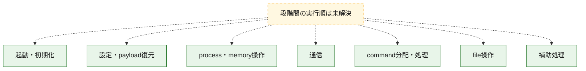
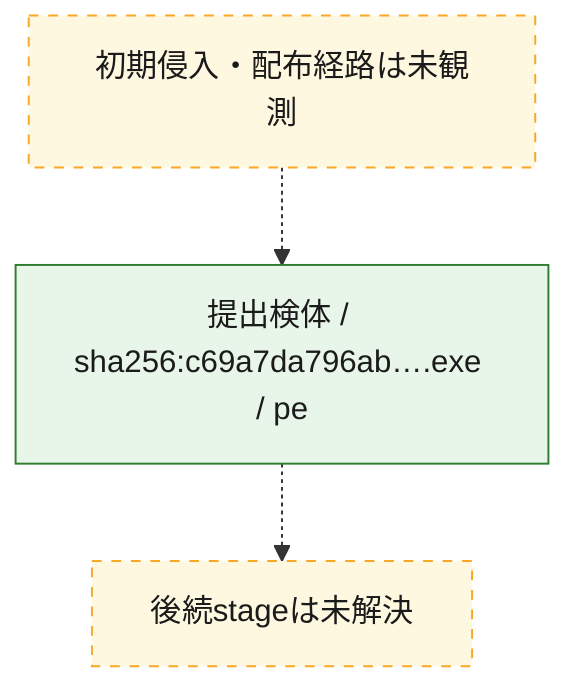
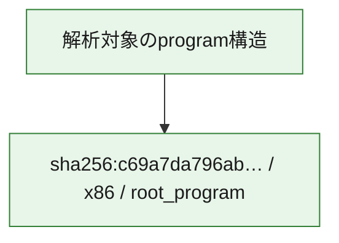

# 全体ロジック：c69a7da796aba7168e1edd6c7b8d573592f17a1a8fb74d3307cc68ccf8203bde

代表関数の静的証跡から、起動・初期化、設定・payload復元、process・memory操作、通信、command分配・処理、file操作の処理群を確認しました。

## 読み方

- phaseの掲載順は解析上の整理順です。observed_call_edgesがない段階間の実行順を断定しません。
- 図の実線は静的に観測した関係、点線と黄色のノードは未観測・未解決の関係を示します。
- 図は静的な要約であり、動的実行を再現するものではありません。
- 詳細な関数解説とfingerprintは[STATIC-LOGIC.md](STATIC-LOGIC.md)を参照してください。

## 静的可視化

### 実行フロー

### 感染チェーン

### モジュール関係

## 処理段階

### 1. 起動・初期化

entry pointから初期化と後続処理への移行を確認します。
確度: `confirmed_static_function_evidence_with_limits`

- `c69a7da796aba7168e1edd6c7b8d573592f17a1a8fb74d3307cc68ccf8203bde:ghidra:1403beba0` — 初期化と主要処理への分岐を行う入口関数です。 状態: `succeeded`、選定理由: `entry_point`, `meaningful_symbol_name`, `probable_go_main_user_code`, `reviewed_call_centrality:5`, `role:entrypoint`
- `c69a7da796aba7168e1edd6c7b8d573592f17a1a8fb74d3307cc68ccf8203bde:ghidra:1403beca0` — 初期化と主要処理への分岐を行う入口関数です。 状態: `failed`、選定理由: `entry_point`, `meaningful_symbol_name`, `probable_go_main_user_code`, `reviewed_call_centrality:50`, `role:entrypoint`
- `c69a7da796aba7168e1edd6c7b8d573592f17a1a8fb74d3307cc68ccf8203bde:ghidra:1403c12a0` — 初期化と主要処理への分岐を行う入口関数です。 状態: `succeeded`、選定理由: `entry_point`, `meaningful_symbol_name`, `probable_go_main_user_code`, `reviewed_call_centrality:4`, `role:entrypoint`
- `c69a7da796aba7168e1edd6c7b8d573592f17a1a8fb74d3307cc68ccf8203bde:ghidra:1403c1300` — 初期化と主要処理への分岐を行う入口関数です。 状態: `succeeded`、選定理由: `entry_point`, `meaningful_symbol_name`, `probable_go_main_user_code`, `reviewed_call_centrality:13`, `role:entrypoint`
- `c69a7da796aba7168e1edd6c7b8d573592f17a1a8fb74d3307cc68ccf8203bde:ghidra:1403c1700` — 初期化と主要処理への分岐を行う入口関数です。 状態: `succeeded`、選定理由: `entry_point`, `meaningful_symbol_name`, `probable_go_main_user_code`, `reviewed_call_centrality:3`, `role:entrypoint`
- `c69a7da796aba7168e1edd6c7b8d573592f17a1a8fb74d3307cc68ccf8203bde:ghidra:1403c1740` — 初期化と主要処理への分岐を行う入口関数です。 状態: `succeeded`、選定理由: `entry_point`, `meaningful_symbol_name`, `probable_go_main_user_code`, `reviewed_call_centrality:3`, `role:entrypoint`
- `c69a7da796aba7168e1edd6c7b8d573592f17a1a8fb74d3307cc68ccf8203bde:ghidra:1403c1780` — 初期化と主要処理への分岐を行う入口関数です。 状態: `succeeded`、選定理由: `entry_point`, `meaningful_symbol_name`, `probable_go_main_user_code`, `reviewed_call_centrality:6`, `role:entrypoint`
- `c69a7da796aba7168e1edd6c7b8d573592f17a1a8fb74d3307cc68ccf8203bde:ghidra:1403c1ae0` — 初期化と主要処理への分岐を行う入口関数です。 状態: `succeeded`、選定理由: `entry_point`, `meaningful_symbol_name`, `probable_go_main_user_code`, `reviewed_call_centrality:3`, `role:entrypoint`
- `c69a7da796aba7168e1edd6c7b8d573592f17a1a8fb74d3307cc68ccf8203bde:ghidra:1403c1b20` — 初期化と主要処理への分岐を行う入口関数です。 状態: `succeeded`、選定理由: `entry_point`, `meaningful_symbol_name`, `probable_go_main_user_code`, `reviewed_call_centrality:5`, `role:entrypoint`
- `c69a7da796aba7168e1edd6c7b8d573592f17a1a8fb74d3307cc68ccf8203bde:ghidra:1403c1c20` — 初期化と主要処理への分岐を行う入口関数です。 状態: `succeeded`、選定理由: `entry_point`, `meaningful_symbol_name`, `probable_go_main_user_code`, `reviewed_call_centrality:4`, `role:entrypoint`
- `c69a7da796aba7168e1edd6c7b8d573592f17a1a8fb74d3307cc68ccf8203bde:ghidra:1403c1d00` — 初期化と主要処理への分岐を行う入口関数です。 状態: `succeeded`、選定理由: `entry_point`, `meaningful_symbol_name`, `probable_go_main_user_code`, `reviewed_call_centrality:3`, `role:entrypoint`
- `c69a7da796aba7168e1edd6c7b8d573592f17a1a8fb74d3307cc68ccf8203bde:ghidra:1403c1dc0` — 初期化と主要処理への分岐を行う入口関数です。 状態: `succeeded`、選定理由: `entry_point`, `meaningful_symbol_name`, `probable_go_main_user_code`, `reviewed_call_centrality:3`, `role:entrypoint`
- `c69a7da796aba7168e1edd6c7b8d573592f17a1a8fb74d3307cc68ccf8203bde:ghidra:1403c1e00` — 初期化と主要処理への分岐を行う入口関数です。 状態: `succeeded`、選定理由: `entry_point`, `meaningful_symbol_name`, `probable_go_main_user_code`, `reviewed_call_centrality:3`, `role:entrypoint`
- `c69a7da796aba7168e1edd6c7b8d573592f17a1a8fb74d3307cc68ccf8203bde:ghidra:1403c1e40` — 初期化と主要処理への分岐を行う入口関数です。 状態: `succeeded`、選定理由: `entry_point`, `meaningful_symbol_name`, `probable_go_main_user_code`, `reviewed_call_centrality:5`, `role:entrypoint`
- `c69a7da796aba7168e1edd6c7b8d573592f17a1a8fb74d3307cc68ccf8203bde:ghidra:1403c1f20` — 初期化と主要処理への分岐を行う入口関数です。 状態: `succeeded`、選定理由: `entry_point`, `meaningful_symbol_name`, `probable_go_main_user_code`, `reviewed_call_centrality:10`, `role:entrypoint`
- `c69a7da796aba7168e1edd6c7b8d573592f17a1a8fb74d3307cc68ccf8203bde:ghidra:1403c2600` — 初期化と主要処理への分岐を行う入口関数です。 状態: `succeeded`、選定理由: `entry_point`, `meaningful_symbol_name`, `probable_go_main_user_code`, `reviewed_call_centrality:8`, `role:entrypoint`
- `c69a7da796aba7168e1edd6c7b8d573592f17a1a8fb74d3307cc68ccf8203bde:ghidra:1403c2820` — 初期化と主要処理への分岐を行う入口関数です。 状態: `succeeded`、選定理由: `entry_point`, `meaningful_symbol_name`, `probable_go_main_user_code`, `reviewed_call_centrality:6`, `role:entrypoint`
- `c69a7da796aba7168e1edd6c7b8d573592f17a1a8fb74d3307cc68ccf8203bde:ghidra:1403c28e0` — 初期化と主要処理への分岐を行う入口関数です。 状態: `succeeded`、選定理由: `entry_point`, `meaningful_symbol_name`, `probable_go_main_user_code`, `reviewed_call_centrality:4`, `role:entrypoint`
- `c69a7da796aba7168e1edd6c7b8d573592f17a1a8fb74d3307cc68ccf8203bde:ghidra:1403c2940` — 初期化と主要処理への分岐を行う入口関数です。 状態: `succeeded`、選定理由: `entry_point`, `meaningful_symbol_name`, `probable_go_main_user_code`, `reviewed_call_centrality:3`, `role:entrypoint`
- `c69a7da796aba7168e1edd6c7b8d573592f17a1a8fb74d3307cc68ccf8203bde:ghidra:1403c29a0` — 初期化と主要処理への分岐を行う入口関数です。 状態: `succeeded`、選定理由: `entry_point`, `meaningful_symbol_name`, `probable_go_main_user_code`, `reviewed_call_centrality:6`, `role:entrypoint`
- `c69a7da796aba7168e1edd6c7b8d573592f17a1a8fb74d3307cc68ccf8203bde:ghidra:1403c2d00` — 初期化と主要処理への分岐を行う入口関数です。 状態: `succeeded`、選定理由: `entry_point`, `meaningful_symbol_name`, `probable_go_main_user_code`, `reviewed_call_centrality:5`, `role:entrypoint`
- `c69a7da796aba7168e1edd6c7b8d573592f17a1a8fb74d3307cc68ccf8203bde:ghidra:1403c2d80` — 初期化と主要処理への分岐を行う入口関数です。 状態: `succeeded`、選定理由: `entry_point`, `meaningful_symbol_name`, `probable_go_main_user_code`, `reviewed_call_centrality:7`, `role:entrypoint`
- `c69a7da796aba7168e1edd6c7b8d573592f17a1a8fb74d3307cc68ccf8203bde:ghidra:1403c2e80` — 初期化と主要処理への分岐を行う入口関数です。 状態: `succeeded`、選定理由: `entry_point`, `meaningful_symbol_name`, `probable_go_main_user_code`, `reviewed_call_centrality:6`, `role:entrypoint`
- `c69a7da796aba7168e1edd6c7b8d573592f17a1a8fb74d3307cc68ccf8203bde:ghidra:1403c2fa0` — 初期化と主要処理への分岐を行う入口関数です。 状態: `succeeded`、選定理由: `entry_point`, `meaningful_symbol_name`, `probable_go_main_user_code`, `reviewed_call_centrality:4`, `role:entrypoint`

### 2. 設定・payload復元

設定、resource、payload、暗号化データの復元・変換を確認します。
確度: `confirmed_static_function_evidence`

- `c69a7da796aba7168e1edd6c7b8d573592f17a1a8fb74d3307cc68ccf8203bde:ghidra:140098f40` — 設定、resource、payloadなどの解析・変換を行う関数です。 状態: `succeeded`、選定理由: `meaningful_symbol_name`, `reviewed_call_centrality:5`, `role:config_or_data_transform`
- `c69a7da796aba7168e1edd6c7b8d573592f17a1a8fb74d3307cc68ccf8203bde:ghidra:1400ceb00` — 暗号、hash、encoding、または復号処理に関係する関数です。 状態: `succeeded`、選定理由: `meaningful_symbol_name`, `reviewed_call_centrality:2`, `role:cryptographic_transform`

### 3. process・memory操作

process、thread、module、memory操作と実行移行を確認します。
確度: `confirmed_static_function_evidence`

- `c69a7da796aba7168e1edd6c7b8d573592f17a1a8fb74d3307cc68ccf8203bde:ghidra:1400a1220` — process、thread、module、またはmemory操作に関係する関数です。 状態: `succeeded`、選定理由: `meaningful_symbol_name`, `reviewed_call_centrality:6`, `role:process_or_memory_operation`

### 4. 通信

通信初期化、endpoint処理、送受信の役割を確認します。
確度: `confirmed_static_function_evidence`

- `c69a7da796aba7168e1edd6c7b8d573592f17a1a8fb74d3307cc68ccf8203bde:ghidra:140081f60` — 通信初期化、送受信、またはendpoint処理に関係する関数です。 状態: `succeeded`、選定理由: `meaningful_symbol_name`, `reviewed_call_centrality:7`, `role:network_communication`

### 5. command分配・処理

受信commandやtaskの解釈、分配、個別handlerへの移行を確認します。
確度: `confirmed_static_function_evidence`

- `c69a7da796aba7168e1edd6c7b8d573592f17a1a8fb74d3307cc68ccf8203bde:ghidra:1400a34e0` — commandの解釈、分配、または個別処理を担当する関数です。 状態: `succeeded`、選定理由: `meaningful_symbol_name`, `reviewed_call_centrality:5`, `role:command_dispatch_or_handler`

### 6. file操作

fileやdirectoryの作成、読書き、削除を確認します。
確度: `confirmed_static_function_evidence`

- `c69a7da796aba7168e1edd6c7b8d573592f17a1a8fb74d3307cc68ccf8203bde:ghidra:1400a08a0` — fileまたはdirectoryの読書き・管理に関係する関数です。 状態: `succeeded`、選定理由: `meaningful_symbol_name`, `reviewed_call_centrality:5`, `role:file_operation`

### 7. 補助処理

主要処理を支える一般内部関数またはlibrary処理を確認します。
確度: `confirmed_static_function_evidence`

- `c69a7da796aba7168e1edd6c7b8d573592f17a1a8fb74d3307cc68ccf8203bde:ghidra:140001080` — compiler生成処理または汎用library処理とみられる関数です。 状態: `succeeded`、選定理由: `meaningful_symbol_name`, `reviewed_call_centrality:5`
- `c69a7da796aba7168e1edd6c7b8d573592f17a1a8fb74d3307cc68ccf8203bde:ghidra:14007d2e0` — 検体内部の一般処理を実装する関数です。 状態: `succeeded`、選定理由: `meaningful_symbol_name`, `reviewed_call_centrality:3`

## 観測したcall関係

- `ghidra-function:082a2afff7d88090ec8771ef` → `ghidra-external:03255f8b52126e2deb8980e4` （`unclassified` → `unclassified`）
- `ghidra-function:082a2afff7d88090ec8771ef` → `ghidra-external:06c4b1337045aba039ffe171` （`unclassified` → `unclassified`）
- `ghidra-function:082a2afff7d88090ec8771ef` → `ghidra-external:3d427ae1f61f0b3ffb413853` （`unclassified` → `unclassified`）
- `ghidra-function:082a2afff7d88090ec8771ef` → `ghidra-external:624543cb37811de9dbdd9216` （`unclassified` → `unclassified`）
- `ghidra-function:082a2afff7d88090ec8771ef` → `ghidra-external:8627ff84aad3e67f798ba57c` （`unclassified` → `unclassified`）
- `ghidra-function:082a2afff7d88090ec8771ef` → `ghidra-external:d068cae3855b2a63787604c3` （`unclassified` → `unclassified`）
- `ghidra-function:0a0b3a892b9e08b11cd238db` → `ghidra-external:0f0bf7f78e81366f6f493854` （`unclassified` → `unclassified`）
- `ghidra-function:0a0b3a892b9e08b11cd238db` → `ghidra-external:27952840b0e31d1f83f3a156` （`unclassified` → `unclassified`）
- `ghidra-function:0a0b3a892b9e08b11cd238db` → `ghidra-external:28fd3d8c0bdaade2f9d0798a` （`unclassified` → `unclassified`）
- `ghidra-function:0a0b3a892b9e08b11cd238db` → `ghidra-external:4d8efff53575c6ab1d92de1d` （`unclassified` → `unclassified`）
- `ghidra-function:0a0b3a892b9e08b11cd238db` → `ghidra-external:780dd321634c5bf7934b9b0c` （`unclassified` → `unclassified`）
- `ghidra-function:0a0b3a892b9e08b11cd238db` → `ghidra-external:827a189eacaeaef0125d322b` （`unclassified` → `unclassified`）
- `ghidra-function:0a0b3a892b9e08b11cd238db` → `ghidra-external:c97f96b338c18dcd2f72bdec` （`unclassified` → `unclassified`）
- `ghidra-function:1cfb2c8f229aaa91827f6715` → `ghidra-external:0e7da2e48d380c1e9784fb80` （`unclassified` → `unclassified`）
- `ghidra-function:1cfb2c8f229aaa91827f6715` → `ghidra-external:827a189eacaeaef0125d322b` （`unclassified` → `unclassified`）
- `ghidra-function:1cfb2c8f229aaa91827f6715` → `ghidra-external:a8d1b2fdc19f3e66955f85c9` （`unclassified` → `unclassified`）
- `ghidra-function:1cfb2c8f229aaa91827f6715` → `ghidra-external:c575839bca22001135fa88c7` （`unclassified` → `unclassified`）
- `ghidra-function:1cfb2c8f229aaa91827f6715` → `ghidra-external:e5c30cfd6753d60d866a1904` （`unclassified` → `unclassified`）
- `ghidra-function:1cfb2c8f229aaa91827f6715` → `ghidra-external:fa78dcad9e8086fc0a04ba12` （`unclassified` → `unclassified`）
- `ghidra-function:1fb76617794305c3028a9578` → `ghidra-external:631fc9782a0659fa92c7a3cd` （`unclassified` → `unclassified`）
- `ghidra-function:1fb76617794305c3028a9578` → `ghidra-external:827a189eacaeaef0125d322b` （`unclassified` → `unclassified`）
- `ghidra-function:1fb76617794305c3028a9578` → `ghidra-external:c9e9396a081100ec7965020d` （`unclassified` → `unclassified`）
- `ghidra-function:277f4999411a860fa2d46a57` → `ghidra-external:0f398c724956078678773104` （`unclassified` → `unclassified`）
- `ghidra-function:277f4999411a860fa2d46a57` → `ghidra-external:78533f176e18dff666f7d5d9` （`unclassified` → `unclassified`）
- `ghidra-function:277f4999411a860fa2d46a57` → `ghidra-external:827a189eacaeaef0125d322b` （`unclassified` → `unclassified`）
- `ghidra-function:277f4999411a860fa2d46a57` → `ghidra-external:8ee8532c8849a66daf9bea17` （`unclassified` → `unclassified`）
- `ghidra-function:277f4999411a860fa2d46a57` → `ghidra-external:efac8abc517933f8998a2e23` （`unclassified` → `unclassified`）
- `ghidra-function:2a4bc7c9cf20390881fe24ed` → `ghidra-external:20f43d1691df89466bcc07e6` （`unclassified` → `unclassified`）
- `ghidra-function:2a4bc7c9cf20390881fe24ed` → `ghidra-external:6a0dc71fba0b40e57caa375b` （`unclassified` → `unclassified`）
- `ghidra-function:2a4bc7c9cf20390881fe24ed` → `ghidra-external:6d1f7cb881ae36c7a1452861` （`unclassified` → `unclassified`）
- `ghidra-function:2a4bc7c9cf20390881fe24ed` → `ghidra-external:827a189eacaeaef0125d322b` （`unclassified` → `unclassified`）
- `ghidra-function:2a4bc7c9cf20390881fe24ed` → `ghidra-external:a04686271cff8bedbf627b44` （`unclassified` → `unclassified`）
- `ghidra-function:364cdddfc97e0409d1577f59` → `ghidra-external:0c3907a556dc12ce1bd892d4` （`unclassified` → `unclassified`）
- `ghidra-function:364cdddfc97e0409d1577f59` → `ghidra-external:624543cb37811de9dbdd9216` （`unclassified` → `unclassified`）
- `ghidra-function:364cdddfc97e0409d1577f59` → `ghidra-external:bb7e7134202ca4f3f5f8a193` （`unclassified` → `unclassified`）
- `ghidra-function:36bb9c76f61ad2a94d5b0403` → `ghidra-external:38cf09a496fbd20c5bd651e6` （`unclassified` → `unclassified`）
- `ghidra-function:36bb9c76f61ad2a94d5b0403` → `ghidra-external:624543cb37811de9dbdd9216` （`unclassified` → `unclassified`）
- `ghidra-function:36bb9c76f61ad2a94d5b0403` → `ghidra-external:be3a827869592d29e9ae54b8` （`unclassified` → `unclassified`）
- `ghidra-function:38701ae1c24ab00e71dc4838` → `ghidra-external:3d81ec07fd3a0ffad5ef6ef9` （`unclassified` → `unclassified`）
- `ghidra-function:38701ae1c24ab00e71dc4838` → `ghidra-external:47604c3e6bc77ca67f6ce9ce` （`unclassified` → `unclassified`）
- `ghidra-function:38701ae1c24ab00e71dc4838` → `ghidra-external:827a189eacaeaef0125d322b` （`unclassified` → `unclassified`）
- `ghidra-function:38701ae1c24ab00e71dc4838` → `ghidra-external:f0c582bb9dfbe9fdaef9bf89` （`unclassified` → `unclassified`）
- `ghidra-function:38701ae1c24ab00e71dc4838` → `ghidra-external:f97f3f25f6f475e6c2378d60` （`unclassified` → `unclassified`）
- `ghidra-function:3b666b5ca33dc8e10847198e` → `ghidra-external:01648852dd7725548e5d6f17` （`unclassified` → `unclassified`）
- `ghidra-function:3b666b5ca33dc8e10847198e` → `ghidra-external:08ce878bbed63e01c0dcf9d3` （`unclassified` → `unclassified`）
- `ghidra-function:3b666b5ca33dc8e10847198e` → `ghidra-external:624543cb37811de9dbdd9216` （`unclassified` → `unclassified`）
- `ghidra-function:3f2f8111ee45b077deeeaae8` → `ghidra-external:22e126b6beafe886329d8936` （`unclassified` → `unclassified`）
- `ghidra-function:3f2f8111ee45b077deeeaae8` → `ghidra-external:785c5adffdd9c0a2a7aa544c` （`unclassified` → `unclassified`）
- `ghidra-function:3f2f8111ee45b077deeeaae8` → `ghidra-external:827a189eacaeaef0125d322b` （`unclassified` → `unclassified`）
- `ghidra-function:3f2f8111ee45b077deeeaae8` → `ghidra-external:e9bf2d26e820409b01ebc5a4` （`unclassified` → `unclassified`）
- `ghidra-function:404beff26e3d95a37a8c8431` → `ghidra-external:5a391e70a36ff1d6f4015c0d` （`unclassified` → `unclassified`）
- `ghidra-function:404beff26e3d95a37a8c8431` → `ghidra-external:7299c921c2fe4aaf7bb6f0b7` （`unclassified` → `unclassified`）
- `ghidra-function:404beff26e3d95a37a8c8431` → `ghidra-external:7d3a93657a46795166cd06ce` （`unclassified` → `unclassified`）
- `ghidra-function:404beff26e3d95a37a8c8431` → `ghidra-external:827a189eacaeaef0125d322b` （`unclassified` → `unclassified`）
- `ghidra-function:5f86c6a4b5ab99ac1e268472` → `ghidra-external:1b38adee12073ea596ff375d` （`unclassified` → `unclassified`）
- `ghidra-function:5f86c6a4b5ab99ac1e268472` → `ghidra-external:1e7f49fbe1f558dd14e5f580` （`unclassified` → `unclassified`）
- `ghidra-function:5f86c6a4b5ab99ac1e268472` → `ghidra-external:624543cb37811de9dbdd9216` （`unclassified` → `unclassified`）
- `ghidra-function:5f86c6a4b5ab99ac1e268472` → `ghidra-external:d068cae3855b2a63787604c3` （`unclassified` → `unclassified`）
- `ghidra-function:7d403573356b9125aa007ba5` → `ghidra-external:3d81ec07fd3a0ffad5ef6ef9` （`unclassified` → `unclassified`）
- `ghidra-function:7d403573356b9125aa007ba5` → `ghidra-external:416dec8722e953865922e2b0` （`unclassified` → `unclassified`）
- `ghidra-function:7d403573356b9125aa007ba5` → `ghidra-external:597ad6f6b858d21d619488c5` （`unclassified` → `unclassified`）
- `ghidra-function:7d403573356b9125aa007ba5` → `ghidra-external:7299c921c2fe4aaf7bb6f0b7` （`unclassified` → `unclassified`）
- `ghidra-function:7d403573356b9125aa007ba5` → `ghidra-external:7d3a93657a46795166cd06ce` （`unclassified` → `unclassified`）
- `ghidra-function:7d403573356b9125aa007ba5` → `ghidra-external:822c6ae201d0c7bdfce82782` （`unclassified` → `unclassified`）
- `ghidra-function:7d403573356b9125aa007ba5` → `ghidra-external:827a189eacaeaef0125d322b` （`unclassified` → `unclassified`）
- `ghidra-function:7d403573356b9125aa007ba5` → `ghidra-external:ad6adac46a98906b5c335d0e` （`unclassified` → `unclassified`）
- `ghidra-function:7d403573356b9125aa007ba5` → `ghidra-external:c056abab33066c918cb26b74` （`unclassified` → `unclassified`）
- `ghidra-function:7d403573356b9125aa007ba5` → `ghidra-external:ff239e2c723d9aff84539468` （`unclassified` → `unclassified`）
- `ghidra-function:834b98b689df6cb153faf605` → `ghidra-external:40d4aec68b974eeda2d955a2` （`unclassified` → `unclassified`）
- `ghidra-function:834b98b689df6cb153faf605` → `ghidra-external:5776bcb0084f7f11d132406e` （`unclassified` → `unclassified`）
- `ghidra-function:834b98b689df6cb153faf605` → `ghidra-external:7f297d9c007a7a14c55d26ec` （`unclassified` → `unclassified`）
- `ghidra-function:834b98b689df6cb153faf605` → `ghidra-external:827a189eacaeaef0125d322b` （`unclassified` → `unclassified`）
- `ghidra-function:834b98b689df6cb153faf605` → `ghidra-external:c4e13d2acd95ee22985a9894` （`unclassified` → `unclassified`）
- `ghidra-function:959ad6b0a51484484d364d18` → `ghidra-external:3dd19e48d923a579fd0e2f6c` （`unclassified` → `unclassified`）
- `ghidra-function:959ad6b0a51484484d364d18` → `ghidra-external:624543cb37811de9dbdd9216` （`unclassified` → `unclassified`）
- `ghidra-function:959ad6b0a51484484d364d18` → `ghidra-external:6522b1fc283baea109268f9e` （`unclassified` → `unclassified`）
- `ghidra-function:9e6662bc5af76cc5584a5185` → `ghidra-external:3e45deb9ad60eeea78f84793` （`unclassified` → `unclassified`）
- `ghidra-function:9e6662bc5af76cc5584a5185` → `ghidra-external:407f839681b9fcb6e63d7683` （`unclassified` → `unclassified`）
- `ghidra-function:9e6662bc5af76cc5584a5185` → `ghidra-external:624543cb37811de9dbdd9216` （`unclassified` → `unclassified`）
- `ghidra-function:9efb5af510187bd197eaa24e` → `ghidra-external:31e2926196f093700cba2eaf` （`unclassified` → `unclassified`）
- `ghidra-function:9efb5af510187bd197eaa24e` → `ghidra-external:36a1b523eafa4c1a29559245` （`unclassified` → `unclassified`）
- `ghidra-function:9efb5af510187bd197eaa24e` → `ghidra-external:827a189eacaeaef0125d322b` （`unclassified` → `unclassified`）
- `ghidra-function:9efb5af510187bd197eaa24e` → `ghidra-external:c056abab33066c918cb26b74` （`unclassified` → `unclassified`）
- `ghidra-function:9efb5af510187bd197eaa24e` → `ghidra-external:c97f96b338c18dcd2f72bdec` （`unclassified` → `unclassified`）
- `ghidra-function:a3bd198814ad16026e224a1e` → `ghidra-external:0e788ca59c6e4aa1d8b2bfe3` （`unclassified` → `unclassified`）
- `ghidra-function:a3bd198814ad16026e224a1e` → `ghidra-external:3d81ec07fd3a0ffad5ef6ef9` （`unclassified` → `unclassified`）
- `ghidra-function:a3bd198814ad16026e224a1e` → `ghidra-external:4d8efff53575c6ab1d92de1d` （`unclassified` → `unclassified`）
- `ghidra-function:a3bd198814ad16026e224a1e` → `ghidra-external:7d3a93657a46795166cd06ce` （`unclassified` → `unclassified`）
- `ghidra-function:a3bd198814ad16026e224a1e` → `ghidra-external:827a189eacaeaef0125d322b` （`unclassified` → `unclassified`）
- `ghidra-function:a3bd198814ad16026e224a1e` → `ghidra-external:c056abab33066c918cb26b74` （`unclassified` → `unclassified`）
- `ghidra-function:c1a092920b4960198b0f4547` → `ghidra-external:5a391e70a36ff1d6f4015c0d` （`unclassified` → `unclassified`）
- `ghidra-function:c1a092920b4960198b0f4547` → `ghidra-external:822c6ae201d0c7bdfce82782` （`unclassified` → `unclassified`）
- `ghidra-function:c1a092920b4960198b0f4547` → `ghidra-external:827a189eacaeaef0125d322b` （`unclassified` → `unclassified`）
- `ghidra-function:c33e786d97b6908d9f38389f` → `ghidra-external:3746833d16d89434e2dd191d` （`unclassified` → `unclassified`）
- `ghidra-function:c33e786d97b6908d9f38389f` → `ghidra-external:3af1d3380b18f2d9a30ce370` （`unclassified` → `unclassified`）
- `ghidra-function:c33e786d97b6908d9f38389f` → `ghidra-external:40d4aec68b974eeda2d955a2` （`unclassified` → `unclassified`）
- `ghidra-function:c33e786d97b6908d9f38389f` → `ghidra-external:7f297d9c007a7a14c55d26ec` （`unclassified` → `unclassified`）
- `ghidra-function:c33e786d97b6908d9f38389f` → `ghidra-external:827a189eacaeaef0125d322b` （`unclassified` → `unclassified`）
- `ghidra-function:c33e786d97b6908d9f38389f` → `ghidra-external:c4e13d2acd95ee22985a9894` （`unclassified` → `unclassified`）
- `ghidra-function:c76bffd36861524dbe2d00a7` → `ghidra-external:827a189eacaeaef0125d322b` （`unclassified` → `unclassified`）
- `ghidra-function:c76bffd36861524dbe2d00a7` → `ghidra-external:98370d8a648fd5a52e944612` （`unclassified` → `unclassified`）
- `ghidra-function:ca6536ebd361e1975046251b` → `ghidra-external:03255f8b52126e2deb8980e4` （`unclassified` → `unclassified`）
- `ghidra-function:ca6536ebd361e1975046251b` → `ghidra-external:12755ee5fd6e328ca4b57fa5` （`unclassified` → `unclassified`）
- `ghidra-function:ca6536ebd361e1975046251b` → `ghidra-external:3ae8eda3538c83c854f0691e` （`unclassified` → `unclassified`）
- `ghidra-function:ca6536ebd361e1975046251b` → `ghidra-external:416dec8722e953865922e2b0` （`unclassified` → `unclassified`）
- `ghidra-function:ca6536ebd361e1975046251b` → `ghidra-external:4d8efff53575c6ab1d92de1d` （`unclassified` → `unclassified`）
- `ghidra-function:ca6536ebd361e1975046251b` → `ghidra-external:4fe2ab3e2fdf515b9250bb9b` （`unclassified` → `unclassified`）
- `ghidra-function:ca6536ebd361e1975046251b` → `ghidra-external:614bb4885f9dc717b9667770` （`unclassified` → `unclassified`）
- `ghidra-function:ca6536ebd361e1975046251b` → `ghidra-external:624543cb37811de9dbdd9216` （`unclassified` → `unclassified`）
- `ghidra-function:ca6536ebd361e1975046251b` → `ghidra-external:baa5bd52f71fb3d01953b6a2` （`unclassified` → `unclassified`）
- `ghidra-function:ca6536ebd361e1975046251b` → `ghidra-external:c056abab33066c918cb26b74` （`unclassified` → `unclassified`）
- `ghidra-function:ca6536ebd361e1975046251b` → `ghidra-external:c18d644085dc7f689a058b0a` （`unclassified` → `unclassified`）
- `ghidra-function:ca6536ebd361e1975046251b` → `ghidra-external:d068cae3855b2a63787604c3` （`unclassified` → `unclassified`）
- `ghidra-function:ca6536ebd361e1975046251b` → `ghidra-external:d2cf75aac9136bdeffb4b0e4` （`unclassified` → `unclassified`）
- `ghidra-function:ca81a6477f155c7f7a4741b7` → `ghidra-external:0e788ca59c6e4aa1d8b2bfe3` （`unclassified` → `unclassified`）
- `ghidra-function:ca81a6477f155c7f7a4741b7` → `ghidra-external:28fd3d8c0bdaade2f9d0798a` （`unclassified` → `unclassified`）
- `ghidra-function:ca81a6477f155c7f7a4741b7` → `ghidra-external:7d3a93657a46795166cd06ce` （`unclassified` → `unclassified`）
- `ghidra-function:ca81a6477f155c7f7a4741b7` → `ghidra-external:827a189eacaeaef0125d322b` （`unclassified` → `unclassified`）
- `ghidra-function:ca81a6477f155c7f7a4741b7` → `ghidra-external:86114bea2331929c5b5535ec` （`unclassified` → `unclassified`）
- `ghidra-function:ca81a6477f155c7f7a4741b7` → `ghidra-external:bfd0aa31989986dc30c38f9d` （`unclassified` → `unclassified`）
- `ghidra-function:cb99b21b7cfac460d567fe2c` → `ghidra-external:1675c450a1f2078679fea390` （`unclassified` → `unclassified`）
- `ghidra-function:cb99b21b7cfac460d567fe2c` → `ghidra-external:4d8efff53575c6ab1d92de1d` （`unclassified` → `unclassified`）
- `ghidra-function:cb99b21b7cfac460d567fe2c` → `ghidra-external:4fe2ab3e2fdf515b9250bb9b` （`unclassified` → `unclassified`）
- `ghidra-function:cb99b21b7cfac460d567fe2c` → `ghidra-external:827a189eacaeaef0125d322b` （`unclassified` → `unclassified`）
- `ghidra-function:cb99b21b7cfac460d567fe2c` → `ghidra-external:b0c759a27996763a69240fd3` （`unclassified` → `unclassified`）
- `ghidra-function:d3fad1cb56a859dca89abf43` → `ghidra-external:03344a9b937a0a88a0c376d9` （`unclassified` → `unclassified`）
- `ghidra-function:d3fad1cb56a859dca89abf43` → `ghidra-external:07f11b8d4d7e136cdb43a1df` （`unclassified` → `unclassified`）
- `ghidra-function:d3fad1cb56a859dca89abf43` → `ghidra-external:0e7da2e48d380c1e9784fb80` （`unclassified` → `unclassified`）
- `ghidra-function:d3fad1cb56a859dca89abf43` → `ghidra-external:0f0bf7f78e81366f6f493854` （`unclassified` → `unclassified`）
- `ghidra-function:d3fad1cb56a859dca89abf43` → `ghidra-external:0f398c724956078678773104` （`unclassified` → `unclassified`）
- `ghidra-function:d3fad1cb56a859dca89abf43` → `ghidra-external:1810a0a8c77d026926a56db8` （`unclassified` → `unclassified`）
- `ghidra-function:d3fad1cb56a859dca89abf43` → `ghidra-external:19e52326f9940d88dc7d9b74` （`unclassified` → `unclassified`）
- `ghidra-function:d3fad1cb56a859dca89abf43` → `ghidra-external:1a49855103675efebebb0f34` （`unclassified` → `unclassified`）
- `ghidra-function:d3fad1cb56a859dca89abf43` → `ghidra-external:1e3f176b3f3ae212971b015c` （`unclassified` → `unclassified`）
- `ghidra-function:d3fad1cb56a859dca89abf43` → `ghidra-external:3746833d16d89434e2dd191d` （`unclassified` → `unclassified`）
- `ghidra-function:d3fad1cb56a859dca89abf43` → `ghidra-external:3812d72b63f951268acd28f5` （`unclassified` → `unclassified`）
- `ghidra-function:d3fad1cb56a859dca89abf43` → `ghidra-external:3d81ec07fd3a0ffad5ef6ef9` （`unclassified` → `unclassified`）
- `ghidra-function:d3fad1cb56a859dca89abf43` → `ghidra-external:416dec8722e953865922e2b0` （`unclassified` → `unclassified`）
- `ghidra-function:d3fad1cb56a859dca89abf43` → `ghidra-external:442d761b31523abd5e4ecbfc` （`unclassified` → `unclassified`）
- `ghidra-function:d3fad1cb56a859dca89abf43` → `ghidra-external:4d8efff53575c6ab1d92de1d` （`unclassified` → `unclassified`）
- `ghidra-function:d3fad1cb56a859dca89abf43` → `ghidra-external:4ff3bda92ccbc948442aef35` （`unclassified` → `unclassified`）
- `ghidra-function:d3fad1cb56a859dca89abf43` → `ghidra-external:53dc289f809f285f971a16e3` （`unclassified` → `unclassified`）
- `ghidra-function:d3fad1cb56a859dca89abf43` → `ghidra-external:569c53679173c38a3b527e28` （`unclassified` → `unclassified`）
- `ghidra-function:d3fad1cb56a859dca89abf43` → `ghidra-external:5e9b888c3b6f3f44b39dd6cc` （`unclassified` → `unclassified`）
- `ghidra-function:d3fad1cb56a859dca89abf43` → `ghidra-external:614bb4885f9dc717b9667770` （`unclassified` → `unclassified`）
- `ghidra-function:d3fad1cb56a859dca89abf43` → `ghidra-external:66fb2ce5849b8d7eb74fb688` （`unclassified` → `unclassified`）
- `ghidra-function:d3fad1cb56a859dca89abf43` → `ghidra-external:6d753c93232ad34b93266809` （`unclassified` → `unclassified`）
- `ghidra-function:d3fad1cb56a859dca89abf43` → `ghidra-external:6ff91c65504b6d16aea9eaa7` （`unclassified` → `unclassified`）
- `ghidra-function:d3fad1cb56a859dca89abf43` → `ghidra-external:7d3a93657a46795166cd06ce` （`unclassified` → `unclassified`）
- `ghidra-function:d3fad1cb56a859dca89abf43` → `ghidra-external:822c6ae201d0c7bdfce82782` （`unclassified` → `unclassified`）
- `ghidra-function:d3fad1cb56a859dca89abf43` → `ghidra-external:827a189eacaeaef0125d322b` （`unclassified` → `unclassified`）
- `ghidra-function:d3fad1cb56a859dca89abf43` → `ghidra-external:86114bea2331929c5b5535ec` （`unclassified` → `unclassified`）
- `ghidra-function:d3fad1cb56a859dca89abf43` → `ghidra-external:90c2e0dbe910e2606e1674e7` （`unclassified` → `unclassified`）
- `ghidra-function:d3fad1cb56a859dca89abf43` → `ghidra-external:955f711734f8eeed1ed9e937` （`unclassified` → `unclassified`）
- `ghidra-function:d3fad1cb56a859dca89abf43` → `ghidra-external:a93c127ea272162e42177a50` （`unclassified` → `unclassified`）
- `ghidra-function:d3fad1cb56a859dca89abf43` → `ghidra-external:b1406a76e11d607959453de8` （`unclassified` → `unclassified`）
- `ghidra-function:d3fad1cb56a859dca89abf43` → `ghidra-external:ba7edf34be068ae44df0fb2c` （`unclassified` → `unclassified`）
- `ghidra-function:d3fad1cb56a859dca89abf43` → `ghidra-external:baa5bd52f71fb3d01953b6a2` （`unclassified` → `unclassified`）
- `ghidra-function:d3fad1cb56a859dca89abf43` → `ghidra-external:bfd0aa31989986dc30c38f9d` （`unclassified` → `unclassified`）
- `ghidra-function:d3fad1cb56a859dca89abf43` → `ghidra-external:c056abab33066c918cb26b74` （`unclassified` → `unclassified`）
- `ghidra-function:d3fad1cb56a859dca89abf43` → `ghidra-external:c18d644085dc7f689a058b0a` （`unclassified` → `unclassified`）
- `ghidra-function:d3fad1cb56a859dca89abf43` → `ghidra-external:c575839bca22001135fa88c7` （`unclassified` → `unclassified`）
- `ghidra-function:d3fad1cb56a859dca89abf43` → `ghidra-external:c5e5615638d1f701f6bd7959` （`unclassified` → `unclassified`）
- `ghidra-function:d3fad1cb56a859dca89abf43` → `ghidra-external:c8ace2e82c38f3921d573422` （`unclassified` → `unclassified`）
- `ghidra-function:d3fad1cb56a859dca89abf43` → `ghidra-external:cf7f7d0111cfd829846565f8` （`unclassified` → `unclassified`）
- `ghidra-function:d3fad1cb56a859dca89abf43` → `ghidra-external:d068cae3855b2a63787604c3` （`unclassified` → `unclassified`）
- `ghidra-function:d3fad1cb56a859dca89abf43` → `ghidra-external:d105deebe985607a24cb886e` （`unclassified` → `unclassified`）
- `ghidra-function:d3fad1cb56a859dca89abf43` → `ghidra-external:d813cbf740c8462c5ad1f68b` （`unclassified` → `unclassified`）
- `ghidra-function:d3fad1cb56a859dca89abf43` → `ghidra-external:dbe236f00c67e4d1e51de2ea` （`unclassified` → `unclassified`）
- `ghidra-function:d3fad1cb56a859dca89abf43` → `ghidra-external:dd17e5792c26bd56d1f4ada6` （`unclassified` → `unclassified`）
- `ghidra-function:d3fad1cb56a859dca89abf43` → `ghidra-external:e2088520f2c6187cb35c9545` （`unclassified` → `unclassified`）
- `ghidra-function:d3fad1cb56a859dca89abf43` → `ghidra-external:f02dd147750017e069e680a2` （`unclassified` → `unclassified`）
- `ghidra-function:d3fad1cb56a859dca89abf43` → `ghidra-external:f0c582bb9dfbe9fdaef9bf89` （`unclassified` → `unclassified`）
- `ghidra-function:d3fad1cb56a859dca89abf43` → `ghidra-external:ff232664d1ee026ab53b379e` （`unclassified` → `unclassified`）
- `ghidra-function:d3fad1cb56a859dca89abf43` → `ghidra-external:ff239e2c723d9aff84539468` （`unclassified` → `unclassified`）
- `ghidra-function:d438229243096e0d6acbf590` → `ghidra-external:46813cb1318083edc094e422` （`unclassified` → `unclassified`）
- `ghidra-function:d438229243096e0d6acbf590` → `ghidra-external:7ddce3a0850855ac76f6c881` （`unclassified` → `unclassified`）
- `ghidra-function:d438229243096e0d6acbf590` → `ghidra-external:827a189eacaeaef0125d322b` （`unclassified` → `unclassified`）
- `ghidra-function:d438229243096e0d6acbf590` → `ghidra-external:8c030d0d53c79d92a0ba6c93` （`unclassified` → `unclassified`）
- `ghidra-function:d438229243096e0d6acbf590` → `ghidra-external:b77e6a969fb39d136f7efe82` （`unclassified` → `unclassified`）
- `ghidra-function:d438229243096e0d6acbf590` → `ghidra-external:d530bb6c5c9b45d398a982eb` （`unclassified` → `unclassified`）
- `ghidra-function:d438229243096e0d6acbf590` → `ghidra-external:f509fd225bcb8aa780433b3c` （`unclassified` → `unclassified`）
- `ghidra-function:d48ddff8adc1ecb9e9eb6113` → `ghidra-external:0f398c724956078678773104` （`unclassified` → `unclassified`）
- `ghidra-function:d48ddff8adc1ecb9e9eb6113` → `ghidra-external:1001517812be8ebe90cf50a9` （`unclassified` → `unclassified`）
- `ghidra-function:d48ddff8adc1ecb9e9eb6113` → `ghidra-external:10ddb902a0172d163107e7b4` （`unclassified` → `unclassified`）
- `ghidra-function:d48ddff8adc1ecb9e9eb6113` → `ghidra-external:28fd3d8c0bdaade2f9d0798a` （`unclassified` → `unclassified`）
- `ghidra-function:d48ddff8adc1ecb9e9eb6113` → `ghidra-external:4d8efff53575c6ab1d92de1d` （`unclassified` → `unclassified`）
- `ghidra-function:d48ddff8adc1ecb9e9eb6113` → `ghidra-external:827a189eacaeaef0125d322b` （`unclassified` → `unclassified`）
- `ghidra-function:d48ddff8adc1ecb9e9eb6113` → `ghidra-external:ad6adac46a98906b5c335d0e` （`unclassified` → `unclassified`）
- `ghidra-function:d48ddff8adc1ecb9e9eb6113` → `ghidra-external:fbd3c3fee6f5b64c355bf7e0` （`unclassified` → `unclassified`）
- `ghidra-function:d6d410eee30be873154f669b` → `ghidra-external:624543cb37811de9dbdd9216` （`unclassified` → `unclassified`）
- `ghidra-function:d6d410eee30be873154f669b` → `ghidra-external:cbce8b5d1e50d181972eee2c` （`unclassified` → `unclassified`）
- `ghidra-function:d6d410eee30be873154f669b` → `ghidra-external:d3a90f7feef550c229994cd9` （`unclassified` → `unclassified`）
- `ghidra-function:e7f7f8ff1c7489a45cbe3693` → `ghidra-external:3e91d03694bb52e0466bf28f` （`unclassified` → `unclassified`）
- `ghidra-function:e7f7f8ff1c7489a45cbe3693` → `ghidra-external:624543cb37811de9dbdd9216` （`unclassified` → `unclassified`）
- `ghidra-function:e7f7f8ff1c7489a45cbe3693` → `ghidra-external:838c998c4ccc84e99c39fe8b` （`unclassified` → `unclassified`）
- `ghidra-function:e7f7f8ff1c7489a45cbe3693` → `ghidra-external:90c2e0dbe910e2606e1674e7` （`unclassified` → `unclassified`）
- `ghidra-function:e7f7f8ff1c7489a45cbe3693` → `ghidra-external:d068cae3855b2a63787604c3` （`unclassified` → `unclassified`）
- `ghidra-function:fbeb5cb629c3c7e9a12bb1cb` → `ghidra-external:40d4aec68b974eeda2d955a2` （`unclassified` → `unclassified`）
- `ghidra-function:fbeb5cb629c3c7e9a12bb1cb` → `ghidra-external:818926f042a5d7ecd0e6e6a2` （`unclassified` → `unclassified`）
- 残り7件は`static-logic.json`に記録しています。

## 解析範囲と制約

- 選定外関数は全体inventoryへ残しますが、関数本体の個別解説対象にはしていません。
- indirect call、難読化、packer、VM、壊れたcontrol flowによりcall関係が欠落する場合があります。
- 文書は静的解析に基づき、検体実行や外部通信による動的確認は行っていません。
