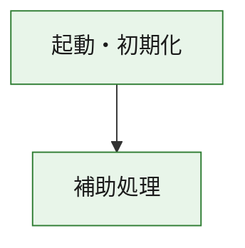
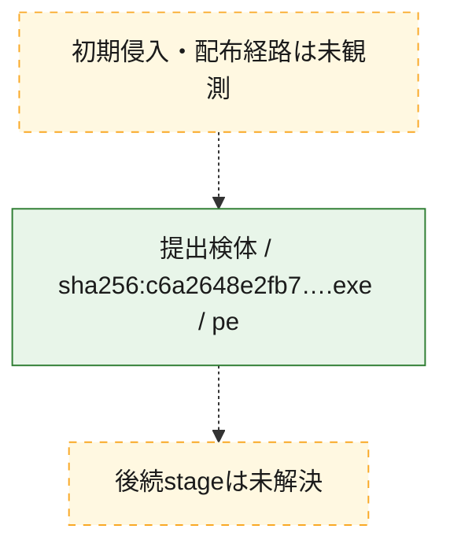
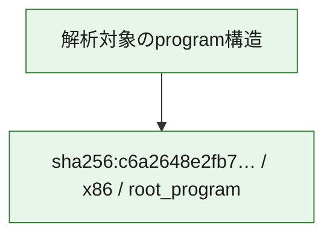

# 全体ロジック：c6a2648e2fb73c593025ad77df99644d0404997bf01d65466f6b2e38411ebf1e

代表関数の静的証跡から、起動・初期化の処理群を確認しました。

## 読み方

- phaseの掲載順は解析上の整理順です。observed_call_edgesがない段階間の実行順を断定しません。
- 図の実線は静的に観測した関係、点線と黄色のノードは未観測・未解決の関係を示します。
- 図は静的な要約であり、動的実行を再現するものではありません。
- 詳細な関数解説とfingerprintは[STATIC-LOGIC.md](STATIC-LOGIC.md)を参照してください。

## 静的可視化

### 実行フロー

### 感染チェーン

### モジュール関係

## 処理段階

### 1. 起動・初期化

entry pointから初期化と後続処理への移行を確認します。
確度: `confirmed_static_function_evidence`

- `c6a2648e2fb73c593025ad77df99644d0404997bf01d65466f6b2e38411ebf1e:ghidra:00401000` — 初期化と主要処理への分岐を行う入口関数です。 状態: `succeeded`、選定理由: `entry_point`, `meaningful_symbol_name`, `reviewed_call_centrality:3`, `role:entrypoint`

### 2. 補助処理

主要処理を支える一般内部関数またはlibrary処理を確認します。
確度: `confirmed_static_function_evidence_with_limits`

- `c6a2648e2fb73c593025ad77df99644d0404997bf01d65466f6b2e38411ebf1e:ghidra:00401011` — 検体内部の一般処理を実装する関数です。 状態: `succeeded`、選定理由: `context_representative`, `reviewed_call_centrality:37`
- `c6a2648e2fb73c593025ad77df99644d0404997bf01d65466f6b2e38411ebf1e:ghidra:00402494` — 検体内部の一般処理を実装する関数です。 状態: `succeeded`、選定理由: `context_representative`, `reviewed_call_centrality:64`
- `c6a2648e2fb73c593025ad77df99644d0404997bf01d65466f6b2e38411ebf1e:ghidra:00406162` — 検体内部の一般処理を実装する関数です。 状態: `succeeded`、選定理由: `context_representative`, `reviewed_call_centrality:2`
- `c6a2648e2fb73c593025ad77df99644d0404997bf01d65466f6b2e38411ebf1e:ghidra:00406193` — 検体内部の一般処理を実装する関数です。 状態: `succeeded`、選定理由: `context_representative`, `reviewed_call_centrality:2`
- `c6a2648e2fb73c593025ad77df99644d0404997bf01d65466f6b2e38411ebf1e:ghidra:00406204` — 検体内部の一般処理を実装する関数です。 状態: `succeeded`、選定理由: `context_representative`, `reviewed_call_centrality:14`
- `c6a2648e2fb73c593025ad77df99644d0404997bf01d65466f6b2e38411ebf1e:ghidra:00406871` — 検体内部の一般処理を実装する関数です。 状態: `succeeded`、選定理由: `context_representative`, `reviewed_call_centrality:5`
- `c6a2648e2fb73c593025ad77df99644d0404997bf01d65466f6b2e38411ebf1e:ghidra:004069e6` — 検体内部の一般処理を実装する関数です。 状態: `limited_bad_instruction_or_flow`、選定理由: `context_representative`, `reviewed_call_centrality:10`
- `c6a2648e2fb73c593025ad77df99644d0404997bf01d65466f6b2e38411ebf1e:ghidra:00406bcb` — 検体内部の一般処理を実装する関数です。 状態: `succeeded`、選定理由: `context_representative`, `reviewed_call_centrality:2`
- `c6a2648e2fb73c593025ad77df99644d0404997bf01d65466f6b2e38411ebf1e:ghidra:00406c30` — 検体内部の一般処理を実装する関数です。 状態: `succeeded`、選定理由: `context_representative`, `reviewed_call_centrality:3`
- `c6a2648e2fb73c593025ad77df99644d0404997bf01d65466f6b2e38411ebf1e:ghidra:00406dda` — 検体内部の一般処理を実装する関数です。 状態: `succeeded`、選定理由: `context_representative`, `reviewed_call_centrality:6`
- `c6a2648e2fb73c593025ad77df99644d0404997bf01d65466f6b2e38411ebf1e:ghidra:00406ef1` — 検体内部の一般処理を実装する関数です。 状態: `succeeded`、選定理由: `context_representative`, `reviewed_call_centrality:3`
- `c6a2648e2fb73c593025ad77df99644d0404997bf01d65466f6b2e38411ebf1e:ghidra:00406f4d` — 検体内部の一般処理を実装する関数です。 状態: `succeeded`、選定理由: `context_representative`, `reviewed_call_centrality:1`
- `c6a2648e2fb73c593025ad77df99644d0404997bf01d65466f6b2e38411ebf1e:ghidra:00406f72` — 検体内部の一般処理を実装する関数です。 状態: `succeeded`、選定理由: `context_representative`, `reviewed_call_centrality:4`
- `c6a2648e2fb73c593025ad77df99644d0404997bf01d65466f6b2e38411ebf1e:ghidra:00406fbb` — 検体内部の一般処理を実装する関数です。 状態: `succeeded`、選定理由: `context_representative`, `reviewed_call_centrality:7`
- `c6a2648e2fb73c593025ad77df99644d0404997bf01d65466f6b2e38411ebf1e:ghidra:004070a3` — 検体内部の一般処理を実装する関数です。 状態: `succeeded`、選定理由: `context_representative`, `reviewed_call_centrality:10`
- `c6a2648e2fb73c593025ad77df99644d0404997bf01d65466f6b2e38411ebf1e:ghidra:00407237` — 検体内部の一般処理を実装する関数です。 状態: `succeeded`、選定理由: `context_representative`, `reviewed_call_centrality:2`
- `c6a2648e2fb73c593025ad77df99644d0404997bf01d65466f6b2e38411ebf1e:ghidra:0040726b` — 検体内部の一般処理を実装する関数です。 状態: `succeeded`、選定理由: `context_representative`, `reviewed_call_centrality:2`
- `c6a2648e2fb73c593025ad77df99644d0404997bf01d65466f6b2e38411ebf1e:ghidra:0040729f` — 検体内部の一般処理を実装する関数です。 状態: `succeeded`、選定理由: `context_representative`, `reviewed_call_centrality:2`
- `c6a2648e2fb73c593025ad77df99644d0404997bf01d65466f6b2e38411ebf1e:ghidra:004072e2` — 検体内部の一般処理を実装する関数です。 状態: `succeeded`、選定理由: `context_representative`, `reviewed_call_centrality:6`
- `c6a2648e2fb73c593025ad77df99644d0404997bf01d65466f6b2e38411ebf1e:ghidra:0040731d` — 検体内部の一般処理を実装する関数です。 状態: `succeeded`、選定理由: `context_representative`, `reviewed_call_centrality:5`
- `c6a2648e2fb73c593025ad77df99644d0404997bf01d65466f6b2e38411ebf1e:ghidra:0040736c` — 検体内部の一般処理を実装する関数です。 状態: `succeeded`、選定理由: `context_representative`, `reviewed_call_centrality:15`
- `c6a2648e2fb73c593025ad77df99644d0404997bf01d65466f6b2e38411ebf1e:ghidra:00407751` — 検体内部の一般処理を実装する関数です。 状態: `succeeded`、選定理由: `context_representative`, `reviewed_call_centrality:9`
- `c6a2648e2fb73c593025ad77df99644d0404997bf01d65466f6b2e38411ebf1e:ghidra:004078c0` — 検体内部の一般処理を実装する関数です。 状態: `succeeded`、選定理由: `context_representative`, `reviewed_call_centrality:8`
- `c6a2648e2fb73c593025ad77df99644d0404997bf01d65466f6b2e38411ebf1e:ghidra:004079ed` — 検体内部の一般処理を実装する関数です。 状態: `succeeded`、選定理由: `context_representative`, `reviewed_call_centrality:3`
- `c6a2648e2fb73c593025ad77df99644d0404997bf01d65466f6b2e38411ebf1e:ghidra:00407a15` — 検体内部の一般処理を実装する関数です。 状態: `succeeded`、選定理由: `context_representative`, `reviewed_call_centrality:3`
- `c6a2648e2fb73c593025ad77df99644d0404997bf01d65466f6b2e38411ebf1e:ghidra:00407a78` — 検体内部の一般処理を実装する関数です。 状態: `succeeded`、選定理由: `context_representative`, `reviewed_call_centrality:24`
- `c6a2648e2fb73c593025ad77df99644d0404997bf01d65466f6b2e38411ebf1e:ghidra:0040af6a` — 検体内部の一般処理を実装する関数です。 状態: `succeeded`、選定理由: `context_representative`, `reviewed_call_centrality:3`
- `c6a2648e2fb73c593025ad77df99644d0404997bf01d65466f6b2e38411ebf1e:ghidra:0040afb7` — 検体内部の一般処理を実装する関数です。 状態: `succeeded`、選定理由: `context_representative`, `reviewed_call_centrality:2`
- `c6a2648e2fb73c593025ad77df99644d0404997bf01d65466f6b2e38411ebf1e:ghidra:0040b035` — 検体内部の一般処理を実装する関数です。 状態: `succeeded`、選定理由: `context_representative`, `reviewed_call_centrality:3`
- `c6a2648e2fb73c593025ad77df99644d0404997bf01d65466f6b2e38411ebf1e:ghidra:0040b07f` — 検体内部の一般処理を実装する関数です。 状態: `succeeded`、選定理由: `context_representative`, `reviewed_call_centrality:4`
- `c6a2648e2fb73c593025ad77df99644d0404997bf01d65466f6b2e38411ebf1e:ghidra:0040b177` — 検体内部の一般処理を実装する関数です。 状態: `succeeded`、選定理由: `context_representative`, `reviewed_call_centrality:4`

## 観測したcall関係

- `c6a2648e2fb73c593025ad77df99644d0404997bf01d65466f6b2e38411ebf1e:ghidra:00401000` → `c6a2648e2fb73c593025ad77df99644d0404997bf01d65466f6b2e38411ebf1e:ghidra:00401011` （`startup` → `support`）
- `c6a2648e2fb73c593025ad77df99644d0404997bf01d65466f6b2e38411ebf1e:ghidra:00401011` → `c6a2648e2fb73c593025ad77df99644d0404997bf01d65466f6b2e38411ebf1e:ghidra:00402494` （`support` → `support`）
- `c6a2648e2fb73c593025ad77df99644d0404997bf01d65466f6b2e38411ebf1e:ghidra:00401011` → `c6a2648e2fb73c593025ad77df99644d0404997bf01d65466f6b2e38411ebf1e:ghidra:00406f72` （`support` → `support`）
- `c6a2648e2fb73c593025ad77df99644d0404997bf01d65466f6b2e38411ebf1e:ghidra:00401011` → `c6a2648e2fb73c593025ad77df99644d0404997bf01d65466f6b2e38411ebf1e:ghidra:00406fbb` （`support` → `support`）
- `c6a2648e2fb73c593025ad77df99644d0404997bf01d65466f6b2e38411ebf1e:ghidra:00401011` → `c6a2648e2fb73c593025ad77df99644d0404997bf01d65466f6b2e38411ebf1e:ghidra:004072e2` （`support` → `support`）
- `c6a2648e2fb73c593025ad77df99644d0404997bf01d65466f6b2e38411ebf1e:ghidra:00401011` → `c6a2648e2fb73c593025ad77df99644d0404997bf01d65466f6b2e38411ebf1e:ghidra:004079ed` （`support` → `support`）
- `c6a2648e2fb73c593025ad77df99644d0404997bf01d65466f6b2e38411ebf1e:ghidra:00401011` → `c6a2648e2fb73c593025ad77df99644d0404997bf01d65466f6b2e38411ebf1e:ghidra:0040af6a` （`support` → `support`）
- `c6a2648e2fb73c593025ad77df99644d0404997bf01d65466f6b2e38411ebf1e:ghidra:00402494` → `c6a2648e2fb73c593025ad77df99644d0404997bf01d65466f6b2e38411ebf1e:ghidra:00406c30` （`support` → `support`）
- `c6a2648e2fb73c593025ad77df99644d0404997bf01d65466f6b2e38411ebf1e:ghidra:00402494` → `c6a2648e2fb73c593025ad77df99644d0404997bf01d65466f6b2e38411ebf1e:ghidra:00406dda` （`support` → `support`）
- `c6a2648e2fb73c593025ad77df99644d0404997bf01d65466f6b2e38411ebf1e:ghidra:00402494` → `c6a2648e2fb73c593025ad77df99644d0404997bf01d65466f6b2e38411ebf1e:ghidra:00406ef1` （`support` → `support`）
- `c6a2648e2fb73c593025ad77df99644d0404997bf01d65466f6b2e38411ebf1e:ghidra:00402494` → `c6a2648e2fb73c593025ad77df99644d0404997bf01d65466f6b2e38411ebf1e:ghidra:00406f72` （`support` → `support`）
- `c6a2648e2fb73c593025ad77df99644d0404997bf01d65466f6b2e38411ebf1e:ghidra:00402494` → `c6a2648e2fb73c593025ad77df99644d0404997bf01d65466f6b2e38411ebf1e:ghidra:00406fbb` （`support` → `support`）
- `c6a2648e2fb73c593025ad77df99644d0404997bf01d65466f6b2e38411ebf1e:ghidra:00402494` → `c6a2648e2fb73c593025ad77df99644d0404997bf01d65466f6b2e38411ebf1e:ghidra:004070a3` （`support` → `support`）
- `c6a2648e2fb73c593025ad77df99644d0404997bf01d65466f6b2e38411ebf1e:ghidra:00402494` → `c6a2648e2fb73c593025ad77df99644d0404997bf01d65466f6b2e38411ebf1e:ghidra:00407237` （`support` → `support`）
- `c6a2648e2fb73c593025ad77df99644d0404997bf01d65466f6b2e38411ebf1e:ghidra:00402494` → `c6a2648e2fb73c593025ad77df99644d0404997bf01d65466f6b2e38411ebf1e:ghidra:0040726b` （`support` → `support`）
- `c6a2648e2fb73c593025ad77df99644d0404997bf01d65466f6b2e38411ebf1e:ghidra:00402494` → `c6a2648e2fb73c593025ad77df99644d0404997bf01d65466f6b2e38411ebf1e:ghidra:0040729f` （`support` → `support`）
- `c6a2648e2fb73c593025ad77df99644d0404997bf01d65466f6b2e38411ebf1e:ghidra:00402494` → `c6a2648e2fb73c593025ad77df99644d0404997bf01d65466f6b2e38411ebf1e:ghidra:004072e2` （`support` → `support`）
- `c6a2648e2fb73c593025ad77df99644d0404997bf01d65466f6b2e38411ebf1e:ghidra:00402494` → `c6a2648e2fb73c593025ad77df99644d0404997bf01d65466f6b2e38411ebf1e:ghidra:0040731d` （`support` → `support`）
- `c6a2648e2fb73c593025ad77df99644d0404997bf01d65466f6b2e38411ebf1e:ghidra:00402494` → `c6a2648e2fb73c593025ad77df99644d0404997bf01d65466f6b2e38411ebf1e:ghidra:0040736c` （`support` → `support`）
- `c6a2648e2fb73c593025ad77df99644d0404997bf01d65466f6b2e38411ebf1e:ghidra:00402494` → `c6a2648e2fb73c593025ad77df99644d0404997bf01d65466f6b2e38411ebf1e:ghidra:00407751` （`support` → `support`）
- `c6a2648e2fb73c593025ad77df99644d0404997bf01d65466f6b2e38411ebf1e:ghidra:00402494` → `c6a2648e2fb73c593025ad77df99644d0404997bf01d65466f6b2e38411ebf1e:ghidra:004078c0` （`support` → `support`）
- `c6a2648e2fb73c593025ad77df99644d0404997bf01d65466f6b2e38411ebf1e:ghidra:00402494` → `c6a2648e2fb73c593025ad77df99644d0404997bf01d65466f6b2e38411ebf1e:ghidra:004079ed` （`support` → `support`）
- `c6a2648e2fb73c593025ad77df99644d0404997bf01d65466f6b2e38411ebf1e:ghidra:00402494` → `c6a2648e2fb73c593025ad77df99644d0404997bf01d65466f6b2e38411ebf1e:ghidra:00407a15` （`support` → `support`）
- `c6a2648e2fb73c593025ad77df99644d0404997bf01d65466f6b2e38411ebf1e:ghidra:00402494` → `c6a2648e2fb73c593025ad77df99644d0404997bf01d65466f6b2e38411ebf1e:ghidra:00407a78` （`support` → `support`）
- `c6a2648e2fb73c593025ad77df99644d0404997bf01d65466f6b2e38411ebf1e:ghidra:00406204` → `c6a2648e2fb73c593025ad77df99644d0404997bf01d65466f6b2e38411ebf1e:ghidra:0040af6a` （`support` → `support`）
- `c6a2648e2fb73c593025ad77df99644d0404997bf01d65466f6b2e38411ebf1e:ghidra:00406204` → `c6a2648e2fb73c593025ad77df99644d0404997bf01d65466f6b2e38411ebf1e:ghidra:0040b177` （`support` → `support`）
- `c6a2648e2fb73c593025ad77df99644d0404997bf01d65466f6b2e38411ebf1e:ghidra:00406871` → `c6a2648e2fb73c593025ad77df99644d0404997bf01d65466f6b2e38411ebf1e:ghidra:0040afb7` （`support` → `support`）
- `c6a2648e2fb73c593025ad77df99644d0404997bf01d65466f6b2e38411ebf1e:ghidra:00406871` → `c6a2648e2fb73c593025ad77df99644d0404997bf01d65466f6b2e38411ebf1e:ghidra:0040b035` （`support` → `support`）
- `c6a2648e2fb73c593025ad77df99644d0404997bf01d65466f6b2e38411ebf1e:ghidra:004069e6` → `c6a2648e2fb73c593025ad77df99644d0404997bf01d65466f6b2e38411ebf1e:ghidra:0040b035` （`support` → `support`）
- `c6a2648e2fb73c593025ad77df99644d0404997bf01d65466f6b2e38411ebf1e:ghidra:004069e6` → `c6a2648e2fb73c593025ad77df99644d0404997bf01d65466f6b2e38411ebf1e:ghidra:0040b07f` （`support` → `support`）
- `c6a2648e2fb73c593025ad77df99644d0404997bf01d65466f6b2e38411ebf1e:ghidra:004069e6` → `c6a2648e2fb73c593025ad77df99644d0404997bf01d65466f6b2e38411ebf1e:ghidra:0040b177` （`support` → `support`）
- `c6a2648e2fb73c593025ad77df99644d0404997bf01d65466f6b2e38411ebf1e:ghidra:00406f72` → `c6a2648e2fb73c593025ad77df99644d0404997bf01d65466f6b2e38411ebf1e:ghidra:004072e2` （`support` → `support`）
- `c6a2648e2fb73c593025ad77df99644d0404997bf01d65466f6b2e38411ebf1e:ghidra:00406fbb` → `c6a2648e2fb73c593025ad77df99644d0404997bf01d65466f6b2e38411ebf1e:ghidra:004072e2` （`support` → `support`）
- `c6a2648e2fb73c593025ad77df99644d0404997bf01d65466f6b2e38411ebf1e:ghidra:004070a3` → `c6a2648e2fb73c593025ad77df99644d0404997bf01d65466f6b2e38411ebf1e:ghidra:00406ef1` （`support` → `support`）
- `c6a2648e2fb73c593025ad77df99644d0404997bf01d65466f6b2e38411ebf1e:ghidra:004070a3` → `c6a2648e2fb73c593025ad77df99644d0404997bf01d65466f6b2e38411ebf1e:ghidra:00406f72` （`support` → `support`）
- `c6a2648e2fb73c593025ad77df99644d0404997bf01d65466f6b2e38411ebf1e:ghidra:004070a3` → `c6a2648e2fb73c593025ad77df99644d0404997bf01d65466f6b2e38411ebf1e:ghidra:00406fbb` （`support` → `support`）
- `c6a2648e2fb73c593025ad77df99644d0404997bf01d65466f6b2e38411ebf1e:ghidra:0040736c` → `c6a2648e2fb73c593025ad77df99644d0404997bf01d65466f6b2e38411ebf1e:ghidra:004072e2` （`support` → `support`）
- `c6a2648e2fb73c593025ad77df99644d0404997bf01d65466f6b2e38411ebf1e:ghidra:00407a78` → `c6a2648e2fb73c593025ad77df99644d0404997bf01d65466f6b2e38411ebf1e:ghidra:004070a3` （`support` → `support`）
- `c6a2648e2fb73c593025ad77df99644d0404997bf01d65466f6b2e38411ebf1e:ghidra:00407a78` → `c6a2648e2fb73c593025ad77df99644d0404997bf01d65466f6b2e38411ebf1e:ghidra:00407237` （`support` → `support`）
- `c6a2648e2fb73c593025ad77df99644d0404997bf01d65466f6b2e38411ebf1e:ghidra:00407a78` → `c6a2648e2fb73c593025ad77df99644d0404997bf01d65466f6b2e38411ebf1e:ghidra:0040726b` （`support` → `support`）
- `c6a2648e2fb73c593025ad77df99644d0404997bf01d65466f6b2e38411ebf1e:ghidra:00407a78` → `c6a2648e2fb73c593025ad77df99644d0404997bf01d65466f6b2e38411ebf1e:ghidra:0040729f` （`support` → `support`）
- `c6a2648e2fb73c593025ad77df99644d0404997bf01d65466f6b2e38411ebf1e:ghidra:00407a78` → `c6a2648e2fb73c593025ad77df99644d0404997bf01d65466f6b2e38411ebf1e:ghidra:004072e2` （`support` → `support`）
- `c6a2648e2fb73c593025ad77df99644d0404997bf01d65466f6b2e38411ebf1e:ghidra:00407a78` → `c6a2648e2fb73c593025ad77df99644d0404997bf01d65466f6b2e38411ebf1e:ghidra:0040736c` （`support` → `support`）
- `c6a2648e2fb73c593025ad77df99644d0404997bf01d65466f6b2e38411ebf1e:ghidra:00407a78` → `c6a2648e2fb73c593025ad77df99644d0404997bf01d65466f6b2e38411ebf1e:ghidra:00407751` （`support` → `support`）
- `c6a2648e2fb73c593025ad77df99644d0404997bf01d65466f6b2e38411ebf1e:ghidra:00407a78` → `c6a2648e2fb73c593025ad77df99644d0404997bf01d65466f6b2e38411ebf1e:ghidra:004078c0` （`support` → `support`）
- `c6a2648e2fb73c593025ad77df99644d0404997bf01d65466f6b2e38411ebf1e:ghidra:00407a78` → `c6a2648e2fb73c593025ad77df99644d0404997bf01d65466f6b2e38411ebf1e:ghidra:00407a15` （`support` → `support`）
- `c6a2648e2fb73c593025ad77df99644d0404997bf01d65466f6b2e38411ebf1e:ghidra:0040b035` → `c6a2648e2fb73c593025ad77df99644d0404997bf01d65466f6b2e38411ebf1e:ghidra:0040b177` （`support` → `support`）
- `ghidra-function:0385df50f0edb3a2ff4ee36a` → `ghidra-external:0750094ee6473f464d9fc9cf` （`unclassified` → `unclassified`）
- `ghidra-function:0385df50f0edb3a2ff4ee36a` → `ghidra-external:1663d32202c244dcac2499ce` （`unclassified` → `unclassified`）
- `ghidra-function:0385df50f0edb3a2ff4ee36a` → `ghidra-external:355c9a591526ae4d69acd3ad` （`unclassified` → `unclassified`）
- `ghidra-function:0385df50f0edb3a2ff4ee36a` → `ghidra-external:5372e6cdb458639529f81cb7` （`unclassified` → `unclassified`）
- `ghidra-function:0385df50f0edb3a2ff4ee36a` → `ghidra-external:61e7c2ce3bbfc6518365b1fc` （`unclassified` → `unclassified`）
- `ghidra-function:0385df50f0edb3a2ff4ee36a` → `ghidra-external:8778526e1f71639c02331f12` （`unclassified` → `unclassified`）
- `ghidra-function:0385df50f0edb3a2ff4ee36a` → `ghidra-external:affa26c4dacaae3a57514d22` （`unclassified` → `unclassified`）
- `ghidra-function:0385df50f0edb3a2ff4ee36a` → `ghidra-external:c5647a4120103b6fb1b0a3b7` （`unclassified` → `unclassified`）
- `ghidra-function:0385df50f0edb3a2ff4ee36a` → `ghidra-external:ff8193c7a37a59ce15095dde` （`unclassified` → `unclassified`）
- `ghidra-function:0385df50f0edb3a2ff4ee36a` → `ghidra-function:1ef2631718083a79f322d76c` （`unclassified` → `unclassified`）
- `ghidra-function:0385df50f0edb3a2ff4ee36a` → `ghidra-function:38bc6850422eb463967795a3` （`unclassified` → `unclassified`）
- `ghidra-function:0385df50f0edb3a2ff4ee36a` → `ghidra-function:4beeb1259974fdb4d2f51d72` （`unclassified` → `unclassified`）
- `ghidra-function:0385df50f0edb3a2ff4ee36a` → `ghidra-function:a8336ac24f97d1e8498463d5` （`unclassified` → `unclassified`）
- `ghidra-function:0385df50f0edb3a2ff4ee36a` → `ghidra-function:b2ae4db6e646e0cad633cfe6` （`unclassified` → `unclassified`）
- `ghidra-function:0469c347c88fc6e515e74ff2` → `ghidra-external:3a8c968d695029665d9fe334` （`unclassified` → `unclassified`）
- `ghidra-function:0469c347c88fc6e515e74ff2` → `ghidra-external:e0af6b6f1acc68ebaf3248e9` （`unclassified` → `unclassified`）
- `ghidra-function:0469c347c88fc6e515e74ff2` → `ghidra-function:5cfd4b86b5e81283d03118d6` （`unclassified` → `unclassified`）
- `ghidra-function:12df1e327e453dc56f10f3a5` → `ghidra-external:33db3ee9df81f55264f54b4b` （`unclassified` → `unclassified`）
- `ghidra-function:12df1e327e453dc56f10f3a5` → `ghidra-external:34ff0743a199c10383f334f4` （`unclassified` → `unclassified`）
- `ghidra-function:12df1e327e453dc56f10f3a5` → `ghidra-external:41332c4bc71e613e68f5fa99` （`unclassified` → `unclassified`）
- `ghidra-function:12df1e327e453dc56f10f3a5` → `ghidra-function:072bd349976cbb94084a9df9` （`unclassified` → `unclassified`）
- `ghidra-function:12df1e327e453dc56f10f3a5` → `ghidra-function:4141ba4c63c54c228b6d7699` （`unclassified` → `unclassified`）
- `ghidra-function:12df1e327e453dc56f10f3a5` → `ghidra-function:52da810864b3a2d529b371b7` （`unclassified` → `unclassified`）
- `ghidra-function:250674491d9efb3ae78cc00d` → `ghidra-function:0ed11ce693adc952fffac86e` （`unclassified` → `unclassified`）
- `ghidra-function:38bc6850422eb463967795a3` → `ghidra-external:d3f3c7de75d6fef8fed93f90` （`unclassified` → `unclassified`）
- `ghidra-function:44c055e8325fb37da591ed90` → `ghidra-external:d4232607479d383be3280181` （`unclassified` → `unclassified`）
- `ghidra-function:44c055e8325fb37da591ed90` → `ghidra-external:edb57dcff6019d15463f5a3f` （`unclassified` → `unclassified`）
- `ghidra-function:4beeb1259974fdb4d2f51d72` → `ghidra-function:465c6cb4cf818b5864e940d5` （`unclassified` → `unclassified`）
- `ghidra-function:4cd754cb0b3e19c55d639127` → `ghidra-function:0008625b8832ead745b2a890` （`unclassified` → `unclassified`）
- `ghidra-function:5cfd4b86b5e81283d03118d6` → `ghidra-external:101bdcb01dcaf715189178a4` （`unclassified` → `unclassified`）
- `ghidra-function:5cfd4b86b5e81283d03118d6` → `ghidra-external:1663d32202c244dcac2499ce` （`unclassified` → `unclassified`）
- `ghidra-function:5cfd4b86b5e81283d03118d6` → `ghidra-external:1d7e373b5e413c2190aefde6` （`unclassified` → `unclassified`）
- `ghidra-function:5cfd4b86b5e81283d03118d6` → `ghidra-external:33db3ee9df81f55264f54b4b` （`unclassified` → `unclassified`）
- `ghidra-function:5cfd4b86b5e81283d03118d6` → `ghidra-external:355c9a591526ae4d69acd3ad` （`unclassified` → `unclassified`）
- `ghidra-function:5cfd4b86b5e81283d03118d6` → `ghidra-external:41332c4bc71e613e68f5fa99` （`unclassified` → `unclassified`）
- `ghidra-function:5cfd4b86b5e81283d03118d6` → `ghidra-external:56a8e3970e50346e9d1881c6` （`unclassified` → `unclassified`）
- `ghidra-function:5cfd4b86b5e81283d03118d6` → `ghidra-external:61e7c2ce3bbfc6518365b1fc` （`unclassified` → `unclassified`）
- `ghidra-function:5cfd4b86b5e81283d03118d6` → `ghidra-external:6312d3d1c3400c4fb3d40ae7` （`unclassified` → `unclassified`）
- `ghidra-function:5cfd4b86b5e81283d03118d6` → `ghidra-external:746c9077a4ee5498188e796a` （`unclassified` → `unclassified`）
- `ghidra-function:5cfd4b86b5e81283d03118d6` → `ghidra-external:91afaff544cffe807f7c3646` （`unclassified` → `unclassified`）
- `ghidra-function:5cfd4b86b5e81283d03118d6` → `ghidra-external:aab1208583ff8e0fc9adbed8` （`unclassified` → `unclassified`）
- `ghidra-function:5cfd4b86b5e81283d03118d6` → `ghidra-external:af83b41fb043b2885463b646` （`unclassified` → `unclassified`）
- `ghidra-function:5cfd4b86b5e81283d03118d6` → `ghidra-external:bb0fd5d2e053f88354d4e07f` （`unclassified` → `unclassified`）
- `ghidra-function:5cfd4b86b5e81283d03118d6` → `ghidra-external:bfc92bba4100fc0c128c5c42` （`unclassified` → `unclassified`）
- `ghidra-function:5cfd4b86b5e81283d03118d6` → `ghidra-function:0f8cb57e2c1f18f2268efed7` （`unclassified` → `unclassified`）
- `ghidra-function:5cfd4b86b5e81283d03118d6` → `ghidra-function:18b11e48659e2746e7bdcda5` （`unclassified` → `unclassified`）
- `ghidra-function:5cfd4b86b5e81283d03118d6` → `ghidra-function:211a6c1b5eacfe50b3feecfe` （`unclassified` → `unclassified`）
- `ghidra-function:5cfd4b86b5e81283d03118d6` → `ghidra-function:228ac83b17b02c53f540fb3a` （`unclassified` → `unclassified`）
- `ghidra-function:5cfd4b86b5e81283d03118d6` → `ghidra-function:257ef0414bfe803b2d3fc200` （`unclassified` → `unclassified`）
- `ghidra-function:5cfd4b86b5e81283d03118d6` → `ghidra-function:328fd964c687fc0caedcc3ea` （`unclassified` → `unclassified`）
- `ghidra-function:5cfd4b86b5e81283d03118d6` → `ghidra-function:3e9d18a9fd10bca7d1d45227` （`unclassified` → `unclassified`）
- `ghidra-function:5cfd4b86b5e81283d03118d6` → `ghidra-function:42d1d214abe2d81e73c50d1c` （`unclassified` → `unclassified`）
- `ghidra-function:5cfd4b86b5e81283d03118d6` → `ghidra-function:4b7a4d6465df8c578625c4d2` （`unclassified` → `unclassified`）
- `ghidra-function:5cfd4b86b5e81283d03118d6` → `ghidra-function:4beeb1259974fdb4d2f51d72` （`unclassified` → `unclassified`）
- `ghidra-function:5cfd4b86b5e81283d03118d6` → `ghidra-function:72e717d94d23680a9f6d166d` （`unclassified` → `unclassified`）
- `ghidra-function:5cfd4b86b5e81283d03118d6` → `ghidra-function:8497036c4e69691766c23b55` （`unclassified` → `unclassified`）
- `ghidra-function:5cfd4b86b5e81283d03118d6` → `ghidra-function:966dfd3908d2f813027d3609` （`unclassified` → `unclassified`）
- `ghidra-function:5cfd4b86b5e81283d03118d6` → `ghidra-function:af25fdb071c5822067e95fac` （`unclassified` → `unclassified`）
- `ghidra-function:5cfd4b86b5e81283d03118d6` → `ghidra-function:b822aea6f0dd0fd995d1d86a` （`unclassified` → `unclassified`）
- `ghidra-function:5cfd4b86b5e81283d03118d6` → `ghidra-function:c8d89dfc7c9dffd61e68a4fe` （`unclassified` → `unclassified`）
- `ghidra-function:5cfd4b86b5e81283d03118d6` → `ghidra-function:d9fe07371800ee385d23def9` （`unclassified` → `unclassified`）
- `ghidra-function:5cfd4b86b5e81283d03118d6` → `ghidra-function:e08d2f506bd987cacc7c6a2c` （`unclassified` → `unclassified`）
- `ghidra-function:5cfd4b86b5e81283d03118d6` → `ghidra-function:e45a2bc51e328b651694b4a2` （`unclassified` → `unclassified`）
- `ghidra-function:5cfd4b86b5e81283d03118d6` → `ghidra-function:e4fff45032a167d6eaf4d5e6` （`unclassified` → `unclassified`）
- `ghidra-function:5cfd4b86b5e81283d03118d6` → `ghidra-function:f048e192a647e59bd8b58533` （`unclassified` → `unclassified`）
- `ghidra-function:5ea08186ff58f99ee19fc640` → `ghidra-external:233f3ae2fc216dde9786d0ec` （`unclassified` → `unclassified`）
- `ghidra-function:5ea08186ff58f99ee19fc640` → `ghidra-external:33db3ee9df81f55264f54b4b` （`unclassified` → `unclassified`）
- `ghidra-function:5ea08186ff58f99ee19fc640` → `ghidra-external:34ff0743a199c10383f334f4` （`unclassified` → `unclassified`）
- `ghidra-function:5ea08186ff58f99ee19fc640` → `ghidra-external:41332c4bc71e613e68f5fa99` （`unclassified` → `unclassified`）
- `ghidra-function:5ea08186ff58f99ee19fc640` → `ghidra-external:958bf6bf565f87fb80cbcf97` （`unclassified` → `unclassified`）
- `ghidra-function:5ea08186ff58f99ee19fc640` → `ghidra-external:e281487a9c122e57a277f649` （`unclassified` → `unclassified`）
- `ghidra-function:5ea08186ff58f99ee19fc640` → `ghidra-function:4141ba4c63c54c228b6d7699` （`unclassified` → `unclassified`）
- `ghidra-function:65c0216997a1751993e6c6f8` → `ghidra-external:5372e6cdb458639529f81cb7` （`unclassified` → `unclassified`）
- `ghidra-function:65c0216997a1751993e6c6f8` → `ghidra-external:61e7c2ce3bbfc6518365b1fc` （`unclassified` → `unclassified`）
- `ghidra-function:65c0216997a1751993e6c6f8` → `ghidra-external:7c849b915d6936e6f53379ad` （`unclassified` → `unclassified`）
- `ghidra-function:65c0216997a1751993e6c6f8` → `ghidra-external:8778526e1f71639c02331f12` （`unclassified` → `unclassified`）
- `ghidra-function:65c0216997a1751993e6c6f8` → `ghidra-function:38bc6850422eb463967795a3` （`unclassified` → `unclassified`）
- `ghidra-function:65c0216997a1751993e6c6f8` → `ghidra-function:8281facbe3e567425daae1cc` （`unclassified` → `unclassified`）
- `ghidra-function:65c0216997a1751993e6c6f8` → `ghidra-function:a077011949433c5cf2ce1bb7` （`unclassified` → `unclassified`）
- `ghidra-function:65c0216997a1751993e6c6f8` → `ghidra-function:a8336ac24f97d1e8498463d5` （`unclassified` → `unclassified`）
- `ghidra-function:65c0216997a1751993e6c6f8` → `ghidra-function:fe52b454b0c74658c6860755` （`unclassified` → `unclassified`）
- `ghidra-function:7444565509345dba6d6041c0` → `ghidra-external:33db3ee9df81f55264f54b4b` （`unclassified` → `unclassified`）
- `ghidra-function:7444565509345dba6d6041c0` → `ghidra-function:3e9d18a9fd10bca7d1d45227` （`unclassified` → `unclassified`）
- `ghidra-function:8281facbe3e567425daae1cc` → `ghidra-function:38bc6850422eb463967795a3` （`unclassified` → `unclassified`）
- `ghidra-function:8f65ce72de373daae5e4d7c3` → `ghidra-external:33db3ee9df81f55264f54b4b` （`unclassified` → `unclassified`）
- `ghidra-function:8f65ce72de373daae5e4d7c3` → `ghidra-external:34ff0743a199c10383f334f4` （`unclassified` → `unclassified`）
- `ghidra-function:8f65ce72de373daae5e4d7c3` → `ghidra-external:41332c4bc71e613e68f5fa99` （`unclassified` → `unclassified`）
- `ghidra-function:8f65ce72de373daae5e4d7c3` → `ghidra-function:4141ba4c63c54c228b6d7699` （`unclassified` → `unclassified`）
- `ghidra-function:8f65ce72de373daae5e4d7c3` → `ghidra-function:52da810864b3a2d529b371b7` （`unclassified` → `unclassified`）
- `ghidra-function:9437ac2e2b6912ab662f2ddd` → `ghidra-function:5797270979c04ebf2fd67323` （`unclassified` → `unclassified`）
- `ghidra-function:9511a60368fffc492329943a` → `ghidra-external:010cdf2452b31cb6f6a02877` （`unclassified` → `unclassified`）
- `ghidra-function:9511a60368fffc492329943a` → `ghidra-external:1663d32202c244dcac2499ce` （`unclassified` → `unclassified`）
- `ghidra-function:9511a60368fffc492329943a` → `ghidra-function:134b1dfe39a82ec86d91a19e` （`unclassified` → `unclassified`）
- `ghidra-function:9511a60368fffc492329943a` → `ghidra-function:22287bc2123ca119d4942843` （`unclassified` → `unclassified`）
- `ghidra-function:9b80c342d446bef74b4a919d` → `ghidra-external:33db3ee9df81f55264f54b4b` （`unclassified` → `unclassified`）
- `ghidra-function:9b80c342d446bef74b4a919d` → `ghidra-function:3e9d18a9fd10bca7d1d45227` （`unclassified` → `unclassified`）
- `ghidra-function:af25fdb071c5822067e95fac` → `ghidra-function:1f53c7531bb2bc27fd80a445` （`unclassified` → `unclassified`）
- `ghidra-function:b37095b431367d9a3ed97038` → `ghidra-external:33db3ee9df81f55264f54b4b` （`unclassified` → `unclassified`）
- `ghidra-function:b37095b431367d9a3ed97038` → `ghidra-external:34ff0743a199c10383f334f4` （`unclassified` → `unclassified`）
- `ghidra-function:b37095b431367d9a3ed97038` → `ghidra-external:3acab6e702880069d907cdd4` （`unclassified` → `unclassified`）
- `ghidra-function:b37095b431367d9a3ed97038` → `ghidra-external:41332c4bc71e613e68f5fa99` （`unclassified` → `unclassified`）
- `ghidra-function:b37095b431367d9a3ed97038` → `ghidra-external:86ebc4a3e1526a590a757e1d` （`unclassified` → `unclassified`）
- `ghidra-function:b37095b431367d9a3ed97038` → `ghidra-external:affe46eba46daadca71b0f72` （`unclassified` → `unclassified`）
- `ghidra-function:b37095b431367d9a3ed97038` → `ghidra-external:ccc2952fdf81a9218185e22e` （`unclassified` → `unclassified`）
- `ghidra-function:b37095b431367d9a3ed97038` → `ghidra-external:f0cfc9eb9c068d96be89d377` （`unclassified` → `unclassified`）
- `ghidra-function:b37095b431367d9a3ed97038` → `ghidra-function:12df1e327e453dc56f10f3a5` （`unclassified` → `unclassified`）
- `ghidra-function:b37095b431367d9a3ed97038` → `ghidra-function:3e9d18a9fd10bca7d1d45227` （`unclassified` → `unclassified`）
- `ghidra-function:b37095b431367d9a3ed97038` → `ghidra-function:4141ba4c63c54c228b6d7699` （`unclassified` → `unclassified`）
- `ghidra-function:b37095b431367d9a3ed97038` → `ghidra-function:42d1d214abe2d81e73c50d1c` （`unclassified` → `unclassified`）
- `ghidra-function:b37095b431367d9a3ed97038` → `ghidra-function:52da810864b3a2d529b371b7` （`unclassified` → `unclassified`）
- `ghidra-function:b37095b431367d9a3ed97038` → `ghidra-function:52f0dba0f3d7f18cc8e7a2f1` （`unclassified` → `unclassified`）
- `ghidra-function:b37095b431367d9a3ed97038` → `ghidra-function:54cc647d6833d7b5e7410e24` （`unclassified` → `unclassified`）
- `ghidra-function:b37095b431367d9a3ed97038` → `ghidra-function:5ea08186ff58f99ee19fc640` （`unclassified` → `unclassified`）
- `ghidra-function:b37095b431367d9a3ed97038` → `ghidra-function:7c0e5278b33513315df0f9d3` （`unclassified` → `unclassified`）
- `ghidra-function:b37095b431367d9a3ed97038` → `ghidra-function:90e2710aa6ca6b20d0bbedf5` （`unclassified` → `unclassified`）
- `ghidra-function:b37095b431367d9a3ed97038` → `ghidra-function:9437ac2e2b6912ab662f2ddd` （`unclassified` → `unclassified`）
- `ghidra-function:b37095b431367d9a3ed97038` → `ghidra-function:9dc32439ad1f8008f37c1e80` （`unclassified` → `unclassified`）
- `ghidra-function:b37095b431367d9a3ed97038` → `ghidra-function:b847cabf7eccae3f1068b9e5` （`unclassified` → `unclassified`）
- `ghidra-function:b37095b431367d9a3ed97038` → `ghidra-function:bd4d14aca531d230fc57ce68` （`unclassified` → `unclassified`）
- `ghidra-function:b37095b431367d9a3ed97038` → `ghidra-function:c5a51f631600d97168a5e5af` （`unclassified` → `unclassified`）
- `ghidra-function:b847cabf7eccae3f1068b9e5` → `ghidra-external:1bd61705b4e8168ef715817e` （`unclassified` → `unclassified`）
- `ghidra-function:b847cabf7eccae3f1068b9e5` → `ghidra-external:affa26c4dacaae3a57514d22` （`unclassified` → `unclassified`）
- `ghidra-function:b847cabf7eccae3f1068b9e5` → `ghidra-function:211a6c1b5eacfe50b3feecfe` （`unclassified` → `unclassified`）
- `ghidra-function:b847cabf7eccae3f1068b9e5` → `ghidra-function:250674491d9efb3ae78cc00d` （`unclassified` → `unclassified`）
- `ghidra-function:b847cabf7eccae3f1068b9e5` → `ghidra-function:328fd964c687fc0caedcc3ea` （`unclassified` → `unclassified`）
- `ghidra-function:b847cabf7eccae3f1068b9e5` → `ghidra-function:4b7a4d6465df8c578625c4d2` （`unclassified` → `unclassified`）
- `ghidra-function:b847cabf7eccae3f1068b9e5` → `ghidra-function:c8d89dfc7c9dffd61e68a4fe` （`unclassified` → `unclassified`）
- `ghidra-function:b847cabf7eccae3f1068b9e5` → `ghidra-function:e45a2bc51e328b651694b4a2` （`unclassified` → `unclassified`）
- `ghidra-function:bad23d0f12034d527d2d97d2` → `ghidra-external:1663d32202c244dcac2499ce` （`unclassified` → `unclassified`）
- `ghidra-function:bad23d0f12034d527d2d97d2` → `ghidra-external:85cf583448832588b2efcfd8` （`unclassified` → `unclassified`）
- `ghidra-function:bd4d14aca531d230fc57ce68` → `ghidra-external:068078bd348bd5b1fa5b1c2c` （`unclassified` → `unclassified`）
- `ghidra-function:bd4d14aca531d230fc57ce68` → `ghidra-external:1663d32202c244dcac2499ce` （`unclassified` → `unclassified`）
- `ghidra-function:bd4d14aca531d230fc57ce68` → `ghidra-external:33db3ee9df81f55264f54b4b` （`unclassified` → `unclassified`）
- `ghidra-function:bd4d14aca531d230fc57ce68` → `ghidra-external:48e094d8a2e6c4383827fdc5` （`unclassified` → `unclassified`）
- `ghidra-function:bd4d14aca531d230fc57ce68` → `ghidra-external:52ef0a5a5d3d76a00670a87e` （`unclassified` → `unclassified`）
- `ghidra-function:bd4d14aca531d230fc57ce68` → `ghidra-external:7ccccc56bff6b4593cc77db0` （`unclassified` → `unclassified`）
- `ghidra-function:bd4d14aca531d230fc57ce68` → `ghidra-function:124be94553b20ff7faaa8767` （`unclassified` → `unclassified`）
- `ghidra-function:bd4d14aca531d230fc57ce68` → `ghidra-function:134b1dfe39a82ec86d91a19e` （`unclassified` → `unclassified`）
- `ghidra-function:bd4d14aca531d230fc57ce68` → `ghidra-function:22287bc2123ca119d4942843` （`unclassified` → `unclassified`）
- `ghidra-function:bd4d14aca531d230fc57ce68` → `ghidra-function:3c82f096097618911beb84eb` （`unclassified` → `unclassified`）
- `ghidra-function:bd4d14aca531d230fc57ce68` → `ghidra-function:3e9d18a9fd10bca7d1d45227` （`unclassified` → `unclassified`）
- `ghidra-function:bd4d14aca531d230fc57ce68` → `ghidra-function:42d1d214abe2d81e73c50d1c` （`unclassified` → `unclassified`）
- `ghidra-function:bd4d14aca531d230fc57ce68` → `ghidra-function:aaa783f734a9066e2b8320af` （`unclassified` → `unclassified`）
- `ghidra-function:c672322016826f9ba67a8abd` → `ghidra-external:1663d32202c244dcac2499ce` （`unclassified` → `unclassified`）
- `ghidra-function:c672322016826f9ba67a8abd` → `ghidra-external:61e7c2ce3bbfc6518365b1fc` （`unclassified` → `unclassified`）
- `ghidra-function:c672322016826f9ba67a8abd` → `ghidra-external:c5647a4120103b6fb1b0a3b7` （`unclassified` → `unclassified`）
- `ghidra-function:c672322016826f9ba67a8abd` → `ghidra-function:8281facbe3e567425daae1cc` （`unclassified` → `unclassified`）
- `ghidra-function:c672322016826f9ba67a8abd` → `ghidra-function:fdfa3f5af37119cda3e529d7` （`unclassified` → `unclassified`）
- `ghidra-function:c8d89dfc7c9dffd61e68a4fe` → `ghidra-function:42d1d214abe2d81e73c50d1c` （`unclassified` → `unclassified`）
- `ghidra-function:d9fe07371800ee385d23def9` → `ghidra-external:04f56ac53a66e7cec80f2031` （`unclassified` → `unclassified`）
- `ghidra-function:d9fe07371800ee385d23def9` → `ghidra-external:235c816441b7bbadbca8506a` （`unclassified` → `unclassified`）
- `ghidra-function:d9fe07371800ee385d23def9` → `ghidra-external:33db3ee9df81f55264f54b4b` （`unclassified` → `unclassified`）
- `ghidra-function:d9fe07371800ee385d23def9` → `ghidra-external:34ff0743a199c10383f334f4` （`unclassified` → `unclassified`）
- 残り67件は`static-logic.json`に記録しています。

## 解析範囲と制約

- 選定外関数は全体inventoryへ残しますが、関数本体の個別解説対象にはしていません。
- indirect call、難読化、packer、VM、壊れたcontrol flowによりcall関係が欠落する場合があります。
- 文書は静的解析に基づき、検体実行や外部通信による動的確認は行っていません。
