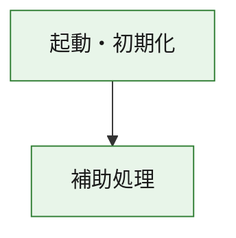
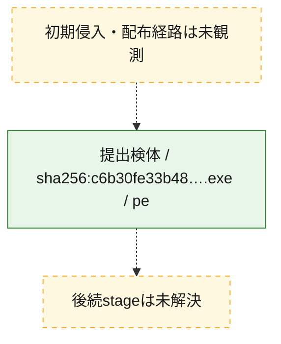
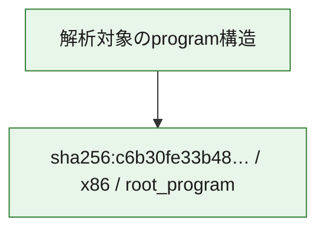

# 全体ロジック：c6b30fe33b4891fecabf2d2b5577f994a60fb1e4002923accf1c4f5cffad0eec

代表関数の静的証跡から、起動・初期化の処理群を確認しました。

## 読み方

- phaseの掲載順は解析上の整理順です。observed_call_edgesがない段階間の実行順を断定しません。
- 図の実線は静的に観測した関係、点線と黄色のノードは未観測・未解決の関係を示します。
- 図は静的な要約であり、動的実行を再現するものではありません。
- 詳細な関数解説とfingerprintは[STATIC-LOGIC.md](STATIC-LOGIC.md)を参照してください。

## 静的可視化

### 実行フロー

### 感染チェーン

### モジュール関係

## 処理段階

### 1. 起動・初期化

entry pointから初期化と後続処理への移行を確認します。
確度: `confirmed_static_function_evidence`

- `c6b30fe33b4891fecabf2d2b5577f994a60fb1e4002923accf1c4f5cffad0eec:ghidra:180001010` — 初期化と主要処理への分岐を行う入口関数です。 状態: `succeeded`、選定理由: `entry_point`, `meaningful_symbol_name`, `reviewed_call_centrality:22`, `role:entrypoint`, `small_program_complete_context`

### 2. 補助処理

主要処理を支える一般内部関数またはlibrary処理を確認します。
確度: `confirmed_static_function_evidence`

- `c6b30fe33b4891fecabf2d2b5577f994a60fb1e4002923accf1c4f5cffad0eec:ghidra:180001240` — 検体内部の一般処理を実装する関数です。 状態: `succeeded`、選定理由: `context_representative`, `reviewed_call_centrality:2`, `small_program_complete_context`
- `c6b30fe33b4891fecabf2d2b5577f994a60fb1e4002923accf1c4f5cffad0eec:ghidra:180001350` — 検体内部の一般処理を実装する関数です。 状態: `succeeded`、選定理由: `context_representative`, `reviewed_call_centrality:25`, `small_program_complete_context`
- `c6b30fe33b4891fecabf2d2b5577f994a60fb1e4002923accf1c4f5cffad0eec:ghidra:180003780` — 検体内部の一般処理を実装する関数です。 状態: `succeeded`、選定理由: `context_representative`, `reviewed_call_centrality:2`, `small_program_complete_context`
- `c6b30fe33b4891fecabf2d2b5577f994a60fb1e4002923accf1c4f5cffad0eec:ghidra:1800038e0` — 検体内部の一般処理を実装する関数です。 状態: `succeeded`、選定理由: `context_representative`, `reviewed_call_centrality:2`, `small_program_complete_context`

## 観測したcall関係

- `c6b30fe33b4891fecabf2d2b5577f994a60fb1e4002923accf1c4f5cffad0eec:ghidra:180001010` → `c6b30fe33b4891fecabf2d2b5577f994a60fb1e4002923accf1c4f5cffad0eec:ghidra:180001240` （`startup` → `support`）
- `c6b30fe33b4891fecabf2d2b5577f994a60fb1e4002923accf1c4f5cffad0eec:ghidra:180001010` → `c6b30fe33b4891fecabf2d2b5577f994a60fb1e4002923accf1c4f5cffad0eec:ghidra:180001350` （`startup` → `support`）
- `c6b30fe33b4891fecabf2d2b5577f994a60fb1e4002923accf1c4f5cffad0eec:ghidra:180001350` → `c6b30fe33b4891fecabf2d2b5577f994a60fb1e4002923accf1c4f5cffad0eec:ghidra:180001240` （`support` → `support`）
- `c6b30fe33b4891fecabf2d2b5577f994a60fb1e4002923accf1c4f5cffad0eec:ghidra:180001350` → `c6b30fe33b4891fecabf2d2b5577f994a60fb1e4002923accf1c4f5cffad0eec:ghidra:180003780` （`support` → `support`）
- `c6b30fe33b4891fecabf2d2b5577f994a60fb1e4002923accf1c4f5cffad0eec:ghidra:180001350` → `c6b30fe33b4891fecabf2d2b5577f994a60fb1e4002923accf1c4f5cffad0eec:ghidra:1800038e0` （`support` → `support`）
- `c6b30fe33b4891fecabf2d2b5577f994a60fb1e4002923accf1c4f5cffad0eec:ghidra:180003780` → `c6b30fe33b4891fecabf2d2b5577f994a60fb1e4002923accf1c4f5cffad0eec:ghidra:1800038e0` （`support` → `support`）
- `ghidra-function:8fff9e300143032b4468d101` → `ghidra-function:0bffcce0efae90646508b528` （`unclassified` → `unclassified`）
- `ghidra-function:8fff9e300143032b4468d101` → `ghidra-function:14bf5a5f5be2d513763a24ff` （`unclassified` → `unclassified`）
- `ghidra-function:8fff9e300143032b4468d101` → `ghidra-function:16935cbbef83ae44b33bd333` （`unclassified` → `unclassified`）
- `ghidra-function:8fff9e300143032b4468d101` → `ghidra-function:1ac9d65b607c9087379b9f50` （`unclassified` → `unclassified`）
- `ghidra-function:8fff9e300143032b4468d101` → `ghidra-function:37d4822772078c15f368f45c` （`unclassified` → `unclassified`）
- `ghidra-function:8fff9e300143032b4468d101` → `ghidra-function:5759438233a73f665cac890d` （`unclassified` → `unclassified`）
- `ghidra-function:8fff9e300143032b4468d101` → `ghidra-function:79d0c65d43188329c42504b6` （`unclassified` → `unclassified`）
- `ghidra-function:8fff9e300143032b4468d101` → `ghidra-function:a43f0dea2604e555e035e28f` （`unclassified` → `unclassified`）
- `ghidra-function:8fff9e300143032b4468d101` → `ghidra-function:bdad998000260f300cc3dc0a` （`unclassified` → `unclassified`）
- `ghidra-function:8fff9e300143032b4468d101` → `ghidra-function:d12991d2004fe8c4b53cea43` （`unclassified` → `unclassified`）
- `ghidra-function:8fff9e300143032b4468d101` → `ghidra-function:e8d3a0d0aa4cde396c72b824` （`unclassified` → `unclassified`）
- `ghidra-function:8fff9e300143032b4468d101` → `ghidra-function:feb7a7b421c1c93c0d0910ae` （`unclassified` → `unclassified`）
- `ghidra-function:a43f0dea2604e555e035e28f` → `ghidra-external:003437c13d89d804b3fdf0ed` （`unclassified` → `unclassified`）
- `ghidra-function:a43f0dea2604e555e035e28f` → `ghidra-external:100b3b9e67bf4dc4a2599581` （`unclassified` → `unclassified`）
- `ghidra-function:a43f0dea2604e555e035e28f` → `ghidra-external:132d48f1bd9917a891a77a72` （`unclassified` → `unclassified`）
- `ghidra-function:a43f0dea2604e555e035e28f` → `ghidra-external:3104f5de7fa07108f716dffa` （`unclassified` → `unclassified`）
- `ghidra-function:a43f0dea2604e555e035e28f` → `ghidra-external:3449b5a15a590ea163706a80` （`unclassified` → `unclassified`）
- `ghidra-function:a43f0dea2604e555e035e28f` → `ghidra-external:3cf63b4113d77fb4391e0290` （`unclassified` → `unclassified`）
- `ghidra-function:a43f0dea2604e555e035e28f` → `ghidra-external:4143b6efd828e7659175f710` （`unclassified` → `unclassified`）
- `ghidra-function:a43f0dea2604e555e035e28f` → `ghidra-external:4876cf58069bd5089aecfdcb` （`unclassified` → `unclassified`）
- `ghidra-function:a43f0dea2604e555e035e28f` → `ghidra-external:55d73b6f6ed8e1f696ef0cc8` （`unclassified` → `unclassified`）
- `ghidra-function:a43f0dea2604e555e035e28f` → `ghidra-external:796a05f417599977e85f5cec` （`unclassified` → `unclassified`）
- `ghidra-function:a43f0dea2604e555e035e28f` → `ghidra-external:8281d01b756a197cfc849dd2` （`unclassified` → `unclassified`）
- `ghidra-function:a43f0dea2604e555e035e28f` → `ghidra-external:854e5e35491d83f3dcf85094` （`unclassified` → `unclassified`）
- `ghidra-function:a43f0dea2604e555e035e28f` → `ghidra-external:92d3723d170b6e16460a9ca4` （`unclassified` → `unclassified`）
- `ghidra-function:a43f0dea2604e555e035e28f` → `ghidra-external:a15b54f58b69577ca291f5d6` （`unclassified` → `unclassified`）
- `ghidra-function:a43f0dea2604e555e035e28f` → `ghidra-external:b8cef12a6fcbcecd844dd51c` （`unclassified` → `unclassified`）
- `ghidra-function:a43f0dea2604e555e035e28f` → `ghidra-external:c6b11424596669dffeaaeb24` （`unclassified` → `unclassified`）
- `ghidra-function:a43f0dea2604e555e035e28f` → `ghidra-external:cfef077f3e1e249503d88f68` （`unclassified` → `unclassified`）
- `ghidra-function:a43f0dea2604e555e035e28f` → `ghidra-external:db00410d17140e8188903255` （`unclassified` → `unclassified`）
- `ghidra-function:a43f0dea2604e555e035e28f` → `ghidra-external:db5f397f787ae7e8b44c908d` （`unclassified` → `unclassified`）
- `ghidra-function:a43f0dea2604e555e035e28f` → `ghidra-external:e4f150965c571b5aa9dbc051` （`unclassified` → `unclassified`）
- `ghidra-function:a43f0dea2604e555e035e28f` → `ghidra-external:e9ec3da7aed138524d79498a` （`unclassified` → `unclassified`）
- `ghidra-function:a43f0dea2604e555e035e28f` → `ghidra-function:1ac9d65b607c9087379b9f50` （`unclassified` → `unclassified`）
- `ghidra-function:a43f0dea2604e555e035e28f` → `ghidra-function:db91893bde54b4256379a562` （`unclassified` → `unclassified`）
- `ghidra-function:a43f0dea2604e555e035e28f` → `ghidra-function:ee9719a2e640e0cc88033875` （`unclassified` → `unclassified`）
- `ghidra-function:db91893bde54b4256379a562` → `ghidra-function:ee9719a2e640e0cc88033875` （`unclassified` → `unclassified`）

## 解析範囲と制約

- 選定外関数は全体inventoryへ残しますが、関数本体の個別解説対象にはしていません。
- indirect call、難読化、packer、VM、壊れたcontrol flowによりcall関係が欠落する場合があります。
- 文書は静的解析に基づき、検体実行や外部通信による動的確認は行っていません。
