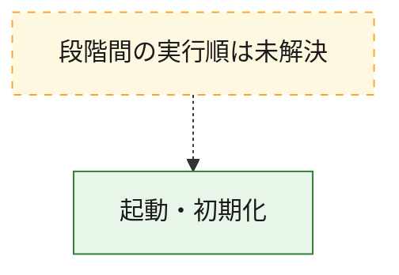
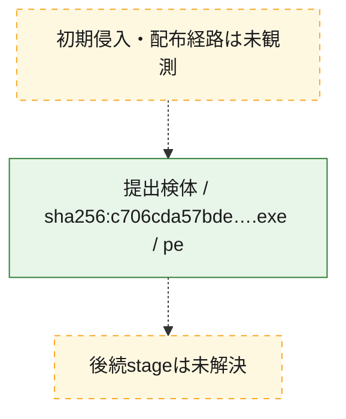
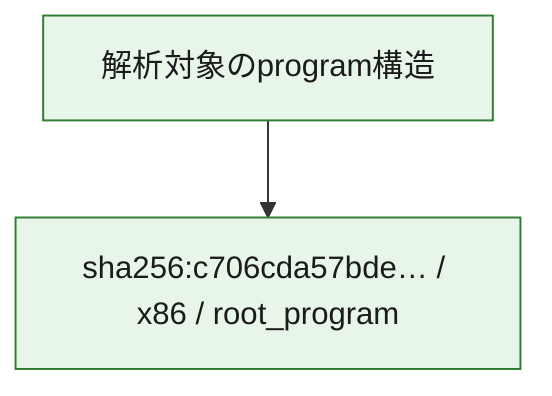

# 全体ロジック：c706cda57bdedcba57008dba259b9c4e12564b7b4cc70c4b27fecd07ccaa8f51

代表関数の静的証跡から、起動・初期化の処理群を確認しました。

## 読み方

- phaseの掲載順は解析上の整理順です。observed_call_edgesがない段階間の実行順を断定しません。
- 図の実線は静的に観測した関係、点線と黄色のノードは未観測・未解決の関係を示します。
- 図は静的な要約であり、動的実行を再現するものではありません。
- 詳細な関数解説とfingerprintは[STATIC-LOGIC.md](STATIC-LOGIC.md)を参照してください。

## 静的可視化

### 実行フロー

### 感染チェーン

### モジュール関係

## 処理段階

### 1. 起動・初期化

entry pointから初期化と後続処理への移行を確認します。
確度: `confirmed_static_function_evidence`

- `c706cda57bdedcba57008dba259b9c4e12564b7b4cc70c4b27fecd07ccaa8f51:ghidra:0041181c` — 初期化と主要処理への分岐を行う入口関数です。 状態: `succeeded`、選定理由: `entry_point`, `large_function:instructions=149`, `meaningful_symbol_name`, `reviewed_call_centrality:18`, `role:entrypoint`, `small_program_complete_context`

## 観測したcall関係

- `ghidra-function:f656f45c942de8c5e8f70e0c` → `ghidra-external:05077245b855744302ce33e4` （`unclassified` → `unclassified`）
- `ghidra-function:f656f45c942de8c5e8f70e0c` → `ghidra-external:08f0a8ec8decb6303ff56976` （`unclassified` → `unclassified`）
- `ghidra-function:f656f45c942de8c5e8f70e0c` → `ghidra-external:1686a419bada0161003344f4` （`unclassified` → `unclassified`）
- `ghidra-function:f656f45c942de8c5e8f70e0c` → `ghidra-external:224d520ea8c69525f63155d8` （`unclassified` → `unclassified`）
- `ghidra-function:f656f45c942de8c5e8f70e0c` → `ghidra-external:378a292eda286e97c87e3cba` （`unclassified` → `unclassified`）
- `ghidra-function:f656f45c942de8c5e8f70e0c` → `ghidra-external:4f5ecaf7256a5bbcf6ed4269` （`unclassified` → `unclassified`）
- `ghidra-function:f656f45c942de8c5e8f70e0c` → `ghidra-external:51e09cbaff0323bb1aa2c578` （`unclassified` → `unclassified`）
- `ghidra-function:f656f45c942de8c5e8f70e0c` → `ghidra-external:6caefc969d44a0684a25bf1e` （`unclassified` → `unclassified`）
- `ghidra-function:f656f45c942de8c5e8f70e0c` → `ghidra-external:9a8612c1e87fdc1624e62ac5` （`unclassified` → `unclassified`）
- `ghidra-function:f656f45c942de8c5e8f70e0c` → `ghidra-external:a3068e1e24184d3cc2e8f9c5` （`unclassified` → `unclassified`）
- `ghidra-function:f656f45c942de8c5e8f70e0c` → `ghidra-external:a31677c1c8b8ee35ad526f0c` （`unclassified` → `unclassified`）
- `ghidra-function:f656f45c942de8c5e8f70e0c` → `ghidra-external:afb577019fef157c7546c393` （`unclassified` → `unclassified`）
- `ghidra-function:f656f45c942de8c5e8f70e0c` → `ghidra-external:d14d9068d3e0e072eca87e1f` （`unclassified` → `unclassified`）
- `ghidra-function:f656f45c942de8c5e8f70e0c` → `ghidra-external:df56169c8bc270fe05a55efd` （`unclassified` → `unclassified`）
- `ghidra-function:f656f45c942de8c5e8f70e0c` → `ghidra-external:e0a7ffa648daba00839346e6` （`unclassified` → `unclassified`）
- `ghidra-function:f656f45c942de8c5e8f70e0c` → `ghidra-external:e888881b99d9e519e99f15d4` （`unclassified` → `unclassified`）
- `ghidra-function:f656f45c942de8c5e8f70e0c` → `ghidra-external:f35c7c55d95eb098194c3594` （`unclassified` → `unclassified`）
- `ghidra-function:f656f45c942de8c5e8f70e0c` → `ghidra-external:fcb759f48ab6a8f17290b9b2` （`unclassified` → `unclassified`）

## 解析範囲と制約

- 選定外関数は全体inventoryへ残しますが、関数本体の個別解説対象にはしていません。
- indirect call、難読化、packer、VM、壊れたcontrol flowによりcall関係が欠落する場合があります。
- 文書は静的解析に基づき、検体実行や外部通信による動的確認は行っていません。
