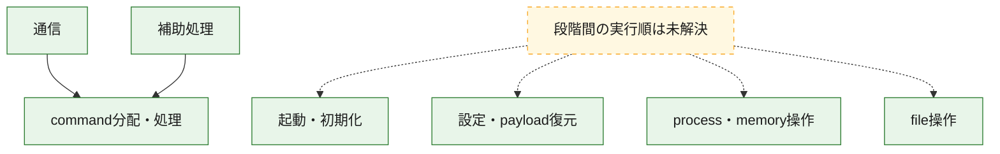
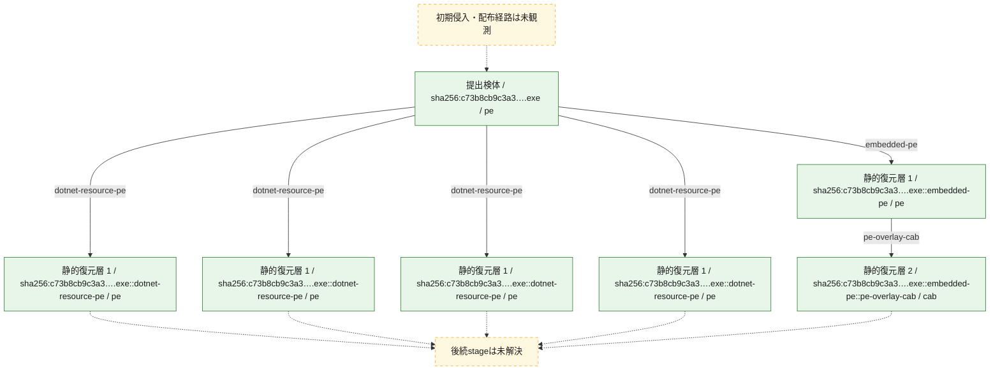
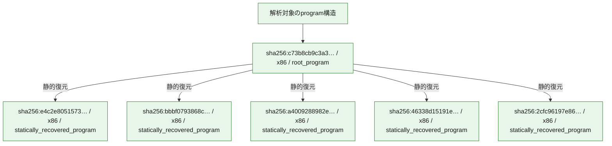

# 全体ロジック：c73b8cb9c3a35b29d83749da7530033f036cc1cbd7b52d442f35b39e4b1cbae9

代表関数の静的証跡から、起動・初期化、設定・payload復元、process・memory操作、通信、command分配・処理、file操作の処理群を確認しました。

## 読み方

- phaseの掲載順は解析上の整理順です。observed_call_edgesがない段階間の実行順を断定しません。
- 図の実線は静的に観測した関係、点線と黄色のノードは未観測・未解決の関係を示します。
- 図は静的な要約であり、動的実行を再現するものではありません。
- 詳細な関数解説とfingerprintは[STATIC-LOGIC.md](STATIC-LOGIC.md)を参照してください。

## 静的可視化

### 実行フロー

### 感染チェーン

### モジュール関係

## 処理段階

### 1. 起動・初期化

entry pointから初期化と後続処理への移行を確認します。
確度: `confirmed_static_function_evidence`

- `c73b8cb9c3a35b29d83749da7530033f036cc1cbd7b52d442f35b39e4b1cbae9:cil:0x0600002f` — 初期化と主要処理への分岐を行う入口関数です。 状態: `succeeded`、選定理由: `entry_point`, `reviewed_call_centrality:8`
- `c73b8cb9c3a35b29d83749da7530033f036cc1cbd7b52d442f35b39e4b1cbae9:cil:0x06000034` — 初期化と主要処理への分岐を行う入口関数です。 状態: `succeeded`、選定理由: `entry_point`, `large_function:instructions=73`, `reviewed_call_centrality:16`

### 2. 設定・payload復元

設定、resource、payload、暗号化データの復元・変換を確認します。
確度: `confirmed_static_function_evidence_with_limits`

- `bbbf0793868c3bff709989439b7e66a849507de322e7e5687f8d574fac62d8e0:cil:0x06000030` — 暗号、hash、encoding、または復号処理に関係する関数です。 状態: `succeeded`、選定理由: `reviewed_call_centrality:14`, `role:cryptographic_transform`
- `bbbf0793868c3bff709989439b7e66a849507de322e7e5687f8d574fac62d8e0:cil:0x06000031` — 暗号、hash、encoding、または復号処理に関係する関数です。 状態: `succeeded`、選定理由: `reviewed_call_centrality:6`, `role:cryptographic_transform`
- `bbbf0793868c3bff709989439b7e66a849507de322e7e5687f8d574fac62d8e0:cil:0x06000032` — 暗号、hash、encoding、または復号処理に関係する関数です。 状態: `succeeded`、選定理由: `reviewed_call_centrality:10`, `role:cryptographic_transform`
- `bbbf0793868c3bff709989439b7e66a849507de322e7e5687f8d574fac62d8e0:cil:0x06000033` — 暗号、hash、encoding、または復号処理に関係する関数です。 状態: `succeeded`、選定理由: `reviewed_call_centrality:14`, `role:cryptographic_transform`
- `bbbf0793868c3bff709989439b7e66a849507de322e7e5687f8d574fac62d8e0:cil:0x06000034` — 暗号、hash、encoding、または復号処理に関係する関数です。 状態: `succeeded`、選定理由: `reviewed_call_centrality:8`, `role:cryptographic_transform`
- `bbbf0793868c3bff709989439b7e66a849507de322e7e5687f8d574fac62d8e0:cil:0x06000035` — 暗号、hash、encoding、または復号処理に関係する関数です。 状態: `succeeded`、選定理由: `reviewed_call_centrality:8`, `role:cryptographic_transform`
- `bbbf0793868c3bff709989439b7e66a849507de322e7e5687f8d574fac62d8e0:cil:0x06000036` — 設定、resource、payloadなどの解析・変換を行う関数です。 状態: `succeeded`、選定理由: `reviewed_call_centrality:8`, `role:config_or_data_transform`
- `bbbf0793868c3bff709989439b7e66a849507de322e7e5687f8d574fac62d8e0:cil:0x06000037` — 設定、resource、payloadなどの解析・変換を行う関数です。 状態: `succeeded`、選定理由: `reviewed_call_centrality:8`, `role:config_or_data_transform`
- `bbbf0793868c3bff709989439b7e66a849507de322e7e5687f8d574fac62d8e0:cil:0x06000038` — 暗号、hash、encoding、または復号処理に関係する関数です。 状態: `succeeded`、選定理由: `reviewed_call_centrality:20`, `role:cryptographic_transform`
- `bbbf0793868c3bff709989439b7e66a849507de322e7e5687f8d574fac62d8e0:cil:0x06000039` — 設定、resource、payloadなどの解析・変換を行う関数です。 状態: `succeeded`、選定理由: `reviewed_call_centrality:22`, `role:config_or_data_transform`
- `bbbf0793868c3bff709989439b7e66a849507de322e7e5687f8d574fac62d8e0:cil:0x0600008a` — 暗号、hash、encoding、または復号処理に関係する関数です。 状態: `succeeded`、選定理由: `reviewed_call_centrality:2`, `role:cryptographic_transform`
- `bbbf0793868c3bff709989439b7e66a849507de322e7e5687f8d574fac62d8e0:cil:0x0600008c` — 設定、resource、payloadなどの解析・変換を行う関数です。 状態: `succeeded`、選定理由: `reviewed_call_centrality:2`, `role:config_or_data_transform`
- `bbbf0793868c3bff709989439b7e66a849507de322e7e5687f8d574fac62d8e0:cil:0x0600008f` — 設定、resource、payloadなどの解析・変換を行う関数です。 状態: `succeeded`、選定理由: `reviewed_call_centrality:12`, `role:config_or_data_transform`
- `bbbf0793868c3bff709989439b7e66a849507de322e7e5687f8d574fac62d8e0:cil:0x06000090` — 設定、resource、payloadなどの解析・変換を行う関数です。 状態: `succeeded`、選定理由: `reviewed_call_centrality:14`, `role:config_or_data_transform`
- `a4009288982e4c30d22b544167f72db882e34f0fda7d4061b2c02c84688c0ed1:cil:0x06000091` — 設定、resource、payloadなどの解析・変換を行う関数です。 状態: `succeeded`、選定理由: `large_function:instructions=829`, `reviewed_call_centrality:62`, `role:config_or_data_transform`
- `a4009288982e4c30d22b544167f72db882e34f0fda7d4061b2c02c84688c0ed1:cil:0x0600009d` — 設定、resource、payloadなどの解析・変換を行う関数です。 状態: `succeeded`、選定理由: `reviewed_call_centrality:2`, `role:config_or_data_transform`
- `a4009288982e4c30d22b544167f72db882e34f0fda7d4061b2c02c84688c0ed1:cil:0x0600009e` — 設定、resource、payloadなどの解析・変換を行う関数です。 状態: `succeeded`、選定理由: `reviewed_call_centrality:18`, `role:config_or_data_transform`
- `a4009288982e4c30d22b544167f72db882e34f0fda7d4061b2c02c84688c0ed1:cil:0x060000e2` — 暗号、hash、encoding、または復号処理に関係する関数です。 状態: `succeeded`、選定理由: `role:cryptographic_transform`
- `a4009288982e4c30d22b544167f72db882e34f0fda7d4061b2c02c84688c0ed1:cil:0x060000fa` — 設定、resource、payloadなどの解析・変換を行う関数です。 状態: `succeeded`、選定理由: `reviewed_call_centrality:8`, `role:config_or_data_transform`
- `a4009288982e4c30d22b544167f72db882e34f0fda7d4061b2c02c84688c0ed1:cil:0x060000fc` — 暗号、hash、encoding、または復号処理に関係する関数です。 状態: `succeeded`、選定理由: `reviewed_call_centrality:6`, `role:cryptographic_transform`
- `a4009288982e4c30d22b544167f72db882e34f0fda7d4061b2c02c84688c0ed1:cil:0x06000189` — 暗号、hash、encoding、または復号処理に関係する関数です。 状態: `succeeded`、選定理由: `large_function:instructions=133`, `reviewed_call_centrality:6`, `role:cryptographic_transform`
- `a4009288982e4c30d22b544167f72db882e34f0fda7d4061b2c02c84688c0ed1:cil:0x06000274` — 設定、resource、payloadなどの解析・変換を行う関数です。 状態: `deferred_resource_budget`、選定理由: `role:config_or_data_transform`
- `a4009288982e4c30d22b544167f72db882e34f0fda7d4061b2c02c84688c0ed1:cil:0x0600037f` — 設定、resource、payloadなどの解析・変換を行う関数です。 状態: `deferred_resource_budget`、選定理由: `role:config_or_data_transform`
- `a4009288982e4c30d22b544167f72db882e34f0fda7d4061b2c02c84688c0ed1:cil:0x06000382` — 設定、resource、payloadなどの解析・変換を行う関数です。 状態: `deferred_resource_budget`、選定理由: `role:config_or_data_transform`
- `46338d15191e130ec9f33f329081fb45e224b9c7e333701baa409337d5c9faee:cil:0x0600009e` — 暗号、hash、encoding、または復号処理に関係する関数です。 状態: `succeeded`、選定理由: `reviewed_call_centrality:6`, `role:cryptographic_transform`
- `46338d15191e130ec9f33f329081fb45e224b9c7e333701baa409337d5c9faee:cil:0x060000c1` — 設定、resource、payloadなどの解析・変換を行う関数です。 状態: `succeeded`、選定理由: `reviewed_call_centrality:8`, `role:config_or_data_transform`
- `46338d15191e130ec9f33f329081fb45e224b9c7e333701baa409337d5c9faee:cil:0x060000cb` — 設定、resource、payloadなどの解析・変換を行う関数です。 状態: `succeeded`、選定理由: `large_function:instructions=89`, `reviewed_call_centrality:18`, `role:config_or_data_transform`
- `46338d15191e130ec9f33f329081fb45e224b9c7e333701baa409337d5c9faee:cil:0x06000123` — 暗号、hash、encoding、または復号処理に関係する関数です。 状態: `succeeded`、選定理由: `large_function:instructions=106`, `reviewed_call_centrality:14`, `role:cryptographic_transform`
- `46338d15191e130ec9f33f329081fb45e224b9c7e333701baa409337d5c9faee:cil:0x06000215` — 設定、resource、payloadなどの解析・変換を行う関数です。 状態: `succeeded`、選定理由: `reviewed_call_centrality:16`, `role:config_or_data_transform`
- `46338d15191e130ec9f33f329081fb45e224b9c7e333701baa409337d5c9faee:cil:0x06000217` — 設定、resource、payloadなどの解析・変換を行う関数です。 状態: `succeeded`、選定理由: `large_function:instructions=143`, `reviewed_call_centrality:62`, `role:config_or_data_transform`
- `46338d15191e130ec9f33f329081fb45e224b9c7e333701baa409337d5c9faee:cil:0x06000219` — 設定、resource、payloadなどの解析・変換を行う関数です。 状態: `succeeded`、選定理由: `reviewed_call_centrality:16`, `role:config_or_data_transform`
- `46338d15191e130ec9f33f329081fb45e224b9c7e333701baa409337d5c9faee:cil:0x0600021a` — 設定、resource、payloadなどの解析・変換を行う関数です。 状態: `succeeded`、選定理由: `large_function:instructions=83`, `reviewed_call_centrality:48`, `role:config_or_data_transform`
- `46338d15191e130ec9f33f329081fb45e224b9c7e333701baa409337d5c9faee:cil:0x06000223` — 設定、resource、payloadなどの解析・変換を行う関数です。 状態: `succeeded`、選定理由: `large_function:instructions=111`, `reviewed_call_centrality:16`, `role:config_or_data_transform`
- `46338d15191e130ec9f33f329081fb45e224b9c7e333701baa409337d5c9faee:cil:0x0600022a` — 設定、resource、payloadなどの解析・変換を行う関数です。 状態: `succeeded`、選定理由: `large_function:instructions=175`, `reviewed_call_centrality:26`, `role:config_or_data_transform`
- `46338d15191e130ec9f33f329081fb45e224b9c7e333701baa409337d5c9faee:cil:0x0600022b` — 設定、resource、payloadなどの解析・変換を行う関数です。 状態: `succeeded`、選定理由: `reviewed_call_centrality:8`, `role:config_or_data_transform`
- `2cfc96197e86ce1c31e2653ebe502a43df1a03e047b601239b141a792f56731e:ghidra:0043f65a` — 暗号、hash、encoding、または復号処理に関係する関数です。 状態: `limited_bad_instruction_or_flow`、選定理由: `meaningful_symbol_name`, `reviewed_call_centrality:1`, `role:cryptographic_transform`
- `2cfc96197e86ce1c31e2653ebe502a43df1a03e047b601239b141a792f56731e:ghidra:0043f722` — 暗号、hash、encoding、または復号処理に関係する関数です。 状態: `limited_bad_instruction_or_flow`、選定理由: `meaningful_symbol_name`, `reviewed_call_centrality:1`, `role:cryptographic_transform`
- `c73b8cb9c3a35b29d83749da7530033f036cc1cbd7b52d442f35b39e4b1cbae9:cil:0x0600006e` — 暗号、hash、encoding、または復号処理に関係する関数です。 状態: `succeeded`、選定理由: `reviewed_call_centrality:16`, `role:cryptographic_transform`
- `c73b8cb9c3a35b29d83749da7530033f036cc1cbd7b52d442f35b39e4b1cbae9:cil:0x0600006f` — 設定、resource、payloadなどの解析・変換を行う関数です。 状態: `succeeded`、選定理由: `large_function:instructions=131`, `reviewed_call_centrality:44`, `role:config_or_data_transform`
- `c73b8cb9c3a35b29d83749da7530033f036cc1cbd7b52d442f35b39e4b1cbae9:cil:0x060001af` — 設定、resource、payloadなどの解析・変換を行う関数です。 状態: `succeeded`、選定理由: `large_function:instructions=217`, `reviewed_call_centrality:54`, `role:config_or_data_transform`

### 3. process・memory操作

process、thread、module、memory操作と実行移行を確認します。
確度: `confirmed_static_function_evidence`

- `c73b8cb9c3a35b29d83749da7530033f036cc1cbd7b52d442f35b39e4b1cbae9:cil:0x060001aa` — process、thread、module、またはmemory操作に関係する関数です。 状態: `succeeded`、選定理由: `reviewed_call_centrality:22`, `role:process_or_memory_operation`
- `c73b8cb9c3a35b29d83749da7530033f036cc1cbd7b52d442f35b39e4b1cbae9:cil:0x060001d7` — process、thread、module、またはmemory操作に関係する関数です。 状態: `succeeded`、選定理由: `large_function:instructions=140`, `reviewed_call_centrality:42`, `role:process_or_memory_operation`
- `c73b8cb9c3a35b29d83749da7530033f036cc1cbd7b52d442f35b39e4b1cbae9:cil:0x060001e7` — process、thread、module、またはmemory操作に関係する関数です。 状態: `succeeded`、選定理由: `large_function:instructions=573`, `reviewed_call_centrality:142`, `role:process_or_memory_operation`
- `c73b8cb9c3a35b29d83749da7530033f036cc1cbd7b52d442f35b39e4b1cbae9:cil:0x060001ea` — process、thread、module、またはmemory操作に関係する関数です。 状態: `succeeded`、選定理由: `large_function:instructions=1742`, `reviewed_call_centrality:206`, `role:process_or_memory_operation`
- `c73b8cb9c3a35b29d83749da7530033f036cc1cbd7b52d442f35b39e4b1cbae9:cil:0x06000209` — process、thread、module、またはmemory操作に関係する関数です。 状態: `succeeded`、選定理由: `reviewed_call_centrality:16`, `role:process_or_memory_operation`

### 4. 通信

通信初期化、endpoint処理、送受信の役割を確認します。
確度: `confirmed_static_function_evidence_with_limits`

- `a4009288982e4c30d22b544167f72db882e34f0fda7d4061b2c02c84688c0ed1:cil:0x06000358` — 通信初期化、送受信、またはendpoint処理に関係する関数です。 状態: `deferred_resource_budget`、選定理由: `role:network_communication`
- `a4009288982e4c30d22b544167f72db882e34f0fda7d4061b2c02c84688c0ed1:cil:0x06000359` — 通信初期化、送受信、またはendpoint処理に関係する関数です。 状態: `deferred_resource_budget`、選定理由: `role:network_communication`
- `a4009288982e4c30d22b544167f72db882e34f0fda7d4061b2c02c84688c0ed1:cil:0x0600035b` — 通信初期化、送受信、またはendpoint処理に関係する関数です。 状態: `deferred_resource_budget`、選定理由: `role:network_communication`
- `a4009288982e4c30d22b544167f72db882e34f0fda7d4061b2c02c84688c0ed1:cil:0x0600035c` — 通信初期化、送受信、またはendpoint処理に関係する関数です。 状態: `deferred_resource_budget`、選定理由: `role:network_communication`
- `a4009288982e4c30d22b544167f72db882e34f0fda7d4061b2c02c84688c0ed1:cil:0x0600035d` — 通信初期化、送受信、またはendpoint処理に関係する関数です。 状態: `deferred_resource_budget`、選定理由: `role:network_communication`
- `a4009288982e4c30d22b544167f72db882e34f0fda7d4061b2c02c84688c0ed1:cil:0x0600035e` — 通信初期化、送受信、またはendpoint処理に関係する関数です。 状態: `deferred_resource_budget`、選定理由: `role:network_communication`
- `a4009288982e4c30d22b544167f72db882e34f0fda7d4061b2c02c84688c0ed1:cil:0x0600035f` — 通信初期化、送受信、またはendpoint処理に関係する関数です。 状態: `deferred_resource_budget`、選定理由: `role:network_communication`
- `a4009288982e4c30d22b544167f72db882e34f0fda7d4061b2c02c84688c0ed1:cil:0x06000360` — 通信初期化、送受信、またはendpoint処理に関係する関数です。 状態: `deferred_resource_budget`、選定理由: `role:network_communication`
- `a4009288982e4c30d22b544167f72db882e34f0fda7d4061b2c02c84688c0ed1:cil:0x06000361` — 通信初期化、送受信、またはendpoint処理に関係する関数です。 状態: `deferred_resource_budget`、選定理由: `role:network_communication`
- `a4009288982e4c30d22b544167f72db882e34f0fda7d4061b2c02c84688c0ed1:cil:0x06000362` — 通信初期化、送受信、またはendpoint処理に関係する関数です。 状態: `deferred_resource_budget`、選定理由: `role:network_communication`
- `a4009288982e4c30d22b544167f72db882e34f0fda7d4061b2c02c84688c0ed1:cil:0x06000380` — 通信初期化、送受信、またはendpoint処理に関係する関数です。 状態: `deferred_resource_budget`、選定理由: `role:network_communication`
- `a4009288982e4c30d22b544167f72db882e34f0fda7d4061b2c02c84688c0ed1:cil:0x060003cd` — 通信初期化、送受信、またはendpoint処理に関係する関数です。 状態: `deferred_resource_budget`、選定理由: `role:network_communication`
- `a4009288982e4c30d22b544167f72db882e34f0fda7d4061b2c02c84688c0ed1:cil:0x060003ce` — 通信初期化、送受信、またはendpoint処理に関係する関数です。 状態: `deferred_resource_budget`、選定理由: `role:network_communication`
- `a4009288982e4c30d22b544167f72db882e34f0fda7d4061b2c02c84688c0ed1:cil:0x060003d0` — 通信初期化、送受信、またはendpoint処理に関係する関数です。 状態: `deferred_resource_budget`、選定理由: `role:network_communication`
- `a4009288982e4c30d22b544167f72db882e34f0fda7d4061b2c02c84688c0ed1:cil:0x060003d1` — 通信初期化、送受信、またはendpoint処理に関係する関数です。 状態: `deferred_resource_budget`、選定理由: `role:network_communication`
- `46338d15191e130ec9f33f329081fb45e224b9c7e333701baa409337d5c9faee:cil:0x060000ac` — 通信初期化、送受信、またはendpoint処理に関係する関数です。 状態: `succeeded`、選定理由: `large_function:instructions=64`, `reviewed_call_centrality:18`, `role:network_communication`
- `46338d15191e130ec9f33f329081fb45e224b9c7e333701baa409337d5c9faee:cil:0x060000c5` — 通信初期化、送受信、またはendpoint処理に関係する関数です。 状態: `succeeded`、選定理由: `large_function:instructions=72`, `reviewed_call_centrality:26`, `role:network_communication`
- `46338d15191e130ec9f33f329081fb45e224b9c7e333701baa409337d5c9faee:cil:0x060000e1` — 通信初期化、送受信、またはendpoint処理に関係する関数です。 状態: `succeeded`、選定理由: `large_function:instructions=138`, `reviewed_call_centrality:16`, `role:network_communication`
- `2cfc96197e86ce1c31e2653ebe502a43df1a03e047b601239b141a792f56731e:ghidra:0044aa17` — 通信初期化、送受信、またはendpoint処理に関係する関数です。 状態: `limited_bad_instruction_or_flow`、選定理由: `meaningful_symbol_name`, `reviewed_call_centrality:1`, `role:network_communication`
- `2cfc96197e86ce1c31e2653ebe502a43df1a03e047b601239b141a792f56731e:ghidra:0044aa49` — 通信初期化、送受信、またはendpoint処理に関係する関数です。 状態: `limited_bad_instruction_or_flow`、選定理由: `meaningful_symbol_name`, `reviewed_call_centrality:1`, `role:network_communication`
- `c73b8cb9c3a35b29d83749da7530033f036cc1cbd7b52d442f35b39e4b1cbae9:cil:0x0600001d` — 通信初期化、送受信、またはendpoint処理に関係する関数です。 状態: `succeeded`、選定理由: `large_function:instructions=191`, `reviewed_call_centrality:42`, `role:network_communication`
- `c73b8cb9c3a35b29d83749da7530033f036cc1cbd7b52d442f35b39e4b1cbae9:cil:0x06000020` — 通信初期化、送受信、またはendpoint処理に関係する関数です。 状態: `succeeded`、選定理由: `large_function:instructions=369`, `reviewed_call_centrality:78`, `role:network_communication`
- `c73b8cb9c3a35b29d83749da7530033f036cc1cbd7b52d442f35b39e4b1cbae9:cil:0x06000022` — 通信初期化、送受信、またはendpoint処理に関係する関数です。 状態: `succeeded`、選定理由: `large_function:instructions=433`, `reviewed_call_centrality:82`, `role:network_communication`
- `c73b8cb9c3a35b29d83749da7530033f036cc1cbd7b52d442f35b39e4b1cbae9:cil:0x06000023` — 通信初期化、送受信、またはendpoint処理に関係する関数です。 状態: `succeeded`、選定理由: `large_function:instructions=383`, `reviewed_call_centrality:82`, `role:network_communication`
- `c73b8cb9c3a35b29d83749da7530033f036cc1cbd7b52d442f35b39e4b1cbae9:cil:0x06000025` — 通信初期化、送受信、またはendpoint処理に関係する関数です。 状態: `succeeded`、選定理由: `large_function:instructions=405`, `reviewed_call_centrality:82`, `role:network_communication`
- `c73b8cb9c3a35b29d83749da7530033f036cc1cbd7b52d442f35b39e4b1cbae9:cil:0x06000026` — 通信初期化、送受信、またはendpoint処理に関係する関数です。 状態: `succeeded`、選定理由: `large_function:instructions=137`, `reviewed_call_centrality:36`, `role:network_communication`
- `c73b8cb9c3a35b29d83749da7530033f036cc1cbd7b52d442f35b39e4b1cbae9:cil:0x06000073` — 通信初期化、送受信、またはendpoint処理に関係する関数です。 状態: `succeeded`、選定理由: `large_function:instructions=161`, `reviewed_call_centrality:34`, `role:network_communication`
- `c73b8cb9c3a35b29d83749da7530033f036cc1cbd7b52d442f35b39e4b1cbae9:cil:0x06000074` — 通信初期化、送受信、またはendpoint処理に関係する関数です。 状態: `succeeded`、選定理由: `large_function:instructions=169`, `reviewed_call_centrality:32`, `role:network_communication`
- `c73b8cb9c3a35b29d83749da7530033f036cc1cbd7b52d442f35b39e4b1cbae9:cil:0x060001a0` — 通信初期化、送受信、またはendpoint処理に関係する関数です。 状態: `succeeded`、選定理由: `large_function:instructions=86`, `reviewed_call_centrality:26`, `role:network_communication`
- `c73b8cb9c3a35b29d83749da7530033f036cc1cbd7b52d442f35b39e4b1cbae9:cil:0x060001b0` — 通信初期化、送受信、またはendpoint処理に関係する関数です。 状態: `succeeded`、選定理由: `large_function:instructions=85`, `reviewed_call_centrality:22`, `role:network_communication`
- `c73b8cb9c3a35b29d83749da7530033f036cc1cbd7b52d442f35b39e4b1cbae9:cil:0x060001b1` — 通信初期化、送受信、またはendpoint処理に関係する関数です。 状態: `succeeded`、選定理由: `large_function:instructions=94`, `reviewed_call_centrality:32`, `role:network_communication`

### 5. command分配・処理

受信commandやtaskの解釈、分配、個別handlerへの移行を確認します。
確度: `confirmed_static_function_evidence_with_limits`

- `bbbf0793868c3bff709989439b7e66a849507de322e7e5687f8d574fac62d8e0:cil:0x0600003e` — commandの解釈、分配、または個別処理を担当する関数です。 状態: `succeeded`、選定理由: `reviewed_call_centrality:10`, `role:command_dispatch_or_handler`
- `bbbf0793868c3bff709989439b7e66a849507de322e7e5687f8d574fac62d8e0:cil:0x0600003f` — commandの解釈、分配、または個別処理を担当する関数です。 状態: `succeeded`、選定理由: `reviewed_call_centrality:14`, `role:command_dispatch_or_handler`
- `bbbf0793868c3bff709989439b7e66a849507de322e7e5687f8d574fac62d8e0:cil:0x06000040` — commandの解釈、分配、または個別処理を担当する関数です。 状態: `succeeded`、選定理由: `reviewed_call_centrality:14`, `role:command_dispatch_or_handler`
- `bbbf0793868c3bff709989439b7e66a849507de322e7e5687f8d574fac62d8e0:cil:0x06000041` — commandの解釈、分配、または個別処理を担当する関数です。 状態: `succeeded`、選定理由: `reviewed_call_centrality:8`, `role:command_dispatch_or_handler`
- `bbbf0793868c3bff709989439b7e66a849507de322e7e5687f8d574fac62d8e0:cil:0x0600004b` — commandの解釈、分配、または個別処理を担当する関数です。 状態: `succeeded`、選定理由: `role:command_dispatch_or_handler`
- `bbbf0793868c3bff709989439b7e66a849507de322e7e5687f8d574fac62d8e0:cil:0x0600004c` — commandの解釈、分配、または個別処理を担当する関数です。 状態: `succeeded`、選定理由: `role:command_dispatch_or_handler`
- `bbbf0793868c3bff709989439b7e66a849507de322e7e5687f8d574fac62d8e0:cil:0x06000088` — commandの解釈、分配、または個別処理を担当する関数です。 状態: `succeeded`、選定理由: `reviewed_call_centrality:14`, `role:command_dispatch_or_handler`
- `a4009288982e4c30d22b544167f72db882e34f0fda7d4061b2c02c84688c0ed1:cil:0x0600029d` — commandの解釈、分配、または個別処理を担当する関数です。 状態: `deferred_resource_budget`、選定理由: `role:command_dispatch_or_handler`
- `a4009288982e4c30d22b544167f72db882e34f0fda7d4061b2c02c84688c0ed1:cil:0x0600029e` — commandの解釈、分配、または個別処理を担当する関数です。 状態: `deferred_resource_budget`、選定理由: `role:command_dispatch_or_handler`
- `a4009288982e4c30d22b544167f72db882e34f0fda7d4061b2c02c84688c0ed1:cil:0x060002a7` — commandの解釈、分配、または個別処理を担当する関数です。 状態: `deferred_resource_budget`、選定理由: `role:command_dispatch_or_handler`
- `a4009288982e4c30d22b544167f72db882e34f0fda7d4061b2c02c84688c0ed1:cil:0x060002a8` — commandの解釈、分配、または個別処理を担当する関数です。 状態: `deferred_resource_budget`、選定理由: `role:command_dispatch_or_handler`
- `46338d15191e130ec9f33f329081fb45e224b9c7e333701baa409337d5c9faee:cil:0x06000011` — commandの解釈、分配、または個別処理を担当する関数です。 状態: `succeeded`、選定理由: `reviewed_call_centrality:8`, `role:command_dispatch_or_handler`
- `46338d15191e130ec9f33f329081fb45e224b9c7e333701baa409337d5c9faee:cil:0x06000013` — commandの解釈、分配、または個別処理を担当する関数です。 状態: `succeeded`、選定理由: `reviewed_call_centrality:12`, `role:command_dispatch_or_handler`
- `46338d15191e130ec9f33f329081fb45e224b9c7e333701baa409337d5c9faee:cil:0x06000028` — commandの解釈、分配、または個別処理を担当する関数です。 状態: `succeeded`、選定理由: `reviewed_call_centrality:12`, `role:command_dispatch_or_handler`
- `46338d15191e130ec9f33f329081fb45e224b9c7e333701baa409337d5c9faee:cil:0x0600002e` — commandの解釈、分配、または個別処理を担当する関数です。 状態: `succeeded`、選定理由: `large_function:instructions=283`, `reviewed_call_centrality:98`, `role:command_dispatch_or_handler`
- `46338d15191e130ec9f33f329081fb45e224b9c7e333701baa409337d5c9faee:cil:0x0600002f` — commandの解釈、分配、または個別処理を担当する関数です。 状態: `succeeded`、選定理由: `reviewed_call_centrality:14`, `role:command_dispatch_or_handler`
- `46338d15191e130ec9f33f329081fb45e224b9c7e333701baa409337d5c9faee:cil:0x06000030` — commandの解釈、分配、または個別処理を担当する関数です。 状態: `succeeded`、選定理由: `reviewed_call_centrality:12`, `role:command_dispatch_or_handler`
- `46338d15191e130ec9f33f329081fb45e224b9c7e333701baa409337d5c9faee:cil:0x06000036` — commandの解釈、分配、または個別処理を担当する関数です。 状態: `succeeded`、選定理由: `reviewed_call_centrality:8`, `role:command_dispatch_or_handler`
- `46338d15191e130ec9f33f329081fb45e224b9c7e333701baa409337d5c9faee:cil:0x06000037` — commandの解釈、分配、または個別処理を担当する関数です。 状態: `succeeded`、選定理由: `reviewed_call_centrality:6`, `role:command_dispatch_or_handler`
- `46338d15191e130ec9f33f329081fb45e224b9c7e333701baa409337d5c9faee:cil:0x06000038` — commandの解釈、分配、または個別処理を担当する関数です。 状態: `succeeded`、選定理由: `reviewed_call_centrality:8`, `role:command_dispatch_or_handler`
- `46338d15191e130ec9f33f329081fb45e224b9c7e333701baa409337d5c9faee:cil:0x06000039` — commandの解釈、分配、または個別処理を担当する関数です。 状態: `succeeded`、選定理由: `reviewed_call_centrality:8`, `role:command_dispatch_or_handler`
- `46338d15191e130ec9f33f329081fb45e224b9c7e333701baa409337d5c9faee:cil:0x0600003a` — commandの解釈、分配、または個別処理を担当する関数です。 状態: `succeeded`、選定理由: `reviewed_call_centrality:6`, `role:command_dispatch_or_handler`
- `46338d15191e130ec9f33f329081fb45e224b9c7e333701baa409337d5c9faee:cil:0x0600003f` — commandの解釈、分配、または個別処理を担当する関数です。 状態: `succeeded`、選定理由: `large_function:instructions=134`, `reviewed_call_centrality:34`, `role:command_dispatch_or_handler`
- `46338d15191e130ec9f33f329081fb45e224b9c7e333701baa409337d5c9faee:cil:0x06000063` — commandの解釈、分配、または個別処理を担当する関数です。 状態: `succeeded`、選定理由: `reviewed_call_centrality:8`, `role:command_dispatch_or_handler`
- `46338d15191e130ec9f33f329081fb45e224b9c7e333701baa409337d5c9faee:cil:0x06000141` — commandの解釈、分配、または個別処理を担当する関数です。 状態: `succeeded`、選定理由: `reviewed_call_centrality:14`, `role:command_dispatch_or_handler`
- `46338d15191e130ec9f33f329081fb45e224b9c7e333701baa409337d5c9faee:cil:0x060001cb` — commandの解釈、分配、または個別処理を担当する関数です。 状態: `succeeded`、選定理由: `reviewed_call_centrality:10`, `role:command_dispatch_or_handler`
- `c73b8cb9c3a35b29d83749da7530033f036cc1cbd7b52d442f35b39e4b1cbae9:cil:0x06000066` — commandの解釈、分配、または個別処理を担当する関数です。 状態: `succeeded`、選定理由: `reviewed_call_centrality:22`, `role:command_dispatch_or_handler`
- `c73b8cb9c3a35b29d83749da7530033f036cc1cbd7b52d442f35b39e4b1cbae9:cil:0x06000067` — commandの解釈、分配、または個別処理を担当する関数です。 状態: `succeeded`、選定理由: `reviewed_call_centrality:18`, `role:command_dispatch_or_handler`
- `c73b8cb9c3a35b29d83749da7530033f036cc1cbd7b52d442f35b39e4b1cbae9:cil:0x060001a4` — commandの解釈、分配、または個別処理を担当する関数です。 状態: `succeeded`、選定理由: `reviewed_call_centrality:14`, `role:command_dispatch_or_handler`
- `c73b8cb9c3a35b29d83749da7530033f036cc1cbd7b52d442f35b39e4b1cbae9:cil:0x060001a6` — commandの解釈、分配、または個別処理を担当する関数です。 状態: `succeeded`、選定理由: `large_function:instructions=75`, `reviewed_call_centrality:34`, `role:command_dispatch_or_handler`
- `c73b8cb9c3a35b29d83749da7530033f036cc1cbd7b52d442f35b39e4b1cbae9:cil:0x060001d8` — commandの解釈、分配、または個別処理を担当する関数です。 状態: `succeeded`、選定理由: `large_function:instructions=124`, `reviewed_call_centrality:40`, `role:command_dispatch_or_handler`
- `c73b8cb9c3a35b29d83749da7530033f036cc1cbd7b52d442f35b39e4b1cbae9:cil:0x060001e9` — commandの解釈、分配、または個別処理を担当する関数です。 状態: `succeeded`、選定理由: `large_function:instructions=304`, `reviewed_call_centrality:96`, `role:command_dispatch_or_handler`

### 6. file操作

fileやdirectoryの作成、読書き、削除を確認します。
確度: `confirmed_static_function_evidence_with_limits`

- `a4009288982e4c30d22b544167f72db882e34f0fda7d4061b2c02c84688c0ed1:cil:0x0600026b` — fileまたはdirectoryの読書き・管理に関係する関数です。 状態: `deferred_resource_budget`、選定理由: `role:file_operation`
- `46338d15191e130ec9f33f329081fb45e224b9c7e333701baa409337d5c9faee:cil:0x0600006f` — fileまたはdirectoryの読書き・管理に関係する関数です。 状態: `succeeded`、選定理由: `large_function:instructions=75`, `reviewed_call_centrality:26`, `role:file_operation`
- `c73b8cb9c3a35b29d83749da7530033f036cc1cbd7b52d442f35b39e4b1cbae9:cil:0x060001c8` — fileまたはdirectoryの読書き・管理に関係する関数です。 状態: `succeeded`、選定理由: `reviewed_call_centrality:18`, `role:file_operation`
- `c73b8cb9c3a35b29d83749da7530033f036cc1cbd7b52d442f35b39e4b1cbae9:cil:0x060001ca` — fileまたはdirectoryの読書き・管理に関係する関数です。 状態: `succeeded`、選定理由: `reviewed_call_centrality:16`, `role:file_operation`
- `c73b8cb9c3a35b29d83749da7530033f036cc1cbd7b52d442f35b39e4b1cbae9:cil:0x060001d9` — fileまたはdirectoryの読書き・管理に関係する関数です。 状態: `succeeded`、選定理由: `reviewed_call_centrality:14`, `role:file_operation`

### 7. 補助処理

主要処理を支える一般内部関数またはlibrary処理を確認します。
確度: `confirmed_static_function_evidence_with_limits`

- `e4c2e8051573001bb120f17a72e3b8d6a98672931cd4260c12d031ae19c16c63:cil:0x0600023f` — 検体内部の一般処理を実装する関数です。 状態: `succeeded`、選定理由: `reviewed_call_centrality:2`, `small_program_complete_context`
- `e4c2e8051573001bb120f17a72e3b8d6a98672931cd4260c12d031ae19c16c63:cil:0x06000240` — 検体内部の一般処理を実装する関数です。 状態: `succeeded`、選定理由: `reviewed_call_centrality:2`, `small_program_complete_context`
- `e4c2e8051573001bb120f17a72e3b8d6a98672931cd4260c12d031ae19c16c63:cil:0x06000241` — 検体内部の一般処理を実装する関数です。 状態: `succeeded`、選定理由: `reviewed_call_centrality:2`, `small_program_complete_context`
- `e4c2e8051573001bb120f17a72e3b8d6a98672931cd4260c12d031ae19c16c63:cil:0x06000242` — 検体内部の一般処理を実装する関数です。 状態: `succeeded`、選定理由: `reviewed_call_centrality:2`, `small_program_complete_context`
- `e4c2e8051573001bb120f17a72e3b8d6a98672931cd4260c12d031ae19c16c63:cil:0x06000243` — 検体内部の一般処理を実装する関数です。 状態: `succeeded`、選定理由: `reviewed_call_centrality:2`, `small_program_complete_context`
- `e4c2e8051573001bb120f17a72e3b8d6a98672931cd4260c12d031ae19c16c63:cil:0x06000244` — compiler生成処理または汎用library処理とみられる関数です。 状態: `succeeded`、選定理由: `reviewed_call_centrality:2`, `small_program_complete_context`
- `e4c2e8051573001bb120f17a72e3b8d6a98672931cd4260c12d031ae19c16c63:cil:0x06000245` — 検体内部の一般処理を実装する関数です。 状態: `succeeded`、選定理由: `large_function:instructions=85`, `reviewed_call_centrality:6`, `small_program_complete_context`
- `e4c2e8051573001bb120f17a72e3b8d6a98672931cd4260c12d031ae19c16c63:cil:0x06000246` — 検体内部の一般処理を実装する関数です。 状態: `succeeded`、選定理由: `reviewed_call_centrality:12`, `small_program_complete_context`
- `e4c2e8051573001bb120f17a72e3b8d6a98672931cd4260c12d031ae19c16c63:cil:0x06000247` — 検体内部の一般処理を実装する関数です。 状態: `succeeded`、選定理由: `large_function:instructions=68`, `reviewed_call_centrality:16`, `small_program_complete_context`
- `e4c2e8051573001bb120f17a72e3b8d6a98672931cd4260c12d031ae19c16c63:cil:0x06000248` — 検体内部の一般処理を実装する関数です。 状態: `succeeded`、選定理由: `reviewed_call_centrality:12`, `small_program_complete_context`
- `e4c2e8051573001bb120f17a72e3b8d6a98672931cd4260c12d031ae19c16c63:cil:0x06000249` — 検体内部の一般処理を実装する関数です。 状態: `succeeded`、選定理由: `large_function:instructions=68`, `reviewed_call_centrality:16`, `small_program_complete_context`
- `e4c2e8051573001bb120f17a72e3b8d6a98672931cd4260c12d031ae19c16c63:cil:0x0600024a` — 検体内部の一般処理を実装する関数です。 状態: `succeeded`、選定理由: `reviewed_call_centrality:12`, `small_program_complete_context`
- `e4c2e8051573001bb120f17a72e3b8d6a98672931cd4260c12d031ae19c16c63:cil:0x0600024b` — 検体内部の一般処理を実装する関数です。 状態: `succeeded`、選定理由: `large_function:instructions=68`, `reviewed_call_centrality:16`, `small_program_complete_context`
- `e4c2e8051573001bb120f17a72e3b8d6a98672931cd4260c12d031ae19c16c63:cil:0x0600024c` — 検体内部の一般処理を実装する関数です。 状態: `succeeded`、選定理由: `reviewed_call_centrality:12`, `small_program_complete_context`
- `e4c2e8051573001bb120f17a72e3b8d6a98672931cd4260c12d031ae19c16c63:cil:0x0600024d` — 検体内部の一般処理を実装する関数です。 状態: `succeeded`、選定理由: `large_function:instructions=68`, `reviewed_call_centrality:16`, `small_program_complete_context`
- `e4c2e8051573001bb120f17a72e3b8d6a98672931cd4260c12d031ae19c16c63:cil:0x0600024e` — 検体内部の一般処理を実装する関数です。 状態: `succeeded`、選定理由: `reviewed_call_centrality:12`, `small_program_complete_context`
- `e4c2e8051573001bb120f17a72e3b8d6a98672931cd4260c12d031ae19c16c63:cil:0x0600024f` — 検体内部の一般処理を実装する関数です。 状態: `succeeded`、選定理由: `large_function:instructions=68`, `reviewed_call_centrality:16`, `small_program_complete_context`
- `e4c2e8051573001bb120f17a72e3b8d6a98672931cd4260c12d031ae19c16c63:cil:0x06000250` — compiler生成処理または汎用library処理とみられる関数です。 状態: `succeeded`、選定理由: `reviewed_call_centrality:2`, `small_program_complete_context`
- `e4c2e8051573001bb120f17a72e3b8d6a98672931cd4260c12d031ae19c16c63:cil:0x06000251` — 検体内部の一般処理を実装する関数です。 状態: `succeeded`、選定理由: `reviewed_call_centrality:12`, `small_program_complete_context`
- `e4c2e8051573001bb120f17a72e3b8d6a98672931cd4260c12d031ae19c16c63:cil:0x06000252` — 検体内部の一般処理を実装する関数です。 状態: `succeeded`、選定理由: `reviewed_call_centrality:4`, `small_program_complete_context`
- `bbbf0793868c3bff709989439b7e66a849507de322e7e5687f8d574fac62d8e0:cil:0x06000044` — 検体内部の一般処理を実装する関数です。 状態: `succeeded`、選定理由: `large_function:instructions=595`, `reviewed_call_centrality:66`
- `bbbf0793868c3bff709989439b7e66a849507de322e7e5687f8d574fac62d8e0:cil:0x06000045` — 検体内部の一般処理を実装する関数です。 状態: `succeeded`、選定理由: `large_function:instructions=671`, `reviewed_call_centrality:78`
- `bbbf0793868c3bff709989439b7e66a849507de322e7e5687f8d574fac62d8e0:cil:0x0600006b` — 検体内部の一般処理を実装する関数です。 状態: `succeeded`、選定理由: `large_function:instructions=137`, `reviewed_call_centrality:36`
- `bbbf0793868c3bff709989439b7e66a849507de322e7e5687f8d574fac62d8e0:cil:0x0600006c` — 検体内部の一般処理を実装する関数です。 状態: `succeeded`、選定理由: `large_function:instructions=105`, `reviewed_call_centrality:42`
- `bbbf0793868c3bff709989439b7e66a849507de322e7e5687f8d574fac62d8e0:cil:0x0600006d` — 検体内部の一般処理を実装する関数です。 状態: `succeeded`、選定理由: `large_function:instructions=120`, `reviewed_call_centrality:40`
- `bbbf0793868c3bff709989439b7e66a849507de322e7e5687f8d574fac62d8e0:cil:0x06000072` — 検体内部の一般処理を実装する関数です。 状態: `succeeded`、選定理由: `large_function:instructions=90`, `reviewed_call_centrality:32`
- `bbbf0793868c3bff709989439b7e66a849507de322e7e5687f8d574fac62d8e0:cil:0x06000073` — 検体内部の一般処理を実装する関数です。 状態: `succeeded`、選定理由: `large_function:instructions=90`, `reviewed_call_centrality:32`
- `bbbf0793868c3bff709989439b7e66a849507de322e7e5687f8d574fac62d8e0:cil:0x06000075` — 検体内部の一般処理を実装する関数です。 状態: `succeeded`、選定理由: `large_function:instructions=90`, `reviewed_call_centrality:32`
- `bbbf0793868c3bff709989439b7e66a849507de322e7e5687f8d574fac62d8e0:cil:0x06000077` — 検体内部の一般処理を実装する関数です。 状態: `succeeded`、選定理由: `large_function:instructions=98`, `reviewed_call_centrality:38`
- `bbbf0793868c3bff709989439b7e66a849507de322e7e5687f8d574fac62d8e0:cil:0x060000b9` — compiler生成処理または汎用library処理とみられる関数です。 状態: `succeeded`、選定理由: `large_function:instructions=121`, `reviewed_call_centrality:32`
- `bbbf0793868c3bff709989439b7e66a849507de322e7e5687f8d574fac62d8e0:cil:0x060000cf` — 検体内部の一般処理を実装する関数です。 状態: `succeeded`、選定理由: `large_function:instructions=92`, `reviewed_call_centrality:34`
- `a4009288982e4c30d22b544167f72db882e34f0fda7d4061b2c02c84688c0ed1:cil:0x060000e1` — compiler生成処理または汎用library処理とみられる関数です。 状態: `succeeded`、選定理由: `large_function:instructions=101`, `reviewed_call_centrality:26`
- `a4009288982e4c30d22b544167f72db882e34f0fda7d4061b2c02c84688c0ed1:cil:0x06000180` — 検体内部の一般処理を実装する関数です。 状態: `succeeded`、選定理由: `large_function:instructions=875`, `reviewed_call_centrality:54`
- `46338d15191e130ec9f33f329081fb45e224b9c7e333701baa409337d5c9faee:cil:0x06000056` — 検体内部の一般処理を実装する関数です。 状態: `succeeded`、選定理由: `large_function:instructions=190`, `reviewed_call_centrality:84`
- `46338d15191e130ec9f33f329081fb45e224b9c7e333701baa409337d5c9faee:cil:0x060000a5` — compiler生成処理または汎用library処理とみられる関数です。 状態: `succeeded`、選定理由: `reviewed_call_centrality:12`
- `2cfc96197e86ce1c31e2653ebe502a43df1a03e047b601239b141a792f56731e:ghidra:0043f619` — 検体内部の一般処理を実装する関数です。 状態: `limited_bad_instruction_or_flow`、選定理由: `meaningful_symbol_name`, `reviewed_call_centrality:1`
- `2cfc96197e86ce1c31e2653ebe502a43df1a03e047b601239b141a792f56731e:ghidra:0043f63a` — 検体内部の一般処理を実装する関数です。 状態: `limited_bad_instruction_or_flow`、選定理由: `meaningful_symbol_name`, `reviewed_call_centrality:1`
- `2cfc96197e86ce1c31e2653ebe502a43df1a03e047b601239b141a792f56731e:ghidra:0043f64a` — 検体内部の一般処理を実装する関数です。 状態: `limited_bad_instruction_or_flow`、選定理由: `meaningful_symbol_name`, `reviewed_call_centrality:1`
- `2cfc96197e86ce1c31e2653ebe502a43df1a03e047b601239b141a792f56731e:ghidra:0043f675` — 検体内部の一般処理を実装する関数です。 状態: `limited_bad_instruction_or_flow`、選定理由: `meaningful_symbol_name`, `reviewed_call_centrality:1`
- `2cfc96197e86ce1c31e2653ebe502a43df1a03e047b601239b141a792f56731e:ghidra:0043f696` — 検体内部の一般処理を実装する関数です。 状態: `limited_bad_instruction_or_flow`、選定理由: `meaningful_symbol_name`, `reviewed_call_centrality:1`
- `2cfc96197e86ce1c31e2653ebe502a43df1a03e047b601239b141a792f56731e:ghidra:0043f6a6` — 検体内部の一般処理を実装する関数です。 状態: `limited_bad_instruction_or_flow`、選定理由: `meaningful_symbol_name`, `reviewed_call_centrality:1`
- `2cfc96197e86ce1c31e2653ebe502a43df1a03e047b601239b141a792f56731e:ghidra:0043f6b6` — 検体内部の一般処理を実装する関数です。 状態: `limited_bad_instruction_or_flow`、選定理由: `meaningful_symbol_name`, `reviewed_call_centrality:1`
- `2cfc96197e86ce1c31e2653ebe502a43df1a03e047b601239b141a792f56731e:ghidra:0043f6c6` — 検体内部の一般処理を実装する関数です。 状態: `limited_bad_instruction_or_flow`、選定理由: `meaningful_symbol_name`, `reviewed_call_centrality:1`
- `2cfc96197e86ce1c31e2653ebe502a43df1a03e047b601239b141a792f56731e:ghidra:0043f6e1` — 検体内部の一般処理を実装する関数です。 状態: `limited_bad_instruction_or_flow`、選定理由: `meaningful_symbol_name`, `reviewed_call_centrality:1`
- `2cfc96197e86ce1c31e2653ebe502a43df1a03e047b601239b141a792f56731e:ghidra:0043f702` — 検体内部の一般処理を実装する関数です。 状態: `limited_bad_instruction_or_flow`、選定理由: `meaningful_symbol_name`, `reviewed_call_centrality:1`
- `2cfc96197e86ce1c31e2653ebe502a43df1a03e047b601239b141a792f56731e:ghidra:0043f712` — 検体内部の一般処理を実装する関数です。 状態: `limited_bad_instruction_or_flow`、選定理由: `meaningful_symbol_name`, `reviewed_call_centrality:1`
- `2cfc96197e86ce1c31e2653ebe502a43df1a03e047b601239b141a792f56731e:ghidra:004497c0` — 検体内部の一般処理を実装する関数です。 状態: `limited_bad_instruction_or_flow`、選定理由: `meaningful_symbol_name`, `reviewed_call_centrality:1`
- `2cfc96197e86ce1c31e2653ebe502a43df1a03e047b601239b141a792f56731e:ghidra:004497e1` — 検体内部の一般処理を実装する関数です。 状態: `limited_bad_instruction_or_flow`、選定理由: `meaningful_symbol_name`, `reviewed_call_centrality:1`
- `2cfc96197e86ce1c31e2653ebe502a43df1a03e047b601239b141a792f56731e:ghidra:004497f1` — 検体内部の一般処理を実装する関数です。 状態: `limited_bad_instruction_or_flow`、選定理由: `meaningful_symbol_name`, `reviewed_call_centrality:1`
- `2cfc96197e86ce1c31e2653ebe502a43df1a03e047b601239b141a792f56731e:ghidra:0044a8ee` — 検体内部の一般処理を実装する関数です。 状態: `limited_bad_instruction_or_flow`、選定理由: `meaningful_symbol_name`, `reviewed_call_centrality:1`
- `2cfc96197e86ce1c31e2653ebe502a43df1a03e047b601239b141a792f56731e:ghidra:0044a8f8` — 検体内部の一般処理を実装する関数です。 状態: `limited_bad_instruction_or_flow`、選定理由: `meaningful_symbol_name`, `reviewed_call_centrality:1`
- `2cfc96197e86ce1c31e2653ebe502a43df1a03e047b601239b141a792f56731e:ghidra:0044a908` — 検体内部の一般処理を実装する関数です。 状態: `limited_bad_instruction_or_flow`、選定理由: `meaningful_symbol_name`, `reviewed_call_centrality:1`
- `2cfc96197e86ce1c31e2653ebe502a43df1a03e047b601239b141a792f56731e:ghidra:0044a918` — 検体内部の一般処理を実装する関数です。 状態: `limited_bad_instruction_or_flow`、選定理由: `meaningful_symbol_name`, `reviewed_call_centrality:1`
- `2cfc96197e86ce1c31e2653ebe502a43df1a03e047b601239b141a792f56731e:ghidra:0044a928` — 検体内部の一般処理を実装する関数です。 状態: `limited_bad_instruction_or_flow`、選定理由: `meaningful_symbol_name`, `reviewed_call_centrality:1`
- `2cfc96197e86ce1c31e2653ebe502a43df1a03e047b601239b141a792f56731e:ghidra:0044a938` — 検体内部の一般処理を実装する関数です。 状態: `limited_bad_instruction_or_flow`、選定理由: `meaningful_symbol_name`, `reviewed_call_centrality:1`
- `2cfc96197e86ce1c31e2653ebe502a43df1a03e047b601239b141a792f56731e:ghidra:0044a948` — 検体内部の一般処理を実装する関数です。 状態: `limited_bad_instruction_or_flow`、選定理由: `meaningful_symbol_name`, `reviewed_call_centrality:1`
- `2cfc96197e86ce1c31e2653ebe502a43df1a03e047b601239b141a792f56731e:ghidra:0044a958` — 検体内部の一般処理を実装する関数です。 状態: `limited_bad_instruction_or_flow`、選定理由: `meaningful_symbol_name`, `reviewed_call_centrality:1`
- `2cfc96197e86ce1c31e2653ebe502a43df1a03e047b601239b141a792f56731e:ghidra:0044a968` — 検体内部の一般処理を実装する関数です。 状態: `limited_bad_instruction_or_flow`、選定理由: `meaningful_symbol_name`, `reviewed_call_centrality:1`
- `2cfc96197e86ce1c31e2653ebe502a43df1a03e047b601239b141a792f56731e:ghidra:0044a978` — 検体内部の一般処理を実装する関数です。 状態: `limited_bad_instruction_or_flow`、選定理由: `meaningful_symbol_name`, `reviewed_call_centrality:1`
- `2cfc96197e86ce1c31e2653ebe502a43df1a03e047b601239b141a792f56731e:ghidra:0044a988` — 検体内部の一般処理を実装する関数です。 状態: `limited_bad_instruction_or_flow`、選定理由: `meaningful_symbol_name`, `reviewed_call_centrality:1`
- `2cfc96197e86ce1c31e2653ebe502a43df1a03e047b601239b141a792f56731e:ghidra:0044a998` — 検体内部の一般処理を実装する関数です。 状態: `limited_bad_instruction_or_flow`、選定理由: `meaningful_symbol_name`, `reviewed_call_centrality:1`
- `2cfc96197e86ce1c31e2653ebe502a43df1a03e047b601239b141a792f56731e:ghidra:0044a9a8` — 検体内部の一般処理を実装する関数です。 状態: `limited_bad_instruction_or_flow`、選定理由: `meaningful_symbol_name`, `reviewed_call_centrality:1`
- `2cfc96197e86ce1c31e2653ebe502a43df1a03e047b601239b141a792f56731e:ghidra:0044a9b8` — 検体内部の一般処理を実装する関数です。 状態: `limited_bad_instruction_or_flow`、選定理由: `meaningful_symbol_name`, `reviewed_call_centrality:1`
- `c73b8cb9c3a35b29d83749da7530033f036cc1cbd7b52d442f35b39e4b1cbae9:cil:0x06000079` — compiler生成処理または汎用library処理とみられる関数です。 状態: `succeeded`、選定理由: `large_function:instructions=461`, `reviewed_call_centrality:84`
- `c73b8cb9c3a35b29d83749da7530033f036cc1cbd7b52d442f35b39e4b1cbae9:cil:0x06000189` — 検体内部の一般処理を実装する関数です。 状態: `succeeded`、選定理由: `large_function:instructions=1451`, `reviewed_call_centrality:308`

## 観測したcall関係

- `bbbf0793868c3bff709989439b7e66a849507de322e7e5687f8d574fac62d8e0:cil:0x0600006b` → `46338d15191e130ec9f33f329081fb45e224b9c7e333701baa409337d5c9faee:cil:0x0600002e` （`support` → `dispatch`）
- `bbbf0793868c3bff709989439b7e66a849507de322e7e5687f8d574fac62d8e0:cil:0x0600006c` → `46338d15191e130ec9f33f329081fb45e224b9c7e333701baa409337d5c9faee:cil:0x0600002e` （`support` → `dispatch`）
- `bbbf0793868c3bff709989439b7e66a849507de322e7e5687f8d574fac62d8e0:cil:0x0600006d` → `46338d15191e130ec9f33f329081fb45e224b9c7e333701baa409337d5c9faee:cil:0x0600002e` （`support` → `dispatch`）
- `c73b8cb9c3a35b29d83749da7530033f036cc1cbd7b52d442f35b39e4b1cbae9:cil:0x0600001d` → `46338d15191e130ec9f33f329081fb45e224b9c7e333701baa409337d5c9faee:cil:0x0600002e` （`communication` → `dispatch`）
- `c73b8cb9c3a35b29d83749da7530033f036cc1cbd7b52d442f35b39e4b1cbae9:cil:0x06000020` → `46338d15191e130ec9f33f329081fb45e224b9c7e333701baa409337d5c9faee:cil:0x0600002e` （`communication` → `dispatch`）
- `c73b8cb9c3a35b29d83749da7530033f036cc1cbd7b52d442f35b39e4b1cbae9:cil:0x06000022` → `46338d15191e130ec9f33f329081fb45e224b9c7e333701baa409337d5c9faee:cil:0x0600002e` （`communication` → `dispatch`）
- `c73b8cb9c3a35b29d83749da7530033f036cc1cbd7b52d442f35b39e4b1cbae9:cil:0x06000023` → `46338d15191e130ec9f33f329081fb45e224b9c7e333701baa409337d5c9faee:cil:0x0600002e` （`communication` → `dispatch`）
- `c73b8cb9c3a35b29d83749da7530033f036cc1cbd7b52d442f35b39e4b1cbae9:cil:0x06000025` → `46338d15191e130ec9f33f329081fb45e224b9c7e333701baa409337d5c9faee:cil:0x0600002e` （`communication` → `dispatch`）
- `c73b8cb9c3a35b29d83749da7530033f036cc1cbd7b52d442f35b39e4b1cbae9:cil:0x06000026` → `46338d15191e130ec9f33f329081fb45e224b9c7e333701baa409337d5c9faee:cil:0x06000028` （`communication` → `dispatch`）
- `ghidra-function:058b70bb69db3b7e12abf03d` → `ghidra-external:6da12ad4fe5700bdc7b7c0f7` （`unclassified` → `unclassified`）
- `ghidra-function:0a5b32b4d4d822f8b490e3fd` → `ghidra-external:6da12ad4fe5700bdc7b7c0f7` （`unclassified` → `unclassified`）
- `ghidra-function:0b738cd0345e365e82bde537` → `ghidra-external:6da12ad4fe5700bdc7b7c0f7` （`unclassified` → `unclassified`）
- `ghidra-function:11f3721a901185cfe95c5f4f` → `ghidra-external:6da12ad4fe5700bdc7b7c0f7` （`unclassified` → `unclassified`）
- `ghidra-function:159d1cd807e982f44b158e11` → `ghidra-external:6da12ad4fe5700bdc7b7c0f7` （`unclassified` → `unclassified`）
- `ghidra-function:2345742127ca7241ba79efb8` → `ghidra-external:6da12ad4fe5700bdc7b7c0f7` （`unclassified` → `unclassified`）
- `ghidra-function:44f64b5c293b83cd34004d70` → `ghidra-external:6da12ad4fe5700bdc7b7c0f7` （`unclassified` → `unclassified`）
- `ghidra-function:4aa334702c931b8c4bea271a` → `ghidra-external:6da12ad4fe5700bdc7b7c0f7` （`unclassified` → `unclassified`）
- `ghidra-function:53ff70e754fc2276adde52ee` → `ghidra-external:6da12ad4fe5700bdc7b7c0f7` （`unclassified` → `unclassified`）
- `ghidra-function:55d5358c13f609047a21233e` → `ghidra-external:6da12ad4fe5700bdc7b7c0f7` （`unclassified` → `unclassified`）
- `ghidra-function:596607f79ca8336235802e65` → `ghidra-external:6da12ad4fe5700bdc7b7c0f7` （`unclassified` → `unclassified`）
- `ghidra-function:7576e2848eab82f679e5d5c6` → `ghidra-external:6da12ad4fe5700bdc7b7c0f7` （`unclassified` → `unclassified`）
- `ghidra-function:81219815c9827e1a79db9dfe` → `ghidra-external:6da12ad4fe5700bdc7b7c0f7` （`unclassified` → `unclassified`）
- `ghidra-function:831e6303827dd14e6e33d50e` → `ghidra-external:6da12ad4fe5700bdc7b7c0f7` （`unclassified` → `unclassified`）
- `ghidra-function:87a7c5b4d244adbeacd0fc01` → `ghidra-external:6da12ad4fe5700bdc7b7c0f7` （`unclassified` → `unclassified`）
- `ghidra-function:8dfb29caa8a65d3e532a2254` → `ghidra-external:6da12ad4fe5700bdc7b7c0f7` （`unclassified` → `unclassified`）
- `ghidra-function:92ae1106bf40fe009f28aa29` → `ghidra-external:6da12ad4fe5700bdc7b7c0f7` （`unclassified` → `unclassified`）
- `ghidra-function:9ebb1f66d61a29beab120eae` → `ghidra-external:6da12ad4fe5700bdc7b7c0f7` （`unclassified` → `unclassified`）
- `ghidra-function:a16ba72b685d5836a1f779cd` → `ghidra-external:6da12ad4fe5700bdc7b7c0f7` （`unclassified` → `unclassified`）
- `ghidra-function:a91060ddc7a28ad9695de6be` → `ghidra-external:6da12ad4fe5700bdc7b7c0f7` （`unclassified` → `unclassified`）
- `ghidra-function:ae980c7d673e8ec0b2c22b32` → `ghidra-external:6da12ad4fe5700bdc7b7c0f7` （`unclassified` → `unclassified`）
- `ghidra-function:b14d938f625481a5068f2976` → `ghidra-external:6da12ad4fe5700bdc7b7c0f7` （`unclassified` → `unclassified`）
- `ghidra-function:b493dc58a25fea8f986cad62` → `ghidra-external:6da12ad4fe5700bdc7b7c0f7` （`unclassified` → `unclassified`）
- `ghidra-function:bd62cb3fc26350ad4fad8121` → `ghidra-external:6da12ad4fe5700bdc7b7c0f7` （`unclassified` → `unclassified`）
- `ghidra-function:c6b73eb42009844aee78bb46` → `ghidra-external:6da12ad4fe5700bdc7b7c0f7` （`unclassified` → `unclassified`）
- `ghidra-function:d03e1edbb3c3a0ba5c617678` → `ghidra-external:6da12ad4fe5700bdc7b7c0f7` （`unclassified` → `unclassified`）
- `ghidra-function:d3cc80a942b1016c7a91f010` → `ghidra-external:6da12ad4fe5700bdc7b7c0f7` （`unclassified` → `unclassified`）
- `ghidra-function:d7a227e73f68f1a98df6fdb9` → `ghidra-external:6da12ad4fe5700bdc7b7c0f7` （`unclassified` → `unclassified`）
- `ghidra-function:d8e74e2d6f0813057dceb674` → `ghidra-external:6da12ad4fe5700bdc7b7c0f7` （`unclassified` → `unclassified`）
- `ghidra-function:db112c1840a1349450093afa` → `ghidra-external:6da12ad4fe5700bdc7b7c0f7` （`unclassified` → `unclassified`）
- `ghidra-function:dd9cd92e55b748aae2fbc6fe` → `ghidra-external:6da12ad4fe5700bdc7b7c0f7` （`unclassified` → `unclassified`）
- `ghidra-function:ed9173f8b6840146add7c22c` → `ghidra-external:6da12ad4fe5700bdc7b7c0f7` （`unclassified` → `unclassified`）

## 解析範囲と制約

- 選定外関数は全体inventoryへ残しますが、関数本体の個別解説対象にはしていません。
- indirect call、難読化、packer、VM、壊れたcontrol flowによりcall関係が欠落する場合があります。
- 文書は静的解析に基づき、検体実行や外部通信による動的確認は行っていません。
