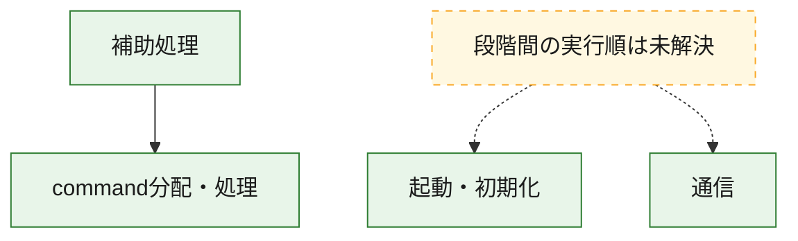
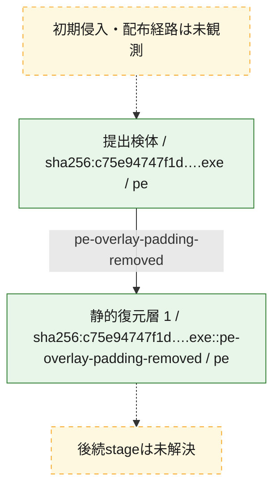
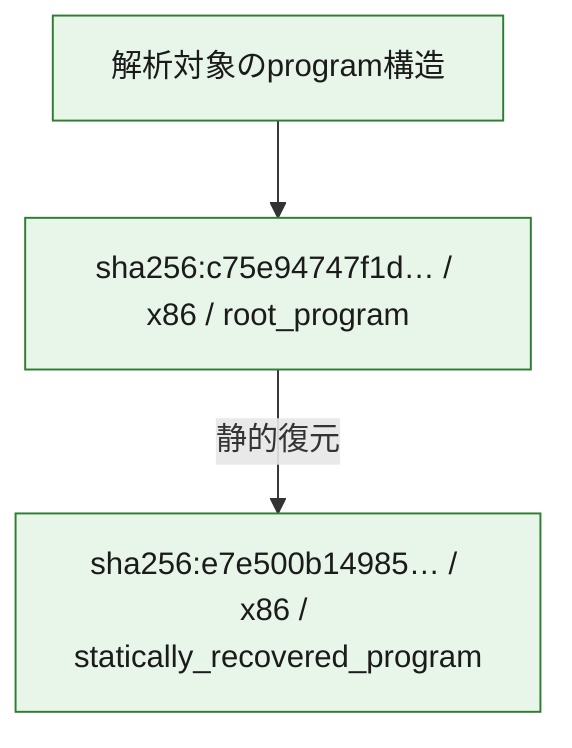

# 全体ロジック：c75e94747f1d4c8b7852d076a399851ccab1d6786e880c5c758359517d903b6b

代表関数の静的証跡から、起動・初期化、通信、command分配・処理の処理群を確認しました。

## 読み方

- phaseの掲載順は解析上の整理順です。observed_call_edgesがない段階間の実行順を断定しません。
- 図の実線は静的に観測した関係、点線と黄色のノードは未観測・未解決の関係を示します。
- 図は静的な要約であり、動的実行を再現するものではありません。
- 詳細な関数解説とfingerprintは[STATIC-LOGIC.md](STATIC-LOGIC.md)を参照してください。

## 静的可視化

### 実行フロー

### 感染チェーン

### モジュール関係

## 処理段階

### 1. 起動・初期化

entry pointから初期化と後続処理への移行を確認します。
確度: `confirmed_static_function_evidence`

- `e7e500b149859c4aa9bc9646f593a5ef21f1e94cefae44d1d90212ed2989dfd6:ghidra:180172efc` — 初期化と主要処理への分岐を行う入口関数です。 状態: `succeeded`、選定理由: `entry_point`, `meaningful_symbol_name`, `reviewed_call_centrality:5`, `role:entrypoint`
- `c75e94747f1d4c8b7852d076a399851ccab1d6786e880c5c758359517d903b6b:ghidra:180172efc` — 初期化と主要処理への分岐を行う入口関数です。 状態: `succeeded`、選定理由: `entry_point`, `meaningful_symbol_name`, `reviewed_call_centrality:5`, `role:entrypoint`

### 2. 通信

通信初期化、endpoint処理、送受信の役割を確認します。
確度: `confirmed_static_function_evidence`

- `e7e500b149859c4aa9bc9646f593a5ef21f1e94cefae44d1d90212ed2989dfd6:ghidra:1800ee930` — 通信初期化、送受信、またはendpoint処理に関係する関数です。 状態: `succeeded`、選定理由: `entry_point`, `meaningful_symbol_name`, `reviewed_call_centrality:2`, `role:network_communication`
- `e7e500b149859c4aa9bc9646f593a5ef21f1e94cefae44d1d90212ed2989dfd6:ghidra:1800eeb50` — 通信初期化、送受信、またはendpoint処理に関係する関数です。 状態: `succeeded`、選定理由: `entry_point`, `meaningful_symbol_name`, `reviewed_call_centrality:2`, `role:network_communication`
- `c75e94747f1d4c8b7852d076a399851ccab1d6786e880c5c758359517d903b6b:ghidra:1800ee930` — 通信初期化、送受信、またはendpoint処理に関係する関数です。 状態: `succeeded`、選定理由: `entry_point`, `meaningful_symbol_name`, `reviewed_call_centrality:2`, `role:network_communication`
- `c75e94747f1d4c8b7852d076a399851ccab1d6786e880c5c758359517d903b6b:ghidra:1800eeb50` — 通信初期化、送受信、またはendpoint処理に関係する関数です。 状態: `succeeded`、選定理由: `entry_point`, `meaningful_symbol_name`, `reviewed_call_centrality:2`, `role:network_communication`

### 3. command分配・処理

受信commandやtaskの解釈、分配、個別handlerへの移行を確認します。
確度: `confirmed_static_function_evidence_with_limits`

- `e7e500b149859c4aa9bc9646f593a5ef21f1e94cefae44d1d90212ed2989dfd6:ghidra:1801c99c0` — commandの解釈、分配、または個別処理を担当する関数です。 状態: `limited_bad_instruction_or_flow`、選定理由: `meaningful_symbol_name`, `reviewed_call_centrality:1`, `role:command_dispatch_or_handler`
- `c75e94747f1d4c8b7852d076a399851ccab1d6786e880c5c758359517d903b6b:ghidra:1801c99c0` — commandの解釈、分配、または個別処理を担当する関数です。 状態: `limited_bad_instruction_or_flow`、選定理由: `meaningful_symbol_name`, `reviewed_call_centrality:1`, `role:command_dispatch_or_handler`

### 4. 補助処理

主要処理を支える一般内部関数またはlibrary処理を確認します。
確度: `confirmed_static_function_evidence`

- `e7e500b149859c4aa9bc9646f593a5ef21f1e94cefae44d1d90212ed2989dfd6:ghidra:1800ee8d0` — 検体内部の一般処理を実装する関数です。 状態: `succeeded`、選定理由: `entry_point`, `meaningful_symbol_name`, `reviewed_call_centrality:2`
- `e7e500b149859c4aa9bc9646f593a5ef21f1e94cefae44d1d90212ed2989dfd6:ghidra:1800ee8f0` — 検体内部の一般処理を実装する関数です。 状態: `succeeded`、選定理由: `entry_point`, `meaningful_symbol_name`, `reviewed_call_centrality:2`
- `e7e500b149859c4aa9bc9646f593a5ef21f1e94cefae44d1d90212ed2989dfd6:ghidra:1800ee910` — 検体内部の一般処理を実装する関数です。 状態: `succeeded`、選定理由: `entry_point`, `meaningful_symbol_name`, `reviewed_call_centrality:2`
- `e7e500b149859c4aa9bc9646f593a5ef21f1e94cefae44d1d90212ed2989dfd6:ghidra:1800ee950` — 検体内部の一般処理を実装する関数です。 状態: `succeeded`、選定理由: `entry_point`, `meaningful_symbol_name`, `reviewed_call_centrality:2`
- `e7e500b149859c4aa9bc9646f593a5ef21f1e94cefae44d1d90212ed2989dfd6:ghidra:1800ee970` — 検体内部の一般処理を実装する関数です。 状態: `succeeded`、選定理由: `entry_point`, `meaningful_symbol_name`, `reviewed_call_centrality:2`
- `e7e500b149859c4aa9bc9646f593a5ef21f1e94cefae44d1d90212ed2989dfd6:ghidra:1800ee990` — 検体内部の一般処理を実装する関数です。 状態: `succeeded`、選定理由: `entry_point`, `meaningful_symbol_name`, `reviewed_call_centrality:2`
- `e7e500b149859c4aa9bc9646f593a5ef21f1e94cefae44d1d90212ed2989dfd6:ghidra:1800ee9b0` — 検体内部の一般処理を実装する関数です。 状態: `succeeded`、選定理由: `entry_point`, `meaningful_symbol_name`, `reviewed_call_centrality:2`
- `e7e500b149859c4aa9bc9646f593a5ef21f1e94cefae44d1d90212ed2989dfd6:ghidra:1800ee9d0` — 検体内部の一般処理を実装する関数です。 状態: `succeeded`、選定理由: `entry_point`, `meaningful_symbol_name`, `reviewed_call_centrality:2`
- `e7e500b149859c4aa9bc9646f593a5ef21f1e94cefae44d1d90212ed2989dfd6:ghidra:1800ee9f0` — 検体内部の一般処理を実装する関数です。 状態: `succeeded`、選定理由: `entry_point`, `meaningful_symbol_name`, `reviewed_call_centrality:2`
- `e7e500b149859c4aa9bc9646f593a5ef21f1e94cefae44d1d90212ed2989dfd6:ghidra:1800eea10` — 検体内部の一般処理を実装する関数です。 状態: `succeeded`、選定理由: `entry_point`, `meaningful_symbol_name`, `reviewed_call_centrality:2`
- `e7e500b149859c4aa9bc9646f593a5ef21f1e94cefae44d1d90212ed2989dfd6:ghidra:1800eea30` — 検体内部の一般処理を実装する関数です。 状態: `succeeded`、選定理由: `entry_point`, `meaningful_symbol_name`, `reviewed_call_centrality:2`
- `e7e500b149859c4aa9bc9646f593a5ef21f1e94cefae44d1d90212ed2989dfd6:ghidra:1800eea50` — 検体内部の一般処理を実装する関数です。 状態: `succeeded`、選定理由: `entry_point`, `meaningful_symbol_name`, `reviewed_call_centrality:2`
- `e7e500b149859c4aa9bc9646f593a5ef21f1e94cefae44d1d90212ed2989dfd6:ghidra:1800eea70` — 検体内部の一般処理を実装する関数です。 状態: `succeeded`、選定理由: `entry_point`, `meaningful_symbol_name`, `reviewed_call_centrality:2`
- `e7e500b149859c4aa9bc9646f593a5ef21f1e94cefae44d1d90212ed2989dfd6:ghidra:1800eea90` — 検体内部の一般処理を実装する関数です。 状態: `succeeded`、選定理由: `entry_point`, `meaningful_symbol_name`, `reviewed_call_centrality:2`
- `e7e500b149859c4aa9bc9646f593a5ef21f1e94cefae44d1d90212ed2989dfd6:ghidra:1800eeab0` — 検体内部の一般処理を実装する関数です。 状態: `succeeded`、選定理由: `entry_point`, `meaningful_symbol_name`, `reviewed_call_centrality:2`
- `e7e500b149859c4aa9bc9646f593a5ef21f1e94cefae44d1d90212ed2989dfd6:ghidra:1800eead0` — 検体内部の一般処理を実装する関数です。 状態: `succeeded`、選定理由: `entry_point`, `meaningful_symbol_name`, `reviewed_call_centrality:2`
- `e7e500b149859c4aa9bc9646f593a5ef21f1e94cefae44d1d90212ed2989dfd6:ghidra:1800eeaf0` — 検体内部の一般処理を実装する関数です。 状態: `succeeded`、選定理由: `entry_point`, `meaningful_symbol_name`, `reviewed_call_centrality:2`
- `e7e500b149859c4aa9bc9646f593a5ef21f1e94cefae44d1d90212ed2989dfd6:ghidra:1800eeb10` — 検体内部の一般処理を実装する関数です。 状態: `succeeded`、選定理由: `entry_point`, `meaningful_symbol_name`, `reviewed_call_centrality:2`
- `e7e500b149859c4aa9bc9646f593a5ef21f1e94cefae44d1d90212ed2989dfd6:ghidra:1800eeb30` — 検体内部の一般処理を実装する関数です。 状態: `succeeded`、選定理由: `entry_point`, `meaningful_symbol_name`, `reviewed_call_centrality:2`
- `e7e500b149859c4aa9bc9646f593a5ef21f1e94cefae44d1d90212ed2989dfd6:ghidra:1800eeb70` — 検体内部の一般処理を実装する関数です。 状態: `succeeded`、選定理由: `entry_point`, `meaningful_symbol_name`, `reviewed_call_centrality:2`
- `e7e500b149859c4aa9bc9646f593a5ef21f1e94cefae44d1d90212ed2989dfd6:ghidra:1800eeb90` — 検体内部の一般処理を実装する関数です。 状態: `succeeded`、選定理由: `entry_point`, `meaningful_symbol_name`, `reviewed_call_centrality:2`
- `e7e500b149859c4aa9bc9646f593a5ef21f1e94cefae44d1d90212ed2989dfd6:ghidra:1800eebb0` — 検体内部の一般処理を実装する関数です。 状態: `succeeded`、選定理由: `entry_point`, `meaningful_symbol_name`, `reviewed_call_centrality:2`
- `e7e500b149859c4aa9bc9646f593a5ef21f1e94cefae44d1d90212ed2989dfd6:ghidra:1800eebd0` — 検体内部の一般処理を実装する関数です。 状態: `succeeded`、選定理由: `entry_point`, `meaningful_symbol_name`, `reviewed_call_centrality:2`
- `e7e500b149859c4aa9bc9646f593a5ef21f1e94cefae44d1d90212ed2989dfd6:ghidra:1800eebf0` — 検体内部の一般処理を実装する関数です。 状態: `succeeded`、選定理由: `entry_point`, `meaningful_symbol_name`, `reviewed_call_centrality:2`
- `e7e500b149859c4aa9bc9646f593a5ef21f1e94cefae44d1d90212ed2989dfd6:ghidra:1800eec10` — 検体内部の一般処理を実装する関数です。 状態: `succeeded`、選定理由: `entry_point`, `meaningful_symbol_name`, `reviewed_call_centrality:2`
- `e7e500b149859c4aa9bc9646f593a5ef21f1e94cefae44d1d90212ed2989dfd6:ghidra:1800eec30` — 検体内部の一般処理を実装する関数です。 状態: `succeeded`、選定理由: `entry_point`, `meaningful_symbol_name`, `reviewed_call_centrality:2`
- `e7e500b149859c4aa9bc9646f593a5ef21f1e94cefae44d1d90212ed2989dfd6:ghidra:1800eec50` — 検体内部の一般処理を実装する関数です。 状態: `succeeded`、選定理由: `entry_point`, `meaningful_symbol_name`, `reviewed_call_centrality:2`
- `e7e500b149859c4aa9bc9646f593a5ef21f1e94cefae44d1d90212ed2989dfd6:ghidra:1801c2e80` — compiler生成処理または汎用library処理とみられる関数です。 状態: `succeeded`、選定理由: `entry_point`, `meaningful_symbol_name`, `reviewed_call_centrality:1`
- `c75e94747f1d4c8b7852d076a399851ccab1d6786e880c5c758359517d903b6b:ghidra:1800ee8d0` — 検体内部の一般処理を実装する関数です。 状態: `succeeded`、選定理由: `entry_point`, `meaningful_symbol_name`, `reviewed_call_centrality:2`
- `c75e94747f1d4c8b7852d076a399851ccab1d6786e880c5c758359517d903b6b:ghidra:1800ee8f0` — 検体内部の一般処理を実装する関数です。 状態: `succeeded`、選定理由: `entry_point`, `meaningful_symbol_name`, `reviewed_call_centrality:2`
- `c75e94747f1d4c8b7852d076a399851ccab1d6786e880c5c758359517d903b6b:ghidra:1800ee910` — 検体内部の一般処理を実装する関数です。 状態: `succeeded`、選定理由: `entry_point`, `meaningful_symbol_name`, `reviewed_call_centrality:2`
- `c75e94747f1d4c8b7852d076a399851ccab1d6786e880c5c758359517d903b6b:ghidra:1800ee950` — 検体内部の一般処理を実装する関数です。 状態: `succeeded`、選定理由: `entry_point`, `meaningful_symbol_name`, `reviewed_call_centrality:2`
- `c75e94747f1d4c8b7852d076a399851ccab1d6786e880c5c758359517d903b6b:ghidra:1800ee970` — 検体内部の一般処理を実装する関数です。 状態: `succeeded`、選定理由: `entry_point`, `meaningful_symbol_name`, `reviewed_call_centrality:2`
- `c75e94747f1d4c8b7852d076a399851ccab1d6786e880c5c758359517d903b6b:ghidra:1800ee990` — 検体内部の一般処理を実装する関数です。 状態: `succeeded`、選定理由: `entry_point`, `meaningful_symbol_name`, `reviewed_call_centrality:2`
- `c75e94747f1d4c8b7852d076a399851ccab1d6786e880c5c758359517d903b6b:ghidra:1800ee9b0` — 検体内部の一般処理を実装する関数です。 状態: `succeeded`、選定理由: `entry_point`, `meaningful_symbol_name`, `reviewed_call_centrality:2`
- `c75e94747f1d4c8b7852d076a399851ccab1d6786e880c5c758359517d903b6b:ghidra:1800ee9d0` — 検体内部の一般処理を実装する関数です。 状態: `succeeded`、選定理由: `entry_point`, `meaningful_symbol_name`, `reviewed_call_centrality:2`
- `c75e94747f1d4c8b7852d076a399851ccab1d6786e880c5c758359517d903b6b:ghidra:1800ee9f0` — 検体内部の一般処理を実装する関数です。 状態: `succeeded`、選定理由: `entry_point`, `meaningful_symbol_name`, `reviewed_call_centrality:2`
- `c75e94747f1d4c8b7852d076a399851ccab1d6786e880c5c758359517d903b6b:ghidra:1800eea10` — 検体内部の一般処理を実装する関数です。 状態: `succeeded`、選定理由: `entry_point`, `meaningful_symbol_name`, `reviewed_call_centrality:2`
- `c75e94747f1d4c8b7852d076a399851ccab1d6786e880c5c758359517d903b6b:ghidra:1800eea30` — 検体内部の一般処理を実装する関数です。 状態: `succeeded`、選定理由: `entry_point`, `meaningful_symbol_name`, `reviewed_call_centrality:2`
- `c75e94747f1d4c8b7852d076a399851ccab1d6786e880c5c758359517d903b6b:ghidra:1800eea50` — 検体内部の一般処理を実装する関数です。 状態: `succeeded`、選定理由: `entry_point`, `meaningful_symbol_name`, `reviewed_call_centrality:2`
- `c75e94747f1d4c8b7852d076a399851ccab1d6786e880c5c758359517d903b6b:ghidra:1800eea70` — 検体内部の一般処理を実装する関数です。 状態: `succeeded`、選定理由: `entry_point`, `meaningful_symbol_name`, `reviewed_call_centrality:2`
- `c75e94747f1d4c8b7852d076a399851ccab1d6786e880c5c758359517d903b6b:ghidra:1800eea90` — 検体内部の一般処理を実装する関数です。 状態: `succeeded`、選定理由: `entry_point`, `meaningful_symbol_name`, `reviewed_call_centrality:2`
- `c75e94747f1d4c8b7852d076a399851ccab1d6786e880c5c758359517d903b6b:ghidra:1800eeab0` — 検体内部の一般処理を実装する関数です。 状態: `succeeded`、選定理由: `entry_point`, `meaningful_symbol_name`, `reviewed_call_centrality:2`
- `c75e94747f1d4c8b7852d076a399851ccab1d6786e880c5c758359517d903b6b:ghidra:1800eead0` — 検体内部の一般処理を実装する関数です。 状態: `succeeded`、選定理由: `entry_point`, `meaningful_symbol_name`, `reviewed_call_centrality:2`
- `c75e94747f1d4c8b7852d076a399851ccab1d6786e880c5c758359517d903b6b:ghidra:1800eeaf0` — 検体内部の一般処理を実装する関数です。 状態: `succeeded`、選定理由: `entry_point`, `meaningful_symbol_name`, `reviewed_call_centrality:2`
- `c75e94747f1d4c8b7852d076a399851ccab1d6786e880c5c758359517d903b6b:ghidra:1800eeb10` — 検体内部の一般処理を実装する関数です。 状態: `succeeded`、選定理由: `entry_point`, `meaningful_symbol_name`, `reviewed_call_centrality:2`
- `c75e94747f1d4c8b7852d076a399851ccab1d6786e880c5c758359517d903b6b:ghidra:1800eeb30` — 検体内部の一般処理を実装する関数です。 状態: `succeeded`、選定理由: `entry_point`, `meaningful_symbol_name`, `reviewed_call_centrality:2`
- `c75e94747f1d4c8b7852d076a399851ccab1d6786e880c5c758359517d903b6b:ghidra:1800eeb70` — 検体内部の一般処理を実装する関数です。 状態: `succeeded`、選定理由: `entry_point`, `meaningful_symbol_name`, `reviewed_call_centrality:2`
- `c75e94747f1d4c8b7852d076a399851ccab1d6786e880c5c758359517d903b6b:ghidra:1800eeb90` — 検体内部の一般処理を実装する関数です。 状態: `succeeded`、選定理由: `entry_point`, `meaningful_symbol_name`, `reviewed_call_centrality:2`
- `c75e94747f1d4c8b7852d076a399851ccab1d6786e880c5c758359517d903b6b:ghidra:1800eebb0` — 検体内部の一般処理を実装する関数です。 状態: `succeeded`、選定理由: `entry_point`, `meaningful_symbol_name`, `reviewed_call_centrality:2`
- `c75e94747f1d4c8b7852d076a399851ccab1d6786e880c5c758359517d903b6b:ghidra:1800eebd0` — 検体内部の一般処理を実装する関数です。 状態: `succeeded`、選定理由: `entry_point`, `meaningful_symbol_name`, `reviewed_call_centrality:2`
- `c75e94747f1d4c8b7852d076a399851ccab1d6786e880c5c758359517d903b6b:ghidra:1800eebf0` — 検体内部の一般処理を実装する関数です。 状態: `succeeded`、選定理由: `entry_point`, `meaningful_symbol_name`, `reviewed_call_centrality:2`
- `c75e94747f1d4c8b7852d076a399851ccab1d6786e880c5c758359517d903b6b:ghidra:1800eec10` — 検体内部の一般処理を実装する関数です。 状態: `succeeded`、選定理由: `entry_point`, `meaningful_symbol_name`, `reviewed_call_centrality:2`
- `c75e94747f1d4c8b7852d076a399851ccab1d6786e880c5c758359517d903b6b:ghidra:1800eec30` — 検体内部の一般処理を実装する関数です。 状態: `succeeded`、選定理由: `entry_point`, `meaningful_symbol_name`, `reviewed_call_centrality:2`
- `c75e94747f1d4c8b7852d076a399851ccab1d6786e880c5c758359517d903b6b:ghidra:1800eec50` — 検体内部の一般処理を実装する関数です。 状態: `succeeded`、選定理由: `entry_point`, `meaningful_symbol_name`, `reviewed_call_centrality:2`
- `c75e94747f1d4c8b7852d076a399851ccab1d6786e880c5c758359517d903b6b:ghidra:1801c2e80` — compiler生成処理または汎用library処理とみられる関数です。 状態: `succeeded`、選定理由: `entry_point`, `meaningful_symbol_name`, `reviewed_call_centrality:1`

## 観測したcall関係

- `c75e94747f1d4c8b7852d076a399851ccab1d6786e880c5c758359517d903b6b:ghidra:1801c2e80` → `c75e94747f1d4c8b7852d076a399851ccab1d6786e880c5c758359517d903b6b:ghidra:1801c99c0` （`support` → `dispatch`）
- `e7e500b149859c4aa9bc9646f593a5ef21f1e94cefae44d1d90212ed2989dfd6:ghidra:1801c2e80` → `e7e500b149859c4aa9bc9646f593a5ef21f1e94cefae44d1d90212ed2989dfd6:ghidra:1801c99c0` （`support` → `dispatch`）
- `ghidra-function:0297ce6406a78bbe17f5e826` → `ghidra-external:7d2eb4a46a0fa8432d12df44` （`unclassified` → `unclassified`）
- `ghidra-function:0297ce6406a78bbe17f5e826` → `ghidra-external:de6fa37980c936b519c74c8d` （`unclassified` → `unclassified`）
- `ghidra-function:0fc0a8b02c18c018859f0047` → `ghidra-external:23353e1ef668266b900fc75b` （`unclassified` → `unclassified`）
- `ghidra-function:0fc0a8b02c18c018859f0047` → `ghidra-external:d34803dc49b6f59196bca29c` （`unclassified` → `unclassified`）
- `ghidra-function:1183cafaaea165b3618351cb` → `ghidra-external:7d2eb4a46a0fa8432d12df44` （`unclassified` → `unclassified`）
- `ghidra-function:1183cafaaea165b3618351cb` → `ghidra-external:de6fa37980c936b519c74c8d` （`unclassified` → `unclassified`）
- `ghidra-function:13ebe36caed013446b782438` → `ghidra-external:7d2eb4a46a0fa8432d12df44` （`unclassified` → `unclassified`）
- `ghidra-function:13ebe36caed013446b782438` → `ghidra-external:de6fa37980c936b519c74c8d` （`unclassified` → `unclassified`）
- `ghidra-function:15527f8d49854811f3354e3c` → `ghidra-external:7d2eb4a46a0fa8432d12df44` （`unclassified` → `unclassified`）
- `ghidra-function:15527f8d49854811f3354e3c` → `ghidra-external:de6fa37980c936b519c74c8d` （`unclassified` → `unclassified`）
- `ghidra-function:17eb20bcb38e68af9d51c25a` → `ghidra-external:7d2eb4a46a0fa8432d12df44` （`unclassified` → `unclassified`）
- `ghidra-function:17eb20bcb38e68af9d51c25a` → `ghidra-external:de6fa37980c936b519c74c8d` （`unclassified` → `unclassified`）
- `ghidra-function:193cfd1a6ca58be345270dde` → `ghidra-external:23353e1ef668266b900fc75b` （`unclassified` → `unclassified`）
- `ghidra-function:193cfd1a6ca58be345270dde` → `ghidra-external:d34803dc49b6f59196bca29c` （`unclassified` → `unclassified`）
- `ghidra-function:1d1d62042d0d25249a32cc54` → `ghidra-external:23353e1ef668266b900fc75b` （`unclassified` → `unclassified`）
- `ghidra-function:1d1d62042d0d25249a32cc54` → `ghidra-external:d34803dc49b6f59196bca29c` （`unclassified` → `unclassified`）
- `ghidra-function:268813772e727c3d854520b0` → `ghidra-external:23353e1ef668266b900fc75b` （`unclassified` → `unclassified`）
- `ghidra-function:268813772e727c3d854520b0` → `ghidra-external:d34803dc49b6f59196bca29c` （`unclassified` → `unclassified`）
- `ghidra-function:273344c68aad546119b79b63` → `ghidra-external:23353e1ef668266b900fc75b` （`unclassified` → `unclassified`）
- `ghidra-function:273344c68aad546119b79b63` → `ghidra-external:d34803dc49b6f59196bca29c` （`unclassified` → `unclassified`）
- `ghidra-function:279073ee873e7e30b88e945d` → `ghidra-external:23353e1ef668266b900fc75b` （`unclassified` → `unclassified`）
- `ghidra-function:279073ee873e7e30b88e945d` → `ghidra-external:d34803dc49b6f59196bca29c` （`unclassified` → `unclassified`）
- `ghidra-function:2ae699f75de114c63e8322fb` → `ghidra-external:7d2eb4a46a0fa8432d12df44` （`unclassified` → `unclassified`）
- `ghidra-function:2ae699f75de114c63e8322fb` → `ghidra-external:de6fa37980c936b519c74c8d` （`unclassified` → `unclassified`）
- `ghidra-function:371b9760ad5752ba71a48c35` → `ghidra-external:23353e1ef668266b900fc75b` （`unclassified` → `unclassified`）
- `ghidra-function:371b9760ad5752ba71a48c35` → `ghidra-external:d34803dc49b6f59196bca29c` （`unclassified` → `unclassified`）
- `ghidra-function:39ecf88d6484953d32fbd24b` → `ghidra-external:23353e1ef668266b900fc75b` （`unclassified` → `unclassified`）
- `ghidra-function:39ecf88d6484953d32fbd24b` → `ghidra-external:d34803dc49b6f59196bca29c` （`unclassified` → `unclassified`）
- `ghidra-function:3e1482c6093f0a4996401ea4` → `ghidra-external:23353e1ef668266b900fc75b` （`unclassified` → `unclassified`）
- `ghidra-function:3e1482c6093f0a4996401ea4` → `ghidra-external:d34803dc49b6f59196bca29c` （`unclassified` → `unclassified`）
- `ghidra-function:451f151a5e224906245c3e20` → `ghidra-external:7d2eb4a46a0fa8432d12df44` （`unclassified` → `unclassified`）
- `ghidra-function:451f151a5e224906245c3e20` → `ghidra-external:de6fa37980c936b519c74c8d` （`unclassified` → `unclassified`）
- `ghidra-function:45f17df81575ea8c668274a7` → `ghidra-external:23353e1ef668266b900fc75b` （`unclassified` → `unclassified`）
- `ghidra-function:45f17df81575ea8c668274a7` → `ghidra-external:d34803dc49b6f59196bca29c` （`unclassified` → `unclassified`）
- `ghidra-function:4872ee6e5aa1599441c79401` → `ghidra-external:7d2eb4a46a0fa8432d12df44` （`unclassified` → `unclassified`）
- `ghidra-function:4872ee6e5aa1599441c79401` → `ghidra-external:de6fa37980c936b519c74c8d` （`unclassified` → `unclassified`）
- `ghidra-function:49e1f48162b02b54d845fd47` → `ghidra-external:7d2eb4a46a0fa8432d12df44` （`unclassified` → `unclassified`）
- `ghidra-function:49e1f48162b02b54d845fd47` → `ghidra-external:de6fa37980c936b519c74c8d` （`unclassified` → `unclassified`）
- `ghidra-function:4f675aec6d98e5d8941841eb` → `ghidra-external:7d2eb4a46a0fa8432d12df44` （`unclassified` → `unclassified`）
- `ghidra-function:4f675aec6d98e5d8941841eb` → `ghidra-external:de6fa37980c936b519c74c8d` （`unclassified` → `unclassified`）
- `ghidra-function:51488497dcee039994b02c75` → `ghidra-external:23353e1ef668266b900fc75b` （`unclassified` → `unclassified`）
- `ghidra-function:51488497dcee039994b02c75` → `ghidra-external:d34803dc49b6f59196bca29c` （`unclassified` → `unclassified`）
- `ghidra-function:58112194d923d9c4ba44da5e` → `ghidra-external:23353e1ef668266b900fc75b` （`unclassified` → `unclassified`）
- `ghidra-function:58112194d923d9c4ba44da5e` → `ghidra-external:d34803dc49b6f59196bca29c` （`unclassified` → `unclassified`）
- `ghidra-function:65f1432d8f507323a6e86f75` → `ghidra-external:23353e1ef668266b900fc75b` （`unclassified` → `unclassified`）
- `ghidra-function:65f1432d8f507323a6e86f75` → `ghidra-external:d34803dc49b6f59196bca29c` （`unclassified` → `unclassified`）
- `ghidra-function:6c15c6468a790c10c8300bdd` → `ghidra-external:7d2eb4a46a0fa8432d12df44` （`unclassified` → `unclassified`）
- `ghidra-function:6c15c6468a790c10c8300bdd` → `ghidra-external:de6fa37980c936b519c74c8d` （`unclassified` → `unclassified`）
- `ghidra-function:6d72c0edb6248f1c32dcbebf` → `ghidra-external:23353e1ef668266b900fc75b` （`unclassified` → `unclassified`）
- `ghidra-function:6d72c0edb6248f1c32dcbebf` → `ghidra-external:d34803dc49b6f59196bca29c` （`unclassified` → `unclassified`）
- `ghidra-function:75f22242b76086a87956ffe4` → `ghidra-external:7d2eb4a46a0fa8432d12df44` （`unclassified` → `unclassified`）
- `ghidra-function:75f22242b76086a87956ffe4` → `ghidra-external:de6fa37980c936b519c74c8d` （`unclassified` → `unclassified`）
- `ghidra-function:78b16b79591d4d06222c2950` → `ghidra-external:7d2eb4a46a0fa8432d12df44` （`unclassified` → `unclassified`）
- `ghidra-function:78b16b79591d4d06222c2950` → `ghidra-external:de6fa37980c936b519c74c8d` （`unclassified` → `unclassified`）
- `ghidra-function:792ff9a184e0428b971a1e3f` → `ghidra-external:23353e1ef668266b900fc75b` （`unclassified` → `unclassified`）
- `ghidra-function:792ff9a184e0428b971a1e3f` → `ghidra-external:d34803dc49b6f59196bca29c` （`unclassified` → `unclassified`）
- `ghidra-function:7b97ce5ccf6c75b7d40583cc` → `ghidra-external:23353e1ef668266b900fc75b` （`unclassified` → `unclassified`）
- `ghidra-function:7b97ce5ccf6c75b7d40583cc` → `ghidra-external:d34803dc49b6f59196bca29c` （`unclassified` → `unclassified`）
- `ghidra-function:8a166bdebb9248ff109043c9` → `ghidra-external:48b14c5088434fd3034064a0` （`unclassified` → `unclassified`）
- `ghidra-function:8a166bdebb9248ff109043c9` → `ghidra-external:6ac109c220a68d08947fed5f` （`unclassified` → `unclassified`）
- `ghidra-function:8a166bdebb9248ff109043c9` → `ghidra-function:9b4b3e0b0da3ec64fdd66c14` （`unclassified` → `unclassified`）
- `ghidra-function:8a166bdebb9248ff109043c9` → `ghidra-function:ab9aa35e37d49f1ac596fe48` （`unclassified` → `unclassified`）
- `ghidra-function:8a166bdebb9248ff109043c9` → `ghidra-function:b44a493b57c85ec1d184812c` （`unclassified` → `unclassified`）
- `ghidra-function:940598689b46bf5ebe6d2d16` → `ghidra-external:7d2eb4a46a0fa8432d12df44` （`unclassified` → `unclassified`）
- `ghidra-function:940598689b46bf5ebe6d2d16` → `ghidra-external:de6fa37980c936b519c74c8d` （`unclassified` → `unclassified`）
- `ghidra-function:97a4c79b20ec74f411f23958` → `ghidra-external:7d2eb4a46a0fa8432d12df44` （`unclassified` → `unclassified`）
- `ghidra-function:97a4c79b20ec74f411f23958` → `ghidra-external:de6fa37980c936b519c74c8d` （`unclassified` → `unclassified`）
- `ghidra-function:9977e5bb36efc30e8bd2ae13` → `ghidra-external:23353e1ef668266b900fc75b` （`unclassified` → `unclassified`）
- `ghidra-function:9977e5bb36efc30e8bd2ae13` → `ghidra-external:d34803dc49b6f59196bca29c` （`unclassified` → `unclassified`）
- `ghidra-function:9b1be67ad2c2c40002a56494` → `ghidra-external:23353e1ef668266b900fc75b` （`unclassified` → `unclassified`）
- `ghidra-function:9b1be67ad2c2c40002a56494` → `ghidra-external:d34803dc49b6f59196bca29c` （`unclassified` → `unclassified`）
- `ghidra-function:9c0e58fc076b18d602ec0631` → `ghidra-external:7d2eb4a46a0fa8432d12df44` （`unclassified` → `unclassified`）
- `ghidra-function:9c0e58fc076b18d602ec0631` → `ghidra-external:de6fa37980c936b519c74c8d` （`unclassified` → `unclassified`）
- `ghidra-function:a4c9cd844864a8d292699364` → `ghidra-external:23353e1ef668266b900fc75b` （`unclassified` → `unclassified`）
- `ghidra-function:a4c9cd844864a8d292699364` → `ghidra-external:d34803dc49b6f59196bca29c` （`unclassified` → `unclassified`）
- `ghidra-function:a82ac0eec626910161acc105` → `ghidra-external:7d2eb4a46a0fa8432d12df44` （`unclassified` → `unclassified`）
- `ghidra-function:a82ac0eec626910161acc105` → `ghidra-external:de6fa37980c936b519c74c8d` （`unclassified` → `unclassified`）
- `ghidra-function:b2665faa7ad67ccbd0dd9071` → `ghidra-external:23353e1ef668266b900fc75b` （`unclassified` → `unclassified`）
- `ghidra-function:b2665faa7ad67ccbd0dd9071` → `ghidra-external:d34803dc49b6f59196bca29c` （`unclassified` → `unclassified`）
- `ghidra-function:b5217edab2ee7e6d00630ee2` → `ghidra-external:7d2eb4a46a0fa8432d12df44` （`unclassified` → `unclassified`）
- `ghidra-function:b5217edab2ee7e6d00630ee2` → `ghidra-external:de6fa37980c936b519c74c8d` （`unclassified` → `unclassified`）
- `ghidra-function:b55ec40e351aaf281dd8e11d` → `ghidra-external:7d2eb4a46a0fa8432d12df44` （`unclassified` → `unclassified`）
- `ghidra-function:b55ec40e351aaf281dd8e11d` → `ghidra-external:de6fa37980c936b519c74c8d` （`unclassified` → `unclassified`）
- `ghidra-function:bfc8d9db6b632b92c56439dc` → `ghidra-external:23353e1ef668266b900fc75b` （`unclassified` → `unclassified`）
- `ghidra-function:bfc8d9db6b632b92c56439dc` → `ghidra-external:d34803dc49b6f59196bca29c` （`unclassified` → `unclassified`）
- `ghidra-function:c0c67f5972bcd05113721dc0` → `ghidra-external:7d2eb4a46a0fa8432d12df44` （`unclassified` → `unclassified`）
- `ghidra-function:c0c67f5972bcd05113721dc0` → `ghidra-external:de6fa37980c936b519c74c8d` （`unclassified` → `unclassified`）
- `ghidra-function:c16df566edd1379e8f982a80` → `ghidra-function:49f7f00c7557b50d68bc74d4` （`unclassified` → `unclassified`）
- `ghidra-function:c6fac13175d04ad0a7c8a6a1` → `ghidra-external:7d2eb4a46a0fa8432d12df44` （`unclassified` → `unclassified`）
- `ghidra-function:c6fac13175d04ad0a7c8a6a1` → `ghidra-external:de6fa37980c936b519c74c8d` （`unclassified` → `unclassified`）
- `ghidra-function:cbb33c7109660eb47f0ea44d` → `ghidra-external:23353e1ef668266b900fc75b` （`unclassified` → `unclassified`）
- `ghidra-function:cbb33c7109660eb47f0ea44d` → `ghidra-external:d34803dc49b6f59196bca29c` （`unclassified` → `unclassified`）
- `ghidra-function:d0bb27ac3ff63c02ef67749f` → `ghidra-external:7d2eb4a46a0fa8432d12df44` （`unclassified` → `unclassified`）
- `ghidra-function:d0bb27ac3ff63c02ef67749f` → `ghidra-external:de6fa37980c936b519c74c8d` （`unclassified` → `unclassified`）
- `ghidra-function:d1b850f82ddc54b410c7c170` → `ghidra-external:23353e1ef668266b900fc75b` （`unclassified` → `unclassified`）
- `ghidra-function:d1b850f82ddc54b410c7c170` → `ghidra-external:d34803dc49b6f59196bca29c` （`unclassified` → `unclassified`）
- `ghidra-function:d98f78323464979e1b5cc01c` → `ghidra-external:7d2eb4a46a0fa8432d12df44` （`unclassified` → `unclassified`）
- `ghidra-function:d98f78323464979e1b5cc01c` → `ghidra-external:de6fa37980c936b519c74c8d` （`unclassified` → `unclassified`）
- `ghidra-function:dac3b3e6d85724862e5c685b` → `ghidra-external:7d2eb4a46a0fa8432d12df44` （`unclassified` → `unclassified`）
- `ghidra-function:dac3b3e6d85724862e5c685b` → `ghidra-external:de6fa37980c936b519c74c8d` （`unclassified` → `unclassified`）
- `ghidra-function:db0b72f913ce906b3b464795` → `ghidra-external:23353e1ef668266b900fc75b` （`unclassified` → `unclassified`）
- `ghidra-function:db0b72f913ce906b3b464795` → `ghidra-external:d34803dc49b6f59196bca29c` （`unclassified` → `unclassified`）
- `ghidra-function:dca22941b7a71bf2ab1fb87f` → `ghidra-external:7d2eb4a46a0fa8432d12df44` （`unclassified` → `unclassified`）
- `ghidra-function:dca22941b7a71bf2ab1fb87f` → `ghidra-external:de6fa37980c936b519c74c8d` （`unclassified` → `unclassified`）
- `ghidra-function:de23f77883f55579fe047f22` → `ghidra-external:23353e1ef668266b900fc75b` （`unclassified` → `unclassified`）
- `ghidra-function:de23f77883f55579fe047f22` → `ghidra-external:d34803dc49b6f59196bca29c` （`unclassified` → `unclassified`）
- `ghidra-function:deef59d95da1642138749fec` → `ghidra-function:b27770dac3f28499754b66dc` （`unclassified` → `unclassified`）
- `ghidra-function:e280ac6d6a4201fd52abba1a` → `ghidra-external:23353e1ef668266b900fc75b` （`unclassified` → `unclassified`）
- `ghidra-function:e280ac6d6a4201fd52abba1a` → `ghidra-external:d34803dc49b6f59196bca29c` （`unclassified` → `unclassified`）
- `ghidra-function:e59eb39f3178916effa0f9db` → `ghidra-external:7d2eb4a46a0fa8432d12df44` （`unclassified` → `unclassified`）
- `ghidra-function:e59eb39f3178916effa0f9db` → `ghidra-external:de6fa37980c936b519c74c8d` （`unclassified` → `unclassified`）
- `ghidra-function:ea5b4781dae7ab0911973bc2` → `ghidra-external:7d2eb4a46a0fa8432d12df44` （`unclassified` → `unclassified`）
- `ghidra-function:ea5b4781dae7ab0911973bc2` → `ghidra-external:de6fa37980c936b519c74c8d` （`unclassified` → `unclassified`）
- `ghidra-function:eae0651eee2bd29d962d2cf1` → `ghidra-external:7d2eb4a46a0fa8432d12df44` （`unclassified` → `unclassified`）
- `ghidra-function:eae0651eee2bd29d962d2cf1` → `ghidra-external:de6fa37980c936b519c74c8d` （`unclassified` → `unclassified`）
- `ghidra-function:ef48f5779dca65a24a15fc21` → `ghidra-external:23353e1ef668266b900fc75b` （`unclassified` → `unclassified`）
- `ghidra-function:ef48f5779dca65a24a15fc21` → `ghidra-external:d34803dc49b6f59196bca29c` （`unclassified` → `unclassified`）
- `ghidra-function:f5e4fa370861d4f8f70e17e4` → `ghidra-external:23353e1ef668266b900fc75b` （`unclassified` → `unclassified`）
- `ghidra-function:f5e4fa370861d4f8f70e17e4` → `ghidra-external:d34803dc49b6f59196bca29c` （`unclassified` → `unclassified`）
- `ghidra-function:f6905471a6055139d38ea09d` → `ghidra-external:23353e1ef668266b900fc75b` （`unclassified` → `unclassified`）
- `ghidra-function:f6905471a6055139d38ea09d` → `ghidra-external:d34803dc49b6f59196bca29c` （`unclassified` → `unclassified`）
- `ghidra-function:f889b7ffda326a0e4c93a37a` → `ghidra-external:7d2eb4a46a0fa8432d12df44` （`unclassified` → `unclassified`）
- `ghidra-function:f889b7ffda326a0e4c93a37a` → `ghidra-external:de6fa37980c936b519c74c8d` （`unclassified` → `unclassified`）
- `ghidra-function:ff1d2d5c3a0397852d94c90f` → `ghidra-external:06b42875e287fd3ab0e005a2` （`unclassified` → `unclassified`）
- `ghidra-function:ff1d2d5c3a0397852d94c90f` → `ghidra-external:9246ace5bf6270106a630af4` （`unclassified` → `unclassified`）
- `ghidra-function:ff1d2d5c3a0397852d94c90f` → `ghidra-function:3423267ab4cf1b89e14d2e08` （`unclassified` → `unclassified`）
- `ghidra-function:ff1d2d5c3a0397852d94c90f` → `ghidra-function:a4bf3204ea879e5de1680c56` （`unclassified` → `unclassified`）
- `ghidra-function:ff1d2d5c3a0397852d94c90f` → `ghidra-function:a7a535250c275eb486fbe116` （`unclassified` → `unclassified`）

## 解析範囲と制約

- 選定外関数は全体inventoryへ残しますが、関数本体の個別解説対象にはしていません。
- indirect call、難読化、packer、VM、壊れたcontrol flowによりcall関係が欠落する場合があります。
- 文書は静的解析に基づき、検体実行や外部通信による動的確認は行っていません。
