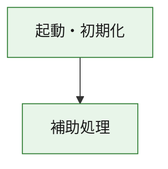
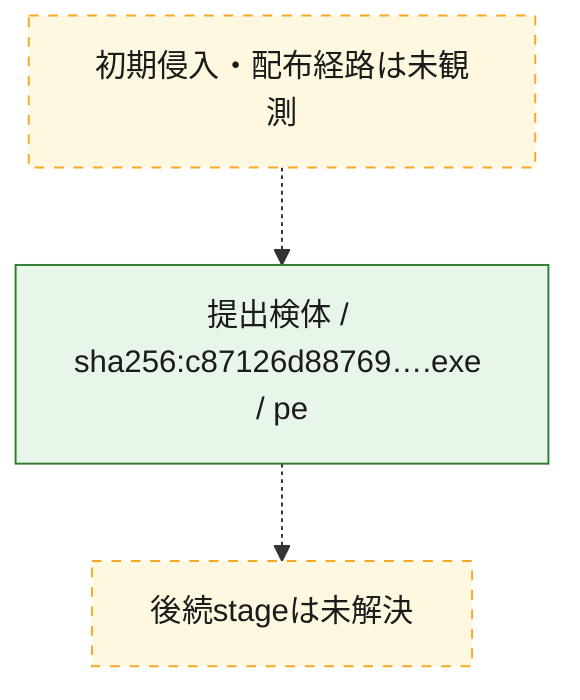
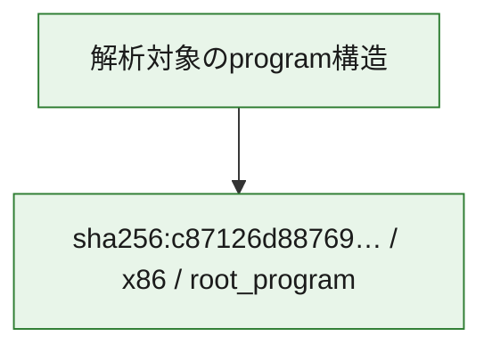

# 全体ロジック：c87126d88769d2198f18d1a376c2eb88b88a9555feb58fb0908ad19927290d7b

代表関数の静的証跡から、起動・初期化の処理群を確認しました。

## 読み方

- phaseの掲載順は解析上の整理順です。observed_call_edgesがない段階間の実行順を断定しません。
- 図の実線は静的に観測した関係、点線と黄色のノードは未観測・未解決の関係を示します。
- 図は静的な要約であり、動的実行を再現するものではありません。
- 詳細な関数解説とfingerprintは[STATIC-LOGIC.md](STATIC-LOGIC.md)を参照してください。

## 静的可視化

### 実行フロー

### 感染チェーン

### モジュール関係

## 処理段階

### 1. 起動・初期化

entry pointから初期化と後続処理への移行を確認します。
確度: `confirmed_static_function_evidence`

- `c87126d88769d2198f18d1a376c2eb88b88a9555feb58fb0908ad19927290d7b:ghidra:180001010` — 初期化と主要処理への分岐を行う入口関数です。 状態: `succeeded`、選定理由: `entry_point`, `meaningful_symbol_name`, `reviewed_call_centrality:22`, `role:entrypoint`, `small_program_complete_context`

### 2. 補助処理

主要処理を支える一般内部関数またはlibrary処理を確認します。
確度: `confirmed_static_function_evidence`

- `c87126d88769d2198f18d1a376c2eb88b88a9555feb58fb0908ad19927290d7b:ghidra:180001240` — 検体内部の一般処理を実装する関数です。 状態: `succeeded`、選定理由: `context_representative`, `reviewed_call_centrality:2`, `small_program_complete_context`
- `c87126d88769d2198f18d1a376c2eb88b88a9555feb58fb0908ad19927290d7b:ghidra:180001350` — 検体内部の一般処理を実装する関数です。 状態: `succeeded`、選定理由: `context_representative`, `reviewed_call_centrality:25`, `small_program_complete_context`
- `c87126d88769d2198f18d1a376c2eb88b88a9555feb58fb0908ad19927290d7b:ghidra:180003780` — 検体内部の一般処理を実装する関数です。 状態: `succeeded`、選定理由: `context_representative`, `reviewed_call_centrality:2`, `small_program_complete_context`
- `c87126d88769d2198f18d1a376c2eb88b88a9555feb58fb0908ad19927290d7b:ghidra:1800038e0` — 検体内部の一般処理を実装する関数です。 状態: `succeeded`、選定理由: `context_representative`, `reviewed_call_centrality:2`, `small_program_complete_context`

## 観測したcall関係

- `c87126d88769d2198f18d1a376c2eb88b88a9555feb58fb0908ad19927290d7b:ghidra:180001010` → `c87126d88769d2198f18d1a376c2eb88b88a9555feb58fb0908ad19927290d7b:ghidra:180001240` （`startup` → `support`）
- `c87126d88769d2198f18d1a376c2eb88b88a9555feb58fb0908ad19927290d7b:ghidra:180001010` → `c87126d88769d2198f18d1a376c2eb88b88a9555feb58fb0908ad19927290d7b:ghidra:180001350` （`startup` → `support`）
- `c87126d88769d2198f18d1a376c2eb88b88a9555feb58fb0908ad19927290d7b:ghidra:180001350` → `c87126d88769d2198f18d1a376c2eb88b88a9555feb58fb0908ad19927290d7b:ghidra:180001240` （`support` → `support`）
- `c87126d88769d2198f18d1a376c2eb88b88a9555feb58fb0908ad19927290d7b:ghidra:180001350` → `c87126d88769d2198f18d1a376c2eb88b88a9555feb58fb0908ad19927290d7b:ghidra:180003780` （`support` → `support`）
- `c87126d88769d2198f18d1a376c2eb88b88a9555feb58fb0908ad19927290d7b:ghidra:180001350` → `c87126d88769d2198f18d1a376c2eb88b88a9555feb58fb0908ad19927290d7b:ghidra:1800038e0` （`support` → `support`）
- `c87126d88769d2198f18d1a376c2eb88b88a9555feb58fb0908ad19927290d7b:ghidra:180003780` → `c87126d88769d2198f18d1a376c2eb88b88a9555feb58fb0908ad19927290d7b:ghidra:1800038e0` （`support` → `support`）
- `ghidra-function:8c5879a50b80a07d19192f28` → `ghidra-function:16efee121d631ff72d55539d` （`unclassified` → `unclassified`）
- `ghidra-function:d25a65c65277107c0ab3a343` → `ghidra-external:00fdeafb2cfa9ed056003b31` （`unclassified` → `unclassified`）
- `ghidra-function:d25a65c65277107c0ab3a343` → `ghidra-external:1f5144d160cfb2fd1f353d58` （`unclassified` → `unclassified`）
- `ghidra-function:d25a65c65277107c0ab3a343` → `ghidra-external:27f515a1360687c0ed216de2` （`unclassified` → `unclassified`）
- `ghidra-function:d25a65c65277107c0ab3a343` → `ghidra-external:302d70752bcfb0aea96ce206` （`unclassified` → `unclassified`）
- `ghidra-function:d25a65c65277107c0ab3a343` → `ghidra-external:328df9944b96667fa2412df1` （`unclassified` → `unclassified`）
- `ghidra-function:d25a65c65277107c0ab3a343` → `ghidra-external:35c2a2122417c1e5c7bf917b` （`unclassified` → `unclassified`）
- `ghidra-function:d25a65c65277107c0ab3a343` → `ghidra-external:3628710d90a46bc46aa0c403` （`unclassified` → `unclassified`）
- `ghidra-function:d25a65c65277107c0ab3a343` → `ghidra-external:41633d86d272a418697d823a` （`unclassified` → `unclassified`）
- `ghidra-function:d25a65c65277107c0ab3a343` → `ghidra-external:44489414b02781142aef0fe4` （`unclassified` → `unclassified`）
- `ghidra-function:d25a65c65277107c0ab3a343` → `ghidra-external:65a29f307de1684052f00341` （`unclassified` → `unclassified`）
- `ghidra-function:d25a65c65277107c0ab3a343` → `ghidra-external:6d96e07c58e187db9e7e6c1e` （`unclassified` → `unclassified`）
- `ghidra-function:d25a65c65277107c0ab3a343` → `ghidra-external:7b7916228b9c45efccacdad9` （`unclassified` → `unclassified`）
- `ghidra-function:d25a65c65277107c0ab3a343` → `ghidra-external:81d93af85ca83db7df17fa26` （`unclassified` → `unclassified`）
- `ghidra-function:d25a65c65277107c0ab3a343` → `ghidra-external:84266057180e96e9a185a05b` （`unclassified` → `unclassified`）
- `ghidra-function:d25a65c65277107c0ab3a343` → `ghidra-external:abc3b5905788a29af28ae3e3` （`unclassified` → `unclassified`）
- `ghidra-function:d25a65c65277107c0ab3a343` → `ghidra-external:ba53efa7deaba0b4e3281979` （`unclassified` → `unclassified`）
- `ghidra-function:d25a65c65277107c0ab3a343` → `ghidra-external:c167de38a4cd6a3a89ca478b` （`unclassified` → `unclassified`）
- `ghidra-function:d25a65c65277107c0ab3a343` → `ghidra-external:d168a74748c6492c29607412` （`unclassified` → `unclassified`）
- `ghidra-function:d25a65c65277107c0ab3a343` → `ghidra-external:d434144a1ed2c3502ddaba98` （`unclassified` → `unclassified`）
- `ghidra-function:d25a65c65277107c0ab3a343` → `ghidra-external:d6553d569baa24468687a7ab` （`unclassified` → `unclassified`）
- `ghidra-function:d25a65c65277107c0ab3a343` → `ghidra-external:e6b67aa5382d40d057e128f8` （`unclassified` → `unclassified`）
- `ghidra-function:d25a65c65277107c0ab3a343` → `ghidra-function:16efee121d631ff72d55539d` （`unclassified` → `unclassified`）
- `ghidra-function:d25a65c65277107c0ab3a343` → `ghidra-function:8c5879a50b80a07d19192f28` （`unclassified` → `unclassified`）
- `ghidra-function:d25a65c65277107c0ab3a343` → `ghidra-function:dbd1c8c703cbbc86fa16e98f` （`unclassified` → `unclassified`）
- `ghidra-function:f23575b83ba6b2cb14e9d12a` → `ghidra-function:10e154e7e2205b54968d66d8` （`unclassified` → `unclassified`）
- `ghidra-function:f23575b83ba6b2cb14e9d12a` → `ghidra-function:233aca1d95063b8600d9014d` （`unclassified` → `unclassified`）
- `ghidra-function:f23575b83ba6b2cb14e9d12a` → `ghidra-function:287280e2b1186000a23a4a1f` （`unclassified` → `unclassified`）
- `ghidra-function:f23575b83ba6b2cb14e9d12a` → `ghidra-function:359629fade918c9033030c50` （`unclassified` → `unclassified`）
- `ghidra-function:f23575b83ba6b2cb14e9d12a` → `ghidra-function:4e0b641f3d112668e0e5a91f` （`unclassified` → `unclassified`）
- `ghidra-function:f23575b83ba6b2cb14e9d12a` → `ghidra-function:5cf7b80ccbc426f53c511d1b` （`unclassified` → `unclassified`）
- `ghidra-function:f23575b83ba6b2cb14e9d12a` → `ghidra-function:a15a63069935b69735bb8fe0` （`unclassified` → `unclassified`）
- `ghidra-function:f23575b83ba6b2cb14e9d12a` → `ghidra-function:be28fb23fcd9202048092fc6` （`unclassified` → `unclassified`）
- `ghidra-function:f23575b83ba6b2cb14e9d12a` → `ghidra-function:c688e5f969f0bdad10b6d114` （`unclassified` → `unclassified`）
- `ghidra-function:f23575b83ba6b2cb14e9d12a` → `ghidra-function:d25a65c65277107c0ab3a343` （`unclassified` → `unclassified`）
- `ghidra-function:f23575b83ba6b2cb14e9d12a` → `ghidra-function:dbd1c8c703cbbc86fa16e98f` （`unclassified` → `unclassified`）
- `ghidra-function:f23575b83ba6b2cb14e9d12a` → `ghidra-function:f090e40654b393eea773b614` （`unclassified` → `unclassified`）

## 解析範囲と制約

- 選定外関数は全体inventoryへ残しますが、関数本体の個別解説対象にはしていません。
- indirect call、難読化、packer、VM、壊れたcontrol flowによりcall関係が欠落する場合があります。
- 文書は静的解析に基づき、検体実行や外部通信による動的確認は行っていません。
