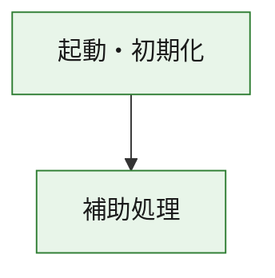
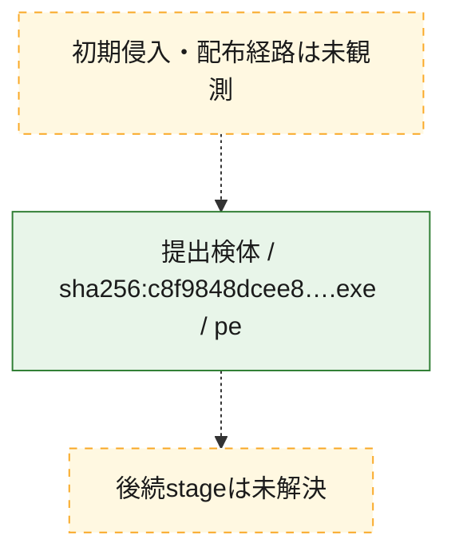
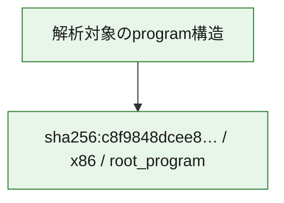

# 全体ロジック：c8f9848dcee8f22296cff964f82dd003f5bb5fe5cef3e35ccd7845191bb20a59

代表関数の静的証跡から、起動・初期化の処理群を確認しました。

## 読み方

- phaseの掲載順は解析上の整理順です。observed_call_edgesがない段階間の実行順を断定しません。
- 図の実線は静的に観測した関係、点線と黄色のノードは未観測・未解決の関係を示します。
- 図は静的な要約であり、動的実行を再現するものではありません。
- 詳細な関数解説とfingerprintは[STATIC-LOGIC.md](STATIC-LOGIC.md)を参照してください。

## 静的可視化

### 実行フロー

### 感染チェーン

### モジュール関係

## 処理段階

### 1. 起動・初期化

entry pointから初期化と後続処理への移行を確認します。
確度: `confirmed_static_function_evidence`

- `c8f9848dcee8f22296cff964f82dd003f5bb5fe5cef3e35ccd7845191bb20a59:ghidra:180001010` — 初期化と主要処理への分岐を行う入口関数です。 状態: `succeeded`、選定理由: `entry_point`, `meaningful_symbol_name`, `reviewed_call_centrality:22`, `role:entrypoint`, `small_program_complete_context`

### 2. 補助処理

主要処理を支える一般内部関数またはlibrary処理を確認します。
確度: `confirmed_static_function_evidence`

- `c8f9848dcee8f22296cff964f82dd003f5bb5fe5cef3e35ccd7845191bb20a59:ghidra:180001240` — 検体内部の一般処理を実装する関数です。 状態: `succeeded`、選定理由: `context_representative`, `reviewed_call_centrality:2`, `small_program_complete_context`
- `c8f9848dcee8f22296cff964f82dd003f5bb5fe5cef3e35ccd7845191bb20a59:ghidra:180001350` — 検体内部の一般処理を実装する関数です。 状態: `succeeded`、選定理由: `context_representative`, `reviewed_call_centrality:25`, `small_program_complete_context`
- `c8f9848dcee8f22296cff964f82dd003f5bb5fe5cef3e35ccd7845191bb20a59:ghidra:180003780` — 検体内部の一般処理を実装する関数です。 状態: `succeeded`、選定理由: `context_representative`, `reviewed_call_centrality:2`, `small_program_complete_context`
- `c8f9848dcee8f22296cff964f82dd003f5bb5fe5cef3e35ccd7845191bb20a59:ghidra:1800038e0` — 検体内部の一般処理を実装する関数です。 状態: `succeeded`、選定理由: `context_representative`, `reviewed_call_centrality:2`, `small_program_complete_context`

## 観測したcall関係

- `c8f9848dcee8f22296cff964f82dd003f5bb5fe5cef3e35ccd7845191bb20a59:ghidra:180001010` → `c8f9848dcee8f22296cff964f82dd003f5bb5fe5cef3e35ccd7845191bb20a59:ghidra:180001240` （`startup` → `support`）
- `c8f9848dcee8f22296cff964f82dd003f5bb5fe5cef3e35ccd7845191bb20a59:ghidra:180001010` → `c8f9848dcee8f22296cff964f82dd003f5bb5fe5cef3e35ccd7845191bb20a59:ghidra:180001350` （`startup` → `support`）
- `c8f9848dcee8f22296cff964f82dd003f5bb5fe5cef3e35ccd7845191bb20a59:ghidra:180001350` → `c8f9848dcee8f22296cff964f82dd003f5bb5fe5cef3e35ccd7845191bb20a59:ghidra:180001240` （`support` → `support`）
- `c8f9848dcee8f22296cff964f82dd003f5bb5fe5cef3e35ccd7845191bb20a59:ghidra:180001350` → `c8f9848dcee8f22296cff964f82dd003f5bb5fe5cef3e35ccd7845191bb20a59:ghidra:180003780` （`support` → `support`）
- `c8f9848dcee8f22296cff964f82dd003f5bb5fe5cef3e35ccd7845191bb20a59:ghidra:180001350` → `c8f9848dcee8f22296cff964f82dd003f5bb5fe5cef3e35ccd7845191bb20a59:ghidra:1800038e0` （`support` → `support`）
- `c8f9848dcee8f22296cff964f82dd003f5bb5fe5cef3e35ccd7845191bb20a59:ghidra:180003780` → `c8f9848dcee8f22296cff964f82dd003f5bb5fe5cef3e35ccd7845191bb20a59:ghidra:1800038e0` （`support` → `support`）
- `ghidra-function:48ea7534288b2f652e106f43` → `ghidra-function:1ca7c99e8062f11fa391c146` （`unclassified` → `unclassified`）
- `ghidra-function:48ea7534288b2f652e106f43` → `ghidra-function:256010f7f5ee3c9e2b1c5153` （`unclassified` → `unclassified`）
- `ghidra-function:48ea7534288b2f652e106f43` → `ghidra-function:62313de5319bbf0606a42e96` （`unclassified` → `unclassified`）
- `ghidra-function:48ea7534288b2f652e106f43` → `ghidra-function:65f4e642372695792e067d9b` （`unclassified` → `unclassified`）
- `ghidra-function:48ea7534288b2f652e106f43` → `ghidra-function:93442824754580dba17acfb3` （`unclassified` → `unclassified`）
- `ghidra-function:48ea7534288b2f652e106f43` → `ghidra-function:9de91ebd737c92062fa2d323` （`unclassified` → `unclassified`）
- `ghidra-function:48ea7534288b2f652e106f43` → `ghidra-function:b2a36f85a857010dfbff3870` （`unclassified` → `unclassified`）
- `ghidra-function:48ea7534288b2f652e106f43` → `ghidra-function:b58b3fb3aa11b1f36bdfbe6d` （`unclassified` → `unclassified`）
- `ghidra-function:48ea7534288b2f652e106f43` → `ghidra-function:c193a0924c07ca8ee1cb2798` （`unclassified` → `unclassified`）
- `ghidra-function:48ea7534288b2f652e106f43` → `ghidra-function:f5ee88e3cb5910c4495f2c0d` （`unclassified` → `unclassified`）
- `ghidra-function:48ea7534288b2f652e106f43` → `ghidra-function:f9a949c5d5ebb284e3c99f86` （`unclassified` → `unclassified`）
- `ghidra-function:48ea7534288b2f652e106f43` → `ghidra-function:fd842d5e36d323b5324d5e2a` （`unclassified` → `unclassified`）
- `ghidra-function:65f4e642372695792e067d9b` → `ghidra-external:0247f1fc63fcc83d7f5ac66a` （`unclassified` → `unclassified`）
- `ghidra-function:65f4e642372695792e067d9b` → `ghidra-external:026c3751714196464a8f43b9` （`unclassified` → `unclassified`）
- `ghidra-function:65f4e642372695792e067d9b` → `ghidra-external:0e8ea5086d2c91197608794f` （`unclassified` → `unclassified`）
- `ghidra-function:65f4e642372695792e067d9b` → `ghidra-external:2042e874e2e24ad0ec7d320e` （`unclassified` → `unclassified`）
- `ghidra-function:65f4e642372695792e067d9b` → `ghidra-external:3a2a292129744c083ede38db` （`unclassified` → `unclassified`）
- `ghidra-function:65f4e642372695792e067d9b` → `ghidra-external:46223fbcc3d9d05e8186c3a0` （`unclassified` → `unclassified`）
- `ghidra-function:65f4e642372695792e067d9b` → `ghidra-external:4b20e37f9f72ad1abf45d2ed` （`unclassified` → `unclassified`）
- `ghidra-function:65f4e642372695792e067d9b` → `ghidra-external:53d11d2c54f8d86a691e6d94` （`unclassified` → `unclassified`）
- `ghidra-function:65f4e642372695792e067d9b` → `ghidra-external:560c982cdaa1421e374228b3` （`unclassified` → `unclassified`）
- `ghidra-function:65f4e642372695792e067d9b` → `ghidra-external:6a3de413fca3b1a5ea319c22` （`unclassified` → `unclassified`）
- `ghidra-function:65f4e642372695792e067d9b` → `ghidra-external:7b7d68dc4589cb00b0e5797b` （`unclassified` → `unclassified`）
- `ghidra-function:65f4e642372695792e067d9b` → `ghidra-external:7e946b2e675079d4294b39af` （`unclassified` → `unclassified`）
- `ghidra-function:65f4e642372695792e067d9b` → `ghidra-external:ad88b20aea855f5a11a5d907` （`unclassified` → `unclassified`）
- `ghidra-function:65f4e642372695792e067d9b` → `ghidra-external:b69f2908449124f6bb37ff61` （`unclassified` → `unclassified`）
- `ghidra-function:65f4e642372695792e067d9b` → `ghidra-external:b70e0cae9c2eebf7f413525a` （`unclassified` → `unclassified`）
- `ghidra-function:65f4e642372695792e067d9b` → `ghidra-external:b899ee7baee0343f1d77c4f8` （`unclassified` → `unclassified`）
- `ghidra-function:65f4e642372695792e067d9b` → `ghidra-external:bee1d35293e1dc970bdf8d2e` （`unclassified` → `unclassified`）
- `ghidra-function:65f4e642372695792e067d9b` → `ghidra-external:e07b95ce3a3b00c4a9ca46f1` （`unclassified` → `unclassified`）
- `ghidra-function:65f4e642372695792e067d9b` → `ghidra-external:e8b343462a0f0975bc730e0d` （`unclassified` → `unclassified`）
- `ghidra-function:65f4e642372695792e067d9b` → `ghidra-external:e959948d1cf50561a673e030` （`unclassified` → `unclassified`）
- `ghidra-function:65f4e642372695792e067d9b` → `ghidra-external:f0caf096d5f475d4ae8b97ea` （`unclassified` → `unclassified`）
- `ghidra-function:65f4e642372695792e067d9b` → `ghidra-function:04035e395f6017eaa3dc46ff` （`unclassified` → `unclassified`）
- `ghidra-function:65f4e642372695792e067d9b` → `ghidra-function:93442824754580dba17acfb3` （`unclassified` → `unclassified`）
- `ghidra-function:65f4e642372695792e067d9b` → `ghidra-function:f1c86db2450ea45a64b55d9f` （`unclassified` → `unclassified`）
- `ghidra-function:f1c86db2450ea45a64b55d9f` → `ghidra-function:04035e395f6017eaa3dc46ff` （`unclassified` → `unclassified`）

## 解析範囲と制約

- 選定外関数は全体inventoryへ残しますが、関数本体の個別解説対象にはしていません。
- indirect call、難読化、packer、VM、壊れたcontrol flowによりcall関係が欠落する場合があります。
- 文書は静的解析に基づき、検体実行や外部通信による動的確認は行っていません。
