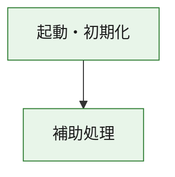
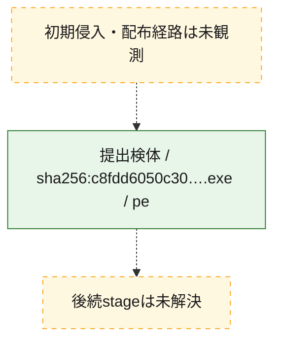
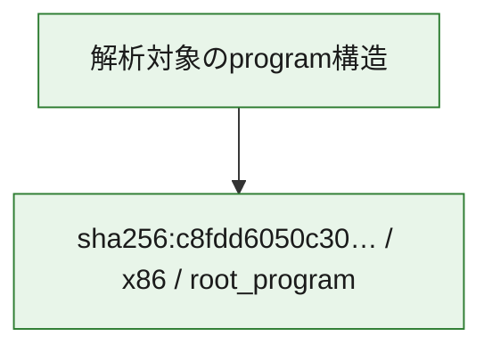

# 全体ロジック：c8fdd6050c30252ba672b0284963a3e1ace14b0e9588fe347415f4f02e4e5db1

代表関数の静的証跡から、起動・初期化の処理群を確認しました。

## 読み方

- phaseの掲載順は解析上の整理順です。observed_call_edgesがない段階間の実行順を断定しません。
- 図の実線は静的に観測した関係、点線と黄色のノードは未観測・未解決の関係を示します。
- 図は静的な要約であり、動的実行を再現するものではありません。
- 詳細な関数解説とfingerprintは[STATIC-LOGIC.md](STATIC-LOGIC.md)を参照してください。

## 静的可視化

### 実行フロー

### 感染チェーン

### モジュール関係

## 処理段階

### 1. 起動・初期化

entry pointから初期化と後続処理への移行を確認します。
確度: `confirmed_static_function_evidence`

- `c8fdd6050c30252ba672b0284963a3e1ace14b0e9588fe347415f4f02e4e5db1:ghidra:180001010` — 初期化と主要処理への分岐を行う入口関数です。 状態: `succeeded`、選定理由: `entry_point`, `meaningful_symbol_name`, `reviewed_call_centrality:22`, `role:entrypoint`, `small_program_complete_context`

### 2. 補助処理

主要処理を支える一般内部関数またはlibrary処理を確認します。
確度: `confirmed_static_function_evidence`

- `c8fdd6050c30252ba672b0284963a3e1ace14b0e9588fe347415f4f02e4e5db1:ghidra:180001240` — 検体内部の一般処理を実装する関数です。 状態: `succeeded`、選定理由: `context_representative`, `reviewed_call_centrality:2`, `small_program_complete_context`
- `c8fdd6050c30252ba672b0284963a3e1ace14b0e9588fe347415f4f02e4e5db1:ghidra:180001350` — 検体内部の一般処理を実装する関数です。 状態: `succeeded`、選定理由: `context_representative`, `reviewed_call_centrality:25`, `small_program_complete_context`
- `c8fdd6050c30252ba672b0284963a3e1ace14b0e9588fe347415f4f02e4e5db1:ghidra:180003780` — 検体内部の一般処理を実装する関数です。 状態: `succeeded`、選定理由: `context_representative`, `reviewed_call_centrality:2`, `small_program_complete_context`
- `c8fdd6050c30252ba672b0284963a3e1ace14b0e9588fe347415f4f02e4e5db1:ghidra:1800038e0` — 検体内部の一般処理を実装する関数です。 状態: `succeeded`、選定理由: `context_representative`, `reviewed_call_centrality:2`, `small_program_complete_context`

## 観測したcall関係

- `c8fdd6050c30252ba672b0284963a3e1ace14b0e9588fe347415f4f02e4e5db1:ghidra:180001010` → `c8fdd6050c30252ba672b0284963a3e1ace14b0e9588fe347415f4f02e4e5db1:ghidra:180001240` （`startup` → `support`）
- `c8fdd6050c30252ba672b0284963a3e1ace14b0e9588fe347415f4f02e4e5db1:ghidra:180001010` → `c8fdd6050c30252ba672b0284963a3e1ace14b0e9588fe347415f4f02e4e5db1:ghidra:180001350` （`startup` → `support`）
- `c8fdd6050c30252ba672b0284963a3e1ace14b0e9588fe347415f4f02e4e5db1:ghidra:180001350` → `c8fdd6050c30252ba672b0284963a3e1ace14b0e9588fe347415f4f02e4e5db1:ghidra:180001240` （`support` → `support`）
- `c8fdd6050c30252ba672b0284963a3e1ace14b0e9588fe347415f4f02e4e5db1:ghidra:180001350` → `c8fdd6050c30252ba672b0284963a3e1ace14b0e9588fe347415f4f02e4e5db1:ghidra:180003780` （`support` → `support`）
- `c8fdd6050c30252ba672b0284963a3e1ace14b0e9588fe347415f4f02e4e5db1:ghidra:180001350` → `c8fdd6050c30252ba672b0284963a3e1ace14b0e9588fe347415f4f02e4e5db1:ghidra:1800038e0` （`support` → `support`）
- `c8fdd6050c30252ba672b0284963a3e1ace14b0e9588fe347415f4f02e4e5db1:ghidra:180003780` → `c8fdd6050c30252ba672b0284963a3e1ace14b0e9588fe347415f4f02e4e5db1:ghidra:1800038e0` （`support` → `support`）
- `ghidra-function:7ddc4d492a89f5d4dab88d31` → `ghidra-function:f3a5e5116219e234fca09d8e` （`unclassified` → `unclassified`）
- `ghidra-function:96c2f90aa346fe2a13225534` → `ghidra-external:0aad244520c7ac3cd7b94fc6` （`unclassified` → `unclassified`）
- `ghidra-function:96c2f90aa346fe2a13225534` → `ghidra-external:0c26ef990ab3ca0f52a763dd` （`unclassified` → `unclassified`）
- `ghidra-function:96c2f90aa346fe2a13225534` → `ghidra-external:0ed4ac1f49857e6d542e8ab0` （`unclassified` → `unclassified`）
- `ghidra-function:96c2f90aa346fe2a13225534` → `ghidra-external:112475d486170e5d7df07e9b` （`unclassified` → `unclassified`）
- `ghidra-function:96c2f90aa346fe2a13225534` → `ghidra-external:29480739060a10d0fd0e8284` （`unclassified` → `unclassified`）
- `ghidra-function:96c2f90aa346fe2a13225534` → `ghidra-external:326e8d586b15d5b84508fc8a` （`unclassified` → `unclassified`）
- `ghidra-function:96c2f90aa346fe2a13225534` → `ghidra-external:40fdbd7e01cc495393110e0e` （`unclassified` → `unclassified`）
- `ghidra-function:96c2f90aa346fe2a13225534` → `ghidra-external:44b979610cad13582914cfbd` （`unclassified` → `unclassified`）
- `ghidra-function:96c2f90aa346fe2a13225534` → `ghidra-external:518bf55afe7d01161a6e28a6` （`unclassified` → `unclassified`）
- `ghidra-function:96c2f90aa346fe2a13225534` → `ghidra-external:78028a3d42417c30d32db957` （`unclassified` → `unclassified`）
- `ghidra-function:96c2f90aa346fe2a13225534` → `ghidra-external:78f12496fd96547302cd9ff6` （`unclassified` → `unclassified`）
- `ghidra-function:96c2f90aa346fe2a13225534` → `ghidra-external:7baa230b50739f95b42f1200` （`unclassified` → `unclassified`）
- `ghidra-function:96c2f90aa346fe2a13225534` → `ghidra-external:96c16761e50faa0a0532d896` （`unclassified` → `unclassified`）
- `ghidra-function:96c2f90aa346fe2a13225534` → `ghidra-external:a31f603bb3b0303cc789eb28` （`unclassified` → `unclassified`）
- `ghidra-function:96c2f90aa346fe2a13225534` → `ghidra-external:b8dd422c36c9bfccf160e686` （`unclassified` → `unclassified`）
- `ghidra-function:96c2f90aa346fe2a13225534` → `ghidra-external:d17d58e89cc7a685d1442174` （`unclassified` → `unclassified`）
- `ghidra-function:96c2f90aa346fe2a13225534` → `ghidra-external:e4a7ab308ca97357e59ed8fd` （`unclassified` → `unclassified`）
- `ghidra-function:96c2f90aa346fe2a13225534` → `ghidra-external:e507c4d167dc0692b3bb30c1` （`unclassified` → `unclassified`）
- `ghidra-function:96c2f90aa346fe2a13225534` → `ghidra-external:e6c4f1ba965278d2c3a09245` （`unclassified` → `unclassified`）
- `ghidra-function:96c2f90aa346fe2a13225534` → `ghidra-external:fa80dd4cd6ddedad7657c90e` （`unclassified` → `unclassified`）
- `ghidra-function:96c2f90aa346fe2a13225534` → `ghidra-external:ff80bdc7c7b8bd76b7fd2a02` （`unclassified` → `unclassified`）
- `ghidra-function:96c2f90aa346fe2a13225534` → `ghidra-function:23ba973c173df1a19726e523` （`unclassified` → `unclassified`）
- `ghidra-function:96c2f90aa346fe2a13225534` → `ghidra-function:7ddc4d492a89f5d4dab88d31` （`unclassified` → `unclassified`）
- `ghidra-function:96c2f90aa346fe2a13225534` → `ghidra-function:f3a5e5116219e234fca09d8e` （`unclassified` → `unclassified`）
- `ghidra-function:de8b4e176dd337478098f571` → `ghidra-function:0d85e729cf63b91b7ecd6a77` （`unclassified` → `unclassified`）
- `ghidra-function:de8b4e176dd337478098f571` → `ghidra-function:1baf3bee90813313e10b3be4` （`unclassified` → `unclassified`）
- `ghidra-function:de8b4e176dd337478098f571` → `ghidra-function:23ba973c173df1a19726e523` （`unclassified` → `unclassified`）
- `ghidra-function:de8b4e176dd337478098f571` → `ghidra-function:28ddeaefef81de7124d2a582` （`unclassified` → `unclassified`）
- `ghidra-function:de8b4e176dd337478098f571` → `ghidra-function:42e4ea2f74c478ee9265f3aa` （`unclassified` → `unclassified`）
- `ghidra-function:de8b4e176dd337478098f571` → `ghidra-function:74fd336de73ab5bb3bcaffb8` （`unclassified` → `unclassified`）
- `ghidra-function:de8b4e176dd337478098f571` → `ghidra-function:7acf8fb7d9e157f5cae80173` （`unclassified` → `unclassified`）
- `ghidra-function:de8b4e176dd337478098f571` → `ghidra-function:7ca72b3de0dacbeecd838df9` （`unclassified` → `unclassified`）
- `ghidra-function:de8b4e176dd337478098f571` → `ghidra-function:8d5b835a10276f468fc4a2e8` （`unclassified` → `unclassified`）
- `ghidra-function:de8b4e176dd337478098f571` → `ghidra-function:96c2f90aa346fe2a13225534` （`unclassified` → `unclassified`）
- `ghidra-function:de8b4e176dd337478098f571` → `ghidra-function:df2d5533af1493040a38f1bc` （`unclassified` → `unclassified`）
- `ghidra-function:de8b4e176dd337478098f571` → `ghidra-function:e3cd5c4e844e27d395b443ef` （`unclassified` → `unclassified`）

## 解析範囲と制約

- 選定外関数は全体inventoryへ残しますが、関数本体の個別解説対象にはしていません。
- indirect call、難読化、packer、VM、壊れたcontrol flowによりcall関係が欠落する場合があります。
- 文書は静的解析に基づき、検体実行や外部通信による動的確認は行っていません。
