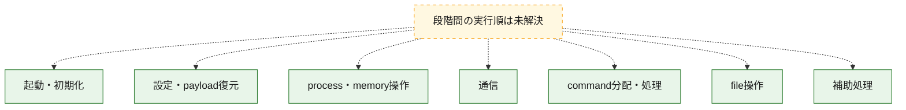
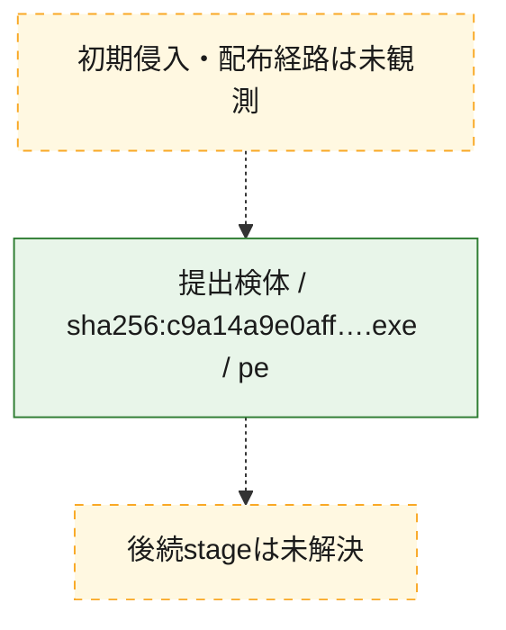
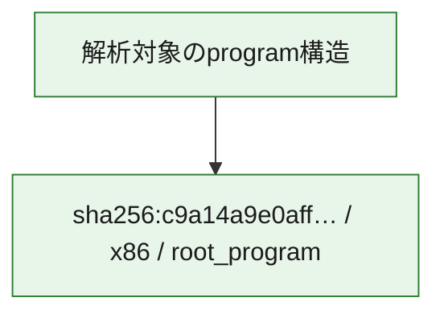

# 全体ロジック：c9a14a9e0aff3962cb73e48a76d91a3743001e3da6d5376c75b56d8dd02b176f

代表関数の静的証跡から、起動・初期化、設定・payload復元、process・memory操作、通信、command分配・処理、file操作の処理群を確認しました。

## 読み方

- phaseの掲載順は解析上の整理順です。observed_call_edgesがない段階間の実行順を断定しません。
- 図の実線は静的に観測した関係、点線と黄色のノードは未観測・未解決の関係を示します。
- 図は静的な要約であり、動的実行を再現するものではありません。
- 詳細な関数解説とfingerprintは[STATIC-LOGIC.md](STATIC-LOGIC.md)を参照してください。

## 静的可視化

### 実行フロー

### 感染チェーン

### モジュール関係

## 処理段階

### 1. 起動・初期化

entry pointから初期化と後続処理への移行を確認します。
確度: `confirmed_static_function_evidence_with_limits`

- `c9a14a9e0aff3962cb73e48a76d91a3743001e3da6d5376c75b56d8dd02b176f:ghidra:1400adc40` — 初期化と主要処理への分岐を行う入口関数です。 状態: `succeeded`、選定理由: `entry_point`, `meaningful_symbol_name`, `probable_go_main_user_code`, `reviewed_call_centrality:5`, `role:entrypoint`
- `c9a14a9e0aff3962cb73e48a76d91a3743001e3da6d5376c75b56d8dd02b176f:ghidra:1400ade00` — 初期化と主要処理への分岐を行う入口関数です。 状態: `failed`、選定理由: `entry_point`, `meaningful_symbol_name`, `probable_go_main_user_code`, `role:entrypoint`
- `c9a14a9e0aff3962cb73e48a76d91a3743001e3da6d5376c75b56d8dd02b176f:ghidra:1400be4c0` — 初期化と主要処理への分岐を行う入口関数です。 状態: `succeeded`、選定理由: `entry_point`, `meaningful_symbol_name`, `probable_go_main_user_code`, `reviewed_call_centrality:14`, `role:entrypoint`
- `c9a14a9e0aff3962cb73e48a76d91a3743001e3da6d5376c75b56d8dd02b176f:ghidra:1400bffe0` — 初期化と主要処理への分岐を行う入口関数です。 状態: `succeeded`、選定理由: `entry_point`, `meaningful_symbol_name`, `probable_go_main_user_code`, `reviewed_call_centrality:9`, `role:entrypoint`
- `c9a14a9e0aff3962cb73e48a76d91a3743001e3da6d5376c75b56d8dd02b176f:ghidra:1400c20a0` — 初期化と主要処理への分岐を行う入口関数です。 状態: `succeeded`、選定理由: `entry_point`, `meaningful_symbol_name`, `probable_go_main_user_code`, `reviewed_call_centrality:9`, `role:entrypoint`
- `c9a14a9e0aff3962cb73e48a76d91a3743001e3da6d5376c75b56d8dd02b176f:ghidra:1400c4d40` — 初期化と主要処理への分岐を行う入口関数です。 状態: `succeeded`、選定理由: `entry_point`, `meaningful_symbol_name`, `probable_go_main_user_code`, `reviewed_call_centrality:11`, `role:entrypoint`
- `c9a14a9e0aff3962cb73e48a76d91a3743001e3da6d5376c75b56d8dd02b176f:ghidra:1400c6600` — 初期化と主要処理への分岐を行う入口関数です。 状態: `succeeded`、選定理由: `entry_point`, `meaningful_symbol_name`, `probable_go_main_user_code`, `reviewed_call_centrality:10`, `role:entrypoint`
- `c9a14a9e0aff3962cb73e48a76d91a3743001e3da6d5376c75b56d8dd02b176f:ghidra:1400c8f00` — 初期化と主要処理への分岐を行う入口関数です。 状態: `succeeded`、選定理由: `entry_point`, `meaningful_symbol_name`, `probable_go_main_user_code`, `reviewed_call_centrality:12`, `role:entrypoint`
- `c9a14a9e0aff3962cb73e48a76d91a3743001e3da6d5376c75b56d8dd02b176f:ghidra:1400ca500` — 初期化と主要処理への分岐を行う入口関数です。 状態: `succeeded`、選定理由: `entry_point`, `meaningful_symbol_name`, `probable_go_main_user_code`, `reviewed_call_centrality:11`, `role:entrypoint`
- `c9a14a9e0aff3962cb73e48a76d91a3743001e3da6d5376c75b56d8dd02b176f:ghidra:1400cba80` — 初期化と主要処理への分岐を行う入口関数です。 状態: `succeeded`、選定理由: `entry_point`, `meaningful_symbol_name`, `probable_go_main_user_code`, `reviewed_call_centrality:13`, `role:entrypoint`
- `c9a14a9e0aff3962cb73e48a76d91a3743001e3da6d5376c75b56d8dd02b176f:ghidra:1400cdc40` — 初期化と主要処理への分岐を行う入口関数です。 状態: `succeeded`、選定理由: `entry_point`, `meaningful_symbol_name`, `probable_go_main_user_code`, `reviewed_call_centrality:9`, `role:entrypoint`
- `c9a14a9e0aff3962cb73e48a76d91a3743001e3da6d5376c75b56d8dd02b176f:ghidra:1400cf880` — 初期化と主要処理への分岐を行う入口関数です。 状態: `succeeded`、選定理由: `entry_point`, `meaningful_symbol_name`, `probable_go_main_user_code`, `reviewed_call_centrality:13`, `role:entrypoint`
- `c9a14a9e0aff3962cb73e48a76d91a3743001e3da6d5376c75b56d8dd02b176f:ghidra:1400d0de0` — 初期化と主要処理への分岐を行う入口関数です。 状態: `succeeded`、選定理由: `entry_point`, `meaningful_symbol_name`, `probable_go_main_user_code`, `reviewed_call_centrality:11`, `role:entrypoint`
- `c9a14a9e0aff3962cb73e48a76d91a3743001e3da6d5376c75b56d8dd02b176f:ghidra:1400d3740` — 初期化と主要処理への分岐を行う入口関数です。 状態: `succeeded`、選定理由: `entry_point`, `meaningful_symbol_name`, `probable_go_main_user_code`, `reviewed_call_centrality:8`, `role:entrypoint`
- `c9a14a9e0aff3962cb73e48a76d91a3743001e3da6d5376c75b56d8dd02b176f:ghidra:1400d4b60` — 初期化と主要処理への分岐を行う入口関数です。 状態: `failed`、選定理由: `entry_point`, `meaningful_symbol_name`, `probable_go_main_user_code`, `role:entrypoint`
- `c9a14a9e0aff3962cb73e48a76d91a3743001e3da6d5376c75b56d8dd02b176f:ghidra:1400de400` — 初期化と主要処理への分岐を行う入口関数です。 状態: `succeeded`、選定理由: `entry_point`, `meaningful_symbol_name`, `probable_go_main_user_code`, `reviewed_call_centrality:13`, `role:entrypoint`
- `c9a14a9e0aff3962cb73e48a76d91a3743001e3da6d5376c75b56d8dd02b176f:ghidra:1400e16c0` — 初期化と主要処理への分岐を行う入口関数です。 状態: `succeeded`、選定理由: `entry_point`, `meaningful_symbol_name`, `probable_go_main_user_code`, `reviewed_call_centrality:12`, `role:entrypoint`
- `c9a14a9e0aff3962cb73e48a76d91a3743001e3da6d5376c75b56d8dd02b176f:ghidra:1400e5200` — 初期化と主要処理への分岐を行う入口関数です。 状態: `succeeded`、選定理由: `entry_point`, `meaningful_symbol_name`, `probable_go_main_user_code`, `reviewed_call_centrality:10`, `role:entrypoint`
- `c9a14a9e0aff3962cb73e48a76d91a3743001e3da6d5376c75b56d8dd02b176f:ghidra:1400e80e0` — 初期化と主要処理への分岐を行う入口関数です。 状態: `succeeded`、選定理由: `entry_point`, `meaningful_symbol_name`, `probable_go_main_user_code`, `reviewed_call_centrality:10`, `role:entrypoint`
- `c9a14a9e0aff3962cb73e48a76d91a3743001e3da6d5376c75b56d8dd02b176f:ghidra:1400ea600` — 初期化と主要処理への分岐を行う入口関数です。 状態: `succeeded`、選定理由: `entry_point`, `meaningful_symbol_name`, `probable_go_main_user_code`, `reviewed_call_centrality:11`, `role:entrypoint`
- `c9a14a9e0aff3962cb73e48a76d91a3743001e3da6d5376c75b56d8dd02b176f:ghidra:1400eb2a0` — 初期化と主要処理への分岐を行う入口関数です。 状態: `succeeded`、選定理由: `entry_point`, `meaningful_symbol_name`, `probable_go_main_user_code`, `reviewed_call_centrality:19`, `role:entrypoint`
- `c9a14a9e0aff3962cb73e48a76d91a3743001e3da6d5376c75b56d8dd02b176f:ghidra:1400ee200` — 初期化と主要処理への分岐を行う入口関数です。 状態: `succeeded`、選定理由: `entry_point`, `meaningful_symbol_name`, `probable_go_main_user_code`, `reviewed_call_centrality:10`, `role:entrypoint`
- `c9a14a9e0aff3962cb73e48a76d91a3743001e3da6d5376c75b56d8dd02b176f:ghidra:1400ef2a0` — 初期化と主要処理への分岐を行う入口関数です。 状態: `succeeded`、選定理由: `entry_point`, `meaningful_symbol_name`, `probable_go_main_user_code`, `reviewed_call_centrality:9`, `role:entrypoint`
- `c9a14a9e0aff3962cb73e48a76d91a3743001e3da6d5376c75b56d8dd02b176f:ghidra:1400f0b00` — 初期化と主要処理への分岐を行う入口関数です。 状態: `succeeded`、選定理由: `entry_point`, `meaningful_symbol_name`, `probable_go_main_user_code`, `reviewed_call_centrality:10`, `role:entrypoint`
- `c9a14a9e0aff3962cb73e48a76d91a3743001e3da6d5376c75b56d8dd02b176f:ghidra:1400f1740` — 初期化と主要処理への分岐を行う入口関数です。 状態: `succeeded`、選定理由: `entry_point`, `meaningful_symbol_name`, `probable_go_main_user_code`, `reviewed_call_centrality:11`, `role:entrypoint`

### 2. 設定・payload復元

設定、resource、payload、暗号化データの復元・変換を確認します。
確度: `confirmed_static_function_evidence`

- `c9a14a9e0aff3962cb73e48a76d91a3743001e3da6d5376c75b56d8dd02b176f:ghidra:140087920` — 設定、resource、payloadなどの解析・変換を行う関数です。 状態: `succeeded`、選定理由: `meaningful_symbol_name`, `reviewed_call_centrality:4`, `role:config_or_data_transform`

### 3. process・memory操作

process、thread、module、memory操作と実行移行を確認します。
確度: `confirmed_static_function_evidence`

- `c9a14a9e0aff3962cb73e48a76d91a3743001e3da6d5376c75b56d8dd02b176f:ghidra:140098200` — process、thread、module、またはmemory操作に関係する関数です。 状態: `succeeded`、選定理由: `meaningful_symbol_name`, `reviewed_call_centrality:6`, `role:process_or_memory_operation`

### 4. 通信

通信初期化、endpoint処理、送受信の役割を確認します。
確度: `confirmed_static_function_evidence`

- `c9a14a9e0aff3962cb73e48a76d91a3743001e3da6d5376c75b56d8dd02b176f:ghidra:140098ae0` — 通信初期化、送受信、またはendpoint処理に関係する関数です。 状態: `succeeded`、選定理由: `meaningful_symbol_name`, `reviewed_call_centrality:6`, `role:network_communication`

### 5. command分配・処理

受信commandやtaskの解釈、分配、個別handlerへの移行を確認します。
確度: `confirmed_static_function_evidence`

- `c9a14a9e0aff3962cb73e48a76d91a3743001e3da6d5376c75b56d8dd02b176f:ghidra:140097d40` — commandの解釈、分配、または個別処理を担当する関数です。 状態: `succeeded`、選定理由: `meaningful_symbol_name`, `reviewed_call_centrality:5`, `role:command_dispatch_or_handler`

### 6. file操作

fileやdirectoryの作成、読書き、削除を確認します。
確度: `confirmed_static_function_evidence`

- `c9a14a9e0aff3962cb73e48a76d91a3743001e3da6d5376c75b56d8dd02b176f:ghidra:1400986c0` — fileまたはdirectoryの読書き・管理に関係する関数です。 状態: `succeeded`、選定理由: `meaningful_symbol_name`, `reviewed_call_centrality:6`, `role:file_operation`

### 7. 補助処理

主要処理を支える一般内部関数またはlibrary処理を確認します。
確度: `confirmed_static_function_evidence`

- `c9a14a9e0aff3962cb73e48a76d91a3743001e3da6d5376c75b56d8dd02b176f:ghidra:140001080` — compiler生成処理または汎用library処理とみられる関数です。 状態: `succeeded`、選定理由: `meaningful_symbol_name`, `reviewed_call_centrality:5`
- `c9a14a9e0aff3962cb73e48a76d91a3743001e3da6d5376c75b56d8dd02b176f:ghidra:140070f00` — 検体内部の一般処理を実装する関数です。 状態: `succeeded`、選定理由: `meaningful_symbol_name`, `reviewed_call_centrality:3`

## 観測したcall関係

- `ghidra-function:08be18d2ce2d1af5d932875f` → `ghidra-external:37988d69bc3fdaff5c7d3362` （`unclassified` → `unclassified`）
- `ghidra-function:08be18d2ce2d1af5d932875f` → `ghidra-external:4e7016348619d9c61e85e2e7` （`unclassified` → `unclassified`）
- `ghidra-function:08be18d2ce2d1af5d932875f` → `ghidra-external:50645a9405b5f7c41d49ba71` （`unclassified` → `unclassified`）
- `ghidra-function:08be18d2ce2d1af5d932875f` → `ghidra-external:54d83de43fec6e39d751fe92` （`unclassified` → `unclassified`）
- `ghidra-function:08be18d2ce2d1af5d932875f` → `ghidra-external:9a8b809a8a67e0aea45130eb` （`unclassified` → `unclassified`）
- `ghidra-function:0f57b2a1ad860dcc6cf9dd16` → `ghidra-external:3a4e370ed411c86d21215a1b` （`unclassified` → `unclassified`）
- `ghidra-function:0f57b2a1ad860dcc6cf9dd16` → `ghidra-external:5c8d6ea288870d61b05e5d1e` （`unclassified` → `unclassified`）
- `ghidra-function:0f57b2a1ad860dcc6cf9dd16` → `ghidra-external:66c86f583e0d72f6c08e0229` （`unclassified` → `unclassified`）
- `ghidra-function:0f57b2a1ad860dcc6cf9dd16` → `ghidra-external:9a8b809a8a67e0aea45130eb` （`unclassified` → `unclassified`）
- `ghidra-function:0f57b2a1ad860dcc6cf9dd16` → `ghidra-external:9c7226409594f7623671ff92` （`unclassified` → `unclassified`）
- `ghidra-function:0f57b2a1ad860dcc6cf9dd16` → `ghidra-external:a2fec333909c4f59934611f6` （`unclassified` → `unclassified`）
- `ghidra-function:0f57b2a1ad860dcc6cf9dd16` → `ghidra-external:c2f1629ab14923182cd5c0ec` （`unclassified` → `unclassified`）
- `ghidra-function:0f57b2a1ad860dcc6cf9dd16` → `ghidra-external:d2af95cb9b5cd05d485cbdd6` （`unclassified` → `unclassified`）
- `ghidra-function:0f57b2a1ad860dcc6cf9dd16` → `ghidra-external:d9e73214ab2643f0fc91507b` （`unclassified` → `unclassified`）
- `ghidra-function:0f57b2a1ad860dcc6cf9dd16` → `ghidra-external:eb44976e3ed5afbe6699af01` （`unclassified` → `unclassified`）
- `ghidra-function:12e8afa6af33f1b7110deaaf` → `ghidra-external:21dea25c0be00eeb90b1b1ac` （`unclassified` → `unclassified`）
- `ghidra-function:12e8afa6af33f1b7110deaaf` → `ghidra-external:2f08016ea402e2c7a809b102` （`unclassified` → `unclassified`）
- `ghidra-function:12e8afa6af33f1b7110deaaf` → `ghidra-external:3a4e370ed411c86d21215a1b` （`unclassified` → `unclassified`）
- `ghidra-function:12e8afa6af33f1b7110deaaf` → `ghidra-external:5c8d6ea288870d61b05e5d1e` （`unclassified` → `unclassified`）
- `ghidra-function:12e8afa6af33f1b7110deaaf` → `ghidra-external:66c86f583e0d72f6c08e0229` （`unclassified` → `unclassified`）
- `ghidra-function:12e8afa6af33f1b7110deaaf` → `ghidra-external:9a8b809a8a67e0aea45130eb` （`unclassified` → `unclassified`）
- `ghidra-function:12e8afa6af33f1b7110deaaf` → `ghidra-external:a2fec333909c4f59934611f6` （`unclassified` → `unclassified`）
- `ghidra-function:12e8afa6af33f1b7110deaaf` → `ghidra-external:c2f1629ab14923182cd5c0ec` （`unclassified` → `unclassified`）
- `ghidra-function:12e8afa6af33f1b7110deaaf` → `ghidra-external:d2af95cb9b5cd05d485cbdd6` （`unclassified` → `unclassified`）
- `ghidra-function:12e8afa6af33f1b7110deaaf` → `ghidra-external:f61185218ad1a6495a16cfc4` （`unclassified` → `unclassified`）
- `ghidra-function:1735e83a80f141bd0fb56e71` → `ghidra-external:11e141606fd1baa3aed909af` （`unclassified` → `unclassified`）
- `ghidra-function:1735e83a80f141bd0fb56e71` → `ghidra-external:3a4e370ed411c86d21215a1b` （`unclassified` → `unclassified`）
- `ghidra-function:1735e83a80f141bd0fb56e71` → `ghidra-external:3b66c0ff46d2144eb314de17` （`unclassified` → `unclassified`）
- `ghidra-function:1735e83a80f141bd0fb56e71` → `ghidra-external:5c8d6ea288870d61b05e5d1e` （`unclassified` → `unclassified`）
- `ghidra-function:1735e83a80f141bd0fb56e71` → `ghidra-external:66c86f583e0d72f6c08e0229` （`unclassified` → `unclassified`）
- `ghidra-function:1735e83a80f141bd0fb56e71` → `ghidra-external:8768b02923032fd2f51842b8` （`unclassified` → `unclassified`）
- `ghidra-function:1735e83a80f141bd0fb56e71` → `ghidra-external:9a8b809a8a67e0aea45130eb` （`unclassified` → `unclassified`）
- `ghidra-function:1735e83a80f141bd0fb56e71` → `ghidra-external:a0b61520c8ceca86442eb0df` （`unclassified` → `unclassified`）
- `ghidra-function:1735e83a80f141bd0fb56e71` → `ghidra-external:a2fec333909c4f59934611f6` （`unclassified` → `unclassified`）
- `ghidra-function:1735e83a80f141bd0fb56e71` → `ghidra-external:c2f1629ab14923182cd5c0ec` （`unclassified` → `unclassified`）
- `ghidra-function:1735e83a80f141bd0fb56e71` → `ghidra-external:d2af95cb9b5cd05d485cbdd6` （`unclassified` → `unclassified`）
- `ghidra-function:260ba993f7662b93250f93a9` → `ghidra-external:3a4e370ed411c86d21215a1b` （`unclassified` → `unclassified`）
- `ghidra-function:260ba993f7662b93250f93a9` → `ghidra-external:3c5a332d6c60a5d47c973fc2` （`unclassified` → `unclassified`）
- `ghidra-function:260ba993f7662b93250f93a9` → `ghidra-external:5b66bd11f428fe162ef033aa` （`unclassified` → `unclassified`）
- `ghidra-function:260ba993f7662b93250f93a9` → `ghidra-external:5c8d6ea288870d61b05e5d1e` （`unclassified` → `unclassified`）
- `ghidra-function:260ba993f7662b93250f93a9` → `ghidra-external:66c86f583e0d72f6c08e0229` （`unclassified` → `unclassified`）
- `ghidra-function:260ba993f7662b93250f93a9` → `ghidra-external:88a3cc68587af31ad9bcc7d2` （`unclassified` → `unclassified`）
- `ghidra-function:260ba993f7662b93250f93a9` → `ghidra-external:9a8b809a8a67e0aea45130eb` （`unclassified` → `unclassified`）
- `ghidra-function:260ba993f7662b93250f93a9` → `ghidra-external:a2fec333909c4f59934611f6` （`unclassified` → `unclassified`）
- `ghidra-function:260ba993f7662b93250f93a9` → `ghidra-external:c2f1629ab14923182cd5c0ec` （`unclassified` → `unclassified`）
- `ghidra-function:260ba993f7662b93250f93a9` → `ghidra-external:d2af95cb9b5cd05d485cbdd6` （`unclassified` → `unclassified`）
- `ghidra-function:27147f525eb8db2aa11dd7ec` → `ghidra-external:25f19e400c988447e1b2692a` （`unclassified` → `unclassified`）
- `ghidra-function:27147f525eb8db2aa11dd7ec` → `ghidra-external:6826ec1191926919892f1b22` （`unclassified` → `unclassified`）
- `ghidra-function:27147f525eb8db2aa11dd7ec` → `ghidra-external:88a3cc68587af31ad9bcc7d2` （`unclassified` → `unclassified`）
- `ghidra-function:27147f525eb8db2aa11dd7ec` → `ghidra-external:9a8b809a8a67e0aea45130eb` （`unclassified` → `unclassified`）
- `ghidra-function:27147f525eb8db2aa11dd7ec` → `ghidra-external:d2ea02a7c046ce462f8578a9` （`unclassified` → `unclassified`）
- `ghidra-function:3110c8b6753276dc47926935` → `ghidra-external:08bf03a3efe66389944d93d3` （`unclassified` → `unclassified`）
- `ghidra-function:3110c8b6753276dc47926935` → `ghidra-external:3a4e370ed411c86d21215a1b` （`unclassified` → `unclassified`）
- `ghidra-function:3110c8b6753276dc47926935` → `ghidra-external:5c8d6ea288870d61b05e5d1e` （`unclassified` → `unclassified`）
- `ghidra-function:3110c8b6753276dc47926935` → `ghidra-external:5e771f5e75b9cdd9838ba951` （`unclassified` → `unclassified`）
- `ghidra-function:3110c8b6753276dc47926935` → `ghidra-external:66c86f583e0d72f6c08e0229` （`unclassified` → `unclassified`）
- `ghidra-function:3110c8b6753276dc47926935` → `ghidra-external:9a8b809a8a67e0aea45130eb` （`unclassified` → `unclassified`）
- `ghidra-function:3110c8b6753276dc47926935` → `ghidra-external:a2fec333909c4f59934611f6` （`unclassified` → `unclassified`）
- `ghidra-function:3110c8b6753276dc47926935` → `ghidra-external:c2f1629ab14923182cd5c0ec` （`unclassified` → `unclassified`）
- `ghidra-function:3110c8b6753276dc47926935` → `ghidra-external:d2af95cb9b5cd05d485cbdd6` （`unclassified` → `unclassified`）
- `ghidra-function:325ada696cdef9f8f41d58e1` → `ghidra-external:08bf03a3efe66389944d93d3` （`unclassified` → `unclassified`）
- `ghidra-function:325ada696cdef9f8f41d58e1` → `ghidra-external:39a1e82dc4e33b9d3ca93221` （`unclassified` → `unclassified`）
- `ghidra-function:325ada696cdef9f8f41d58e1` → `ghidra-external:6ec9f78eb5fa5b7018c1bbb7` （`unclassified` → `unclassified`）
- `ghidra-function:325ada696cdef9f8f41d58e1` → `ghidra-external:f6066d6304dce7500c7892a8` （`unclassified` → `unclassified`）
- `ghidra-function:3433c7b224cf0ae3f7657efe` → `ghidra-external:09a1f055f2efa70f6afe670a` （`unclassified` → `unclassified`）
- `ghidra-function:3433c7b224cf0ae3f7657efe` → `ghidra-external:2f08016ea402e2c7a809b102` （`unclassified` → `unclassified`）
- `ghidra-function:3433c7b224cf0ae3f7657efe` → `ghidra-external:3a4e370ed411c86d21215a1b` （`unclassified` → `unclassified`）
- `ghidra-function:3433c7b224cf0ae3f7657efe` → `ghidra-external:517d4838b497e1b1d050a467` （`unclassified` → `unclassified`）
- `ghidra-function:3433c7b224cf0ae3f7657efe` → `ghidra-external:5c8d6ea288870d61b05e5d1e` （`unclassified` → `unclassified`）
- `ghidra-function:3433c7b224cf0ae3f7657efe` → `ghidra-external:66c86f583e0d72f6c08e0229` （`unclassified` → `unclassified`）
- `ghidra-function:3433c7b224cf0ae3f7657efe` → `ghidra-external:9a8b809a8a67e0aea45130eb` （`unclassified` → `unclassified`）
- `ghidra-function:3433c7b224cf0ae3f7657efe` → `ghidra-external:a2fec333909c4f59934611f6` （`unclassified` → `unclassified`）
- `ghidra-function:3433c7b224cf0ae3f7657efe` → `ghidra-external:aac99206473dd0933963a371` （`unclassified` → `unclassified`）
- `ghidra-function:3433c7b224cf0ae3f7657efe` → `ghidra-external:c2f1629ab14923182cd5c0ec` （`unclassified` → `unclassified`）
- `ghidra-function:3433c7b224cf0ae3f7657efe` → `ghidra-external:d2af95cb9b5cd05d485cbdd6` （`unclassified` → `unclassified`）
- `ghidra-function:343bf34206f43360f5448d0a` → `ghidra-external:31567c435e7cc3df776b9a3d` （`unclassified` → `unclassified`）
- `ghidra-function:343bf34206f43360f5448d0a` → `ghidra-external:3a4e370ed411c86d21215a1b` （`unclassified` → `unclassified`）
- `ghidra-function:343bf34206f43360f5448d0a` → `ghidra-external:5bd6d50418c4f86f3738d5c2` （`unclassified` → `unclassified`）
- `ghidra-function:343bf34206f43360f5448d0a` → `ghidra-external:5c8d6ea288870d61b05e5d1e` （`unclassified` → `unclassified`）
- `ghidra-function:343bf34206f43360f5448d0a` → `ghidra-external:66c86f583e0d72f6c08e0229` （`unclassified` → `unclassified`）
- `ghidra-function:343bf34206f43360f5448d0a` → `ghidra-external:73a9eb072a3cec92f0dd4563` （`unclassified` → `unclassified`）
- `ghidra-function:343bf34206f43360f5448d0a` → `ghidra-external:9a8b809a8a67e0aea45130eb` （`unclassified` → `unclassified`）
- `ghidra-function:343bf34206f43360f5448d0a` → `ghidra-external:a054fb18a8f52e35ca7ff013` （`unclassified` → `unclassified`）
- `ghidra-function:343bf34206f43360f5448d0a` → `ghidra-external:a2fec333909c4f59934611f6` （`unclassified` → `unclassified`）
- `ghidra-function:343bf34206f43360f5448d0a` → `ghidra-external:c2f1629ab14923182cd5c0ec` （`unclassified` → `unclassified`）
- `ghidra-function:343bf34206f43360f5448d0a` → `ghidra-external:d2af95cb9b5cd05d485cbdd6` （`unclassified` → `unclassified`）
- `ghidra-function:3619ca8f8c5184d9ea0c6b7b` → `ghidra-external:37988d69bc3fdaff5c7d3362` （`unclassified` → `unclassified`）
- `ghidra-function:3619ca8f8c5184d9ea0c6b7b` → `ghidra-external:3a4e370ed411c86d21215a1b` （`unclassified` → `unclassified`）
- `ghidra-function:3619ca8f8c5184d9ea0c6b7b` → `ghidra-external:3b66c0ff46d2144eb314de17` （`unclassified` → `unclassified`）
- `ghidra-function:3619ca8f8c5184d9ea0c6b7b` → `ghidra-external:50645a9405b5f7c41d49ba71` （`unclassified` → `unclassified`）
- `ghidra-function:3619ca8f8c5184d9ea0c6b7b` → `ghidra-external:5c8d6ea288870d61b05e5d1e` （`unclassified` → `unclassified`）
- `ghidra-function:3619ca8f8c5184d9ea0c6b7b` → `ghidra-external:66c86f583e0d72f6c08e0229` （`unclassified` → `unclassified`）
- `ghidra-function:3619ca8f8c5184d9ea0c6b7b` → `ghidra-external:8768b02923032fd2f51842b8` （`unclassified` → `unclassified`）
- `ghidra-function:3619ca8f8c5184d9ea0c6b7b` → `ghidra-external:9a8b809a8a67e0aea45130eb` （`unclassified` → `unclassified`）
- `ghidra-function:3619ca8f8c5184d9ea0c6b7b` → `ghidra-external:a2fec333909c4f59934611f6` （`unclassified` → `unclassified`）
- `ghidra-function:3619ca8f8c5184d9ea0c6b7b` → `ghidra-external:c2f1629ab14923182cd5c0ec` （`unclassified` → `unclassified`）
- `ghidra-function:3619ca8f8c5184d9ea0c6b7b` → `ghidra-external:d27bbe37716d00fc2ab3f87f` （`unclassified` → `unclassified`）
- `ghidra-function:3619ca8f8c5184d9ea0c6b7b` → `ghidra-external:d2af95cb9b5cd05d485cbdd6` （`unclassified` → `unclassified`）
- `ghidra-function:4224ed945caf658a92f9d941` → `ghidra-external:3a4e370ed411c86d21215a1b` （`unclassified` → `unclassified`）
- `ghidra-function:4224ed945caf658a92f9d941` → `ghidra-external:5c8d6ea288870d61b05e5d1e` （`unclassified` → `unclassified`）
- `ghidra-function:4224ed945caf658a92f9d941` → `ghidra-external:66c86f583e0d72f6c08e0229` （`unclassified` → `unclassified`）
- `ghidra-function:4224ed945caf658a92f9d941` → `ghidra-external:6ec9f78eb5fa5b7018c1bbb7` （`unclassified` → `unclassified`）
- `ghidra-function:4224ed945caf658a92f9d941` → `ghidra-external:7b19505d1cd2dde4fe24f9e3` （`unclassified` → `unclassified`）
- `ghidra-function:4224ed945caf658a92f9d941` → `ghidra-external:9a8b809a8a67e0aea45130eb` （`unclassified` → `unclassified`）
- `ghidra-function:4224ed945caf658a92f9d941` → `ghidra-external:a2fec333909c4f59934611f6` （`unclassified` → `unclassified`）
- `ghidra-function:4224ed945caf658a92f9d941` → `ghidra-external:c2f1629ab14923182cd5c0ec` （`unclassified` → `unclassified`）
- `ghidra-function:4224ed945caf658a92f9d941` → `ghidra-external:d2af95cb9b5cd05d485cbdd6` （`unclassified` → `unclassified`）
- `ghidra-function:459ba8e6d490f5d6e94c598f` → `ghidra-external:2ffacaf3b43a9d77d70c8ff4` （`unclassified` → `unclassified`）
- `ghidra-function:459ba8e6d490f5d6e94c598f` → `ghidra-external:3a4e370ed411c86d21215a1b` （`unclassified` → `unclassified`）
- `ghidra-function:459ba8e6d490f5d6e94c598f` → `ghidra-external:5c8d6ea288870d61b05e5d1e` （`unclassified` → `unclassified`）
- `ghidra-function:459ba8e6d490f5d6e94c598f` → `ghidra-external:66c86f583e0d72f6c08e0229` （`unclassified` → `unclassified`）
- `ghidra-function:459ba8e6d490f5d6e94c598f` → `ghidra-external:9a8b809a8a67e0aea45130eb` （`unclassified` → `unclassified`）
- `ghidra-function:459ba8e6d490f5d6e94c598f` → `ghidra-external:a2fec333909c4f59934611f6` （`unclassified` → `unclassified`）
- `ghidra-function:459ba8e6d490f5d6e94c598f` → `ghidra-external:c2f1629ab14923182cd5c0ec` （`unclassified` → `unclassified`）
- `ghidra-function:459ba8e6d490f5d6e94c598f` → `ghidra-external:d2af95cb9b5cd05d485cbdd6` （`unclassified` → `unclassified`）
- `ghidra-function:545e5245d818742a0f5a83e3` → `ghidra-external:3a4e370ed411c86d21215a1b` （`unclassified` → `unclassified`）
- `ghidra-function:545e5245d818742a0f5a83e3` → `ghidra-external:5c8d6ea288870d61b05e5d1e` （`unclassified` → `unclassified`）
- `ghidra-function:545e5245d818742a0f5a83e3` → `ghidra-external:5fdf984594089b49b0021794` （`unclassified` → `unclassified`）
- `ghidra-function:545e5245d818742a0f5a83e3` → `ghidra-external:66c86f583e0d72f6c08e0229` （`unclassified` → `unclassified`）
- `ghidra-function:545e5245d818742a0f5a83e3` → `ghidra-external:9a8b809a8a67e0aea45130eb` （`unclassified` → `unclassified`）
- `ghidra-function:545e5245d818742a0f5a83e3` → `ghidra-external:a2fec333909c4f59934611f6` （`unclassified` → `unclassified`）
- `ghidra-function:545e5245d818742a0f5a83e3` → `ghidra-external:c2f1629ab14923182cd5c0ec` （`unclassified` → `unclassified`）
- `ghidra-function:545e5245d818742a0f5a83e3` → `ghidra-external:d2af95cb9b5cd05d485cbdd6` （`unclassified` → `unclassified`）
- `ghidra-function:545e5245d818742a0f5a83e3` → `ghidra-external:d9e73214ab2643f0fc91507b` （`unclassified` → `unclassified`）
- `ghidra-function:545e5245d818742a0f5a83e3` → `ghidra-external:eb44976e3ed5afbe6699af01` （`unclassified` → `unclassified`）
- `ghidra-function:545e5245d818742a0f5a83e3` → `ghidra-external:fc14faf3f17b323c47c0dc6b` （`unclassified` → `unclassified`）
- `ghidra-function:854cc2341b46a9861975c0a7` → `ghidra-external:08bf03a3efe66389944d93d3` （`unclassified` → `unclassified`）
- `ghidra-function:854cc2341b46a9861975c0a7` → `ghidra-external:33bcaca20e4acd03b43a00e5` （`unclassified` → `unclassified`）
- `ghidra-function:854cc2341b46a9861975c0a7` → `ghidra-external:36603ed5e642f2033f237b4a` （`unclassified` → `unclassified`）
- `ghidra-function:854cc2341b46a9861975c0a7` → `ghidra-external:3a4e370ed411c86d21215a1b` （`unclassified` → `unclassified`）
- `ghidra-function:854cc2341b46a9861975c0a7` → `ghidra-external:3b66c0ff46d2144eb314de17` （`unclassified` → `unclassified`）
- `ghidra-function:854cc2341b46a9861975c0a7` → `ghidra-external:5c8d6ea288870d61b05e5d1e` （`unclassified` → `unclassified`）
- `ghidra-function:854cc2341b46a9861975c0a7` → `ghidra-external:66c86f583e0d72f6c08e0229` （`unclassified` → `unclassified`）
- `ghidra-function:854cc2341b46a9861975c0a7` → `ghidra-external:68c34dd9a7be8913c0cff6ed` （`unclassified` → `unclassified`）
- `ghidra-function:854cc2341b46a9861975c0a7` → `ghidra-external:73b0c02a233f34c33b6a36d2` （`unclassified` → `unclassified`）
- `ghidra-function:854cc2341b46a9861975c0a7` → `ghidra-external:7faaf4195e19c91b37fb339e` （`unclassified` → `unclassified`）
- `ghidra-function:854cc2341b46a9861975c0a7` → `ghidra-external:9a8b809a8a67e0aea45130eb` （`unclassified` → `unclassified`）
- `ghidra-function:854cc2341b46a9861975c0a7` → `ghidra-external:9c7226409594f7623671ff92` （`unclassified` → `unclassified`）
- `ghidra-function:854cc2341b46a9861975c0a7` → `ghidra-external:a2fec333909c4f59934611f6` （`unclassified` → `unclassified`）
- `ghidra-function:854cc2341b46a9861975c0a7` → `ghidra-external:c2f1629ab14923182cd5c0ec` （`unclassified` → `unclassified`）
- `ghidra-function:854cc2341b46a9861975c0a7` → `ghidra-external:d2af95cb9b5cd05d485cbdd6` （`unclassified` → `unclassified`）
- `ghidra-function:854cc2341b46a9861975c0a7` → `ghidra-external:d9e73214ab2643f0fc91507b` （`unclassified` → `unclassified`）
- `ghidra-function:854cc2341b46a9861975c0a7` → `ghidra-external:dbd79db3fd3d21e07c7af663` （`unclassified` → `unclassified`）
- `ghidra-function:854cc2341b46a9861975c0a7` → `ghidra-external:eb44976e3ed5afbe6699af01` （`unclassified` → `unclassified`）
- `ghidra-function:854cc2341b46a9861975c0a7` → `ghidra-external:efa7393621f5cc3df6f42537` （`unclassified` → `unclassified`）
- `ghidra-function:866618a7a5a90c5747845ae8` → `ghidra-external:11e141606fd1baa3aed909af` （`unclassified` → `unclassified`）
- `ghidra-function:866618a7a5a90c5747845ae8` → `ghidra-external:37988d69bc3fdaff5c7d3362` （`unclassified` → `unclassified`）
- `ghidra-function:866618a7a5a90c5747845ae8` → `ghidra-external:3a4e370ed411c86d21215a1b` （`unclassified` → `unclassified`）
- `ghidra-function:866618a7a5a90c5747845ae8` → `ghidra-external:3b66c0ff46d2144eb314de17` （`unclassified` → `unclassified`）
- `ghidra-function:866618a7a5a90c5747845ae8` → `ghidra-external:50645a9405b5f7c41d49ba71` （`unclassified` → `unclassified`）
- `ghidra-function:866618a7a5a90c5747845ae8` → `ghidra-external:5c8d6ea288870d61b05e5d1e` （`unclassified` → `unclassified`）
- `ghidra-function:866618a7a5a90c5747845ae8` → `ghidra-external:66c86f583e0d72f6c08e0229` （`unclassified` → `unclassified`）
- `ghidra-function:866618a7a5a90c5747845ae8` → `ghidra-external:8768b02923032fd2f51842b8` （`unclassified` → `unclassified`）
- `ghidra-function:866618a7a5a90c5747845ae8` → `ghidra-external:9a8b809a8a67e0aea45130eb` （`unclassified` → `unclassified`）
- `ghidra-function:866618a7a5a90c5747845ae8` → `ghidra-external:a2fec333909c4f59934611f6` （`unclassified` → `unclassified`）
- `ghidra-function:866618a7a5a90c5747845ae8` → `ghidra-external:c217cad245a7d19ecda84504` （`unclassified` → `unclassified`）
- `ghidra-function:866618a7a5a90c5747845ae8` → `ghidra-external:c2f1629ab14923182cd5c0ec` （`unclassified` → `unclassified`）
- `ghidra-function:866618a7a5a90c5747845ae8` → `ghidra-external:d2af95cb9b5cd05d485cbdd6` （`unclassified` → `unclassified`）
- `ghidra-function:8c42aecb986e23f2a7243fd1` → `ghidra-external:2ffacaf3b43a9d77d70c8ff4` （`unclassified` → `unclassified`）
- `ghidra-function:8c42aecb986e23f2a7243fd1` → `ghidra-external:3a4e370ed411c86d21215a1b` （`unclassified` → `unclassified`）
- `ghidra-function:8c42aecb986e23f2a7243fd1` → `ghidra-external:5c8d6ea288870d61b05e5d1e` （`unclassified` → `unclassified`）
- `ghidra-function:8c42aecb986e23f2a7243fd1` → `ghidra-external:66c86f583e0d72f6c08e0229` （`unclassified` → `unclassified`）
- `ghidra-function:8c42aecb986e23f2a7243fd1` → `ghidra-external:7ba66a3cda8f59230456c424` （`unclassified` → `unclassified`）
- `ghidra-function:8c42aecb986e23f2a7243fd1` → `ghidra-external:9a8b809a8a67e0aea45130eb` （`unclassified` → `unclassified`）
- `ghidra-function:8c42aecb986e23f2a7243fd1` → `ghidra-external:a0b61520c8ceca86442eb0df` （`unclassified` → `unclassified`）
- `ghidra-function:8c42aecb986e23f2a7243fd1` → `ghidra-external:a2fec333909c4f59934611f6` （`unclassified` → `unclassified`）
- `ghidra-function:8c42aecb986e23f2a7243fd1` → `ghidra-external:bc72bc884c34ab17126ba907` （`unclassified` → `unclassified`）
- `ghidra-function:8c42aecb986e23f2a7243fd1` → `ghidra-external:c0e273282fa5d959497bc000` （`unclassified` → `unclassified`）
- `ghidra-function:8c42aecb986e23f2a7243fd1` → `ghidra-external:c2f1629ab14923182cd5c0ec` （`unclassified` → `unclassified`）
- `ghidra-function:8c42aecb986e23f2a7243fd1` → `ghidra-external:d20825a4177ae5af30c5abf2` （`unclassified` → `unclassified`）
- `ghidra-function:8c42aecb986e23f2a7243fd1` → `ghidra-external:d2af95cb9b5cd05d485cbdd6` （`unclassified` → `unclassified`）
- `ghidra-function:91530704636f343f6b139244` → `ghidra-external:48cb16585a94656d67f0b12c` （`unclassified` → `unclassified`）
- `ghidra-function:91530704636f343f6b139244` → `ghidra-external:4e7016348619d9c61e85e2e7` （`unclassified` → `unclassified`）
- `ghidra-function:91530704636f343f6b139244` → `ghidra-external:6894d4a18f0e2f2dc92fa747` （`unclassified` → `unclassified`）
- `ghidra-function:91530704636f343f6b139244` → `ghidra-external:6aa88bac0187dce29e0e1111` （`unclassified` → `unclassified`）
- `ghidra-function:91530704636f343f6b139244` → `ghidra-external:9a8b809a8a67e0aea45130eb` （`unclassified` → `unclassified`）
- `ghidra-function:91530704636f343f6b139244` → `ghidra-external:eb44976e3ed5afbe6699af01` （`unclassified` → `unclassified`）
- `ghidra-function:9e439c2128fffca396ccc68b` → `ghidra-external:31567c435e7cc3df776b9a3d` （`unclassified` → `unclassified`）
- `ghidra-function:9e439c2128fffca396ccc68b` → `ghidra-external:3a4e370ed411c86d21215a1b` （`unclassified` → `unclassified`）
- `ghidra-function:9e439c2128fffca396ccc68b` → `ghidra-external:3b5f38a307f4f08dce8d7877` （`unclassified` → `unclassified`）
- `ghidra-function:9e439c2128fffca396ccc68b` → `ghidra-external:5b66bd11f428fe162ef033aa` （`unclassified` → `unclassified`）
- `ghidra-function:9e439c2128fffca396ccc68b` → `ghidra-external:5c8d6ea288870d61b05e5d1e` （`unclassified` → `unclassified`）
- `ghidra-function:9e439c2128fffca396ccc68b` → `ghidra-external:66c86f583e0d72f6c08e0229` （`unclassified` → `unclassified`）
- `ghidra-function:9e439c2128fffca396ccc68b` → `ghidra-external:6adce47cba74984c1555da1b` （`unclassified` → `unclassified`）
- `ghidra-function:9e439c2128fffca396ccc68b` → `ghidra-external:8768b02923032fd2f51842b8` （`unclassified` → `unclassified`）
- `ghidra-function:9e439c2128fffca396ccc68b` → `ghidra-external:9a8b809a8a67e0aea45130eb` （`unclassified` → `unclassified`）
- `ghidra-function:9e439c2128fffca396ccc68b` → `ghidra-external:a2fec333909c4f59934611f6` （`unclassified` → `unclassified`）
- `ghidra-function:9e439c2128fffca396ccc68b` → `ghidra-external:c2f1629ab14923182cd5c0ec` （`unclassified` → `unclassified`）
- `ghidra-function:9e439c2128fffca396ccc68b` → `ghidra-external:d2af95cb9b5cd05d485cbdd6` （`unclassified` → `unclassified`）
- `ghidra-function:a3b3ef08a7c834e7e18384df` → `ghidra-external:08bf03a3efe66389944d93d3` （`unclassified` → `unclassified`）
- `ghidra-function:a3b3ef08a7c834e7e18384df` → `ghidra-external:41c545be22051e64bd336e5a` （`unclassified` → `unclassified`）
- `ghidra-function:a3b3ef08a7c834e7e18384df` → `ghidra-external:6bf6f497d6236b257a6798e1` （`unclassified` → `unclassified`）
- `ghidra-function:a3b3ef08a7c834e7e18384df` → `ghidra-external:733d0b5ccd97e447ce3ac00c` （`unclassified` → `unclassified`）
- `ghidra-function:a3b3ef08a7c834e7e18384df` → `ghidra-external:9a8b809a8a67e0aea45130eb` （`unclassified` → `unclassified`）
- `ghidra-function:a3b3ef08a7c834e7e18384df` → `ghidra-external:a17e1b25221cedf6b810dc04` （`unclassified` → `unclassified`）
- `ghidra-function:ac4d0814b49e7327953aed30` → `ghidra-external:3a4e370ed411c86d21215a1b` （`unclassified` → `unclassified`）
- `ghidra-function:ac4d0814b49e7327953aed30` → `ghidra-external:3b66c0ff46d2144eb314de17` （`unclassified` → `unclassified`）
- `ghidra-function:ac4d0814b49e7327953aed30` → `ghidra-external:5c8d6ea288870d61b05e5d1e` （`unclassified` → `unclassified`）
- `ghidra-function:ac4d0814b49e7327953aed30` → `ghidra-external:66c86f583e0d72f6c08e0229` （`unclassified` → `unclassified`）
- `ghidra-function:ac4d0814b49e7327953aed30` → `ghidra-external:8768b02923032fd2f51842b8` （`unclassified` → `unclassified`）
- 残り85件は`static-logic.json`に記録しています。

## 解析範囲と制約

- 選定外関数は全体inventoryへ残しますが、関数本体の個別解説対象にはしていません。
- indirect call、難読化、packer、VM、壊れたcontrol flowによりcall関係が欠落する場合があります。
- 文書は静的解析に基づき、検体実行や外部通信による動的確認は行っていません。
