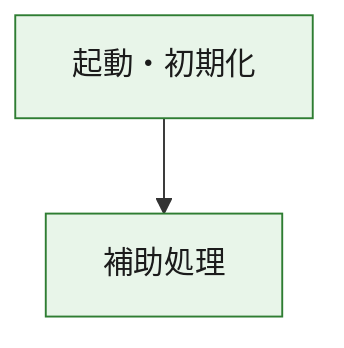
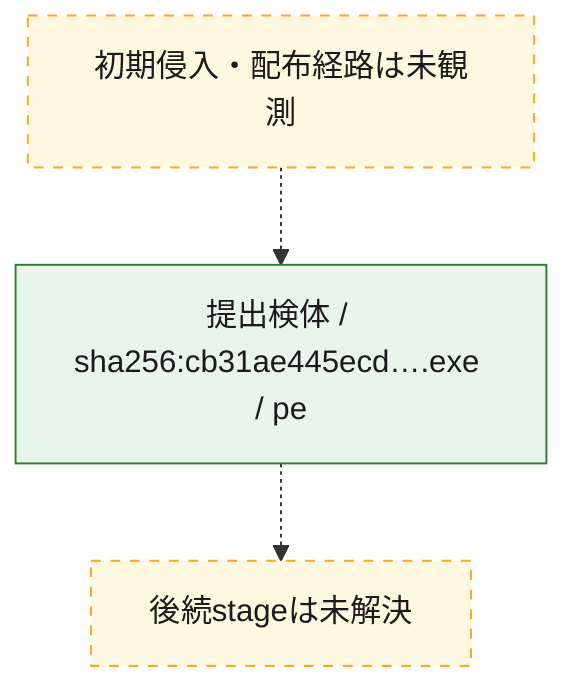
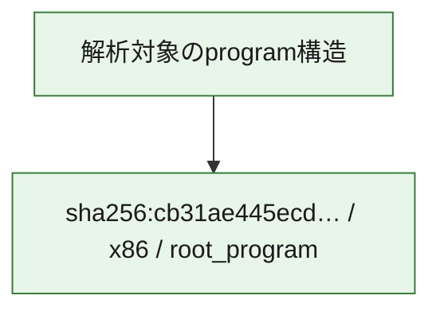

# 全体ロジック：cb31ae445ecde4b61ad3a460c92a1d3b24e1ba41291193b7e766a756b20c92e5

代表関数の静的証跡から、起動・初期化の処理群を確認しました。

## 読み方

- phaseの掲載順は解析上の整理順です。observed_call_edgesがない段階間の実行順を断定しません。
- 図の実線は静的に観測した関係、点線と黄色のノードは未観測・未解決の関係を示します。
- 図は静的な要約であり、動的実行を再現するものではありません。
- 詳細な関数解説とfingerprintは[STATIC-LOGIC.md](STATIC-LOGIC.md)を参照してください。

## 静的可視化

### 実行フロー

### 感染チェーン

### モジュール関係

## 処理段階

### 1. 起動・初期化

entry pointから初期化と後続処理への移行を確認します。
確度: `confirmed_static_function_evidence`

- `cb31ae445ecde4b61ad3a460c92a1d3b24e1ba41291193b7e766a756b20c92e5:ghidra:180001010` — 初期化と主要処理への分岐を行う入口関数です。 状態: `succeeded`、選定理由: `entry_point`, `meaningful_symbol_name`, `reviewed_call_centrality:22`, `role:entrypoint`, `small_program_complete_context`

### 2. 補助処理

主要処理を支える一般内部関数またはlibrary処理を確認します。
確度: `confirmed_static_function_evidence`

- `cb31ae445ecde4b61ad3a460c92a1d3b24e1ba41291193b7e766a756b20c92e5:ghidra:180001240` — 検体内部の一般処理を実装する関数です。 状態: `succeeded`、選定理由: `context_representative`, `reviewed_call_centrality:2`, `small_program_complete_context`
- `cb31ae445ecde4b61ad3a460c92a1d3b24e1ba41291193b7e766a756b20c92e5:ghidra:180001350` — 検体内部の一般処理を実装する関数です。 状態: `succeeded`、選定理由: `context_representative`, `reviewed_call_centrality:25`, `small_program_complete_context`
- `cb31ae445ecde4b61ad3a460c92a1d3b24e1ba41291193b7e766a756b20c92e5:ghidra:180003780` — 検体内部の一般処理を実装する関数です。 状態: `succeeded`、選定理由: `context_representative`, `reviewed_call_centrality:2`, `small_program_complete_context`
- `cb31ae445ecde4b61ad3a460c92a1d3b24e1ba41291193b7e766a756b20c92e5:ghidra:1800038e0` — 検体内部の一般処理を実装する関数です。 状態: `succeeded`、選定理由: `context_representative`, `reviewed_call_centrality:2`, `small_program_complete_context`

## 観測したcall関係

- `cb31ae445ecde4b61ad3a460c92a1d3b24e1ba41291193b7e766a756b20c92e5:ghidra:180001010` → `cb31ae445ecde4b61ad3a460c92a1d3b24e1ba41291193b7e766a756b20c92e5:ghidra:180001240` （`startup` → `support`）
- `cb31ae445ecde4b61ad3a460c92a1d3b24e1ba41291193b7e766a756b20c92e5:ghidra:180001010` → `cb31ae445ecde4b61ad3a460c92a1d3b24e1ba41291193b7e766a756b20c92e5:ghidra:180001350` （`startup` → `support`）
- `cb31ae445ecde4b61ad3a460c92a1d3b24e1ba41291193b7e766a756b20c92e5:ghidra:180001350` → `cb31ae445ecde4b61ad3a460c92a1d3b24e1ba41291193b7e766a756b20c92e5:ghidra:180001240` （`support` → `support`）
- `cb31ae445ecde4b61ad3a460c92a1d3b24e1ba41291193b7e766a756b20c92e5:ghidra:180001350` → `cb31ae445ecde4b61ad3a460c92a1d3b24e1ba41291193b7e766a756b20c92e5:ghidra:180003780` （`support` → `support`）
- `cb31ae445ecde4b61ad3a460c92a1d3b24e1ba41291193b7e766a756b20c92e5:ghidra:180001350` → `cb31ae445ecde4b61ad3a460c92a1d3b24e1ba41291193b7e766a756b20c92e5:ghidra:1800038e0` （`support` → `support`）
- `cb31ae445ecde4b61ad3a460c92a1d3b24e1ba41291193b7e766a756b20c92e5:ghidra:180003780` → `cb31ae445ecde4b61ad3a460c92a1d3b24e1ba41291193b7e766a756b20c92e5:ghidra:1800038e0` （`support` → `support`）
- `ghidra-function:08e52acc985f3ecd1d37f3bb` → `ghidra-function:8e357677ae5f54bc65c5a78c` （`unclassified` → `unclassified`）
- `ghidra-function:c5c580e1d2612e681df03008` → `ghidra-function:23055444cee6f4c253c606c8` （`unclassified` → `unclassified`）
- `ghidra-function:c5c580e1d2612e681df03008` → `ghidra-function:2dd84974d8bd53ae982baae5` （`unclassified` → `unclassified`）
- `ghidra-function:c5c580e1d2612e681df03008` → `ghidra-function:34cc9d0a3c734673b9c7f317` （`unclassified` → `unclassified`）
- `ghidra-function:c5c580e1d2612e681df03008` → `ghidra-function:3e4adc976222d1cb431c8961` （`unclassified` → `unclassified`）
- `ghidra-function:c5c580e1d2612e681df03008` → `ghidra-function:56844a43b205787bb6261bad` （`unclassified` → `unclassified`）
- `ghidra-function:c5c580e1d2612e681df03008` → `ghidra-function:75afb7802931813487249b94` （`unclassified` → `unclassified`）
- `ghidra-function:c5c580e1d2612e681df03008` → `ghidra-function:97495cf14787d993c49b8de2` （`unclassified` → `unclassified`）
- `ghidra-function:c5c580e1d2612e681df03008` → `ghidra-function:b8aafe4a30c2e0567f1f3df2` （`unclassified` → `unclassified`）
- `ghidra-function:c5c580e1d2612e681df03008` → `ghidra-function:ce3a8850a0deb5f86153528c` （`unclassified` → `unclassified`）
- `ghidra-function:c5c580e1d2612e681df03008` → `ghidra-function:dbbc5e909d451d6ab8bb2876` （`unclassified` → `unclassified`）
- `ghidra-function:c5c580e1d2612e681df03008` → `ghidra-function:e22428245441e9960d4433ee` （`unclassified` → `unclassified`）
- `ghidra-function:c5c580e1d2612e681df03008` → `ghidra-function:f9086ce1653593cdf18866d0` （`unclassified` → `unclassified`）
- `ghidra-function:ce3a8850a0deb5f86153528c` → `ghidra-external:020ec06d40d198b045aea7af` （`unclassified` → `unclassified`）
- `ghidra-function:ce3a8850a0deb5f86153528c` → `ghidra-external:18ae3e0f341b449f2e68290f` （`unclassified` → `unclassified`）
- `ghidra-function:ce3a8850a0deb5f86153528c` → `ghidra-external:26c02ceb84561063474d29b7` （`unclassified` → `unclassified`）
- `ghidra-function:ce3a8850a0deb5f86153528c` → `ghidra-external:340edfcfdcd60f06ef37e068` （`unclassified` → `unclassified`）
- `ghidra-function:ce3a8850a0deb5f86153528c` → `ghidra-external:3e6c95fd9899ef9e7e2e2a35` （`unclassified` → `unclassified`）
- `ghidra-function:ce3a8850a0deb5f86153528c` → `ghidra-external:446dac6d79e2dcdabecf7519` （`unclassified` → `unclassified`）
- `ghidra-function:ce3a8850a0deb5f86153528c` → `ghidra-external:50d4a10fcbb12f42ff7f0a57` （`unclassified` → `unclassified`）
- `ghidra-function:ce3a8850a0deb5f86153528c` → `ghidra-external:5924110f2e08fd028ef8aa28` （`unclassified` → `unclassified`）
- `ghidra-function:ce3a8850a0deb5f86153528c` → `ghidra-external:641b02b6ac3a3cb719c0d228` （`unclassified` → `unclassified`）
- `ghidra-function:ce3a8850a0deb5f86153528c` → `ghidra-external:66b0b986115c36f45e9ae297` （`unclassified` → `unclassified`）
- `ghidra-function:ce3a8850a0deb5f86153528c` → `ghidra-external:71d547aee271572656ef37a5` （`unclassified` → `unclassified`）
- `ghidra-function:ce3a8850a0deb5f86153528c` → `ghidra-external:8a581d3142fd95c1fc8c2938` （`unclassified` → `unclassified`）
- `ghidra-function:ce3a8850a0deb5f86153528c` → `ghidra-external:9c002b2e5845fed932049ae9` （`unclassified` → `unclassified`）
- `ghidra-function:ce3a8850a0deb5f86153528c` → `ghidra-external:a561dea5d24b2282785df04e` （`unclassified` → `unclassified`）
- `ghidra-function:ce3a8850a0deb5f86153528c` → `ghidra-external:acc188fc2d595aa0a9139c37` （`unclassified` → `unclassified`）
- `ghidra-function:ce3a8850a0deb5f86153528c` → `ghidra-external:be0cdcb5db208789a812d62a` （`unclassified` → `unclassified`）
- `ghidra-function:ce3a8850a0deb5f86153528c` → `ghidra-external:c788c50242a7ae2be6b8a193` （`unclassified` → `unclassified`）
- `ghidra-function:ce3a8850a0deb5f86153528c` → `ghidra-external:daf12ae66328bf8c1f99ea91` （`unclassified` → `unclassified`）
- `ghidra-function:ce3a8850a0deb5f86153528c` → `ghidra-external:e017a202171787f024b46ad8` （`unclassified` → `unclassified`）
- `ghidra-function:ce3a8850a0deb5f86153528c` → `ghidra-external:f505f01d734085e7a0498948` （`unclassified` → `unclassified`）
- `ghidra-function:ce3a8850a0deb5f86153528c` → `ghidra-external:fade650b44301234d3d65f9e` （`unclassified` → `unclassified`）
- `ghidra-function:ce3a8850a0deb5f86153528c` → `ghidra-function:08e52acc985f3ecd1d37f3bb` （`unclassified` → `unclassified`）
- `ghidra-function:ce3a8850a0deb5f86153528c` → `ghidra-function:3e4adc976222d1cb431c8961` （`unclassified` → `unclassified`）
- `ghidra-function:ce3a8850a0deb5f86153528c` → `ghidra-function:8e357677ae5f54bc65c5a78c` （`unclassified` → `unclassified`）

## 解析範囲と制約

- 選定外関数は全体inventoryへ残しますが、関数本体の個別解説対象にはしていません。
- indirect call、難読化、packer、VM、壊れたcontrol flowによりcall関係が欠落する場合があります。
- 文書は静的解析に基づき、検体実行や外部通信による動的確認は行っていません。
