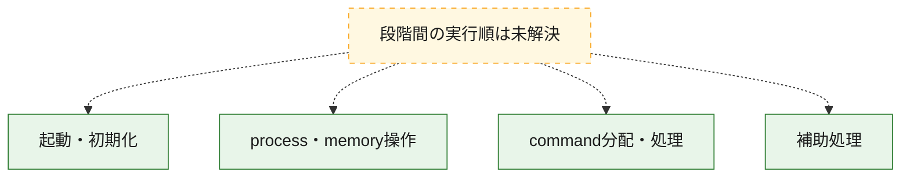
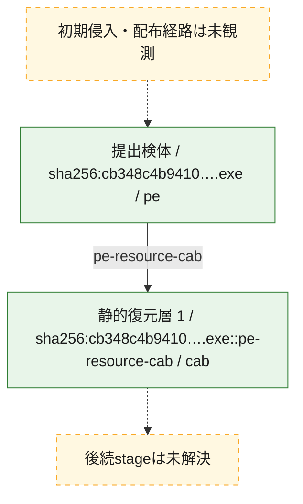
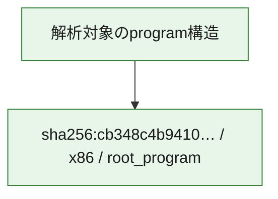

# 全体ロジック：cb348c4b941018399a9e1e3172bf43872849d511927bd42f81008b2a53c344ca

代表関数の静的証跡から、起動・初期化、process・memory操作、command分配・処理の処理群を確認しました。

## 読み方

- phaseの掲載順は解析上の整理順です。observed_call_edgesがない段階間の実行順を断定しません。
- 図の実線は静的に観測した関係、点線と黄色のノードは未観測・未解決の関係を示します。
- 図は静的な要約であり、動的実行を再現するものではありません。
- 詳細な関数解説とfingerprintは[STATIC-LOGIC.md](STATIC-LOGIC.md)を参照してください。

## 静的可視化

### 実行フロー

### 感染チェーン

### モジュール関係

## 処理段階

### 1. 起動・初期化

entry pointから初期化と後続処理への移行を確認します。
確度: `confirmed_static_function_evidence`

- `cb348c4b941018399a9e1e3172bf43872849d511927bd42f81008b2a53c344ca:ghidra:14000a770` — 初期化と主要処理への分岐を行う入口関数です。 状態: `succeeded`、選定理由: `entry_point`, `meaningful_symbol_name`, `reviewed_call_centrality:4`, `role:entrypoint`

### 2. process・memory操作

process、thread、module、memory操作と実行移行を確認します。
確度: `confirmed_static_function_evidence_with_limits`

- `cb348c4b941018399a9e1e3172bf43872849d511927bd42f81008b2a53c344ca:ghidra:140003ca0` — process、thread、module、またはmemory操作に関係する関数です。 状態: `limited_bad_instruction_or_flow`、選定理由: `context_representative`, `reviewed_call_centrality:3`, `role:process_or_memory_operation`

### 3. command分配・処理

受信commandやtaskの解釈、分配、個別handlerへの移行を確認します。
確度: `confirmed_static_function_evidence_with_limits`

- `cb348c4b941018399a9e1e3172bf43872849d511927bd42f81008b2a53c344ca:ghidra:14002f0e0` — commandの解釈、分配、または個別処理を担当する関数です。 状態: `limited_bad_instruction_or_flow`、選定理由: `meaningful_symbol_name`, `role:command_dispatch_or_handler`

### 4. 補助処理

主要処理を支える一般内部関数またはlibrary処理を確認します。
確度: `confirmed_static_function_evidence_with_limits`

- `cb348c4b941018399a9e1e3172bf43872849d511927bd42f81008b2a53c344ca:ghidra:140001e60` — 検体内部の一般処理を実装する関数です。 状態: `succeeded`、選定理由: `context_representative`, `reviewed_call_centrality:4`
- `cb348c4b941018399a9e1e3172bf43872849d511927bd42f81008b2a53c344ca:ghidra:140001ee0` — 検体内部の一般処理を実装する関数です。 状態: `succeeded`、選定理由: `context_representative`, `reviewed_call_centrality:5`
- `cb348c4b941018399a9e1e3172bf43872849d511927bd42f81008b2a53c344ca:ghidra:140001ef0` — 検体内部の一般処理を実装する関数です。 状態: `succeeded`、選定理由: `context_representative`, `reviewed_call_centrality:4`
- `cb348c4b941018399a9e1e3172bf43872849d511927bd42f81008b2a53c344ca:ghidra:140001f00` — 検体内部の一般処理を実装する関数です。 状態: `succeeded`、選定理由: `context_representative`, `reviewed_call_centrality:5`
- `cb348c4b941018399a9e1e3172bf43872849d511927bd42f81008b2a53c344ca:ghidra:140001f20` — 検体内部の一般処理を実装する関数です。 状態: `succeeded`、選定理由: `context_representative`, `reviewed_call_centrality:3`
- `cb348c4b941018399a9e1e3172bf43872849d511927bd42f81008b2a53c344ca:ghidra:140001f50` — 検体内部の一般処理を実装する関数です。 状態: `succeeded`、選定理由: `context_representative`, `reviewed_call_centrality:2`
- `cb348c4b941018399a9e1e3172bf43872849d511927bd42f81008b2a53c344ca:ghidra:140001f60` — 検体内部の一般処理を実装する関数です。 状態: `succeeded`、選定理由: `context_representative`, `reviewed_call_centrality:2`
- `cb348c4b941018399a9e1e3172bf43872849d511927bd42f81008b2a53c344ca:ghidra:140001f80` — 検体内部の一般処理を実装する関数です。 状態: `limited_bad_instruction_or_flow`、選定理由: `context_representative`, `reviewed_call_centrality:3`
- `cb348c4b941018399a9e1e3172bf43872849d511927bd42f81008b2a53c344ca:ghidra:140002a60` — 検体内部の一般処理を実装する関数です。 状態: `limited_bad_instruction_or_flow`、選定理由: `context_representative`, `reviewed_call_centrality:2`
- `cb348c4b941018399a9e1e3172bf43872849d511927bd42f81008b2a53c344ca:ghidra:140002ee0` — 検体内部の一般処理を実装する関数です。 状態: `limited_bad_instruction_or_flow`、選定理由: `context_representative`, `reviewed_call_centrality:5`
- `cb348c4b941018399a9e1e3172bf43872849d511927bd42f81008b2a53c344ca:ghidra:140002f20` — 検体内部の一般処理を実装する関数です。 状態: `limited_bad_instruction_or_flow`、選定理由: `context_representative`, `reviewed_call_centrality:5`
- `cb348c4b941018399a9e1e3172bf43872849d511927bd42f81008b2a53c344ca:ghidra:1400030a0` — 検体内部の一般処理を実装する関数です。 状態: `limited_bad_instruction_or_flow`、選定理由: `context_representative`, `reviewed_call_centrality:2`
- `cb348c4b941018399a9e1e3172bf43872849d511927bd42f81008b2a53c344ca:ghidra:140003710` — 検体内部の一般処理を実装する関数です。 状態: `succeeded`、選定理由: `context_representative`, `reviewed_call_centrality:8`
- `cb348c4b941018399a9e1e3172bf43872849d511927bd42f81008b2a53c344ca:ghidra:140003780` — 検体内部の一般処理を実装する関数です。 状態: `succeeded`、選定理由: `context_representative`, `reviewed_call_centrality:8`
- `cb348c4b941018399a9e1e3172bf43872849d511927bd42f81008b2a53c344ca:ghidra:140003c70` — 検体内部の一般処理を実装する関数です。 状態: `succeeded`、選定理由: `context_representative`
- `cb348c4b941018399a9e1e3172bf43872849d511927bd42f81008b2a53c344ca:ghidra:140004000` — 検体内部の一般処理を実装する関数です。 状態: `succeeded`、選定理由: `context_representative`, `reviewed_call_centrality:9`
- `cb348c4b941018399a9e1e3172bf43872849d511927bd42f81008b2a53c344ca:ghidra:140004098` — 検体内部の一般処理を実装する関数です。 状態: `succeeded`、選定理由: `context_representative`, `reviewed_call_centrality:3`
- `cb348c4b941018399a9e1e3172bf43872849d511927bd42f81008b2a53c344ca:ghidra:140004238` — 検体内部の一般処理を実装する関数です。 状態: `succeeded`、選定理由: `context_representative`, `reviewed_call_centrality:3`
- `cb348c4b941018399a9e1e3172bf43872849d511927bd42f81008b2a53c344ca:ghidra:1400043f0` — 検体内部の一般処理を実装する関数です。 状態: `succeeded`、選定理由: `context_representative`, `reviewed_call_centrality:3`
- `cb348c4b941018399a9e1e3172bf43872849d511927bd42f81008b2a53c344ca:ghidra:1400044f0` — 検体内部の一般処理を実装する関数です。 状態: `succeeded`、選定理由: `context_representative`, `reviewed_call_centrality:2`
- `cb348c4b941018399a9e1e3172bf43872849d511927bd42f81008b2a53c344ca:ghidra:140004574` — 検体内部の一般処理を実装する関数です。 状態: `succeeded`、選定理由: `context_representative`, `reviewed_call_centrality:3`
- `cb348c4b941018399a9e1e3172bf43872849d511927bd42f81008b2a53c344ca:ghidra:140004824` — 検体内部の一般処理を実装する関数です。 状態: `succeeded`、選定理由: `context_representative`, `reviewed_call_centrality:3`
- `cb348c4b941018399a9e1e3172bf43872849d511927bd42f81008b2a53c344ca:ghidra:140004b0c` — 検体内部の一般処理を実装する関数です。 状態: `succeeded`、選定理由: `context_representative`, `reviewed_call_centrality:3`
- `cb348c4b941018399a9e1e3172bf43872849d511927bd42f81008b2a53c344ca:ghidra:140004da0` — 検体内部の一般処理を実装する関数です。 状態: `succeeded`、選定理由: `context_representative`, `reviewed_call_centrality:5`
- `cb348c4b941018399a9e1e3172bf43872849d511927bd42f81008b2a53c344ca:ghidra:140004e60` — 検体内部の一般処理を実装する関数です。 状態: `succeeded`、選定理由: `context_representative`, `reviewed_call_centrality:1`
- `cb348c4b941018399a9e1e3172bf43872849d511927bd42f81008b2a53c344ca:ghidra:140004f20` — 検体内部の一般処理を実装する関数です。 状態: `succeeded`、選定理由: `context_representative`, `reviewed_call_centrality:1`
- `cb348c4b941018399a9e1e3172bf43872849d511927bd42f81008b2a53c344ca:ghidra:140004f60` — 検体内部の一般処理を実装する関数です。 状態: `succeeded`、選定理由: `context_representative`, `reviewed_call_centrality:2`
- `cb348c4b941018399a9e1e3172bf43872849d511927bd42f81008b2a53c344ca:ghidra:140004f80` — 検体内部の一般処理を実装する関数です。 状態: `succeeded`、選定理由: `context_representative`, `reviewed_call_centrality:2`
- `cb348c4b941018399a9e1e3172bf43872849d511927bd42f81008b2a53c344ca:ghidra:14002b230` — 検体内部の一般処理を実装する関数です。 状態: `succeeded`、選定理由: `meaningful_symbol_name`

## 観測したcall関係

- `cb348c4b941018399a9e1e3172bf43872849d511927bd42f81008b2a53c344ca:ghidra:140004098` → `cb348c4b941018399a9e1e3172bf43872849d511927bd42f81008b2a53c344ca:ghidra:140004000` （`support` → `support`）
- `cb348c4b941018399a9e1e3172bf43872849d511927bd42f81008b2a53c344ca:ghidra:140004238` → `cb348c4b941018399a9e1e3172bf43872849d511927bd42f81008b2a53c344ca:ghidra:140004000` （`support` → `support`）
- `cb348c4b941018399a9e1e3172bf43872849d511927bd42f81008b2a53c344ca:ghidra:1400043f0` → `cb348c4b941018399a9e1e3172bf43872849d511927bd42f81008b2a53c344ca:ghidra:140004000` （`support` → `support`）
- `cb348c4b941018399a9e1e3172bf43872849d511927bd42f81008b2a53c344ca:ghidra:1400044f0` → `cb348c4b941018399a9e1e3172bf43872849d511927bd42f81008b2a53c344ca:ghidra:140004000` （`support` → `support`）
- `cb348c4b941018399a9e1e3172bf43872849d511927bd42f81008b2a53c344ca:ghidra:140004574` → `cb348c4b941018399a9e1e3172bf43872849d511927bd42f81008b2a53c344ca:ghidra:140004000` （`support` → `support`）
- `cb348c4b941018399a9e1e3172bf43872849d511927bd42f81008b2a53c344ca:ghidra:140004824` → `cb348c4b941018399a9e1e3172bf43872849d511927bd42f81008b2a53c344ca:ghidra:140004000` （`support` → `support`）
- `cb348c4b941018399a9e1e3172bf43872849d511927bd42f81008b2a53c344ca:ghidra:140004b0c` → `cb348c4b941018399a9e1e3172bf43872849d511927bd42f81008b2a53c344ca:ghidra:140004000` （`support` → `support`）
- `ghidra-function:0040bc9fceea1079c41a5626` → `ghidra-function:3a84c126a77359bc0f443bd8` （`unclassified` → `unclassified`）
- `ghidra-function:0040bc9fceea1079c41a5626` → `ghidra-function:6fae6676bbae2ee469a4e1f0` （`unclassified` → `unclassified`）
- `ghidra-function:0040bc9fceea1079c41a5626` → `ghidra-function:daed4bcf7fabb432b61cd88a` （`unclassified` → `unclassified`）
- `ghidra-function:06bb906717accd0b2fd7239d` → `ghidra-external:34f7997cb1685e61dc99acd4` （`unclassified` → `unclassified`）
- `ghidra-function:06bb906717accd0b2fd7239d` → `ghidra-external:5be8325efee901f09418f53d` （`unclassified` → `unclassified`）
- `ghidra-function:0db13000eead145fb9068206` → `ghidra-external:34f7997cb1685e61dc99acd4` （`unclassified` → `unclassified`）
- `ghidra-function:0db13000eead145fb9068206` → `ghidra-function:1f0abcdecd19993f2510ad79` （`unclassified` → `unclassified`）
- `ghidra-function:0db13000eead145fb9068206` → `ghidra-function:7825df6ad6572b361ec64645` （`unclassified` → `unclassified`）
- `ghidra-function:0db13000eead145fb9068206` → `ghidra-function:daed4bcf7fabb432b61cd88a` （`unclassified` → `unclassified`）
- `ghidra-function:0e9f9a98f29a43695ad58473` → `ghidra-external:2ad818f0567226cc12999588` （`unclassified` → `unclassified`）
- `ghidra-function:0e9f9a98f29a43695ad58473` → `ghidra-external:34f7997cb1685e61dc99acd4` （`unclassified` → `unclassified`）
- `ghidra-function:0e9f9a98f29a43695ad58473` → `ghidra-external:5be8325efee901f09418f53d` （`unclassified` → `unclassified`）
- `ghidra-function:2a4af81f9f09837cfbcd8a38` → `ghidra-external:34f7997cb1685e61dc99acd4` （`unclassified` → `unclassified`）
- `ghidra-function:2a4af81f9f09837cfbcd8a38` → `ghidra-external:5be8325efee901f09418f53d` （`unclassified` → `unclassified`）
- `ghidra-function:2b458af11405561371105c42` → `ghidra-external:5be8325efee901f09418f53d` （`unclassified` → `unclassified`）
- `ghidra-function:2b458af11405561371105c42` → `ghidra-external:9972f7d7d850443b27bd81a4` （`unclassified` → `unclassified`）
- `ghidra-function:33eef1518a3abac4c5b2f934` → `ghidra-external:2ad818f0567226cc12999588` （`unclassified` → `unclassified`）
- `ghidra-function:33eef1518a3abac4c5b2f934` → `ghidra-external:34f7997cb1685e61dc99acd4` （`unclassified` → `unclassified`）
- `ghidra-function:33eef1518a3abac4c5b2f934` → `ghidra-external:69d3b4cfd7cca5e65a2862a6` （`unclassified` → `unclassified`）
- `ghidra-function:33eef1518a3abac4c5b2f934` → `ghidra-external:6ee7bff219d4fd9a096cec57` （`unclassified` → `unclassified`）
- `ghidra-function:3a84c126a77359bc0f443bd8` → `ghidra-function:7fd76fcd7eb0f32eed977086` （`unclassified` → `unclassified`）
- `ghidra-function:3aa560eda259c4111a75ba38` → `ghidra-external:11c72a11085dfc90ef7ee581` （`unclassified` → `unclassified`）
- `ghidra-function:3aa560eda259c4111a75ba38` → `ghidra-external:2ad818f0567226cc12999588` （`unclassified` → `unclassified`）
- `ghidra-function:3aa560eda259c4111a75ba38` → `ghidra-external:401ae0d9a5adfe3de44e0b95` （`unclassified` → `unclassified`）
- `ghidra-function:3aa560eda259c4111a75ba38` → `ghidra-external:4dcad54dfd08aa85e135038d` （`unclassified` → `unclassified`）
- `ghidra-function:3aa560eda259c4111a75ba38` → `ghidra-external:54c504b7e00510eefb0e8698` （`unclassified` → `unclassified`）
- `ghidra-function:3aa560eda259c4111a75ba38` → `ghidra-external:5be8325efee901f09418f53d` （`unclassified` → `unclassified`）
- `ghidra-function:3aa560eda259c4111a75ba38` → `ghidra-external:69e3b0f0d1ad1c2083be529f` （`unclassified` → `unclassified`）
- `ghidra-function:3aa560eda259c4111a75ba38` → `ghidra-external:709da6dc4bab29111ceca264` （`unclassified` → `unclassified`）
- `ghidra-function:475ce8b2af6b460e05d08a5b` → `ghidra-function:3a84c126a77359bc0f443bd8` （`unclassified` → `unclassified`）
- `ghidra-function:475ce8b2af6b460e05d08a5b` → `ghidra-function:6fae6676bbae2ee469a4e1f0` （`unclassified` → `unclassified`）
- `ghidra-function:475ce8b2af6b460e05d08a5b` → `ghidra-function:daed4bcf7fabb432b61cd88a` （`unclassified` → `unclassified`）
- `ghidra-function:4c2c5dce2d9fe82e846b4f57` → `ghidra-function:3a84c126a77359bc0f443bd8` （`unclassified` → `unclassified`）
- `ghidra-function:4c2c5dce2d9fe82e846b4f57` → `ghidra-function:6fae6676bbae2ee469a4e1f0` （`unclassified` → `unclassified`）
- `ghidra-function:4c2c5dce2d9fe82e846b4f57` → `ghidra-function:daed4bcf7fabb432b61cd88a` （`unclassified` → `unclassified`）
- `ghidra-function:4d2d6559e2e0bc666b5df1c9` → `ghidra-function:3a84c126a77359bc0f443bd8` （`unclassified` → `unclassified`）
- `ghidra-function:4d2d6559e2e0bc666b5df1c9` → `ghidra-function:6fae6676bbae2ee469a4e1f0` （`unclassified` → `unclassified`）
- `ghidra-function:4d2d6559e2e0bc666b5df1c9` → `ghidra-function:daed4bcf7fabb432b61cd88a` （`unclassified` → `unclassified`）
- `ghidra-function:60ab8c92a4bca9bf1e4f03c4` → `ghidra-function:7825df6ad6572b361ec64645` （`unclassified` → `unclassified`）
- `ghidra-function:658c78d0abb23f33d13b3e03` → `ghidra-external:2ad818f0567226cc12999588` （`unclassified` → `unclassified`）
- `ghidra-function:658c78d0abb23f33d13b3e03` → `ghidra-external:34f7997cb1685e61dc99acd4` （`unclassified` → `unclassified`）
- `ghidra-function:658c78d0abb23f33d13b3e03` → `ghidra-external:69d3b4cfd7cca5e65a2862a6` （`unclassified` → `unclassified`）
- `ghidra-function:658c78d0abb23f33d13b3e03` → `ghidra-external:6ee7bff219d4fd9a096cec57` （`unclassified` → `unclassified`）
- `ghidra-function:6a9c093bab6e373a5f546002` → `ghidra-external:2ad818f0567226cc12999588` （`unclassified` → `unclassified`）
- `ghidra-function:6a9c093bab6e373a5f546002` → `ghidra-external:69d3b4cfd7cca5e65a2862a6` （`unclassified` → `unclassified`）
- `ghidra-function:6a9c093bab6e373a5f546002` → `ghidra-external:69e3b0f0d1ad1c2083be529f` （`unclassified` → `unclassified`）
- `ghidra-function:6a9c093bab6e373a5f546002` → `ghidra-external:9972f7d7d850443b27bd81a4` （`unclassified` → `unclassified`）
- `ghidra-function:6a9c093bab6e373a5f546002` → `ghidra-external:baaf00834c3cdf3fd7c59b5e` （`unclassified` → `unclassified`）
- `ghidra-function:8bab0f3e4ae88020332cffc0` → `ghidra-function:a44098e819ca618b0fccfe1e` （`unclassified` → `unclassified`）
- `ghidra-function:9e9cab2cbc619c1a8fcb8549` → `ghidra-external:2ad818f0567226cc12999588` （`unclassified` → `unclassified`）
- `ghidra-function:9e9cab2cbc619c1a8fcb8549` → `ghidra-external:34f7997cb1685e61dc99acd4` （`unclassified` → `unclassified`）
- `ghidra-function:9e9cab2cbc619c1a8fcb8549` → `ghidra-external:5be8325efee901f09418f53d` （`unclassified` → `unclassified`）
- `ghidra-function:9e9cab2cbc619c1a8fcb8549` → `ghidra-external:69d3b4cfd7cca5e65a2862a6` （`unclassified` → `unclassified`）
- `ghidra-function:9e9cab2cbc619c1a8fcb8549` → `ghidra-external:6ee7bff219d4fd9a096cec57` （`unclassified` → `unclassified`）
- `ghidra-function:9ef0c9ce9b6a5a41d61c6a11` → `ghidra-external:2ad818f0567226cc12999588` （`unclassified` → `unclassified`）
- `ghidra-function:9ef0c9ce9b6a5a41d61c6a11` → `ghidra-external:34f7997cb1685e61dc99acd4` （`unclassified` → `unclassified`）
- `ghidra-function:9ef0c9ce9b6a5a41d61c6a11` → `ghidra-external:5be8325efee901f09418f53d` （`unclassified` → `unclassified`）
- `ghidra-function:9ef0c9ce9b6a5a41d61c6a11` → `ghidra-external:69d3b4cfd7cca5e65a2862a6` （`unclassified` → `unclassified`）
- `ghidra-function:9ef0c9ce9b6a5a41d61c6a11` → `ghidra-external:6ee7bff219d4fd9a096cec57` （`unclassified` → `unclassified`）
- `ghidra-function:abe826b51c1113068bc44497` → `ghidra-function:3a84c126a77359bc0f443bd8` （`unclassified` → `unclassified`）
- `ghidra-function:abe826b51c1113068bc44497` → `ghidra-function:6fae6676bbae2ee469a4e1f0` （`unclassified` → `unclassified`）
- `ghidra-function:abe826b51c1113068bc44497` → `ghidra-function:daed4bcf7fabb432b61cd88a` （`unclassified` → `unclassified`）
- `ghidra-function:b5c135aa90461b6da3bbc95d` → `ghidra-external:11c72a11085dfc90ef7ee581` （`unclassified` → `unclassified`）
- `ghidra-function:b5c135aa90461b6da3bbc95d` → `ghidra-external:2ad818f0567226cc12999588` （`unclassified` → `unclassified`）
- `ghidra-function:b5c135aa90461b6da3bbc95d` → `ghidra-external:401ae0d9a5adfe3de44e0b95` （`unclassified` → `unclassified`）
- `ghidra-function:b5c135aa90461b6da3bbc95d` → `ghidra-external:4dcad54dfd08aa85e135038d` （`unclassified` → `unclassified`）
- `ghidra-function:b5c135aa90461b6da3bbc95d` → `ghidra-external:54c504b7e00510eefb0e8698` （`unclassified` → `unclassified`）
- `ghidra-function:b5c135aa90461b6da3bbc95d` → `ghidra-external:5be8325efee901f09418f53d` （`unclassified` → `unclassified`）
- `ghidra-function:b5c135aa90461b6da3bbc95d` → `ghidra-external:69e3b0f0d1ad1c2083be529f` （`unclassified` → `unclassified`）
- `ghidra-function:b5c135aa90461b6da3bbc95d` → `ghidra-external:709da6dc4bab29111ceca264` （`unclassified` → `unclassified`）
- `ghidra-function:bf21774f9e2d5cd2763cdb68` → `ghidra-external:5663a08679b5dccf82ab3009` （`unclassified` → `unclassified`）
- `ghidra-function:bf21774f9e2d5cd2763cdb68` → `ghidra-external:f0582052b4e76231630dfbb6` （`unclassified` → `unclassified`）
- `ghidra-function:c2bdc819112239ee804a43c4` → `ghidra-external:5be8325efee901f09418f53d` （`unclassified` → `unclassified`）
- `ghidra-function:c2bdc819112239ee804a43c4` → `ghidra-function:72d1974c2752675b09636488` （`unclassified` → `unclassified`）
- `ghidra-function:cb3d24837dc3bfeb93e89ef4` → `ghidra-function:3a84c126a77359bc0f443bd8` （`unclassified` → `unclassified`）
- `ghidra-function:cb3d24837dc3bfeb93e89ef4` → `ghidra-function:6fae6676bbae2ee469a4e1f0` （`unclassified` → `unclassified`）
- `ghidra-function:cb3d24837dc3bfeb93e89ef4` → `ghidra-function:daed4bcf7fabb432b61cd88a` （`unclassified` → `unclassified`）
- `ghidra-function:dfadd023a900a57bf3fd4273` → `ghidra-function:3a84c126a77359bc0f443bd8` （`unclassified` → `unclassified`）
- `ghidra-function:dfadd023a900a57bf3fd4273` → `ghidra-function:daed4bcf7fabb432b61cd88a` （`unclassified` → `unclassified`）
- `ghidra-function:e19127103273246f3b098728` → `ghidra-external:69d3b4cfd7cca5e65a2862a6` （`unclassified` → `unclassified`）
- `ghidra-function:e19127103273246f3b098728` → `ghidra-external:9972f7d7d850443b27bd81a4` （`unclassified` → `unclassified`）
- `ghidra-function:e5fda47020e10c87efbee9b6` → `ghidra-external:18c69b2c2def0a9af2d684be` （`unclassified` → `unclassified`）
- `ghidra-function:e5fda47020e10c87efbee9b6` → `ghidra-external:31560b6f81d78afa18d6d36e` （`unclassified` → `unclassified`）
- `ghidra-function:e5fda47020e10c87efbee9b6` → `ghidra-external:5461ce0ec4daca2e8108bd03` （`unclassified` → `unclassified`）
- `ghidra-function:e5fda47020e10c87efbee9b6` → `ghidra-function:aa6feecb46e09b0ad55a6350` （`unclassified` → `unclassified`）
- `ghidra-function:f50c217d6c940c427a5ebdd7` → `ghidra-external:5663a08679b5dccf82ab3009` （`unclassified` → `unclassified`）
- `ghidra-function:f50c217d6c940c427a5ebdd7` → `ghidra-external:f0582052b4e76231630dfbb6` （`unclassified` → `unclassified`）
- `ghidra-function:f8f19bbc3a8bb6af9ceb71de` → `ghidra-external:2ad818f0567226cc12999588` （`unclassified` → `unclassified`）
- `ghidra-function:f8f19bbc3a8bb6af9ceb71de` → `ghidra-external:69d3b4cfd7cca5e65a2862a6` （`unclassified` → `unclassified`）
- `ghidra-function:f8f19bbc3a8bb6af9ceb71de` → `ghidra-external:99690811edbee89fd8888e3e` （`unclassified` → `unclassified`）
- `ghidra-function:f8f19bbc3a8bb6af9ceb71de` → `ghidra-external:9972f7d7d850443b27bd81a4` （`unclassified` → `unclassified`）
- `ghidra-function:f8f19bbc3a8bb6af9ceb71de` → `ghidra-external:baaf00834c3cdf3fd7c59b5e` （`unclassified` → `unclassified`）
- `ghidra-function:fe57d94d728fba15e1d0cdd0` → `ghidra-external:2ad818f0567226cc12999588` （`unclassified` → `unclassified`）
- `ghidra-function:fe57d94d728fba15e1d0cdd0` → `ghidra-external:69d3b4cfd7cca5e65a2862a6` （`unclassified` → `unclassified`）
- `ghidra-function:fe57d94d728fba15e1d0cdd0` → `ghidra-external:9972f7d7d850443b27bd81a4` （`unclassified` → `unclassified`）

## 解析範囲と制約

- 選定外関数は全体inventoryへ残しますが、関数本体の個別解説対象にはしていません。
- indirect call、難読化、packer、VM、壊れたcontrol flowによりcall関係が欠落する場合があります。
- 文書は静的解析に基づき、検体実行や外部通信による動的確認は行っていません。
