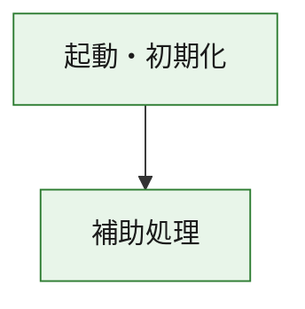
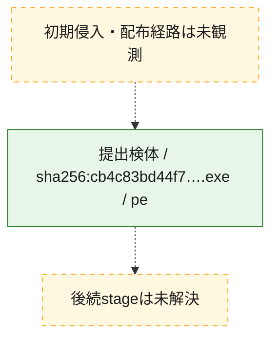
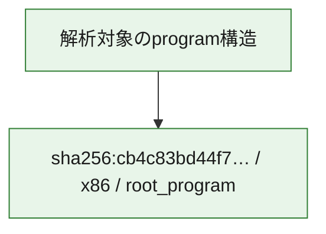

# 全体ロジック：cb4c83bd44f797058370a385794dc8084fae10a69d765bc247058d68771b8547

代表関数の静的証跡から、起動・初期化の処理群を確認しました。

## 読み方

- phaseの掲載順は解析上の整理順です。observed_call_edgesがない段階間の実行順を断定しません。
- 図の実線は静的に観測した関係、点線と黄色のノードは未観測・未解決の関係を示します。
- 図は静的な要約であり、動的実行を再現するものではありません。
- 詳細な関数解説とfingerprintは[STATIC-LOGIC.md](STATIC-LOGIC.md)を参照してください。

## 静的可視化

### 実行フロー

### 感染チェーン

### モジュール関係

## 処理段階

### 1. 起動・初期化

entry pointから初期化と後続処理への移行を確認します。
確度: `confirmed_static_function_evidence`

- `cb4c83bd44f797058370a385794dc8084fae10a69d765bc247058d68771b8547:ghidra:2b78611f0` — 初期化と主要処理への分岐を行う入口関数です。 状態: `succeeded`、選定理由: `entry_point`, `meaningful_symbol_name`, `reviewed_call_centrality:2`, `role:entrypoint`

### 2. 補助処理

主要処理を支える一般内部関数またはlibrary処理を確認します。
確度: `confirmed_static_function_evidence_with_limits`

- `cb4c83bd44f797058370a385794dc8084fae10a69d765bc247058d68771b8547:ghidra:2b7861000` — 検体内部の一般処理を実装する関数です。 状態: `succeeded`、選定理由: `context_representative`, `reviewed_call_centrality:14`
- `cb4c83bd44f797058370a385794dc8084fae10a69d765bc247058d68771b8547:ghidra:2b7861330` — 検体内部の一般処理を実装する関数です。 状態: `limited_bad_instruction_or_flow`、選定理由: `context_representative`, `reviewed_call_centrality:2`
- `cb4c83bd44f797058370a385794dc8084fae10a69d765bc247058d68771b8547:ghidra:2b7861340` — 検体内部の一般処理を実装する関数です。 状態: `limited_bad_instruction_or_flow`、選定理由: `context_representative`, `reviewed_call_centrality:2`
- `cb4c83bd44f797058370a385794dc8084fae10a69d765bc247058d68771b8547:ghidra:2b7861350` — 検体内部の一般処理を実装する関数です。 状態: `succeeded`、選定理由: `context_representative`
- `cb4c83bd44f797058370a385794dc8084fae10a69d765bc247058d68771b8547:ghidra:2b7882e80` — 検体内部の一般処理を実装する関数です。 状態: `succeeded`、選定理由: `context_representative`, `reviewed_call_centrality:4`
- `cb4c83bd44f797058370a385794dc8084fae10a69d765bc247058d68771b8547:ghidra:2b7882f80` — 検体内部の一般処理を実装する関数です。 状態: `succeeded`、選定理由: `context_representative`, `reviewed_call_centrality:4`
- `cb4c83bd44f797058370a385794dc8084fae10a69d765bc247058d68771b8547:ghidra:2b7882fe0` — 検体内部の一般処理を実装する関数です。 状態: `succeeded`、選定理由: `context_representative`, `reviewed_call_centrality:7`
- `cb4c83bd44f797058370a385794dc8084fae10a69d765bc247058d68771b8547:ghidra:2b78830c0` — 検体内部の一般処理を実装する関数です。 状態: `succeeded`、選定理由: `context_representative`, `reviewed_call_centrality:1`
- `cb4c83bd44f797058370a385794dc8084fae10a69d765bc247058d68771b8547:ghidra:2b7883140` — 検体内部の一般処理を実装する関数です。 状態: `succeeded`、選定理由: `context_representative`, `reviewed_call_centrality:1`
- `cb4c83bd44f797058370a385794dc8084fae10a69d765bc247058d68771b8547:ghidra:2b78831a0` — 検体内部の一般処理を実装する関数です。 状態: `succeeded`、選定理由: `context_representative`, `reviewed_call_centrality:2`
- `cb4c83bd44f797058370a385794dc8084fae10a69d765bc247058d68771b8547:ghidra:2b7883210` — 検体内部の一般処理を実装する関数です。 状態: `succeeded`、選定理由: `context_representative`
- `cb4c83bd44f797058370a385794dc8084fae10a69d765bc247058d68771b8547:ghidra:2b7883370` — 検体内部の一般処理を実装する関数です。 状態: `succeeded`、選定理由: `context_representative`
- `cb4c83bd44f797058370a385794dc8084fae10a69d765bc247058d68771b8547:ghidra:2b78833a0` — 検体内部の一般処理を実装する関数です。 状態: `succeeded`、選定理由: `context_representative`
- `cb4c83bd44f797058370a385794dc8084fae10a69d765bc247058d68771b8547:ghidra:2b78833e0` — 検体内部の一般処理を実装する関数です。 状態: `succeeded`、選定理由: `context_representative`, `reviewed_call_centrality:4`
- `cb4c83bd44f797058370a385794dc8084fae10a69d765bc247058d68771b8547:ghidra:2b78834c0` — 検体内部の一般処理を実装する関数です。 状態: `succeeded`、選定理由: `context_representative`, `reviewed_call_centrality:1`
- `cb4c83bd44f797058370a385794dc8084fae10a69d765bc247058d68771b8547:ghidra:2b7883520` — 検体内部の一般処理を実装する関数です。 状態: `succeeded`、選定理由: `context_representative`
- `cb4c83bd44f797058370a385794dc8084fae10a69d765bc247058d68771b8547:ghidra:2b78835a0` — 検体内部の一般処理を実装する関数です。 状態: `succeeded`、選定理由: `context_representative`
- `cb4c83bd44f797058370a385794dc8084fae10a69d765bc247058d68771b8547:ghidra:2b7883600` — 検体内部の一般処理を実装する関数です。 状態: `succeeded`、選定理由: `context_representative`, `reviewed_call_centrality:1`
- `cb4c83bd44f797058370a385794dc8084fae10a69d765bc247058d68771b8547:ghidra:2b78836d0` — 検体内部の一般処理を実装する関数です。 状態: `succeeded`、選定理由: `context_representative`
- `cb4c83bd44f797058370a385794dc8084fae10a69d765bc247058d68771b8547:ghidra:2b78837d0` — 検体内部の一般処理を実装する関数です。 状態: `succeeded`、選定理由: `context_representative`, `reviewed_call_centrality:2`
- `cb4c83bd44f797058370a385794dc8084fae10a69d765bc247058d68771b8547:ghidra:2b7883860` — 検体内部の一般処理を実装する関数です。 状態: `succeeded`、選定理由: `context_representative`, `reviewed_call_centrality:6`
- `cb4c83bd44f797058370a385794dc8084fae10a69d765bc247058d68771b8547:ghidra:2b78839b0` — 検体内部の一般処理を実装する関数です。 状態: `succeeded`、選定理由: `context_representative`, `reviewed_call_centrality:6`
- `cb4c83bd44f797058370a385794dc8084fae10a69d765bc247058d68771b8547:ghidra:2b7883c20` — 検体内部の一般処理を実装する関数です。 状態: `succeeded`、選定理由: `context_representative`, `reviewed_call_centrality:5`
- `cb4c83bd44f797058370a385794dc8084fae10a69d765bc247058d68771b8547:ghidra:2b7883d30` — 検体内部の一般処理を実装する関数です。 状態: `succeeded`、選定理由: `context_representative`, `reviewed_call_centrality:4`
- `cb4c83bd44f797058370a385794dc8084fae10a69d765bc247058d68771b8547:ghidra:2b7883fb0` — 検体内部の一般処理を実装する関数です。 状態: `succeeded`、選定理由: `context_representative`, `reviewed_call_centrality:2`
- `cb4c83bd44f797058370a385794dc8084fae10a69d765bc247058d68771b8547:ghidra:2b7884050` — 検体内部の一般処理を実装する関数です。 状態: `succeeded`、選定理由: `context_representative`, `reviewed_call_centrality:27`
- `cb4c83bd44f797058370a385794dc8084fae10a69d765bc247058d68771b8547:ghidra:2b7884c00` — 検体内部の一般処理を実装する関数です。 状態: `succeeded`、選定理由: `context_representative`, `reviewed_call_centrality:6`
- `cb4c83bd44f797058370a385794dc8084fae10a69d765bc247058d68771b8547:ghidra:2b7884d20` — 検体内部の一般処理を実装する関数です。 状態: `succeeded`、選定理由: `context_representative`, `reviewed_call_centrality:4`
- `cb4c83bd44f797058370a385794dc8084fae10a69d765bc247058d68771b8547:ghidra:2b7890030` — compiler生成処理または汎用library処理とみられる関数です。 状態: `succeeded`、選定理由: `entry_point`, `meaningful_symbol_name`, `reviewed_call_centrality:7`
- `cb4c83bd44f797058370a385794dc8084fae10a69d765bc247058d68771b8547:ghidra:2b7890050` — compiler生成処理または汎用library処理とみられる関数です。 状態: `succeeded`、選定理由: `entry_point`, `meaningful_symbol_name`, `reviewed_call_centrality:4`
- `cb4c83bd44f797058370a385794dc8084fae10a69d765bc247058d68771b8547:ghidra:2b789eb00` — compiler生成処理または汎用library処理とみられる関数です。 状態: `limited_bad_instruction_or_flow`、選定理由: `entry_point`, `meaningful_symbol_name`, `reviewed_call_centrality:12`

## 観測したcall関係

- `cb4c83bd44f797058370a385794dc8084fae10a69d765bc247058d68771b8547:ghidra:2b7861000` → `cb4c83bd44f797058370a385794dc8084fae10a69d765bc247058d68771b8547:ghidra:2b7890050` （`support` → `support`）
- `cb4c83bd44f797058370a385794dc8084fae10a69d765bc247058d68771b8547:ghidra:2b78611f0` → `cb4c83bd44f797058370a385794dc8084fae10a69d765bc247058d68771b8547:ghidra:2b7861000` （`startup` → `support`）
- `cb4c83bd44f797058370a385794dc8084fae10a69d765bc247058d68771b8547:ghidra:2b78830c0` → `cb4c83bd44f797058370a385794dc8084fae10a69d765bc247058d68771b8547:ghidra:2b7882fe0` （`support` → `support`）
- `cb4c83bd44f797058370a385794dc8084fae10a69d765bc247058d68771b8547:ghidra:2b78831a0` → `cb4c83bd44f797058370a385794dc8084fae10a69d765bc247058d68771b8547:ghidra:2b7882fe0` （`support` → `support`）
- `cb4c83bd44f797058370a385794dc8084fae10a69d765bc247058d68771b8547:ghidra:2b78837d0` → `cb4c83bd44f797058370a385794dc8084fae10a69d765bc247058d68771b8547:ghidra:2b7882fe0` （`support` → `support`）
- `cb4c83bd44f797058370a385794dc8084fae10a69d765bc247058d68771b8547:ghidra:2b7883860` → `cb4c83bd44f797058370a385794dc8084fae10a69d765bc247058d68771b8547:ghidra:2b7882f80` （`support` → `support`）
- `cb4c83bd44f797058370a385794dc8084fae10a69d765bc247058d68771b8547:ghidra:2b7883860` → `cb4c83bd44f797058370a385794dc8084fae10a69d765bc247058d68771b8547:ghidra:2b7882fe0` （`support` → `support`）
- `cb4c83bd44f797058370a385794dc8084fae10a69d765bc247058d68771b8547:ghidra:2b78839b0` → `cb4c83bd44f797058370a385794dc8084fae10a69d765bc247058d68771b8547:ghidra:2b7882f80` （`support` → `support`）
- `cb4c83bd44f797058370a385794dc8084fae10a69d765bc247058d68771b8547:ghidra:2b78839b0` → `cb4c83bd44f797058370a385794dc8084fae10a69d765bc247058d68771b8547:ghidra:2b7882fe0` （`support` → `support`）
- `cb4c83bd44f797058370a385794dc8084fae10a69d765bc247058d68771b8547:ghidra:2b7883c20` → `cb4c83bd44f797058370a385794dc8084fae10a69d765bc247058d68771b8547:ghidra:2b7882f80` （`support` → `support`）
- `cb4c83bd44f797058370a385794dc8084fae10a69d765bc247058d68771b8547:ghidra:2b7883c20` → `cb4c83bd44f797058370a385794dc8084fae10a69d765bc247058d68771b8547:ghidra:2b7882fe0` （`support` → `support`）
- `cb4c83bd44f797058370a385794dc8084fae10a69d765bc247058d68771b8547:ghidra:2b7883d30` → `cb4c83bd44f797058370a385794dc8084fae10a69d765bc247058d68771b8547:ghidra:2b7882e80` （`support` → `support`）
- `cb4c83bd44f797058370a385794dc8084fae10a69d765bc247058d68771b8547:ghidra:2b7883d30` → `cb4c83bd44f797058370a385794dc8084fae10a69d765bc247058d68771b8547:ghidra:2b7883c20` （`support` → `support`）
- `cb4c83bd44f797058370a385794dc8084fae10a69d765bc247058d68771b8547:ghidra:2b7883fb0` → `cb4c83bd44f797058370a385794dc8084fae10a69d765bc247058d68771b8547:ghidra:2b7882e80` （`support` → `support`）
- `cb4c83bd44f797058370a385794dc8084fae10a69d765bc247058d68771b8547:ghidra:2b7883fb0` → `cb4c83bd44f797058370a385794dc8084fae10a69d765bc247058d68771b8547:ghidra:2b7883c20` （`support` → `support`）
- `cb4c83bd44f797058370a385794dc8084fae10a69d765bc247058d68771b8547:ghidra:2b7884050` → `cb4c83bd44f797058370a385794dc8084fae10a69d765bc247058d68771b8547:ghidra:2b7882e80` （`support` → `support`）
- `cb4c83bd44f797058370a385794dc8084fae10a69d765bc247058d68771b8547:ghidra:2b7884050` → `cb4c83bd44f797058370a385794dc8084fae10a69d765bc247058d68771b8547:ghidra:2b7882f80` （`support` → `support`）
- `cb4c83bd44f797058370a385794dc8084fae10a69d765bc247058d68771b8547:ghidra:2b7884050` → `cb4c83bd44f797058370a385794dc8084fae10a69d765bc247058d68771b8547:ghidra:2b7882fe0` （`support` → `support`）
- `cb4c83bd44f797058370a385794dc8084fae10a69d765bc247058d68771b8547:ghidra:2b7884050` → `cb4c83bd44f797058370a385794dc8084fae10a69d765bc247058d68771b8547:ghidra:2b7883140` （`support` → `support`）
- `cb4c83bd44f797058370a385794dc8084fae10a69d765bc247058d68771b8547:ghidra:2b7884050` → `cb4c83bd44f797058370a385794dc8084fae10a69d765bc247058d68771b8547:ghidra:2b78831a0` （`support` → `support`）
- `cb4c83bd44f797058370a385794dc8084fae10a69d765bc247058d68771b8547:ghidra:2b7884050` → `cb4c83bd44f797058370a385794dc8084fae10a69d765bc247058d68771b8547:ghidra:2b78834c0` （`support` → `support`）
- `cb4c83bd44f797058370a385794dc8084fae10a69d765bc247058d68771b8547:ghidra:2b7884050` → `cb4c83bd44f797058370a385794dc8084fae10a69d765bc247058d68771b8547:ghidra:2b78837d0` （`support` → `support`）
- `cb4c83bd44f797058370a385794dc8084fae10a69d765bc247058d68771b8547:ghidra:2b7884050` → `cb4c83bd44f797058370a385794dc8084fae10a69d765bc247058d68771b8547:ghidra:2b7883c20` （`support` → `support`）
- `cb4c83bd44f797058370a385794dc8084fae10a69d765bc247058d68771b8547:ghidra:2b7884050` → `cb4c83bd44f797058370a385794dc8084fae10a69d765bc247058d68771b8547:ghidra:2b7883d30` （`support` → `support`）
- `cb4c83bd44f797058370a385794dc8084fae10a69d765bc247058d68771b8547:ghidra:2b7884050` → `cb4c83bd44f797058370a385794dc8084fae10a69d765bc247058d68771b8547:ghidra:2b7884c00` （`support` → `support`）
- `cb4c83bd44f797058370a385794dc8084fae10a69d765bc247058d68771b8547:ghidra:2b7884050` → `cb4c83bd44f797058370a385794dc8084fae10a69d765bc247058d68771b8547:ghidra:2b7884d20` （`support` → `support`）
- `cb4c83bd44f797058370a385794dc8084fae10a69d765bc247058d68771b8547:ghidra:2b7884c00` → `cb4c83bd44f797058370a385794dc8084fae10a69d765bc247058d68771b8547:ghidra:2b7882e80` （`support` → `support`）
- `cb4c83bd44f797058370a385794dc8084fae10a69d765bc247058d68771b8547:ghidra:2b7884c00` → `cb4c83bd44f797058370a385794dc8084fae10a69d765bc247058d68771b8547:ghidra:2b7884050` （`support` → `support`）
- `cb4c83bd44f797058370a385794dc8084fae10a69d765bc247058d68771b8547:ghidra:2b7884d20` → `cb4c83bd44f797058370a385794dc8084fae10a69d765bc247058d68771b8547:ghidra:2b7884050` （`support` → `support`）
- `cb4c83bd44f797058370a385794dc8084fae10a69d765bc247058d68771b8547:ghidra:2b7884d20` → `cb4c83bd44f797058370a385794dc8084fae10a69d765bc247058d68771b8547:ghidra:2b7884c00` （`support` → `support`）
- `ghidra-function:09efe0f15aacb737958d3bbd` → `ghidra-external:021dcd543b097a23c12e0ef3` （`unclassified` → `unclassified`）
- `ghidra-function:09efe0f15aacb737958d3bbd` → `ghidra-function:488ef4ea13a45c613a0eca83` （`unclassified` → `unclassified`）
- `ghidra-function:09efe0f15aacb737958d3bbd` → `ghidra-function:5db07926eee71590f473c8b7` （`unclassified` → `unclassified`）
- `ghidra-function:09efe0f15aacb737958d3bbd` → `ghidra-function:6d82faca84c795f4a464a03a` （`unclassified` → `unclassified`）
- `ghidra-function:09efe0f15aacb737958d3bbd` → `ghidra-function:f44fa1ede3b71bd85e1e15b0` （`unclassified` → `unclassified`）
- `ghidra-function:0b3a7133363d9c89f2a57360` → `ghidra-external:021dcd543b097a23c12e0ef3` （`unclassified` → `unclassified`）
- `ghidra-function:0b3a7133363d9c89f2a57360` → `ghidra-external:465f3741a49453e690ae3bd8` （`unclassified` → `unclassified`）
- `ghidra-function:0b3a7133363d9c89f2a57360` → `ghidra-external:62191ea74de8e0d469d5668e` （`unclassified` → `unclassified`）
- `ghidra-function:0b3a7133363d9c89f2a57360` → `ghidra-external:701a66c136fd48d18559ce7b` （`unclassified` → `unclassified`）
- `ghidra-function:10ce3d150399597e68268a8e` → `ghidra-external:c2e0d29035fb10ae3430b14e` （`unclassified` → `unclassified`）
- `ghidra-function:16c65b62c931d998685f221d` → `ghidra-external:217febcd4801f95a6db4de65` （`unclassified` → `unclassified`）
- `ghidra-function:16c65b62c931d998685f221d` → `ghidra-external:c2e0d29035fb10ae3430b14e` （`unclassified` → `unclassified`）
- `ghidra-function:16c65b62c931d998685f221d` → `ghidra-function:4a28bce88a13abcd0e488178` （`unclassified` → `unclassified`）
- `ghidra-function:16c65b62c931d998685f221d` → `ghidra-function:57780ed04e56b897d4002b8a` （`unclassified` → `unclassified`）
- `ghidra-function:16c65b62c931d998685f221d` → `ghidra-function:581b3d9e73d5d58c54f3c936` （`unclassified` → `unclassified`）
- `ghidra-function:16c65b62c931d998685f221d` → `ghidra-function:5894b4242f4442855a8ae04d` （`unclassified` → `unclassified`）
- `ghidra-function:16c65b62c931d998685f221d` → `ghidra-function:75fc270315fad432965eb0e0` （`unclassified` → `unclassified`）
- `ghidra-function:16c65b62c931d998685f221d` → `ghidra-function:85dd5270896963b6e574c529` （`unclassified` → `unclassified`）
- `ghidra-function:16c65b62c931d998685f221d` → `ghidra-function:91adea9139253633460cb90b` （`unclassified` → `unclassified`）
- `ghidra-function:16c65b62c931d998685f221d` → `ghidra-function:9ba0bea4e2aab6f48b351a90` （`unclassified` → `unclassified`）
- `ghidra-function:16c65b62c931d998685f221d` → `ghidra-function:9e56fbd157c6a8b4477f4bc0` （`unclassified` → `unclassified`）
- `ghidra-function:16c65b62c931d998685f221d` → `ghidra-function:a1852374ea5bc7f4bc309492` （`unclassified` → `unclassified`）
- `ghidra-function:16c65b62c931d998685f221d` → `ghidra-function:a3d52e897e27493e5529d480` （`unclassified` → `unclassified`）
- `ghidra-function:16c65b62c931d998685f221d` → `ghidra-function:a8ba9c8d004ab3fa0d08cd7a` （`unclassified` → `unclassified`）
- `ghidra-function:16c65b62c931d998685f221d` → `ghidra-function:b512289ea46df93a132be630` （`unclassified` → `unclassified`）
- `ghidra-function:16c65b62c931d998685f221d` → `ghidra-function:bbc9157f6ee89be6d640e9b3` （`unclassified` → `unclassified`）
- `ghidra-function:16c65b62c931d998685f221d` → `ghidra-function:c01856fa7bc8055afe8561db` （`unclassified` → `unclassified`）
- `ghidra-function:16c65b62c931d998685f221d` → `ghidra-function:c65c9970d28d22fd2572562d` （`unclassified` → `unclassified`）
- `ghidra-function:16c65b62c931d998685f221d` → `ghidra-function:cf2f470870e3abca465b5d7b` （`unclassified` → `unclassified`）
- `ghidra-function:16c65b62c931d998685f221d` → `ghidra-function:d86853c0c71ad5d4ea81385c` （`unclassified` → `unclassified`）
- `ghidra-function:16c65b62c931d998685f221d` → `ghidra-function:dd60c78bf4bfd01e96a45d04` （`unclassified` → `unclassified`）
- `ghidra-function:16c65b62c931d998685f221d` → `ghidra-function:e1efa0a829f4334c2dc091a5` （`unclassified` → `unclassified`）
- `ghidra-function:16c65b62c931d998685f221d` → `ghidra-function:e9507bce61184f4dff3d91a6` （`unclassified` → `unclassified`）
- `ghidra-function:16c65b62c931d998685f221d` → `ghidra-function:e96d4bdc0e2c9f85514ead42` （`unclassified` → `unclassified`）
- `ghidra-function:16c65b62c931d998685f221d` → `ghidra-function:ff0fd3cfe8ec4d86c644d18d` （`unclassified` → `unclassified`）
- `ghidra-function:41b09480f29db0a20fc38ba9` → `ghidra-external:2155d45cee5009b9174a3a6d` （`unclassified` → `unclassified`）
- `ghidra-function:41b09480f29db0a20fc38ba9` → `ghidra-function:6d82faca84c795f4a464a03a` （`unclassified` → `unclassified`）
- `ghidra-function:4a28bce88a13abcd0e488178` → `ghidra-external:2155d45cee5009b9174a3a6d` （`unclassified` → `unclassified`）
- `ghidra-function:4a28bce88a13abcd0e488178` → `ghidra-function:16c65b62c931d998685f221d` （`unclassified` → `unclassified`）
- `ghidra-function:4a28bce88a13abcd0e488178` → `ghidra-function:a1852374ea5bc7f4bc309492` （`unclassified` → `unclassified`）
- `ghidra-function:5894b4242f4442855a8ae04d` → `ghidra-external:e4d00f71d8b7da2ade1957fa` （`unclassified` → `unclassified`）
- `ghidra-function:5894b4242f4442855a8ae04d` → `ghidra-function:9e56fbd157c6a8b4477f4bc0` （`unclassified` → `unclassified`）
- `ghidra-function:5894b4242f4442855a8ae04d` → `ghidra-function:e1efa0a829f4334c2dc091a5` （`unclassified` → `unclassified`）
- `ghidra-function:6f58663c58b3b6226f27ee59` → `ghidra-external:16fda62526306c2f64e90e79` （`unclassified` → `unclassified`）
- `ghidra-function:6f58663c58b3b6226f27ee59` → `ghidra-external:269f047e188765ea2897bb57` （`unclassified` → `unclassified`）
- `ghidra-function:6f58663c58b3b6226f27ee59` → `ghidra-external:3546b6accb7834ba2fb66352` （`unclassified` → `unclassified`）
- `ghidra-function:6f58663c58b3b6226f27ee59` → `ghidra-external:62091560cadb5c9d27499108` （`unclassified` → `unclassified`）
- `ghidra-function:6f58663c58b3b6226f27ee59` → `ghidra-external:b238b4cb78419e64f9876703` （`unclassified` → `unclassified`）
- `ghidra-function:6f58663c58b3b6226f27ee59` → `ghidra-external:be0cb01b74551841f97b9e52` （`unclassified` → `unclassified`）
- `ghidra-function:6f58663c58b3b6226f27ee59` → `ghidra-external:d6efd3435487629218d67487` （`unclassified` → `unclassified`）
- `ghidra-function:6f58663c58b3b6226f27ee59` → `ghidra-function:41b09480f29db0a20fc38ba9` （`unclassified` → `unclassified`）
- `ghidra-function:6f58663c58b3b6226f27ee59` → `ghidra-function:85a25145413d253c038673f2` （`unclassified` → `unclassified`）
- `ghidra-function:6f58663c58b3b6226f27ee59` → `ghidra-function:88d8b917e68380cc6167a479` （`unclassified` → `unclassified`）
- `ghidra-function:6f58663c58b3b6226f27ee59` → `ghidra-function:cb1068080556fe02d76f8978` （`unclassified` → `unclassified`）
- `ghidra-function:6f58663c58b3b6226f27ee59` → `ghidra-function:e9c6971e4ac741e58ea41a6f` （`unclassified` → `unclassified`）
- `ghidra-function:7228d26f841d766101cfb509` → `ghidra-function:c65c9970d28d22fd2572562d` （`unclassified` → `unclassified`）
- `ghidra-function:7aa40b0d799ae6eb5e53533c` → `ghidra-function:89d08e36cbebe3c6c9bcc7fa` （`unclassified` → `unclassified`）
- `ghidra-function:83ea35dc880fb5e9d31de5cc` → `ghidra-external:d6efd3435487629218d67487` （`unclassified` → `unclassified`）
- `ghidra-function:83ea35dc880fb5e9d31de5cc` → `ghidra-function:6f58663c58b3b6226f27ee59` （`unclassified` → `unclassified`）
- `ghidra-function:a1852374ea5bc7f4bc309492` → `ghidra-external:2155d45cee5009b9174a3a6d` （`unclassified` → `unclassified`）
- `ghidra-function:a1852374ea5bc7f4bc309492` → `ghidra-function:16c65b62c931d998685f221d` （`unclassified` → `unclassified`）
- `ghidra-function:a1852374ea5bc7f4bc309492` → `ghidra-function:9ba0bea4e2aab6f48b351a90` （`unclassified` → `unclassified`）
- `ghidra-function:a1852374ea5bc7f4bc309492` → `ghidra-function:9e56fbd157c6a8b4477f4bc0` （`unclassified` → `unclassified`）
- `ghidra-function:a3ceff35edb0162dd1258fb2` → `ghidra-function:89d08e36cbebe3c6c9bcc7fa` （`unclassified` → `unclassified`）
- `ghidra-function:bd9f3b243befd52496789ba2` → `ghidra-external:c2e0d29035fb10ae3430b14e` （`unclassified` → `unclassified`）
- `ghidra-function:bd9f3b243befd52496789ba2` → `ghidra-function:9ba0bea4e2aab6f48b351a90` （`unclassified` → `unclassified`）
- `ghidra-function:bd9f3b243befd52496789ba2` → `ghidra-function:a3d52e897e27493e5529d480` （`unclassified` → `unclassified`）
- `ghidra-function:bd9f3b243befd52496789ba2` → `ghidra-function:c01856fa7bc8055afe8561db` （`unclassified` → `unclassified`）
- `ghidra-function:bd9f3b243befd52496789ba2` → `ghidra-function:c65c9970d28d22fd2572562d` （`unclassified` → `unclassified`）
- `ghidra-function:bd9f3b243befd52496789ba2` → `ghidra-function:e96d4bdc0e2c9f85514ead42` （`unclassified` → `unclassified`）
- `ghidra-function:cd1b97f28f5f9e8e48dd7419` → `ghidra-external:701a66c136fd48d18559ce7b` （`unclassified` → `unclassified`）
- `ghidra-function:cd1b97f28f5f9e8e48dd7419` → `ghidra-function:0b3d6b7e636c1471a17bdf3a` （`unclassified` → `unclassified`）
- `ghidra-function:cd1b97f28f5f9e8e48dd7419` → `ghidra-function:18e4b60d112e8473d5d5eb58` （`unclassified` → `unclassified`）
- `ghidra-function:cd1b97f28f5f9e8e48dd7419` → `ghidra-function:2040a5537580ad1ea93c6181` （`unclassified` → `unclassified`）
- `ghidra-function:cd1b97f28f5f9e8e48dd7419` → `ghidra-function:2236e29a7e63d9657fa9f248` （`unclassified` → `unclassified`）
- `ghidra-function:cd1b97f28f5f9e8e48dd7419` → `ghidra-function:35e52328c95c795e69fed747` （`unclassified` → `unclassified`）
- `ghidra-function:cd1b97f28f5f9e8e48dd7419` → `ghidra-function:82f4e625d1aa0bd38b15844f` （`unclassified` → `unclassified`）
- `ghidra-function:cd1b97f28f5f9e8e48dd7419` → `ghidra-function:ce850ef5b77691c09d1e1d16` （`unclassified` → `unclassified`）
- `ghidra-function:cd1b97f28f5f9e8e48dd7419` → `ghidra-function:f6004b70ef344f0c2efae0f5` （`unclassified` → `unclassified`）
- `ghidra-function:d933ffe2bfd7d53b85f4cedf` → `ghidra-function:9e56fbd157c6a8b4477f4bc0` （`unclassified` → `unclassified`）
- `ghidra-function:d933ffe2bfd7d53b85f4cedf` → `ghidra-function:e1efa0a829f4334c2dc091a5` （`unclassified` → `unclassified`）
- `ghidra-function:dd60c78bf4bfd01e96a45d04` → `ghidra-function:c65c9970d28d22fd2572562d` （`unclassified` → `unclassified`）
- `ghidra-function:e1efa0a829f4334c2dc091a5` → `ghidra-function:c01856fa7bc8055afe8561db` （`unclassified` → `unclassified`）
- `ghidra-function:e1efa0a829f4334c2dc091a5` → `ghidra-function:c65c9970d28d22fd2572562d` （`unclassified` → `unclassified`）
- `ghidra-function:e9507bce61184f4dff3d91a6` → `ghidra-function:c65c9970d28d22fd2572562d` （`unclassified` → `unclassified`）
- `ghidra-function:fb90a591b59a87dfebac6874` → `ghidra-external:c2e0d29035fb10ae3430b14e` （`unclassified` → `unclassified`）
- `ghidra-function:fb90a591b59a87dfebac6874` → `ghidra-function:9ba0bea4e2aab6f48b351a90` （`unclassified` → `unclassified`）
- `ghidra-function:fb90a591b59a87dfebac6874` → `ghidra-function:a3d52e897e27493e5529d480` （`unclassified` → `unclassified`）
- `ghidra-function:fb90a591b59a87dfebac6874` → `ghidra-function:c01856fa7bc8055afe8561db` （`unclassified` → `unclassified`）
- `ghidra-function:fb90a591b59a87dfebac6874` → `ghidra-function:c65c9970d28d22fd2572562d` （`unclassified` → `unclassified`）
- `ghidra-function:fb90a591b59a87dfebac6874` → `ghidra-function:e96d4bdc0e2c9f85514ead42` （`unclassified` → `unclassified`）

## 解析範囲と制約

- 選定外関数は全体inventoryへ残しますが、関数本体の個別解説対象にはしていません。
- indirect call、難読化、packer、VM、壊れたcontrol flowによりcall関係が欠落する場合があります。
- 文書は静的解析に基づき、検体実行や外部通信による動的確認は行っていません。
