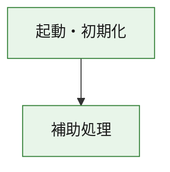
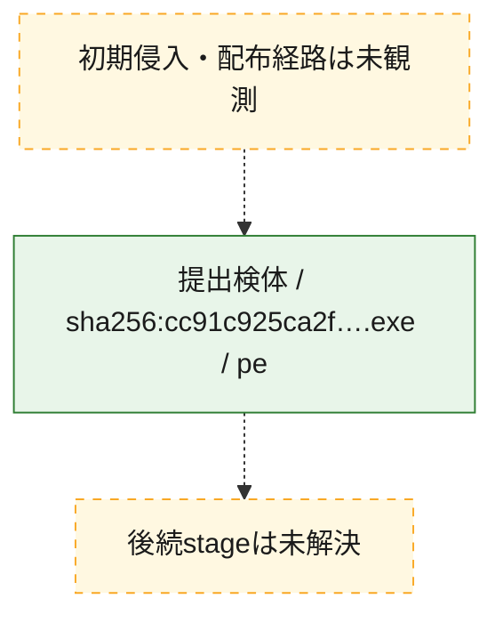
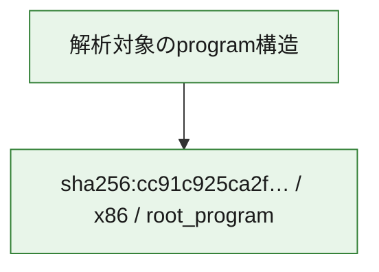

# 全体ロジック：cc91c925ca2f097ffaf01e81ec14b2eb3658f4c84313908f2b0f0b0985a1106e

代表関数の静的証跡から、起動・初期化の処理群を確認しました。

## 読み方

- phaseの掲載順は解析上の整理順です。observed_call_edgesがない段階間の実行順を断定しません。
- 図の実線は静的に観測した関係、点線と黄色のノードは未観測・未解決の関係を示します。
- 図は静的な要約であり、動的実行を再現するものではありません。
- 詳細な関数解説とfingerprintは[STATIC-LOGIC.md](STATIC-LOGIC.md)を参照してください。

## 静的可視化

### 実行フロー

### 感染チェーン

### モジュール関係

## 処理段階

### 1. 起動・初期化

entry pointから初期化と後続処理への移行を確認します。
確度: `confirmed_static_function_evidence`

- `cc91c925ca2f097ffaf01e81ec14b2eb3658f4c84313908f2b0f0b0985a1106e:ghidra:180001010` — 初期化と主要処理への分岐を行う入口関数です。 状態: `succeeded`、選定理由: `entry_point`, `meaningful_symbol_name`, `reviewed_call_centrality:22`, `role:entrypoint`, `small_program_complete_context`

### 2. 補助処理

主要処理を支える一般内部関数またはlibrary処理を確認します。
確度: `confirmed_static_function_evidence`

- `cc91c925ca2f097ffaf01e81ec14b2eb3658f4c84313908f2b0f0b0985a1106e:ghidra:180001240` — 検体内部の一般処理を実装する関数です。 状態: `succeeded`、選定理由: `context_representative`, `reviewed_call_centrality:2`, `small_program_complete_context`
- `cc91c925ca2f097ffaf01e81ec14b2eb3658f4c84313908f2b0f0b0985a1106e:ghidra:180001350` — 検体内部の一般処理を実装する関数です。 状態: `succeeded`、選定理由: `context_representative`, `reviewed_call_centrality:25`, `small_program_complete_context`
- `cc91c925ca2f097ffaf01e81ec14b2eb3658f4c84313908f2b0f0b0985a1106e:ghidra:180003780` — 検体内部の一般処理を実装する関数です。 状態: `succeeded`、選定理由: `context_representative`, `reviewed_call_centrality:2`, `small_program_complete_context`
- `cc91c925ca2f097ffaf01e81ec14b2eb3658f4c84313908f2b0f0b0985a1106e:ghidra:1800038e0` — 検体内部の一般処理を実装する関数です。 状態: `succeeded`、選定理由: `context_representative`, `reviewed_call_centrality:2`, `small_program_complete_context`

## 観測したcall関係

- `cc91c925ca2f097ffaf01e81ec14b2eb3658f4c84313908f2b0f0b0985a1106e:ghidra:180001010` → `cc91c925ca2f097ffaf01e81ec14b2eb3658f4c84313908f2b0f0b0985a1106e:ghidra:180001240` （`startup` → `support`）
- `cc91c925ca2f097ffaf01e81ec14b2eb3658f4c84313908f2b0f0b0985a1106e:ghidra:180001010` → `cc91c925ca2f097ffaf01e81ec14b2eb3658f4c84313908f2b0f0b0985a1106e:ghidra:180001350` （`startup` → `support`）
- `cc91c925ca2f097ffaf01e81ec14b2eb3658f4c84313908f2b0f0b0985a1106e:ghidra:180001350` → `cc91c925ca2f097ffaf01e81ec14b2eb3658f4c84313908f2b0f0b0985a1106e:ghidra:180001240` （`support` → `support`）
- `cc91c925ca2f097ffaf01e81ec14b2eb3658f4c84313908f2b0f0b0985a1106e:ghidra:180001350` → `cc91c925ca2f097ffaf01e81ec14b2eb3658f4c84313908f2b0f0b0985a1106e:ghidra:180003780` （`support` → `support`）
- `cc91c925ca2f097ffaf01e81ec14b2eb3658f4c84313908f2b0f0b0985a1106e:ghidra:180001350` → `cc91c925ca2f097ffaf01e81ec14b2eb3658f4c84313908f2b0f0b0985a1106e:ghidra:1800038e0` （`support` → `support`）
- `cc91c925ca2f097ffaf01e81ec14b2eb3658f4c84313908f2b0f0b0985a1106e:ghidra:180003780` → `cc91c925ca2f097ffaf01e81ec14b2eb3658f4c84313908f2b0f0b0985a1106e:ghidra:1800038e0` （`support` → `support`）
- `ghidra-function:58def7ecce08380474440a0e` → `ghidra-function:081f55dc7466190ea4c59191` （`unclassified` → `unclassified`）
- `ghidra-function:58def7ecce08380474440a0e` → `ghidra-function:0b279be413024c9f9c025b54` （`unclassified` → `unclassified`）
- `ghidra-function:58def7ecce08380474440a0e` → `ghidra-function:20bdcefc90ff77405faff52c` （`unclassified` → `unclassified`）
- `ghidra-function:58def7ecce08380474440a0e` → `ghidra-function:5e5f13debe135c5e45749964` （`unclassified` → `unclassified`）
- `ghidra-function:58def7ecce08380474440a0e` → `ghidra-function:6e38672d431c5e6e0b0e7d6c` （`unclassified` → `unclassified`）
- `ghidra-function:58def7ecce08380474440a0e` → `ghidra-function:8ba1378c3f4ee54ec5a7f7ee` （`unclassified` → `unclassified`）
- `ghidra-function:58def7ecce08380474440a0e` → `ghidra-function:98a73130b39c964556195909` （`unclassified` → `unclassified`）
- `ghidra-function:58def7ecce08380474440a0e` → `ghidra-function:9fab459b0141c945d84f3383` （`unclassified` → `unclassified`）
- `ghidra-function:58def7ecce08380474440a0e` → `ghidra-function:c216432adaee29119207ac00` （`unclassified` → `unclassified`）
- `ghidra-function:58def7ecce08380474440a0e` → `ghidra-function:c2639875d7cc177ff5102f07` （`unclassified` → `unclassified`）
- `ghidra-function:58def7ecce08380474440a0e` → `ghidra-function:d7b5c6008cff58d87e64a936` （`unclassified` → `unclassified`）
- `ghidra-function:58def7ecce08380474440a0e` → `ghidra-function:f83109caa8bb3e0e9d1729d2` （`unclassified` → `unclassified`）
- `ghidra-function:9fab459b0141c945d84f3383` → `ghidra-external:034fc21f98198b86c068de16` （`unclassified` → `unclassified`）
- `ghidra-function:9fab459b0141c945d84f3383` → `ghidra-external:17f293e91c45add9d9de48a5` （`unclassified` → `unclassified`）
- `ghidra-function:9fab459b0141c945d84f3383` → `ghidra-external:3bddeec5e081c7d2f49eae60` （`unclassified` → `unclassified`）
- `ghidra-function:9fab459b0141c945d84f3383` → `ghidra-external:5b42d6b68d1aea88c8a61e41` （`unclassified` → `unclassified`）
- `ghidra-function:9fab459b0141c945d84f3383` → `ghidra-external:63eb2997450b921403a68c50` （`unclassified` → `unclassified`）
- `ghidra-function:9fab459b0141c945d84f3383` → `ghidra-external:65b0e39c69e00267897a6a40` （`unclassified` → `unclassified`）
- `ghidra-function:9fab459b0141c945d84f3383` → `ghidra-external:7b34915d48ffd1a67b7ee545` （`unclassified` → `unclassified`）
- `ghidra-function:9fab459b0141c945d84f3383` → `ghidra-external:7cbdb14a6a5322e8d22ef094` （`unclassified` → `unclassified`）
- `ghidra-function:9fab459b0141c945d84f3383` → `ghidra-external:7d927065118691ac42c17c2a` （`unclassified` → `unclassified`）
- `ghidra-function:9fab459b0141c945d84f3383` → `ghidra-external:9687d1174c86e668226bdbe8` （`unclassified` → `unclassified`）
- `ghidra-function:9fab459b0141c945d84f3383` → `ghidra-external:98b848248c0f112a73ba6152` （`unclassified` → `unclassified`）
- `ghidra-function:9fab459b0141c945d84f3383` → `ghidra-external:9b9fe46c325dcc88cceaf041` （`unclassified` → `unclassified`）
- `ghidra-function:9fab459b0141c945d84f3383` → `ghidra-external:a3c107e85056d4294a8f4e6a` （`unclassified` → `unclassified`）
- `ghidra-function:9fab459b0141c945d84f3383` → `ghidra-external:bac3cd6b59b2b0a1a89f2c5e` （`unclassified` → `unclassified`）
- `ghidra-function:9fab459b0141c945d84f3383` → `ghidra-external:bb5e8f49febb7f2d6d64f75a` （`unclassified` → `unclassified`）
- `ghidra-function:9fab459b0141c945d84f3383` → `ghidra-external:bd4c014c93fdb40547c478cf` （`unclassified` → `unclassified`）
- `ghidra-function:9fab459b0141c945d84f3383` → `ghidra-external:be0f8dc1054f9460b3a936db` （`unclassified` → `unclassified`）
- `ghidra-function:9fab459b0141c945d84f3383` → `ghidra-external:ccf8ee51bf57468e9577520d` （`unclassified` → `unclassified`）
- `ghidra-function:9fab459b0141c945d84f3383` → `ghidra-external:d1a2c8b5f5b3c3da89389992` （`unclassified` → `unclassified`）
- `ghidra-function:9fab459b0141c945d84f3383` → `ghidra-external:f372e3f1bc4b948a35a1bfb6` （`unclassified` → `unclassified`）
- `ghidra-function:9fab459b0141c945d84f3383` → `ghidra-external:f4b5354ab89f690daae44f1e` （`unclassified` → `unclassified`）
- `ghidra-function:9fab459b0141c945d84f3383` → `ghidra-function:783ed7cc81a9e646e8e6b7b6` （`unclassified` → `unclassified`）
- `ghidra-function:9fab459b0141c945d84f3383` → `ghidra-function:98a73130b39c964556195909` （`unclassified` → `unclassified`）
- `ghidra-function:9fab459b0141c945d84f3383` → `ghidra-function:c4af4b72285a7f20ad83ec53` （`unclassified` → `unclassified`）
- `ghidra-function:c4af4b72285a7f20ad83ec53` → `ghidra-function:783ed7cc81a9e646e8e6b7b6` （`unclassified` → `unclassified`）

## 解析範囲と制約

- 選定外関数は全体inventoryへ残しますが、関数本体の個別解説対象にはしていません。
- indirect call、難読化、packer、VM、壊れたcontrol flowによりcall関係が欠落する場合があります。
- 文書は静的解析に基づき、検体実行や外部通信による動的確認は行っていません。
