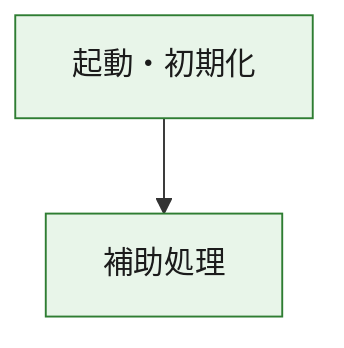
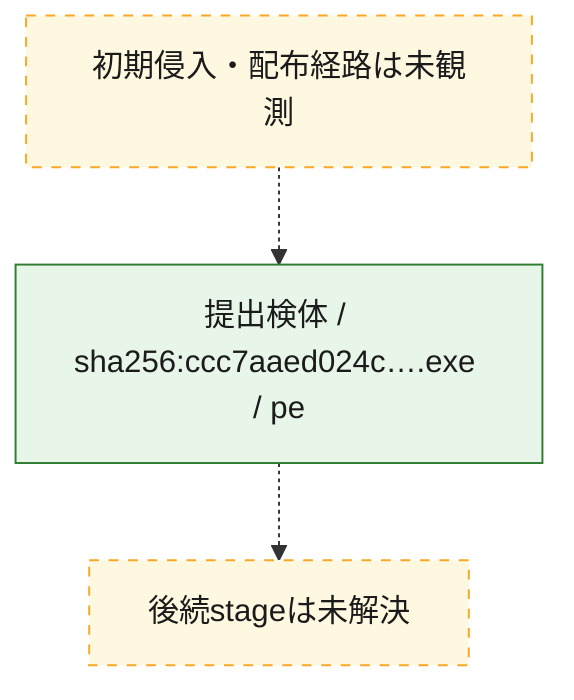
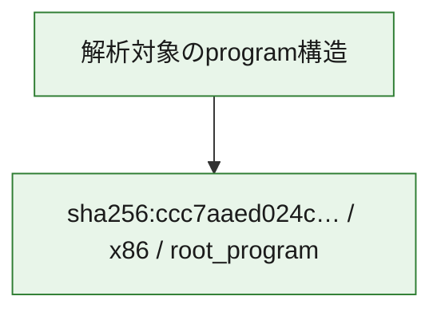

# 全体ロジック：ccc7aaed024cd4ced8e4fa34a7aed2e3794dff96e308f83edc07fb50fe938aa8

代表関数の静的証跡から、起動・初期化の処理群を確認しました。

## 読み方

- phaseの掲載順は解析上の整理順です。observed_call_edgesがない段階間の実行順を断定しません。
- 図の実線は静的に観測した関係、点線と黄色のノードは未観測・未解決の関係を示します。
- 図は静的な要約であり、動的実行を再現するものではありません。
- 詳細な関数解説とfingerprintは[STATIC-LOGIC.md](STATIC-LOGIC.md)を参照してください。

## 静的可視化

### 実行フロー

### 感染チェーン

### モジュール関係

## 処理段階

### 1. 起動・初期化

entry pointから初期化と後続処理への移行を確認します。
確度: `confirmed_static_function_evidence`

- `ccc7aaed024cd4ced8e4fa34a7aed2e3794dff96e308f83edc07fb50fe938aa8:ghidra:180001010` — 初期化と主要処理への分岐を行う入口関数です。 状態: `succeeded`、選定理由: `entry_point`, `meaningful_symbol_name`, `reviewed_call_centrality:22`, `role:entrypoint`, `small_program_complete_context`

### 2. 補助処理

主要処理を支える一般内部関数またはlibrary処理を確認します。
確度: `confirmed_static_function_evidence`

- `ccc7aaed024cd4ced8e4fa34a7aed2e3794dff96e308f83edc07fb50fe938aa8:ghidra:180001240` — 検体内部の一般処理を実装する関数です。 状態: `succeeded`、選定理由: `context_representative`, `reviewed_call_centrality:2`, `small_program_complete_context`
- `ccc7aaed024cd4ced8e4fa34a7aed2e3794dff96e308f83edc07fb50fe938aa8:ghidra:180001350` — 検体内部の一般処理を実装する関数です。 状態: `succeeded`、選定理由: `context_representative`, `reviewed_call_centrality:25`, `small_program_complete_context`
- `ccc7aaed024cd4ced8e4fa34a7aed2e3794dff96e308f83edc07fb50fe938aa8:ghidra:180003780` — 検体内部の一般処理を実装する関数です。 状態: `succeeded`、選定理由: `context_representative`, `reviewed_call_centrality:2`, `small_program_complete_context`
- `ccc7aaed024cd4ced8e4fa34a7aed2e3794dff96e308f83edc07fb50fe938aa8:ghidra:1800038e0` — 検体内部の一般処理を実装する関数です。 状態: `succeeded`、選定理由: `context_representative`, `reviewed_call_centrality:2`, `small_program_complete_context`

## 観測したcall関係

- `ccc7aaed024cd4ced8e4fa34a7aed2e3794dff96e308f83edc07fb50fe938aa8:ghidra:180001010` → `ccc7aaed024cd4ced8e4fa34a7aed2e3794dff96e308f83edc07fb50fe938aa8:ghidra:180001240` （`startup` → `support`）
- `ccc7aaed024cd4ced8e4fa34a7aed2e3794dff96e308f83edc07fb50fe938aa8:ghidra:180001010` → `ccc7aaed024cd4ced8e4fa34a7aed2e3794dff96e308f83edc07fb50fe938aa8:ghidra:180001350` （`startup` → `support`）
- `ccc7aaed024cd4ced8e4fa34a7aed2e3794dff96e308f83edc07fb50fe938aa8:ghidra:180001350` → `ccc7aaed024cd4ced8e4fa34a7aed2e3794dff96e308f83edc07fb50fe938aa8:ghidra:180001240` （`support` → `support`）
- `ccc7aaed024cd4ced8e4fa34a7aed2e3794dff96e308f83edc07fb50fe938aa8:ghidra:180001350` → `ccc7aaed024cd4ced8e4fa34a7aed2e3794dff96e308f83edc07fb50fe938aa8:ghidra:180003780` （`support` → `support`）
- `ccc7aaed024cd4ced8e4fa34a7aed2e3794dff96e308f83edc07fb50fe938aa8:ghidra:180001350` → `ccc7aaed024cd4ced8e4fa34a7aed2e3794dff96e308f83edc07fb50fe938aa8:ghidra:1800038e0` （`support` → `support`）
- `ccc7aaed024cd4ced8e4fa34a7aed2e3794dff96e308f83edc07fb50fe938aa8:ghidra:180003780` → `ccc7aaed024cd4ced8e4fa34a7aed2e3794dff96e308f83edc07fb50fe938aa8:ghidra:1800038e0` （`support` → `support`）
- `ghidra-function:5f6247def0b124a851b31823` → `ghidra-function:0f927d8b4d9f3d2a96ff47f6` （`unclassified` → `unclassified`）
- `ghidra-function:5f6247def0b124a851b31823` → `ghidra-function:212c274a3c6e6c4516abdeb2` （`unclassified` → `unclassified`）
- `ghidra-function:5f6247def0b124a851b31823` → `ghidra-function:285fe777ef4f36f87df45beb` （`unclassified` → `unclassified`）
- `ghidra-function:5f6247def0b124a851b31823` → `ghidra-function:3102d1ba4263304d105f9358` （`unclassified` → `unclassified`）
- `ghidra-function:5f6247def0b124a851b31823` → `ghidra-function:422baade1d61dd6fc8977a08` （`unclassified` → `unclassified`）
- `ghidra-function:5f6247def0b124a851b31823` → `ghidra-function:50f950a1276052990d85730a` （`unclassified` → `unclassified`）
- `ghidra-function:5f6247def0b124a851b31823` → `ghidra-function:530e611950d89748fbd7aee3` （`unclassified` → `unclassified`）
- `ghidra-function:5f6247def0b124a851b31823` → `ghidra-function:59fb2a4626b969d6cc35de51` （`unclassified` → `unclassified`）
- `ghidra-function:5f6247def0b124a851b31823` → `ghidra-function:7c5c45beb3123bf23b17315d` （`unclassified` → `unclassified`）
- `ghidra-function:5f6247def0b124a851b31823` → `ghidra-function:c73dc944d897e92f3c3c5d02` （`unclassified` → `unclassified`）
- `ghidra-function:5f6247def0b124a851b31823` → `ghidra-function:d2ed898d30d1e2c70112bd54` （`unclassified` → `unclassified`）
- `ghidra-function:5f6247def0b124a851b31823` → `ghidra-function:efe8d144717fe8181995b0be` （`unclassified` → `unclassified`）
- `ghidra-function:7c5c45beb3123bf23b17315d` → `ghidra-external:0657d03f3b65767039d02203` （`unclassified` → `unclassified`）
- `ghidra-function:7c5c45beb3123bf23b17315d` → `ghidra-external:090e48c902474a63650c4daf` （`unclassified` → `unclassified`）
- `ghidra-function:7c5c45beb3123bf23b17315d` → `ghidra-external:19805f6ae23a2692d82f1134` （`unclassified` → `unclassified`）
- `ghidra-function:7c5c45beb3123bf23b17315d` → `ghidra-external:21a7fa98791aefdef91c4f70` （`unclassified` → `unclassified`）
- `ghidra-function:7c5c45beb3123bf23b17315d` → `ghidra-external:2dc9eb3f340ee0e9198b7521` （`unclassified` → `unclassified`）
- `ghidra-function:7c5c45beb3123bf23b17315d` → `ghidra-external:36ed6358add674e35ba8f9f9` （`unclassified` → `unclassified`）
- `ghidra-function:7c5c45beb3123bf23b17315d` → `ghidra-external:40910e1149c1cfee105431a1` （`unclassified` → `unclassified`）
- `ghidra-function:7c5c45beb3123bf23b17315d` → `ghidra-external:4c0bbb8860b1ccaa5151a588` （`unclassified` → `unclassified`）
- `ghidra-function:7c5c45beb3123bf23b17315d` → `ghidra-external:50af136346e696abc9699f0d` （`unclassified` → `unclassified`）
- `ghidra-function:7c5c45beb3123bf23b17315d` → `ghidra-external:63d67a4066fa7abf5e1a2d00` （`unclassified` → `unclassified`）
- `ghidra-function:7c5c45beb3123bf23b17315d` → `ghidra-external:6cc7fa1f7c02ffc0b1d19580` （`unclassified` → `unclassified`）
- `ghidra-function:7c5c45beb3123bf23b17315d` → `ghidra-external:8bb308cfc1b402e7c43dac9c` （`unclassified` → `unclassified`）
- `ghidra-function:7c5c45beb3123bf23b17315d` → `ghidra-external:9ddc47e4bb77c8415c838ab0` （`unclassified` → `unclassified`）
- `ghidra-function:7c5c45beb3123bf23b17315d` → `ghidra-external:9fff520161fe357cae4f6b9a` （`unclassified` → `unclassified`）
- `ghidra-function:7c5c45beb3123bf23b17315d` → `ghidra-external:a427e594efa4574cf8e982f4` （`unclassified` → `unclassified`）
- `ghidra-function:7c5c45beb3123bf23b17315d` → `ghidra-external:ac3dae452a90255b21b6e12e` （`unclassified` → `unclassified`）
- `ghidra-function:7c5c45beb3123bf23b17315d` → `ghidra-external:b39275c9f2a9833508aaaa4c` （`unclassified` → `unclassified`）
- `ghidra-function:7c5c45beb3123bf23b17315d` → `ghidra-external:b6522606d698c27b941c0abd` （`unclassified` → `unclassified`）
- `ghidra-function:7c5c45beb3123bf23b17315d` → `ghidra-external:bdedaeae544fb3c473e481e9` （`unclassified` → `unclassified`）
- `ghidra-function:7c5c45beb3123bf23b17315d` → `ghidra-external:ce0547b3023d35b3fa203404` （`unclassified` → `unclassified`）
- `ghidra-function:7c5c45beb3123bf23b17315d` → `ghidra-external:d051fbc85152e6393baaa870` （`unclassified` → `unclassified`）
- `ghidra-function:7c5c45beb3123bf23b17315d` → `ghidra-function:4d8321bc90c01176f89d96ca` （`unclassified` → `unclassified`）
- `ghidra-function:7c5c45beb3123bf23b17315d` → `ghidra-function:530e611950d89748fbd7aee3` （`unclassified` → `unclassified`）
- `ghidra-function:7c5c45beb3123bf23b17315d` → `ghidra-function:c74252346a289df7420490bb` （`unclassified` → `unclassified`）
- `ghidra-function:c74252346a289df7420490bb` → `ghidra-function:4d8321bc90c01176f89d96ca` （`unclassified` → `unclassified`）

## 解析範囲と制約

- 選定外関数は全体inventoryへ残しますが、関数本体の個別解説対象にはしていません。
- indirect call、難読化、packer、VM、壊れたcontrol flowによりcall関係が欠落する場合があります。
- 文書は静的解析に基づき、検体実行や外部通信による動的確認は行っていません。
