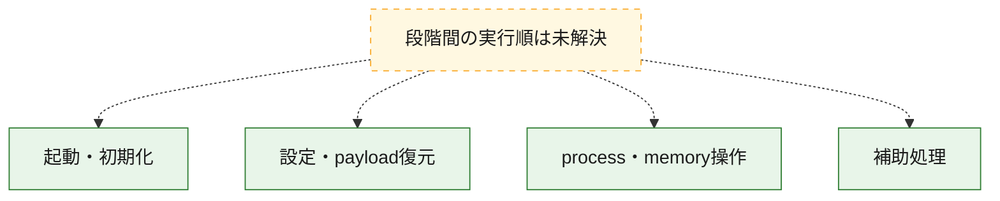
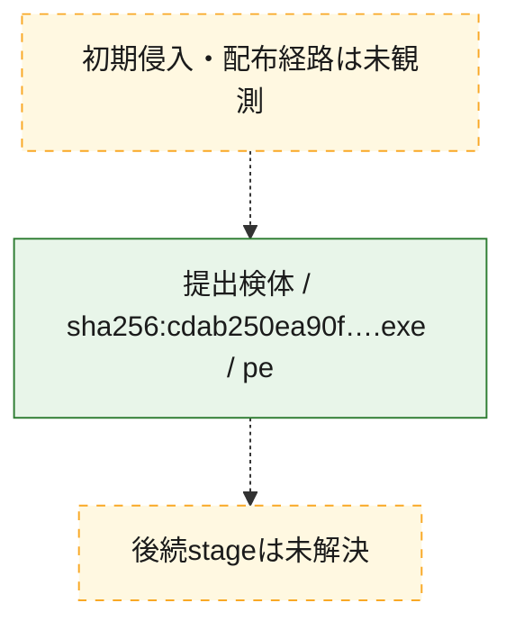
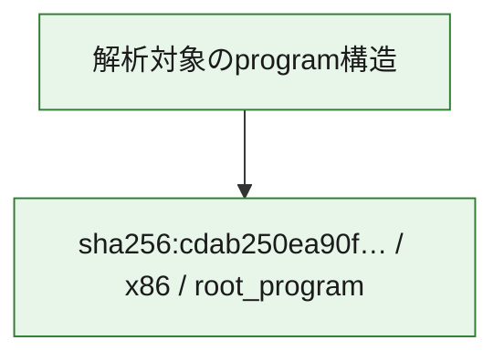

# 全体ロジック：cdab250ea90f79efb405d13c4f77fff2876b21392ddc0849737d2ab86e308189

代表関数の静的証跡から、起動・初期化、設定・payload復元、process・memory操作の処理群を確認しました。

## 読み方

- phaseの掲載順は解析上の整理順です。observed_call_edgesがない段階間の実行順を断定しません。
- 図の実線は静的に観測した関係、点線と黄色のノードは未観測・未解決の関係を示します。
- 図は静的な要約であり、動的実行を再現するものではありません。
- 詳細な関数解説とfingerprintは[STATIC-LOGIC.md](STATIC-LOGIC.md)を参照してください。

## 静的可視化

### 実行フロー

### 感染チェーン

### モジュール関係

## 処理段階

### 1. 起動・初期化

entry pointから初期化と後続処理への移行を確認します。
確度: `confirmed_static_function_evidence`

- `cdab250ea90f79efb405d13c4f77fff2876b21392ddc0849737d2ab86e308189:ghidra:18001f594` — 初期化と主要処理への分岐を行う入口関数です。 状態: `succeeded`、選定理由: `entry_point`, `meaningful_symbol_name`, `reviewed_call_centrality:5`, `role:entrypoint`

### 2. 設定・payload復元

設定、resource、payload、暗号化データの復元・変換を確認します。
確度: `confirmed_static_function_evidence`

- `cdab250ea90f79efb405d13c4f77fff2876b21392ddc0849737d2ab86e308189:ghidra:180004ec0` — 設定、resource、payloadなどの解析・変換を行う関数です。 状態: `succeeded`、選定理由: `entry_point`, `meaningful_symbol_name`, `reviewed_call_centrality:64`, `role:config_or_data_transform`

### 3. process・memory操作

process、thread、module、memory操作と実行移行を確認します。
確度: `confirmed_static_function_evidence_with_limits`

- `cdab250ea90f79efb405d13c4f77fff2876b21392ddc0849737d2ab86e308189:ghidra:1800018a0` — process、thread、module、またはmemory操作に関係する関数です。 状態: `succeeded`、選定理由: `context_representative`, `reviewed_call_centrality:18`, `role:process_or_memory_operation`
- `cdab250ea90f79efb405d13c4f77fff2876b21392ddc0849737d2ab86e308189:ghidra:180002960` — process、thread、module、またはmemory操作に関係する関数です。 状態: `limited_bad_instruction_or_flow`、選定理由: `context_representative`, `reviewed_call_centrality:18`, `role:process_or_memory_operation`
- `cdab250ea90f79efb405d13c4f77fff2876b21392ddc0849737d2ab86e308189:ghidra:1800030c0` — process、thread、module、またはmemory操作に関係する関数です。 状態: `succeeded`、選定理由: `context_representative`, `reviewed_call_centrality:26`, `role:process_or_memory_operation`
- `cdab250ea90f79efb405d13c4f77fff2876b21392ddc0849737d2ab86e308189:ghidra:180003b80` — process、thread、module、またはmemory操作に関係する関数です。 状態: `succeeded`、選定理由: `context_representative`, `reviewed_call_centrality:4`, `role:process_or_memory_operation`
- `cdab250ea90f79efb405d13c4f77fff2876b21392ddc0849737d2ab86e308189:ghidra:180003be0` — process、thread、module、またはmemory操作に関係する関数です。 状態: `succeeded`、選定理由: `context_representative`, `reviewed_call_centrality:18`, `role:process_or_memory_operation`
- `cdab250ea90f79efb405d13c4f77fff2876b21392ddc0849737d2ab86e308189:ghidra:180003e30` — process、thread、module、またはmemory操作に関係する関数です。 状態: `succeeded`、選定理由: `context_representative`, `reviewed_call_centrality:6`, `role:process_or_memory_operation`
- `cdab250ea90f79efb405d13c4f77fff2876b21392ddc0849737d2ab86e308189:ghidra:1800042b0` — process、thread、module、またはmemory操作に関係する関数です。 状態: `succeeded`、選定理由: `context_representative`, `reviewed_call_centrality:12`, `role:process_or_memory_operation`
- `cdab250ea90f79efb405d13c4f77fff2876b21392ddc0849737d2ab86e308189:ghidra:180004550` — process、thread、module、またはmemory操作に関係する関数です。 状態: `succeeded`、選定理由: `context_representative`, `reviewed_call_centrality:8`, `role:process_or_memory_operation`
- `cdab250ea90f79efb405d13c4f77fff2876b21392ddc0849737d2ab86e308189:ghidra:1800045c0` — process、thread、module、またはmemory操作に関係する関数です。 状態: `succeeded`、選定理由: `context_representative`, `reviewed_call_centrality:13`, `role:process_or_memory_operation`
- `cdab250ea90f79efb405d13c4f77fff2876b21392ddc0849737d2ab86e308189:ghidra:180004800` — process、thread、module、またはmemory操作に関係する関数です。 状態: `succeeded`、選定理由: `context_representative`, `reviewed_call_centrality:8`, `role:process_or_memory_operation`
- `cdab250ea90f79efb405d13c4f77fff2876b21392ddc0849737d2ab86e308189:ghidra:180004870` — process、thread、module、またはmemory操作に関係する関数です。 状態: `limited_bad_instruction_or_flow`、選定理由: `context_representative`, `reviewed_call_centrality:11`, `role:process_or_memory_operation`
- `cdab250ea90f79efb405d13c4f77fff2876b21392ddc0849737d2ab86e308189:ghidra:180004b90` — process、thread、module、またはmemory操作に関係する関数です。 状態: `limited_bad_instruction_or_flow`、選定理由: `context_representative`, `reviewed_call_centrality:7`, `role:process_or_memory_operation`
- `cdab250ea90f79efb405d13c4f77fff2876b21392ddc0849737d2ab86e308189:ghidra:180004c50` — process、thread、module、またはmemory操作に関係する関数です。 状態: `limited_bad_instruction_or_flow`、選定理由: `context_representative`, `reviewed_call_centrality:10`, `role:process_or_memory_operation`
- `cdab250ea90f79efb405d13c4f77fff2876b21392ddc0849737d2ab86e308189:ghidra:180004d80` — process、thread、module、またはmemory操作に関係する関数です。 状態: `limited_bad_instruction_or_flow`、選定理由: `context_representative`, `reviewed_call_centrality:10`, `role:process_or_memory_operation`
- `cdab250ea90f79efb405d13c4f77fff2876b21392ddc0849737d2ab86e308189:ghidra:180006af0` — process、thread、module、またはmemory操作に関係する関数です。 状態: `succeeded`、選定理由: `context_representative`, `reviewed_call_centrality:5`, `role:process_or_memory_operation`
- `cdab250ea90f79efb405d13c4f77fff2876b21392ddc0849737d2ab86e308189:ghidra:180006ba0` — process、thread、module、またはmemory操作に関係する関数です。 状態: `succeeded`、選定理由: `context_representative`, `reviewed_call_centrality:4`, `role:process_or_memory_operation`
- `cdab250ea90f79efb405d13c4f77fff2876b21392ddc0849737d2ab86e308189:ghidra:180006c00` — process、thread、module、またはmemory操作に関係する関数です。 状態: `limited_bad_instruction_or_flow`、選定理由: `context_representative`, `reviewed_call_centrality:6`, `role:process_or_memory_operation`
- `cdab250ea90f79efb405d13c4f77fff2876b21392ddc0849737d2ab86e308189:ghidra:180006e60` — process、thread、module、またはmemory操作に関係する関数です。 状態: `succeeded`、選定理由: `context_representative`, `reviewed_call_centrality:4`, `role:process_or_memory_operation`

### 4. 補助処理

主要処理を支える一般内部関数またはlibrary処理を確認します。
確度: `confirmed_static_function_evidence_with_limits`

- `cdab250ea90f79efb405d13c4f77fff2876b21392ddc0849737d2ab86e308189:ghidra:180001000` — 検体内部の一般処理を実装する関数です。 状態: `succeeded`、選定理由: `context_representative`, `reviewed_call_centrality:3`
- `cdab250ea90f79efb405d13c4f77fff2876b21392ddc0849737d2ab86e308189:ghidra:180001230` — 検体内部の一般処理を実装する関数です。 状態: `succeeded`、選定理由: `context_representative`, `reviewed_call_centrality:7`
- `cdab250ea90f79efb405d13c4f77fff2876b21392ddc0849737d2ab86e308189:ghidra:180001650` — 検体内部の一般処理を実装する関数です。 状態: `succeeded`、選定理由: `context_representative`, `reviewed_call_centrality:5`
- `cdab250ea90f79efb405d13c4f77fff2876b21392ddc0849737d2ab86e308189:ghidra:1800016d0` — 検体内部の一般処理を実装する関数です。 状態: `succeeded`、選定理由: `context_representative`, `reviewed_call_centrality:5`
- `cdab250ea90f79efb405d13c4f77fff2876b21392ddc0849737d2ab86e308189:ghidra:180003ed0` — 検体内部の一般処理を実装する関数です。 状態: `succeeded`、選定理由: `context_representative`, `reviewed_call_centrality:7`
- `cdab250ea90f79efb405d13c4f77fff2876b21392ddc0849737d2ab86e308189:ghidra:180006b60` — 検体内部の一般処理を実装する関数です。 状態: `succeeded`、選定理由: `context_representative`, `reviewed_call_centrality:1`
- `cdab250ea90f79efb405d13c4f77fff2876b21392ddc0849737d2ab86e308189:ghidra:180006c30` — 検体内部の一般処理を実装する関数です。 状態: `succeeded`、選定理由: `context_representative`, `reviewed_call_centrality:2`
- `cdab250ea90f79efb405d13c4f77fff2876b21392ddc0849737d2ab86e308189:ghidra:180006c40` — 検体内部の一般処理を実装する関数です。 状態: `succeeded`、選定理由: `context_representative`, `reviewed_call_centrality:9`
- `cdab250ea90f79efb405d13c4f77fff2876b21392ddc0849737d2ab86e308189:ghidra:180006cd0` — 検体内部の一般処理を実装する関数です。 状態: `succeeded`、選定理由: `context_representative`, `reviewed_call_centrality:10`
- `cdab250ea90f79efb405d13c4f77fff2876b21392ddc0849737d2ab86e308189:ghidra:180006ea0` — 検体内部の一般処理を実装する関数です。 状態: `limited_bad_instruction_or_flow`、選定理由: `context_representative`
- `cdab250ea90f79efb405d13c4f77fff2876b21392ddc0849737d2ab86e308189:ghidra:18001b030` — compiler生成処理または汎用library処理とみられる関数です。 状態: `limited_bad_instruction_or_flow`、選定理由: `entry_point`, `meaningful_symbol_name`, `reviewed_call_centrality:8`
- `cdab250ea90f79efb405d13c4f77fff2876b21392ddc0849737d2ab86e308189:ghidra:18001fbc8` — 検体内部の一般処理を実装する関数です。 状態: `succeeded`、選定理由: `meaningful_symbol_name`

## 観測したcall関係

- 代表関数間で直接解決できた呼出関係はありません。

## 解析範囲と制約

- 選定外関数は全体inventoryへ残しますが、関数本体の個別解説対象にはしていません。
- indirect call、難読化、packer、VM、壊れたcontrol flowによりcall関係が欠落する場合があります。
- 文書は静的解析に基づき、検体実行や外部通信による動的確認は行っていません。
