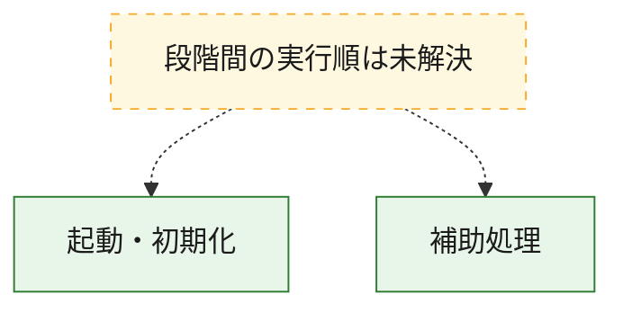
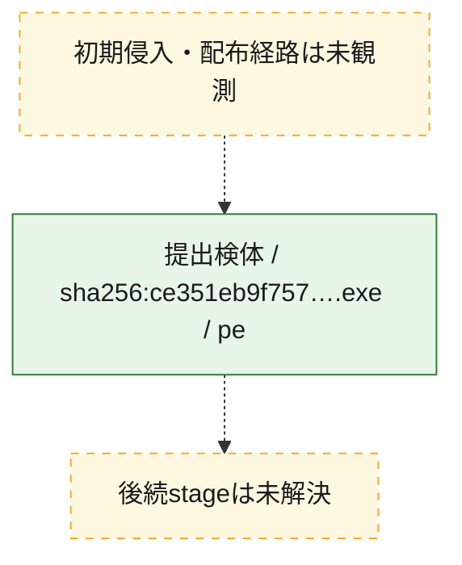
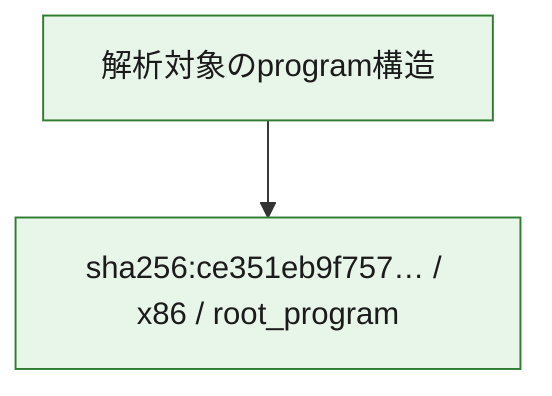

# 全体ロジック：ce351eb9f7578e048c5229b1004403678ec9aa093df6d44b0252686d8b77d72e

代表関数の静的証跡から、起動・初期化の処理群を確認しました。

## 読み方

- phaseの掲載順は解析上の整理順です。observed_call_edgesがない段階間の実行順を断定しません。
- 図の実線は静的に観測した関係、点線と黄色のノードは未観測・未解決の関係を示します。
- 図は静的な要約であり、動的実行を再現するものではありません。
- 詳細な関数解説とfingerprintは[STATIC-LOGIC.md](STATIC-LOGIC.md)を参照してください。

## 静的可視化

### 実行フロー

### 感染チェーン

### モジュール関係

## 処理段階

### 1. 起動・初期化

entry pointから初期化と後続処理への移行を確認します。
確度: `confirmed_static_function_evidence`

- `ce351eb9f7578e048c5229b1004403678ec9aa093df6d44b0252686d8b77d72e:ghidra:1801516b0` — 初期化と主要処理への分岐を行う入口関数です。 状態: `succeeded`、選定理由: `entry_point`, `meaningful_symbol_name`, `reviewed_call_centrality:5`, `role:entrypoint`

### 2. 補助処理

主要処理を支える一般内部関数またはlibrary処理を確認します。
確度: `confirmed_static_function_evidence_with_limits`

- `ce351eb9f7578e048c5229b1004403678ec9aa093df6d44b0252686d8b77d72e:ghidra:180001000` — 検体内部の一般処理を実装する関数です。 状態: `succeeded`、選定理由: `context_representative`, `reviewed_call_centrality:2`
- `ce351eb9f7578e048c5229b1004403678ec9aa093df6d44b0252686d8b77d72e:ghidra:180001030` — 検体内部の一般処理を実装する関数です。 状態: `succeeded`、選定理由: `context_representative`, `reviewed_call_centrality:2`
- `ce351eb9f7578e048c5229b1004403678ec9aa093df6d44b0252686d8b77d72e:ghidra:180001050` — 検体内部の一般処理を実装する関数です。 状態: `succeeded`、選定理由: `context_representative`, `reviewed_call_centrality:2`
- `ce351eb9f7578e048c5229b1004403678ec9aa093df6d44b0252686d8b77d72e:ghidra:180001070` — 検体内部の一般処理を実装する関数です。 状態: `succeeded`、選定理由: `context_representative`, `reviewed_call_centrality:2`
- `ce351eb9f7578e048c5229b1004403678ec9aa093df6d44b0252686d8b77d72e:ghidra:180001090` — 検体内部の一般処理を実装する関数です。 状態: `succeeded`、選定理由: `context_representative`, `reviewed_call_centrality:2`
- `ce351eb9f7578e048c5229b1004403678ec9aa093df6d44b0252686d8b77d72e:ghidra:1800010b0` — 検体内部の一般処理を実装する関数です。 状態: `succeeded`、選定理由: `context_representative`, `reviewed_call_centrality:2`
- `ce351eb9f7578e048c5229b1004403678ec9aa093df6d44b0252686d8b77d72e:ghidra:1800010d0` — 検体内部の一般処理を実装する関数です。 状態: `succeeded`、選定理由: `context_representative`, `reviewed_call_centrality:2`
- `ce351eb9f7578e048c5229b1004403678ec9aa093df6d44b0252686d8b77d72e:ghidra:180001100` — 検体内部の一般処理を実装する関数です。 状態: `succeeded`、選定理由: `context_representative`, `reviewed_call_centrality:2`
- `ce351eb9f7578e048c5229b1004403678ec9aa093df6d44b0252686d8b77d72e:ghidra:180001120` — 検体内部の一般処理を実装する関数です。 状態: `succeeded`、選定理由: `context_representative`, `reviewed_call_centrality:2`
- `ce351eb9f7578e048c5229b1004403678ec9aa093df6d44b0252686d8b77d72e:ghidra:180001140` — 検体内部の一般処理を実装する関数です。 状態: `succeeded`、選定理由: `context_representative`, `reviewed_call_centrality:2`
- `ce351eb9f7578e048c5229b1004403678ec9aa093df6d44b0252686d8b77d72e:ghidra:180001160` — 検体内部の一般処理を実装する関数です。 状態: `succeeded`、選定理由: `context_representative`, `reviewed_call_centrality:2`
- `ce351eb9f7578e048c5229b1004403678ec9aa093df6d44b0252686d8b77d72e:ghidra:180001180` — 検体内部の一般処理を実装する関数です。 状態: `succeeded`、選定理由: `context_representative`, `reviewed_call_centrality:2`
- `ce351eb9f7578e048c5229b1004403678ec9aa093df6d44b0252686d8b77d72e:ghidra:1800011a0` — 検体内部の一般処理を実装する関数です。 状態: `succeeded`、選定理由: `context_representative`, `reviewed_call_centrality:2`
- `ce351eb9f7578e048c5229b1004403678ec9aa093df6d44b0252686d8b77d72e:ghidra:1800011c0` — 検体内部の一般処理を実装する関数です。 状態: `succeeded`、選定理由: `context_representative`, `reviewed_call_centrality:2`
- `ce351eb9f7578e048c5229b1004403678ec9aa093df6d44b0252686d8b77d72e:ghidra:1800011f0` — 検体内部の一般処理を実装する関数です。 状態: `succeeded`、選定理由: `context_representative`, `reviewed_call_centrality:2`
- `ce351eb9f7578e048c5229b1004403678ec9aa093df6d44b0252686d8b77d72e:ghidra:180001240` — 検体内部の一般処理を実装する関数です。 状態: `succeeded`、選定理由: `context_representative`, `reviewed_call_centrality:2`
- `ce351eb9f7578e048c5229b1004403678ec9aa093df6d44b0252686d8b77d72e:ghidra:180001260` — 検体内部の一般処理を実装する関数です。 状態: `succeeded`、選定理由: `context_representative`, `reviewed_call_centrality:2`
- `ce351eb9f7578e048c5229b1004403678ec9aa093df6d44b0252686d8b77d72e:ghidra:180001280` — 検体内部の一般処理を実装する関数です。 状態: `succeeded`、選定理由: `context_representative`, `reviewed_call_centrality:2`
- `ce351eb9f7578e048c5229b1004403678ec9aa093df6d44b0252686d8b77d72e:ghidra:1800012a0` — 検体内部の一般処理を実装する関数です。 状態: `succeeded`、選定理由: `context_representative`, `reviewed_call_centrality:2`
- `ce351eb9f7578e048c5229b1004403678ec9aa093df6d44b0252686d8b77d72e:ghidra:1800012d0` — 検体内部の一般処理を実装する関数です。 状態: `succeeded`、選定理由: `context_representative`, `reviewed_call_centrality:2`
- `ce351eb9f7578e048c5229b1004403678ec9aa093df6d44b0252686d8b77d72e:ghidra:180001300` — 検体内部の一般処理を実装する関数です。 状態: `succeeded`、選定理由: `context_representative`, `reviewed_call_centrality:2`
- `ce351eb9f7578e048c5229b1004403678ec9aa093df6d44b0252686d8b77d72e:ghidra:180001520` — 検体内部の一般処理を実装する関数です。 状態: `succeeded`、選定理由: `context_representative`, `reviewed_call_centrality:3`
- `ce351eb9f7578e048c5229b1004403678ec9aa093df6d44b0252686d8b77d72e:ghidra:180001570` — 検体内部の一般処理を実装する関数です。 状態: `succeeded`、選定理由: `context_representative`, `reviewed_call_centrality:4`
- `ce351eb9f7578e048c5229b1004403678ec9aa093df6d44b0252686d8b77d72e:ghidra:180002330` — 検体内部の一般処理を実装する関数です。 状態: `succeeded`、選定理由: `context_representative`, `reviewed_call_centrality:1`
- `ce351eb9f7578e048c5229b1004403678ec9aa093df6d44b0252686d8b77d72e:ghidra:1800024f0` — 検体内部の一般処理を実装する関数です。 状態: `succeeded`、選定理由: `context_representative`, `reviewed_call_centrality:2`
- `ce351eb9f7578e048c5229b1004403678ec9aa093df6d44b0252686d8b77d72e:ghidra:180002510` — 検体内部の一般処理を実装する関数です。 状態: `succeeded`、選定理由: `context_representative`, `reviewed_call_centrality:5`
- `ce351eb9f7578e048c5229b1004403678ec9aa093df6d44b0252686d8b77d72e:ghidra:1800028b0` — 検体内部の一般処理を実装する関数です。 状態: `succeeded`、選定理由: `context_representative`, `reviewed_call_centrality:5`
- `ce351eb9f7578e048c5229b1004403678ec9aa093df6d44b0252686d8b77d72e:ghidra:180002a40` — 検体内部の一般処理を実装する関数です。 状態: `succeeded`、選定理由: `context_representative`, `reviewed_call_centrality:5`
- `ce351eb9f7578e048c5229b1004403678ec9aa093df6d44b0252686d8b77d72e:ghidra:1800031e0` — 検体内部の一般処理を実装する関数です。 状態: `succeeded`、選定理由: `context_representative`, `reviewed_call_centrality:2`
- `ce351eb9f7578e048c5229b1004403678ec9aa093df6d44b0252686d8b77d72e:ghidra:180003bb0` — 検体内部の一般処理を実装する関数です。 状態: `succeeded`、選定理由: `context_representative`, `reviewed_call_centrality:2`
- `ce351eb9f7578e048c5229b1004403678ec9aa093df6d44b0252686d8b77d72e:ghidra:180003cb0` — 検体内部の一般処理を実装する関数です。 状態: `limited_bad_instruction_or_flow`、選定理由: `context_representative`, `reviewed_call_centrality:4`

## 観測したcall関係

- `ghidra-function:02323b0def8c8d25f4e0f057` → `ghidra-external:75bdd26f2353972afe4d88f2` （`unclassified` → `unclassified`）
- `ghidra-function:02323b0def8c8d25f4e0f057` → `ghidra-external:c6b9ad85106110bb861895c2` （`unclassified` → `unclassified`）
- `ghidra-function:02323b0def8c8d25f4e0f057` → `ghidra-function:57ba92838101b7bcc5139999` （`unclassified` → `unclassified`）
- `ghidra-function:02323b0def8c8d25f4e0f057` → `ghidra-function:b5a46c3b080bff5999924f9b` （`unclassified` → `unclassified`）
- `ghidra-function:0d57d4bdcbd2d3abbe9bec4a` → `ghidra-external:75bdd26f2353972afe4d88f2` （`unclassified` → `unclassified`）
- `ghidra-function:0d57d4bdcbd2d3abbe9bec4a` → `ghidra-external:c6b9ad85106110bb861895c2` （`unclassified` → `unclassified`）
- `ghidra-function:0d57d4bdcbd2d3abbe9bec4a` → `ghidra-function:603f7a5d6493a3837957ba15` （`unclassified` → `unclassified`）
- `ghidra-function:0d57d4bdcbd2d3abbe9bec4a` → `ghidra-function:6e0383f39a3697c1a2992e69` （`unclassified` → `unclassified`）
- `ghidra-function:0d57d4bdcbd2d3abbe9bec4a` → `ghidra-function:8e5399ca93832286f6e5a523` （`unclassified` → `unclassified`）
- `ghidra-function:16b68d727040df0b14d0f8bf` → `ghidra-function:bb055cf35b56aa49ee3014f2` （`unclassified` → `unclassified`）
- `ghidra-function:1a3901da270d7ea40f0c43f6` → `ghidra-function:bb055cf35b56aa49ee3014f2` （`unclassified` → `unclassified`）
- `ghidra-function:1c23f5f817472d28cedcdfb2` → `ghidra-function:bb055cf35b56aa49ee3014f2` （`unclassified` → `unclassified`）
- `ghidra-function:208ff4c4ed7b103be7b3ea98` → `ghidra-function:bb055cf35b56aa49ee3014f2` （`unclassified` → `unclassified`）
- `ghidra-function:298b53491493c5ceb43cd056` → `ghidra-function:bb055cf35b56aa49ee3014f2` （`unclassified` → `unclassified`）
- `ghidra-function:317f97b9310260f87186c6a8` → `ghidra-function:bb055cf35b56aa49ee3014f2` （`unclassified` → `unclassified`）
- `ghidra-function:43810170ce55ab2474e8262e` → `ghidra-function:bb055cf35b56aa49ee3014f2` （`unclassified` → `unclassified`）
- `ghidra-function:480c3802dc7f5e1b05b596f3` → `ghidra-function:bb055cf35b56aa49ee3014f2` （`unclassified` → `unclassified`）
- `ghidra-function:5457977f71ff3c4f8f04ede0` → `ghidra-function:bb055cf35b56aa49ee3014f2` （`unclassified` → `unclassified`）
- `ghidra-function:545e79a3175bf0862d4b961a` → `ghidra-function:bb055cf35b56aa49ee3014f2` （`unclassified` → `unclassified`）
- `ghidra-function:57531d04719f55086d170502` → `ghidra-external:766068d6d02763977c9778bb` （`unclassified` → `unclassified`）
- `ghidra-function:57531d04719f55086d170502` → `ghidra-function:3a109e87ce71f769b195bd2b` （`unclassified` → `unclassified`）
- `ghidra-function:57531d04719f55086d170502` → `ghidra-function:62b70e6f143747f9325a9513` （`unclassified` → `unclassified`）
- `ghidra-function:57531d04719f55086d170502` → `ghidra-function:ca0ac0081dc8ffaf9b6d37d0` （`unclassified` → `unclassified`）
- `ghidra-function:57531d04719f55086d170502` → `ghidra-function:ef7a54cdf33c0ba826773d44` （`unclassified` → `unclassified`）
- `ghidra-function:5c2176835f41cdc893aa61ed` → `ghidra-function:bb055cf35b56aa49ee3014f2` （`unclassified` → `unclassified`）
- `ghidra-function:633f0165a6d93acf39c0b7e6` → `ghidra-function:bb055cf35b56aa49ee3014f2` （`unclassified` → `unclassified`）
- `ghidra-function:65c2b727767787c621072ba7` → `ghidra-function:bb055cf35b56aa49ee3014f2` （`unclassified` → `unclassified`）
- `ghidra-function:6889e40608c6a4fc3f374260` → `ghidra-external:766068d6d02763977c9778bb` （`unclassified` → `unclassified`）
- `ghidra-function:6889e40608c6a4fc3f374260` → `ghidra-external:afd0456ad295e45ef66d46e5` （`unclassified` → `unclassified`）
- `ghidra-function:6889e40608c6a4fc3f374260` → `ghidra-function:eb5e698fe9cb7cf34f7c389e` （`unclassified` → `unclassified`）
- `ghidra-function:6bcce78272986f88f9d1b9c2` → `ghidra-external:75bdd26f2353972afe4d88f2` （`unclassified` → `unclassified`）
- `ghidra-function:6bcce78272986f88f9d1b9c2` → `ghidra-external:c6b9ad85106110bb861895c2` （`unclassified` → `unclassified`）
- `ghidra-function:6bcce78272986f88f9d1b9c2` → `ghidra-function:533760a99bebde533bc3d560` （`unclassified` → `unclassified`）
- `ghidra-function:6bcce78272986f88f9d1b9c2` → `ghidra-function:6e0383f39a3697c1a2992e69` （`unclassified` → `unclassified`）
- `ghidra-function:6bcce78272986f88f9d1b9c2` → `ghidra-function:d11a2057af193e84227942c1` （`unclassified` → `unclassified`）
- `ghidra-function:7a6fb552c902d1fa31a52131` → `ghidra-function:bb055cf35b56aa49ee3014f2` （`unclassified` → `unclassified`）
- `ghidra-function:7e131a42850d640544959644` → `ghidra-function:bb055cf35b56aa49ee3014f2` （`unclassified` → `unclassified`）
- `ghidra-function:82f2e4f8ae882dfc167f470c` → `ghidra-function:bb055cf35b56aa49ee3014f2` （`unclassified` → `unclassified`）
- `ghidra-function:8507d7a52f825a1efb14c234` → `ghidra-function:bb055cf35b56aa49ee3014f2` （`unclassified` → `unclassified`）
- `ghidra-function:94d055f662cca8640eaf2e51` → `ghidra-external:75bdd26f2353972afe4d88f2` （`unclassified` → `unclassified`）
- `ghidra-function:94d055f662cca8640eaf2e51` → `ghidra-external:c6b9ad85106110bb861895c2` （`unclassified` → `unclassified`）
- `ghidra-function:a0838722acff301f808e1da1` → `ghidra-external:75bdd26f2353972afe4d88f2` （`unclassified` → `unclassified`）
- `ghidra-function:a0838722acff301f808e1da1` → `ghidra-external:c6b9ad85106110bb861895c2` （`unclassified` → `unclassified`）
- `ghidra-function:a0838722acff301f808e1da1` → `ghidra-function:533760a99bebde533bc3d560` （`unclassified` → `unclassified`）
- `ghidra-function:a0838722acff301f808e1da1` → `ghidra-function:6e0383f39a3697c1a2992e69` （`unclassified` → `unclassified`）
- `ghidra-function:a0838722acff301f808e1da1` → `ghidra-function:d11a2057af193e84227942c1` （`unclassified` → `unclassified`）
- `ghidra-function:a4997e1b8f7f9a43d8578e20` → `ghidra-function:bb055cf35b56aa49ee3014f2` （`unclassified` → `unclassified`）
- `ghidra-function:a6608b11831678650042bdee` → `ghidra-function:bb055cf35b56aa49ee3014f2` （`unclassified` → `unclassified`）
- `ghidra-function:d3ebe012f60e6eb96ebddbaa` → `ghidra-function:bb055cf35b56aa49ee3014f2` （`unclassified` → `unclassified`）
- `ghidra-function:dd92b0b6a0a58478ad2cae0d` → `ghidra-external:75bdd26f2353972afe4d88f2` （`unclassified` → `unclassified`）
- `ghidra-function:dd92b0b6a0a58478ad2cae0d` → `ghidra-external:c6b9ad85106110bb861895c2` （`unclassified` → `unclassified`）
- `ghidra-function:dd92b0b6a0a58478ad2cae0d` → `ghidra-function:b5a46c3b080bff5999924f9b` （`unclassified` → `unclassified`）
- `ghidra-function:de2a452d20e6cd899418017e` → `ghidra-function:bb055cf35b56aa49ee3014f2` （`unclassified` → `unclassified`）
- `ghidra-function:e324499b7350c26af1a6fafd` → `ghidra-external:f95646211c089f18ae208620` （`unclassified` → `unclassified`）
- `ghidra-function:e83ebb71d55e64f83d93c803` → `ghidra-function:bb055cf35b56aa49ee3014f2` （`unclassified` → `unclassified`）
- `ghidra-function:f253ab1c906b2a816bbc866c` → `ghidra-function:bb055cf35b56aa49ee3014f2` （`unclassified` → `unclassified`）

## 解析範囲と制約

- 選定外関数は全体inventoryへ残しますが、関数本体の個別解説対象にはしていません。
- indirect call、難読化、packer、VM、壊れたcontrol flowによりcall関係が欠落する場合があります。
- 文書は静的解析に基づき、検体実行や外部通信による動的確認は行っていません。
