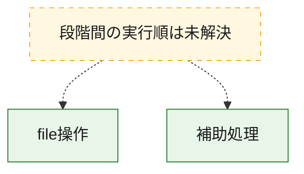
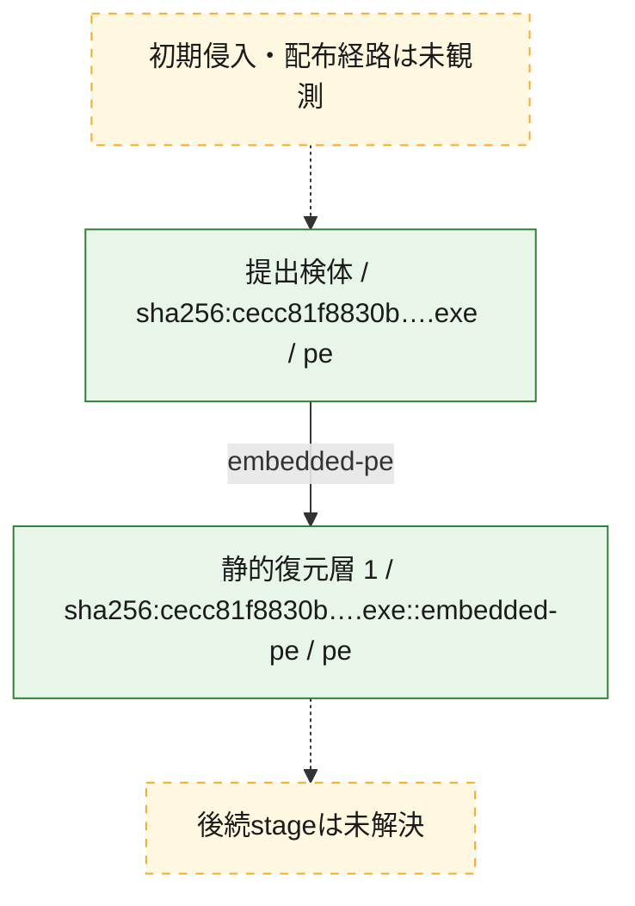
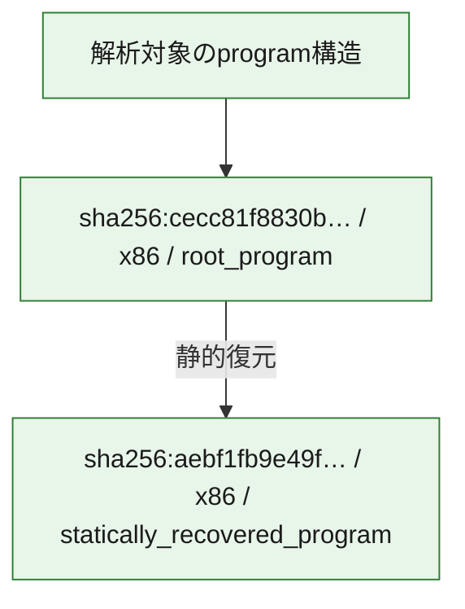

# 全体ロジック：cecc81f8830b3ca7b39a967be79e16bdccc113f2bde6e40f0a235e67e7e6af22

代表関数の静的証跡から、file操作の処理群を確認しました。

## 読み方

- phaseの掲載順は解析上の整理順です。observed_call_edgesがない段階間の実行順を断定しません。
- 図の実線は静的に観測した関係、点線と黄色のノードは未観測・未解決の関係を示します。
- 図は静的な要約であり、動的実行を再現するものではありません。
- 詳細な関数解説とfingerprintは[STATIC-LOGIC.md](STATIC-LOGIC.md)を参照してください。

## 静的可視化

### 実行フロー

### 感染チェーン

### モジュール関係

## 処理段階

### 1. file操作

fileやdirectoryの作成、読書き、削除を確認します。
確度: `confirmed_static_function_evidence`

- `cecc81f8830b3ca7b39a967be79e16bdccc113f2bde6e40f0a235e67e7e6af22:ghidra:00460440` — fileまたはdirectoryの読書き・管理に関係する関数です。 状態: `succeeded`、選定理由: `call_graph_centrality:in=0,out=3`, `reviewed_call_centrality:3`, `reviewed_call_centrality:5`, `role:file_operation`

### 2. 補助処理

主要処理を支える一般内部関数またはlibrary処理を確認します。
確度: `confirmed_static_function_evidence_with_limits`

- `aebf1fb9e49f743c0fe147158df9a041bb7d0fdfba1738a2b50c5ab1a6d3d7f4:ghidra:100108f9` — 外部APIまたはthunkであり、検体固有の関数本体を持ちません。 状態: `excluded_external_or_thunk`、選定理由: `context_representative`, `no_internal_body_structural_fallback`
- `cecc81f8830b3ca7b39a967be79e16bdccc113f2bde6e40f0a235e67e7e6af22:ghidra:00401f60` — 検体内部の一般処理を実装する関数です。 状態: `succeeded`、選定理由: `call_graph_centrality:in=80,out=0`, `reviewed_call_centrality:80`
- `cecc81f8830b3ca7b39a967be79e16bdccc113f2bde6e40f0a235e67e7e6af22:ghidra:004096c0` — 検体内部の一般処理を実装する関数です。 状態: `succeeded`、選定理由: `call_graph_centrality:in=125,out=8`, `large_function:instructions=116`, `reviewed_call_centrality:133`, `reviewed_call_centrality:136`
- `cecc81f8830b3ca7b39a967be79e16bdccc113f2bde6e40f0a235e67e7e6af22:ghidra:004098c0` — 検体内部の一般処理を実装する関数です。 状態: `succeeded`、選定理由: `call_graph_centrality:in=124,out=5`, `reviewed_call_centrality:129`, `reviewed_call_centrality:131`
- `cecc81f8830b3ca7b39a967be79e16bdccc113f2bde6e40f0a235e67e7e6af22:ghidra:0040aed0` — 検体内部の一般処理を実装する関数です。 状態: `succeeded`、選定理由: `call_graph_centrality:in=27,out=18`, `large_function:instructions=509`, `reviewed_call_centrality:45`, `reviewed_call_centrality:46`
- `cecc81f8830b3ca7b39a967be79e16bdccc113f2bde6e40f0a235e67e7e6af22:ghidra:0040b760` — 検体内部の一般処理を実装する関数です。 状態: `succeeded`、選定理由: `call_graph_centrality:in=145,out=2`, `reviewed_call_centrality:147`
- `cecc81f8830b3ca7b39a967be79e16bdccc113f2bde6e40f0a235e67e7e6af22:ghidra:00415cb0` — 検体内部の一般処理を実装する関数です。 状態: `succeeded`、選定理由: `call_graph_centrality:in=1,out=38`, `large_function:instructions=1146`, `reviewed_call_centrality:39`, `reviewed_call_centrality:45`
- `cecc81f8830b3ca7b39a967be79e16bdccc113f2bde6e40f0a235e67e7e6af22:ghidra:00422f10` — 検体内部の一般処理を実装する関数です。 状態: `succeeded`、選定理由: `call_graph_centrality:in=5,out=28`, `large_function:instructions=770`, `reviewed_call_centrality:33`, `reviewed_call_centrality:35`
- `cecc81f8830b3ca7b39a967be79e16bdccc113f2bde6e40f0a235e67e7e6af22:ghidra:00434920` — 検体内部の一般処理を実装する関数です。 状態: `succeeded`、選定理由: `call_graph_centrality:in=196,out=17`, `large_function:instructions=448`, `reviewed_call_centrality:213`
- `cecc81f8830b3ca7b39a967be79e16bdccc113f2bde6e40f0a235e67e7e6af22:ghidra:00435050` — 検体内部の一般処理を実装する関数です。 状態: `succeeded`、選定理由: `call_graph_centrality:in=253,out=2`, `reviewed_call_centrality:255`
- `cecc81f8830b3ca7b39a967be79e16bdccc113f2bde6e40f0a235e67e7e6af22:ghidra:00436800` — 検体内部の一般処理を実装する関数です。 状態: `succeeded`、選定理由: `call_graph_centrality:in=114,out=2`, `reviewed_call_centrality:116`
- `cecc81f8830b3ca7b39a967be79e16bdccc113f2bde6e40f0a235e67e7e6af22:ghidra:00436870` — 検体内部の一般処理を実装する関数です。 状態: `succeeded`、選定理由: `call_graph_centrality:in=114,out=2`, `reviewed_call_centrality:116`
- `cecc81f8830b3ca7b39a967be79e16bdccc113f2bde6e40f0a235e67e7e6af22:ghidra:00436a20` — 検体内部の一般処理を実装する関数です。 状態: `succeeded`、選定理由: `call_graph_centrality:in=84,out=2`, `reviewed_call_centrality:86`
- `cecc81f8830b3ca7b39a967be79e16bdccc113f2bde6e40f0a235e67e7e6af22:ghidra:00436d80` — 検体内部の一般処理を実装する関数です。 状態: `succeeded`、選定理由: `call_graph_centrality:in=60,out=5`, `large_function:instructions=111`, `reviewed_call_centrality:65`, `reviewed_call_centrality:66`
- `cecc81f8830b3ca7b39a967be79e16bdccc113f2bde6e40f0a235e67e7e6af22:ghidra:00436f80` — 検体内部の一般処理を実装する関数です。 状態: `succeeded`、選定理由: `call_graph_centrality:in=45,out=4`, `large_function:instructions=80`, `reviewed_call_centrality:49`
- `cecc81f8830b3ca7b39a967be79e16bdccc113f2bde6e40f0a235e67e7e6af22:ghidra:00437100` — 検体内部の一般処理を実装する関数です。 状態: `succeeded`、選定理由: `call_graph_centrality:in=116,out=2`, `reviewed_call_centrality:118`
- `cecc81f8830b3ca7b39a967be79e16bdccc113f2bde6e40f0a235e67e7e6af22:ghidra:0043c220` — 検体内部の一般処理を実装する関数です。 状態: `succeeded`、選定理由: `call_graph_centrality:in=1,out=41`, `large_function:instructions=876`, `reviewed_call_centrality:42`, `reviewed_call_centrality:47`
- `cecc81f8830b3ca7b39a967be79e16bdccc113f2bde6e40f0a235e67e7e6af22:ghidra:00447b10` — 検体内部の一般処理を実装する関数です。 状態: `succeeded`、選定理由: `call_graph_centrality:in=77,out=9`, `large_function:instructions=400`, `reviewed_call_centrality:86`, `reviewed_call_centrality:88`
- `cecc81f8830b3ca7b39a967be79e16bdccc113f2bde6e40f0a235e67e7e6af22:ghidra:004535f0` — 検体内部の一般処理を実装する関数です。 状態: `succeeded`、選定理由: `call_graph_centrality:in=7,out=25`, `large_function:instructions=1479`, `reviewed_call_centrality:32`, `reviewed_call_centrality:37`
- `cecc81f8830b3ca7b39a967be79e16bdccc113f2bde6e40f0a235e67e7e6af22:ghidra:0045e2e0` — 検体内部の一般処理を実装する関数です。 状態: `limited_bad_instruction_or_flow`、選定理由: `call_graph_centrality:in=65,out=2`, `reviewed_call_centrality:67`, `reviewed_call_centrality:68`
- `cecc81f8830b3ca7b39a967be79e16bdccc113f2bde6e40f0a235e67e7e6af22:ghidra:0045f800` — 検体内部の一般処理を実装する関数です。 状態: `succeeded`、選定理由: `call_graph_centrality:in=255,out=1`, `reviewed_call_centrality:256`
- `cecc81f8830b3ca7b39a967be79e16bdccc113f2bde6e40f0a235e67e7e6af22:ghidra:0045f880` — 検体内部の一般処理を実装する関数です。 状態: `succeeded`、選定理由: `call_graph_centrality:in=267,out=4`, `reviewed_call_centrality:271`
- `cecc81f8830b3ca7b39a967be79e16bdccc113f2bde6e40f0a235e67e7e6af22:ghidra:0045f890` — 検体内部の一般処理を実装する関数です。 状態: `succeeded`、選定理由: `call_graph_centrality:in=79,out=4`, `reviewed_call_centrality:83`
- `cecc81f8830b3ca7b39a967be79e16bdccc113f2bde6e40f0a235e67e7e6af22:ghidra:0045f8a0` — 検体内部の一般処理を実装する関数です。 状態: `succeeded`、選定理由: `call_graph_centrality:in=46,out=4`, `reviewed_call_centrality:50`
- `cecc81f8830b3ca7b39a967be79e16bdccc113f2bde6e40f0a235e67e7e6af22:ghidra:0045f8c0` — 検体内部の一般処理を実装する関数です。 状態: `succeeded`、選定理由: `call_graph_centrality:in=51,out=4`, `reviewed_call_centrality:55`
- `cecc81f8830b3ca7b39a967be79e16bdccc113f2bde6e40f0a235e67e7e6af22:ghidra:0045f8e0` — 検体内部の一般処理を実装する関数です。 状態: `succeeded`、選定理由: `call_graph_centrality:in=76,out=4`, `reviewed_call_centrality:80`
- `cecc81f8830b3ca7b39a967be79e16bdccc113f2bde6e40f0a235e67e7e6af22:ghidra:004600c0` — 検体内部の一般処理を実装する関数です。 状態: `succeeded`、選定理由: `call_graph_centrality:in=68,out=0`, `large_function:instructions=114`, `reviewed_call_centrality:68`
- `cecc81f8830b3ca7b39a967be79e16bdccc113f2bde6e40f0a235e67e7e6af22:ghidra:004b42c0` — 検体内部の一般処理を実装する関数です。 状態: `succeeded`、選定理由: `call_graph_centrality:in=4,out=34`, `large_function:instructions=1986`, `reviewed_call_centrality:38`
- `cecc81f8830b3ca7b39a967be79e16bdccc113f2bde6e40f0a235e67e7e6af22:ghidra:004bb8b0` — 検体内部の一般処理を実装する関数です。 状態: `succeeded`、選定理由: `call_graph_centrality:in=1,out=45`, `large_function:instructions=1920`, `reviewed_call_centrality:46`
- `cecc81f8830b3ca7b39a967be79e16bdccc113f2bde6e40f0a235e67e7e6af22:ghidra:004bda50` — 検体内部の一般処理を実装する関数です。 状態: `succeeded`、選定理由: `call_graph_centrality:in=2,out=33`, `large_function:instructions=2356`, `reviewed_call_centrality:35`
- `cecc81f8830b3ca7b39a967be79e16bdccc113f2bde6e40f0a235e67e7e6af22:ghidra:004c6a30` — 検体内部の一般処理を実装する関数です。 状態: `succeeded`、選定理由: `call_graph_centrality:in=1,out=36`, `large_function:instructions=1061`, `reviewed_call_centrality:37`
- `cecc81f8830b3ca7b39a967be79e16bdccc113f2bde6e40f0a235e67e7e6af22:ghidra:004d4ba0` — 検体内部の一般処理を実装する関数です。 状態: `succeeded`、選定理由: `call_graph_centrality:in=0,out=41`, `large_function:instructions=1094`, `reviewed_call_centrality:41`

## 観測したcall関係

- `cecc81f8830b3ca7b39a967be79e16bdccc113f2bde6e40f0a235e67e7e6af22:ghidra:004096c0` → `cecc81f8830b3ca7b39a967be79e16bdccc113f2bde6e40f0a235e67e7e6af22:ghidra:00435050` （`support` → `support`）
- `cecc81f8830b3ca7b39a967be79e16bdccc113f2bde6e40f0a235e67e7e6af22:ghidra:004096c0` → `cecc81f8830b3ca7b39a967be79e16bdccc113f2bde6e40f0a235e67e7e6af22:ghidra:0045e2e0` （`support` → `support`）
- `cecc81f8830b3ca7b39a967be79e16bdccc113f2bde6e40f0a235e67e7e6af22:ghidra:004098c0` → `cecc81f8830b3ca7b39a967be79e16bdccc113f2bde6e40f0a235e67e7e6af22:ghidra:00435050` （`support` → `support`）
- `cecc81f8830b3ca7b39a967be79e16bdccc113f2bde6e40f0a235e67e7e6af22:ghidra:0040aed0` → `cecc81f8830b3ca7b39a967be79e16bdccc113f2bde6e40f0a235e67e7e6af22:ghidra:00435050` （`support` → `support`）
- `cecc81f8830b3ca7b39a967be79e16bdccc113f2bde6e40f0a235e67e7e6af22:ghidra:0040aed0` → `cecc81f8830b3ca7b39a967be79e16bdccc113f2bde6e40f0a235e67e7e6af22:ghidra:0045f880` （`support` → `support`）
- `cecc81f8830b3ca7b39a967be79e16bdccc113f2bde6e40f0a235e67e7e6af22:ghidra:0040aed0` → `cecc81f8830b3ca7b39a967be79e16bdccc113f2bde6e40f0a235e67e7e6af22:ghidra:0045f890` （`support` → `support`）
- `cecc81f8830b3ca7b39a967be79e16bdccc113f2bde6e40f0a235e67e7e6af22:ghidra:0040b760` → `cecc81f8830b3ca7b39a967be79e16bdccc113f2bde6e40f0a235e67e7e6af22:ghidra:0040aed0` （`support` → `support`）
- `cecc81f8830b3ca7b39a967be79e16bdccc113f2bde6e40f0a235e67e7e6af22:ghidra:00415cb0` → `cecc81f8830b3ca7b39a967be79e16bdccc113f2bde6e40f0a235e67e7e6af22:ghidra:004096c0` （`support` → `support`）
- `cecc81f8830b3ca7b39a967be79e16bdccc113f2bde6e40f0a235e67e7e6af22:ghidra:00415cb0` → `cecc81f8830b3ca7b39a967be79e16bdccc113f2bde6e40f0a235e67e7e6af22:ghidra:004098c0` （`support` → `support`）
- `cecc81f8830b3ca7b39a967be79e16bdccc113f2bde6e40f0a235e67e7e6af22:ghidra:00415cb0` → `cecc81f8830b3ca7b39a967be79e16bdccc113f2bde6e40f0a235e67e7e6af22:ghidra:00435050` （`support` → `support`）
- `cecc81f8830b3ca7b39a967be79e16bdccc113f2bde6e40f0a235e67e7e6af22:ghidra:00415cb0` → `cecc81f8830b3ca7b39a967be79e16bdccc113f2bde6e40f0a235e67e7e6af22:ghidra:00436800` （`support` → `support`）
- `cecc81f8830b3ca7b39a967be79e16bdccc113f2bde6e40f0a235e67e7e6af22:ghidra:00415cb0` → `cecc81f8830b3ca7b39a967be79e16bdccc113f2bde6e40f0a235e67e7e6af22:ghidra:00436870` （`support` → `support`）
- `cecc81f8830b3ca7b39a967be79e16bdccc113f2bde6e40f0a235e67e7e6af22:ghidra:00415cb0` → `cecc81f8830b3ca7b39a967be79e16bdccc113f2bde6e40f0a235e67e7e6af22:ghidra:00436a20` （`support` → `support`）
- `cecc81f8830b3ca7b39a967be79e16bdccc113f2bde6e40f0a235e67e7e6af22:ghidra:00415cb0` → `cecc81f8830b3ca7b39a967be79e16bdccc113f2bde6e40f0a235e67e7e6af22:ghidra:00436d80` （`support` → `support`）
- `cecc81f8830b3ca7b39a967be79e16bdccc113f2bde6e40f0a235e67e7e6af22:ghidra:00415cb0` → `cecc81f8830b3ca7b39a967be79e16bdccc113f2bde6e40f0a235e67e7e6af22:ghidra:00437100` （`support` → `support`）
- `cecc81f8830b3ca7b39a967be79e16bdccc113f2bde6e40f0a235e67e7e6af22:ghidra:00415cb0` → `cecc81f8830b3ca7b39a967be79e16bdccc113f2bde6e40f0a235e67e7e6af22:ghidra:0045e2e0` （`support` → `support`）
- `cecc81f8830b3ca7b39a967be79e16bdccc113f2bde6e40f0a235e67e7e6af22:ghidra:00415cb0` → `cecc81f8830b3ca7b39a967be79e16bdccc113f2bde6e40f0a235e67e7e6af22:ghidra:0045f800` （`support` → `support`）
- `cecc81f8830b3ca7b39a967be79e16bdccc113f2bde6e40f0a235e67e7e6af22:ghidra:00415cb0` → `cecc81f8830b3ca7b39a967be79e16bdccc113f2bde6e40f0a235e67e7e6af22:ghidra:0045f880` （`support` → `support`）
- `cecc81f8830b3ca7b39a967be79e16bdccc113f2bde6e40f0a235e67e7e6af22:ghidra:00422f10` → `cecc81f8830b3ca7b39a967be79e16bdccc113f2bde6e40f0a235e67e7e6af22:ghidra:00435050` （`support` → `support`）
- `cecc81f8830b3ca7b39a967be79e16bdccc113f2bde6e40f0a235e67e7e6af22:ghidra:00422f10` → `cecc81f8830b3ca7b39a967be79e16bdccc113f2bde6e40f0a235e67e7e6af22:ghidra:00436800` （`support` → `support`）
- `cecc81f8830b3ca7b39a967be79e16bdccc113f2bde6e40f0a235e67e7e6af22:ghidra:00422f10` → `cecc81f8830b3ca7b39a967be79e16bdccc113f2bde6e40f0a235e67e7e6af22:ghidra:00436870` （`support` → `support`）
- `cecc81f8830b3ca7b39a967be79e16bdccc113f2bde6e40f0a235e67e7e6af22:ghidra:00422f10` → `cecc81f8830b3ca7b39a967be79e16bdccc113f2bde6e40f0a235e67e7e6af22:ghidra:00436a20` （`support` → `support`）
- `cecc81f8830b3ca7b39a967be79e16bdccc113f2bde6e40f0a235e67e7e6af22:ghidra:00422f10` → `cecc81f8830b3ca7b39a967be79e16bdccc113f2bde6e40f0a235e67e7e6af22:ghidra:00436d80` （`support` → `support`）
- `cecc81f8830b3ca7b39a967be79e16bdccc113f2bde6e40f0a235e67e7e6af22:ghidra:00422f10` → `cecc81f8830b3ca7b39a967be79e16bdccc113f2bde6e40f0a235e67e7e6af22:ghidra:00437100` （`support` → `support`）
- `cecc81f8830b3ca7b39a967be79e16bdccc113f2bde6e40f0a235e67e7e6af22:ghidra:00422f10` → `cecc81f8830b3ca7b39a967be79e16bdccc113f2bde6e40f0a235e67e7e6af22:ghidra:0045e2e0` （`support` → `support`）
- `cecc81f8830b3ca7b39a967be79e16bdccc113f2bde6e40f0a235e67e7e6af22:ghidra:00422f10` → `cecc81f8830b3ca7b39a967be79e16bdccc113f2bde6e40f0a235e67e7e6af22:ghidra:0045f880` （`support` → `support`）
- `cecc81f8830b3ca7b39a967be79e16bdccc113f2bde6e40f0a235e67e7e6af22:ghidra:00434920` → `cecc81f8830b3ca7b39a967be79e16bdccc113f2bde6e40f0a235e67e7e6af22:ghidra:00435050` （`support` → `support`）
- `cecc81f8830b3ca7b39a967be79e16bdccc113f2bde6e40f0a235e67e7e6af22:ghidra:00434920` → `cecc81f8830b3ca7b39a967be79e16bdccc113f2bde6e40f0a235e67e7e6af22:ghidra:00436800` （`support` → `support`）
- `cecc81f8830b3ca7b39a967be79e16bdccc113f2bde6e40f0a235e67e7e6af22:ghidra:00434920` → `cecc81f8830b3ca7b39a967be79e16bdccc113f2bde6e40f0a235e67e7e6af22:ghidra:00436870` （`support` → `support`）
- `cecc81f8830b3ca7b39a967be79e16bdccc113f2bde6e40f0a235e67e7e6af22:ghidra:00434920` → `cecc81f8830b3ca7b39a967be79e16bdccc113f2bde6e40f0a235e67e7e6af22:ghidra:00436a20` （`support` → `support`）
- `cecc81f8830b3ca7b39a967be79e16bdccc113f2bde6e40f0a235e67e7e6af22:ghidra:00434920` → `cecc81f8830b3ca7b39a967be79e16bdccc113f2bde6e40f0a235e67e7e6af22:ghidra:00437100` （`support` → `support`）
- `cecc81f8830b3ca7b39a967be79e16bdccc113f2bde6e40f0a235e67e7e6af22:ghidra:00434920` → `cecc81f8830b3ca7b39a967be79e16bdccc113f2bde6e40f0a235e67e7e6af22:ghidra:0045f800` （`support` → `support`）
- `cecc81f8830b3ca7b39a967be79e16bdccc113f2bde6e40f0a235e67e7e6af22:ghidra:00435050` → `cecc81f8830b3ca7b39a967be79e16bdccc113f2bde6e40f0a235e67e7e6af22:ghidra:0045e2e0` （`support` → `support`）
- `cecc81f8830b3ca7b39a967be79e16bdccc113f2bde6e40f0a235e67e7e6af22:ghidra:00436800` → `cecc81f8830b3ca7b39a967be79e16bdccc113f2bde6e40f0a235e67e7e6af22:ghidra:004096c0` （`support` → `support`）
- `cecc81f8830b3ca7b39a967be79e16bdccc113f2bde6e40f0a235e67e7e6af22:ghidra:00436870` → `cecc81f8830b3ca7b39a967be79e16bdccc113f2bde6e40f0a235e67e7e6af22:ghidra:004098c0` （`support` → `support`）
- `cecc81f8830b3ca7b39a967be79e16bdccc113f2bde6e40f0a235e67e7e6af22:ghidra:00436a20` → `cecc81f8830b3ca7b39a967be79e16bdccc113f2bde6e40f0a235e67e7e6af22:ghidra:00437100` （`support` → `support`）
- `cecc81f8830b3ca7b39a967be79e16bdccc113f2bde6e40f0a235e67e7e6af22:ghidra:00436d80` → `cecc81f8830b3ca7b39a967be79e16bdccc113f2bde6e40f0a235e67e7e6af22:ghidra:0045f880` （`support` → `support`）
- `cecc81f8830b3ca7b39a967be79e16bdccc113f2bde6e40f0a235e67e7e6af22:ghidra:00436d80` → `cecc81f8830b3ca7b39a967be79e16bdccc113f2bde6e40f0a235e67e7e6af22:ghidra:0045f8e0` （`support` → `support`）
- `cecc81f8830b3ca7b39a967be79e16bdccc113f2bde6e40f0a235e67e7e6af22:ghidra:00436f80` → `cecc81f8830b3ca7b39a967be79e16bdccc113f2bde6e40f0a235e67e7e6af22:ghidra:0045f880` （`support` → `support`）
- `cecc81f8830b3ca7b39a967be79e16bdccc113f2bde6e40f0a235e67e7e6af22:ghidra:0043c220` → `cecc81f8830b3ca7b39a967be79e16bdccc113f2bde6e40f0a235e67e7e6af22:ghidra:00401f60` （`support` → `support`）
- `cecc81f8830b3ca7b39a967be79e16bdccc113f2bde6e40f0a235e67e7e6af22:ghidra:0043c220` → `cecc81f8830b3ca7b39a967be79e16bdccc113f2bde6e40f0a235e67e7e6af22:ghidra:004096c0` （`support` → `support`）
- `cecc81f8830b3ca7b39a967be79e16bdccc113f2bde6e40f0a235e67e7e6af22:ghidra:0043c220` → `cecc81f8830b3ca7b39a967be79e16bdccc113f2bde6e40f0a235e67e7e6af22:ghidra:004098c0` （`support` → `support`）
- `cecc81f8830b3ca7b39a967be79e16bdccc113f2bde6e40f0a235e67e7e6af22:ghidra:0043c220` → `cecc81f8830b3ca7b39a967be79e16bdccc113f2bde6e40f0a235e67e7e6af22:ghidra:00435050` （`support` → `support`）
- `cecc81f8830b3ca7b39a967be79e16bdccc113f2bde6e40f0a235e67e7e6af22:ghidra:00447b10` → `cecc81f8830b3ca7b39a967be79e16bdccc113f2bde6e40f0a235e67e7e6af22:ghidra:0040aed0` （`support` → `support`）
- `cecc81f8830b3ca7b39a967be79e16bdccc113f2bde6e40f0a235e67e7e6af22:ghidra:00447b10` → `cecc81f8830b3ca7b39a967be79e16bdccc113f2bde6e40f0a235e67e7e6af22:ghidra:00434920` （`support` → `support`）
- `cecc81f8830b3ca7b39a967be79e16bdccc113f2bde6e40f0a235e67e7e6af22:ghidra:00447b10` → `cecc81f8830b3ca7b39a967be79e16bdccc113f2bde6e40f0a235e67e7e6af22:ghidra:0045f880` （`support` → `support`）
- `cecc81f8830b3ca7b39a967be79e16bdccc113f2bde6e40f0a235e67e7e6af22:ghidra:00447b10` → `cecc81f8830b3ca7b39a967be79e16bdccc113f2bde6e40f0a235e67e7e6af22:ghidra:0045f890` （`support` → `support`）
- `cecc81f8830b3ca7b39a967be79e16bdccc113f2bde6e40f0a235e67e7e6af22:ghidra:00447b10` → `cecc81f8830b3ca7b39a967be79e16bdccc113f2bde6e40f0a235e67e7e6af22:ghidra:004600c0` （`support` → `support`）
- `cecc81f8830b3ca7b39a967be79e16bdccc113f2bde6e40f0a235e67e7e6af22:ghidra:004535f0` → `cecc81f8830b3ca7b39a967be79e16bdccc113f2bde6e40f0a235e67e7e6af22:ghidra:00435050` （`support` → `support`）
- `cecc81f8830b3ca7b39a967be79e16bdccc113f2bde6e40f0a235e67e7e6af22:ghidra:004535f0` → `cecc81f8830b3ca7b39a967be79e16bdccc113f2bde6e40f0a235e67e7e6af22:ghidra:00436800` （`support` → `support`）
- `cecc81f8830b3ca7b39a967be79e16bdccc113f2bde6e40f0a235e67e7e6af22:ghidra:004535f0` → `cecc81f8830b3ca7b39a967be79e16bdccc113f2bde6e40f0a235e67e7e6af22:ghidra:00436870` （`support` → `support`）
- `cecc81f8830b3ca7b39a967be79e16bdccc113f2bde6e40f0a235e67e7e6af22:ghidra:004535f0` → `cecc81f8830b3ca7b39a967be79e16bdccc113f2bde6e40f0a235e67e7e6af22:ghidra:00436a20` （`support` → `support`）
- `cecc81f8830b3ca7b39a967be79e16bdccc113f2bde6e40f0a235e67e7e6af22:ghidra:004535f0` → `cecc81f8830b3ca7b39a967be79e16bdccc113f2bde6e40f0a235e67e7e6af22:ghidra:00436d80` （`support` → `support`）
- `cecc81f8830b3ca7b39a967be79e16bdccc113f2bde6e40f0a235e67e7e6af22:ghidra:004535f0` → `cecc81f8830b3ca7b39a967be79e16bdccc113f2bde6e40f0a235e67e7e6af22:ghidra:00436f80` （`support` → `support`）
- `cecc81f8830b3ca7b39a967be79e16bdccc113f2bde6e40f0a235e67e7e6af22:ghidra:004535f0` → `cecc81f8830b3ca7b39a967be79e16bdccc113f2bde6e40f0a235e67e7e6af22:ghidra:00437100` （`support` → `support`）
- `cecc81f8830b3ca7b39a967be79e16bdccc113f2bde6e40f0a235e67e7e6af22:ghidra:004535f0` → `cecc81f8830b3ca7b39a967be79e16bdccc113f2bde6e40f0a235e67e7e6af22:ghidra:0045f880` （`support` → `support`）
- `cecc81f8830b3ca7b39a967be79e16bdccc113f2bde6e40f0a235e67e7e6af22:ghidra:0045f880` → `cecc81f8830b3ca7b39a967be79e16bdccc113f2bde6e40f0a235e67e7e6af22:ghidra:00434920` （`support` → `support`）
- `cecc81f8830b3ca7b39a967be79e16bdccc113f2bde6e40f0a235e67e7e6af22:ghidra:0045f890` → `cecc81f8830b3ca7b39a967be79e16bdccc113f2bde6e40f0a235e67e7e6af22:ghidra:00434920` （`support` → `support`）
- `cecc81f8830b3ca7b39a967be79e16bdccc113f2bde6e40f0a235e67e7e6af22:ghidra:0045f8a0` → `cecc81f8830b3ca7b39a967be79e16bdccc113f2bde6e40f0a235e67e7e6af22:ghidra:00434920` （`support` → `support`）
- `cecc81f8830b3ca7b39a967be79e16bdccc113f2bde6e40f0a235e67e7e6af22:ghidra:0045f8c0` → `cecc81f8830b3ca7b39a967be79e16bdccc113f2bde6e40f0a235e67e7e6af22:ghidra:00434920` （`support` → `support`）
- `cecc81f8830b3ca7b39a967be79e16bdccc113f2bde6e40f0a235e67e7e6af22:ghidra:0045f8e0` → `cecc81f8830b3ca7b39a967be79e16bdccc113f2bde6e40f0a235e67e7e6af22:ghidra:00434920` （`support` → `support`）
- `cecc81f8830b3ca7b39a967be79e16bdccc113f2bde6e40f0a235e67e7e6af22:ghidra:004b42c0` → `cecc81f8830b3ca7b39a967be79e16bdccc113f2bde6e40f0a235e67e7e6af22:ghidra:0040b760` （`support` → `support`）
- `cecc81f8830b3ca7b39a967be79e16bdccc113f2bde6e40f0a235e67e7e6af22:ghidra:004b42c0` → `cecc81f8830b3ca7b39a967be79e16bdccc113f2bde6e40f0a235e67e7e6af22:ghidra:00434920` （`support` → `support`）
- `cecc81f8830b3ca7b39a967be79e16bdccc113f2bde6e40f0a235e67e7e6af22:ghidra:004b42c0` → `cecc81f8830b3ca7b39a967be79e16bdccc113f2bde6e40f0a235e67e7e6af22:ghidra:00447b10` （`support` → `support`）
- `cecc81f8830b3ca7b39a967be79e16bdccc113f2bde6e40f0a235e67e7e6af22:ghidra:004b42c0` → `cecc81f8830b3ca7b39a967be79e16bdccc113f2bde6e40f0a235e67e7e6af22:ghidra:0045f800` （`support` → `support`）
- `cecc81f8830b3ca7b39a967be79e16bdccc113f2bde6e40f0a235e67e7e6af22:ghidra:004b42c0` → `cecc81f8830b3ca7b39a967be79e16bdccc113f2bde6e40f0a235e67e7e6af22:ghidra:0045f880` （`support` → `support`）
- `cecc81f8830b3ca7b39a967be79e16bdccc113f2bde6e40f0a235e67e7e6af22:ghidra:004b42c0` → `cecc81f8830b3ca7b39a967be79e16bdccc113f2bde6e40f0a235e67e7e6af22:ghidra:004600c0` （`support` → `support`）
- `cecc81f8830b3ca7b39a967be79e16bdccc113f2bde6e40f0a235e67e7e6af22:ghidra:004bb8b0` → `cecc81f8830b3ca7b39a967be79e16bdccc113f2bde6e40f0a235e67e7e6af22:ghidra:0040b760` （`support` → `support`）
- `cecc81f8830b3ca7b39a967be79e16bdccc113f2bde6e40f0a235e67e7e6af22:ghidra:004bb8b0` → `cecc81f8830b3ca7b39a967be79e16bdccc113f2bde6e40f0a235e67e7e6af22:ghidra:00434920` （`support` → `support`）
- `cecc81f8830b3ca7b39a967be79e16bdccc113f2bde6e40f0a235e67e7e6af22:ghidra:004bb8b0` → `cecc81f8830b3ca7b39a967be79e16bdccc113f2bde6e40f0a235e67e7e6af22:ghidra:00447b10` （`support` → `support`）
- `cecc81f8830b3ca7b39a967be79e16bdccc113f2bde6e40f0a235e67e7e6af22:ghidra:004bb8b0` → `cecc81f8830b3ca7b39a967be79e16bdccc113f2bde6e40f0a235e67e7e6af22:ghidra:0045f800` （`support` → `support`）
- `cecc81f8830b3ca7b39a967be79e16bdccc113f2bde6e40f0a235e67e7e6af22:ghidra:004bb8b0` → `cecc81f8830b3ca7b39a967be79e16bdccc113f2bde6e40f0a235e67e7e6af22:ghidra:0045f880` （`support` → `support`）
- `cecc81f8830b3ca7b39a967be79e16bdccc113f2bde6e40f0a235e67e7e6af22:ghidra:004bb8b0` → `cecc81f8830b3ca7b39a967be79e16bdccc113f2bde6e40f0a235e67e7e6af22:ghidra:0045f8c0` （`support` → `support`）
- `cecc81f8830b3ca7b39a967be79e16bdccc113f2bde6e40f0a235e67e7e6af22:ghidra:004bb8b0` → `cecc81f8830b3ca7b39a967be79e16bdccc113f2bde6e40f0a235e67e7e6af22:ghidra:0045f8e0` （`support` → `support`）
- `cecc81f8830b3ca7b39a967be79e16bdccc113f2bde6e40f0a235e67e7e6af22:ghidra:004bb8b0` → `cecc81f8830b3ca7b39a967be79e16bdccc113f2bde6e40f0a235e67e7e6af22:ghidra:004bda50` （`support` → `support`）
- `cecc81f8830b3ca7b39a967be79e16bdccc113f2bde6e40f0a235e67e7e6af22:ghidra:004bda50` → `cecc81f8830b3ca7b39a967be79e16bdccc113f2bde6e40f0a235e67e7e6af22:ghidra:0040b760` （`support` → `support`）
- `cecc81f8830b3ca7b39a967be79e16bdccc113f2bde6e40f0a235e67e7e6af22:ghidra:004bda50` → `cecc81f8830b3ca7b39a967be79e16bdccc113f2bde6e40f0a235e67e7e6af22:ghidra:00434920` （`support` → `support`）
- `cecc81f8830b3ca7b39a967be79e16bdccc113f2bde6e40f0a235e67e7e6af22:ghidra:004bda50` → `cecc81f8830b3ca7b39a967be79e16bdccc113f2bde6e40f0a235e67e7e6af22:ghidra:0045f800` （`support` → `support`）
- `cecc81f8830b3ca7b39a967be79e16bdccc113f2bde6e40f0a235e67e7e6af22:ghidra:004bda50` → `cecc81f8830b3ca7b39a967be79e16bdccc113f2bde6e40f0a235e67e7e6af22:ghidra:0045f8c0` （`support` → `support`）
- `cecc81f8830b3ca7b39a967be79e16bdccc113f2bde6e40f0a235e67e7e6af22:ghidra:004c6a30` → `cecc81f8830b3ca7b39a967be79e16bdccc113f2bde6e40f0a235e67e7e6af22:ghidra:00447b10` （`support` → `support`）
- `cecc81f8830b3ca7b39a967be79e16bdccc113f2bde6e40f0a235e67e7e6af22:ghidra:004c6a30` → `cecc81f8830b3ca7b39a967be79e16bdccc113f2bde6e40f0a235e67e7e6af22:ghidra:0045f800` （`support` → `support`）
- `cecc81f8830b3ca7b39a967be79e16bdccc113f2bde6e40f0a235e67e7e6af22:ghidra:004c6a30` → `cecc81f8830b3ca7b39a967be79e16bdccc113f2bde6e40f0a235e67e7e6af22:ghidra:0045f880` （`support` → `support`）
- `cecc81f8830b3ca7b39a967be79e16bdccc113f2bde6e40f0a235e67e7e6af22:ghidra:004c6a30` → `cecc81f8830b3ca7b39a967be79e16bdccc113f2bde6e40f0a235e67e7e6af22:ghidra:0045f8c0` （`support` → `support`）
- `cecc81f8830b3ca7b39a967be79e16bdccc113f2bde6e40f0a235e67e7e6af22:ghidra:004c6a30` → `cecc81f8830b3ca7b39a967be79e16bdccc113f2bde6e40f0a235e67e7e6af22:ghidra:0045f8e0` （`support` → `support`）
- `cecc81f8830b3ca7b39a967be79e16bdccc113f2bde6e40f0a235e67e7e6af22:ghidra:004c6a30` → `cecc81f8830b3ca7b39a967be79e16bdccc113f2bde6e40f0a235e67e7e6af22:ghidra:004600c0` （`support` → `support`）
- `cecc81f8830b3ca7b39a967be79e16bdccc113f2bde6e40f0a235e67e7e6af22:ghidra:004d4ba0` → `cecc81f8830b3ca7b39a967be79e16bdccc113f2bde6e40f0a235e67e7e6af22:ghidra:0040b760` （`support` → `support`）
- `cecc81f8830b3ca7b39a967be79e16bdccc113f2bde6e40f0a235e67e7e6af22:ghidra:004d4ba0` → `cecc81f8830b3ca7b39a967be79e16bdccc113f2bde6e40f0a235e67e7e6af22:ghidra:00447b10` （`support` → `support`）
- `cecc81f8830b3ca7b39a967be79e16bdccc113f2bde6e40f0a235e67e7e6af22:ghidra:004d4ba0` → `cecc81f8830b3ca7b39a967be79e16bdccc113f2bde6e40f0a235e67e7e6af22:ghidra:0045f800` （`support` → `support`）
- `cecc81f8830b3ca7b39a967be79e16bdccc113f2bde6e40f0a235e67e7e6af22:ghidra:004d4ba0` → `cecc81f8830b3ca7b39a967be79e16bdccc113f2bde6e40f0a235e67e7e6af22:ghidra:0045f880` （`support` → `support`）
- `cecc81f8830b3ca7b39a967be79e16bdccc113f2bde6e40f0a235e67e7e6af22:ghidra:004d4ba0` → `cecc81f8830b3ca7b39a967be79e16bdccc113f2bde6e40f0a235e67e7e6af22:ghidra:0045f8a0` （`support` → `support`）
- `cecc81f8830b3ca7b39a967be79e16bdccc113f2bde6e40f0a235e67e7e6af22:ghidra:004d4ba0` → `cecc81f8830b3ca7b39a967be79e16bdccc113f2bde6e40f0a235e67e7e6af22:ghidra:0045f8e0` （`support` → `support`）
- `ghidra-function:0012196dc33371d7c0e67dd3` → `ghidra-function:0d3e5856be720cb47967cc2e` （`unclassified` → `unclassified`）
- `ghidra-function:0012196dc33371d7c0e67dd3` → `ghidra-function:9102facc843c1719fdf8ea95` （`unclassified` → `unclassified`）
- `ghidra-function:0012196dc33371d7c0e67dd3` → `ghidra-function:b7ef947c58752fa19709cc10` （`unclassified` → `unclassified`）
- `ghidra-function:0012196dc33371d7c0e67dd3` → `ghidra-function:bdfce9b1776dfd1abfab10f7` （`unclassified` → `unclassified`）
- `ghidra-function:0012196dc33371d7c0e67dd3` → `ghidra-function:d64be61cd867ad16e19ed929` （`unclassified` → `unclassified`）
- `ghidra-function:0030c7735de88b8c46b506c5` → `ghidra-function:59699d65c48f62f2874f8659` （`unclassified` → `unclassified`）
- `ghidra-function:0030c7735de88b8c46b506c5` → `ghidra-function:990131837b80065548420f63` （`unclassified` → `unclassified`）
- `ghidra-function:0030c7735de88b8c46b506c5` → `ghidra-function:bd6c321d55248e90ea0e9456` （`unclassified` → `unclassified`）
- `ghidra-function:0030c7735de88b8c46b506c5` → `ghidra-function:bdfce9b1776dfd1abfab10f7` （`unclassified` → `unclassified`）
- `ghidra-function:004e6e8add1b706ec1bbddd9` → `ghidra-function:0d3e5856be720cb47967cc2e` （`unclassified` → `unclassified`）
- `ghidra-function:004e6e8add1b706ec1bbddd9` → `ghidra-function:6ed533603768b337b684c151` （`unclassified` → `unclassified`）
- `ghidra-function:004e6e8add1b706ec1bbddd9` → `ghidra-function:9102facc843c1719fdf8ea95` （`unclassified` → `unclassified`）
- `ghidra-function:004e6e8add1b706ec1bbddd9` → `ghidra-function:b7ef947c58752fa19709cc10` （`unclassified` → `unclassified`）
- `ghidra-function:004e6e8add1b706ec1bbddd9` → `ghidra-function:bdfce9b1776dfd1abfab10f7` （`unclassified` → `unclassified`）
- `ghidra-function:008184e7edd41ec1cf185f38` → `ghidra-function:0dacd65fc09ec4a9d7f61398` （`unclassified` → `unclassified`）
- `ghidra-function:008184e7edd41ec1cf185f38` → `ghidra-function:1bef0c49fcbbfa69c931dd49` （`unclassified` → `unclassified`）
- `ghidra-function:008184e7edd41ec1cf185f38` → `ghidra-function:32270e3bcee1ef83514e47f2` （`unclassified` → `unclassified`）
- `ghidra-function:008184e7edd41ec1cf185f38` → `ghidra-function:39fa05e34a244304f5ae3aa2` （`unclassified` → `unclassified`）
- `ghidra-function:008184e7edd41ec1cf185f38` → `ghidra-function:56d143ec94f7eda017f45674` （`unclassified` → `unclassified`）
- `ghidra-function:008184e7edd41ec1cf185f38` → `ghidra-function:86d48b5772e6844d8ae409ce` （`unclassified` → `unclassified`）
- `ghidra-function:008184e7edd41ec1cf185f38` → `ghidra-function:b7ef947c58752fa19709cc10` （`unclassified` → `unclassified`）
- `ghidra-function:008184e7edd41ec1cf185f38` → `ghidra-function:bdfce9b1776dfd1abfab10f7` （`unclassified` → `unclassified`）
- `ghidra-function:008184e7edd41ec1cf185f38` → `ghidra-function:bef82366da609cec93561b8b` （`unclassified` → `unclassified`）
- `ghidra-function:008184e7edd41ec1cf185f38` → `ghidra-function:bff74d2269285375f30fa4f1` （`unclassified` → `unclassified`）
- `ghidra-function:008184e7edd41ec1cf185f38` → `ghidra-function:f45ef3221f88c3df4edd6a14` （`unclassified` → `unclassified`）
- `ghidra-function:008184e7edd41ec1cf185f38` → `ghidra-function:f9dbd397127702ecf5d04a4d` （`unclassified` → `unclassified`）
- `ghidra-function:008e9c9a82af5839f8b28636` → `ghidra-function:2511d83079d7c4a7d7b398a3` （`unclassified` → `unclassified`）
- `ghidra-function:008e9c9a82af5839f8b28636` → `ghidra-function:2c645dce165a106fe6dac6dd` （`unclassified` → `unclassified`）
- `ghidra-function:008e9c9a82af5839f8b28636` → `ghidra-function:37a4d2d5d4c2d0dc8d50bcff` （`unclassified` → `unclassified`）
- `ghidra-function:008e9c9a82af5839f8b28636` → `ghidra-function:3855c8dda81ae85d018784ef` （`unclassified` → `unclassified`）
- `ghidra-function:008e9c9a82af5839f8b28636` → `ghidra-function:392dffa7c9da9058d3ddd820` （`unclassified` → `unclassified`）
- `ghidra-function:008e9c9a82af5839f8b28636` → `ghidra-function:6da45455f8c109b45b2e04f2` （`unclassified` → `unclassified`）
- `ghidra-function:008e9c9a82af5839f8b28636` → `ghidra-function:82eddf890984dedbc79ca260` （`unclassified` → `unclassified`）
- `ghidra-function:008e9c9a82af5839f8b28636` → `ghidra-function:bdfce9b1776dfd1abfab10f7` （`unclassified` → `unclassified`）
- `ghidra-function:008e9c9a82af5839f8b28636` → `ghidra-function:bf25816cad8bcff2f9ff6357` （`unclassified` → `unclassified`）
- `ghidra-function:009bb835ffaa51d09d28c469` → `ghidra-function:bdfce9b1776dfd1abfab10f7` （`unclassified` → `unclassified`）
- `ghidra-function:009bb835ffaa51d09d28c469` → `ghidra-function:d8c7b9876c86ca70ec6768dc` （`unclassified` → `unclassified`）
- `ghidra-function:00d1317e76fc5232cc0440ad` → `ghidra-function:088a6d49b20a82ebe2530cd2` （`unclassified` → `unclassified`）
- `ghidra-function:00d1317e76fc5232cc0440ad` → `ghidra-function:2511d83079d7c4a7d7b398a3` （`unclassified` → `unclassified`）
- `ghidra-function:00d1317e76fc5232cc0440ad` → `ghidra-function:2c5075eab97a8540a8b42565` （`unclassified` → `unclassified`）
- `ghidra-function:00d1317e76fc5232cc0440ad` → `ghidra-function:2e671d4473f762552d3f65be` （`unclassified` → `unclassified`）
- `ghidra-function:00d1317e76fc5232cc0440ad` → `ghidra-function:335995fd52ed78ff776d5d37` （`unclassified` → `unclassified`）
- `ghidra-function:00d1317e76fc5232cc0440ad` → `ghidra-function:98ed952c76e1ad0ac617fce5` （`unclassified` → `unclassified`）
- `ghidra-function:00d1317e76fc5232cc0440ad` → `ghidra-function:bdfce9b1776dfd1abfab10f7` （`unclassified` → `unclassified`）
- `ghidra-function:00d1317e76fc5232cc0440ad` → `ghidra-function:db6b03e49a70b3132868b411` （`unclassified` → `unclassified`）
- `ghidra-function:0159702dd8f94756f5672316` → `ghidra-function:6da45455f8c109b45b2e04f2` （`unclassified` → `unclassified`）
- `ghidra-function:0159702dd8f94756f5672316` → `ghidra-function:ff7b526593a704f6c04a20f4` （`unclassified` → `unclassified`）
- `ghidra-function:019bcc305308e33ff6de66cb` → `ghidra-function:09c450ea62f50b89bd43a9e9` （`unclassified` → `unclassified`）
- `ghidra-function:019bcc305308e33ff6de66cb` → `ghidra-function:b7ef947c58752fa19709cc10` （`unclassified` → `unclassified`）
- `ghidra-function:019bcc305308e33ff6de66cb` → `ghidra-function:bdfce9b1776dfd1abfab10f7` （`unclassified` → `unclassified`）
- `ghidra-function:019bcc305308e33ff6de66cb` → `ghidra-function:d18f32602c4d93e366fd2024` （`unclassified` → `unclassified`）
- `ghidra-function:01cad190b9964486299b3aab` → `ghidra-function:6b2e52de5d8eef51e517cfbb` （`unclassified` → `unclassified`）
- `ghidra-function:01cad190b9964486299b3aab` → `ghidra-function:a10966df0eaa67d73f127d6a` （`unclassified` → `unclassified`）
- `ghidra-function:01cad190b9964486299b3aab` → `ghidra-function:bdfce9b1776dfd1abfab10f7` （`unclassified` → `unclassified`）
- `ghidra-function:01d03aefce02c8550012f64a` → `ghidra-function:07c5c7804ba7536019db99b3` （`unclassified` → `unclassified`）
- `ghidra-function:01d03aefce02c8550012f64a` → `ghidra-function:9bac6e1fce8373ab8c202df1` （`unclassified` → `unclassified`）
- `ghidra-function:01d03aefce02c8550012f64a` → `ghidra-function:bdfce9b1776dfd1abfab10f7` （`unclassified` → `unclassified`）
- `ghidra-function:01d03aefce02c8550012f64a` → `ghidra-function:bef82366da609cec93561b8b` （`unclassified` → `unclassified`）
- `ghidra-function:01d03aefce02c8550012f64a` → `ghidra-function:e2546b9c92f005dcfbf7483b` （`unclassified` → `unclassified`）
- `ghidra-function:01d03aefce02c8550012f64a` → `ghidra-function:f4bb05301245fd61dace3b5d` （`unclassified` → `unclassified`）
- `ghidra-function:02085f17c4e56696e5f2c6c9` → `ghidra-function:bdfce9b1776dfd1abfab10f7` （`unclassified` → `unclassified`）
- `ghidra-function:02abc1fbc897f0d44817652e` → `ghidra-function:0e95e933e981f9b31610b956` （`unclassified` → `unclassified`）
- `ghidra-function:02abc1fbc897f0d44817652e` → `ghidra-function:0f27cec0f0d13763c6b3a6c9` （`unclassified` → `unclassified`）
- `ghidra-function:02abc1fbc897f0d44817652e` → `ghidra-function:3461c061a240790ae15692cb` （`unclassified` → `unclassified`）
- `ghidra-function:02abc1fbc897f0d44817652e` → `ghidra-function:6216a36b40c37fdd0ebe208c` （`unclassified` → `unclassified`）
- `ghidra-function:02abc1fbc897f0d44817652e` → `ghidra-function:86d48b5772e6844d8ae409ce` （`unclassified` → `unclassified`）
- `ghidra-function:02abc1fbc897f0d44817652e` → `ghidra-function:912b321f43c338a6f78abdba` （`unclassified` → `unclassified`）
- `ghidra-function:02abc1fbc897f0d44817652e` → `ghidra-function:bdfce9b1776dfd1abfab10f7` （`unclassified` → `unclassified`）
- `ghidra-function:02c12175b3c45442a684efd5` → `ghidra-function:3461c061a240790ae15692cb` （`unclassified` → `unclassified`）
- `ghidra-function:02c12175b3c45442a684efd5` → `ghidra-function:bdfce9b1776dfd1abfab10f7` （`unclassified` → `unclassified`）
- `ghidra-function:02dbd82c1edf392df8b32227` → `ghidra-function:58438cc9bc34d5b8a987301c` （`unclassified` → `unclassified`）
- `ghidra-function:02dbd82c1edf392df8b32227` → `ghidra-function:63c338005137f7c021871554` （`unclassified` → `unclassified`）
- `ghidra-function:02dbd82c1edf392df8b32227` → `ghidra-function:bdfce9b1776dfd1abfab10f7` （`unclassified` → `unclassified`）
- `ghidra-function:02dbd82c1edf392df8b32227` → `ghidra-function:bfb665137f96e635f8e0e74b` （`unclassified` → `unclassified`）
- `ghidra-function:02dbd82c1edf392df8b32227` → `ghidra-function:bfc331d1dd4dfd70cce37a24` （`unclassified` → `unclassified`）
- `ghidra-function:02dbd82c1edf392df8b32227` → `ghidra-function:cb0827a458248ed306318fce` （`unclassified` → `unclassified`）
- `ghidra-function:02dbd82c1edf392df8b32227` → `ghidra-function:ebb06a7c1658c1ce3d15312c` （`unclassified` → `unclassified`）
- `ghidra-function:02de5f1658698eef9c8ae316` → `ghidra-function:126a4d2fbbf689b901bf4ebf` （`unclassified` → `unclassified`）
- `ghidra-function:02de5f1658698eef9c8ae316` → `ghidra-function:7766b026875fd51a89877df9` （`unclassified` → `unclassified`）
- `ghidra-function:02de5f1658698eef9c8ae316` → `ghidra-function:86d48b5772e6844d8ae409ce` （`unclassified` → `unclassified`）
- `ghidra-function:02de5f1658698eef9c8ae316` → `ghidra-function:bdfce9b1776dfd1abfab10f7` （`unclassified` → `unclassified`）
- `ghidra-function:02de5f1658698eef9c8ae316` → `ghidra-function:e0b25a3b2e779372cd8a00d5` （`unclassified` → `unclassified`）
- `ghidra-function:02de5f1658698eef9c8ae316` → `ghidra-function:f4bb05301245fd61dace3b5d` （`unclassified` → `unclassified`）
- `ghidra-function:02de5f1658698eef9c8ae316` → `ghidra-function:f9dbd397127702ecf5d04a4d` （`unclassified` → `unclassified`）
- `ghidra-function:032f0ab3f6457b68a0bd2c38` → `ghidra-function:b665d0f099c14279ddde93c4` （`unclassified` → `unclassified`）
- `ghidra-function:032f0ab3f6457b68a0bd2c38` → `ghidra-function:b7ef947c58752fa19709cc10` （`unclassified` → `unclassified`）
- `ghidra-function:032f0ab3f6457b68a0bd2c38` → `ghidra-function:bdfce9b1776dfd1abfab10f7` （`unclassified` → `unclassified`）
- `ghidra-function:032f0ab3f6457b68a0bd2c38` → `ghidra-function:bf48306adb536104c67d89db` （`unclassified` → `unclassified`）
- `ghidra-function:032f0ab3f6457b68a0bd2c38` → `ghidra-function:c59f73ebd5ebe7ba5cef0342` （`unclassified` → `unclassified`）
- `ghidra-function:0335bbc0354930816b986947` → `ghidra-function:75153264a470c0deda377f19` （`unclassified` → `unclassified`）
- `ghidra-function:0335bbc0354930816b986947` → `ghidra-function:bdfce9b1776dfd1abfab10f7` （`unclassified` → `unclassified`）
- `ghidra-function:0335bbc0354930816b986947` → `ghidra-function:cb0ed63cbb4b3c23e2e7a523` （`unclassified` → `unclassified`）
- `ghidra-function:0335bbc0354930816b986947` → `ghidra-function:e2546b9c92f005dcfbf7483b` （`unclassified` → `unclassified`）
- `ghidra-function:0336ec427a08a83853c3c76e` → `ghidra-function:07dee956bc58b9c2232300de` （`unclassified` → `unclassified`）
- `ghidra-function:0336ec427a08a83853c3c76e` → `ghidra-function:480cd24db795062c986336fd` （`unclassified` → `unclassified`）
- `ghidra-function:0336ec427a08a83853c3c76e` → `ghidra-function:8948816feb2aaa0001c8a5bf` （`unclassified` → `unclassified`）
- `ghidra-function:0336ec427a08a83853c3c76e` → `ghidra-function:9e387b890e1ea7bd16baefc8` （`unclassified` → `unclassified`）
- `ghidra-function:0336ec427a08a83853c3c76e` → `ghidra-function:b00de1e773018c3e01e39f27` （`unclassified` → `unclassified`）
- `ghidra-function:0336ec427a08a83853c3c76e` → `ghidra-function:bdfce9b1776dfd1abfab10f7` （`unclassified` → `unclassified`）
- `ghidra-function:0336ec427a08a83853c3c76e` → `ghidra-function:bf48306adb536104c67d89db` （`unclassified` → `unclassified`）
- `ghidra-function:0336ec427a08a83853c3c76e` → `ghidra-function:cb0ed63cbb4b3c23e2e7a523` （`unclassified` → `unclassified`）
- `ghidra-function:0336ec427a08a83853c3c76e` → `ghidra-function:d38bb6e7f1466c6000ba9be0` （`unclassified` → `unclassified`）
- `ghidra-function:0336ec427a08a83853c3c76e` → `ghidra-function:e2546b9c92f005dcfbf7483b` （`unclassified` → `unclassified`）
- `ghidra-function:0336ec427a08a83853c3c76e` → `ghidra-function:f4bb05301245fd61dace3b5d` （`unclassified` → `unclassified`）
- `ghidra-function:03a05aeccb70e1f44c65b2fd` → `ghidra-function:183f6799031ea4ce2c0b3b75` （`unclassified` → `unclassified`）
- `ghidra-function:03a05aeccb70e1f44c65b2fd` → `ghidra-function:30e7da3b810f08bea3192104` （`unclassified` → `unclassified`）
- `ghidra-function:03a05aeccb70e1f44c65b2fd` → `ghidra-function:42dac840600eac704e55ceac` （`unclassified` → `unclassified`）
- `ghidra-function:03a05aeccb70e1f44c65b2fd` → `ghidra-function:b7ef947c58752fa19709cc10` （`unclassified` → `unclassified`）
- `ghidra-function:03a05aeccb70e1f44c65b2fd` → `ghidra-function:bdfce9b1776dfd1abfab10f7` （`unclassified` → `unclassified`）
- 残り7895件は`static-logic.json`に記録しています。

## 解析範囲と制約

- 選定外関数は全体inventoryへ残しますが、関数本体の個別解説対象にはしていません。
- indirect call、難読化、packer、VM、壊れたcontrol flowによりcall関係が欠落する場合があります。
- 文書は静的解析に基づき、検体実行や外部通信による動的確認は行っていません。
