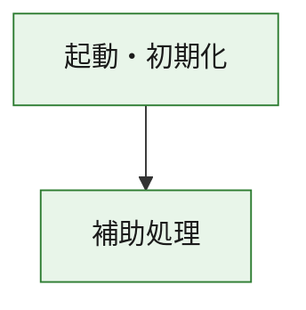
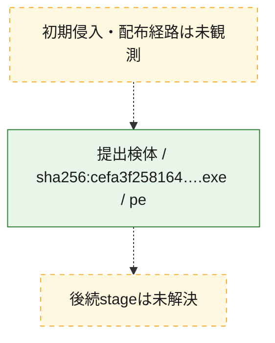
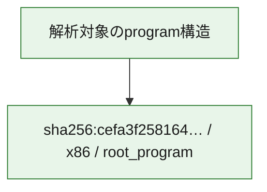

# 全体ロジック：cefa3f258164e6680c6c8f9c728d9dac1a429777f31ed5b2a14e39d6c9329e0f

代表関数の静的証跡から、起動・初期化の処理群を確認しました。

## 読み方

- phaseの掲載順は解析上の整理順です。observed_call_edgesがない段階間の実行順を断定しません。
- 図の実線は静的に観測した関係、点線と黄色のノードは未観測・未解決の関係を示します。
- 図は静的な要約であり、動的実行を再現するものではありません。
- 詳細な関数解説とfingerprintは[STATIC-LOGIC.md](STATIC-LOGIC.md)を参照してください。

## 静的可視化

### 実行フロー

### 感染チェーン

### モジュール関係

## 処理段階

### 1. 起動・初期化

entry pointから初期化と後続処理への移行を確認します。
確度: `confirmed_static_function_evidence`

- `cefa3f258164e6680c6c8f9c728d9dac1a429777f31ed5b2a14e39d6c9329e0f:ghidra:180001010` — 初期化と主要処理への分岐を行う入口関数です。 状態: `succeeded`、選定理由: `entry_point`, `meaningful_symbol_name`, `reviewed_call_centrality:22`, `role:entrypoint`, `small_program_complete_context`

### 2. 補助処理

主要処理を支える一般内部関数またはlibrary処理を確認します。
確度: `confirmed_static_function_evidence`

- `cefa3f258164e6680c6c8f9c728d9dac1a429777f31ed5b2a14e39d6c9329e0f:ghidra:180001240` — 検体内部の一般処理を実装する関数です。 状態: `succeeded`、選定理由: `context_representative`, `reviewed_call_centrality:2`, `small_program_complete_context`
- `cefa3f258164e6680c6c8f9c728d9dac1a429777f31ed5b2a14e39d6c9329e0f:ghidra:180001350` — 検体内部の一般処理を実装する関数です。 状態: `succeeded`、選定理由: `context_representative`, `reviewed_call_centrality:25`, `small_program_complete_context`
- `cefa3f258164e6680c6c8f9c728d9dac1a429777f31ed5b2a14e39d6c9329e0f:ghidra:180003780` — 検体内部の一般処理を実装する関数です。 状態: `succeeded`、選定理由: `context_representative`, `reviewed_call_centrality:2`, `small_program_complete_context`
- `cefa3f258164e6680c6c8f9c728d9dac1a429777f31ed5b2a14e39d6c9329e0f:ghidra:1800038e0` — 検体内部の一般処理を実装する関数です。 状態: `succeeded`、選定理由: `context_representative`, `reviewed_call_centrality:2`, `small_program_complete_context`

## 観測したcall関係

- `cefa3f258164e6680c6c8f9c728d9dac1a429777f31ed5b2a14e39d6c9329e0f:ghidra:180001010` → `cefa3f258164e6680c6c8f9c728d9dac1a429777f31ed5b2a14e39d6c9329e0f:ghidra:180001240` （`startup` → `support`）
- `cefa3f258164e6680c6c8f9c728d9dac1a429777f31ed5b2a14e39d6c9329e0f:ghidra:180001010` → `cefa3f258164e6680c6c8f9c728d9dac1a429777f31ed5b2a14e39d6c9329e0f:ghidra:180001350` （`startup` → `support`）
- `cefa3f258164e6680c6c8f9c728d9dac1a429777f31ed5b2a14e39d6c9329e0f:ghidra:180001350` → `cefa3f258164e6680c6c8f9c728d9dac1a429777f31ed5b2a14e39d6c9329e0f:ghidra:180001240` （`support` → `support`）
- `cefa3f258164e6680c6c8f9c728d9dac1a429777f31ed5b2a14e39d6c9329e0f:ghidra:180001350` → `cefa3f258164e6680c6c8f9c728d9dac1a429777f31ed5b2a14e39d6c9329e0f:ghidra:180003780` （`support` → `support`）
- `cefa3f258164e6680c6c8f9c728d9dac1a429777f31ed5b2a14e39d6c9329e0f:ghidra:180001350` → `cefa3f258164e6680c6c8f9c728d9dac1a429777f31ed5b2a14e39d6c9329e0f:ghidra:1800038e0` （`support` → `support`）
- `cefa3f258164e6680c6c8f9c728d9dac1a429777f31ed5b2a14e39d6c9329e0f:ghidra:180003780` → `cefa3f258164e6680c6c8f9c728d9dac1a429777f31ed5b2a14e39d6c9329e0f:ghidra:1800038e0` （`support` → `support`）
- `ghidra-function:8d986d677b59abf007f5b674` → `ghidra-external:034e9f2c8b29d640bdcbffbd` （`unclassified` → `unclassified`）
- `ghidra-function:8d986d677b59abf007f5b674` → `ghidra-external:1848620f97630cbbdcf618e1` （`unclassified` → `unclassified`）
- `ghidra-function:8d986d677b59abf007f5b674` → `ghidra-external:1891cef45610ca5f024199bd` （`unclassified` → `unclassified`）
- `ghidra-function:8d986d677b59abf007f5b674` → `ghidra-external:1c9f7cc140d9c0302b0cff7c` （`unclassified` → `unclassified`）
- `ghidra-function:8d986d677b59abf007f5b674` → `ghidra-external:25b5db7e7668e045c1489955` （`unclassified` → `unclassified`）
- `ghidra-function:8d986d677b59abf007f5b674` → `ghidra-external:3fee952bb9d0d670cf92504f` （`unclassified` → `unclassified`）
- `ghidra-function:8d986d677b59abf007f5b674` → `ghidra-external:577052b3f4ea6bb3225ed2c3` （`unclassified` → `unclassified`）
- `ghidra-function:8d986d677b59abf007f5b674` → `ghidra-external:62b5af210b8af0a243b2e686` （`unclassified` → `unclassified`）
- `ghidra-function:8d986d677b59abf007f5b674` → `ghidra-external:719af781dc89c9138ee548cb` （`unclassified` → `unclassified`）
- `ghidra-function:8d986d677b59abf007f5b674` → `ghidra-external:7251de6e2567dac9b0e8b423` （`unclassified` → `unclassified`）
- `ghidra-function:8d986d677b59abf007f5b674` → `ghidra-external:8cdf77e094f961639a063627` （`unclassified` → `unclassified`）
- `ghidra-function:8d986d677b59abf007f5b674` → `ghidra-external:97613301a52687ded85a1091` （`unclassified` → `unclassified`）
- `ghidra-function:8d986d677b59abf007f5b674` → `ghidra-external:9b5cecf13fea9680363a6c35` （`unclassified` → `unclassified`）
- `ghidra-function:8d986d677b59abf007f5b674` → `ghidra-external:a042cd188dd594f1eef8b2d8` （`unclassified` → `unclassified`）
- `ghidra-function:8d986d677b59abf007f5b674` → `ghidra-external:a293edc1b799ef9cda4da502` （`unclassified` → `unclassified`）
- `ghidra-function:8d986d677b59abf007f5b674` → `ghidra-external:bc8d73cf9615f41f712872bd` （`unclassified` → `unclassified`）
- `ghidra-function:8d986d677b59abf007f5b674` → `ghidra-external:c3a4c296728de78c300f0cdc` （`unclassified` → `unclassified`）
- `ghidra-function:8d986d677b59abf007f5b674` → `ghidra-external:c3bd070864f4072577f3277f` （`unclassified` → `unclassified`）
- `ghidra-function:8d986d677b59abf007f5b674` → `ghidra-external:cbccc7d0ebf589e7d573987a` （`unclassified` → `unclassified`）
- `ghidra-function:8d986d677b59abf007f5b674` → `ghidra-external:f74920c81e9206f24bb9c7d4` （`unclassified` → `unclassified`）
- `ghidra-function:8d986d677b59abf007f5b674` → `ghidra-external:fba1bcce0fe058e0abab8997` （`unclassified` → `unclassified`）
- `ghidra-function:8d986d677b59abf007f5b674` → `ghidra-function:0260ccfbc2bef97e38f28b9e` （`unclassified` → `unclassified`）
- `ghidra-function:8d986d677b59abf007f5b674` → `ghidra-function:91a2de1a2d7e0b25f5ed2e45` （`unclassified` → `unclassified`）
- `ghidra-function:8d986d677b59abf007f5b674` → `ghidra-function:d0db4f3fd6658e7ae02f7380` （`unclassified` → `unclassified`）
- `ghidra-function:91a2de1a2d7e0b25f5ed2e45` → `ghidra-function:d0db4f3fd6658e7ae02f7380` （`unclassified` → `unclassified`）
- `ghidra-function:e514dfecddc254dc787a15a5` → `ghidra-function:0260ccfbc2bef97e38f28b9e` （`unclassified` → `unclassified`）
- `ghidra-function:e514dfecddc254dc787a15a5` → `ghidra-function:06a0f52a0941fbe7cf4b13db` （`unclassified` → `unclassified`）
- `ghidra-function:e514dfecddc254dc787a15a5` → `ghidra-function:0982f006de6e89d5f5f21d2c` （`unclassified` → `unclassified`）
- `ghidra-function:e514dfecddc254dc787a15a5` → `ghidra-function:1fdd82d1e90ec20eab848724` （`unclassified` → `unclassified`）
- `ghidra-function:e514dfecddc254dc787a15a5` → `ghidra-function:234e239b8020fef24628698c` （`unclassified` → `unclassified`）
- `ghidra-function:e514dfecddc254dc787a15a5` → `ghidra-function:34b8e780df9a095ad581ed0e` （`unclassified` → `unclassified`）
- `ghidra-function:e514dfecddc254dc787a15a5` → `ghidra-function:69a7404ff4288064bd129817` （`unclassified` → `unclassified`）
- `ghidra-function:e514dfecddc254dc787a15a5` → `ghidra-function:733d03ac8b3e031db4dcf717` （`unclassified` → `unclassified`）
- `ghidra-function:e514dfecddc254dc787a15a5` → `ghidra-function:8d986d677b59abf007f5b674` （`unclassified` → `unclassified`）
- `ghidra-function:e514dfecddc254dc787a15a5` → `ghidra-function:90eeab0833c48dc76e5d6b83` （`unclassified` → `unclassified`）
- `ghidra-function:e514dfecddc254dc787a15a5` → `ghidra-function:a18c8cf1750a06e8539c9377` （`unclassified` → `unclassified`）
- `ghidra-function:e514dfecddc254dc787a15a5` → `ghidra-function:bc4cbe061caff83d945ec2cc` （`unclassified` → `unclassified`）

## 解析範囲と制約

- 選定外関数は全体inventoryへ残しますが、関数本体の個別解説対象にはしていません。
- indirect call、難読化、packer、VM、壊れたcontrol flowによりcall関係が欠落する場合があります。
- 文書は静的解析に基づき、検体実行や外部通信による動的確認は行っていません。
