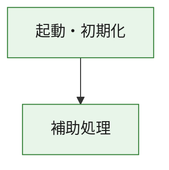
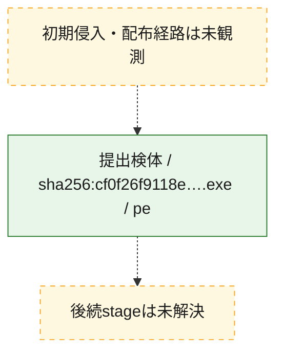
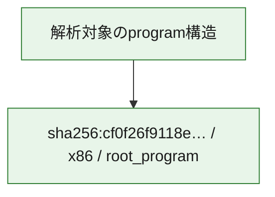

# 全体ロジック：cf0f26f9118eca9ceeda89b8d14471de340ef2b4e51e953cf082745d94435e4a

代表関数の静的証跡から、起動・初期化の処理群を確認しました。

## 読み方

- phaseの掲載順は解析上の整理順です。observed_call_edgesがない段階間の実行順を断定しません。
- 図の実線は静的に観測した関係、点線と黄色のノードは未観測・未解決の関係を示します。
- 図は静的な要約であり、動的実行を再現するものではありません。
- 詳細な関数解説とfingerprintは[STATIC-LOGIC.md](STATIC-LOGIC.md)を参照してください。

## 静的可視化

### 実行フロー

### 感染チェーン

### モジュール関係

## 処理段階

### 1. 起動・初期化

entry pointから初期化と後続処理への移行を確認します。
確度: `confirmed_static_function_evidence`

- `cf0f26f9118eca9ceeda89b8d14471de340ef2b4e51e953cf082745d94435e4a:ghidra:180001010` — 初期化と主要処理への分岐を行う入口関数です。 状態: `succeeded`、選定理由: `entry_point`, `meaningful_symbol_name`, `reviewed_call_centrality:22`, `role:entrypoint`, `small_program_complete_context`

### 2. 補助処理

主要処理を支える一般内部関数またはlibrary処理を確認します。
確度: `confirmed_static_function_evidence`

- `cf0f26f9118eca9ceeda89b8d14471de340ef2b4e51e953cf082745d94435e4a:ghidra:180001240` — 検体内部の一般処理を実装する関数です。 状態: `succeeded`、選定理由: `context_representative`, `reviewed_call_centrality:2`, `small_program_complete_context`
- `cf0f26f9118eca9ceeda89b8d14471de340ef2b4e51e953cf082745d94435e4a:ghidra:180001350` — 検体内部の一般処理を実装する関数です。 状態: `succeeded`、選定理由: `context_representative`, `reviewed_call_centrality:25`, `small_program_complete_context`
- `cf0f26f9118eca9ceeda89b8d14471de340ef2b4e51e953cf082745d94435e4a:ghidra:180003780` — 検体内部の一般処理を実装する関数です。 状態: `succeeded`、選定理由: `context_representative`, `reviewed_call_centrality:2`, `small_program_complete_context`
- `cf0f26f9118eca9ceeda89b8d14471de340ef2b4e51e953cf082745d94435e4a:ghidra:1800038e0` — 検体内部の一般処理を実装する関数です。 状態: `succeeded`、選定理由: `context_representative`, `reviewed_call_centrality:2`, `small_program_complete_context`

## 観測したcall関係

- `cf0f26f9118eca9ceeda89b8d14471de340ef2b4e51e953cf082745d94435e4a:ghidra:180001010` → `cf0f26f9118eca9ceeda89b8d14471de340ef2b4e51e953cf082745d94435e4a:ghidra:180001240` （`startup` → `support`）
- `cf0f26f9118eca9ceeda89b8d14471de340ef2b4e51e953cf082745d94435e4a:ghidra:180001010` → `cf0f26f9118eca9ceeda89b8d14471de340ef2b4e51e953cf082745d94435e4a:ghidra:180001350` （`startup` → `support`）
- `cf0f26f9118eca9ceeda89b8d14471de340ef2b4e51e953cf082745d94435e4a:ghidra:180001350` → `cf0f26f9118eca9ceeda89b8d14471de340ef2b4e51e953cf082745d94435e4a:ghidra:180001240` （`support` → `support`）
- `cf0f26f9118eca9ceeda89b8d14471de340ef2b4e51e953cf082745d94435e4a:ghidra:180001350` → `cf0f26f9118eca9ceeda89b8d14471de340ef2b4e51e953cf082745d94435e4a:ghidra:180003780` （`support` → `support`）
- `cf0f26f9118eca9ceeda89b8d14471de340ef2b4e51e953cf082745d94435e4a:ghidra:180001350` → `cf0f26f9118eca9ceeda89b8d14471de340ef2b4e51e953cf082745d94435e4a:ghidra:1800038e0` （`support` → `support`）
- `cf0f26f9118eca9ceeda89b8d14471de340ef2b4e51e953cf082745d94435e4a:ghidra:180003780` → `cf0f26f9118eca9ceeda89b8d14471de340ef2b4e51e953cf082745d94435e4a:ghidra:1800038e0` （`support` → `support`）
- `ghidra-function:5e792f137425f3b356718ab8` → `ghidra-external:01e7220e19f4f6789b02a839` （`unclassified` → `unclassified`）
- `ghidra-function:5e792f137425f3b356718ab8` → `ghidra-external:120ade7d5ad7af1f5fd8f28d` （`unclassified` → `unclassified`）
- `ghidra-function:5e792f137425f3b356718ab8` → `ghidra-external:1dfb3d92b37e71acef067ab5` （`unclassified` → `unclassified`）
- `ghidra-function:5e792f137425f3b356718ab8` → `ghidra-external:29105daa0510e527f186d692` （`unclassified` → `unclassified`）
- `ghidra-function:5e792f137425f3b356718ab8` → `ghidra-external:2db91eef3ca0df77a0f94f3f` （`unclassified` → `unclassified`）
- `ghidra-function:5e792f137425f3b356718ab8` → `ghidra-external:4d1c8504bf9b724719cdb66b` （`unclassified` → `unclassified`）
- `ghidra-function:5e792f137425f3b356718ab8` → `ghidra-external:4e0d208b1ef634f6c8edbd44` （`unclassified` → `unclassified`）
- `ghidra-function:5e792f137425f3b356718ab8` → `ghidra-external:546dfe2dbc0fc931c4607b2a` （`unclassified` → `unclassified`）
- `ghidra-function:5e792f137425f3b356718ab8` → `ghidra-external:5f4597feb528d488a13e206a` （`unclassified` → `unclassified`）
- `ghidra-function:5e792f137425f3b356718ab8` → `ghidra-external:71d632931deaddb80aa08f3b` （`unclassified` → `unclassified`）
- `ghidra-function:5e792f137425f3b356718ab8` → `ghidra-external:73c0a5a3570f6db6cfd72017` （`unclassified` → `unclassified`）
- `ghidra-function:5e792f137425f3b356718ab8` → `ghidra-external:83e03134df0293a304f52fe5` （`unclassified` → `unclassified`）
- `ghidra-function:5e792f137425f3b356718ab8` → `ghidra-external:87854f6b053b39cd96c9f7f7` （`unclassified` → `unclassified`）
- `ghidra-function:5e792f137425f3b356718ab8` → `ghidra-external:8de70f27d4517f16a86362a6` （`unclassified` → `unclassified`）
- `ghidra-function:5e792f137425f3b356718ab8` → `ghidra-external:9ae17a2243ed6bdfd6886a0f` （`unclassified` → `unclassified`）
- `ghidra-function:5e792f137425f3b356718ab8` → `ghidra-external:9d25788b633d27cf352e0e2d` （`unclassified` → `unclassified`）
- `ghidra-function:5e792f137425f3b356718ab8` → `ghidra-external:bf26f39c9ab6bd98e1708069` （`unclassified` → `unclassified`）
- `ghidra-function:5e792f137425f3b356718ab8` → `ghidra-external:cdc0cb921447e284832d3212` （`unclassified` → `unclassified`）
- `ghidra-function:5e792f137425f3b356718ab8` → `ghidra-external:dedbfb602c23622ee2c539fb` （`unclassified` → `unclassified`）
- `ghidra-function:5e792f137425f3b356718ab8` → `ghidra-external:df977b825c5194397260c3d2` （`unclassified` → `unclassified`）
- `ghidra-function:5e792f137425f3b356718ab8` → `ghidra-external:f9043d7b9be2e262f8a6decd` （`unclassified` → `unclassified`）
- `ghidra-function:5e792f137425f3b356718ab8` → `ghidra-function:39c801a88b96550c19ea8c88` （`unclassified` → `unclassified`）
- `ghidra-function:5e792f137425f3b356718ab8` → `ghidra-function:915d1c3eabf5ee984db24727` （`unclassified` → `unclassified`）
- `ghidra-function:5e792f137425f3b356718ab8` → `ghidra-function:d5313e2dbb7643e463992f2a` （`unclassified` → `unclassified`）
- `ghidra-function:726ee7710e464ec04c0c07a9` → `ghidra-function:184146fe9b72b05aa3b33b3b` （`unclassified` → `unclassified`）
- `ghidra-function:726ee7710e464ec04c0c07a9` → `ghidra-function:1fc1ef1bfab7746849079eae` （`unclassified` → `unclassified`）
- `ghidra-function:726ee7710e464ec04c0c07a9` → `ghidra-function:260ae09bd2c468420e00ebed` （`unclassified` → `unclassified`）
- `ghidra-function:726ee7710e464ec04c0c07a9` → `ghidra-function:34c435ba85120ee1bb04e9e4` （`unclassified` → `unclassified`）
- `ghidra-function:726ee7710e464ec04c0c07a9` → `ghidra-function:377533b9231f7be21b8e57da` （`unclassified` → `unclassified`）
- `ghidra-function:726ee7710e464ec04c0c07a9` → `ghidra-function:39c801a88b96550c19ea8c88` （`unclassified` → `unclassified`）
- `ghidra-function:726ee7710e464ec04c0c07a9` → `ghidra-function:5e792f137425f3b356718ab8` （`unclassified` → `unclassified`）
- `ghidra-function:726ee7710e464ec04c0c07a9` → `ghidra-function:8ece8c5b5167d44b69f5316c` （`unclassified` → `unclassified`）
- `ghidra-function:726ee7710e464ec04c0c07a9` → `ghidra-function:ba19f7e237540af7e32fe145` （`unclassified` → `unclassified`）
- `ghidra-function:726ee7710e464ec04c0c07a9` → `ghidra-function:d03ce792e83fcc57950f438c` （`unclassified` → `unclassified`）
- `ghidra-function:726ee7710e464ec04c0c07a9` → `ghidra-function:d3f350dc1a2e62c690fe5591` （`unclassified` → `unclassified`）
- `ghidra-function:726ee7710e464ec04c0c07a9` → `ghidra-function:fc85fd1b03ec8f4006a4be62` （`unclassified` → `unclassified`）
- `ghidra-function:915d1c3eabf5ee984db24727` → `ghidra-function:d5313e2dbb7643e463992f2a` （`unclassified` → `unclassified`）

## 解析範囲と制約

- 選定外関数は全体inventoryへ残しますが、関数本体の個別解説対象にはしていません。
- indirect call、難読化、packer、VM、壊れたcontrol flowによりcall関係が欠落する場合があります。
- 文書は静的解析に基づき、検体実行や外部通信による動的確認は行っていません。
