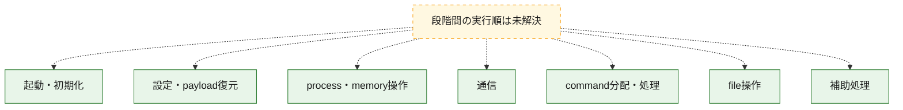
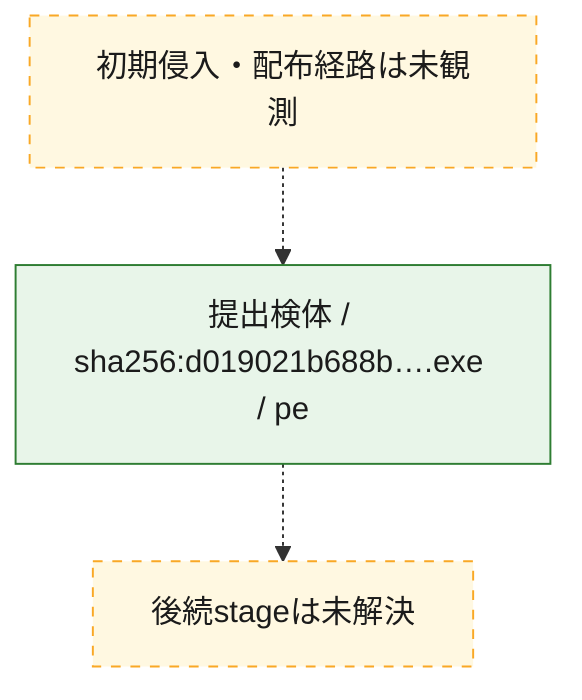
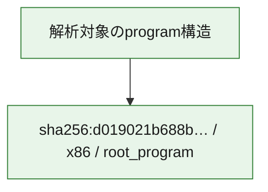

# 全体ロジック：d019021b688b5589ad8a45fe2541967649b2cd9c89fdd49074c844f518887fff

代表関数の静的証跡から、起動・初期化、設定・payload復元、process・memory操作、通信、command分配・処理、file操作の処理群を確認しました。

## 読み方

- phaseの掲載順は解析上の整理順です。observed_call_edgesがない段階間の実行順を断定しません。
- 図の実線は静的に観測した関係、点線と黄色のノードは未観測・未解決の関係を示します。
- 図は静的な要約であり、動的実行を再現するものではありません。
- 詳細な関数解説とfingerprintは[STATIC-LOGIC.md](STATIC-LOGIC.md)を参照してください。

## 静的可視化

### 実行フロー

### 感染チェーン

### モジュール関係

## 処理段階

### 1. 起動・初期化

entry pointから初期化と後続処理への移行を確認します。
確度: `confirmed_static_function_evidence`

- `d019021b688b5589ad8a45fe2541967649b2cd9c89fdd49074c844f518887fff:ghidra:1400ac100` — 初期化と主要処理への分岐を行う入口関数です。 状態: `succeeded`、選定理由: `entry_point`, `meaningful_symbol_name`, `probable_go_main_user_code`, `reviewed_call_centrality:5`, `role:entrypoint`
- `d019021b688b5589ad8a45fe2541967649b2cd9c89fdd49074c844f518887fff:ghidra:1400ac2c0` — 初期化と主要処理への分岐を行う入口関数です。 状態: `succeeded`、選定理由: `entry_point`, `meaningful_symbol_name`, `probable_go_main_user_code`, `reviewed_call_centrality:15`, `role:entrypoint`
- `d019021b688b5589ad8a45fe2541967649b2cd9c89fdd49074c844f518887fff:ghidra:1400ae180` — 初期化と主要処理への分岐を行う入口関数です。 状態: `succeeded`、選定理由: `entry_point`, `meaningful_symbol_name`, `probable_go_main_user_code`, `reviewed_call_centrality:22`, `role:entrypoint`
- `d019021b688b5589ad8a45fe2541967649b2cd9c89fdd49074c844f518887fff:ghidra:1400b18c0` — 初期化と主要処理への分岐を行う入口関数です。 状態: `succeeded`、選定理由: `entry_point`, `meaningful_symbol_name`, `probable_go_main_user_code`, `reviewed_call_centrality:17`, `role:entrypoint`
- `d019021b688b5589ad8a45fe2541967649b2cd9c89fdd49074c844f518887fff:ghidra:1400b6240` — 初期化と主要処理への分岐を行う入口関数です。 状態: `succeeded`、選定理由: `entry_point`, `meaningful_symbol_name`, `probable_go_main_user_code`, `reviewed_call_centrality:14`, `role:entrypoint`
- `d019021b688b5589ad8a45fe2541967649b2cd9c89fdd49074c844f518887fff:ghidra:1400ba020` — 初期化と主要処理への分岐を行う入口関数です。 状態: `succeeded`、選定理由: `entry_point`, `meaningful_symbol_name`, `probable_go_main_user_code`, `reviewed_call_centrality:16`, `role:entrypoint`
- `d019021b688b5589ad8a45fe2541967649b2cd9c89fdd49074c844f518887fff:ghidra:1400c3980` — 初期化と主要処理への分岐を行う入口関数です。 状態: `succeeded`、選定理由: `entry_point`, `meaningful_symbol_name`, `probable_go_main_user_code`, `reviewed_call_centrality:15`, `role:entrypoint`
- `d019021b688b5589ad8a45fe2541967649b2cd9c89fdd49074c844f518887fff:ghidra:1400c6d40` — 初期化と主要処理への分岐を行う入口関数です。 状態: `succeeded`、選定理由: `entry_point`, `meaningful_symbol_name`, `probable_go_main_user_code`, `reviewed_call_centrality:17`, `role:entrypoint`
- `d019021b688b5589ad8a45fe2541967649b2cd9c89fdd49074c844f518887fff:ghidra:1400ca180` — 初期化と主要処理への分岐を行う入口関数です。 状態: `succeeded`、選定理由: `entry_point`, `meaningful_symbol_name`, `probable_go_main_user_code`, `reviewed_call_centrality:12`, `role:entrypoint`
- `d019021b688b5589ad8a45fe2541967649b2cd9c89fdd49074c844f518887fff:ghidra:1400d0880` — 初期化と主要処理への分岐を行う入口関数です。 状態: `succeeded`、選定理由: `entry_point`, `meaningful_symbol_name`, `probable_go_main_user_code`, `reviewed_call_centrality:12`, `role:entrypoint`
- `d019021b688b5589ad8a45fe2541967649b2cd9c89fdd49074c844f518887fff:ghidra:1400d31e0` — 初期化と主要処理への分岐を行う入口関数です。 状態: `succeeded`、選定理由: `entry_point`, `meaningful_symbol_name`, `probable_go_main_user_code`, `reviewed_call_centrality:15`, `role:entrypoint`
- `d019021b688b5589ad8a45fe2541967649b2cd9c89fdd49074c844f518887fff:ghidra:1400d7a00` — 初期化と主要処理への分岐を行う入口関数です。 状態: `succeeded`、選定理由: `entry_point`, `meaningful_symbol_name`, `probable_go_main_user_code`, `reviewed_call_centrality:13`, `role:entrypoint`
- `d019021b688b5589ad8a45fe2541967649b2cd9c89fdd49074c844f518887fff:ghidra:1400dada0` — 初期化と主要処理への分岐を行う入口関数です。 状態: `succeeded`、選定理由: `entry_point`, `meaningful_symbol_name`, `probable_go_main_user_code`, `reviewed_call_centrality:13`, `role:entrypoint`
- `d019021b688b5589ad8a45fe2541967649b2cd9c89fdd49074c844f518887fff:ghidra:1400e3d60` — 初期化と主要処理への分岐を行う入口関数です。 状態: `succeeded`、選定理由: `entry_point`, `meaningful_symbol_name`, `probable_go_main_user_code`, `reviewed_call_centrality:18`, `role:entrypoint`
- `d019021b688b5589ad8a45fe2541967649b2cd9c89fdd49074c844f518887fff:ghidra:1400e71e0` — 初期化と主要処理への分岐を行う入口関数です。 状態: `succeeded`、選定理由: `entry_point`, `meaningful_symbol_name`, `probable_go_main_user_code`, `reviewed_call_centrality:16`, `role:entrypoint`
- `d019021b688b5589ad8a45fe2541967649b2cd9c89fdd49074c844f518887fff:ghidra:1400ebc00` — 初期化と主要処理への分岐を行う入口関数です。 状態: `succeeded`、選定理由: `entry_point`, `meaningful_symbol_name`, `probable_go_main_user_code`, `reviewed_call_centrality:21`, `role:entrypoint`
- `d019021b688b5589ad8a45fe2541967649b2cd9c89fdd49074c844f518887fff:ghidra:1400f7700` — 初期化と主要処理への分岐を行う入口関数です。 状態: `succeeded`、選定理由: `entry_point`, `meaningful_symbol_name`, `probable_go_main_user_code`, `reviewed_call_centrality:17`, `role:entrypoint`
- `d019021b688b5589ad8a45fe2541967649b2cd9c89fdd49074c844f518887fff:ghidra:1400fdf20` — 初期化と主要処理への分岐を行う入口関数です。 状態: `succeeded`、選定理由: `entry_point`, `meaningful_symbol_name`, `probable_go_main_user_code`, `reviewed_call_centrality:21`, `role:entrypoint`
- `d019021b688b5589ad8a45fe2541967649b2cd9c89fdd49074c844f518887fff:ghidra:140104880` — 初期化と主要処理への分岐を行う入口関数です。 状態: `succeeded`、選定理由: `entry_point`, `meaningful_symbol_name`, `probable_go_main_user_code`, `reviewed_call_centrality:22`, `role:entrypoint`
- `d019021b688b5589ad8a45fe2541967649b2cd9c89fdd49074c844f518887fff:ghidra:14010c5a0` — 初期化と主要処理への分岐を行う入口関数です。 状態: `succeeded`、選定理由: `entry_point`, `meaningful_symbol_name`, `probable_go_main_user_code`, `reviewed_call_centrality:28`, `role:entrypoint`
- `d019021b688b5589ad8a45fe2541967649b2cd9c89fdd49074c844f518887fff:ghidra:14012b740` — 初期化と主要処理への分岐を行う入口関数です。 状態: `succeeded`、選定理由: `entry_point`, `meaningful_symbol_name`, `probable_go_main_user_code`, `reviewed_call_centrality:37`, `role:entrypoint`
- `d019021b688b5589ad8a45fe2541967649b2cd9c89fdd49074c844f518887fff:ghidra:1401447e0` — 初期化と主要処理への分岐を行う入口関数です。 状態: `succeeded`、選定理由: `entry_point`, `meaningful_symbol_name`, `probable_go_main_user_code`, `reviewed_call_centrality:12`, `role:entrypoint`
- `d019021b688b5589ad8a45fe2541967649b2cd9c89fdd49074c844f518887fff:ghidra:140147b60` — 初期化と主要処理への分岐を行う入口関数です。 状態: `succeeded`、選定理由: `entry_point`, `meaningful_symbol_name`, `probable_go_main_user_code`, `reviewed_call_centrality:15`, `role:entrypoint`
- `d019021b688b5589ad8a45fe2541967649b2cd9c89fdd49074c844f518887fff:ghidra:14014ae80` — 初期化と主要処理への分岐を行う入口関数です。 状態: `succeeded`、選定理由: `entry_point`, `meaningful_symbol_name`, `probable_go_main_user_code`, `reviewed_call_centrality:15`, `role:entrypoint`
- `d019021b688b5589ad8a45fe2541967649b2cd9c89fdd49074c844f518887fff:ghidra:14014f660` — 初期化と主要処理への分岐を行う入口関数です。 状態: `succeeded`、選定理由: `entry_point`, `meaningful_symbol_name`, `probable_go_main_user_code`, `reviewed_call_centrality:12`, `role:entrypoint`

### 2. 設定・payload復元

設定、resource、payload、暗号化データの復元・変換を確認します。
確度: `confirmed_static_function_evidence`

- `d019021b688b5589ad8a45fe2541967649b2cd9c89fdd49074c844f518887fff:ghidra:140087de0` — 設定、resource、payloadなどの解析・変換を行う関数です。 状態: `succeeded`、選定理由: `meaningful_symbol_name`, `reviewed_call_centrality:4`, `role:config_or_data_transform`

### 3. process・memory操作

process、thread、module、memory操作と実行移行を確認します。
確度: `confirmed_static_function_evidence`

- `d019021b688b5589ad8a45fe2541967649b2cd9c89fdd49074c844f518887fff:ghidra:1400963c0` — process、thread、module、またはmemory操作に関係する関数です。 状態: `succeeded`、選定理由: `meaningful_symbol_name`, `reviewed_call_centrality:6`, `role:process_or_memory_operation`

### 4. 通信

通信初期化、endpoint処理、送受信の役割を確認します。
確度: `confirmed_static_function_evidence`

- `d019021b688b5589ad8a45fe2541967649b2cd9c89fdd49074c844f518887fff:ghidra:140096ca0` — 通信初期化、送受信、またはendpoint処理に関係する関数です。 状態: `succeeded`、選定理由: `meaningful_symbol_name`, `reviewed_call_centrality:6`, `role:network_communication`

### 5. command分配・処理

受信commandやtaskの解釈、分配、個別handlerへの移行を確認します。
確度: `confirmed_static_function_evidence`

- `d019021b688b5589ad8a45fe2541967649b2cd9c89fdd49074c844f518887fff:ghidra:140095f00` — commandの解釈、分配、または個別処理を担当する関数です。 状態: `succeeded`、選定理由: `meaningful_symbol_name`, `reviewed_call_centrality:5`, `role:command_dispatch_or_handler`

### 6. file操作

fileやdirectoryの作成、読書き、削除を確認します。
確度: `confirmed_static_function_evidence`

- `d019021b688b5589ad8a45fe2541967649b2cd9c89fdd49074c844f518887fff:ghidra:140096880` — fileまたはdirectoryの読書き・管理に関係する関数です。 状態: `succeeded`、選定理由: `meaningful_symbol_name`, `reviewed_call_centrality:6`, `role:file_operation`

### 7. 補助処理

主要処理を支える一般内部関数またはlibrary処理を確認します。
確度: `confirmed_static_function_evidence`

- `d019021b688b5589ad8a45fe2541967649b2cd9c89fdd49074c844f518887fff:ghidra:140001080` — compiler生成処理または汎用library処理とみられる関数です。 状態: `succeeded`、選定理由: `meaningful_symbol_name`, `reviewed_call_centrality:5`
- `d019021b688b5589ad8a45fe2541967649b2cd9c89fdd49074c844f518887fff:ghidra:1400712e0` — 検体内部の一般処理を実装する関数です。 状態: `succeeded`、選定理由: `meaningful_symbol_name`, `reviewed_call_centrality:3`

## 観測したcall関係

- `ghidra-function:06f0f29dc67100553b540e58` → `ghidra-external:026b3e1b5f171b663c542771` （`unclassified` → `unclassified`）
- `ghidra-function:06f0f29dc67100553b540e58` → `ghidra-external:0862ec7a4f934944aa0245b5` （`unclassified` → `unclassified`）
- `ghidra-function:06f0f29dc67100553b540e58` → `ghidra-external:268158180ec5e64a6b0fa94c` （`unclassified` → `unclassified`）
- `ghidra-function:06f0f29dc67100553b540e58` → `ghidra-external:4d70c48b0ea63b87e1c61233` （`unclassified` → `unclassified`）
- `ghidra-function:06f0f29dc67100553b540e58` → `ghidra-external:6699333b40431656f6af2139` （`unclassified` → `unclassified`）
- `ghidra-function:06f0f29dc67100553b540e58` → `ghidra-external:765a7f95cf4dfc6fbac1f38f` （`unclassified` → `unclassified`）
- `ghidra-function:06f0f29dc67100553b540e58` → `ghidra-external:8026180cfb6a10db5cea7908` （`unclassified` → `unclassified`）
- `ghidra-function:06f0f29dc67100553b540e58` → `ghidra-external:81d2e9a81233bbc023844762` （`unclassified` → `unclassified`）
- `ghidra-function:06f0f29dc67100553b540e58` → `ghidra-external:8c89c8ce59173631f7b29d0f` （`unclassified` → `unclassified`）
- `ghidra-function:06f0f29dc67100553b540e58` → `ghidra-external:9630e12dd29270bb2405a475` （`unclassified` → `unclassified`）
- `ghidra-function:06f0f29dc67100553b540e58` → `ghidra-external:b38b425a1e001807e32869c3` （`unclassified` → `unclassified`）
- `ghidra-function:06f0f29dc67100553b540e58` → `ghidra-external:b4e591dcbc229bdf0e10d514` （`unclassified` → `unclassified`）
- `ghidra-function:06f0f29dc67100553b540e58` → `ghidra-external:cceffcb8aeb7f4e91974e2a5` （`unclassified` → `unclassified`）
- `ghidra-function:06f0f29dc67100553b540e58` → `ghidra-external:f252e25c1b781367ee02cf20` （`unclassified` → `unclassified`）
- `ghidra-function:06f0f29dc67100553b540e58` → `ghidra-external:feb3bcb0cba75b3be0d7437e` （`unclassified` → `unclassified`）
- `ghidra-function:08593ebff8f611a032ea3b1b` → `ghidra-external:026b3e1b5f171b663c542771` （`unclassified` → `unclassified`）
- `ghidra-function:08593ebff8f611a032ea3b1b` → `ghidra-external:0862ec7a4f934944aa0245b5` （`unclassified` → `unclassified`）
- `ghidra-function:08593ebff8f611a032ea3b1b` → `ghidra-external:14a68e84e86a806ef0251f03` （`unclassified` → `unclassified`）
- `ghidra-function:08593ebff8f611a032ea3b1b` → `ghidra-external:20fef8c74bb69434c82f9e2a` （`unclassified` → `unclassified`）
- `ghidra-function:08593ebff8f611a032ea3b1b` → `ghidra-external:268158180ec5e64a6b0fa94c` （`unclassified` → `unclassified`）
- `ghidra-function:08593ebff8f611a032ea3b1b` → `ghidra-external:37ee89f7c8a39a09c8671cfe` （`unclassified` → `unclassified`）
- `ghidra-function:08593ebff8f611a032ea3b1b` → `ghidra-external:3ecf977e2bee9303bcedcf14` （`unclassified` → `unclassified`）
- `ghidra-function:08593ebff8f611a032ea3b1b` → `ghidra-external:4d70c48b0ea63b87e1c61233` （`unclassified` → `unclassified`）
- `ghidra-function:08593ebff8f611a032ea3b1b` → `ghidra-external:5ab6ec35f4b780acd8ce83ee` （`unclassified` → `unclassified`）
- `ghidra-function:08593ebff8f611a032ea3b1b` → `ghidra-external:81d2e9a81233bbc023844762` （`unclassified` → `unclassified`）
- `ghidra-function:08593ebff8f611a032ea3b1b` → `ghidra-external:8c89c8ce59173631f7b29d0f` （`unclassified` → `unclassified`）
- `ghidra-function:08593ebff8f611a032ea3b1b` → `ghidra-external:9630e12dd29270bb2405a475` （`unclassified` → `unclassified`）
- `ghidra-function:08593ebff8f611a032ea3b1b` → `ghidra-external:9dddf236a910be20945045d7` （`unclassified` → `unclassified`）
- `ghidra-function:08593ebff8f611a032ea3b1b` → `ghidra-external:b38b425a1e001807e32869c3` （`unclassified` → `unclassified`）
- `ghidra-function:08593ebff8f611a032ea3b1b` → `ghidra-external:b4e591dcbc229bdf0e10d514` （`unclassified` → `unclassified`）
- `ghidra-function:08593ebff8f611a032ea3b1b` → `ghidra-external:b8d931c7db9563cb0284b6bf` （`unclassified` → `unclassified`）
- `ghidra-function:08593ebff8f611a032ea3b1b` → `ghidra-external:bb3e8f5c3252fa725bd705ed` （`unclassified` → `unclassified`）
- `ghidra-function:08593ebff8f611a032ea3b1b` → `ghidra-external:cceffcb8aeb7f4e91974e2a5` （`unclassified` → `unclassified`）
- `ghidra-function:08593ebff8f611a032ea3b1b` → `ghidra-external:cf91f06b36068080fc383b02` （`unclassified` → `unclassified`）
- `ghidra-function:08593ebff8f611a032ea3b1b` → `ghidra-external:f252e25c1b781367ee02cf20` （`unclassified` → `unclassified`）
- `ghidra-function:08593ebff8f611a032ea3b1b` → `ghidra-external:f26498056cc8c741faeb994a` （`unclassified` → `unclassified`）
- `ghidra-function:13e48ff5cfe7a9d39a2bba35` → `ghidra-external:026b3e1b5f171b663c542771` （`unclassified` → `unclassified`）
- `ghidra-function:13e48ff5cfe7a9d39a2bba35` → `ghidra-external:0862ec7a4f934944aa0245b5` （`unclassified` → `unclassified`）
- `ghidra-function:13e48ff5cfe7a9d39a2bba35` → `ghidra-external:14a68e84e86a806ef0251f03` （`unclassified` → `unclassified`）
- `ghidra-function:13e48ff5cfe7a9d39a2bba35` → `ghidra-external:21ef833a9532dfcd6befd2af` （`unclassified` → `unclassified`）
- `ghidra-function:13e48ff5cfe7a9d39a2bba35` → `ghidra-external:268158180ec5e64a6b0fa94c` （`unclassified` → `unclassified`）
- `ghidra-function:13e48ff5cfe7a9d39a2bba35` → `ghidra-external:26ea4628f764088ba2c5ce21` （`unclassified` → `unclassified`）
- `ghidra-function:13e48ff5cfe7a9d39a2bba35` → `ghidra-external:37ee89f7c8a39a09c8671cfe` （`unclassified` → `unclassified`）
- `ghidra-function:13e48ff5cfe7a9d39a2bba35` → `ghidra-external:3ecf977e2bee9303bcedcf14` （`unclassified` → `unclassified`）
- `ghidra-function:13e48ff5cfe7a9d39a2bba35` → `ghidra-external:4d70c48b0ea63b87e1c61233` （`unclassified` → `unclassified`）
- `ghidra-function:13e48ff5cfe7a9d39a2bba35` → `ghidra-external:80e2dc1613db461532f3d30c` （`unclassified` → `unclassified`）
- `ghidra-function:13e48ff5cfe7a9d39a2bba35` → `ghidra-external:81d2e9a81233bbc023844762` （`unclassified` → `unclassified`）
- `ghidra-function:13e48ff5cfe7a9d39a2bba35` → `ghidra-external:8c89c8ce59173631f7b29d0f` （`unclassified` → `unclassified`）
- `ghidra-function:13e48ff5cfe7a9d39a2bba35` → `ghidra-external:9630e12dd29270bb2405a475` （`unclassified` → `unclassified`）
- `ghidra-function:13e48ff5cfe7a9d39a2bba35` → `ghidra-external:96c010350ce1653e7848b1c6` （`unclassified` → `unclassified`）
- `ghidra-function:13e48ff5cfe7a9d39a2bba35` → `ghidra-external:aab394c12e690f8f2d32359a` （`unclassified` → `unclassified`）
- `ghidra-function:13e48ff5cfe7a9d39a2bba35` → `ghidra-external:b38b425a1e001807e32869c3` （`unclassified` → `unclassified`）
- `ghidra-function:13e48ff5cfe7a9d39a2bba35` → `ghidra-external:b4e591dcbc229bdf0e10d514` （`unclassified` → `unclassified`）
- `ghidra-function:13e48ff5cfe7a9d39a2bba35` → `ghidra-external:ca46da165d3ee81d51f89c05` （`unclassified` → `unclassified`）
- `ghidra-function:13e48ff5cfe7a9d39a2bba35` → `ghidra-external:cceffcb8aeb7f4e91974e2a5` （`unclassified` → `unclassified`）
- `ghidra-function:13e48ff5cfe7a9d39a2bba35` → `ghidra-external:ea8c7efa6b22fbd405f74565` （`unclassified` → `unclassified`）
- `ghidra-function:13e48ff5cfe7a9d39a2bba35` → `ghidra-external:f03f0b5bf159ec018f8b3a8e` （`unclassified` → `unclassified`）
- `ghidra-function:13e48ff5cfe7a9d39a2bba35` → `ghidra-external:f252e25c1b781367ee02cf20` （`unclassified` → `unclassified`）
- `ghidra-function:15220a895fac52ae02ef885f` → `ghidra-external:026b3e1b5f171b663c542771` （`unclassified` → `unclassified`）
- `ghidra-function:15220a895fac52ae02ef885f` → `ghidra-external:0862ec7a4f934944aa0245b5` （`unclassified` → `unclassified`）
- `ghidra-function:15220a895fac52ae02ef885f` → `ghidra-external:20fef8c74bb69434c82f9e2a` （`unclassified` → `unclassified`）
- `ghidra-function:15220a895fac52ae02ef885f` → `ghidra-external:268158180ec5e64a6b0fa94c` （`unclassified` → `unclassified`）
- `ghidra-function:15220a895fac52ae02ef885f` → `ghidra-external:3ecf977e2bee9303bcedcf14` （`unclassified` → `unclassified`）
- `ghidra-function:15220a895fac52ae02ef885f` → `ghidra-external:4d70c48b0ea63b87e1c61233` （`unclassified` → `unclassified`）
- `ghidra-function:15220a895fac52ae02ef885f` → `ghidra-external:6fb7e9e1323a7e56a8ce419b` （`unclassified` → `unclassified`）
- `ghidra-function:15220a895fac52ae02ef885f` → `ghidra-external:81d2e9a81233bbc023844762` （`unclassified` → `unclassified`）
- `ghidra-function:15220a895fac52ae02ef885f` → `ghidra-external:8c89c8ce59173631f7b29d0f` （`unclassified` → `unclassified`）
- `ghidra-function:15220a895fac52ae02ef885f` → `ghidra-external:9630e12dd29270bb2405a475` （`unclassified` → `unclassified`）
- `ghidra-function:15220a895fac52ae02ef885f` → `ghidra-external:b38b425a1e001807e32869c3` （`unclassified` → `unclassified`）
- `ghidra-function:15220a895fac52ae02ef885f` → `ghidra-external:b4e591dcbc229bdf0e10d514` （`unclassified` → `unclassified`）
- `ghidra-function:15220a895fac52ae02ef885f` → `ghidra-external:bb3e8f5c3252fa725bd705ed` （`unclassified` → `unclassified`）
- `ghidra-function:15220a895fac52ae02ef885f` → `ghidra-external:cceffcb8aeb7f4e91974e2a5` （`unclassified` → `unclassified`）
- `ghidra-function:15220a895fac52ae02ef885f` → `ghidra-external:f252e25c1b781367ee02cf20` （`unclassified` → `unclassified`）
- `ghidra-function:15220a895fac52ae02ef885f` → `ghidra-external:f26498056cc8c741faeb994a` （`unclassified` → `unclassified`）
- `ghidra-function:188c9f72fb2a3ddb08eddf40` → `ghidra-external:026b3e1b5f171b663c542771` （`unclassified` → `unclassified`）
- `ghidra-function:188c9f72fb2a3ddb08eddf40` → `ghidra-external:0862ec7a4f934944aa0245b5` （`unclassified` → `unclassified`）
- `ghidra-function:188c9f72fb2a3ddb08eddf40` → `ghidra-external:268158180ec5e64a6b0fa94c` （`unclassified` → `unclassified`）
- `ghidra-function:188c9f72fb2a3ddb08eddf40` → `ghidra-external:4d70c48b0ea63b87e1c61233` （`unclassified` → `unclassified`）
- `ghidra-function:188c9f72fb2a3ddb08eddf40` → `ghidra-external:757fde8cce58ec7df66016ee` （`unclassified` → `unclassified`）
- `ghidra-function:188c9f72fb2a3ddb08eddf40` → `ghidra-external:81d2e9a81233bbc023844762` （`unclassified` → `unclassified`）
- `ghidra-function:188c9f72fb2a3ddb08eddf40` → `ghidra-external:8c89c8ce59173631f7b29d0f` （`unclassified` → `unclassified`）
- `ghidra-function:188c9f72fb2a3ddb08eddf40` → `ghidra-external:9630e12dd29270bb2405a475` （`unclassified` → `unclassified`）
- `ghidra-function:188c9f72fb2a3ddb08eddf40` → `ghidra-external:b38b425a1e001807e32869c3` （`unclassified` → `unclassified`）
- `ghidra-function:188c9f72fb2a3ddb08eddf40` → `ghidra-external:b4e591dcbc229bdf0e10d514` （`unclassified` → `unclassified`）
- `ghidra-function:188c9f72fb2a3ddb08eddf40` → `ghidra-external:cceffcb8aeb7f4e91974e2a5` （`unclassified` → `unclassified`）
- `ghidra-function:188c9f72fb2a3ddb08eddf40` → `ghidra-external:f252e25c1b781367ee02cf20` （`unclassified` → `unclassified`）
- `ghidra-function:188c9f72fb2a3ddb08eddf40` → `ghidra-external:feb3bcb0cba75b3be0d7437e` （`unclassified` → `unclassified`）
- `ghidra-function:2151e599f4698a634f58b34c` → `ghidra-external:026b3e1b5f171b663c542771` （`unclassified` → `unclassified`）
- `ghidra-function:2151e599f4698a634f58b34c` → `ghidra-external:0862ec7a4f934944aa0245b5` （`unclassified` → `unclassified`）
- `ghidra-function:2151e599f4698a634f58b34c` → `ghidra-external:268158180ec5e64a6b0fa94c` （`unclassified` → `unclassified`）
- `ghidra-function:2151e599f4698a634f58b34c` → `ghidra-external:4d70c48b0ea63b87e1c61233` （`unclassified` → `unclassified`）
- `ghidra-function:2151e599f4698a634f58b34c` → `ghidra-external:757fde8cce58ec7df66016ee` （`unclassified` → `unclassified`）
- `ghidra-function:2151e599f4698a634f58b34c` → `ghidra-external:81d2e9a81233bbc023844762` （`unclassified` → `unclassified`）
- `ghidra-function:2151e599f4698a634f58b34c` → `ghidra-external:8c89c8ce59173631f7b29d0f` （`unclassified` → `unclassified`）
- `ghidra-function:2151e599f4698a634f58b34c` → `ghidra-external:9630e12dd29270bb2405a475` （`unclassified` → `unclassified`）
- `ghidra-function:2151e599f4698a634f58b34c` → `ghidra-external:b38b425a1e001807e32869c3` （`unclassified` → `unclassified`）
- `ghidra-function:2151e599f4698a634f58b34c` → `ghidra-external:b4e591dcbc229bdf0e10d514` （`unclassified` → `unclassified`）
- `ghidra-function:2151e599f4698a634f58b34c` → `ghidra-external:cceffcb8aeb7f4e91974e2a5` （`unclassified` → `unclassified`）
- `ghidra-function:2151e599f4698a634f58b34c` → `ghidra-external:f252e25c1b781367ee02cf20` （`unclassified` → `unclassified`）
- `ghidra-function:2151e599f4698a634f58b34c` → `ghidra-external:f5a986af59f54b39e59a7733` （`unclassified` → `unclassified`）
- `ghidra-function:2c63b0838711e7fb72f7a807` → `ghidra-external:026b3e1b5f171b663c542771` （`unclassified` → `unclassified`）
- `ghidra-function:2c63b0838711e7fb72f7a807` → `ghidra-external:0862ec7a4f934944aa0245b5` （`unclassified` → `unclassified`）
- `ghidra-function:2c63b0838711e7fb72f7a807` → `ghidra-external:268158180ec5e64a6b0fa94c` （`unclassified` → `unclassified`）
- `ghidra-function:2c63b0838711e7fb72f7a807` → `ghidra-external:3e0b242e5ed5fef2827d99f8` （`unclassified` → `unclassified`）
- `ghidra-function:2c63b0838711e7fb72f7a807` → `ghidra-external:4d70c48b0ea63b87e1c61233` （`unclassified` → `unclassified`）
- `ghidra-function:2c63b0838711e7fb72f7a807` → `ghidra-external:81d2e9a81233bbc023844762` （`unclassified` → `unclassified`）
- `ghidra-function:2c63b0838711e7fb72f7a807` → `ghidra-external:8c89c8ce59173631f7b29d0f` （`unclassified` → `unclassified`）
- `ghidra-function:2c63b0838711e7fb72f7a807` → `ghidra-external:9630e12dd29270bb2405a475` （`unclassified` → `unclassified`）
- `ghidra-function:2c63b0838711e7fb72f7a807` → `ghidra-external:b38b425a1e001807e32869c3` （`unclassified` → `unclassified`）
- `ghidra-function:2c63b0838711e7fb72f7a807` → `ghidra-external:b4e591dcbc229bdf0e10d514` （`unclassified` → `unclassified`）
- `ghidra-function:2c63b0838711e7fb72f7a807` → `ghidra-external:cceffcb8aeb7f4e91974e2a5` （`unclassified` → `unclassified`）
- `ghidra-function:2c63b0838711e7fb72f7a807` → `ghidra-external:f252e25c1b781367ee02cf20` （`unclassified` → `unclassified`）
- `ghidra-function:2d7da8143bf0394d314c39e2` → `ghidra-external:026b3e1b5f171b663c542771` （`unclassified` → `unclassified`）
- `ghidra-function:2d7da8143bf0394d314c39e2` → `ghidra-external:0862ec7a4f934944aa0245b5` （`unclassified` → `unclassified`）
- `ghidra-function:2d7da8143bf0394d314c39e2` → `ghidra-external:13b67e75711d6f81362ab637` （`unclassified` → `unclassified`）
- `ghidra-function:2d7da8143bf0394d314c39e2` → `ghidra-external:268158180ec5e64a6b0fa94c` （`unclassified` → `unclassified`）
- `ghidra-function:2d7da8143bf0394d314c39e2` → `ghidra-external:39609979e2f141092cf65460` （`unclassified` → `unclassified`）
- `ghidra-function:2d7da8143bf0394d314c39e2` → `ghidra-external:4d70c48b0ea63b87e1c61233` （`unclassified` → `unclassified`）
- `ghidra-function:2d7da8143bf0394d314c39e2` → `ghidra-external:765a7f95cf4dfc6fbac1f38f` （`unclassified` → `unclassified`）
- `ghidra-function:2d7da8143bf0394d314c39e2` → `ghidra-external:81d2e9a81233bbc023844762` （`unclassified` → `unclassified`）
- `ghidra-function:2d7da8143bf0394d314c39e2` → `ghidra-external:8c89c8ce59173631f7b29d0f` （`unclassified` → `unclassified`）
- `ghidra-function:2d7da8143bf0394d314c39e2` → `ghidra-external:9630e12dd29270bb2405a475` （`unclassified` → `unclassified`）
- `ghidra-function:2d7da8143bf0394d314c39e2` → `ghidra-external:b38b425a1e001807e32869c3` （`unclassified` → `unclassified`）
- `ghidra-function:2d7da8143bf0394d314c39e2` → `ghidra-external:b4e591dcbc229bdf0e10d514` （`unclassified` → `unclassified`）
- `ghidra-function:2d7da8143bf0394d314c39e2` → `ghidra-external:b8d931c7db9563cb0284b6bf` （`unclassified` → `unclassified`）
- `ghidra-function:2d7da8143bf0394d314c39e2` → `ghidra-external:cceffcb8aeb7f4e91974e2a5` （`unclassified` → `unclassified`）
- `ghidra-function:2d7da8143bf0394d314c39e2` → `ghidra-external:f252e25c1b781367ee02cf20` （`unclassified` → `unclassified`）
- `ghidra-function:2fcbe1a25d68d38f81117533` → `ghidra-external:026b3e1b5f171b663c542771` （`unclassified` → `unclassified`）
- `ghidra-function:2fcbe1a25d68d38f81117533` → `ghidra-external:0862ec7a4f934944aa0245b5` （`unclassified` → `unclassified`）
- `ghidra-function:2fcbe1a25d68d38f81117533` → `ghidra-external:268158180ec5e64a6b0fa94c` （`unclassified` → `unclassified`）
- `ghidra-function:2fcbe1a25d68d38f81117533` → `ghidra-external:4d70c48b0ea63b87e1c61233` （`unclassified` → `unclassified`）
- `ghidra-function:2fcbe1a25d68d38f81117533` → `ghidra-external:81d2e9a81233bbc023844762` （`unclassified` → `unclassified`）
- `ghidra-function:2fcbe1a25d68d38f81117533` → `ghidra-external:8c89c8ce59173631f7b29d0f` （`unclassified` → `unclassified`）
- `ghidra-function:2fcbe1a25d68d38f81117533` → `ghidra-external:9630e12dd29270bb2405a475` （`unclassified` → `unclassified`）
- `ghidra-function:2fcbe1a25d68d38f81117533` → `ghidra-external:a922b133112104e710f75a9a` （`unclassified` → `unclassified`）
- `ghidra-function:2fcbe1a25d68d38f81117533` → `ghidra-external:b38b425a1e001807e32869c3` （`unclassified` → `unclassified`）
- `ghidra-function:2fcbe1a25d68d38f81117533` → `ghidra-external:b4e591dcbc229bdf0e10d514` （`unclassified` → `unclassified`）
- `ghidra-function:2fcbe1a25d68d38f81117533` → `ghidra-external:cceffcb8aeb7f4e91974e2a5` （`unclassified` → `unclassified`）
- `ghidra-function:2fcbe1a25d68d38f81117533` → `ghidra-external:f252e25c1b781367ee02cf20` （`unclassified` → `unclassified`）
- `ghidra-function:461d5b641be152263869c160` → `ghidra-external:026b3e1b5f171b663c542771` （`unclassified` → `unclassified`）
- `ghidra-function:461d5b641be152263869c160` → `ghidra-external:0546bf8e1c44bc00c229abe6` （`unclassified` → `unclassified`）
- `ghidra-function:461d5b641be152263869c160` → `ghidra-external:0862ec7a4f934944aa0245b5` （`unclassified` → `unclassified`）
- `ghidra-function:461d5b641be152263869c160` → `ghidra-external:13b67e75711d6f81362ab637` （`unclassified` → `unclassified`）
- `ghidra-function:461d5b641be152263869c160` → `ghidra-external:13cee46ca72d9eb93967cdfd` （`unclassified` → `unclassified`）
- `ghidra-function:461d5b641be152263869c160` → `ghidra-external:21f392b7f78dc59339e9b566` （`unclassified` → `unclassified`）
- `ghidra-function:461d5b641be152263869c160` → `ghidra-external:268158180ec5e64a6b0fa94c` （`unclassified` → `unclassified`）
- `ghidra-function:461d5b641be152263869c160` → `ghidra-external:310b908439e73b81bc72db73` （`unclassified` → `unclassified`）
- `ghidra-function:461d5b641be152263869c160` → `ghidra-external:424ec05768046e18a5da952d` （`unclassified` → `unclassified`）
- `ghidra-function:461d5b641be152263869c160` → `ghidra-external:450cc75a1adf3dcd2f885b0f` （`unclassified` → `unclassified`）
- `ghidra-function:461d5b641be152263869c160` → `ghidra-external:48e5dbf203ed9b5060b3ca65` （`unclassified` → `unclassified`）
- `ghidra-function:461d5b641be152263869c160` → `ghidra-external:4d70c48b0ea63b87e1c61233` （`unclassified` → `unclassified`）
- `ghidra-function:461d5b641be152263869c160` → `ghidra-external:4e567e91b5323166af68640d` （`unclassified` → `unclassified`）
- `ghidra-function:461d5b641be152263869c160` → `ghidra-external:4fc76f50dbe8f69b2a0eaf75` （`unclassified` → `unclassified`）
- `ghidra-function:461d5b641be152263869c160` → `ghidra-external:5506ad8c0cca095bb7e5ee90` （`unclassified` → `unclassified`）
- `ghidra-function:461d5b641be152263869c160` → `ghidra-external:5fafa0486249d3975574ca4c` （`unclassified` → `unclassified`）
- `ghidra-function:461d5b641be152263869c160` → `ghidra-external:601ef960416c2c7eccc50bd4` （`unclassified` → `unclassified`）
- `ghidra-function:461d5b641be152263869c160` → `ghidra-external:62287aabe25571693939b12a` （`unclassified` → `unclassified`）
- `ghidra-function:461d5b641be152263869c160` → `ghidra-external:6a8902f9c1f0312331fad041` （`unclassified` → `unclassified`）
- `ghidra-function:461d5b641be152263869c160` → `ghidra-external:765a7f95cf4dfc6fbac1f38f` （`unclassified` → `unclassified`）
- `ghidra-function:461d5b641be152263869c160` → `ghidra-external:76a8b930c309fbb4c52a4068` （`unclassified` → `unclassified`）
- `ghidra-function:461d5b641be152263869c160` → `ghidra-external:78fa627d9b1b45e25e4c00ec` （`unclassified` → `unclassified`）
- `ghidra-function:461d5b641be152263869c160` → `ghidra-external:7b3bf5b279446dd837e226dc` （`unclassified` → `unclassified`）
- `ghidra-function:461d5b641be152263869c160` → `ghidra-external:7b58e1e44ff293af625b17fb` （`unclassified` → `unclassified`）
- `ghidra-function:461d5b641be152263869c160` → `ghidra-external:81d2e9a81233bbc023844762` （`unclassified` → `unclassified`）
- `ghidra-function:461d5b641be152263869c160` → `ghidra-external:8c89c8ce59173631f7b29d0f` （`unclassified` → `unclassified`）
- `ghidra-function:461d5b641be152263869c160` → `ghidra-external:8df9db8b766303db29b6ca82` （`unclassified` → `unclassified`）
- `ghidra-function:461d5b641be152263869c160` → `ghidra-external:9630e12dd29270bb2405a475` （`unclassified` → `unclassified`）
- `ghidra-function:461d5b641be152263869c160` → `ghidra-external:9e99dfdfd183484ac8893ba8` （`unclassified` → `unclassified`）
- `ghidra-function:461d5b641be152263869c160` → `ghidra-external:af7aaf9255c8812ed23e02be` （`unclassified` → `unclassified`）
- `ghidra-function:461d5b641be152263869c160` → `ghidra-external:b38b425a1e001807e32869c3` （`unclassified` → `unclassified`）
- `ghidra-function:461d5b641be152263869c160` → `ghidra-external:b4e591dcbc229bdf0e10d514` （`unclassified` → `unclassified`）
- `ghidra-function:461d5b641be152263869c160` → `ghidra-external:c6600a43523acb88f9d66401` （`unclassified` → `unclassified`）
- `ghidra-function:461d5b641be152263869c160` → `ghidra-external:cceffcb8aeb7f4e91974e2a5` （`unclassified` → `unclassified`）
- `ghidra-function:461d5b641be152263869c160` → `ghidra-external:cea4ce6a1e0594498bc1c9b9` （`unclassified` → `unclassified`）
- `ghidra-function:461d5b641be152263869c160` → `ghidra-external:e711bf73f4dc8e809e0a28dc` （`unclassified` → `unclassified`）
- `ghidra-function:461d5b641be152263869c160` → `ghidra-external:f252e25c1b781367ee02cf20` （`unclassified` → `unclassified`）
- `ghidra-function:4f93b89cbe440037bbfc5848` → `ghidra-external:14a68e84e86a806ef0251f03` （`unclassified` → `unclassified`）
- `ghidra-function:4f93b89cbe440037bbfc5848` → `ghidra-external:c0ce0949537e27a6aa0fe1b2` （`unclassified` → `unclassified`）
- `ghidra-function:4f93b89cbe440037bbfc5848` → `ghidra-external:cceffcb8aeb7f4e91974e2a5` （`unclassified` → `unclassified`）
- `ghidra-function:4f93b89cbe440037bbfc5848` → `ghidra-external:ed1a5219faab83961de4dd54` （`unclassified` → `unclassified`）
- `ghidra-function:4f93b89cbe440037bbfc5848` → `ghidra-external:f14068b7bd5cd10546cf0adb` （`unclassified` → `unclassified`）
- `ghidra-function:5138ff58f24047db5c6ebe9a` → `ghidra-external:1bfbc5e4f88416a08075b8bb` （`unclassified` → `unclassified`）
- `ghidra-function:5138ff58f24047db5c6ebe9a` → `ghidra-external:4d70c48b0ea63b87e1c61233` （`unclassified` → `unclassified`）
- `ghidra-function:5138ff58f24047db5c6ebe9a` → `ghidra-external:819098bebb9148a9be8113db` （`unclassified` → `unclassified`）
- `ghidra-function:5138ff58f24047db5c6ebe9a` → `ghidra-external:99c12e8f81b5e7ed30c63537` （`unclassified` → `unclassified`）
- `ghidra-function:5138ff58f24047db5c6ebe9a` → `ghidra-external:cceffcb8aeb7f4e91974e2a5` （`unclassified` → `unclassified`）
- `ghidra-function:67f8b1ec4bda0464f797ad64` → `ghidra-external:026b3e1b5f171b663c542771` （`unclassified` → `unclassified`）
- `ghidra-function:67f8b1ec4bda0464f797ad64` → `ghidra-external:0862ec7a4f934944aa0245b5` （`unclassified` → `unclassified`）
- `ghidra-function:67f8b1ec4bda0464f797ad64` → `ghidra-external:14a68e84e86a806ef0251f03` （`unclassified` → `unclassified`）
- `ghidra-function:67f8b1ec4bda0464f797ad64` → `ghidra-external:268158180ec5e64a6b0fa94c` （`unclassified` → `unclassified`）
- `ghidra-function:67f8b1ec4bda0464f797ad64` → `ghidra-external:4d70c48b0ea63b87e1c61233` （`unclassified` → `unclassified`）
- `ghidra-function:67f8b1ec4bda0464f797ad64` → `ghidra-external:76a8b930c309fbb4c52a4068` （`unclassified` → `unclassified`）
- `ghidra-function:67f8b1ec4bda0464f797ad64` → `ghidra-external:81d2e9a81233bbc023844762` （`unclassified` → `unclassified`）
- `ghidra-function:67f8b1ec4bda0464f797ad64` → `ghidra-external:8c89c8ce59173631f7b29d0f` （`unclassified` → `unclassified`）
- `ghidra-function:67f8b1ec4bda0464f797ad64` → `ghidra-external:9630e12dd29270bb2405a475` （`unclassified` → `unclassified`）
- `ghidra-function:67f8b1ec4bda0464f797ad64` → `ghidra-external:b38b425a1e001807e32869c3` （`unclassified` → `unclassified`）
- `ghidra-function:67f8b1ec4bda0464f797ad64` → `ghidra-external:b3dda4a62143027f00b9d831` （`unclassified` → `unclassified`）
- `ghidra-function:67f8b1ec4bda0464f797ad64` → `ghidra-external:b4e591dcbc229bdf0e10d514` （`unclassified` → `unclassified`）
- `ghidra-function:67f8b1ec4bda0464f797ad64` → `ghidra-external:cceffcb8aeb7f4e91974e2a5` （`unclassified` → `unclassified`）
- `ghidra-function:67f8b1ec4bda0464f797ad64` → `ghidra-external:deb43e80abe0536d3e1249f7` （`unclassified` → `unclassified`）
- 残り255件は`static-logic.json`に記録しています。

## 解析範囲と制約

- 選定外関数は全体inventoryへ残しますが、関数本体の個別解説対象にはしていません。
- indirect call、難読化、packer、VM、壊れたcontrol flowによりcall関係が欠落する場合があります。
- 文書は静的解析に基づき、検体実行や外部通信による動的確認は行っていません。
