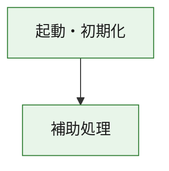
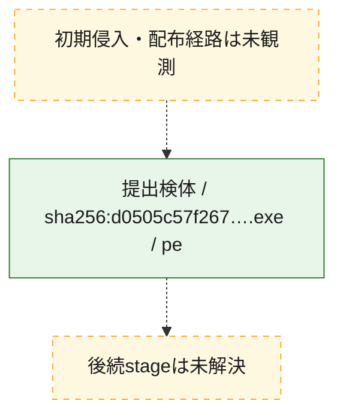
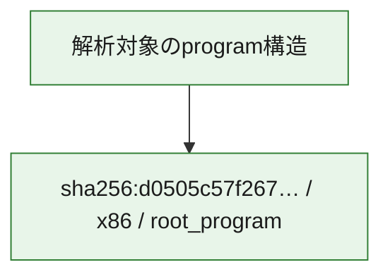

# 全体ロジック：d0505c57f2670a10477174a0f682fe2255ddad311386d7ec9466dce01b9768ee

代表関数の静的証跡から、起動・初期化の処理群を確認しました。

## 読み方

- phaseの掲載順は解析上の整理順です。observed_call_edgesがない段階間の実行順を断定しません。
- 図の実線は静的に観測した関係、点線と黄色のノードは未観測・未解決の関係を示します。
- 図は静的な要約であり、動的実行を再現するものではありません。
- 詳細な関数解説とfingerprintは[STATIC-LOGIC.md](STATIC-LOGIC.md)を参照してください。

## 静的可視化

### 実行フロー

### 感染チェーン

### モジュール関係

## 処理段階

### 1. 起動・初期化

entry pointから初期化と後続処理への移行を確認します。
確度: `confirmed_static_function_evidence`

- `d0505c57f2670a10477174a0f682fe2255ddad311386d7ec9466dce01b9768ee:ghidra:180001010` — 初期化と主要処理への分岐を行う入口関数です。 状態: `succeeded`、選定理由: `entry_point`, `meaningful_symbol_name`, `reviewed_call_centrality:22`, `role:entrypoint`, `small_program_complete_context`

### 2. 補助処理

主要処理を支える一般内部関数またはlibrary処理を確認します。
確度: `confirmed_static_function_evidence`

- `d0505c57f2670a10477174a0f682fe2255ddad311386d7ec9466dce01b9768ee:ghidra:180001240` — 検体内部の一般処理を実装する関数です。 状態: `succeeded`、選定理由: `context_representative`, `reviewed_call_centrality:2`, `small_program_complete_context`
- `d0505c57f2670a10477174a0f682fe2255ddad311386d7ec9466dce01b9768ee:ghidra:180001350` — 検体内部の一般処理を実装する関数です。 状態: `succeeded`、選定理由: `context_representative`, `reviewed_call_centrality:25`, `small_program_complete_context`
- `d0505c57f2670a10477174a0f682fe2255ddad311386d7ec9466dce01b9768ee:ghidra:180003780` — 検体内部の一般処理を実装する関数です。 状態: `succeeded`、選定理由: `context_representative`, `reviewed_call_centrality:2`, `small_program_complete_context`
- `d0505c57f2670a10477174a0f682fe2255ddad311386d7ec9466dce01b9768ee:ghidra:1800038e0` — 検体内部の一般処理を実装する関数です。 状態: `succeeded`、選定理由: `context_representative`, `reviewed_call_centrality:2`, `small_program_complete_context`

## 観測したcall関係

- `d0505c57f2670a10477174a0f682fe2255ddad311386d7ec9466dce01b9768ee:ghidra:180001010` → `d0505c57f2670a10477174a0f682fe2255ddad311386d7ec9466dce01b9768ee:ghidra:180001240` （`startup` → `support`）
- `d0505c57f2670a10477174a0f682fe2255ddad311386d7ec9466dce01b9768ee:ghidra:180001010` → `d0505c57f2670a10477174a0f682fe2255ddad311386d7ec9466dce01b9768ee:ghidra:180001350` （`startup` → `support`）
- `d0505c57f2670a10477174a0f682fe2255ddad311386d7ec9466dce01b9768ee:ghidra:180001350` → `d0505c57f2670a10477174a0f682fe2255ddad311386d7ec9466dce01b9768ee:ghidra:180001240` （`support` → `support`）
- `d0505c57f2670a10477174a0f682fe2255ddad311386d7ec9466dce01b9768ee:ghidra:180001350` → `d0505c57f2670a10477174a0f682fe2255ddad311386d7ec9466dce01b9768ee:ghidra:180003780` （`support` → `support`）
- `d0505c57f2670a10477174a0f682fe2255ddad311386d7ec9466dce01b9768ee:ghidra:180001350` → `d0505c57f2670a10477174a0f682fe2255ddad311386d7ec9466dce01b9768ee:ghidra:1800038e0` （`support` → `support`）
- `d0505c57f2670a10477174a0f682fe2255ddad311386d7ec9466dce01b9768ee:ghidra:180003780` → `d0505c57f2670a10477174a0f682fe2255ddad311386d7ec9466dce01b9768ee:ghidra:1800038e0` （`support` → `support`）
- `ghidra-function:8802da7ab63a3a5fc8fe8690` → `ghidra-function:540cf129a2a7baa50fad2cf0` （`unclassified` → `unclassified`）
- `ghidra-function:b22c0d01469444594ff5c955` → `ghidra-function:2e8158e7dabfade7f6c19ab4` （`unclassified` → `unclassified`）
- `ghidra-function:b22c0d01469444594ff5c955` → `ghidra-function:4da85afa6cceda0a7f68f5f8` （`unclassified` → `unclassified`）
- `ghidra-function:b22c0d01469444594ff5c955` → `ghidra-function:625aec9a8c154dd02d4cf850` （`unclassified` → `unclassified`）
- `ghidra-function:b22c0d01469444594ff5c955` → `ghidra-function:64afa50c86393139eaefc5fd` （`unclassified` → `unclassified`）
- `ghidra-function:b22c0d01469444594ff5c955` → `ghidra-function:7a018a4eca8c4efc64f871cc` （`unclassified` → `unclassified`）
- `ghidra-function:b22c0d01469444594ff5c955` → `ghidra-function:9167a459c6a04ea74b3f1026` （`unclassified` → `unclassified`）
- `ghidra-function:b22c0d01469444594ff5c955` → `ghidra-function:9a14a822a81fe681bb8700f0` （`unclassified` → `unclassified`）
- `ghidra-function:b22c0d01469444594ff5c955` → `ghidra-function:b4e8b37e6097b34832326af1` （`unclassified` → `unclassified`）
- `ghidra-function:b22c0d01469444594ff5c955` → `ghidra-function:cce3237e89b3b42bb45bd531` （`unclassified` → `unclassified`）
- `ghidra-function:b22c0d01469444594ff5c955` → `ghidra-function:cd4cdc58eeeed5c74b400ef8` （`unclassified` → `unclassified`）
- `ghidra-function:b22c0d01469444594ff5c955` → `ghidra-function:cd7594a19b20ef9feaaf34da` （`unclassified` → `unclassified`）
- `ghidra-function:b22c0d01469444594ff5c955` → `ghidra-function:daedf852b8ec1eabeb91ae93` （`unclassified` → `unclassified`）
- `ghidra-function:daedf852b8ec1eabeb91ae93` → `ghidra-external:1a31afa62304680ada37fcd7` （`unclassified` → `unclassified`）
- `ghidra-function:daedf852b8ec1eabeb91ae93` → `ghidra-external:1ca0e2650de08173e5d4f0da` （`unclassified` → `unclassified`）
- `ghidra-function:daedf852b8ec1eabeb91ae93` → `ghidra-external:280bee13e95ceccbfcd2c7f6` （`unclassified` → `unclassified`）
- `ghidra-function:daedf852b8ec1eabeb91ae93` → `ghidra-external:3f95f5727e73d28c31bd844d` （`unclassified` → `unclassified`）
- `ghidra-function:daedf852b8ec1eabeb91ae93` → `ghidra-external:64e14c2eaf4bc3b240ef7c10` （`unclassified` → `unclassified`）
- `ghidra-function:daedf852b8ec1eabeb91ae93` → `ghidra-external:64f81ba5c60f2fec92b53fc8` （`unclassified` → `unclassified`）
- `ghidra-function:daedf852b8ec1eabeb91ae93` → `ghidra-external:6796d2635e9e58f5b38336c6` （`unclassified` → `unclassified`）
- `ghidra-function:daedf852b8ec1eabeb91ae93` → `ghidra-external:7019b69964525d638a1f546c` （`unclassified` → `unclassified`）
- `ghidra-function:daedf852b8ec1eabeb91ae93` → `ghidra-external:7b9bdb66e7adc70ed72467dd` （`unclassified` → `unclassified`）
- `ghidra-function:daedf852b8ec1eabeb91ae93` → `ghidra-external:841cee6d0df2ed35a523fb80` （`unclassified` → `unclassified`）
- `ghidra-function:daedf852b8ec1eabeb91ae93` → `ghidra-external:8a50962b645c32e27d8eb178` （`unclassified` → `unclassified`）
- `ghidra-function:daedf852b8ec1eabeb91ae93` → `ghidra-external:8ebfffd5f86c983ec82d49a0` （`unclassified` → `unclassified`）
- `ghidra-function:daedf852b8ec1eabeb91ae93` → `ghidra-external:92945c56243b282b23cc40dd` （`unclassified` → `unclassified`）
- `ghidra-function:daedf852b8ec1eabeb91ae93` → `ghidra-external:9d4cdf16022059b7dbdcc283` （`unclassified` → `unclassified`）
- `ghidra-function:daedf852b8ec1eabeb91ae93` → `ghidra-external:a86623fa1886fa88772a022d` （`unclassified` → `unclassified`）
- `ghidra-function:daedf852b8ec1eabeb91ae93` → `ghidra-external:c46f4037547ca34997b2f604` （`unclassified` → `unclassified`）
- `ghidra-function:daedf852b8ec1eabeb91ae93` → `ghidra-external:d27296b34a6e51dc34f6461e` （`unclassified` → `unclassified`）
- `ghidra-function:daedf852b8ec1eabeb91ae93` → `ghidra-external:d44c99b657332ce49a5bca32` （`unclassified` → `unclassified`）
- `ghidra-function:daedf852b8ec1eabeb91ae93` → `ghidra-external:df6063770038d1359c3789d8` （`unclassified` → `unclassified`）
- `ghidra-function:daedf852b8ec1eabeb91ae93` → `ghidra-external:e8d15b24585ff56306afb04b` （`unclassified` → `unclassified`）
- `ghidra-function:daedf852b8ec1eabeb91ae93` → `ghidra-external:f6cbfedcb9f2f8b383179832` （`unclassified` → `unclassified`）
- `ghidra-function:daedf852b8ec1eabeb91ae93` → `ghidra-function:540cf129a2a7baa50fad2cf0` （`unclassified` → `unclassified`）
- `ghidra-function:daedf852b8ec1eabeb91ae93` → `ghidra-function:625aec9a8c154dd02d4cf850` （`unclassified` → `unclassified`）
- `ghidra-function:daedf852b8ec1eabeb91ae93` → `ghidra-function:8802da7ab63a3a5fc8fe8690` （`unclassified` → `unclassified`）

## 解析範囲と制約

- 選定外関数は全体inventoryへ残しますが、関数本体の個別解説対象にはしていません。
- indirect call、難読化、packer、VM、壊れたcontrol flowによりcall関係が欠落する場合があります。
- 文書は静的解析に基づき、検体実行や外部通信による動的確認は行っていません。
