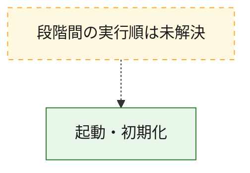
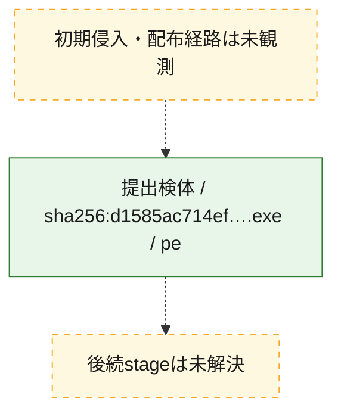
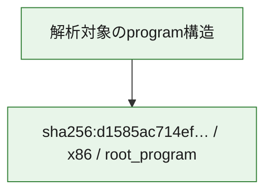

# 全体ロジック：d1585ac714ef2f5bd01e2a782c1442b188b5b0c5c068abc91ef484434bbbe8f6

代表関数の静的証跡から、起動・初期化の処理群を確認しました。

## 読み方

- phaseの掲載順は解析上の整理順です。observed_call_edgesがない段階間の実行順を断定しません。
- 図の実線は静的に観測した関係、点線と黄色のノードは未観測・未解決の関係を示します。
- 図は静的な要約であり、動的実行を再現するものではありません。
- 詳細な関数解説とfingerprintは[STATIC-LOGIC.md](STATIC-LOGIC.md)を参照してください。

## 静的可視化

### 実行フロー

### 感染チェーン

### モジュール関係

## 処理段階

### 1. 起動・初期化

entry pointから初期化と後続処理への移行を確認します。
確度: `confirmed_static_function_evidence_with_limits`

- `d1585ac714ef2f5bd01e2a782c1442b188b5b0c5c068abc91ef484434bbbe8f6:ghidra:7ff676081550` — 初期化と主要処理への分岐を行う入口関数です。 状態: `limited_bad_instruction_or_flow`、選定理由: `entry_point`, `large_function:instructions=78`, `meaningful_symbol_name`, `reviewed_call_centrality:20`, `role:entrypoint`, `small_program_complete_context`

## 観測したcall関係

- `ghidra-function:bcb14b54f121089c13daf5a3` → `ghidra-external:055441ebb42ca0c0bcae8fa0` （`unclassified` → `unclassified`）
- `ghidra-function:bcb14b54f121089c13daf5a3` → `ghidra-external:7ba5e1d04fc107dfba705a46` （`unclassified` → `unclassified`）
- `ghidra-function:bcb14b54f121089c13daf5a3` → `ghidra-function:319e561753b6619dbc861f54` （`unclassified` → `unclassified`）
- `ghidra-function:bcb14b54f121089c13daf5a3` → `ghidra-function:7ddad4d045e4d95fcfef7fcd` （`unclassified` → `unclassified`）
- `ghidra-function:bcb14b54f121089c13daf5a3` → `ghidra-function:89b265862659f828fddf6eea` （`unclassified` → `unclassified`）
- `ghidra-function:bcb14b54f121089c13daf5a3` → `ghidra-function:90993ba1654ebd3e7cabd3ac` （`unclassified` → `unclassified`）
- `ghidra-function:bcb14b54f121089c13daf5a3` → `ghidra-function:aae4739716dce890bf52f651` （`unclassified` → `unclassified`）
- `ghidra-function:bcb14b54f121089c13daf5a3` → `ghidra-function:c11bf1dc8617ef033e00aaa8` （`unclassified` → `unclassified`）
- `ghidra-function:bcb14b54f121089c13daf5a3` → `ghidra-function:dd3306c80afa20d744cd7dd1` （`unclassified` → `unclassified`）
- `ghidra-function:bcb14b54f121089c13daf5a3` → `ghidra-function:ec1090179cc9e5a71587d796` （`unclassified` → `unclassified`）
- `ghidra-function:bcb14b54f121089c13daf5a3` → `ghidra-function:f9966af6b477bda635ab3e2a` （`unclassified` → `unclassified`）

## 解析範囲と制約

- 選定外関数は全体inventoryへ残しますが、関数本体の個別解説対象にはしていません。
- indirect call、難読化、packer、VM、壊れたcontrol flowによりcall関係が欠落する場合があります。
- 文書は静的解析に基づき、検体実行や外部通信による動的確認は行っていません。
