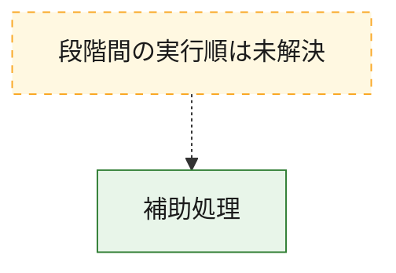
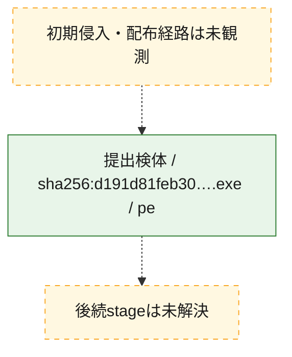
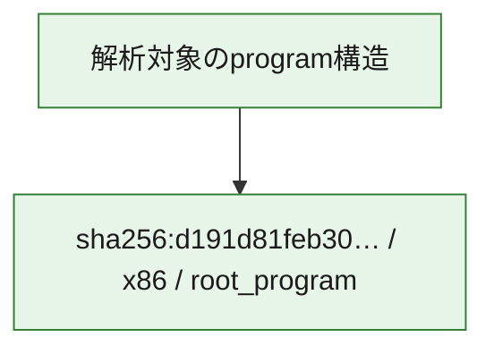

# 全体ロジック：d191d81feb30d77ed561efa1167841e37851f57333940b7ad09a3959556ea0ae

代表関数から主要なmalware処理段階を自動分類できませんでした。

## 読み方

- phaseの掲載順は解析上の整理順です。observed_call_edgesがない段階間の実行順を断定しません。
- 図の実線は静的に観測した関係、点線と黄色のノードは未観測・未解決の関係を示します。
- 図は静的な要約であり、動的実行を再現するものではありません。
- 詳細な関数解説とfingerprintは[STATIC-LOGIC.md](STATIC-LOGIC.md)を参照してください。

## 静的可視化

### 実行フロー

### 感染チェーン

### モジュール関係

## 処理段階

### 1. 補助処理

主要処理を支える一般内部関数またはlibrary処理を確認します。
確度: `confirmed_static_function_evidence_with_limits`

- `d191d81feb30d77ed561efa1167841e37851f57333940b7ad09a3959556ea0ae:ghidra:140001594` — 検体内部の一般処理を実装する関数です。 状態: `limited_bad_instruction_or_flow`、選定理由: `context_representative`, `reviewed_call_centrality:1`
- `d191d81feb30d77ed561efa1167841e37851f57333940b7ad09a3959556ea0ae:ghidra:1400015b0` — 検体内部の一般処理を実装する関数です。 状態: `limited_bad_instruction_or_flow`、選定理由: `context_representative`, `reviewed_call_centrality:1`
- `d191d81feb30d77ed561efa1167841e37851f57333940b7ad09a3959556ea0ae:ghidra:1400016c8` — 検体内部の一般処理を実装する関数です。 状態: `limited_bad_instruction_or_flow`、選定理由: `context_representative`, `reviewed_call_centrality:1`
- `d191d81feb30d77ed561efa1167841e37851f57333940b7ad09a3959556ea0ae:ghidra:1400017ac` — 検体内部の一般処理を実装する関数です。 状態: `limited_bad_instruction_or_flow`、選定理由: `context_representative`, `reviewed_call_centrality:1`
- `d191d81feb30d77ed561efa1167841e37851f57333940b7ad09a3959556ea0ae:ghidra:140001a70` — 検体内部の一般処理を実装する関数です。 状態: `limited_bad_instruction_or_flow`、選定理由: `context_representative`, `reviewed_call_centrality:1`
- `d191d81feb30d77ed561efa1167841e37851f57333940b7ad09a3959556ea0ae:ghidra:140001ca0` — 検体内部の一般処理を実装する関数です。 状態: `limited_bad_instruction_or_flow`、選定理由: `context_representative`, `reviewed_call_centrality:1`
- `d191d81feb30d77ed561efa1167841e37851f57333940b7ad09a3959556ea0ae:ghidra:140001df4` — 検体内部の一般処理を実装する関数です。 状態: `limited_bad_instruction_or_flow`、選定理由: `context_representative`, `reviewed_call_centrality:1`
- `d191d81feb30d77ed561efa1167841e37851f57333940b7ad09a3959556ea0ae:ghidra:14000235c` — 検体内部の一般処理を実装する関数です。 状態: `limited_bad_instruction_or_flow`、選定理由: `context_representative`, `reviewed_call_centrality:1`
- `d191d81feb30d77ed561efa1167841e37851f57333940b7ad09a3959556ea0ae:ghidra:1400023f4` — 検体内部の一般処理を実装する関数です。 状態: `limited_bad_instruction_or_flow`、選定理由: `context_representative`, `reviewed_call_centrality:1`
- `d191d81feb30d77ed561efa1167841e37851f57333940b7ad09a3959556ea0ae:ghidra:140002488` — 検体内部の一般処理を実装する関数です。 状態: `limited_bad_instruction_or_flow`、選定理由: `context_representative`, `reviewed_call_centrality:1`
- `d191d81feb30d77ed561efa1167841e37851f57333940b7ad09a3959556ea0ae:ghidra:14000253c` — 検体内部の一般処理を実装する関数です。 状態: `limited_bad_instruction_or_flow`、選定理由: `context_representative`, `reviewed_call_centrality:1`
- `d191d81feb30d77ed561efa1167841e37851f57333940b7ad09a3959556ea0ae:ghidra:14000296c` — 検体内部の一般処理を実装する関数です。 状態: `limited_bad_instruction_or_flow`、選定理由: `context_representative`, `reviewed_call_centrality:1`
- `d191d81feb30d77ed561efa1167841e37851f57333940b7ad09a3959556ea0ae:ghidra:140002b28` — 検体内部の一般処理を実装する関数です。 状態: `limited_bad_instruction_or_flow`、選定理由: `context_representative`, `reviewed_call_centrality:1`
- `d191d81feb30d77ed561efa1167841e37851f57333940b7ad09a3959556ea0ae:ghidra:140002c10` — 検体内部の一般処理を実装する関数です。 状態: `limited_bad_instruction_or_flow`、選定理由: `context_representative`, `reviewed_call_centrality:1`
- `d191d81feb30d77ed561efa1167841e37851f57333940b7ad09a3959556ea0ae:ghidra:140002c98` — 検体内部の一般処理を実装する関数です。 状態: `limited_bad_instruction_or_flow`、選定理由: `context_representative`, `reviewed_call_centrality:1`
- `d191d81feb30d77ed561efa1167841e37851f57333940b7ad09a3959556ea0ae:ghidra:140002f08` — 検体内部の一般処理を実装する関数です。 状態: `limited_bad_instruction_or_flow`、選定理由: `context_representative`, `reviewed_call_centrality:1`
- `d191d81feb30d77ed561efa1167841e37851f57333940b7ad09a3959556ea0ae:ghidra:1400031b8` — 検体内部の一般処理を実装する関数です。 状態: `limited_bad_instruction_or_flow`、選定理由: `context_representative`, `reviewed_call_centrality:1`
- `d191d81feb30d77ed561efa1167841e37851f57333940b7ad09a3959556ea0ae:ghidra:140003678` — 検体内部の一般処理を実装する関数です。 状態: `limited_bad_instruction_or_flow`、選定理由: `context_representative`, `reviewed_call_centrality:1`
- `d191d81feb30d77ed561efa1167841e37851f57333940b7ad09a3959556ea0ae:ghidra:1400037d0` — 検体内部の一般処理を実装する関数です。 状態: `limited_bad_instruction_or_flow`、選定理由: `context_representative`, `reviewed_call_centrality:1`
- `d191d81feb30d77ed561efa1167841e37851f57333940b7ad09a3959556ea0ae:ghidra:140003804` — 検体内部の一般処理を実装する関数です。 状態: `limited_bad_instruction_or_flow`、選定理由: `context_representative`, `reviewed_call_centrality:1`
- `d191d81feb30d77ed561efa1167841e37851f57333940b7ad09a3959556ea0ae:ghidra:140003838` — 検体内部の一般処理を実装する関数です。 状態: `limited_bad_instruction_or_flow`、選定理由: `context_representative`, `reviewed_call_centrality:1`
- `d191d81feb30d77ed561efa1167841e37851f57333940b7ad09a3959556ea0ae:ghidra:1400039f8` — 検体内部の一般処理を実装する関数です。 状態: `limited_bad_instruction_or_flow`、選定理由: `context_representative`, `reviewed_call_centrality:1`
- `d191d81feb30d77ed561efa1167841e37851f57333940b7ad09a3959556ea0ae:ghidra:140004500` — 検体内部の一般処理を実装する関数です。 状態: `limited_bad_instruction_or_flow`、選定理由: `context_representative`, `reviewed_call_centrality:1`
- `d191d81feb30d77ed561efa1167841e37851f57333940b7ad09a3959556ea0ae:ghidra:1400046f4` — 検体内部の一般処理を実装する関数です。 状態: `limited_bad_instruction_or_flow`、選定理由: `context_representative`, `reviewed_call_centrality:1`
- `d191d81feb30d77ed561efa1167841e37851f57333940b7ad09a3959556ea0ae:ghidra:140004914` — 検体内部の一般処理を実装する関数です。 状態: `limited_bad_instruction_or_flow`、選定理由: `context_representative`, `reviewed_call_centrality:1`
- `d191d81feb30d77ed561efa1167841e37851f57333940b7ad09a3959556ea0ae:ghidra:1400054dc` — 検体内部の一般処理を実装する関数です。 状態: `limited_bad_instruction_or_flow`、選定理由: `context_representative`, `reviewed_call_centrality:1`
- `d191d81feb30d77ed561efa1167841e37851f57333940b7ad09a3959556ea0ae:ghidra:14000577c` — 検体内部の一般処理を実装する関数です。 状態: `limited_bad_instruction_or_flow`、選定理由: `context_representative`, `reviewed_call_centrality:1`
- `d191d81feb30d77ed561efa1167841e37851f57333940b7ad09a3959556ea0ae:ghidra:14000590c` — 検体内部の一般処理を実装する関数です。 状態: `limited_bad_instruction_or_flow`、選定理由: `context_representative`, `reviewed_call_centrality:1`
- `d191d81feb30d77ed561efa1167841e37851f57333940b7ad09a3959556ea0ae:ghidra:140005b30` — 検体内部の一般処理を実装する関数です。 状態: `limited_bad_instruction_or_flow`、選定理由: `context_representative`, `reviewed_call_centrality:1`
- `d191d81feb30d77ed561efa1167841e37851f57333940b7ad09a3959556ea0ae:ghidra:140005d74` — 検体内部の一般処理を実装する関数です。 状態: `limited_bad_instruction_or_flow`、選定理由: `context_representative`, `reviewed_call_centrality:1`
- `d191d81feb30d77ed561efa1167841e37851f57333940b7ad09a3959556ea0ae:ghidra:140005ebc` — 検体内部の一般処理を実装する関数です。 状態: `limited_bad_instruction_or_flow`、選定理由: `context_representative`, `reviewed_call_centrality:1`
- `d191d81feb30d77ed561efa1167841e37851f57333940b7ad09a3959556ea0ae:ghidra:1400060c8` — 検体内部の一般処理を実装する関数です。 状態: `limited_bad_instruction_or_flow`、選定理由: `context_representative`, `reviewed_call_centrality:1`

## 観測したcall関係

- `ghidra-function:00dd699d17dbd1c4f6bbb64c` → `ghidra-external:26a9d28f1a2f0f0484dfcbf3` （`unclassified` → `unclassified`）
- `ghidra-function:0864911bb324fae0d236d50c` → `ghidra-external:26a9d28f1a2f0f0484dfcbf3` （`unclassified` → `unclassified`）
- `ghidra-function:20466664f702d49167d1b09e` → `ghidra-external:26a9d28f1a2f0f0484dfcbf3` （`unclassified` → `unclassified`）
- `ghidra-function:303b49b85962e680cacf55b4` → `ghidra-external:26a9d28f1a2f0f0484dfcbf3` （`unclassified` → `unclassified`）
- `ghidra-function:31403a8463976fc67b6e0071` → `ghidra-external:26a9d28f1a2f0f0484dfcbf3` （`unclassified` → `unclassified`）
- `ghidra-function:3453e890da159392ce415138` → `ghidra-external:26a9d28f1a2f0f0484dfcbf3` （`unclassified` → `unclassified`）
- `ghidra-function:3994feb64cace5cf217f0e21` → `ghidra-external:26a9d28f1a2f0f0484dfcbf3` （`unclassified` → `unclassified`）
- `ghidra-function:3e6829cf5d1fafde999aca30` → `ghidra-external:26a9d28f1a2f0f0484dfcbf3` （`unclassified` → `unclassified`）
- `ghidra-function:480270fa210c06abe7c112f0` → `ghidra-external:26a9d28f1a2f0f0484dfcbf3` （`unclassified` → `unclassified`）
- `ghidra-function:60da0f7e6013faf1f8058c41` → `ghidra-external:26a9d28f1a2f0f0484dfcbf3` （`unclassified` → `unclassified`）
- `ghidra-function:65dd4c13d67751e2c39065d8` → `ghidra-external:26a9d28f1a2f0f0484dfcbf3` （`unclassified` → `unclassified`）
- `ghidra-function:6823400439050cdb30b84aef` → `ghidra-external:26a9d28f1a2f0f0484dfcbf3` （`unclassified` → `unclassified`）
- `ghidra-function:68b21bb035f80a39be06c8f9` → `ghidra-external:26a9d28f1a2f0f0484dfcbf3` （`unclassified` → `unclassified`）
- `ghidra-function:6d3b9f90b3f89d67c19ef954` → `ghidra-external:26a9d28f1a2f0f0484dfcbf3` （`unclassified` → `unclassified`）
- `ghidra-function:70d21e363fca55ee8f931e27` → `ghidra-external:26a9d28f1a2f0f0484dfcbf3` （`unclassified` → `unclassified`）
- `ghidra-function:787af716d430e37f9c9e2c05` → `ghidra-external:26a9d28f1a2f0f0484dfcbf3` （`unclassified` → `unclassified`）
- `ghidra-function:78c4491decdb54e87e4ee687` → `ghidra-external:26a9d28f1a2f0f0484dfcbf3` （`unclassified` → `unclassified`）
- `ghidra-function:83dcb88cbad9a873c9753692` → `ghidra-external:26a9d28f1a2f0f0484dfcbf3` （`unclassified` → `unclassified`）
- `ghidra-function:85c077bb630d3c2a375ba866` → `ghidra-external:26a9d28f1a2f0f0484dfcbf3` （`unclassified` → `unclassified`）
- `ghidra-function:8b8caae7be495cc123ffe6cd` → `ghidra-external:26a9d28f1a2f0f0484dfcbf3` （`unclassified` → `unclassified`）
- `ghidra-function:96007440f44f4af1449ce15e` → `ghidra-external:26a9d28f1a2f0f0484dfcbf3` （`unclassified` → `unclassified`）
- `ghidra-function:964b709436280a6fc7b552de` → `ghidra-external:26a9d28f1a2f0f0484dfcbf3` （`unclassified` → `unclassified`）
- `ghidra-function:a3bf0ca4ed11ab1c7702c3af` → `ghidra-external:26a9d28f1a2f0f0484dfcbf3` （`unclassified` → `unclassified`）
- `ghidra-function:b7567fca9b249e24d8e11cc1` → `ghidra-external:26a9d28f1a2f0f0484dfcbf3` （`unclassified` → `unclassified`）
- `ghidra-function:d09f96531305feb67b976cff` → `ghidra-external:26a9d28f1a2f0f0484dfcbf3` （`unclassified` → `unclassified`）
- `ghidra-function:dba39b77090a1b6d71e76258` → `ghidra-external:26a9d28f1a2f0f0484dfcbf3` （`unclassified` → `unclassified`）
- `ghidra-function:e0fa13c3c85167c89df870a2` → `ghidra-external:26a9d28f1a2f0f0484dfcbf3` （`unclassified` → `unclassified`）
- `ghidra-function:e61d7dd2d1e823691848008b` → `ghidra-external:26a9d28f1a2f0f0484dfcbf3` （`unclassified` → `unclassified`）
- `ghidra-function:f35e84e8f54c25e0c6c320c0` → `ghidra-external:26a9d28f1a2f0f0484dfcbf3` （`unclassified` → `unclassified`）
- `ghidra-function:f3ee213b1bd143a9c43705c5` → `ghidra-external:26a9d28f1a2f0f0484dfcbf3` （`unclassified` → `unclassified`）
- `ghidra-function:fb8062900bcbacc579f39ad1` → `ghidra-external:26a9d28f1a2f0f0484dfcbf3` （`unclassified` → `unclassified`）
- `ghidra-function:ff7b0837a100758273a06f54` → `ghidra-external:26a9d28f1a2f0f0484dfcbf3` （`unclassified` → `unclassified`）

## 解析範囲と制約

- 選定外関数は全体inventoryへ残しますが、関数本体の個別解説対象にはしていません。
- indirect call、難読化、packer、VM、壊れたcontrol flowによりcall関係が欠落する場合があります。
- 文書は静的解析に基づき、検体実行や外部通信による動的確認は行っていません。
