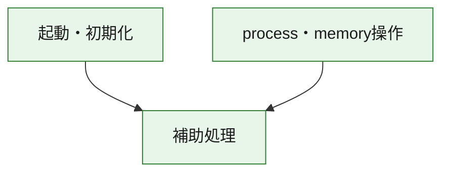
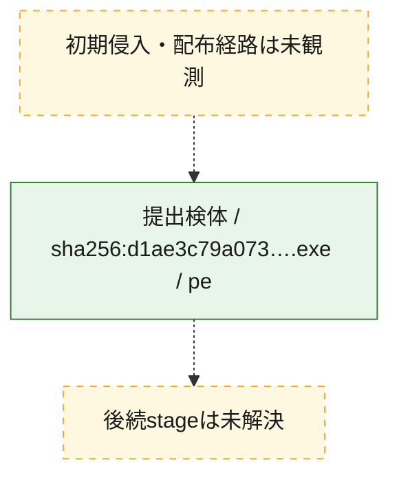
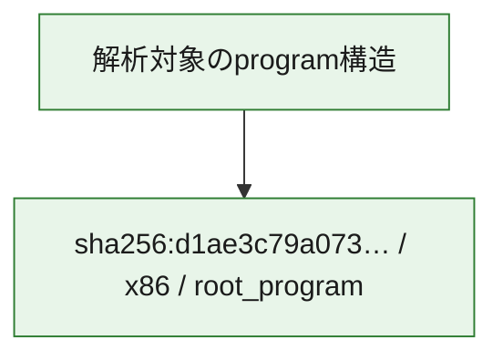

# 全体ロジック：d1ae3c79a073068a0b5a07d120a6bc1524f0f845bf1d2523e2522b81bbd4e547

代表関数の静的証跡から、起動・初期化、process・memory操作の処理群を確認しました。

## 読み方

- phaseの掲載順は解析上の整理順です。observed_call_edgesがない段階間の実行順を断定しません。
- 図の実線は静的に観測した関係、点線と黄色のノードは未観測・未解決の関係を示します。
- 図は静的な要約であり、動的実行を再現するものではありません。
- 詳細な関数解説とfingerprintは[STATIC-LOGIC.md](STATIC-LOGIC.md)を参照してください。

## 静的可視化

### 実行フロー

### 感染チェーン

### モジュール関係

## 処理段階

### 1. 起動・初期化

entry pointから初期化と後続処理への移行を確認します。
確度: `confirmed_static_function_evidence`

- `d1ae3c79a073068a0b5a07d120a6bc1524f0f845bf1d2523e2522b81bbd4e547:ghidra:2c0013e0` — 初期化と主要処理への分岐を行う入口関数です。 状態: `succeeded`、選定理由: `entry_point`, `meaningful_symbol_name`, `reviewed_call_centrality:1`, `role:entrypoint`

### 2. process・memory操作

process、thread、module、memory操作と実行移行を確認します。
確度: `confirmed_static_function_evidence`

- `d1ae3c79a073068a0b5a07d120a6bc1524f0f845bf1d2523e2522b81bbd4e547:ghidra:2c0017a0` — process、thread、module、またはmemory操作に関係する関数です。 状態: `succeeded`、選定理由: `context_representative`, `reviewed_call_centrality:16`, `role:process_or_memory_operation`
- `d1ae3c79a073068a0b5a07d120a6bc1524f0f845bf1d2523e2522b81bbd4e547:ghidra:2c001810` — process、thread、module、またはmemory操作に関係する関数です。 状態: `succeeded`、選定理由: `context_representative`, `reviewed_call_centrality:12`, `role:process_or_memory_operation`

### 3. 補助処理

主要処理を支える一般内部関数またはlibrary処理を確認します。
確度: `confirmed_static_function_evidence_with_limits`

- `d1ae3c79a073068a0b5a07d120a6bc1524f0f845bf1d2523e2522b81bbd4e547:ghidra:2c001000` — 検体内部の一般処理を実装する関数です。 状態: `succeeded`、選定理由: `context_representative`
- `d1ae3c79a073068a0b5a07d120a6bc1524f0f845bf1d2523e2522b81bbd4e547:ghidra:2c001010` — 検体内部の一般処理を実装する関数です。 状態: `succeeded`、選定理由: `context_representative`, `reviewed_call_centrality:6`
- `d1ae3c79a073068a0b5a07d120a6bc1524f0f845bf1d2523e2522b81bbd4e547:ghidra:2c001140` — 検体内部の一般処理を実装する関数です。 状態: `succeeded`、選定理由: `context_representative`, `reviewed_call_centrality:1`
- `d1ae3c79a073068a0b5a07d120a6bc1524f0f845bf1d2523e2522b81bbd4e547:ghidra:2c001190` — 検体内部の一般処理を実装する関数です。 状態: `succeeded`、選定理由: `context_representative`, `reviewed_call_centrality:21`
- `d1ae3c79a073068a0b5a07d120a6bc1524f0f845bf1d2523e2522b81bbd4e547:ghidra:2c001410` — 検体内部の一般処理を実装する関数です。 状態: `succeeded`、選定理由: `context_representative`, `reviewed_call_centrality:1`
- `d1ae3c79a073068a0b5a07d120a6bc1524f0f845bf1d2523e2522b81bbd4e547:ghidra:2c001440` — 検体内部の一般処理を実装する関数です。 状態: `succeeded`、選定理由: `context_representative`, `reviewed_call_centrality:1`
- `d1ae3c79a073068a0b5a07d120a6bc1524f0f845bf1d2523e2522b81bbd4e547:ghidra:2c001460` — 検体内部の一般処理を実装する関数です。 状態: `succeeded`、選定理由: `context_representative`, `reviewed_call_centrality:1`
- `d1ae3c79a073068a0b5a07d120a6bc1524f0f845bf1d2523e2522b81bbd4e547:ghidra:2c001470` — 検体内部の一般処理を実装する関数です。 状態: `succeeded`、選定理由: `context_representative`
- `d1ae3c79a073068a0b5a07d120a6bc1524f0f845bf1d2523e2522b81bbd4e547:ghidra:2c0014c0` — 検体内部の一般処理を実装する関数です。 状態: `succeeded`、選定理由: `context_representative`
- `d1ae3c79a073068a0b5a07d120a6bc1524f0f845bf1d2523e2522b81bbd4e547:ghidra:2c001510` — 検体内部の一般処理を実装する関数です。 状態: `succeeded`、選定理由: `context_representative`, `reviewed_call_centrality:1`
- `d1ae3c79a073068a0b5a07d120a6bc1524f0f845bf1d2523e2522b81bbd4e547:ghidra:2c001590` — 検体内部の一般処理を実装する関数です。 状態: `succeeded`、選定理由: `context_representative`, `reviewed_call_centrality:2`
- `d1ae3c79a073068a0b5a07d120a6bc1524f0f845bf1d2523e2522b81bbd4e547:ghidra:2c0015b0` — 検体内部の一般処理を実装する関数です。 状態: `succeeded`、選定理由: `context_representative`, `reviewed_call_centrality:1`
- `d1ae3c79a073068a0b5a07d120a6bc1524f0f845bf1d2523e2522b81bbd4e547:ghidra:2c0015c0` — compiler生成処理または汎用library処理とみられる関数です。 状態: `succeeded`、選定理由: `entry_point`, `meaningful_symbol_name`, `reviewed_call_centrality:1`
- `d1ae3c79a073068a0b5a07d120a6bc1524f0f845bf1d2523e2522b81bbd4e547:ghidra:2c0015f0` — compiler生成処理または汎用library処理とみられる関数です。 状態: `succeeded`、選定理由: `entry_point`, `meaningful_symbol_name`, `reviewed_call_centrality:3`
- `d1ae3c79a073068a0b5a07d120a6bc1524f0f845bf1d2523e2522b81bbd4e547:ghidra:2c001680` — 検体内部の一般処理を実装する関数です。 状態: `succeeded`、選定理由: `context_representative`
- `d1ae3c79a073068a0b5a07d120a6bc1524f0f845bf1d2523e2522b81bbd4e547:ghidra:2c001690` — 検体内部の一般処理を実装する関数です。 状態: `succeeded`、選定理由: `context_representative`, `reviewed_call_centrality:2`
- `d1ae3c79a073068a0b5a07d120a6bc1524f0f845bf1d2523e2522b81bbd4e547:ghidra:2c001790` — 検体内部の一般処理を実装する関数です。 状態: `succeeded`、選定理由: `context_representative`, `reviewed_call_centrality:3`
- `d1ae3c79a073068a0b5a07d120a6bc1524f0f845bf1d2523e2522b81bbd4e547:ghidra:2c001980` — 検体内部の一般処理を実装する関数です。 状態: `succeeded`、選定理由: `context_representative`, `reviewed_call_centrality:4`
- `d1ae3c79a073068a0b5a07d120a6bc1524f0f845bf1d2523e2522b81bbd4e547:ghidra:2c001ce0` — 検体内部の一般処理を実装する関数です。 状態: `succeeded`、選定理由: `context_representative`
- `d1ae3c79a073068a0b5a07d120a6bc1524f0f845bf1d2523e2522b81bbd4e547:ghidra:2c001d20` — 検体内部の一般処理を実装する関数です。 状態: `limited_bad_instruction_or_flow`、選定理由: `context_representative`, `reviewed_call_centrality:3`
- `d1ae3c79a073068a0b5a07d120a6bc1524f0f845bf1d2523e2522b81bbd4e547:ghidra:2c001d30` — 検体内部の一般処理を実装する関数です。 状態: `limited_bad_instruction_or_flow`、選定理由: `context_representative`, `reviewed_call_centrality:2`
- `d1ae3c79a073068a0b5a07d120a6bc1524f0f845bf1d2523e2522b81bbd4e547:ghidra:2c001ef0` — 検体内部の一般処理を実装する関数です。 状態: `limited_bad_instruction_or_flow`、選定理由: `context_representative`, `reviewed_call_centrality:9`
- `d1ae3c79a073068a0b5a07d120a6bc1524f0f845bf1d2523e2522b81bbd4e547:ghidra:2c001f70` — 検体内部の一般処理を実装する関数です。 状態: `succeeded`、選定理由: `context_representative`, `reviewed_call_centrality:5`
- `d1ae3c79a073068a0b5a07d120a6bc1524f0f845bf1d2523e2522b81bbd4e547:ghidra:2c001ff0` — 検体内部の一般処理を実装する関数です。 状態: `succeeded`、選定理由: `context_representative`, `reviewed_call_centrality:5`
- `d1ae3c79a073068a0b5a07d120a6bc1524f0f845bf1d2523e2522b81bbd4e547:ghidra:2c002090` — 検体内部の一般処理を実装する関数です。 状態: `succeeded`、選定理由: `context_representative`, `reviewed_call_centrality:9`
- `d1ae3c79a073068a0b5a07d120a6bc1524f0f845bf1d2523e2522b81bbd4e547:ghidra:2c002190` — 検体内部の一般処理を実装する関数です。 状態: `succeeded`、選定理由: `context_representative`
- `d1ae3c79a073068a0b5a07d120a6bc1524f0f845bf1d2523e2522b81bbd4e547:ghidra:2c0021c0` — 検体内部の一般処理を実装する関数です。 状態: `succeeded`、選定理由: `context_representative`
- `d1ae3c79a073068a0b5a07d120a6bc1524f0f845bf1d2523e2522b81bbd4e547:ghidra:2c002210` — 検体内部の一般処理を実装する関数です。 状態: `succeeded`、選定理由: `context_representative`, `reviewed_call_centrality:2`
- `d1ae3c79a073068a0b5a07d120a6bc1524f0f845bf1d2523e2522b81bbd4e547:ghidra:2c0022c0` — 検体内部の一般処理を実装する関数です。 状態: `succeeded`、選定理由: `context_representative`, `reviewed_call_centrality:2`

## 観測したcall関係

- `d1ae3c79a073068a0b5a07d120a6bc1524f0f845bf1d2523e2522b81bbd4e547:ghidra:2c001010` → `d1ae3c79a073068a0b5a07d120a6bc1524f0f845bf1d2523e2522b81bbd4e547:ghidra:2c0015b0` （`support` → `support`）
- `d1ae3c79a073068a0b5a07d120a6bc1524f0f845bf1d2523e2522b81bbd4e547:ghidra:2c001010` → `d1ae3c79a073068a0b5a07d120a6bc1524f0f845bf1d2523e2522b81bbd4e547:ghidra:2c001d20` （`support` → `support`）
- `d1ae3c79a073068a0b5a07d120a6bc1524f0f845bf1d2523e2522b81bbd4e547:ghidra:2c001190` → `d1ae3c79a073068a0b5a07d120a6bc1524f0f845bf1d2523e2522b81bbd4e547:ghidra:2c001590` （`support` → `support`）
- `d1ae3c79a073068a0b5a07d120a6bc1524f0f845bf1d2523e2522b81bbd4e547:ghidra:2c001190` → `d1ae3c79a073068a0b5a07d120a6bc1524f0f845bf1d2523e2522b81bbd4e547:ghidra:2c0015f0` （`support` → `support`）
- `d1ae3c79a073068a0b5a07d120a6bc1524f0f845bf1d2523e2522b81bbd4e547:ghidra:2c001190` → `d1ae3c79a073068a0b5a07d120a6bc1524f0f845bf1d2523e2522b81bbd4e547:ghidra:2c001790` （`support` → `support`）
- `d1ae3c79a073068a0b5a07d120a6bc1524f0f845bf1d2523e2522b81bbd4e547:ghidra:2c001190` → `d1ae3c79a073068a0b5a07d120a6bc1524f0f845bf1d2523e2522b81bbd4e547:ghidra:2c001980` （`support` → `support`）
- `d1ae3c79a073068a0b5a07d120a6bc1524f0f845bf1d2523e2522b81bbd4e547:ghidra:2c0013e0` → `d1ae3c79a073068a0b5a07d120a6bc1524f0f845bf1d2523e2522b81bbd4e547:ghidra:2c001190` （`startup` → `support`）
- `d1ae3c79a073068a0b5a07d120a6bc1524f0f845bf1d2523e2522b81bbd4e547:ghidra:2c001410` → `d1ae3c79a073068a0b5a07d120a6bc1524f0f845bf1d2523e2522b81bbd4e547:ghidra:2c001190` （`support` → `support`）
- `d1ae3c79a073068a0b5a07d120a6bc1524f0f845bf1d2523e2522b81bbd4e547:ghidra:2c0015c0` → `d1ae3c79a073068a0b5a07d120a6bc1524f0f845bf1d2523e2522b81bbd4e547:ghidra:2c002090` （`support` → `support`）
- `d1ae3c79a073068a0b5a07d120a6bc1524f0f845bf1d2523e2522b81bbd4e547:ghidra:2c0015f0` → `d1ae3c79a073068a0b5a07d120a6bc1524f0f845bf1d2523e2522b81bbd4e547:ghidra:2c002090` （`support` → `support`）
- `d1ae3c79a073068a0b5a07d120a6bc1524f0f845bf1d2523e2522b81bbd4e547:ghidra:2c0017a0` → `d1ae3c79a073068a0b5a07d120a6bc1524f0f845bf1d2523e2522b81bbd4e547:ghidra:2c0022c0` （`execution` → `support`）
- `d1ae3c79a073068a0b5a07d120a6bc1524f0f845bf1d2523e2522b81bbd4e547:ghidra:2c001810` → `d1ae3c79a073068a0b5a07d120a6bc1524f0f845bf1d2523e2522b81bbd4e547:ghidra:2c0017a0` （`execution` → `execution`）
- `d1ae3c79a073068a0b5a07d120a6bc1524f0f845bf1d2523e2522b81bbd4e547:ghidra:2c001810` → `d1ae3c79a073068a0b5a07d120a6bc1524f0f845bf1d2523e2522b81bbd4e547:ghidra:2c0022c0` （`execution` → `support`）
- `d1ae3c79a073068a0b5a07d120a6bc1524f0f845bf1d2523e2522b81bbd4e547:ghidra:2c001d30` → `d1ae3c79a073068a0b5a07d120a6bc1524f0f845bf1d2523e2522b81bbd4e547:ghidra:2c001790` （`support` → `support`）
- `d1ae3c79a073068a0b5a07d120a6bc1524f0f845bf1d2523e2522b81bbd4e547:ghidra:2c002090` → `d1ae3c79a073068a0b5a07d120a6bc1524f0f845bf1d2523e2522b81bbd4e547:ghidra:2c001790` （`support` → `support`）
- `d1ae3c79a073068a0b5a07d120a6bc1524f0f845bf1d2523e2522b81bbd4e547:ghidra:2c002090` → `d1ae3c79a073068a0b5a07d120a6bc1524f0f845bf1d2523e2522b81bbd4e547:ghidra:2c001ef0` （`support` → `support`）
- `ghidra-function:0757a097f06ccd671f372527` → `ghidra-external:5064f367acda0d9d137e3610` （`unclassified` → `unclassified`）
- `ghidra-function:0757a097f06ccd671f372527` → `ghidra-external:6fdfb76ef724247f2d6dd553` （`unclassified` → `unclassified`）
- `ghidra-function:0757a097f06ccd671f372527` → `ghidra-external:9ae2ad8596fdc9f1917ce52f` （`unclassified` → `unclassified`）
- `ghidra-function:0757a097f06ccd671f372527` → `ghidra-external:9d6eaa2a810b8e110f511b89` （`unclassified` → `unclassified`）
- `ghidra-function:0757a097f06ccd671f372527` → `ghidra-external:f3fbcf13fedb9729de5e93fe` （`unclassified` → `unclassified`）
- `ghidra-function:0757a097f06ccd671f372527` → `ghidra-function:0dfa7c87e1b93cb561d5a7f6` （`unclassified` → `unclassified`）
- `ghidra-function:0757a097f06ccd671f372527` → `ghidra-function:1f4e76fc12dc4692f50f6157` （`unclassified` → `unclassified`）
- `ghidra-function:0757a097f06ccd671f372527` → `ghidra-function:2bcde2b35f1212b52a7e1322` （`unclassified` → `unclassified`）
- `ghidra-function:0757a097f06ccd671f372527` → `ghidra-function:ac8b0efd042e92e8bfb5af0d` （`unclassified` → `unclassified`）
- `ghidra-function:0757a097f06ccd671f372527` → `ghidra-function:ca6e76910603d3186d38998b` （`unclassified` → `unclassified`）
- `ghidra-function:0757a097f06ccd671f372527` → `ghidra-function:cecbdaa459b1bc092ef6d1c6` （`unclassified` → `unclassified`）
- `ghidra-function:0757a097f06ccd671f372527` → `ghidra-function:d8b355a914940873f1e60889` （`unclassified` → `unclassified`）
- `ghidra-function:079d4b2b7c930b005f242420` → `ghidra-external:90931de706c67db7d6adae06` （`unclassified` → `unclassified`）
- `ghidra-function:177090199a1966ec43a269af` → `ghidra-function:47ffbf8789013beb112a9bca` （`unclassified` → `unclassified`）
- `ghidra-function:177090199a1966ec43a269af` → `ghidra-function:745c0efe23e43471513d762d` （`unclassified` → `unclassified`）
- `ghidra-function:177090199a1966ec43a269af` → `ghidra-function:c92fd8b259d6f730f13c02a5` （`unclassified` → `unclassified`）
- `ghidra-function:177090199a1966ec43a269af` → `ghidra-function:cecbdaa459b1bc092ef6d1c6` （`unclassified` → `unclassified`）
- `ghidra-function:24bce16d93dd23869d307302` → `ghidra-external:5064f367acda0d9d137e3610` （`unclassified` → `unclassified`）
- `ghidra-function:24bce16d93dd23869d307302` → `ghidra-external:9d6eaa2a810b8e110f511b89` （`unclassified` → `unclassified`）
- `ghidra-function:24bce16d93dd23869d307302` → `ghidra-function:0dfa7c87e1b93cb561d5a7f6` （`unclassified` → `unclassified`）
- `ghidra-function:2ffe9b3aacc66b687b860200` → `ghidra-external:90931de706c67db7d6adae06` （`unclassified` → `unclassified`）
- `ghidra-function:3c104656d0da12b0174d70aa` → `ghidra-external:5064f367acda0d9d137e3610` （`unclassified` → `unclassified`）
- `ghidra-function:3c104656d0da12b0174d70aa` → `ghidra-external:9d6eaa2a810b8e110f511b89` （`unclassified` → `unclassified`）
- `ghidra-function:3c104656d0da12b0174d70aa` → `ghidra-function:0757a097f06ccd671f372527` （`unclassified` → `unclassified`）
- `ghidra-function:3c104656d0da12b0174d70aa` → `ghidra-function:0dfa7c87e1b93cb561d5a7f6` （`unclassified` → `unclassified`）
- `ghidra-function:3c104656d0da12b0174d70aa` → `ghidra-function:1f4e76fc12dc4692f50f6157` （`unclassified` → `unclassified`）
- `ghidra-function:3c104656d0da12b0174d70aa` → `ghidra-function:2bcde2b35f1212b52a7e1322` （`unclassified` → `unclassified`）
- `ghidra-function:3c104656d0da12b0174d70aa` → `ghidra-function:ca6e76910603d3186d38998b` （`unclassified` → `unclassified`）
- `ghidra-function:3c104656d0da12b0174d70aa` → `ghidra-function:cecbdaa459b1bc092ef6d1c6` （`unclassified` → `unclassified`）
- `ghidra-function:3c104656d0da12b0174d70aa` → `ghidra-function:d8b355a914940873f1e60889` （`unclassified` → `unclassified`）
- `ghidra-function:44406f9a8c1d919356a89d23` → `ghidra-function:d8479ac0b3e28820a3655fb5` （`unclassified` → `unclassified`）
- `ghidra-function:45847ba15d398f9f3d4744fe` → `ghidra-external:305701251c0568c5d0f4c6ae` （`unclassified` → `unclassified`）
- `ghidra-function:45847ba15d398f9f3d4744fe` → `ghidra-external:85c06a0d883aa658108c95d2` （`unclassified` → `unclassified`）
- `ghidra-function:45847ba15d398f9f3d4744fe` → `ghidra-external:92350e4235bd8fd842cf4b5e` （`unclassified` → `unclassified`）
- `ghidra-function:45847ba15d398f9f3d4744fe` → `ghidra-external:a1a17afb4ef751d7c591f2c5` （`unclassified` → `unclassified`）
- `ghidra-function:45847ba15d398f9f3d4744fe` → `ghidra-external:b4c4cfcb4ad7d61599203e2b` （`unclassified` → `unclassified`）
- `ghidra-function:45847ba15d398f9f3d4744fe` → `ghidra-external:dbf38bf6aa8bab40ff20b3e8` （`unclassified` → `unclassified`）
- `ghidra-function:45847ba15d398f9f3d4744fe` → `ghidra-external:ed03d7b4081610175ac3efc0` （`unclassified` → `unclassified`）
- `ghidra-function:45847ba15d398f9f3d4744fe` → `ghidra-external:fb75f3a532c02dfec6b611bc` （`unclassified` → `unclassified`）
- `ghidra-function:45847ba15d398f9f3d4744fe` → `ghidra-external:feb86921236fdd76eaff2eca` （`unclassified` → `unclassified`）
- `ghidra-function:45847ba15d398f9f3d4744fe` → `ghidra-function:079d4b2b7c930b005f242420` （`unclassified` → `unclassified`）
- `ghidra-function:45847ba15d398f9f3d4744fe` → `ghidra-function:24bce16d93dd23869d307302` （`unclassified` → `unclassified`）
- `ghidra-function:45847ba15d398f9f3d4744fe` → `ghidra-function:6856b3b08ab296318326cefa` （`unclassified` → `unclassified`）
- `ghidra-function:45847ba15d398f9f3d4744fe` → `ghidra-function:763df7da91938914d68faf61` （`unclassified` → `unclassified`）
- `ghidra-function:45847ba15d398f9f3d4744fe` → `ghidra-function:99651599f3788098018e8605` （`unclassified` → `unclassified`）
- `ghidra-function:45847ba15d398f9f3d4744fe` → `ghidra-function:9a28c40d9e18664e97089854` （`unclassified` → `unclassified`）
- `ghidra-function:45847ba15d398f9f3d4744fe` → `ghidra-function:d36c25078f69103a8f998104` （`unclassified` → `unclassified`）
- `ghidra-function:45847ba15d398f9f3d4744fe` → `ghidra-function:e3a2770447646161c533540c` （`unclassified` → `unclassified`）
- `ghidra-function:514b47502b238f980d22f814` → `ghidra-external:6a8282f9db4d15e7c6b63c32` （`unclassified` → `unclassified`）
- `ghidra-function:514b47502b238f980d22f814` → `ghidra-function:745c0efe23e43471513d762d` （`unclassified` → `unclassified`）
- `ghidra-function:514b47502b238f980d22f814` → `ghidra-function:c92fd8b259d6f730f13c02a5` （`unclassified` → `unclassified`）
- `ghidra-function:543e2396816038380ec14cd2` → `ghidra-external:f0d423297ae77a2961c47b5e` （`unclassified` → `unclassified`）
- `ghidra-function:543e2396816038380ec14cd2` → `ghidra-function:ac8b0efd042e92e8bfb5af0d` （`unclassified` → `unclassified`）
- `ghidra-function:589579d1d644a6e3c7c5a547` → `ghidra-function:45847ba15d398f9f3d4744fe` （`unclassified` → `unclassified`）
- `ghidra-function:6dc28d16bd227029a6489282` → `ghidra-function:45847ba15d398f9f3d4744fe` （`unclassified` → `unclassified`）
- `ghidra-function:78b4d3bf06d9a4a99abc58b6` → `ghidra-external:991122c3b25e800401e14d6e` （`unclassified` → `unclassified`）
- `ghidra-function:78b4d3bf06d9a4a99abc58b6` → `ghidra-function:6856b3b08ab296318326cefa` （`unclassified` → `unclassified`）
- `ghidra-function:8f71a8c193f2e2d70816c9ea` → `ghidra-external:90931de706c67db7d6adae06` （`unclassified` → `unclassified`）
- `ghidra-function:934c0a4313f5b77610f5e311` → `ghidra-external:1a93fbed456b1c6e8a7a5deb` （`unclassified` → `unclassified`）
- `ghidra-function:934c0a4313f5b77610f5e311` → `ghidra-external:5064f367acda0d9d137e3610` （`unclassified` → `unclassified`）
- `ghidra-function:934c0a4313f5b77610f5e311` → `ghidra-function:44406f9a8c1d919356a89d23` （`unclassified` → `unclassified`）
- `ghidra-function:934c0a4313f5b77610f5e311` → `ghidra-function:467a655aa1a40dc6aa5664d9` （`unclassified` → `unclassified`）
- `ghidra-function:934c0a4313f5b77610f5e311` → `ghidra-function:b314db031ae42aa65988cad6` （`unclassified` → `unclassified`）
- `ghidra-function:934c0a4313f5b77610f5e311` → `ghidra-function:d98d80ccce9700839fa1e488` （`unclassified` → `unclassified`）
- `ghidra-function:9af849fe8eebb4762889eca5` → `ghidra-external:3c704ee8e90063b2570a6d3e` （`unclassified` → `unclassified`）
- `ghidra-function:9c88244b1a29a9ad6fc4fe13` → `ghidra-function:ab39ad6e9cace24fcd2f3dad` （`unclassified` → `unclassified`）
- `ghidra-function:aad87b42cff05508e5a06ac0` → `ghidra-external:90931de706c67db7d6adae06` （`unclassified` → `unclassified`）
- `ghidra-function:ab39ad6e9cace24fcd2f3dad` → `ghidra-external:382149dd624af97d7e45b5de` （`unclassified` → `unclassified`）
- `ghidra-function:ab39ad6e9cace24fcd2f3dad` → `ghidra-function:177090199a1966ec43a269af` （`unclassified` → `unclassified`）
- `ghidra-function:ab39ad6e9cace24fcd2f3dad` → `ghidra-function:2d9d291be4e92f5f4ed88dc1` （`unclassified` → `unclassified`）
- `ghidra-function:ab39ad6e9cace24fcd2f3dad` → `ghidra-function:6856b3b08ab296318326cefa` （`unclassified` → `unclassified`）
- `ghidra-function:ab39ad6e9cace24fcd2f3dad` → `ghidra-function:755dc3928c5d7de635c8f697` （`unclassified` → `unclassified`）
- `ghidra-function:bd3b9fe20e8ac49d61dbe656` → `ghidra-external:382149dd624af97d7e45b5de` （`unclassified` → `unclassified`）
- `ghidra-function:bd3b9fe20e8ac49d61dbe656` → `ghidra-function:745c0efe23e43471513d762d` （`unclassified` → `unclassified`）
- `ghidra-function:bd3b9fe20e8ac49d61dbe656` → `ghidra-function:c92fd8b259d6f730f13c02a5` （`unclassified` → `unclassified`）
- `ghidra-function:c356684eab46f3707207853d` → `ghidra-external:76d81489b489678129dd9048` （`unclassified` → `unclassified`）
- `ghidra-function:c356684eab46f3707207853d` → `ghidra-external:b4c4cfcb4ad7d61599203e2b` （`unclassified` → `unclassified`）
- `ghidra-function:d36c25078f69103a8f998104` → `ghidra-external:5064f367acda0d9d137e3610` （`unclassified` → `unclassified`）
- `ghidra-function:d36c25078f69103a8f998104` → `ghidra-function:ab39ad6e9cace24fcd2f3dad` （`unclassified` → `unclassified`）

## 解析範囲と制約

- 選定外関数は全体inventoryへ残しますが、関数本体の個別解説対象にはしていません。
- indirect call、難読化、packer、VM、壊れたcontrol flowによりcall関係が欠落する場合があります。
- 文書は静的解析に基づき、検体実行や外部通信による動的確認は行っていません。
