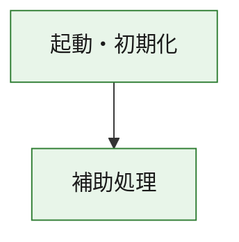
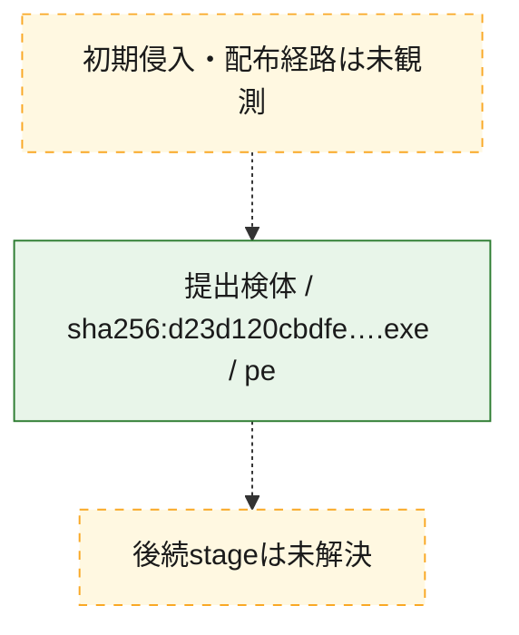
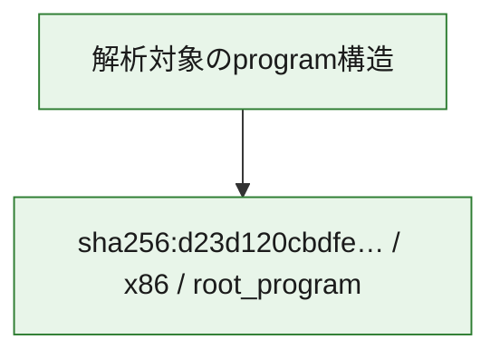

# 全体ロジック：d23d120cbdfec35b4da7790732dff48901152aa609029fe9123dbac30007575f

代表関数の静的証跡から、起動・初期化の処理群を確認しました。

## 読み方

- phaseの掲載順は解析上の整理順です。observed_call_edgesがない段階間の実行順を断定しません。
- 図の実線は静的に観測した関係、点線と黄色のノードは未観測・未解決の関係を示します。
- 図は静的な要約であり、動的実行を再現するものではありません。
- 詳細な関数解説とfingerprintは[STATIC-LOGIC.md](STATIC-LOGIC.md)を参照してください。

## 静的可視化

### 実行フロー

### 感染チェーン

### モジュール関係

## 処理段階

### 1. 起動・初期化

entry pointから初期化と後続処理への移行を確認します。
確度: `confirmed_static_function_evidence`

- `d23d120cbdfec35b4da7790732dff48901152aa609029fe9123dbac30007575f:ghidra:180001010` — 初期化と主要処理への分岐を行う入口関数です。 状態: `succeeded`、選定理由: `entry_point`, `meaningful_symbol_name`, `reviewed_call_centrality:22`, `role:entrypoint`, `small_program_complete_context`

### 2. 補助処理

主要処理を支える一般内部関数またはlibrary処理を確認します。
確度: `confirmed_static_function_evidence`

- `d23d120cbdfec35b4da7790732dff48901152aa609029fe9123dbac30007575f:ghidra:180001240` — 検体内部の一般処理を実装する関数です。 状態: `succeeded`、選定理由: `context_representative`, `reviewed_call_centrality:2`, `small_program_complete_context`
- `d23d120cbdfec35b4da7790732dff48901152aa609029fe9123dbac30007575f:ghidra:180001350` — 検体内部の一般処理を実装する関数です。 状態: `succeeded`、選定理由: `context_representative`, `reviewed_call_centrality:25`, `small_program_complete_context`
- `d23d120cbdfec35b4da7790732dff48901152aa609029fe9123dbac30007575f:ghidra:180003780` — 検体内部の一般処理を実装する関数です。 状態: `succeeded`、選定理由: `context_representative`, `reviewed_call_centrality:2`, `small_program_complete_context`
- `d23d120cbdfec35b4da7790732dff48901152aa609029fe9123dbac30007575f:ghidra:1800038e0` — 検体内部の一般処理を実装する関数です。 状態: `succeeded`、選定理由: `context_representative`, `reviewed_call_centrality:2`, `small_program_complete_context`

## 観測したcall関係

- `d23d120cbdfec35b4da7790732dff48901152aa609029fe9123dbac30007575f:ghidra:180001010` → `d23d120cbdfec35b4da7790732dff48901152aa609029fe9123dbac30007575f:ghidra:180001240` （`startup` → `support`）
- `d23d120cbdfec35b4da7790732dff48901152aa609029fe9123dbac30007575f:ghidra:180001010` → `d23d120cbdfec35b4da7790732dff48901152aa609029fe9123dbac30007575f:ghidra:180001350` （`startup` → `support`）
- `d23d120cbdfec35b4da7790732dff48901152aa609029fe9123dbac30007575f:ghidra:180001350` → `d23d120cbdfec35b4da7790732dff48901152aa609029fe9123dbac30007575f:ghidra:180001240` （`support` → `support`）
- `d23d120cbdfec35b4da7790732dff48901152aa609029fe9123dbac30007575f:ghidra:180001350` → `d23d120cbdfec35b4da7790732dff48901152aa609029fe9123dbac30007575f:ghidra:180003780` （`support` → `support`）
- `d23d120cbdfec35b4da7790732dff48901152aa609029fe9123dbac30007575f:ghidra:180001350` → `d23d120cbdfec35b4da7790732dff48901152aa609029fe9123dbac30007575f:ghidra:1800038e0` （`support` → `support`）
- `d23d120cbdfec35b4da7790732dff48901152aa609029fe9123dbac30007575f:ghidra:180003780` → `d23d120cbdfec35b4da7790732dff48901152aa609029fe9123dbac30007575f:ghidra:1800038e0` （`support` → `support`）
- `ghidra-function:a860e3edc618463650c7fcaa` → `ghidra-function:4058d8c3488d4aee8b09d428` （`unclassified` → `unclassified`）
- `ghidra-function:f48c48ede90056a389f72c17` → `ghidra-external:05fae76311b7763c32dfc902` （`unclassified` → `unclassified`）
- `ghidra-function:f48c48ede90056a389f72c17` → `ghidra-external:11d1c9d7e7dd88cd8b5ad282` （`unclassified` → `unclassified`）
- `ghidra-function:f48c48ede90056a389f72c17` → `ghidra-external:1919908608245c20aa1eb815` （`unclassified` → `unclassified`）
- `ghidra-function:f48c48ede90056a389f72c17` → `ghidra-external:360867d5fd06164d87b335ab` （`unclassified` → `unclassified`）
- `ghidra-function:f48c48ede90056a389f72c17` → `ghidra-external:4f44a1aac102143f49beb750` （`unclassified` → `unclassified`）
- `ghidra-function:f48c48ede90056a389f72c17` → `ghidra-external:5967743f89d4655688e55fbe` （`unclassified` → `unclassified`）
- `ghidra-function:f48c48ede90056a389f72c17` → `ghidra-external:5e546c217bcae480d672eca5` （`unclassified` → `unclassified`）
- `ghidra-function:f48c48ede90056a389f72c17` → `ghidra-external:647e0445744e9c1af6f792c2` （`unclassified` → `unclassified`）
- `ghidra-function:f48c48ede90056a389f72c17` → `ghidra-external:7da5ab567cf31297c9f0e919` （`unclassified` → `unclassified`）
- `ghidra-function:f48c48ede90056a389f72c17` → `ghidra-external:7ee6e5f9d72d8ed5887bdd33` （`unclassified` → `unclassified`）
- `ghidra-function:f48c48ede90056a389f72c17` → `ghidra-external:85ee85ad3ae85215207a1f63` （`unclassified` → `unclassified`）
- `ghidra-function:f48c48ede90056a389f72c17` → `ghidra-external:90b68e7a59a8c544ebc99fac` （`unclassified` → `unclassified`）
- `ghidra-function:f48c48ede90056a389f72c17` → `ghidra-external:9a4f96ff8d5fd1fa069085e3` （`unclassified` → `unclassified`）
- `ghidra-function:f48c48ede90056a389f72c17` → `ghidra-external:9b6b0ea2cc174d738bc05422` （`unclassified` → `unclassified`）
- `ghidra-function:f48c48ede90056a389f72c17` → `ghidra-external:a899526465d037face07823b` （`unclassified` → `unclassified`）
- `ghidra-function:f48c48ede90056a389f72c17` → `ghidra-external:c3e1521d466d21fc4f38e242` （`unclassified` → `unclassified`）
- `ghidra-function:f48c48ede90056a389f72c17` → `ghidra-external:c80e8b840593707302f8875c` （`unclassified` → `unclassified`）
- `ghidra-function:f48c48ede90056a389f72c17` → `ghidra-external:da5f87ba8180bcd11b52bf28` （`unclassified` → `unclassified`）
- `ghidra-function:f48c48ede90056a389f72c17` → `ghidra-external:e687dc16aa134da13afbb5ec` （`unclassified` → `unclassified`）
- `ghidra-function:f48c48ede90056a389f72c17` → `ghidra-external:f72dd53a29df4c442f8b32e4` （`unclassified` → `unclassified`）
- `ghidra-function:f48c48ede90056a389f72c17` → `ghidra-external:fbf653d03e81a0e66403dcb3` （`unclassified` → `unclassified`）
- `ghidra-function:f48c48ede90056a389f72c17` → `ghidra-function:4058d8c3488d4aee8b09d428` （`unclassified` → `unclassified`）
- `ghidra-function:f48c48ede90056a389f72c17` → `ghidra-function:a860e3edc618463650c7fcaa` （`unclassified` → `unclassified`）
- `ghidra-function:f48c48ede90056a389f72c17` → `ghidra-function:d149053e8cf29ed1ab61e7ac` （`unclassified` → `unclassified`）
- `ghidra-function:f580ee6be80dcd06319e90ea` → `ghidra-function:189527c14aebbac2f3b1b0e9` （`unclassified` → `unclassified`）
- `ghidra-function:f580ee6be80dcd06319e90ea` → `ghidra-function:30de6d04aa46ec8dae1fa162` （`unclassified` → `unclassified`）
- `ghidra-function:f580ee6be80dcd06319e90ea` → `ghidra-function:3ada39f3e86a44b2a9eeecab` （`unclassified` → `unclassified`）
- `ghidra-function:f580ee6be80dcd06319e90ea` → `ghidra-function:4631a385a41df4d74dc90880` （`unclassified` → `unclassified`）
- `ghidra-function:f580ee6be80dcd06319e90ea` → `ghidra-function:69d54c0e63ad7f66180d83d6` （`unclassified` → `unclassified`）
- `ghidra-function:f580ee6be80dcd06319e90ea` → `ghidra-function:6ff5d8dbc001a3058393fc5f` （`unclassified` → `unclassified`）
- `ghidra-function:f580ee6be80dcd06319e90ea` → `ghidra-function:7383a30f7df777d3b157016a` （`unclassified` → `unclassified`）
- `ghidra-function:f580ee6be80dcd06319e90ea` → `ghidra-function:7bf283242ab9723962c77f0b` （`unclassified` → `unclassified`）
- `ghidra-function:f580ee6be80dcd06319e90ea` → `ghidra-function:88709c72c33bbc4526731de9` （`unclassified` → `unclassified`）
- `ghidra-function:f580ee6be80dcd06319e90ea` → `ghidra-function:b9c3ea9e6b36a00624d2a0bd` （`unclassified` → `unclassified`）
- `ghidra-function:f580ee6be80dcd06319e90ea` → `ghidra-function:d149053e8cf29ed1ab61e7ac` （`unclassified` → `unclassified`）
- `ghidra-function:f580ee6be80dcd06319e90ea` → `ghidra-function:f48c48ede90056a389f72c17` （`unclassified` → `unclassified`）

## 解析範囲と制約

- 選定外関数は全体inventoryへ残しますが、関数本体の個別解説対象にはしていません。
- indirect call、難読化、packer、VM、壊れたcontrol flowによりcall関係が欠落する場合があります。
- 文書は静的解析に基づき、検体実行や外部通信による動的確認は行っていません。
