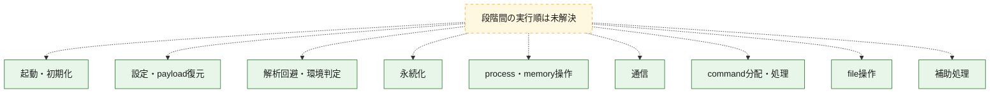
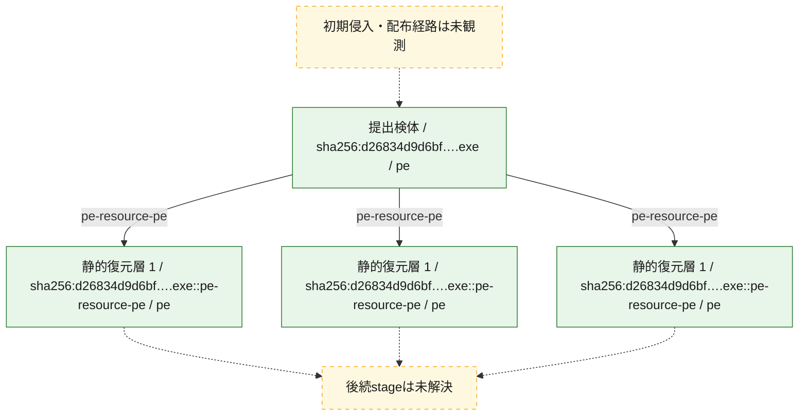
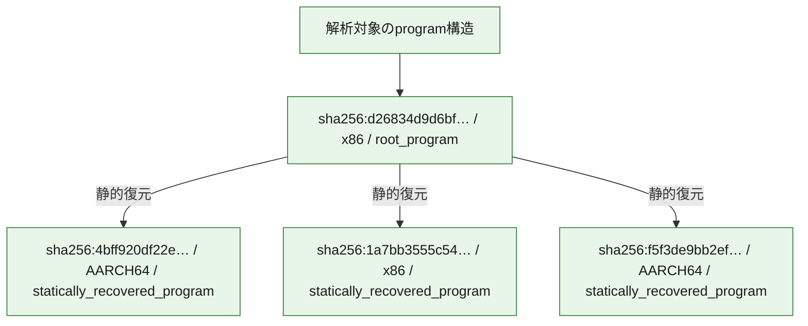

# 全体ロジック：d26834d9d6bfef3de785c34d373f51f918c9ee8639d80f02d7938e22f956316b

代表関数の静的証跡から、起動・初期化、設定・payload復元、解析回避・環境判定、永続化、process・memory操作、通信、command分配・処理、file操作の処理群を確認しました。

## 読み方

- phaseの掲載順は解析上の整理順です。observed_call_edgesがない段階間の実行順を断定しません。
- 図の実線は静的に観測した関係、点線と黄色のノードは未観測・未解決の関係を示します。
- 図は静的な要約であり、動的実行を再現するものではありません。
- 詳細な関数解説とfingerprintは[STATIC-LOGIC.md](STATIC-LOGIC.md)を参照してください。

## 静的可視化

### 実行フロー

### 感染チェーン

### モジュール関係

## 処理段階

### 1. 起動・初期化

entry pointから初期化と後続処理への移行を確認します。
確度: `confirmed_static_function_evidence`

- `4bff920df22e2d711b1d911ec2296dffc2796115d467add0546a2ee67c7781c2:ghidra:140007320` — 初期化と主要処理への分岐を行う入口関数です。 状態: `succeeded`、選定理由: `entry_point`, `meaningful_symbol_name`, `reviewed_call_centrality:2`, `role:entrypoint`, `small_program_complete_context`
- `1a7bb3555c5419befb1a5f54267dcae9a7af16749ddf4eef9b431fcf0b863110:ghidra:140007300` — 初期化と主要処理への分岐を行う入口関数です。 状態: `succeeded`、選定理由: `entry_point`, `meaningful_symbol_name`, `reviewed_call_centrality:2`, `role:entrypoint`, `small_program_complete_context`
- `f5f3de9bb2ef7895424c57fd423321cf4fbf4a1371850f67edb52177132c2b55:ghidra:180002fe0` — 初期化と主要処理への分岐を行う入口関数です。 状態: `succeeded`、選定理由: `entry_point`, `meaningful_symbol_name`, `reviewed_call_centrality:2`, `role:entrypoint`
- `d26834d9d6bfef3de785c34d373f51f918c9ee8639d80f02d7938e22f956316b:ghidra:33d5811f0` — 初期化と主要処理への分岐を行う入口関数です。 状態: `succeeded`、選定理由: `entry_point`, `meaningful_symbol_name`, `reviewed_call_centrality:2`, `role:entrypoint`

### 2. 設定・payload復元

設定、resource、payload、暗号化データの復元・変換を確認します。
確度: `confirmed_static_function_evidence_with_limits`

- `4bff920df22e2d711b1d911ec2296dffc2796115d467add0546a2ee67c7781c2:ghidra:140001c30` — 暗号、hash、encoding、または復号処理に関係する関数です。 状態: `succeeded`、選定理由: `context_representative`, `reviewed_call_centrality:39`, `role:cryptographic_transform`, `small_program_complete_context`
- `4bff920df22e2d711b1d911ec2296dffc2796115d467add0546a2ee67c7781c2:ghidra:1400027b0` — 設定、resource、payloadなどの解析・変換を行う関数です。 状態: `succeeded`、選定理由: `context_representative`, `reviewed_call_centrality:27`, `role:config_or_data_transform`, `small_program_complete_context`
- `4bff920df22e2d711b1d911ec2296dffc2796115d467add0546a2ee67c7781c2:ghidra:140002b80` — 設定、resource、payloadなどの解析・変換を行う関数です。 状態: `succeeded`、選定理由: `context_representative`, `reviewed_call_centrality:10`, `role:config_or_data_transform`, `small_program_complete_context`
- `4bff920df22e2d711b1d911ec2296dffc2796115d467add0546a2ee67c7781c2:ghidra:140002c20` — 設定、resource、payloadなどの解析・変換を行う関数です。 状態: `succeeded`、選定理由: `context_representative`, `reviewed_call_centrality:27`, `role:config_or_data_transform`, `small_program_complete_context`
- `4bff920df22e2d711b1d911ec2296dffc2796115d467add0546a2ee67c7781c2:ghidra:140002f70` — 設定、resource、payloadなどの解析・変換を行う関数です。 状態: `succeeded`、選定理由: `context_representative`, `reviewed_call_centrality:21`, `role:config_or_data_transform`, `small_program_complete_context`
- `4bff920df22e2d711b1d911ec2296dffc2796115d467add0546a2ee67c7781c2:ghidra:1400032c0` — 設定、resource、payloadなどの解析・変換を行う関数です。 状態: `succeeded`、選定理由: `context_representative`, `reviewed_call_centrality:19`, `role:config_or_data_transform`, `small_program_complete_context`
- `4bff920df22e2d711b1d911ec2296dffc2796115d467add0546a2ee67c7781c2:ghidra:1400037e0` — 設定、resource、payloadなどの解析・変換を行う関数です。 状態: `succeeded`、選定理由: `context_representative`, `reviewed_call_centrality:6`, `role:config_or_data_transform`, `small_program_complete_context`
- `1a7bb3555c5419befb1a5f54267dcae9a7af16749ddf4eef9b431fcf0b863110:ghidra:140001630` — 暗号、hash、encoding、または復号処理に関係する関数です。 状態: `succeeded`、選定理由: `context_representative`, `reviewed_call_centrality:37`, `role:cryptographic_transform`, `small_program_complete_context`
- `1a7bb3555c5419befb1a5f54267dcae9a7af16749ddf4eef9b431fcf0b863110:ghidra:140001a20` — 設定、resource、payloadなどの解析・変換を行う関数です。 状態: `succeeded`、選定理由: `context_representative`, `reviewed_call_centrality:36`, `role:config_or_data_transform`, `small_program_complete_context`
- `1a7bb3555c5419befb1a5f54267dcae9a7af16749ddf4eef9b431fcf0b863110:ghidra:140001f10` — 設定、resource、payloadなどの解析・変換を行う関数です。 状態: `succeeded`、選定理由: `context_representative`, `reviewed_call_centrality:26`, `role:config_or_data_transform`, `small_program_complete_context`
- `1a7bb3555c5419befb1a5f54267dcae9a7af16749ddf4eef9b431fcf0b863110:ghidra:1400020e0` — 設定、resource、payloadなどの解析・変換を行う関数です。 状態: `limited_bad_instruction_or_flow`、選定理由: `context_representative`, `reviewed_call_centrality:26`, `role:config_or_data_transform`, `small_program_complete_context`
- `1a7bb3555c5419befb1a5f54267dcae9a7af16749ddf4eef9b431fcf0b863110:ghidra:140002450` — 設定、resource、payloadなどの解析・変換を行う関数です。 状態: `limited_bad_instruction_or_flow`、選定理由: `context_representative`, `reviewed_call_centrality:9`, `role:config_or_data_transform`, `small_program_complete_context`
- `1a7bb3555c5419befb1a5f54267dcae9a7af16749ddf4eef9b431fcf0b863110:ghidra:1400027c0` — 設定、resource、payloadなどの解析・変換を行う関数です。 状態: `succeeded`、選定理由: `context_representative`, `reviewed_call_centrality:18`, `role:config_or_data_transform`, `small_program_complete_context`
- `1a7bb3555c5419befb1a5f54267dcae9a7af16749ddf4eef9b431fcf0b863110:ghidra:140002ae0` — 設定、resource、payloadなどの解析・変換を行う関数です。 状態: `limited_bad_instruction_or_flow`、選定理由: `context_representative`, `reviewed_call_centrality:19`, `role:config_or_data_transform`, `small_program_complete_context`
- `1a7bb3555c5419befb1a5f54267dcae9a7af16749ddf4eef9b431fcf0b863110:ghidra:140002f30` — 設定、resource、payloadなどの解析・変換を行う関数です。 状態: `limited_bad_instruction_or_flow`、選定理由: `context_representative`, `reviewed_call_centrality:6`, `role:config_or_data_transform`, `small_program_complete_context`
- `d26834d9d6bfef3de785c34d373f51f918c9ee8639d80f02d7938e22f956316b:ghidra:33d583880` — 設定、resource、payloadなどの解析・変換を行う関数です。 状態: `succeeded`、選定理由: `entry_point`, `meaningful_symbol_name`, `reviewed_call_centrality:18`, `role:config_or_data_transform`

### 3. 解析回避・環境判定

debugger、sandbox、仮想環境、時間差などの判定を確認します。
確度: `confirmed_static_function_evidence`

- `1a7bb3555c5419befb1a5f54267dcae9a7af16749ddf4eef9b431fcf0b863110:ghidra:140003060` — debugger、仮想環境、sandbox、または時間差の確認に関係する関数です。 状態: `succeeded`、選定理由: `context_representative`, `reviewed_call_centrality:6`, `role:anti_analysis`, `small_program_complete_context`
- `d26834d9d6bfef3de785c34d373f51f918c9ee8639d80f02d7938e22f956316b:ghidra:33d581000` — debugger、仮想環境、sandbox、または時間差の確認に関係する関数です。 状態: `succeeded`、選定理由: `context_representative`, `reviewed_call_centrality:14`, `role:anti_analysis`

### 4. 永続化

自動起動や永続化に関係する設定変更を確認します。
確度: `confirmed_static_function_evidence`

- `d26834d9d6bfef3de785c34d373f51f918c9ee8639d80f02d7938e22f956316b:ghidra:33d583530` — 自動起動または永続化に関係する処理を含む関数です。 状態: `succeeded`、選定理由: `entry_point`, `meaningful_symbol_name`, `reviewed_call_centrality:11`, `role:persistence`

### 5. process・memory操作

process、thread、module、memory操作と実行移行を確認します。
確度: `confirmed_static_function_evidence`

- `f5f3de9bb2ef7895424c57fd423321cf4fbf4a1371850f67edb52177132c2b55:ghidra:180001d10` — process、thread、module、またはmemory操作に関係する関数です。 状態: `succeeded`、選定理由: `context_representative`, `reviewed_call_centrality:11`, `role:process_or_memory_operation`
- `d26834d9d6bfef3de785c34d373f51f918c9ee8639d80f02d7938e22f956316b:ghidra:33d582960` — process、thread、module、またはmemory操作に関係する関数です。 状態: `succeeded`、選定理由: `entry_point`, `meaningful_symbol_name`, `reviewed_call_centrality:36`, `role:process_or_memory_operation`
- `d26834d9d6bfef3de785c34d373f51f918c9ee8639d80f02d7938e22f956316b:ghidra:33d582c60` — process、thread、module、またはmemory操作に関係する関数です。 状態: `succeeded`、選定理由: `context_representative`, `reviewed_call_centrality:36`, `role:process_or_memory_operation`
- `d26834d9d6bfef3de785c34d373f51f918c9ee8639d80f02d7938e22f956316b:ghidra:33d582c70` — process、thread、module、またはmemory操作に関係する関数です。 状態: `succeeded`、選定理由: `context_representative`, `reviewed_call_centrality:4`, `role:process_or_memory_operation`

### 6. 通信

通信初期化、endpoint処理、送受信の役割を確認します。
確度: `confirmed_static_function_evidence`

- `4bff920df22e2d711b1d911ec2296dffc2796115d467add0546a2ee67c7781c2:ghidra:140001620` — 通信初期化、送受信、またはendpoint処理に関係する関数です。 状態: `succeeded`、選定理由: `context_representative`, `reviewed_call_centrality:21`, `role:network_communication`, `small_program_complete_context`
- `4bff920df22e2d711b1d911ec2296dffc2796115d467add0546a2ee67c7781c2:ghidra:140002a00` — 通信初期化、送受信、またはendpoint処理に関係する関数です。 状態: `succeeded`、選定理由: `context_representative`, `reviewed_call_centrality:20`, `role:network_communication`, `small_program_complete_context`
- `1a7bb3555c5419befb1a5f54267dcae9a7af16749ddf4eef9b431fcf0b863110:ghidra:1400010b0` — 通信初期化、送受信、またはendpoint処理に関係する関数です。 状態: `succeeded`、選定理由: `context_representative`, `reviewed_call_centrality:20`, `role:network_communication`, `small_program_complete_context`
- `1a7bb3555c5419befb1a5f54267dcae9a7af16749ddf4eef9b431fcf0b863110:ghidra:140002310` — 通信初期化、送受信、またはendpoint処理に関係する関数です。 状態: `succeeded`、選定理由: `context_representative`, `reviewed_call_centrality:20`, `role:network_communication`, `small_program_complete_context`

### 7. command分配・処理

受信commandやtaskの解釈、分配、個別handlerへの移行を確認します。
確度: `confirmed_static_function_evidence_with_limits`

- `4bff920df22e2d711b1d911ec2296dffc2796115d467add0546a2ee67c7781c2:ghidra:140001540` — commandの解釈、分配、または個別処理を担当する関数です。 状態: `limited_bad_instruction_or_flow`、選定理由: `meaningful_symbol_name`, `role:command_dispatch_or_handler`, `small_program_complete_context`
- `1a7bb3555c5419befb1a5f54267dcae9a7af16749ddf4eef9b431fcf0b863110:ghidra:1400024d0` — commandの解釈、分配、または個別処理を担当する関数です。 状態: `succeeded`、選定理由: `context_representative`, `reviewed_call_centrality:26`, `role:command_dispatch_or_handler`, `small_program_complete_context`
- `1a7bb3555c5419befb1a5f54267dcae9a7af16749ddf4eef9b431fcf0b863110:ghidra:140003120` — commandの解釈、分配、または個別処理を担当する関数です。 状態: `limited_bad_instruction_or_flow`、選定理由: `meaningful_symbol_name`, `reviewed_call_centrality:3`, `role:command_dispatch_or_handler`, `small_program_complete_context`
- `1a7bb3555c5419befb1a5f54267dcae9a7af16749ddf4eef9b431fcf0b863110:ghidra:140007000` — commandの解釈、分配、または個別処理を担当する関数です。 状態: `succeeded`、選定理由: `context_representative`, `reviewed_call_centrality:17`, `role:command_dispatch_or_handler`, `small_program_complete_context`
- `f5f3de9bb2ef7895424c57fd423321cf4fbf4a1371850f67edb52177132c2b55:ghidra:180001e10` — commandの解釈、分配、または個別処理を担当する関数です。 状態: `succeeded`、選定理由: `entry_point`, `meaningful_symbol_name`, `reviewed_call_centrality:21`, `role:command_dispatch_or_handler`
- `f5f3de9bb2ef7895424c57fd423321cf4fbf4a1371850f67edb52177132c2b55:ghidra:180001fa0` — commandの解釈、分配、または個別処理を担当する関数です。 状態: `succeeded`、選定理由: `entry_point`, `meaningful_symbol_name`, `reviewed_call_centrality:21`, `role:command_dispatch_or_handler`
- `f5f3de9bb2ef7895424c57fd423321cf4fbf4a1371850f67edb52177132c2b55:ghidra:180002130` — commandの解釈、分配、または個別処理を担当する関数です。 状態: `succeeded`、選定理由: `entry_point`, `meaningful_symbol_name`, `reviewed_call_centrality:21`, `role:command_dispatch_or_handler`
- `f5f3de9bb2ef7895424c57fd423321cf4fbf4a1371850f67edb52177132c2b55:ghidra:180002360` — commandの解釈、分配、または個別処理を担当する関数です。 状態: `limited_bad_instruction_or_flow`、選定理由: `meaningful_symbol_name`, `reviewed_call_centrality:1`, `role:command_dispatch_or_handler`

### 8. file操作

fileやdirectoryの作成、読書き、削除を確認します。
確度: `confirmed_static_function_evidence`

- `d26834d9d6bfef3de785c34d373f51f918c9ee8639d80f02d7938e22f956316b:ghidra:33d583280` — fileまたはdirectoryの読書き・管理に関係する関数です。 状態: `succeeded`、選定理由: `entry_point`, `meaningful_symbol_name`, `reviewed_call_centrality:15`, `role:file_operation`

### 9. 補助処理

主要処理を支える一般内部関数またはlibrary処理を確認します。
確度: `confirmed_static_function_evidence_with_limits`

- `4bff920df22e2d711b1d911ec2296dffc2796115d467add0546a2ee67c7781c2:ghidra:140001a20` — 検体内部の一般処理を実装する関数です。 状態: `succeeded`、選定理由: `meaningful_symbol_name`, `reviewed_call_centrality:3`, `small_program_complete_context`
- `4bff920df22e2d711b1d911ec2296dffc2796115d467add0546a2ee67c7781c2:ghidra:140001a30` — 検体内部の一般処理を実装する関数です。 状態: `succeeded`、選定理由: `context_representative`, `reviewed_call_centrality:13`, `small_program_complete_context`
- `4bff920df22e2d711b1d911ec2296dffc2796115d467add0546a2ee67c7781c2:ghidra:140002ee0` — 検体内部の一般処理を実装する関数です。 状態: `succeeded`、選定理由: `context_representative`, `reviewed_call_centrality:1`, `small_program_complete_context`
- `4bff920df22e2d711b1d911ec2296dffc2796115d467add0546a2ee67c7781c2:ghidra:140002f00` — 検体内部の一般処理を実装する関数です。 状態: `succeeded`、選定理由: `context_representative`, `reviewed_call_centrality:7`, `small_program_complete_context`
- `4bff920df22e2d711b1d911ec2296dffc2796115d467add0546a2ee67c7781c2:ghidra:1400036e0` — 検体内部の一般処理を実装する関数です。 状態: `succeeded`、選定理由: `context_representative`, `small_program_complete_context`
- `4bff920df22e2d711b1d911ec2296dffc2796115d467add0546a2ee67c7781c2:ghidra:1400037c0` — 検体内部の一般処理を実装する関数です。 状態: `succeeded`、選定理由: `context_representative`, `small_program_complete_context`
- `1a7bb3555c5419befb1a5f54267dcae9a7af16749ddf4eef9b431fcf0b863110:ghidra:140001000` — 検体内部の一般処理を実装する関数です。 状態: `succeeded`、選定理由: `context_representative`, `reviewed_call_centrality:6`, `small_program_complete_context`
- `1a7bb3555c5419befb1a5f54267dcae9a7af16749ddf4eef9b431fcf0b863110:ghidra:140001440` — 検体内部の一般処理を実装する関数です。 状態: `succeeded`、選定理由: `context_representative`, `small_program_complete_context`
- `1a7bb3555c5419befb1a5f54267dcae9a7af16749ddf4eef9b431fcf0b863110:ghidra:140001450` — 検体内部の一般処理を実装する関数です。 状態: `succeeded`、選定理由: `context_representative`, `reviewed_call_centrality:12`, `small_program_complete_context`
- `1a7bb3555c5419befb1a5f54267dcae9a7af16749ddf4eef9b431fcf0b863110:ghidra:140002750` — 検体内部の一般処理を実装する関数です。 状態: `succeeded`、選定理由: `context_representative`, `small_program_complete_context`
- `1a7bb3555c5419befb1a5f54267dcae9a7af16749ddf4eef9b431fcf0b863110:ghidra:140002760` — 検体内部の一般処理を実装する関数です。 状態: `succeeded`、選定理由: `context_representative`, `reviewed_call_centrality:6`, `small_program_complete_context`
- `1a7bb3555c5419befb1a5f54267dcae9a7af16749ddf4eef9b431fcf0b863110:ghidra:140002e80` — 検体内部の一般処理を実装する関数です。 状態: `succeeded`、選定理由: `context_representative`, `small_program_complete_context`
- `1a7bb3555c5419befb1a5f54267dcae9a7af16749ddf4eef9b431fcf0b863110:ghidra:140002f10` — 検体内部の一般処理を実装する関数です。 状態: `succeeded`、選定理由: `context_representative`, `small_program_complete_context`
- `1a7bb3555c5419befb1a5f54267dcae9a7af16749ddf4eef9b431fcf0b863110:ghidra:140002f90` — 検体内部の一般処理を実装する関数です。 状態: `succeeded`、選定理由: `context_representative`, `reviewed_call_centrality:8`, `small_program_complete_context`
- `1a7bb3555c5419befb1a5f54267dcae9a7af16749ddf4eef9b431fcf0b863110:ghidra:140002fb0` — 検体内部の一般処理を実装する関数です。 状態: `succeeded`、選定理由: `context_representative`, `reviewed_call_centrality:3`, `small_program_complete_context`
- `1a7bb3555c5419befb1a5f54267dcae9a7af16749ddf4eef9b431fcf0b863110:ghidra:140002fe0` — 検体内部の一般処理を実装する関数です。 状態: `succeeded`、選定理由: `context_representative`, `reviewed_call_centrality:1`, `small_program_complete_context`
- `1a7bb3555c5419befb1a5f54267dcae9a7af16749ddf4eef9b431fcf0b863110:ghidra:140003000` — 検体内部の一般処理を実装する関数です。 状態: `succeeded`、選定理由: `context_representative`, `reviewed_call_centrality:2`, `small_program_complete_context`
- `1a7bb3555c5419befb1a5f54267dcae9a7af16749ddf4eef9b431fcf0b863110:ghidra:140003100` — 検体内部の一般処理を実装する関数です。 状態: `succeeded`、選定理由: `meaningful_symbol_name`, `small_program_complete_context`
- `1a7bb3555c5419befb1a5f54267dcae9a7af16749ddf4eef9b431fcf0b863110:ghidra:140003140` — 検体内部の一般処理を実装する関数です。 状態: `limited_bad_instruction_or_flow`、選定理由: `context_representative`, `small_program_complete_context`
- `1a7bb3555c5419befb1a5f54267dcae9a7af16749ddf4eef9b431fcf0b863110:ghidra:140003180` — 検体内部の一般処理を実装する関数です。 状態: `succeeded`、選定理由: `context_representative`, `reviewed_call_centrality:1`, `small_program_complete_context`
- `1a7bb3555c5419befb1a5f54267dcae9a7af16749ddf4eef9b431fcf0b863110:ghidra:140003440` — 検体内部の一般処理を実装する関数です。 状態: `succeeded`、選定理由: `context_representative`, `reviewed_call_centrality:3`, `small_program_complete_context`
- `1a7bb3555c5419befb1a5f54267dcae9a7af16749ddf4eef9b431fcf0b863110:ghidra:140003580` — 検体内部の一般処理を実装する関数です。 状態: `succeeded`、選定理由: `context_representative`, `reviewed_call_centrality:1`, `small_program_complete_context`
- `1a7bb3555c5419befb1a5f54267dcae9a7af16749ddf4eef9b431fcf0b863110:ghidra:140003600` — 検体内部の一般処理を実装する関数です。 状態: `succeeded`、選定理由: `context_representative`, `reviewed_call_centrality:3`, `small_program_complete_context`
- `f5f3de9bb2ef7895424c57fd423321cf4fbf4a1371850f67edb52177132c2b55:ghidra:1800022b8` — 検体内部の一般処理を実装する関数です。 状態: `limited_bad_instruction_or_flow`、選定理由: `meaningful_symbol_name`, `reviewed_call_centrality:1`
- `f5f3de9bb2ef7895424c57fd423321cf4fbf4a1371850f67edb52177132c2b55:ghidra:180002330` — 検体内部の一般処理を実装する関数です。 状態: `limited_bad_instruction_or_flow`、選定理由: `meaningful_symbol_name`, `reviewed_call_centrality:1`
- `f5f3de9bb2ef7895424c57fd423321cf4fbf4a1371850f67edb52177132c2b55:ghidra:18000233c` — 検体内部の一般処理を実装する関数です。 状態: `limited_bad_instruction_or_flow`、選定理由: `meaningful_symbol_name`, `reviewed_call_centrality:1`
- `f5f3de9bb2ef7895424c57fd423321cf4fbf4a1371850f67edb52177132c2b55:ghidra:180002348` — 検体内部の一般処理を実装する関数です。 状態: `limited_bad_instruction_or_flow`、選定理由: `meaningful_symbol_name`, `reviewed_call_centrality:1`
- `f5f3de9bb2ef7895424c57fd423321cf4fbf4a1371850f67edb52177132c2b55:ghidra:180002354` — 検体内部の一般処理を実装する関数です。 状態: `limited_bad_instruction_or_flow`、選定理由: `meaningful_symbol_name`, `reviewed_call_centrality:1`
- `f5f3de9bb2ef7895424c57fd423321cf4fbf4a1371850f67edb52177132c2b55:ghidra:180002c10` — 検体内部の一般処理を実装する関数です。 状態: `succeeded`、選定理由: `context_representative`, `reviewed_call_centrality:4`
- `f5f3de9bb2ef7895424c57fd423321cf4fbf4a1371850f67edb52177132c2b55:ghidra:180003030` — 検体内部の一般処理を実装する関数です。 状態: `succeeded`、選定理由: `meaningful_symbol_name`, `reviewed_call_centrality:1`
- `f5f3de9bb2ef7895424c57fd423321cf4fbf4a1371850f67edb52177132c2b55:ghidra:180003170` — 検体内部の一般処理を実装する関数です。 状態: `succeeded`、選定理由: `context_representative`
- `f5f3de9bb2ef7895424c57fd423321cf4fbf4a1371850f67edb52177132c2b55:ghidra:180003b30` — 検体内部の一般処理を実装する関数です。 状態: `succeeded`、選定理由: `context_representative`, `reviewed_call_centrality:3`
- `f5f3de9bb2ef7895424c57fd423321cf4fbf4a1371850f67edb52177132c2b55:ghidra:180003d00` — 検体内部の一般処理を実装する関数です。 状態: `succeeded`、選定理由: `context_representative`, `reviewed_call_centrality:6`
- `f5f3de9bb2ef7895424c57fd423321cf4fbf4a1371850f67edb52177132c2b55:ghidra:180005780` — 検体内部の一般処理を実装する関数です。 状態: `succeeded`、選定理由: `context_representative`, `reviewed_call_centrality:2`
- `f5f3de9bb2ef7895424c57fd423321cf4fbf4a1371850f67edb52177132c2b55:ghidra:1800057d0` — 検体内部の一般処理を実装する関数です。 状態: `succeeded`、選定理由: `context_representative`, `reviewed_call_centrality:7`
- `f5f3de9bb2ef7895424c57fd423321cf4fbf4a1371850f67edb52177132c2b55:ghidra:180005e40` — 検体内部の一般処理を実装する関数です。 状態: `succeeded`、選定理由: `context_representative`
- `f5f3de9bb2ef7895424c57fd423321cf4fbf4a1371850f67edb52177132c2b55:ghidra:180007150` — 検体内部の一般処理を実装する関数です。 状態: `succeeded`、選定理由: `context_representative`
- `f5f3de9bb2ef7895424c57fd423321cf4fbf4a1371850f67edb52177132c2b55:ghidra:180007170` — 検体内部の一般処理を実装する関数です。 状態: `succeeded`、選定理由: `context_representative`, `reviewed_call_centrality:1`
- `f5f3de9bb2ef7895424c57fd423321cf4fbf4a1371850f67edb52177132c2b55:ghidra:1800071b0` — 検体内部の一般処理を実装する関数です。 状態: `succeeded`、選定理由: `context_representative`, `reviewed_call_centrality:1`
- `f5f3de9bb2ef7895424c57fd423321cf4fbf4a1371850f67edb52177132c2b55:ghidra:1800071d0` — 検体内部の一般処理を実装する関数です。 状態: `succeeded`、選定理由: `context_representative`, `reviewed_call_centrality:5`
- `f5f3de9bb2ef7895424c57fd423321cf4fbf4a1371850f67edb52177132c2b55:ghidra:180007230` — 検体内部の一般処理を実装する関数です。 状態: `succeeded`、選定理由: `context_representative`, `reviewed_call_centrality:1`
- `f5f3de9bb2ef7895424c57fd423321cf4fbf4a1371850f67edb52177132c2b55:ghidra:180007260` — 検体内部の一般処理を実装する関数です。 状態: `succeeded`、選定理由: `context_representative`, `reviewed_call_centrality:2`
- `f5f3de9bb2ef7895424c57fd423321cf4fbf4a1371850f67edb52177132c2b55:ghidra:1800072b0` — 検体内部の一般処理を実装する関数です。 状態: `succeeded`、選定理由: `context_representative`, `reviewed_call_centrality:1`
- `f5f3de9bb2ef7895424c57fd423321cf4fbf4a1371850f67edb52177132c2b55:ghidra:180007d80` — 検体内部の一般処理を実装する関数です。 状態: `succeeded`、選定理由: `context_representative`, `reviewed_call_centrality:2`
- `f5f3de9bb2ef7895424c57fd423321cf4fbf4a1371850f67edb52177132c2b55:ghidra:180008300` — 検体内部の一般処理を実装する関数です。 状態: `succeeded`、選定理由: `context_representative`, `reviewed_call_centrality:3`
- `f5f3de9bb2ef7895424c57fd423321cf4fbf4a1371850f67edb52177132c2b55:ghidra:180008360` — 検体内部の一般処理を実装する関数です。 状態: `succeeded`、選定理由: `context_representative`, `reviewed_call_centrality:2`
- `f5f3de9bb2ef7895424c57fd423321cf4fbf4a1371850f67edb52177132c2b55:ghidra:1800083a0` — 検体内部の一般処理を実装する関数です。 状態: `succeeded`、選定理由: `context_representative`, `reviewed_call_centrality:2`
- `f5f3de9bb2ef7895424c57fd423321cf4fbf4a1371850f67edb52177132c2b55:ghidra:180008450` — 検体内部の一般処理を実装する関数です。 状態: `succeeded`、選定理由: `context_representative`, `reviewed_call_centrality:3`
- `f5f3de9bb2ef7895424c57fd423321cf4fbf4a1371850f67edb52177132c2b55:ghidra:1800089b0` — 検体内部の一般処理を実装する関数です。 状態: `succeeded`、選定理由: `context_representative`
- `d26834d9d6bfef3de785c34d373f51f918c9ee8639d80f02d7938e22f956316b:ghidra:33d581330` — 検体内部の一般処理を実装する関数です。 状態: `limited_bad_instruction_or_flow`、選定理由: `context_representative`, `reviewed_call_centrality:2`
- `d26834d9d6bfef3de785c34d373f51f918c9ee8639d80f02d7938e22f956316b:ghidra:33d581340` — 検体内部の一般処理を実装する関数です。 状態: `limited_bad_instruction_or_flow`、選定理由: `context_representative`, `reviewed_call_centrality:2`
- `d26834d9d6bfef3de785c34d373f51f918c9ee8639d80f02d7938e22f956316b:ghidra:33d581350` — 検体内部の一般処理を実装する関数です。 状態: `succeeded`、選定理由: `context_representative`
- `d26834d9d6bfef3de785c34d373f51f918c9ee8639d80f02d7938e22f956316b:ghidra:33d581360` — 検体内部の一般処理を実装する関数です。 状態: `succeeded`、選定理由: `context_representative`, `reviewed_call_centrality:2`
- `d26834d9d6bfef3de785c34d373f51f918c9ee8639d80f02d7938e22f956316b:ghidra:33d581510` — 検体内部の一般処理を実装する関数です。 状態: `succeeded`、選定理由: `context_representative`, `reviewed_call_centrality:2`
- `d26834d9d6bfef3de785c34d373f51f918c9ee8639d80f02d7938e22f956316b:ghidra:33d5816c0` — 検体内部の一般処理を実装する関数です。 状態: `succeeded`、選定理由: `context_representative`, `reviewed_call_centrality:2`
- `d26834d9d6bfef3de785c34d373f51f918c9ee8639d80f02d7938e22f956316b:ghidra:33d581870` — 検体内部の一般処理を実装する関数です。 状態: `succeeded`、選定理由: `context_representative`, `reviewed_call_centrality:2`
- `d26834d9d6bfef3de785c34d373f51f918c9ee8639d80f02d7938e22f956316b:ghidra:33d581a20` — 検体内部の一般処理を実装する関数です。 状態: `succeeded`、選定理由: `context_representative`, `reviewed_call_centrality:2`
- `d26834d9d6bfef3de785c34d373f51f918c9ee8639d80f02d7938e22f956316b:ghidra:33d581bd0` — 検体内部の一般処理を実装する関数です。 状態: `succeeded`、選定理由: `context_representative`, `reviewed_call_centrality:2`
- `d26834d9d6bfef3de785c34d373f51f918c9ee8639d80f02d7938e22f956316b:ghidra:33d581d80` — 検体内部の一般処理を実装する関数です。 状態: `succeeded`、選定理由: `context_representative`, `reviewed_call_centrality:1`
- `d26834d9d6bfef3de785c34d373f51f918c9ee8639d80f02d7938e22f956316b:ghidra:33d582060` — 検体内部の一般処理を実装する関数です。 状態: `succeeded`、選定理由: `context_representative`, `reviewed_call_centrality:1`
- `d26834d9d6bfef3de785c34d373f51f918c9ee8639d80f02d7938e22f956316b:ghidra:33d582340` — 検体内部の一般処理を実装する関数です。 状態: `succeeded`、選定理由: `context_representative`, `reviewed_call_centrality:1`
- `d26834d9d6bfef3de785c34d373f51f918c9ee8639d80f02d7938e22f956316b:ghidra:33d582620` — 検体内部の一般処理を実装する関数です。 状態: `succeeded`、選定理由: `context_representative`, `reviewed_call_centrality:6`
- `d26834d9d6bfef3de785c34d373f51f918c9ee8639d80f02d7938e22f956316b:ghidra:33d582cc0` — 検体内部の一般処理を実装する関数です。 状態: `succeeded`、選定理由: `entry_point`, `meaningful_symbol_name`, `reviewed_call_centrality:7`
- `d26834d9d6bfef3de785c34d373f51f918c9ee8639d80f02d7938e22f956316b:ghidra:33d582ff0` — 検体内部の一般処理を実装する関数です。 状態: `succeeded`、選定理由: `entry_point`, `meaningful_symbol_name`, `reviewed_call_centrality:5`
- `d26834d9d6bfef3de785c34d373f51f918c9ee8639d80f02d7938e22f956316b:ghidra:33d5831f0` — 検体内部の一般処理を実装する関数です。 状態: `succeeded`、選定理由: `entry_point`, `meaningful_symbol_name`, `reviewed_call_centrality:2`
- `d26834d9d6bfef3de785c34d373f51f918c9ee8639d80f02d7938e22f956316b:ghidra:33d584400` — 検体内部の一般処理を実装する関数です。 状態: `succeeded`、選定理由: `entry_point`, `meaningful_symbol_name`, `reviewed_call_centrality:20`
- `d26834d9d6bfef3de785c34d373f51f918c9ee8639d80f02d7938e22f956316b:ghidra:33d584f30` — 検体内部の一般処理を実装する関数です。 状態: `succeeded`、選定理由: `entry_point`, `meaningful_symbol_name`, `reviewed_call_centrality:8`
- `d26834d9d6bfef3de785c34d373f51f918c9ee8639d80f02d7938e22f956316b:ghidra:33d5852d0` — 検体内部の一般処理を実装する関数です。 状態: `succeeded`、選定理由: `entry_point`, `meaningful_symbol_name`, `reviewed_call_centrality:8`
- `d26834d9d6bfef3de785c34d373f51f918c9ee8639d80f02d7938e22f956316b:ghidra:33d586040` — 検体内部の一般処理を実装する関数です。 状態: `succeeded`、選定理由: `context_representative`
- `d26834d9d6bfef3de785c34d373f51f918c9ee8639d80f02d7938e22f956316b:ghidra:33d586090` — 検体内部の一般処理を実装する関数です。 状態: `limited_bad_instruction_or_flow`、選定理由: `context_representative`, `reviewed_call_centrality:2`
- `d26834d9d6bfef3de785c34d373f51f918c9ee8639d80f02d7938e22f956316b:ghidra:33d586110` — 検体内部の一般処理を実装する関数です。 状態: `limited_bad_instruction_or_flow`、選定理由: `context_representative`, `reviewed_call_centrality:3`
- `d26834d9d6bfef3de785c34d373f51f918c9ee8639d80f02d7938e22f956316b:ghidra:33d586130` — compiler生成処理または汎用library処理とみられる関数です。 状態: `succeeded`、選定理由: `entry_point`, `meaningful_symbol_name`, `reviewed_call_centrality:7`
- `d26834d9d6bfef3de785c34d373f51f918c9ee8639d80f02d7938e22f956316b:ghidra:33d586150` — compiler生成処理または汎用library処理とみられる関数です。 状態: `succeeded`、選定理由: `entry_point`, `meaningful_symbol_name`, `reviewed_call_centrality:4`

## 観測したcall関係

- 代表関数間で直接解決できた呼出関係はありません。

## 解析範囲と制約

- 選定外関数は全体inventoryへ残しますが、関数本体の個別解説対象にはしていません。
- indirect call、難読化、packer、VM、壊れたcontrol flowによりcall関係が欠落する場合があります。
- 文書は静的解析に基づき、検体実行や外部通信による動的確認は行っていません。
