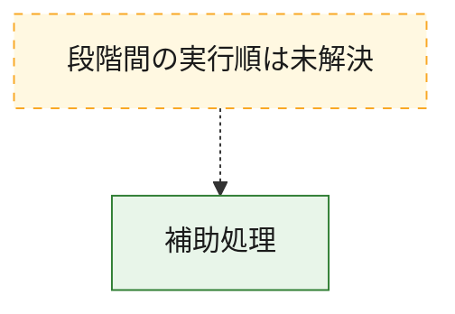
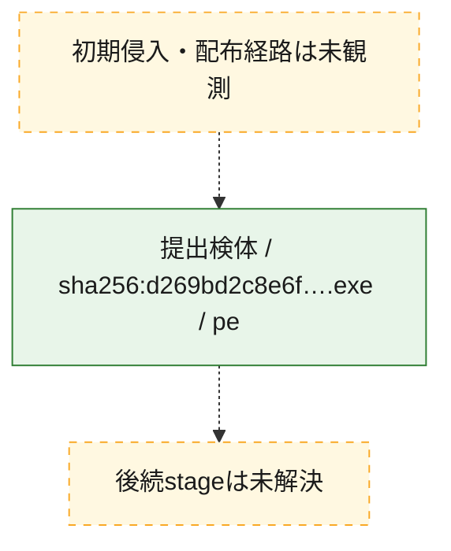
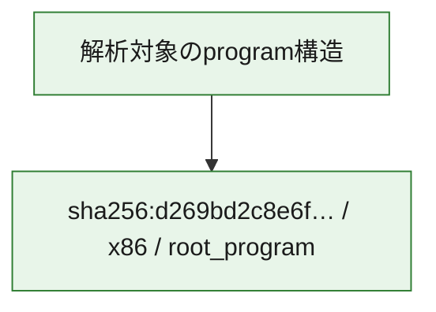

# 全体ロジック：d269bd2c8e6fd003dac682f37ae9b0b6b173db757b6c09dc7e1e1d46e29b73cf

代表関数から主要なmalware処理段階を自動分類できませんでした。

## 読み方

- phaseの掲載順は解析上の整理順です。observed_call_edgesがない段階間の実行順を断定しません。
- 図の実線は静的に観測した関係、点線と黄色のノードは未観測・未解決の関係を示します。
- 図は静的な要約であり、動的実行を再現するものではありません。
- 詳細な関数解説とfingerprintは[STATIC-LOGIC.md](STATIC-LOGIC.md)を参照してください。

## 静的可視化

### 実行フロー

### 感染チェーン

### モジュール関係

## 処理段階

### 1. 補助処理

主要処理を支える一般内部関数またはlibrary処理を確認します。
確度: `confirmed_static_function_evidence_with_limits`

- `d269bd2c8e6fd003dac682f37ae9b0b6b173db757b6c09dc7e1e1d46e29b73cf:ghidra:140001b90` — 検体内部の一般処理を実装する関数です。 状態: `limited_bad_instruction_or_flow`、選定理由: `context_representative`, `reviewed_call_centrality:1`
- `d269bd2c8e6fd003dac682f37ae9b0b6b173db757b6c09dc7e1e1d46e29b73cf:ghidra:140001cb4` — 検体内部の一般処理を実装する関数です。 状態: `limited_bad_instruction_or_flow`、選定理由: `context_representative`, `reviewed_call_centrality:1`
- `d269bd2c8e6fd003dac682f37ae9b0b6b173db757b6c09dc7e1e1d46e29b73cf:ghidra:140001cd8` — 検体内部の一般処理を実装する関数です。 状態: `limited_bad_instruction_or_flow`、選定理由: `context_representative`, `reviewed_call_centrality:1`
- `d269bd2c8e6fd003dac682f37ae9b0b6b173db757b6c09dc7e1e1d46e29b73cf:ghidra:140001d5c` — 検体内部の一般処理を実装する関数です。 状態: `limited_bad_instruction_or_flow`、選定理由: `context_representative`, `reviewed_call_centrality:1`
- `d269bd2c8e6fd003dac682f37ae9b0b6b173db757b6c09dc7e1e1d46e29b73cf:ghidra:140001db0` — 検体内部の一般処理を実装する関数です。 状態: `limited_bad_instruction_or_flow`、選定理由: `context_representative`, `reviewed_call_centrality:1`
- `d269bd2c8e6fd003dac682f37ae9b0b6b173db757b6c09dc7e1e1d46e29b73cf:ghidra:140001ee8` — 検体内部の一般処理を実装する関数です。 状態: `limited_bad_instruction_or_flow`、選定理由: `context_representative`, `reviewed_call_centrality:1`
- `d269bd2c8e6fd003dac682f37ae9b0b6b173db757b6c09dc7e1e1d46e29b73cf:ghidra:140001f1c` — 検体内部の一般処理を実装する関数です。 状態: `limited_bad_instruction_or_flow`、選定理由: `context_representative`, `reviewed_call_centrality:1`
- `d269bd2c8e6fd003dac682f37ae9b0b6b173db757b6c09dc7e1e1d46e29b73cf:ghidra:140001f98` — 検体内部の一般処理を実装する関数です。 状態: `limited_bad_instruction_or_flow`、選定理由: `context_representative`, `reviewed_call_centrality:1`
- `d269bd2c8e6fd003dac682f37ae9b0b6b173db757b6c09dc7e1e1d46e29b73cf:ghidra:140002070` — 検体内部の一般処理を実装する関数です。 状態: `limited_bad_instruction_or_flow`、選定理由: `context_representative`, `reviewed_call_centrality:1`
- `d269bd2c8e6fd003dac682f37ae9b0b6b173db757b6c09dc7e1e1d46e29b73cf:ghidra:140002178` — 検体内部の一般処理を実装する関数です。 状態: `limited_bad_instruction_or_flow`、選定理由: `context_representative`, `reviewed_call_centrality:1`
- `d269bd2c8e6fd003dac682f37ae9b0b6b173db757b6c09dc7e1e1d46e29b73cf:ghidra:140002288` — 検体内部の一般処理を実装する関数です。 状態: `limited_bad_instruction_or_flow`、選定理由: `context_representative`, `reviewed_call_centrality:1`
- `d269bd2c8e6fd003dac682f37ae9b0b6b173db757b6c09dc7e1e1d46e29b73cf:ghidra:1400023bc` — 検体内部の一般処理を実装する関数です。 状態: `limited_bad_instruction_or_flow`、選定理由: `context_representative`, `reviewed_call_centrality:1`
- `d269bd2c8e6fd003dac682f37ae9b0b6b173db757b6c09dc7e1e1d46e29b73cf:ghidra:140002468` — 検体内部の一般処理を実装する関数です。 状態: `limited_bad_instruction_or_flow`、選定理由: `context_representative`, `reviewed_call_centrality:1`
- `d269bd2c8e6fd003dac682f37ae9b0b6b173db757b6c09dc7e1e1d46e29b73cf:ghidra:140002504` — 検体内部の一般処理を実装する関数です。 状態: `limited_bad_instruction_or_flow`、選定理由: `context_representative`, `reviewed_call_centrality:1`
- `d269bd2c8e6fd003dac682f37ae9b0b6b173db757b6c09dc7e1e1d46e29b73cf:ghidra:140002688` — 検体内部の一般処理を実装する関数です。 状態: `limited_bad_instruction_or_flow`、選定理由: `context_representative`, `reviewed_call_centrality:1`
- `d269bd2c8e6fd003dac682f37ae9b0b6b173db757b6c09dc7e1e1d46e29b73cf:ghidra:140002854` — 検体内部の一般処理を実装する関数です。 状態: `limited_bad_instruction_or_flow`、選定理由: `context_representative`, `reviewed_call_centrality:1`
- `d269bd2c8e6fd003dac682f37ae9b0b6b173db757b6c09dc7e1e1d46e29b73cf:ghidra:140002a6c` — 検体内部の一般処理を実装する関数です。 状態: `limited_bad_instruction_or_flow`、選定理由: `context_representative`, `reviewed_call_centrality:1`
- `d269bd2c8e6fd003dac682f37ae9b0b6b173db757b6c09dc7e1e1d46e29b73cf:ghidra:140002ab0` — 検体内部の一般処理を実装する関数です。 状態: `limited_bad_instruction_or_flow`、選定理由: `context_representative`, `reviewed_call_centrality:1`
- `d269bd2c8e6fd003dac682f37ae9b0b6b173db757b6c09dc7e1e1d46e29b73cf:ghidra:140002b00` — 検体内部の一般処理を実装する関数です。 状態: `limited_bad_instruction_or_flow`、選定理由: `context_representative`, `reviewed_call_centrality:1`
- `d269bd2c8e6fd003dac682f37ae9b0b6b173db757b6c09dc7e1e1d46e29b73cf:ghidra:140002bc4` — 検体内部の一般処理を実装する関数です。 状態: `limited_bad_instruction_or_flow`、選定理由: `context_representative`, `reviewed_call_centrality:1`
- `d269bd2c8e6fd003dac682f37ae9b0b6b173db757b6c09dc7e1e1d46e29b73cf:ghidra:140002c9c` — 検体内部の一般処理を実装する関数です。 状態: `limited_bad_instruction_or_flow`、選定理由: `context_representative`, `reviewed_call_centrality:1`
- `d269bd2c8e6fd003dac682f37ae9b0b6b173db757b6c09dc7e1e1d46e29b73cf:ghidra:140002d88` — 検体内部の一般処理を実装する関数です。 状態: `limited_bad_instruction_or_flow`、選定理由: `context_representative`, `reviewed_call_centrality:1`
- `d269bd2c8e6fd003dac682f37ae9b0b6b173db757b6c09dc7e1e1d46e29b73cf:ghidra:140002e40` — 検体内部の一般処理を実装する関数です。 状態: `limited_bad_instruction_or_flow`、選定理由: `context_representative`, `reviewed_call_centrality:1`
- `d269bd2c8e6fd003dac682f37ae9b0b6b173db757b6c09dc7e1e1d46e29b73cf:ghidra:140003274` — 検体内部の一般処理を実装する関数です。 状態: `limited_bad_instruction_or_flow`、選定理由: `context_representative`, `reviewed_call_centrality:1`
- `d269bd2c8e6fd003dac682f37ae9b0b6b173db757b6c09dc7e1e1d46e29b73cf:ghidra:14000337c` — 検体内部の一般処理を実装する関数です。 状態: `limited_bad_instruction_or_flow`、選定理由: `context_representative`, `reviewed_call_centrality:1`
- `d269bd2c8e6fd003dac682f37ae9b0b6b173db757b6c09dc7e1e1d46e29b73cf:ghidra:14000348c` — 検体内部の一般処理を実装する関数です。 状態: `limited_bad_instruction_or_flow`、選定理由: `context_representative`, `reviewed_call_centrality:1`
- `d269bd2c8e6fd003dac682f37ae9b0b6b173db757b6c09dc7e1e1d46e29b73cf:ghidra:1400035a4` — 検体内部の一般処理を実装する関数です。 状態: `limited_bad_instruction_or_flow`、選定理由: `context_representative`, `reviewed_call_centrality:1`
- `d269bd2c8e6fd003dac682f37ae9b0b6b173db757b6c09dc7e1e1d46e29b73cf:ghidra:140003620` — 検体内部の一般処理を実装する関数です。 状態: `limited_bad_instruction_or_flow`、選定理由: `context_representative`, `reviewed_call_centrality:1`
- `d269bd2c8e6fd003dac682f37ae9b0b6b173db757b6c09dc7e1e1d46e29b73cf:ghidra:1400036ac` — 検体内部の一般処理を実装する関数です。 状態: `limited_bad_instruction_or_flow`、選定理由: `context_representative`, `reviewed_call_centrality:1`
- `d269bd2c8e6fd003dac682f37ae9b0b6b173db757b6c09dc7e1e1d46e29b73cf:ghidra:14000378c` — 検体内部の一般処理を実装する関数です。 状態: `limited_bad_instruction_or_flow`、選定理由: `context_representative`, `reviewed_call_centrality:1`
- `d269bd2c8e6fd003dac682f37ae9b0b6b173db757b6c09dc7e1e1d46e29b73cf:ghidra:140003848` — 検体内部の一般処理を実装する関数です。 状態: `limited_bad_instruction_or_flow`、選定理由: `context_representative`, `reviewed_call_centrality:1`
- `d269bd2c8e6fd003dac682f37ae9b0b6b173db757b6c09dc7e1e1d46e29b73cf:ghidra:1400038fc` — 検体内部の一般処理を実装する関数です。 状態: `limited_bad_instruction_or_flow`、選定理由: `context_representative`, `reviewed_call_centrality:1`

## 観測したcall関係

- `ghidra-function:05841812d7d2ae862226d63b` → `ghidra-external:0db900e27cfef8c9abdfc6a1` （`unclassified` → `unclassified`）
- `ghidra-function:1cdf11bd2fa7416a0a8c7029` → `ghidra-external:0db900e27cfef8c9abdfc6a1` （`unclassified` → `unclassified`）
- `ghidra-function:232da7f81c0d9ff9780cc9cf` → `ghidra-external:0db900e27cfef8c9abdfc6a1` （`unclassified` → `unclassified`）
- `ghidra-function:2bae3d9927875ec8aa6cb575` → `ghidra-external:0db900e27cfef8c9abdfc6a1` （`unclassified` → `unclassified`）
- `ghidra-function:2fa8b1be6c97c96ac37cdb22` → `ghidra-external:0db900e27cfef8c9abdfc6a1` （`unclassified` → `unclassified`）
- `ghidra-function:33a19edb4254610a7cf21d72` → `ghidra-external:0db900e27cfef8c9abdfc6a1` （`unclassified` → `unclassified`）
- `ghidra-function:36501d4919e2b4be476530b7` → `ghidra-external:0db900e27cfef8c9abdfc6a1` （`unclassified` → `unclassified`）
- `ghidra-function:3bbe9ac70e2879ba76482899` → `ghidra-external:0db900e27cfef8c9abdfc6a1` （`unclassified` → `unclassified`）
- `ghidra-function:4692e35620dd46a2a369def8` → `ghidra-external:0db900e27cfef8c9abdfc6a1` （`unclassified` → `unclassified`）
- `ghidra-function:4aa75eeb6d1df15f1fcc210c` → `ghidra-external:0db900e27cfef8c9abdfc6a1` （`unclassified` → `unclassified`）
- `ghidra-function:5045e931b808b7a88b98ad13` → `ghidra-external:0db900e27cfef8c9abdfc6a1` （`unclassified` → `unclassified`）
- `ghidra-function:53cae16f660b81f7b42ed917` → `ghidra-external:0db900e27cfef8c9abdfc6a1` （`unclassified` → `unclassified`）
- `ghidra-function:59f7d773bad2b7b68726c8cf` → `ghidra-external:0db900e27cfef8c9abdfc6a1` （`unclassified` → `unclassified`）
- `ghidra-function:623c97e6406835b87a95802e` → `ghidra-external:0db900e27cfef8c9abdfc6a1` （`unclassified` → `unclassified`）
- `ghidra-function:72147b3028598be2851bf1f3` → `ghidra-external:0db900e27cfef8c9abdfc6a1` （`unclassified` → `unclassified`）
- `ghidra-function:7a3c3ea068bc25ce3e3d98da` → `ghidra-external:0db900e27cfef8c9abdfc6a1` （`unclassified` → `unclassified`）
- `ghidra-function:847bf9bf65f7c0742113b690` → `ghidra-external:0db900e27cfef8c9abdfc6a1` （`unclassified` → `unclassified`）
- `ghidra-function:8b50588487694d7baea7d175` → `ghidra-external:0db900e27cfef8c9abdfc6a1` （`unclassified` → `unclassified`）
- `ghidra-function:98e2744eb879ab21d89b8346` → `ghidra-external:0db900e27cfef8c9abdfc6a1` （`unclassified` → `unclassified`）
- `ghidra-function:a1e7c505bcf5242fff465358` → `ghidra-external:0db900e27cfef8c9abdfc6a1` （`unclassified` → `unclassified`）
- `ghidra-function:b26cd51dcc004509d8aac2f7` → `ghidra-external:0db900e27cfef8c9abdfc6a1` （`unclassified` → `unclassified`）
- `ghidra-function:b47a571eb90af806849ca8dd` → `ghidra-external:0db900e27cfef8c9abdfc6a1` （`unclassified` → `unclassified`）
- `ghidra-function:bda4f0c6ad00150cc1f7d7b7` → `ghidra-external:0db900e27cfef8c9abdfc6a1` （`unclassified` → `unclassified`）
- `ghidra-function:be24a160f05b4789a475a32e` → `ghidra-external:0db900e27cfef8c9abdfc6a1` （`unclassified` → `unclassified`）
- `ghidra-function:c131a27555f8ce64eea3b363` → `ghidra-external:0db900e27cfef8c9abdfc6a1` （`unclassified` → `unclassified`）
- `ghidra-function:c17543a785e65951042ab7be` → `ghidra-external:0db900e27cfef8c9abdfc6a1` （`unclassified` → `unclassified`）
- `ghidra-function:ceef7746db48d4f85836705f` → `ghidra-external:0db900e27cfef8c9abdfc6a1` （`unclassified` → `unclassified`）
- `ghidra-function:d122c3d12ea6efe6f392362b` → `ghidra-external:0db900e27cfef8c9abdfc6a1` （`unclassified` → `unclassified`）
- `ghidra-function:d557827f9a3304869debcdb3` → `ghidra-external:0db900e27cfef8c9abdfc6a1` （`unclassified` → `unclassified`）
- `ghidra-function:decd37bb30411e76c6100ac3` → `ghidra-external:0db900e27cfef8c9abdfc6a1` （`unclassified` → `unclassified`）
- `ghidra-function:e2d6dea8b84cb782ff44785e` → `ghidra-external:0db900e27cfef8c9abdfc6a1` （`unclassified` → `unclassified`）
- `ghidra-function:f8eec1feaa224d6756abf953` → `ghidra-external:0db900e27cfef8c9abdfc6a1` （`unclassified` → `unclassified`）

## 解析範囲と制約

- 選定外関数は全体inventoryへ残しますが、関数本体の個別解説対象にはしていません。
- indirect call、難読化、packer、VM、壊れたcontrol flowによりcall関係が欠落する場合があります。
- 文書は静的解析に基づき、検体実行や外部通信による動的確認は行っていません。
