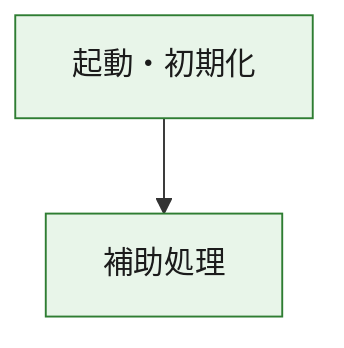
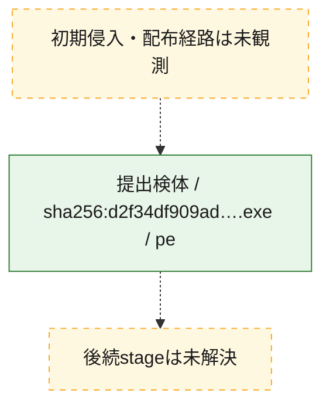
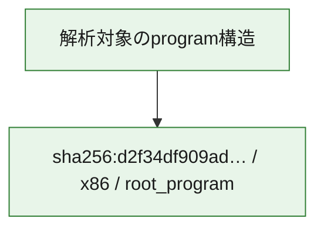

# 全体ロジック：d2f34df909ad2e5b74e9fdee72c945211def9e46d770cb1ac1c98fa61a9b04d4

代表関数の静的証跡から、起動・初期化の処理群を確認しました。

## 読み方

- phaseの掲載順は解析上の整理順です。observed_call_edgesがない段階間の実行順を断定しません。
- 図の実線は静的に観測した関係、点線と黄色のノードは未観測・未解決の関係を示します。
- 図は静的な要約であり、動的実行を再現するものではありません。
- 詳細な関数解説とfingerprintは[STATIC-LOGIC.md](STATIC-LOGIC.md)を参照してください。

## 静的可視化

### 実行フロー

### 感染チェーン

### モジュール関係

## 処理段階

### 1. 起動・初期化

entry pointから初期化と後続処理への移行を確認します。
確度: `confirmed_static_function_evidence`

- `d2f34df909ad2e5b74e9fdee72c945211def9e46d770cb1ac1c98fa61a9b04d4:ghidra:180001010` — 初期化と主要処理への分岐を行う入口関数です。 状態: `succeeded`、選定理由: `entry_point`, `meaningful_symbol_name`, `reviewed_call_centrality:22`, `role:entrypoint`, `small_program_complete_context`

### 2. 補助処理

主要処理を支える一般内部関数またはlibrary処理を確認します。
確度: `confirmed_static_function_evidence`

- `d2f34df909ad2e5b74e9fdee72c945211def9e46d770cb1ac1c98fa61a9b04d4:ghidra:180001240` — 検体内部の一般処理を実装する関数です。 状態: `succeeded`、選定理由: `context_representative`, `reviewed_call_centrality:2`, `small_program_complete_context`
- `d2f34df909ad2e5b74e9fdee72c945211def9e46d770cb1ac1c98fa61a9b04d4:ghidra:180001350` — 検体内部の一般処理を実装する関数です。 状態: `succeeded`、選定理由: `context_representative`, `reviewed_call_centrality:25`, `small_program_complete_context`
- `d2f34df909ad2e5b74e9fdee72c945211def9e46d770cb1ac1c98fa61a9b04d4:ghidra:180003780` — 検体内部の一般処理を実装する関数です。 状態: `succeeded`、選定理由: `context_representative`, `reviewed_call_centrality:2`, `small_program_complete_context`
- `d2f34df909ad2e5b74e9fdee72c945211def9e46d770cb1ac1c98fa61a9b04d4:ghidra:1800038e0` — 検体内部の一般処理を実装する関数です。 状態: `succeeded`、選定理由: `context_representative`, `reviewed_call_centrality:2`, `small_program_complete_context`

## 観測したcall関係

- `d2f34df909ad2e5b74e9fdee72c945211def9e46d770cb1ac1c98fa61a9b04d4:ghidra:180001010` → `d2f34df909ad2e5b74e9fdee72c945211def9e46d770cb1ac1c98fa61a9b04d4:ghidra:180001240` （`startup` → `support`）
- `d2f34df909ad2e5b74e9fdee72c945211def9e46d770cb1ac1c98fa61a9b04d4:ghidra:180001010` → `d2f34df909ad2e5b74e9fdee72c945211def9e46d770cb1ac1c98fa61a9b04d4:ghidra:180001350` （`startup` → `support`）
- `d2f34df909ad2e5b74e9fdee72c945211def9e46d770cb1ac1c98fa61a9b04d4:ghidra:180001350` → `d2f34df909ad2e5b74e9fdee72c945211def9e46d770cb1ac1c98fa61a9b04d4:ghidra:180001240` （`support` → `support`）
- `d2f34df909ad2e5b74e9fdee72c945211def9e46d770cb1ac1c98fa61a9b04d4:ghidra:180001350` → `d2f34df909ad2e5b74e9fdee72c945211def9e46d770cb1ac1c98fa61a9b04d4:ghidra:180003780` （`support` → `support`）
- `d2f34df909ad2e5b74e9fdee72c945211def9e46d770cb1ac1c98fa61a9b04d4:ghidra:180001350` → `d2f34df909ad2e5b74e9fdee72c945211def9e46d770cb1ac1c98fa61a9b04d4:ghidra:1800038e0` （`support` → `support`）
- `d2f34df909ad2e5b74e9fdee72c945211def9e46d770cb1ac1c98fa61a9b04d4:ghidra:180003780` → `d2f34df909ad2e5b74e9fdee72c945211def9e46d770cb1ac1c98fa61a9b04d4:ghidra:1800038e0` （`support` → `support`）
- `ghidra-function:239e8b12356c8dcef03442c4` → `ghidra-function:0c56ec8a42b8f1047ecc0629` （`unclassified` → `unclassified`）
- `ghidra-function:a075ed65a42ca403df63965c` → `ghidra-external:02cb91d10c1d1a53cfe7f02a` （`unclassified` → `unclassified`）
- `ghidra-function:a075ed65a42ca403df63965c` → `ghidra-external:0a1f6d3c8f3c0ca1c5bb49e5` （`unclassified` → `unclassified`）
- `ghidra-function:a075ed65a42ca403df63965c` → `ghidra-external:0eb9d649ccc85c64144329b7` （`unclassified` → `unclassified`）
- `ghidra-function:a075ed65a42ca403df63965c` → `ghidra-external:10dcac3ed6d289fa30c7016e` （`unclassified` → `unclassified`）
- `ghidra-function:a075ed65a42ca403df63965c` → `ghidra-external:1f28d4d5c001ad552d1b1b0f` （`unclassified` → `unclassified`）
- `ghidra-function:a075ed65a42ca403df63965c` → `ghidra-external:32258e17f12370c380e3ab2c` （`unclassified` → `unclassified`）
- `ghidra-function:a075ed65a42ca403df63965c` → `ghidra-external:39af4bc3475f93e96854612f` （`unclassified` → `unclassified`）
- `ghidra-function:a075ed65a42ca403df63965c` → `ghidra-external:54b8be344f3c9725a89a554b` （`unclassified` → `unclassified`）
- `ghidra-function:a075ed65a42ca403df63965c` → `ghidra-external:58929c962dd2cfba41292e8c` （`unclassified` → `unclassified`）
- `ghidra-function:a075ed65a42ca403df63965c` → `ghidra-external:6308405d415be86f8b0b5731` （`unclassified` → `unclassified`）
- `ghidra-function:a075ed65a42ca403df63965c` → `ghidra-external:69bd60f9f40001064d4d644c` （`unclassified` → `unclassified`）
- `ghidra-function:a075ed65a42ca403df63965c` → `ghidra-external:6b7e653be15e28499ba17064` （`unclassified` → `unclassified`）
- `ghidra-function:a075ed65a42ca403df63965c` → `ghidra-external:75a6bed9f541d0a1e74fc7b0` （`unclassified` → `unclassified`）
- `ghidra-function:a075ed65a42ca403df63965c` → `ghidra-external:9ad10ff685c3f2073cd3d24b` （`unclassified` → `unclassified`）
- `ghidra-function:a075ed65a42ca403df63965c` → `ghidra-external:a56da6c40ddb4de9f8bb9d48` （`unclassified` → `unclassified`）
- `ghidra-function:a075ed65a42ca403df63965c` → `ghidra-external:a8b3b65c69d8bb12f2292740` （`unclassified` → `unclassified`）
- `ghidra-function:a075ed65a42ca403df63965c` → `ghidra-external:bde17e725351fc32a2486e4a` （`unclassified` → `unclassified`）
- `ghidra-function:a075ed65a42ca403df63965c` → `ghidra-external:c8843161a521f1281e841066` （`unclassified` → `unclassified`）
- `ghidra-function:a075ed65a42ca403df63965c` → `ghidra-external:caf8c24df1759f19b219b2db` （`unclassified` → `unclassified`）
- `ghidra-function:a075ed65a42ca403df63965c` → `ghidra-external:db73a25e49cfc27b5ba8779f` （`unclassified` → `unclassified`）
- `ghidra-function:a075ed65a42ca403df63965c` → `ghidra-external:f93befc368b5d1a5d36a9878` （`unclassified` → `unclassified`）
- `ghidra-function:a075ed65a42ca403df63965c` → `ghidra-function:0c56ec8a42b8f1047ecc0629` （`unclassified` → `unclassified`）
- `ghidra-function:a075ed65a42ca403df63965c` → `ghidra-function:239e8b12356c8dcef03442c4` （`unclassified` → `unclassified`）
- `ghidra-function:a075ed65a42ca403df63965c` → `ghidra-function:a8e5dc0c6f283fa37a8a6adb` （`unclassified` → `unclassified`）
- `ghidra-function:f1e802f9c0ac97c91f4492d2` → `ghidra-function:029643499dbc3c833ae73ade` （`unclassified` → `unclassified`）
- `ghidra-function:f1e802f9c0ac97c91f4492d2` → `ghidra-function:02be506d0d4e9e1340d33b5f` （`unclassified` → `unclassified`）
- `ghidra-function:f1e802f9c0ac97c91f4492d2` → `ghidra-function:094d195de0dfb6a87c9d9bdc` （`unclassified` → `unclassified`）
- `ghidra-function:f1e802f9c0ac97c91f4492d2` → `ghidra-function:39ce83beca6e0aaca9684fbf` （`unclassified` → `unclassified`）
- `ghidra-function:f1e802f9c0ac97c91f4492d2` → `ghidra-function:5880c34fc0f59df5c19b8225` （`unclassified` → `unclassified`）
- `ghidra-function:f1e802f9c0ac97c91f4492d2` → `ghidra-function:5f168e0e85855308a0fe6a41` （`unclassified` → `unclassified`）
- `ghidra-function:f1e802f9c0ac97c91f4492d2` → `ghidra-function:909c20f58378338988246e66` （`unclassified` → `unclassified`）
- `ghidra-function:f1e802f9c0ac97c91f4492d2` → `ghidra-function:9cdacf5c098800a80fd809c6` （`unclassified` → `unclassified`）
- `ghidra-function:f1e802f9c0ac97c91f4492d2` → `ghidra-function:a075ed65a42ca403df63965c` （`unclassified` → `unclassified`）
- `ghidra-function:f1e802f9c0ac97c91f4492d2` → `ghidra-function:a8e5dc0c6f283fa37a8a6adb` （`unclassified` → `unclassified`）
- `ghidra-function:f1e802f9c0ac97c91f4492d2` → `ghidra-function:bfb574ead7086f8ea43a9a61` （`unclassified` → `unclassified`）
- `ghidra-function:f1e802f9c0ac97c91f4492d2` → `ghidra-function:f306c5d496df5ccd825fe68d` （`unclassified` → `unclassified`）

## 解析範囲と制約

- 選定外関数は全体inventoryへ残しますが、関数本体の個別解説対象にはしていません。
- indirect call、難読化、packer、VM、壊れたcontrol flowによりcall関係が欠落する場合があります。
- 文書は静的解析に基づき、検体実行や外部通信による動的確認は行っていません。
