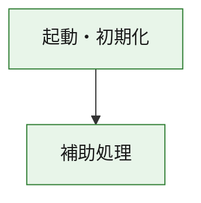
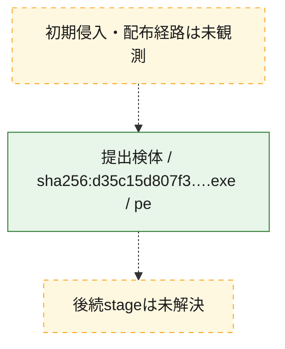
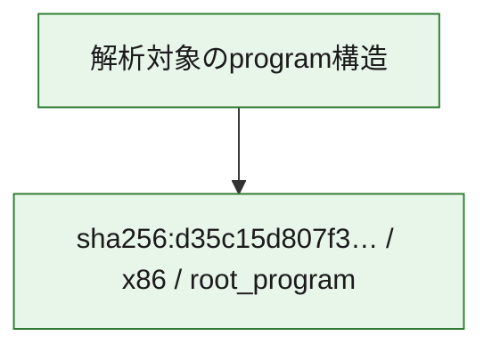

# 全体ロジック：d35c15d807f3d3a28c4297019703cf8a05da1e275209ac30048a9dc43069a912

代表関数の静的証跡から、起動・初期化の処理群を確認しました。

## 読み方

- phaseの掲載順は解析上の整理順です。observed_call_edgesがない段階間の実行順を断定しません。
- 図の実線は静的に観測した関係、点線と黄色のノードは未観測・未解決の関係を示します。
- 図は静的な要約であり、動的実行を再現するものではありません。
- 詳細な関数解説とfingerprintは[STATIC-LOGIC.md](STATIC-LOGIC.md)を参照してください。

## 静的可視化

### 実行フロー

### 感染チェーン

### モジュール関係

## 処理段階

### 1. 起動・初期化

entry pointから初期化と後続処理への移行を確認します。
確度: `confirmed_static_function_evidence`

- `d35c15d807f3d3a28c4297019703cf8a05da1e275209ac30048a9dc43069a912:ghidra:180001010` — 初期化と主要処理への分岐を行う入口関数です。 状態: `succeeded`、選定理由: `entry_point`, `meaningful_symbol_name`, `reviewed_call_centrality:22`, `role:entrypoint`, `small_program_complete_context`

### 2. 補助処理

主要処理を支える一般内部関数またはlibrary処理を確認します。
確度: `confirmed_static_function_evidence`

- `d35c15d807f3d3a28c4297019703cf8a05da1e275209ac30048a9dc43069a912:ghidra:180001240` — 検体内部の一般処理を実装する関数です。 状態: `succeeded`、選定理由: `context_representative`, `reviewed_call_centrality:2`, `small_program_complete_context`
- `d35c15d807f3d3a28c4297019703cf8a05da1e275209ac30048a9dc43069a912:ghidra:180001350` — 検体内部の一般処理を実装する関数です。 状態: `succeeded`、選定理由: `context_representative`, `reviewed_call_centrality:25`, `small_program_complete_context`
- `d35c15d807f3d3a28c4297019703cf8a05da1e275209ac30048a9dc43069a912:ghidra:180003780` — 検体内部の一般処理を実装する関数です。 状態: `succeeded`、選定理由: `context_representative`, `reviewed_call_centrality:2`, `small_program_complete_context`
- `d35c15d807f3d3a28c4297019703cf8a05da1e275209ac30048a9dc43069a912:ghidra:1800038e0` — 検体内部の一般処理を実装する関数です。 状態: `succeeded`、選定理由: `context_representative`, `reviewed_call_centrality:2`, `small_program_complete_context`

## 観測したcall関係

- `d35c15d807f3d3a28c4297019703cf8a05da1e275209ac30048a9dc43069a912:ghidra:180001010` → `d35c15d807f3d3a28c4297019703cf8a05da1e275209ac30048a9dc43069a912:ghidra:180001240` （`startup` → `support`）
- `d35c15d807f3d3a28c4297019703cf8a05da1e275209ac30048a9dc43069a912:ghidra:180001010` → `d35c15d807f3d3a28c4297019703cf8a05da1e275209ac30048a9dc43069a912:ghidra:180001350` （`startup` → `support`）
- `d35c15d807f3d3a28c4297019703cf8a05da1e275209ac30048a9dc43069a912:ghidra:180001350` → `d35c15d807f3d3a28c4297019703cf8a05da1e275209ac30048a9dc43069a912:ghidra:180001240` （`support` → `support`）
- `d35c15d807f3d3a28c4297019703cf8a05da1e275209ac30048a9dc43069a912:ghidra:180001350` → `d35c15d807f3d3a28c4297019703cf8a05da1e275209ac30048a9dc43069a912:ghidra:180003780` （`support` → `support`）
- `d35c15d807f3d3a28c4297019703cf8a05da1e275209ac30048a9dc43069a912:ghidra:180001350` → `d35c15d807f3d3a28c4297019703cf8a05da1e275209ac30048a9dc43069a912:ghidra:1800038e0` （`support` → `support`）
- `d35c15d807f3d3a28c4297019703cf8a05da1e275209ac30048a9dc43069a912:ghidra:180003780` → `d35c15d807f3d3a28c4297019703cf8a05da1e275209ac30048a9dc43069a912:ghidra:1800038e0` （`support` → `support`）
- `ghidra-function:421294e1755f2f41f6e6d013` → `ghidra-function:0fbeee969211be9758f921c8` （`unclassified` → `unclassified`）
- `ghidra-function:421294e1755f2f41f6e6d013` → `ghidra-function:4a8f282a7fcb12df96dc1ad7` （`unclassified` → `unclassified`）
- `ghidra-function:421294e1755f2f41f6e6d013` → `ghidra-function:73cd11d56f23c447cd4ad7e5` （`unclassified` → `unclassified`）
- `ghidra-function:421294e1755f2f41f6e6d013` → `ghidra-function:7985442b1775c68f7c0c62e6` （`unclassified` → `unclassified`）
- `ghidra-function:421294e1755f2f41f6e6d013` → `ghidra-function:7bbad16ab70d5770414bc960` （`unclassified` → `unclassified`）
- `ghidra-function:421294e1755f2f41f6e6d013` → `ghidra-function:8a6efa1f899cfedd5632fcd0` （`unclassified` → `unclassified`）
- `ghidra-function:421294e1755f2f41f6e6d013` → `ghidra-function:a0b4bccce4ccc0232af7bc03` （`unclassified` → `unclassified`）
- `ghidra-function:421294e1755f2f41f6e6d013` → `ghidra-function:af0a2cc548b2734ac19dc5ad` （`unclassified` → `unclassified`）
- `ghidra-function:421294e1755f2f41f6e6d013` → `ghidra-function:b3601b0df24ba508687b9cff` （`unclassified` → `unclassified`）
- `ghidra-function:421294e1755f2f41f6e6d013` → `ghidra-function:cc6718ee2c7e63e81a6aeb4c` （`unclassified` → `unclassified`）
- `ghidra-function:421294e1755f2f41f6e6d013` → `ghidra-function:d5bfab9b9866094e21e98c30` （`unclassified` → `unclassified`）
- `ghidra-function:421294e1755f2f41f6e6d013` → `ghidra-function:e86b14cefb46e72d39634466` （`unclassified` → `unclassified`）
- `ghidra-function:b3601b0df24ba508687b9cff` → `ghidra-external:05d7ee3821fb3457a30a21b9` （`unclassified` → `unclassified`）
- `ghidra-function:b3601b0df24ba508687b9cff` → `ghidra-external:23a7f9c583784642ed5a85a5` （`unclassified` → `unclassified`）
- `ghidra-function:b3601b0df24ba508687b9cff` → `ghidra-external:405fc67bce720c9af815d387` （`unclassified` → `unclassified`）
- `ghidra-function:b3601b0df24ba508687b9cff` → `ghidra-external:40aacbe89e6fbfae0afb5ff2` （`unclassified` → `unclassified`）
- `ghidra-function:b3601b0df24ba508687b9cff` → `ghidra-external:425fe2a8b5059261cbc334a5` （`unclassified` → `unclassified`）
- `ghidra-function:b3601b0df24ba508687b9cff` → `ghidra-external:447f515460a30e628e680a53` （`unclassified` → `unclassified`）
- `ghidra-function:b3601b0df24ba508687b9cff` → `ghidra-external:4bcb0cd9d3b282a74e7fa782` （`unclassified` → `unclassified`）
- `ghidra-function:b3601b0df24ba508687b9cff` → `ghidra-external:5b211cc6e01a9a8bccb834eb` （`unclassified` → `unclassified`）
- `ghidra-function:b3601b0df24ba508687b9cff` → `ghidra-external:5e42612c0e7289c26c06f46e` （`unclassified` → `unclassified`）
- `ghidra-function:b3601b0df24ba508687b9cff` → `ghidra-external:6642c6533f04fffff2f999f8` （`unclassified` → `unclassified`）
- `ghidra-function:b3601b0df24ba508687b9cff` → `ghidra-external:6e01d9432a4107f4dd9b31fd` （`unclassified` → `unclassified`）
- `ghidra-function:b3601b0df24ba508687b9cff` → `ghidra-external:834a9a26c9f7eced017646e3` （`unclassified` → `unclassified`）
- `ghidra-function:b3601b0df24ba508687b9cff` → `ghidra-external:8508bcec657dd89f00a92833` （`unclassified` → `unclassified`）
- `ghidra-function:b3601b0df24ba508687b9cff` → `ghidra-external:aa1e1c11463e37782fec8271` （`unclassified` → `unclassified`）
- `ghidra-function:b3601b0df24ba508687b9cff` → `ghidra-external:c85ddcffc8251373ff513fa8` （`unclassified` → `unclassified`）
- `ghidra-function:b3601b0df24ba508687b9cff` → `ghidra-external:d70239a0b7b1b4bd7d501731` （`unclassified` → `unclassified`）
- `ghidra-function:b3601b0df24ba508687b9cff` → `ghidra-external:e189eed66efe5618584fc6bc` （`unclassified` → `unclassified`）
- `ghidra-function:b3601b0df24ba508687b9cff` → `ghidra-external:e8554564a63297943cc095ba` （`unclassified` → `unclassified`）
- `ghidra-function:b3601b0df24ba508687b9cff` → `ghidra-external:eabc2daafd2fbcaacd2b7f7f` （`unclassified` → `unclassified`）
- `ghidra-function:b3601b0df24ba508687b9cff` → `ghidra-external:edf2b75f26b3ca48b41a61c0` （`unclassified` → `unclassified`）
- `ghidra-function:b3601b0df24ba508687b9cff` → `ghidra-external:f6c0fcf331c9bf2f83a28ea5` （`unclassified` → `unclassified`）
- `ghidra-function:b3601b0df24ba508687b9cff` → `ghidra-function:b54e864aea5fba249bd2cf99` （`unclassified` → `unclassified`）
- `ghidra-function:b3601b0df24ba508687b9cff` → `ghidra-function:d5bfab9b9866094e21e98c30` （`unclassified` → `unclassified`）
- `ghidra-function:b3601b0df24ba508687b9cff` → `ghidra-function:fcdfe229c6dd29fee1dcdb23` （`unclassified` → `unclassified`）
- `ghidra-function:b54e864aea5fba249bd2cf99` → `ghidra-function:fcdfe229c6dd29fee1dcdb23` （`unclassified` → `unclassified`）

## 解析範囲と制約

- 選定外関数は全体inventoryへ残しますが、関数本体の個別解説対象にはしていません。
- indirect call、難読化、packer、VM、壊れたcontrol flowによりcall関係が欠落する場合があります。
- 文書は静的解析に基づき、検体実行や外部通信による動的確認は行っていません。
