# 感染チェーン

```mermaid
flowchart LR
  A["fingerprint-verification.infoのClickFix誘導"] --> B["WMIsave.7z"]
  B --> C["password 002700でWMIsave.exeを展開"]
  C -. "実行は未観測" .-> D["WMIsave.exe / UPX + NativeAOT"]
  D --> E["Polygon RPCへeth_call<br/>selector 0xb68d1809"]
  E --> F["2 contractsからAPI URL解決"]
  F --> G["settingsに従う自己配置・永続化"]
  G --> H["clipboard監視"]
  H --> I["host情報 + clipboard textを暗号化送信"]
  I --> J["processed_textでclipboard置換"]
```

| phase | 内容 | 状態 |
|---|---|---|
| delivery | `fingerprint-verification.info/...`から`WMIsave.7z` | Zone.Identifierで確認 |
| archive | password `002700`、member `WMIsave.exe` | 安全に展開、未実行 |
| evasion | UPX、約782 MiBのzero overlay | 静的確定 |
| runtime | x64 NativeAOT、assembly `RCS_BUILD_CORE` | 静的確定 |
| URL resolution | Polygon `eth_call`、selector `0xb68d1809` | 静的確定＋読み取り専用照合 |
| current API | `hxxps://rpc-cloud[.]beer` | contract応答として2026-09-01に観測、未接続 |
| persistence | PowerShell/VBS/COM/Shell32/Run/batch fallback | code存在、実行未観測 |
| terminal behavior | clipboard textをAPI処理し`processed_text`へ置換 | code・field・logから静的確定 |
| arbitrary RAT commands | shell/process/file command dispatcher | 未確認 |
