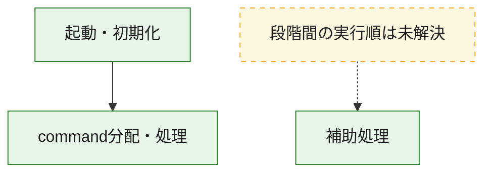
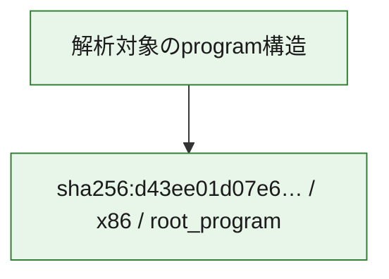

# 全体ロジック：d43ee01d07e64fd87dc611ea826f31109971e6a2d52acc47fbb08d2dcf5567de

代表関数の静的証跡から、起動・初期化、command分配・処理の処理群を確認しました。

## 読み方

- phaseの掲載順は解析上の整理順です。observed_call_edgesがない段階間の実行順を断定しません。
- 図の実線は静的に観測した関係、点線と黄色のノードは未観測・未解決の関係を示します。
- 図は静的な要約であり、動的実行を再現するものではありません。
- 詳細な関数解説とfingerprintは[STATIC-LOGIC.md](STATIC-LOGIC.md)を参照してください。

## 静的可視化

### 実行フロー

### 感染チェーン

```mermaid
flowchart TD
  chain_initial["初期侵入・配布経路は未観測"]
  chain_01["提出検体 / sha256:d43ee01d07e6….exe / pe"]
  chain_02["静的復元層 1 / sha256:d43ee01d07e6….exe::pe-resource-script / script"]
  chain_03["静的復元層 1 / sha256:d43ee01d07e6….exe::pe-resource-script / script"]
  chain_04["静的復元層 1 / sha256:d43ee01d07e6….exe::pe-resource-script / script"]
  chain_05["静的復元層 1 / sha256:d43ee01d07e6….exe::pe-resource-script / script"]
  chain_06["静的復元層 1 / sha256:d43ee01d07e6….exe::pe-resource-script / script"]
  chain_07["静的復元層 1 / sha256:d43ee01d07e6….exe::pe-resource-script / script"]
  chain_08["静的復元層 1 / sha256:d43ee01d07e6….exe::pe-resource-script / script"]
  chain_09["静的復元層 1 / sha256:d43ee01d07e6….exe::pe-resource-script / script"]
  chain_10["静的復元層 1 / sha256:d43ee01d07e6….exe::pe-resource-script / script"]
  chain_11["静的復元層 1 / sha256:d43ee01d07e6….exe::pe-resource-script / script"]
  chain_12["静的復元層 1 / sha256:d43ee01d07e6….exe::pe-resource-script / script"]
  chain_13["静的復元層 1 / sha256:d43ee01d07e6….exe::pe-resource-script / script"]
  chain_14["静的復元層 1 / sha256:d43ee01d07e6….exe::pe-resource-script / script"]
  chain_15["静的復元層 1 / sha256:d43ee01d07e6….exe::pe-resource-script / script"]
  chain_16["静的復元層 1 / sha256:d43ee01d07e6….exe::pe-resource-script / script"]
  chain_01 -->|pe-resource-script| chain_02
  chain_01 -->|pe-resource-script| chain_03
  chain_01 -->|pe-resource-script| chain_04
  chain_01 -->|pe-resource-script| chain_05
  chain_01 -->|pe-resource-script| chain_06
  chain_01 -->|pe-resource-script| chain_07
  chain_01 -->|pe-resource-script| chain_08
  chain_01 -->|pe-resource-script| chain_09
  chain_01 -->|pe-resource-script| chain_10
  chain_01 -->|pe-resource-script| chain_11
  chain_01 -->|pe-resource-script| chain_12
  chain_01 -->|pe-resource-script| chain_13
  chain_01 -->|pe-resource-script| chain_14
  chain_01 -->|pe-resource-script| chain_15
  chain_01 -->|pe-resource-script| chain_16
  chain_initial -.-> chain_01
  chain_more["その他2層はstatic-layers.jsonを参照"]
  chain_02 -.-> chain_more
  chain_03 -.-> chain_more
  chain_04 -.-> chain_more
  chain_05 -.-> chain_more
  chain_06 -.-> chain_more
  chain_07 -.-> chain_more
  chain_08 -.-> chain_more
  chain_09 -.-> chain_more
  chain_10 -.-> chain_more
  chain_11 -.-> chain_more
  chain_12 -.-> chain_more
  chain_13 -.-> chain_more
  chain_14 -.-> chain_more
  chain_15 -.-> chain_more
  chain_16 -.-> chain_more
  class chain_more unresolved
  class chain_01,chain_02,chain_03,chain_04,chain_05,chain_06,chain_07,chain_08,chain_09,chain_10,chain_11,chain_12,chain_13,chain_14,chain_15,chain_16 confirmed
  class chain_initial unresolved
  classDef confirmed fill:#e8f5e9,stroke:#2e7d32,color:#1b1b1b
  classDef unresolved fill:#fff8e1,stroke:#f9a825,color:#1b1b1b,stroke-dasharray:5 5
```

### モジュール関係

## 処理段階

### 1. 起動・初期化

entry pointから初期化と後続処理への移行を確認します。
確度: `confirmed_static_function_evidence`

- `d43ee01d07e64fd87dc611ea826f31109971e6a2d52acc47fbb08d2dcf5567de:ghidra:140bae980` — 初期化と主要処理への分岐を行う入口関数です。 状態: `succeeded`、選定理由: `entry_point`, `meaningful_symbol_name`, `reviewed_call_centrality:22`, `role:entrypoint`

### 2. command分配・処理

受信commandやtaskの解釈、分配、個別handlerへの移行を確認します。
確度: `confirmed_static_function_evidence_with_limits`

- `d43ee01d07e64fd87dc611ea826f31109971e6a2d52acc47fbb08d2dcf5567de:ghidra:140bbf140` — commandの解釈、分配、または個別処理を担当する関数です。 状態: `limited_bad_instruction_or_flow`、選定理由: `meaningful_symbol_name`, `reviewed_call_centrality:1`, `role:command_dispatch_or_handler`

### 3. 補助処理

主要処理を支える一般内部関数またはlibrary処理を確認します。
確度: `confirmed_static_function_evidence_with_limits`

- `d43ee01d07e64fd87dc611ea826f31109971e6a2d52acc47fbb08d2dcf5567de:ghidra:1409f11b0` — 検体内部の一般処理を実装する関数です。 状態: `succeeded`、選定理由: `context_representative`, `reviewed_call_centrality:3`
- `d43ee01d07e64fd87dc611ea826f31109971e6a2d52acc47fbb08d2dcf5567de:ghidra:1409f12c0` — 検体内部の一般処理を実装する関数です。 状態: `succeeded`、選定理由: `context_representative`, `reviewed_call_centrality:1`
- `d43ee01d07e64fd87dc611ea826f31109971e6a2d52acc47fbb08d2dcf5567de:ghidra:1409f1370` — 検体内部の一般処理を実装する関数です。 状態: `succeeded`、選定理由: `context_representative`, `reviewed_call_centrality:1`
- `d43ee01d07e64fd87dc611ea826f31109971e6a2d52acc47fbb08d2dcf5567de:ghidra:1409f1400` — 検体内部の一般処理を実装する関数です。 状態: `succeeded`、選定理由: `context_representative`, `reviewed_call_centrality:5`
- `d43ee01d07e64fd87dc611ea826f31109971e6a2d52acc47fbb08d2dcf5567de:ghidra:1409f1490` — 検体内部の一般処理を実装する関数です。 状態: `succeeded`、選定理由: `context_representative`, `reviewed_call_centrality:8`
- `d43ee01d07e64fd87dc611ea826f31109971e6a2d52acc47fbb08d2dcf5567de:ghidra:1409f1590` — 検体内部の一般処理を実装する関数です。 状態: `succeeded`、選定理由: `context_representative`, `reviewed_call_centrality:5`
- `d43ee01d07e64fd87dc611ea826f31109971e6a2d52acc47fbb08d2dcf5567de:ghidra:1409f16e0` — 検体内部の一般処理を実装する関数です。 状態: `succeeded`、選定理由: `context_representative`, `reviewed_call_centrality:6`
- `d43ee01d07e64fd87dc611ea826f31109971e6a2d52acc47fbb08d2dcf5567de:ghidra:1409f1940` — 検体内部の一般処理を実装する関数です。 状態: `succeeded`、選定理由: `context_representative`, `reviewed_call_centrality:1`
- `d43ee01d07e64fd87dc611ea826f31109971e6a2d52acc47fbb08d2dcf5567de:ghidra:1409f1970` — 検体内部の一般処理を実装する関数です。 状態: `succeeded`、選定理由: `context_representative`, `reviewed_call_centrality:7`
- `d43ee01d07e64fd87dc611ea826f31109971e6a2d52acc47fbb08d2dcf5567de:ghidra:1409f1af0` — 検体内部の一般処理を実装する関数です。 状態: `succeeded`、選定理由: `context_representative`, `reviewed_call_centrality:1`
- `d43ee01d07e64fd87dc611ea826f31109971e6a2d52acc47fbb08d2dcf5567de:ghidra:1409f1b30` — 検体内部の一般処理を実装する関数です。 状態: `limited_bad_instruction_or_flow`、選定理由: `context_representative`, `reviewed_call_centrality:3`
- `d43ee01d07e64fd87dc611ea826f31109971e6a2d52acc47fbb08d2dcf5567de:ghidra:1409f1be0` — 検体内部の一般処理を実装する関数です。 状態: `succeeded`、選定理由: `context_representative`, `reviewed_call_centrality:5`
- `d43ee01d07e64fd87dc611ea826f31109971e6a2d52acc47fbb08d2dcf5567de:ghidra:1409f1c70` — 検体内部の一般処理を実装する関数です。 状態: `succeeded`、選定理由: `context_representative`, `reviewed_call_centrality:2`
- `d43ee01d07e64fd87dc611ea826f31109971e6a2d52acc47fbb08d2dcf5567de:ghidra:1409f1d30` — 検体内部の一般処理を実装する関数です。 状態: `succeeded`、選定理由: `context_representative`, `reviewed_call_centrality:1`
- `d43ee01d07e64fd87dc611ea826f31109971e6a2d52acc47fbb08d2dcf5567de:ghidra:1409f1d60` — 検体内部の一般処理を実装する関数です。 状態: `succeeded`、選定理由: `context_representative`, `reviewed_call_centrality:1`
- `d43ee01d07e64fd87dc611ea826f31109971e6a2d52acc47fbb08d2dcf5567de:ghidra:1409f1da0` — 検体内部の一般処理を実装する関数です。 状態: `succeeded`、選定理由: `context_representative`, `reviewed_call_centrality:1`
- `d43ee01d07e64fd87dc611ea826f31109971e6a2d52acc47fbb08d2dcf5567de:ghidra:1409f1e10` — 検体内部の一般処理を実装する関数です。 状態: `succeeded`、選定理由: `context_representative`, `reviewed_call_centrality:1`
- `d43ee01d07e64fd87dc611ea826f31109971e6a2d52acc47fbb08d2dcf5567de:ghidra:1409f1e60` — 検体内部の一般処理を実装する関数です。 状態: `succeeded`、選定理由: `context_representative`, `reviewed_call_centrality:1`
- `d43ee01d07e64fd87dc611ea826f31109971e6a2d52acc47fbb08d2dcf5567de:ghidra:1409f1ea0` — 検体内部の一般処理を実装する関数です。 状態: `succeeded`、選定理由: `context_representative`, `reviewed_call_centrality:2`
- `d43ee01d07e64fd87dc611ea826f31109971e6a2d52acc47fbb08d2dcf5567de:ghidra:1409f1f00` — 検体内部の一般処理を実装する関数です。 状態: `succeeded`、選定理由: `context_representative`, `reviewed_call_centrality:2`
- `d43ee01d07e64fd87dc611ea826f31109971e6a2d52acc47fbb08d2dcf5567de:ghidra:1409f1fa0` — 検体内部の一般処理を実装する関数です。 状態: `succeeded`、選定理由: `context_representative`, `reviewed_call_centrality:2`
- `d43ee01d07e64fd87dc611ea826f31109971e6a2d52acc47fbb08d2dcf5567de:ghidra:1409f2050` — 検体内部の一般処理を実装する関数です。 状態: `succeeded`、選定理由: `context_representative`, `reviewed_call_centrality:2`
- `d43ee01d07e64fd87dc611ea826f31109971e6a2d52acc47fbb08d2dcf5567de:ghidra:1409f2100` — 検体内部の一般処理を実装する関数です。 状態: `succeeded`、選定理由: `context_representative`, `reviewed_call_centrality:2`
- `d43ee01d07e64fd87dc611ea826f31109971e6a2d52acc47fbb08d2dcf5567de:ghidra:1409f2150` — 検体内部の一般処理を実装する関数です。 状態: `succeeded`、選定理由: `context_representative`, `reviewed_call_centrality:2`
- `d43ee01d07e64fd87dc611ea826f31109971e6a2d52acc47fbb08d2dcf5567de:ghidra:1409f21a0` — 検体内部の一般処理を実装する関数です。 状態: `succeeded`、選定理由: `context_representative`, `reviewed_call_centrality:2`
- `d43ee01d07e64fd87dc611ea826f31109971e6a2d52acc47fbb08d2dcf5567de:ghidra:1409f21f0` — 検体内部の一般処理を実装する関数です。 状態: `succeeded`、選定理由: `context_representative`, `reviewed_call_centrality:2`
- `d43ee01d07e64fd87dc611ea826f31109971e6a2d52acc47fbb08d2dcf5567de:ghidra:1409f2330` — 検体内部の一般処理を実装する関数です。 状態: `limited_bad_instruction_or_flow`、選定理由: `context_representative`, `reviewed_call_centrality:2`
- `d43ee01d07e64fd87dc611ea826f31109971e6a2d52acc47fbb08d2dcf5567de:ghidra:1409f2370` — 検体内部の一般処理を実装する関数です。 状態: `succeeded`、選定理由: `context_representative`, `reviewed_call_centrality:4`
- `d43ee01d07e64fd87dc611ea826f31109971e6a2d52acc47fbb08d2dcf5567de:ghidra:1409f2640` — 検体内部の一般処理を実装する関数です。 状態: `succeeded`、選定理由: `context_representative`, `reviewed_call_centrality:29`
- `d43ee01d07e64fd87dc611ea826f31109971e6a2d52acc47fbb08d2dcf5567de:ghidra:140bb03d0` — 検体内部の一般処理を実装する関数です。 状態: `succeeded`、選定理由: `meaningful_symbol_name`

## 観測したcall関係

- `d43ee01d07e64fd87dc611ea826f31109971e6a2d52acc47fbb08d2dcf5567de:ghidra:1409f1c70` → `d43ee01d07e64fd87dc611ea826f31109971e6a2d52acc47fbb08d2dcf5567de:ghidra:1409f1be0` （`support` → `support`）
- `d43ee01d07e64fd87dc611ea826f31109971e6a2d52acc47fbb08d2dcf5567de:ghidra:140bae980` → `d43ee01d07e64fd87dc611ea826f31109971e6a2d52acc47fbb08d2dcf5567de:ghidra:140bbf140` （`startup` → `dispatch`）
- `ghidra-function:1f77ea0477a0110b8d493bd7` → `ghidra-external:0daed345f6cbdb551668ab73` （`unclassified` → `unclassified`）
- `ghidra-function:1f77ea0477a0110b8d493bd7` → `ghidra-external:ea8203edca74e7b0a5e1931c` （`unclassified` → `unclassified`）
- `ghidra-function:1f77ea0477a0110b8d493bd7` → `ghidra-function:487f6ce60ea5fa3f09f5152c` （`unclassified` → `unclassified`）
- `ghidra-function:1f77ea0477a0110b8d493bd7` → `ghidra-function:57cbe7cbbbfab1b220aac75b` （`unclassified` → `unclassified`）
- `ghidra-function:1f77ea0477a0110b8d493bd7` → `ghidra-function:a1d058104fd465cbf5ea6954` （`unclassified` → `unclassified`）
- `ghidra-function:1f77ea0477a0110b8d493bd7` → `ghidra-function:ad8b14f5be7a313ce0ab2d0f` （`unclassified` → `unclassified`）
- `ghidra-function:1f77ea0477a0110b8d493bd7` → `ghidra-function:bcbd1efdf355e671537bd8f5` （`unclassified` → `unclassified`）
- `ghidra-function:25682bd058734d7e667ae395` → `ghidra-function:2c0f37b97997ffa290600b47` （`unclassified` → `unclassified`）
- `ghidra-function:25682bd058734d7e667ae395` → `ghidra-function:36f2b25fb0f6c0aca7deefd3` （`unclassified` → `unclassified`）
- `ghidra-function:25682bd058734d7e667ae395` → `ghidra-function:d90c1b9ec78a578ca5edb236` （`unclassified` → `unclassified`）
- `ghidra-function:25682bd058734d7e667ae395` → `ghidra-function:f3bc528eef4437a8173bf399` （`unclassified` → `unclassified`）
- `ghidra-function:27f58fd5996b8a4339c56cff` → `ghidra-function:6118fa84dd5f8b171b7d0a05` （`unclassified` → `unclassified`）
- `ghidra-function:2b6657f32d736f4ec14073eb` → `ghidra-function:2c0f37b97997ffa290600b47` （`unclassified` → `unclassified`）
- `ghidra-function:2b6657f32d736f4ec14073eb` → `ghidra-function:5d788829cca6179572e4dc91` （`unclassified` → `unclassified`）
- `ghidra-function:2b6657f32d736f4ec14073eb` → `ghidra-function:d90c1b9ec78a578ca5edb236` （`unclassified` → `unclassified`）
- `ghidra-function:31fddacff39a221f991a49ab` → `ghidra-function:6118fa84dd5f8b171b7d0a05` （`unclassified` → `unclassified`）
- `ghidra-function:320ab0eb181b9d3298eb7a35` → `ghidra-external:084a6bf66c52e0b631d0b474` （`unclassified` → `unclassified`）
- `ghidra-function:320ab0eb181b9d3298eb7a35` → `ghidra-external:0daed345f6cbdb551668ab73` （`unclassified` → `unclassified`）
- `ghidra-function:320ab0eb181b9d3298eb7a35` → `ghidra-external:1a98fc427359c43a3c7cf845` （`unclassified` → `unclassified`）
- `ghidra-function:320ab0eb181b9d3298eb7a35` → `ghidra-external:1d185498dd1fd37160f2177b` （`unclassified` → `unclassified`）
- `ghidra-function:320ab0eb181b9d3298eb7a35` → `ghidra-external:abc7f32e57f368860adc1364` （`unclassified` → `unclassified`）
- `ghidra-function:320ab0eb181b9d3298eb7a35` → `ghidra-external:e39b92ae24399db11abe4b03` （`unclassified` → `unclassified`）
- `ghidra-function:320ab0eb181b9d3298eb7a35` → `ghidra-external:fa52671686763e39ed44a9e5` （`unclassified` → `unclassified`）
- `ghidra-function:320ab0eb181b9d3298eb7a35` → `ghidra-function:0063e2e1cf2f6e08676eb436` （`unclassified` → `unclassified`）
- `ghidra-function:320ab0eb181b9d3298eb7a35` → `ghidra-function:08f5762257eaa60ee5b75a4e` （`unclassified` → `unclassified`）
- `ghidra-function:320ab0eb181b9d3298eb7a35` → `ghidra-function:09a488dc3051f90802522880` （`unclassified` → `unclassified`）
- `ghidra-function:320ab0eb181b9d3298eb7a35` → `ghidra-function:109f96ae11669c4248f0e7da` （`unclassified` → `unclassified`）
- `ghidra-function:320ab0eb181b9d3298eb7a35` → `ghidra-function:1aada917dcc44bf7601af212` （`unclassified` → `unclassified`）
- `ghidra-function:320ab0eb181b9d3298eb7a35` → `ghidra-function:32b430140daf52e9d7863826` （`unclassified` → `unclassified`）
- `ghidra-function:320ab0eb181b9d3298eb7a35` → `ghidra-function:3f264c40540aeb86beafa7ca` （`unclassified` → `unclassified`）
- `ghidra-function:320ab0eb181b9d3298eb7a35` → `ghidra-function:6f28eb261ebaefb6ef4088aa` （`unclassified` → `unclassified`）
- `ghidra-function:320ab0eb181b9d3298eb7a35` → `ghidra-function:93721c873c125f384ec65ed9` （`unclassified` → `unclassified`）
- `ghidra-function:320ab0eb181b9d3298eb7a35` → `ghidra-function:9b13f9fb8e7833b83221d7f4` （`unclassified` → `unclassified`）
- `ghidra-function:320ab0eb181b9d3298eb7a35` → `ghidra-function:adc2a156ec3dba5f1b958d9d` （`unclassified` → `unclassified`）
- `ghidra-function:320ab0eb181b9d3298eb7a35` → `ghidra-function:d22cacfbe57fe1f9f98bdeda` （`unclassified` → `unclassified`）
- `ghidra-function:320ab0eb181b9d3298eb7a35` → `ghidra-function:d4b889c4b33efe67e583391b` （`unclassified` → `unclassified`）
- `ghidra-function:320ab0eb181b9d3298eb7a35` → `ghidra-function:e8f947d216643d4dff7c0dc7` （`unclassified` → `unclassified`）
- `ghidra-function:320ab0eb181b9d3298eb7a35` → `ghidra-function:fc7e648c21c78b06cc8a077a` （`unclassified` → `unclassified`）
- `ghidra-function:3503cba54d75d1af43b4ff37` → `ghidra-function:ad8b14f5be7a313ce0ab2d0f` （`unclassified` → `unclassified`）
- `ghidra-function:4036d71160c883952cdc3626` → `ghidra-external:ea8203edca74e7b0a5e1931c` （`unclassified` → `unclassified`）
- `ghidra-function:4036d71160c883952cdc3626` → `ghidra-function:a17b487fa12e9c4f761db459` （`unclassified` → `unclassified`）
- `ghidra-function:43649554711e9b536ad28599` → `ghidra-external:09cca5d16feebbc5804ea10f` （`unclassified` → `unclassified`）
- `ghidra-function:43649554711e9b536ad28599` → `ghidra-external:0b74bdea6b8b67ecaa4cad6d` （`unclassified` → `unclassified`）
- `ghidra-function:43649554711e9b536ad28599` → `ghidra-external:6ca90b41e0ef21b8e0cc7207` （`unclassified` → `unclassified`）
- `ghidra-function:43649554711e9b536ad28599` → `ghidra-external:747206eb8b2c5b61ead04f2d` （`unclassified` → `unclassified`）
- `ghidra-function:43649554711e9b536ad28599` → `ghidra-external:7eb68109eed47631daa69452` （`unclassified` → `unclassified`）
- `ghidra-function:43649554711e9b536ad28599` → `ghidra-external:bff9be74ea3b08d3e5c3992d` （`unclassified` → `unclassified`）
- `ghidra-function:43649554711e9b536ad28599` → `ghidra-external:cc6eb05f18cb025ab452120b` （`unclassified` → `unclassified`）
- `ghidra-function:43649554711e9b536ad28599` → `ghidra-external:e5d03424409c495263ad9baa` （`unclassified` → `unclassified`）
- `ghidra-function:43649554711e9b536ad28599` → `ghidra-external:e9faaacfc14e88b3cadf9d93` （`unclassified` → `unclassified`）
- `ghidra-function:43649554711e9b536ad28599` → `ghidra-external:f182a03ce2e8ba13d61e74e0` （`unclassified` → `unclassified`）
- `ghidra-function:43649554711e9b536ad28599` → `ghidra-function:05e5a7bcc655bede824fd8e5` （`unclassified` → `unclassified`）
- `ghidra-function:43649554711e9b536ad28599` → `ghidra-function:2c0f37b97997ffa290600b47` （`unclassified` → `unclassified`）
- `ghidra-function:43649554711e9b536ad28599` → `ghidra-function:31a3c3941c45d9e95f07ac3f` （`unclassified` → `unclassified`）
- `ghidra-function:43649554711e9b536ad28599` → `ghidra-function:487f6ce60ea5fa3f09f5152c` （`unclassified` → `unclassified`）
- `ghidra-function:43649554711e9b536ad28599` → `ghidra-function:5d788829cca6179572e4dc91` （`unclassified` → `unclassified`）
- `ghidra-function:43649554711e9b536ad28599` → `ghidra-function:822a97c5ae1a9838876a145d` （`unclassified` → `unclassified`）
- `ghidra-function:43649554711e9b536ad28599` → `ghidra-function:8eff5c01feecf742c766eab4` （`unclassified` → `unclassified`）
- `ghidra-function:43649554711e9b536ad28599` → `ghidra-function:93e6ccc7c2880d17c240bf66` （`unclassified` → `unclassified`）
- `ghidra-function:43649554711e9b536ad28599` → `ghidra-function:959f3ecfddf31c10b41c65a3` （`unclassified` → `unclassified`）
- `ghidra-function:43649554711e9b536ad28599` → `ghidra-function:b1240eae82f3f3640d6d6168` （`unclassified` → `unclassified`）
- `ghidra-function:43649554711e9b536ad28599` → `ghidra-function:cd593cf44330d5de5ae5d4eb` （`unclassified` → `unclassified`）
- `ghidra-function:43649554711e9b536ad28599` → `ghidra-function:d90c1b9ec78a578ca5edb236` （`unclassified` → `unclassified`）
- `ghidra-function:43649554711e9b536ad28599` → `ghidra-function:de191b50ba410554a01c9c11` （`unclassified` → `unclassified`）
- `ghidra-function:43649554711e9b536ad28599` → `ghidra-function:e5f2ccfd89cd53bd3628aba5` （`unclassified` → `unclassified`）
- `ghidra-function:43649554711e9b536ad28599` → `ghidra-function:e6780750dd90159ab3124320` （`unclassified` → `unclassified`）
- `ghidra-function:43649554711e9b536ad28599` → `ghidra-function:ec3bd6ec015b22b94587f447` （`unclassified` → `unclassified`）
- `ghidra-function:43649554711e9b536ad28599` → `ghidra-function:f3bc528eef4437a8173bf399` （`unclassified` → `unclassified`）
- `ghidra-function:43649554711e9b536ad28599` → `ghidra-function:fb17302227189ca9c1c0d01f` （`unclassified` → `unclassified`）
- `ghidra-function:43649554711e9b536ad28599` → `ghidra-function:ffe532dc47126b0e71d30514` （`unclassified` → `unclassified`）
- `ghidra-function:4735536acdf04fd016cba8c7` → `ghidra-function:d90c1b9ec78a578ca5edb236` （`unclassified` → `unclassified`）
- `ghidra-function:7395300e690b3d437ce87c76` → `ghidra-function:4f7df235f2acd729c2951f44` （`unclassified` → `unclassified`）
- `ghidra-function:7a2697faeda4d81142e1aeb6` → `ghidra-external:0da605b291e927424b6e651a` （`unclassified` → `unclassified`）
- `ghidra-function:7a2697faeda4d81142e1aeb6` → `ghidra-external:16a33933aa34c070e01aca04` （`unclassified` → `unclassified`）
- `ghidra-function:7a2697faeda4d81142e1aeb6` → `ghidra-external:57de298ba2db6f6b5a132904` （`unclassified` → `unclassified`）
- `ghidra-function:7a2697faeda4d81142e1aeb6` → `ghidra-external:722ee5d5b2de1ee4576732a9` （`unclassified` → `unclassified`）
- `ghidra-function:7a2697faeda4d81142e1aeb6` → `ghidra-external:9a0f64d440cba3b7488ae567` （`unclassified` → `unclassified`）
- `ghidra-function:7a2697faeda4d81142e1aeb6` → `ghidra-function:2c0f37b97997ffa290600b47` （`unclassified` → `unclassified`）
- `ghidra-function:7a2697faeda4d81142e1aeb6` → `ghidra-function:5d788829cca6179572e4dc91` （`unclassified` → `unclassified`）
- `ghidra-function:7a2697faeda4d81142e1aeb6` → `ghidra-function:d90c1b9ec78a578ca5edb236` （`unclassified` → `unclassified`）
- `ghidra-function:7c238cff07398f4aa5a3111e` → `ghidra-external:0daed345f6cbdb551668ab73` （`unclassified` → `unclassified`）
- `ghidra-function:7c238cff07398f4aa5a3111e` → `ghidra-external:ea8203edca74e7b0a5e1931c` （`unclassified` → `unclassified`）
- `ghidra-function:7d3c1c9dfb8064d6b15ea067` → `ghidra-external:8aa83b6407ecb2d95897e560` （`unclassified` → `unclassified`）
- `ghidra-function:7d3c1c9dfb8064d6b15ea067` → `ghidra-external:9481e486048903cab666843c` （`unclassified` → `unclassified`）
- `ghidra-function:7d3c1c9dfb8064d6b15ea067` → `ghidra-external:b75b26a0ad9246c7a2a4509b` （`unclassified` → `unclassified`）
- `ghidra-function:7e9ff7daf5810efab8a5b611` → `ghidra-external:3bf83e59f86259335a81e662` （`unclassified` → `unclassified`）
- `ghidra-function:7e9ff7daf5810efab8a5b611` → `ghidra-external:936aa14c4a082a435b6d69a6` （`unclassified` → `unclassified`）
- `ghidra-function:81ad3504f83fc086524b85ce` → `ghidra-function:3ad30dae3c4d48160fa4179c` （`unclassified` → `unclassified`）
- `ghidra-function:81ad3504f83fc086524b85ce` → `ghidra-function:9d2c63a37da9d6797ddab52f` （`unclassified` → `unclassified`）
- `ghidra-function:84be37af618c7d2316cc0590` → `ghidra-external:0daed345f6cbdb551668ab73` （`unclassified` → `unclassified`）
- `ghidra-function:84be37af618c7d2316cc0590` → `ghidra-function:57cbe7cbbbfab1b220aac75b` （`unclassified` → `unclassified`）
- `ghidra-function:84be37af618c7d2316cc0590` → `ghidra-function:9a9f6a0c4d293ef7ad5eafff` （`unclassified` → `unclassified`）
- `ghidra-function:84be37af618c7d2316cc0590` → `ghidra-function:a1d058104fd465cbf5ea6954` （`unclassified` → `unclassified`）
- `ghidra-function:84be37af618c7d2316cc0590` → `ghidra-function:ad8b14f5be7a313ce0ab2d0f` （`unclassified` → `unclassified`）
- `ghidra-function:84be37af618c7d2316cc0590` → `ghidra-function:fa8bd29787c4237f02596098` （`unclassified` → `unclassified`）
- `ghidra-function:9ab601aec375cbbc1d5f376f` → `ghidra-external:ea8203edca74e7b0a5e1931c` （`unclassified` → `unclassified`）
- `ghidra-function:9ab601aec375cbbc1d5f376f` → `ghidra-function:a17b487fa12e9c4f761db459` （`unclassified` → `unclassified`）
- `ghidra-function:9d2c63a37da9d6797ddab52f` → `ghidra-external:0daed345f6cbdb551668ab73` （`unclassified` → `unclassified`）
- `ghidra-function:9d2c63a37da9d6797ddab52f` → `ghidra-function:6eb9343dbf6e605f7695d3f4` （`unclassified` → `unclassified`）
- `ghidra-function:9d2c63a37da9d6797ddab52f` → `ghidra-function:9a9f6a0c4d293ef7ad5eafff` （`unclassified` → `unclassified`）
- `ghidra-function:9d2c63a37da9d6797ddab52f` → `ghidra-function:ad8b14f5be7a313ce0ab2d0f` （`unclassified` → `unclassified`）
- `ghidra-function:b4930e4c111ed6187e21ad23` → `ghidra-external:ea8203edca74e7b0a5e1931c` （`unclassified` → `unclassified`）
- `ghidra-function:b4930e4c111ed6187e21ad23` → `ghidra-function:a17b487fa12e9c4f761db459` （`unclassified` → `unclassified`）
- `ghidra-function:b60dcecc9e24e0c30569e29e` → `ghidra-external:0daed345f6cbdb551668ab73` （`unclassified` → `unclassified`）
- `ghidra-function:b60dcecc9e24e0c30569e29e` → `ghidra-external:ea8203edca74e7b0a5e1931c` （`unclassified` → `unclassified`）
- `ghidra-function:b60dcecc9e24e0c30569e29e` → `ghidra-function:6eb9343dbf6e605f7695d3f4` （`unclassified` → `unclassified`）
- `ghidra-function:b60dcecc9e24e0c30569e29e` → `ghidra-function:9a9f6a0c4d293ef7ad5eafff` （`unclassified` → `unclassified`）
- `ghidra-function:b60dcecc9e24e0c30569e29e` → `ghidra-function:ad8b14f5be7a313ce0ab2d0f` （`unclassified` → `unclassified`）
- `ghidra-function:b65ba0ada050b61395364de2` → `ghidra-external:0daed345f6cbdb551668ab73` （`unclassified` → `unclassified`）
- `ghidra-function:b65ba0ada050b61395364de2` → `ghidra-external:ea8203edca74e7b0a5e1931c` （`unclassified` → `unclassified`）
- `ghidra-function:b9d0c5b484d6208b63b05fc4` → `ghidra-external:0daed345f6cbdb551668ab73` （`unclassified` → `unclassified`）
- `ghidra-function:b9d0c5b484d6208b63b05fc4` → `ghidra-external:ea8203edca74e7b0a5e1931c` （`unclassified` → `unclassified`）
- `ghidra-function:bdefcb5edd11031a8ef461f3` → `ghidra-function:d90c1b9ec78a578ca5edb236` （`unclassified` → `unclassified`）
- `ghidra-function:c93563a46499a82e97a99df1` → `ghidra-function:2c0f37b97997ffa290600b47` （`unclassified` → `unclassified`）
- `ghidra-function:c93563a46499a82e97a99df1` → `ghidra-function:7ca7ed1489c279de61eb9653` （`unclassified` → `unclassified`）
- `ghidra-function:c93563a46499a82e97a99df1` → `ghidra-function:cdca56e10d6f04811a6fda54` （`unclassified` → `unclassified`）
- `ghidra-function:c93563a46499a82e97a99df1` → `ghidra-function:d90c1b9ec78a578ca5edb236` （`unclassified` → `unclassified`）
- `ghidra-function:c93563a46499a82e97a99df1` → `ghidra-function:f3bc528eef4437a8173bf399` （`unclassified` → `unclassified`）
- `ghidra-function:d19d54401d5252dc65b654b1` → `ghidra-function:937afbd66c63c56720062870` （`unclassified` → `unclassified`）
- `ghidra-function:d44d7a94c7103267fa45530c` → `ghidra-function:6118fa84dd5f8b171b7d0a05` （`unclassified` → `unclassified`）
- `ghidra-function:d48f0abf9ab92871f0a54cfd` → `ghidra-function:ad8b14f5be7a313ce0ab2d0f` （`unclassified` → `unclassified`）
- `ghidra-function:e08252483d528006762a6350` → `ghidra-function:d5962122b36c4f0f6d11ae30` （`unclassified` → `unclassified`）
- `ghidra-function:e08252483d528006762a6350` → `ghidra-function:d5c7ea5f353d4f8a040ee07e` （`unclassified` → `unclassified`）
- `ghidra-function:e934ebe7b361fa041155f5b3` → `ghidra-external:0daed345f6cbdb551668ab73` （`unclassified` → `unclassified`）
- `ghidra-function:e934ebe7b361fa041155f5b3` → `ghidra-external:ea8203edca74e7b0a5e1931c` （`unclassified` → `unclassified`）

## 解析範囲と制約

- 選定外関数は全体inventoryへ残しますが、関数本体の個別解説対象にはしていません。
- indirect call、難読化、packer、VM、壊れたcontrol flowによりcall関係が欠落する場合があります。
- 文書は静的解析に基づき、検体実行や外部通信による動的確認は行っていません。
