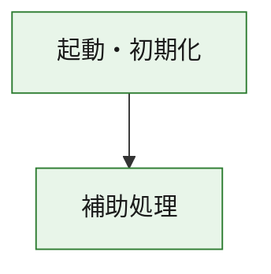
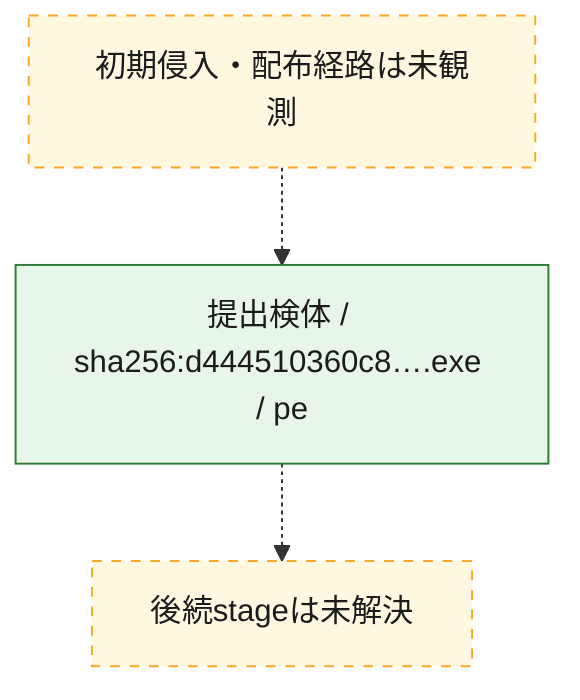
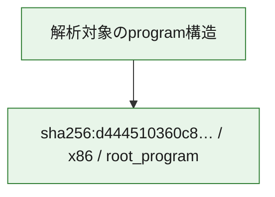

# 全体ロジック：d444510360c8203ae79cfeb7948dfc75c5d9bcd09acc10fa52123d1aa0a7ff84

代表関数の静的証跡から、起動・初期化の処理群を確認しました。

## 読み方

- phaseの掲載順は解析上の整理順です。observed_call_edgesがない段階間の実行順を断定しません。
- 図の実線は静的に観測した関係、点線と黄色のノードは未観測・未解決の関係を示します。
- 図は静的な要約であり、動的実行を再現するものではありません。
- 詳細な関数解説とfingerprintは[STATIC-LOGIC.md](STATIC-LOGIC.md)を参照してください。

## 静的可視化

### 実行フロー

### 感染チェーン

### モジュール関係

## 処理段階

### 1. 起動・初期化

entry pointから初期化と後続処理への移行を確認します。
確度: `confirmed_static_function_evidence`

- `d444510360c8203ae79cfeb7948dfc75c5d9bcd09acc10fa52123d1aa0a7ff84:ghidra:180001010` — 初期化と主要処理への分岐を行う入口関数です。 状態: `succeeded`、選定理由: `entry_point`, `meaningful_symbol_name`, `reviewed_call_centrality:22`, `role:entrypoint`, `small_program_complete_context`

### 2. 補助処理

主要処理を支える一般内部関数またはlibrary処理を確認します。
確度: `confirmed_static_function_evidence`

- `d444510360c8203ae79cfeb7948dfc75c5d9bcd09acc10fa52123d1aa0a7ff84:ghidra:180001240` — 検体内部の一般処理を実装する関数です。 状態: `succeeded`、選定理由: `context_representative`, `reviewed_call_centrality:2`, `small_program_complete_context`
- `d444510360c8203ae79cfeb7948dfc75c5d9bcd09acc10fa52123d1aa0a7ff84:ghidra:180001350` — 検体内部の一般処理を実装する関数です。 状態: `succeeded`、選定理由: `context_representative`, `reviewed_call_centrality:25`, `small_program_complete_context`
- `d444510360c8203ae79cfeb7948dfc75c5d9bcd09acc10fa52123d1aa0a7ff84:ghidra:180003780` — 検体内部の一般処理を実装する関数です。 状態: `succeeded`、選定理由: `context_representative`, `reviewed_call_centrality:2`, `small_program_complete_context`
- `d444510360c8203ae79cfeb7948dfc75c5d9bcd09acc10fa52123d1aa0a7ff84:ghidra:1800038e0` — 検体内部の一般処理を実装する関数です。 状態: `succeeded`、選定理由: `context_representative`, `reviewed_call_centrality:2`, `small_program_complete_context`

## 観測したcall関係

- `d444510360c8203ae79cfeb7948dfc75c5d9bcd09acc10fa52123d1aa0a7ff84:ghidra:180001010` → `d444510360c8203ae79cfeb7948dfc75c5d9bcd09acc10fa52123d1aa0a7ff84:ghidra:180001240` （`startup` → `support`）
- `d444510360c8203ae79cfeb7948dfc75c5d9bcd09acc10fa52123d1aa0a7ff84:ghidra:180001010` → `d444510360c8203ae79cfeb7948dfc75c5d9bcd09acc10fa52123d1aa0a7ff84:ghidra:180001350` （`startup` → `support`）
- `d444510360c8203ae79cfeb7948dfc75c5d9bcd09acc10fa52123d1aa0a7ff84:ghidra:180001350` → `d444510360c8203ae79cfeb7948dfc75c5d9bcd09acc10fa52123d1aa0a7ff84:ghidra:180001240` （`support` → `support`）
- `d444510360c8203ae79cfeb7948dfc75c5d9bcd09acc10fa52123d1aa0a7ff84:ghidra:180001350` → `d444510360c8203ae79cfeb7948dfc75c5d9bcd09acc10fa52123d1aa0a7ff84:ghidra:180003780` （`support` → `support`）
- `d444510360c8203ae79cfeb7948dfc75c5d9bcd09acc10fa52123d1aa0a7ff84:ghidra:180001350` → `d444510360c8203ae79cfeb7948dfc75c5d9bcd09acc10fa52123d1aa0a7ff84:ghidra:1800038e0` （`support` → `support`）
- `d444510360c8203ae79cfeb7948dfc75c5d9bcd09acc10fa52123d1aa0a7ff84:ghidra:180003780` → `d444510360c8203ae79cfeb7948dfc75c5d9bcd09acc10fa52123d1aa0a7ff84:ghidra:1800038e0` （`support` → `support`）
- `ghidra-function:454a14f7e843e7b1c0f4df06` → `ghidra-external:03f0821765dacfc7f85c1c96` （`unclassified` → `unclassified`）
- `ghidra-function:454a14f7e843e7b1c0f4df06` → `ghidra-external:07d9bc05ecf455352cee190b` （`unclassified` → `unclassified`）
- `ghidra-function:454a14f7e843e7b1c0f4df06` → `ghidra-external:1a8bbd861429441e64ca4e82` （`unclassified` → `unclassified`）
- `ghidra-function:454a14f7e843e7b1c0f4df06` → `ghidra-external:30da45df7d7069c15acef5c4` （`unclassified` → `unclassified`）
- `ghidra-function:454a14f7e843e7b1c0f4df06` → `ghidra-external:3ca410ba6dd411bab20ca9c6` （`unclassified` → `unclassified`）
- `ghidra-function:454a14f7e843e7b1c0f4df06` → `ghidra-external:4311054c2c8817eeb3b11d48` （`unclassified` → `unclassified`）
- `ghidra-function:454a14f7e843e7b1c0f4df06` → `ghidra-external:462e87ff9daa46e9bb4b7ac4` （`unclassified` → `unclassified`）
- `ghidra-function:454a14f7e843e7b1c0f4df06` → `ghidra-external:608fb2d8756ce277d5c7f8d1` （`unclassified` → `unclassified`）
- `ghidra-function:454a14f7e843e7b1c0f4df06` → `ghidra-external:6a98365522bcd095f479626d` （`unclassified` → `unclassified`）
- `ghidra-function:454a14f7e843e7b1c0f4df06` → `ghidra-external:7ae0203eecbc4382a6698f75` （`unclassified` → `unclassified`）
- `ghidra-function:454a14f7e843e7b1c0f4df06` → `ghidra-external:7b51ff863ce719692b6eb4a1` （`unclassified` → `unclassified`）
- `ghidra-function:454a14f7e843e7b1c0f4df06` → `ghidra-external:7cd4dc4d16ccd92943b01ce7` （`unclassified` → `unclassified`）
- `ghidra-function:454a14f7e843e7b1c0f4df06` → `ghidra-external:7d3ed9675a4bae74555a8165` （`unclassified` → `unclassified`）
- `ghidra-function:454a14f7e843e7b1c0f4df06` → `ghidra-external:94b50a29a2be7f029fdae59a` （`unclassified` → `unclassified`）
- `ghidra-function:454a14f7e843e7b1c0f4df06` → `ghidra-external:96bff913b30a5f6a4cf334fb` （`unclassified` → `unclassified`）
- `ghidra-function:454a14f7e843e7b1c0f4df06` → `ghidra-external:9ccc1eb18797a23b7481941b` （`unclassified` → `unclassified`）
- `ghidra-function:454a14f7e843e7b1c0f4df06` → `ghidra-external:a0bdde0eb0ed69a18c1651c8` （`unclassified` → `unclassified`）
- `ghidra-function:454a14f7e843e7b1c0f4df06` → `ghidra-external:a26857bb5a24cd411366fcaa` （`unclassified` → `unclassified`）
- `ghidra-function:454a14f7e843e7b1c0f4df06` → `ghidra-external:a57e3aff25a86f552289274e` （`unclassified` → `unclassified`）
- `ghidra-function:454a14f7e843e7b1c0f4df06` → `ghidra-external:c0ec303aa6271a465d97adaf` （`unclassified` → `unclassified`）
- `ghidra-function:454a14f7e843e7b1c0f4df06` → `ghidra-external:fd0bb1811e87988fb3374cbe` （`unclassified` → `unclassified`）
- `ghidra-function:454a14f7e843e7b1c0f4df06` → `ghidra-function:a2ac9b96724e3011c3fd354f` （`unclassified` → `unclassified`）
- `ghidra-function:454a14f7e843e7b1c0f4df06` → `ghidra-function:a72fa4c1574a370ec51c5513` （`unclassified` → `unclassified`）
- `ghidra-function:454a14f7e843e7b1c0f4df06` → `ghidra-function:dce7d15afae5028939fd60eb` （`unclassified` → `unclassified`）
- `ghidra-function:d2768e6989734ce01f89169f` → `ghidra-function:091707c4ea6a4c1e444b1774` （`unclassified` → `unclassified`）
- `ghidra-function:d2768e6989734ce01f89169f` → `ghidra-function:119279d0a807eae0a9efbbfc` （`unclassified` → `unclassified`）
- `ghidra-function:d2768e6989734ce01f89169f` → `ghidra-function:2fa5d810f58b5bca58b7b9e9` （`unclassified` → `unclassified`）
- `ghidra-function:d2768e6989734ce01f89169f` → `ghidra-function:412c6adf408e0ed0b0061717` （`unclassified` → `unclassified`）
- `ghidra-function:d2768e6989734ce01f89169f` → `ghidra-function:454a14f7e843e7b1c0f4df06` （`unclassified` → `unclassified`）
- `ghidra-function:d2768e6989734ce01f89169f` → `ghidra-function:67aa1adeaf9f730f47122d2f` （`unclassified` → `unclassified`）
- `ghidra-function:d2768e6989734ce01f89169f` → `ghidra-function:6dac2a4cbb8271efbd4857b6` （`unclassified` → `unclassified`）
- `ghidra-function:d2768e6989734ce01f89169f` → `ghidra-function:a2ac9b96724e3011c3fd354f` （`unclassified` → `unclassified`）
- `ghidra-function:d2768e6989734ce01f89169f` → `ghidra-function:bda27853f3859e19f24db26c` （`unclassified` → `unclassified`）
- `ghidra-function:d2768e6989734ce01f89169f` → `ghidra-function:c0cfae950e55fe95ee73ddc2` （`unclassified` → `unclassified`）
- `ghidra-function:d2768e6989734ce01f89169f` → `ghidra-function:ea70b4752cc72132953f93c6` （`unclassified` → `unclassified`）
- `ghidra-function:d2768e6989734ce01f89169f` → `ghidra-function:ff5280a725a6dfee9f3f1110` （`unclassified` → `unclassified`）
- `ghidra-function:dce7d15afae5028939fd60eb` → `ghidra-function:a72fa4c1574a370ec51c5513` （`unclassified` → `unclassified`）

## 解析範囲と制約

- 選定外関数は全体inventoryへ残しますが、関数本体の個別解説対象にはしていません。
- indirect call、難読化、packer、VM、壊れたcontrol flowによりcall関係が欠落する場合があります。
- 文書は静的解析に基づき、検体実行や外部通信による動的確認は行っていません。
