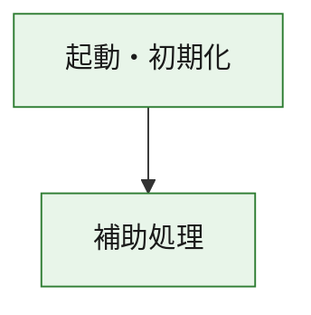
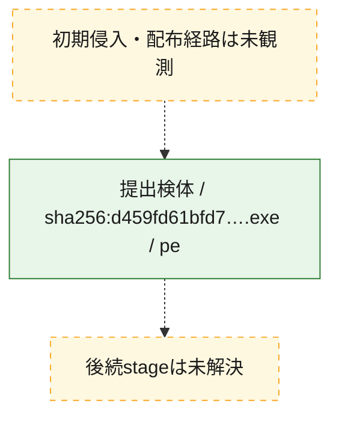
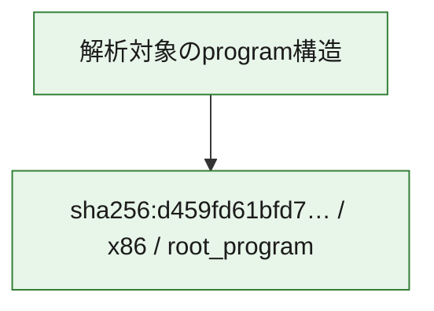

# 全体ロジック：d459fd61bfd71fd434eff7ae4ff4dcb7201c334861bde1452112ac130e12cd58

代表関数の静的証跡から、起動・初期化の処理群を確認しました。

## 読み方

- phaseの掲載順は解析上の整理順です。observed_call_edgesがない段階間の実行順を断定しません。
- 図の実線は静的に観測した関係、点線と黄色のノードは未観測・未解決の関係を示します。
- 図は静的な要約であり、動的実行を再現するものではありません。
- 詳細な関数解説とfingerprintは[STATIC-LOGIC.md](STATIC-LOGIC.md)を参照してください。

## 静的可視化

### 実行フロー

### 感染チェーン

### モジュール関係

## 処理段階

### 1. 起動・初期化

entry pointから初期化と後続処理への移行を確認します。
確度: `confirmed_static_function_evidence`

- `d459fd61bfd71fd434eff7ae4ff4dcb7201c334861bde1452112ac130e12cd58:ghidra:180001010` — 初期化と主要処理への分岐を行う入口関数です。 状態: `succeeded`、選定理由: `entry_point`, `meaningful_symbol_name`, `reviewed_call_centrality:22`, `role:entrypoint`, `small_program_complete_context`

### 2. 補助処理

主要処理を支える一般内部関数またはlibrary処理を確認します。
確度: `confirmed_static_function_evidence`

- `d459fd61bfd71fd434eff7ae4ff4dcb7201c334861bde1452112ac130e12cd58:ghidra:180001240` — 検体内部の一般処理を実装する関数です。 状態: `succeeded`、選定理由: `context_representative`, `reviewed_call_centrality:2`, `small_program_complete_context`
- `d459fd61bfd71fd434eff7ae4ff4dcb7201c334861bde1452112ac130e12cd58:ghidra:180001350` — 検体内部の一般処理を実装する関数です。 状態: `succeeded`、選定理由: `context_representative`, `reviewed_call_centrality:25`, `small_program_complete_context`
- `d459fd61bfd71fd434eff7ae4ff4dcb7201c334861bde1452112ac130e12cd58:ghidra:180003780` — 検体内部の一般処理を実装する関数です。 状態: `succeeded`、選定理由: `context_representative`, `reviewed_call_centrality:2`, `small_program_complete_context`
- `d459fd61bfd71fd434eff7ae4ff4dcb7201c334861bde1452112ac130e12cd58:ghidra:1800038e0` — 検体内部の一般処理を実装する関数です。 状態: `succeeded`、選定理由: `context_representative`, `reviewed_call_centrality:2`, `small_program_complete_context`

## 観測したcall関係

- `d459fd61bfd71fd434eff7ae4ff4dcb7201c334861bde1452112ac130e12cd58:ghidra:180001010` → `d459fd61bfd71fd434eff7ae4ff4dcb7201c334861bde1452112ac130e12cd58:ghidra:180001240` （`startup` → `support`）
- `d459fd61bfd71fd434eff7ae4ff4dcb7201c334861bde1452112ac130e12cd58:ghidra:180001010` → `d459fd61bfd71fd434eff7ae4ff4dcb7201c334861bde1452112ac130e12cd58:ghidra:180001350` （`startup` → `support`）
- `d459fd61bfd71fd434eff7ae4ff4dcb7201c334861bde1452112ac130e12cd58:ghidra:180001350` → `d459fd61bfd71fd434eff7ae4ff4dcb7201c334861bde1452112ac130e12cd58:ghidra:180001240` （`support` → `support`）
- `d459fd61bfd71fd434eff7ae4ff4dcb7201c334861bde1452112ac130e12cd58:ghidra:180001350` → `d459fd61bfd71fd434eff7ae4ff4dcb7201c334861bde1452112ac130e12cd58:ghidra:180003780` （`support` → `support`）
- `d459fd61bfd71fd434eff7ae4ff4dcb7201c334861bde1452112ac130e12cd58:ghidra:180001350` → `d459fd61bfd71fd434eff7ae4ff4dcb7201c334861bde1452112ac130e12cd58:ghidra:1800038e0` （`support` → `support`）
- `d459fd61bfd71fd434eff7ae4ff4dcb7201c334861bde1452112ac130e12cd58:ghidra:180003780` → `d459fd61bfd71fd434eff7ae4ff4dcb7201c334861bde1452112ac130e12cd58:ghidra:1800038e0` （`support` → `support`）
- `ghidra-function:01b3ecfbc5beaaeb090cf4b9` → `ghidra-external:032ad90e1314997231e8800d` （`unclassified` → `unclassified`）
- `ghidra-function:01b3ecfbc5beaaeb090cf4b9` → `ghidra-external:113cd95ed0e0cafcb865f4e7` （`unclassified` → `unclassified`）
- `ghidra-function:01b3ecfbc5beaaeb090cf4b9` → `ghidra-external:19ab454cdd1391da1ec5b01c` （`unclassified` → `unclassified`）
- `ghidra-function:01b3ecfbc5beaaeb090cf4b9` → `ghidra-external:2e6476baae442c31cac52216` （`unclassified` → `unclassified`）
- `ghidra-function:01b3ecfbc5beaaeb090cf4b9` → `ghidra-external:3b4c21f67dc4211d05847619` （`unclassified` → `unclassified`）
- `ghidra-function:01b3ecfbc5beaaeb090cf4b9` → `ghidra-external:4245ed7b728c082603772388` （`unclassified` → `unclassified`）
- `ghidra-function:01b3ecfbc5beaaeb090cf4b9` → `ghidra-external:49a4f19bce54672cf149ca28` （`unclassified` → `unclassified`）
- `ghidra-function:01b3ecfbc5beaaeb090cf4b9` → `ghidra-external:5b8eab10883efe0ee5f9be59` （`unclassified` → `unclassified`）
- `ghidra-function:01b3ecfbc5beaaeb090cf4b9` → `ghidra-external:5c9cf3cf42b71df0365183a6` （`unclassified` → `unclassified`）
- `ghidra-function:01b3ecfbc5beaaeb090cf4b9` → `ghidra-external:69393bcbe340d4da81a2d05a` （`unclassified` → `unclassified`）
- `ghidra-function:01b3ecfbc5beaaeb090cf4b9` → `ghidra-external:8b738eebe38d49175afa8034` （`unclassified` → `unclassified`）
- `ghidra-function:01b3ecfbc5beaaeb090cf4b9` → `ghidra-external:8fcc9d335e0c8a26ed932f1a` （`unclassified` → `unclassified`）
- `ghidra-function:01b3ecfbc5beaaeb090cf4b9` → `ghidra-external:9686bafa71510072f6389520` （`unclassified` → `unclassified`）
- `ghidra-function:01b3ecfbc5beaaeb090cf4b9` → `ghidra-external:9cc87cf00b991223bbc7469b` （`unclassified` → `unclassified`）
- `ghidra-function:01b3ecfbc5beaaeb090cf4b9` → `ghidra-external:9ebeeda6ce81cef4e54bea8b` （`unclassified` → `unclassified`）
- `ghidra-function:01b3ecfbc5beaaeb090cf4b9` → `ghidra-external:cdb92019136fef6104960447` （`unclassified` → `unclassified`）
- `ghidra-function:01b3ecfbc5beaaeb090cf4b9` → `ghidra-external:e125ef3d5939d876b23a1249` （`unclassified` → `unclassified`）
- `ghidra-function:01b3ecfbc5beaaeb090cf4b9` → `ghidra-external:e1fdb61e0404bfa4484f9985` （`unclassified` → `unclassified`）
- `ghidra-function:01b3ecfbc5beaaeb090cf4b9` → `ghidra-external:e758f0b77044201558834315` （`unclassified` → `unclassified`）
- `ghidra-function:01b3ecfbc5beaaeb090cf4b9` → `ghidra-external:ecfdd526c9a09206050e1340` （`unclassified` → `unclassified`）
- `ghidra-function:01b3ecfbc5beaaeb090cf4b9` → `ghidra-external:fa262bf938ff369bf24b7052` （`unclassified` → `unclassified`）
- `ghidra-function:01b3ecfbc5beaaeb090cf4b9` → `ghidra-function:11d154ecb16f12a317630bb5` （`unclassified` → `unclassified`）
- `ghidra-function:01b3ecfbc5beaaeb090cf4b9` → `ghidra-function:ada64bfb6f9dcda8f2f4d487` （`unclassified` → `unclassified`）
- `ghidra-function:01b3ecfbc5beaaeb090cf4b9` → `ghidra-function:fe03d2a722333bcb8e2541bf` （`unclassified` → `unclassified`）
- `ghidra-function:7396efd510d4c26504c67061` → `ghidra-function:01b3ecfbc5beaaeb090cf4b9` （`unclassified` → `unclassified`）
- `ghidra-function:7396efd510d4c26504c67061` → `ghidra-function:10eeaf70ff140cebef8002b8` （`unclassified` → `unclassified`）
- `ghidra-function:7396efd510d4c26504c67061` → `ghidra-function:11d154ecb16f12a317630bb5` （`unclassified` → `unclassified`）
- `ghidra-function:7396efd510d4c26504c67061` → `ghidra-function:40f9ea2a06c4ae3e61b7fd9e` （`unclassified` → `unclassified`）
- `ghidra-function:7396efd510d4c26504c67061` → `ghidra-function:827376426367ec8067b7ff61` （`unclassified` → `unclassified`）
- `ghidra-function:7396efd510d4c26504c67061` → `ghidra-function:83241d818bac853018588325` （`unclassified` → `unclassified`）
- `ghidra-function:7396efd510d4c26504c67061` → `ghidra-function:91a9fd6cb6290dcbc74a3691` （`unclassified` → `unclassified`）
- `ghidra-function:7396efd510d4c26504c67061` → `ghidra-function:9eec7fdcfda94b024683df67` （`unclassified` → `unclassified`）
- `ghidra-function:7396efd510d4c26504c67061` → `ghidra-function:a5f7fe64b2467acfa9aff131` （`unclassified` → `unclassified`）
- `ghidra-function:7396efd510d4c26504c67061` → `ghidra-function:b5fd6911959390bc8f7cacf2` （`unclassified` → `unclassified`）
- `ghidra-function:7396efd510d4c26504c67061` → `ghidra-function:d61290e283658187cd50e901` （`unclassified` → `unclassified`）
- `ghidra-function:7396efd510d4c26504c67061` → `ghidra-function:f370617953ee309ac8296233` （`unclassified` → `unclassified`）
- `ghidra-function:fe03d2a722333bcb8e2541bf` → `ghidra-function:ada64bfb6f9dcda8f2f4d487` （`unclassified` → `unclassified`）

## 解析範囲と制約

- 選定外関数は全体inventoryへ残しますが、関数本体の個別解説対象にはしていません。
- indirect call、難読化、packer、VM、壊れたcontrol flowによりcall関係が欠落する場合があります。
- 文書は静的解析に基づき、検体実行や外部通信による動的確認は行っていません。
