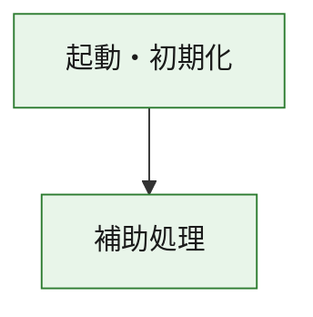
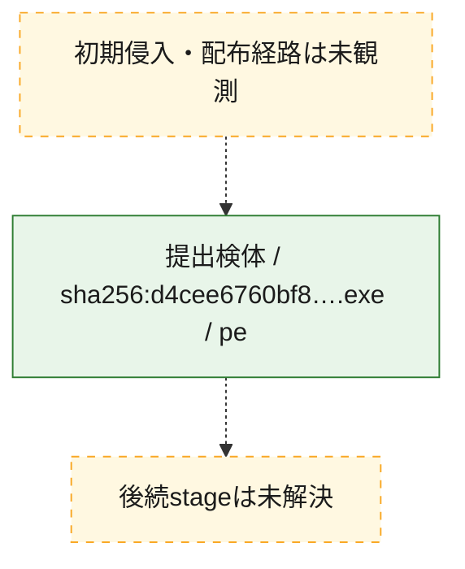
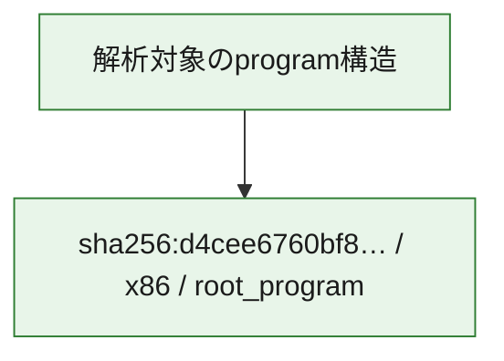

# 全体ロジック：d4cee6760bf8b0420f3e49ac68e1a14f4ab804dbe317873901dcd734ca93f8af

代表関数の静的証跡から、起動・初期化の処理群を確認しました。

## 読み方

- phaseの掲載順は解析上の整理順です。observed_call_edgesがない段階間の実行順を断定しません。
- 図の実線は静的に観測した関係、点線と黄色のノードは未観測・未解決の関係を示します。
- 図は静的な要約であり、動的実行を再現するものではありません。
- 詳細な関数解説とfingerprintは[STATIC-LOGIC.md](STATIC-LOGIC.md)を参照してください。

## 静的可視化

### 実行フロー

### 感染チェーン

### モジュール関係

## 処理段階

### 1. 起動・初期化

entry pointから初期化と後続処理への移行を確認します。
確度: `confirmed_static_function_evidence`

- `d4cee6760bf8b0420f3e49ac68e1a14f4ab804dbe317873901dcd734ca93f8af:ghidra:180001010` — 初期化と主要処理への分岐を行う入口関数です。 状態: `succeeded`、選定理由: `entry_point`, `meaningful_symbol_name`, `reviewed_call_centrality:22`, `role:entrypoint`, `small_program_complete_context`

### 2. 補助処理

主要処理を支える一般内部関数またはlibrary処理を確認します。
確度: `confirmed_static_function_evidence`

- `d4cee6760bf8b0420f3e49ac68e1a14f4ab804dbe317873901dcd734ca93f8af:ghidra:180001240` — 検体内部の一般処理を実装する関数です。 状態: `succeeded`、選定理由: `context_representative`, `reviewed_call_centrality:2`, `small_program_complete_context`
- `d4cee6760bf8b0420f3e49ac68e1a14f4ab804dbe317873901dcd734ca93f8af:ghidra:180001350` — 検体内部の一般処理を実装する関数です。 状態: `succeeded`、選定理由: `context_representative`, `reviewed_call_centrality:25`, `small_program_complete_context`
- `d4cee6760bf8b0420f3e49ac68e1a14f4ab804dbe317873901dcd734ca93f8af:ghidra:180003780` — 検体内部の一般処理を実装する関数です。 状態: `succeeded`、選定理由: `context_representative`, `reviewed_call_centrality:2`, `small_program_complete_context`
- `d4cee6760bf8b0420f3e49ac68e1a14f4ab804dbe317873901dcd734ca93f8af:ghidra:1800038e0` — 検体内部の一般処理を実装する関数です。 状態: `succeeded`、選定理由: `context_representative`, `reviewed_call_centrality:2`, `small_program_complete_context`

## 観測したcall関係

- `d4cee6760bf8b0420f3e49ac68e1a14f4ab804dbe317873901dcd734ca93f8af:ghidra:180001010` → `d4cee6760bf8b0420f3e49ac68e1a14f4ab804dbe317873901dcd734ca93f8af:ghidra:180001240` （`startup` → `support`）
- `d4cee6760bf8b0420f3e49ac68e1a14f4ab804dbe317873901dcd734ca93f8af:ghidra:180001010` → `d4cee6760bf8b0420f3e49ac68e1a14f4ab804dbe317873901dcd734ca93f8af:ghidra:180001350` （`startup` → `support`）
- `d4cee6760bf8b0420f3e49ac68e1a14f4ab804dbe317873901dcd734ca93f8af:ghidra:180001350` → `d4cee6760bf8b0420f3e49ac68e1a14f4ab804dbe317873901dcd734ca93f8af:ghidra:180001240` （`support` → `support`）
- `d4cee6760bf8b0420f3e49ac68e1a14f4ab804dbe317873901dcd734ca93f8af:ghidra:180001350` → `d4cee6760bf8b0420f3e49ac68e1a14f4ab804dbe317873901dcd734ca93f8af:ghidra:180003780` （`support` → `support`）
- `d4cee6760bf8b0420f3e49ac68e1a14f4ab804dbe317873901dcd734ca93f8af:ghidra:180001350` → `d4cee6760bf8b0420f3e49ac68e1a14f4ab804dbe317873901dcd734ca93f8af:ghidra:1800038e0` （`support` → `support`）
- `d4cee6760bf8b0420f3e49ac68e1a14f4ab804dbe317873901dcd734ca93f8af:ghidra:180003780` → `d4cee6760bf8b0420f3e49ac68e1a14f4ab804dbe317873901dcd734ca93f8af:ghidra:1800038e0` （`support` → `support`）
- `ghidra-function:3cbef5803ff2f2e24737cb99` → `ghidra-function:110024253ce8adb88bdd971d` （`unclassified` → `unclassified`）
- `ghidra-function:3cbef5803ff2f2e24737cb99` → `ghidra-function:149def15dd8c229da952caad` （`unclassified` → `unclassified`）
- `ghidra-function:3cbef5803ff2f2e24737cb99` → `ghidra-function:1656b1a70bf434c23312e035` （`unclassified` → `unclassified`）
- `ghidra-function:3cbef5803ff2f2e24737cb99` → `ghidra-function:246398b201d28719c35c2128` （`unclassified` → `unclassified`）
- `ghidra-function:3cbef5803ff2f2e24737cb99` → `ghidra-function:39ec9fabc8109bdaf57345c3` （`unclassified` → `unclassified`）
- `ghidra-function:3cbef5803ff2f2e24737cb99` → `ghidra-function:8c55c723d502c2828ec0bbed` （`unclassified` → `unclassified`）
- `ghidra-function:3cbef5803ff2f2e24737cb99` → `ghidra-function:8dc676f78bf56d199fee0461` （`unclassified` → `unclassified`）
- `ghidra-function:3cbef5803ff2f2e24737cb99` → `ghidra-function:9271f73cb19510573e01ef2d` （`unclassified` → `unclassified`）
- `ghidra-function:3cbef5803ff2f2e24737cb99` → `ghidra-function:c4ef7970ef7d9ef72faae947` （`unclassified` → `unclassified`）
- `ghidra-function:3cbef5803ff2f2e24737cb99` → `ghidra-function:c831cac3915b8b4d9e5ad5fc` （`unclassified` → `unclassified`）
- `ghidra-function:3cbef5803ff2f2e24737cb99` → `ghidra-function:f337991db55b2d83598cf542` （`unclassified` → `unclassified`）
- `ghidra-function:3cbef5803ff2f2e24737cb99` → `ghidra-function:fa20ea6466debb392991d15a` （`unclassified` → `unclassified`）
- `ghidra-function:83a4cf249897987ecdd57bc7` → `ghidra-function:0a9b55934d076ba8cb9275fc` （`unclassified` → `unclassified`）
- `ghidra-function:8dc676f78bf56d199fee0461` → `ghidra-external:041eee95caa8917dd5f24e78` （`unclassified` → `unclassified`）
- `ghidra-function:8dc676f78bf56d199fee0461` → `ghidra-external:1991de2074e061e45ca10487` （`unclassified` → `unclassified`）
- `ghidra-function:8dc676f78bf56d199fee0461` → `ghidra-external:1c69cdaedab9063a3edb2d12` （`unclassified` → `unclassified`）
- `ghidra-function:8dc676f78bf56d199fee0461` → `ghidra-external:1cbbef04ddc46d7a64be783b` （`unclassified` → `unclassified`）
- `ghidra-function:8dc676f78bf56d199fee0461` → `ghidra-external:21b0c0c5fc1e5e27e5a5be0d` （`unclassified` → `unclassified`）
- `ghidra-function:8dc676f78bf56d199fee0461` → `ghidra-external:2adc7116efaed411129d32f5` （`unclassified` → `unclassified`）
- `ghidra-function:8dc676f78bf56d199fee0461` → `ghidra-external:3dde2fcea1b27866e6262228` （`unclassified` → `unclassified`）
- `ghidra-function:8dc676f78bf56d199fee0461` → `ghidra-external:42016f8deaf4a80fd059a497` （`unclassified` → `unclassified`）
- `ghidra-function:8dc676f78bf56d199fee0461` → `ghidra-external:437e1723a167a29e4553091c` （`unclassified` → `unclassified`）
- `ghidra-function:8dc676f78bf56d199fee0461` → `ghidra-external:46c8042dc65971c54f4e5976` （`unclassified` → `unclassified`）
- `ghidra-function:8dc676f78bf56d199fee0461` → `ghidra-external:87253e183dfa18941e3bf122` （`unclassified` → `unclassified`）
- `ghidra-function:8dc676f78bf56d199fee0461` → `ghidra-external:9a6123c660f13727979a9724` （`unclassified` → `unclassified`）
- `ghidra-function:8dc676f78bf56d199fee0461` → `ghidra-external:c099a875fa5c7d240e6d01fe` （`unclassified` → `unclassified`）
- `ghidra-function:8dc676f78bf56d199fee0461` → `ghidra-external:c0f9c366be7d5113e378eccd` （`unclassified` → `unclassified`）
- `ghidra-function:8dc676f78bf56d199fee0461` → `ghidra-external:ca9593937aaafe6436e1f45c` （`unclassified` → `unclassified`）
- `ghidra-function:8dc676f78bf56d199fee0461` → `ghidra-external:d049a9b3b28a224e98f7acf8` （`unclassified` → `unclassified`）
- `ghidra-function:8dc676f78bf56d199fee0461` → `ghidra-external:e7f4db92aa1698be224f8a2d` （`unclassified` → `unclassified`）
- `ghidra-function:8dc676f78bf56d199fee0461` → `ghidra-external:e9c3273051c012c07ce130be` （`unclassified` → `unclassified`）
- `ghidra-function:8dc676f78bf56d199fee0461` → `ghidra-external:f1f11a7c1b81975bd7af3426` （`unclassified` → `unclassified`）
- `ghidra-function:8dc676f78bf56d199fee0461` → `ghidra-external:f7b213195c9b82bcabfdd8c8` （`unclassified` → `unclassified`）
- `ghidra-function:8dc676f78bf56d199fee0461` → `ghidra-external:fa994404f37a527eb7761703` （`unclassified` → `unclassified`）
- `ghidra-function:8dc676f78bf56d199fee0461` → `ghidra-function:0a9b55934d076ba8cb9275fc` （`unclassified` → `unclassified`）
- `ghidra-function:8dc676f78bf56d199fee0461` → `ghidra-function:83a4cf249897987ecdd57bc7` （`unclassified` → `unclassified`）
- `ghidra-function:8dc676f78bf56d199fee0461` → `ghidra-function:8c55c723d502c2828ec0bbed` （`unclassified` → `unclassified`）

## 解析範囲と制約

- 選定外関数は全体inventoryへ残しますが、関数本体の個別解説対象にはしていません。
- indirect call、難読化、packer、VM、壊れたcontrol flowによりcall関係が欠落する場合があります。
- 文書は静的解析に基づき、検体実行や外部通信による動的確認は行っていません。
