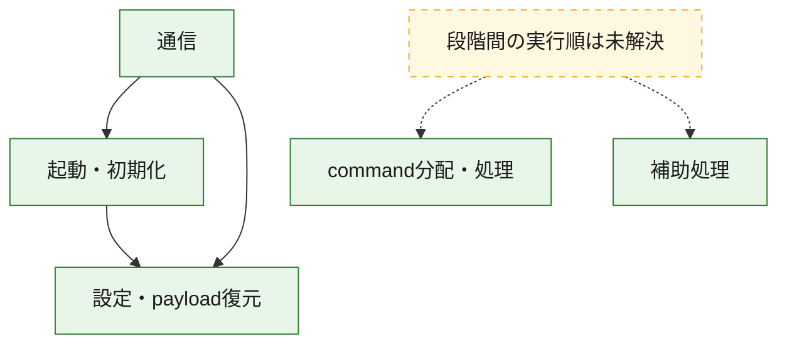
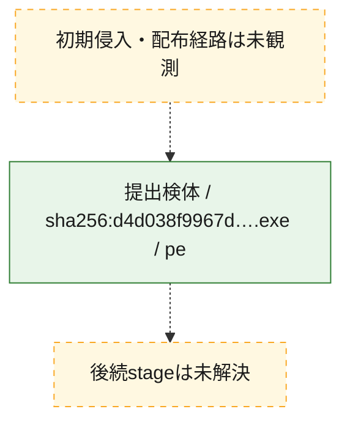
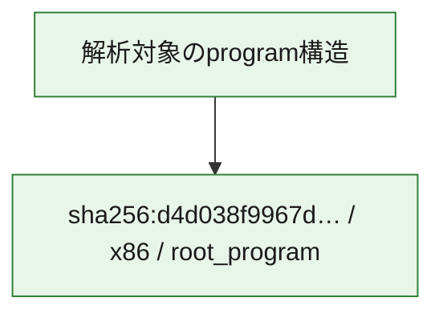

# 全体ロジック：d4d038f9967db1d2f2307dddaf4b8119548e15c7122f2b1f74fe22a556ef7df8

代表関数の静的証跡から、起動・初期化、設定・payload復元、通信、command分配・処理の処理群を確認しました。

## 読み方

- phaseの掲載順は解析上の整理順です。observed_call_edgesがない段階間の実行順を断定しません。
- 図の実線は静的に観測した関係、点線と黄色のノードは未観測・未解決の関係を示します。
- 図は静的な要約であり、動的実行を再現するものではありません。
- 詳細な関数解説とfingerprintは[STATIC-LOGIC.md](STATIC-LOGIC.md)を参照してください。

## 静的可視化

### 実行フロー

### 感染チェーン

### モジュール関係

## 処理段階

### 1. 起動・初期化

entry pointから初期化と後続処理への移行を確認します。
確度: `confirmed_static_function_evidence`

- `d4d038f9967db1d2f2307dddaf4b8119548e15c7122f2b1f74fe22a556ef7df8:ghidra:140009ad7` — 初期化と主要処理への分岐を行う入口関数です。 状態: `succeeded`、選定理由: `entry_point`, `meaningful_symbol_name`, `reviewed_call_centrality:7`, `role:entrypoint`
- `d4d038f9967db1d2f2307dddaf4b8119548e15c7122f2b1f74fe22a556ef7df8:ghidra:14000fe84` — 初期化と主要処理への分岐を行う入口関数です。 状態: `succeeded`、選定理由: `entry_point`, `meaningful_symbol_name`, `probable_go_main_user_code`, `reviewed_call_centrality:23`, `role:entrypoint`

### 2. 設定・payload復元

設定、resource、payload、暗号化データの復元・変換を確認します。
確度: `confirmed_static_function_evidence`

- `d4d038f9967db1d2f2307dddaf4b8119548e15c7122f2b1f74fe22a556ef7df8:ghidra:1400016e1` — 設定、resource、payloadなどの解析・変換を行う関数です。 状態: `succeeded`、選定理由: `meaningful_symbol_name`, `reviewed_call_centrality:1`, `role:config_or_data_transform`
- `d4d038f9967db1d2f2307dddaf4b8119548e15c7122f2b1f74fe22a556ef7df8:ghidra:140001c94` — 設定、resource、payloadなどの解析・変換を行う関数です。 状態: `succeeded`、選定理由: `meaningful_symbol_name`, `reviewed_call_centrality:1`, `role:config_or_data_transform`
- `d4d038f9967db1d2f2307dddaf4b8119548e15c7122f2b1f74fe22a556ef7df8:ghidra:1400022ae` — 暗号、hash、encoding、または復号処理に関係する関数です。 状態: `succeeded`、選定理由: `meaningful_symbol_name`, `reviewed_call_centrality:4`, `role:cryptographic_transform`
- `d4d038f9967db1d2f2307dddaf4b8119548e15c7122f2b1f74fe22a556ef7df8:ghidra:140002ecc` — 暗号、hash、encoding、または復号処理に関係する関数です。 状態: `succeeded`、選定理由: `meaningful_symbol_name`, `reviewed_call_centrality:4`, `role:cryptographic_transform`
- `d4d038f9967db1d2f2307dddaf4b8119548e15c7122f2b1f74fe22a556ef7df8:ghidra:140002fb6` — 暗号、hash、encoding、または復号処理に関係する関数です。 状態: `succeeded`、選定理由: `meaningful_symbol_name`, `reviewed_call_centrality:12`, `role:cryptographic_transform`
- `d4d038f9967db1d2f2307dddaf4b8119548e15c7122f2b1f74fe22a556ef7df8:ghidra:1400031e9` — 設定、resource、payloadなどの解析・変換を行う関数です。 状態: `succeeded`、選定理由: `meaningful_symbol_name`, `reviewed_call_centrality:13`, `role:config_or_data_transform`
- `d4d038f9967db1d2f2307dddaf4b8119548e15c7122f2b1f74fe22a556ef7df8:ghidra:140003c95` — 設定、resource、payloadなどの解析・変換を行う関数です。 状態: `succeeded`、選定理由: `meaningful_symbol_name`, `reviewed_call_centrality:1`, `role:config_or_data_transform`
- `d4d038f9967db1d2f2307dddaf4b8119548e15c7122f2b1f74fe22a556ef7df8:ghidra:140005261` — 設定、resource、payloadなどの解析・変換を行う関数です。 状態: `succeeded`、選定理由: `meaningful_symbol_name`, `reviewed_call_centrality:2`, `role:config_or_data_transform`
- `d4d038f9967db1d2f2307dddaf4b8119548e15c7122f2b1f74fe22a556ef7df8:ghidra:140005dfb` — 暗号、hash、encoding、または復号処理に関係する関数です。 状態: `succeeded`、選定理由: `meaningful_symbol_name`, `reviewed_call_centrality:2`, `role:cryptographic_transform`
- `d4d038f9967db1d2f2307dddaf4b8119548e15c7122f2b1f74fe22a556ef7df8:ghidra:140005f7d` — 設定、resource、payloadなどの解析・変換を行う関数です。 状態: `succeeded`、選定理由: `meaningful_symbol_name`, `reviewed_call_centrality:12`, `role:config_or_data_transform`
- `d4d038f9967db1d2f2307dddaf4b8119548e15c7122f2b1f74fe22a556ef7df8:ghidra:1400064c3` — 設定、resource、payloadなどの解析・変換を行う関数です。 状態: `succeeded`、選定理由: `meaningful_symbol_name`, `reviewed_call_centrality:9`, `role:config_or_data_transform`
- `d4d038f9967db1d2f2307dddaf4b8119548e15c7122f2b1f74fe22a556ef7df8:ghidra:140008227` — 設定、resource、payloadなどの解析・変換を行う関数です。 状態: `succeeded`、選定理由: `meaningful_symbol_name`, `reviewed_call_centrality:1`, `role:config_or_data_transform`
- `d4d038f9967db1d2f2307dddaf4b8119548e15c7122f2b1f74fe22a556ef7df8:ghidra:14000a68a` — 設定、resource、payloadなどの解析・変換を行う関数です。 状態: `succeeded`、選定理由: `meaningful_symbol_name`, `reviewed_call_centrality:7`, `role:config_or_data_transform`

### 3. 通信

通信初期化、endpoint処理、送受信の役割を確認します。
確度: `confirmed_static_function_evidence`

- `d4d038f9967db1d2f2307dddaf4b8119548e15c7122f2b1f74fe22a556ef7df8:ghidra:140005b93` — 通信初期化、送受信、またはendpoint処理に関係する関数です。 状態: `succeeded`、選定理由: `meaningful_symbol_name`, `reviewed_call_centrality:3`, `role:network_communication`
- `d4d038f9967db1d2f2307dddaf4b8119548e15c7122f2b1f74fe22a556ef7df8:ghidra:140006a82` — 通信初期化、送受信、またはendpoint処理に関係する関数です。 状態: `succeeded`、選定理由: `meaningful_symbol_name`, `reviewed_call_centrality:3`, `role:network_communication`
- `d4d038f9967db1d2f2307dddaf4b8119548e15c7122f2b1f74fe22a556ef7df8:ghidra:1400076b2` — 通信初期化、送受信、またはendpoint処理に関係する関数です。 状態: `succeeded`、選定理由: `meaningful_symbol_name`, `reviewed_call_centrality:3`, `role:network_communication`
- `d4d038f9967db1d2f2307dddaf4b8119548e15c7122f2b1f74fe22a556ef7df8:ghidra:140009019` — 通信初期化、送受信、またはendpoint処理に関係する関数です。 状態: `succeeded`、選定理由: `meaningful_symbol_name`, `reviewed_call_centrality:20`, `role:network_communication`
- `d4d038f9967db1d2f2307dddaf4b8119548e15c7122f2b1f74fe22a556ef7df8:ghidra:140009259` — 通信初期化、送受信、またはendpoint処理に関係する関数です。 状態: `succeeded`、選定理由: `meaningful_symbol_name`, `reviewed_call_centrality:5`, `role:network_communication`
- `d4d038f9967db1d2f2307dddaf4b8119548e15c7122f2b1f74fe22a556ef7df8:ghidra:1400095b6` — 通信初期化、送受信、またはendpoint処理に関係する関数です。 状態: `succeeded`、選定理由: `meaningful_symbol_name`, `reviewed_call_centrality:3`, `role:network_communication`
- `d4d038f9967db1d2f2307dddaf4b8119548e15c7122f2b1f74fe22a556ef7df8:ghidra:140009615` — 通信初期化、送受信、またはendpoint処理に関係する関数です。 状態: `succeeded`、選定理由: `meaningful_symbol_name`, `reviewed_call_centrality:4`, `role:network_communication`
- `d4d038f9967db1d2f2307dddaf4b8119548e15c7122f2b1f74fe22a556ef7df8:ghidra:140009751` — 通信初期化、送受信、またはendpoint処理に関係する関数です。 状態: `succeeded`、選定理由: `meaningful_symbol_name`, `reviewed_call_centrality:9`, `role:network_communication`
- `d4d038f9967db1d2f2307dddaf4b8119548e15c7122f2b1f74fe22a556ef7df8:ghidra:140009ec5` — 通信初期化、送受信、またはendpoint処理に関係する関数です。 状態: `succeeded`、選定理由: `meaningful_symbol_name`, `reviewed_call_centrality:3`, `role:network_communication`
- `d4d038f9967db1d2f2307dddaf4b8119548e15c7122f2b1f74fe22a556ef7df8:ghidra:140009fb9` — 通信初期化、送受信、またはendpoint処理に関係する関数です。 状態: `succeeded`、選定理由: `meaningful_symbol_name`, `reviewed_call_centrality:15`, `role:network_communication`
- `d4d038f9967db1d2f2307dddaf4b8119548e15c7122f2b1f74fe22a556ef7df8:ghidra:14000b527` — 通信初期化、送受信、またはendpoint処理に関係する関数です。 状態: `succeeded`、選定理由: `meaningful_symbol_name`, `reviewed_call_centrality:11`, `role:network_communication`

### 4. command分配・処理

受信commandやtaskの解釈、分配、個別handlerへの移行を確認します。
確度: `confirmed_static_function_evidence`

- `d4d038f9967db1d2f2307dddaf4b8119548e15c7122f2b1f74fe22a556ef7df8:ghidra:14000ae69` — commandの解釈、分配、または個別処理を担当する関数です。 状態: `succeeded`、選定理由: `meaningful_symbol_name`, `reviewed_call_centrality:5`, `role:command_dispatch_or_handler`
- `d4d038f9967db1d2f2307dddaf4b8119548e15c7122f2b1f74fe22a556ef7df8:ghidra:14000b6e4` — commandの解釈、分配、または個別処理を担当する関数です。 状態: `succeeded`、選定理由: `meaningful_symbol_name`, `reviewed_call_centrality:5`, `role:command_dispatch_or_handler`
- `d4d038f9967db1d2f2307dddaf4b8119548e15c7122f2b1f74fe22a556ef7df8:ghidra:14000baeb` — commandの解釈、分配、または個別処理を担当する関数です。 状態: `succeeded`、選定理由: `meaningful_symbol_name`, `reviewed_call_centrality:7`, `role:command_dispatch_or_handler`

### 5. 補助処理

主要処理を支える一般内部関数またはlibrary処理を確認します。
確度: `confirmed_static_function_evidence`

- `d4d038f9967db1d2f2307dddaf4b8119548e15c7122f2b1f74fe22a556ef7df8:ghidra:140001410` — 検体内部の一般処理を実装する関数です。 状態: `succeeded`、選定理由: `entry_point`, `meaningful_symbol_name`, `reviewed_call_centrality:1`
- `d4d038f9967db1d2f2307dddaf4b8119548e15c7122f2b1f74fe22a556ef7df8:ghidra:140010620` — compiler生成処理または汎用library処理とみられる関数です。 状態: `succeeded`、選定理由: `entry_point`, `meaningful_symbol_name`, `reviewed_call_centrality:1`
- `d4d038f9967db1d2f2307dddaf4b8119548e15c7122f2b1f74fe22a556ef7df8:ghidra:140010650` — compiler生成処理または汎用library処理とみられる関数です。 状態: `succeeded`、選定理由: `entry_point`, `meaningful_symbol_name`, `reviewed_call_centrality:2`

## 観測したcall関係

- `d4d038f9967db1d2f2307dddaf4b8119548e15c7122f2b1f74fe22a556ef7df8:ghidra:140002fb6` → `d4d038f9967db1d2f2307dddaf4b8119548e15c7122f2b1f74fe22a556ef7df8:ghidra:140002ecc` （`configuration` → `configuration`）
- `d4d038f9967db1d2f2307dddaf4b8119548e15c7122f2b1f74fe22a556ef7df8:ghidra:1400031e9` → `d4d038f9967db1d2f2307dddaf4b8119548e15c7122f2b1f74fe22a556ef7df8:ghidra:140002ecc` （`configuration` → `configuration`）
- `d4d038f9967db1d2f2307dddaf4b8119548e15c7122f2b1f74fe22a556ef7df8:ghidra:140005dfb` → `d4d038f9967db1d2f2307dddaf4b8119548e15c7122f2b1f74fe22a556ef7df8:ghidra:1400022ae` （`configuration` → `configuration`）
- `d4d038f9967db1d2f2307dddaf4b8119548e15c7122f2b1f74fe22a556ef7df8:ghidra:1400064c3` → `d4d038f9967db1d2f2307dddaf4b8119548e15c7122f2b1f74fe22a556ef7df8:ghidra:1400031e9` （`configuration` → `configuration`）
- `d4d038f9967db1d2f2307dddaf4b8119548e15c7122f2b1f74fe22a556ef7df8:ghidra:1400064c3` → `d4d038f9967db1d2f2307dddaf4b8119548e15c7122f2b1f74fe22a556ef7df8:ghidra:140005f7d` （`configuration` → `configuration`）
- `d4d038f9967db1d2f2307dddaf4b8119548e15c7122f2b1f74fe22a556ef7df8:ghidra:140006a82` → `d4d038f9967db1d2f2307dddaf4b8119548e15c7122f2b1f74fe22a556ef7df8:ghidra:140005b93` （`communication` → `communication`）
- `d4d038f9967db1d2f2307dddaf4b8119548e15c7122f2b1f74fe22a556ef7df8:ghidra:140009259` → `d4d038f9967db1d2f2307dddaf4b8119548e15c7122f2b1f74fe22a556ef7df8:ghidra:140009019` （`communication` → `communication`）
- `d4d038f9967db1d2f2307dddaf4b8119548e15c7122f2b1f74fe22a556ef7df8:ghidra:140009751` → `d4d038f9967db1d2f2307dddaf4b8119548e15c7122f2b1f74fe22a556ef7df8:ghidra:140002fb6` （`communication` → `configuration`）
- `d4d038f9967db1d2f2307dddaf4b8119548e15c7122f2b1f74fe22a556ef7df8:ghidra:140009751` → `d4d038f9967db1d2f2307dddaf4b8119548e15c7122f2b1f74fe22a556ef7df8:ghidra:1400095b6` （`communication` → `communication`）
- `d4d038f9967db1d2f2307dddaf4b8119548e15c7122f2b1f74fe22a556ef7df8:ghidra:140009fb9` → `d4d038f9967db1d2f2307dddaf4b8119548e15c7122f2b1f74fe22a556ef7df8:ghidra:140009ad7` （`communication` → `startup`）
- `d4d038f9967db1d2f2307dddaf4b8119548e15c7122f2b1f74fe22a556ef7df8:ghidra:140009fb9` → `d4d038f9967db1d2f2307dddaf4b8119548e15c7122f2b1f74fe22a556ef7df8:ghidra:140009ec5` （`communication` → `communication`）
- `d4d038f9967db1d2f2307dddaf4b8119548e15c7122f2b1f74fe22a556ef7df8:ghidra:14000b527` → `d4d038f9967db1d2f2307dddaf4b8119548e15c7122f2b1f74fe22a556ef7df8:ghidra:140009fb9` （`communication` → `communication`）
- `d4d038f9967db1d2f2307dddaf4b8119548e15c7122f2b1f74fe22a556ef7df8:ghidra:14000fe84` → `d4d038f9967db1d2f2307dddaf4b8119548e15c7122f2b1f74fe22a556ef7df8:ghidra:1400064c3` （`startup` → `configuration`）
- `ghidra-function:12ebac229c69023e03740435` → `ghidra-function:a2f00f0f8ccf4207b570ec9b` （`unclassified` → `unclassified`）
- `ghidra-function:131b32a5a99e7cfb69018c88` → `ghidra-external:79548c5b9a5297d0e08bc6a0` （`unclassified` → `unclassified`）
- `ghidra-function:131b32a5a99e7cfb69018c88` → `ghidra-function:a2f00f0f8ccf4207b570ec9b` （`unclassified` → `unclassified`）
- `ghidra-function:19b6372e77b4b1ed1f8bd00b` → `ghidra-function:5f636d1035313450495bcb1c` （`unclassified` → `unclassified`）
- `ghidra-function:19caf1073469d97374ddfb41` → `ghidra-external:3650c4286864fdb1c0167d84` （`unclassified` → `unclassified`）
- `ghidra-function:19caf1073469d97374ddfb41` → `ghidra-external:63ee97434825d45b7df644bd` （`unclassified` → `unclassified`）
- `ghidra-function:19caf1073469d97374ddfb41` → `ghidra-function:f34be6d446d1ec4d089ff12c` （`unclassified` → `unclassified`）
- `ghidra-function:1d82a1cead63ff7793e51ca2` → `ghidra-external:3650c4286864fdb1c0167d84` （`unclassified` → `unclassified`）
- `ghidra-function:1d82a1cead63ff7793e51ca2` → `ghidra-external:40a35850d6b4fa9c7e4561fa` （`unclassified` → `unclassified`）
- `ghidra-function:1d82a1cead63ff7793e51ca2` → `ghidra-external:4710999d520dbf274ea218bc` （`unclassified` → `unclassified`）
- `ghidra-function:1d82a1cead63ff7793e51ca2` → `ghidra-function:40f6d776fce57ac7ca30e48c` （`unclassified` → `unclassified`）
- `ghidra-function:1fba4f99277373c9c1043574` → `ghidra-external:63ee97434825d45b7df644bd` （`unclassified` → `unclassified`）
- `ghidra-function:1fba4f99277373c9c1043574` → `ghidra-external:6962b901d9ab04d4eb3ada86` （`unclassified` → `unclassified`）
- `ghidra-function:1fba4f99277373c9c1043574` → `ghidra-external:85e0f46f195389308f828037` （`unclassified` → `unclassified`）
- `ghidra-function:1fba4f99277373c9c1043574` → `ghidra-external:a0e726d092f311c8943ba90c` （`unclassified` → `unclassified`）
- `ghidra-function:1fba4f99277373c9c1043574` → `ghidra-external:b6350fa21f63c0d8fa9afa5b` （`unclassified` → `unclassified`）
- `ghidra-function:1fba4f99277373c9c1043574` → `ghidra-external:bbffc72eb3d0a6a2da1cc719` （`unclassified` → `unclassified`）
- `ghidra-function:1fba4f99277373c9c1043574` → `ghidra-external:c47071caaa7bac8e200bb41b` （`unclassified` → `unclassified`）
- `ghidra-function:491514131f912d3c80781483` → `ghidra-function:1bc2bb033ef55ac88f452250` （`unclassified` → `unclassified`）
- `ghidra-function:491514131f912d3c80781483` → `ghidra-function:c34b0d0b365c905fdb102884` （`unclassified` → `unclassified`）
- `ghidra-function:4e0270e61e5661a973d15b58` → `ghidra-function:20b41896d58be3feaf959bfc` （`unclassified` → `unclassified`）
- `ghidra-function:4e0270e61e5661a973d15b58` → `ghidra-function:48a516d43a11c769bb7b586b` （`unclassified` → `unclassified`）
- `ghidra-function:4e0270e61e5661a973d15b58` → `ghidra-function:6abb7a0da951ca1e0250c996` （`unclassified` → `unclassified`）
- `ghidra-function:4e0270e61e5661a973d15b58` → `ghidra-function:f06a7de6ad9dc6b5664c659c` （`unclassified` → `unclassified`）
- `ghidra-function:4e0270e61e5661a973d15b58` → `ghidra-function:fa9016624951b9d5507514aa` （`unclassified` → `unclassified`）
- `ghidra-function:4e0270e61e5661a973d15b58` → `ghidra-function:febd7d5de61d2d2abf180908` （`unclassified` → `unclassified`）
- `ghidra-function:4e0270e61e5661a973d15b58` → `ghidra-function:ff1716a48217986d5d30c54e` （`unclassified` → `unclassified`）
- `ghidra-function:51fc9b196f4a29ea9c044243` → `ghidra-external:211cd494655ed043153b115d` （`unclassified` → `unclassified`）
- `ghidra-function:51fc9b196f4a29ea9c044243` → `ghidra-external:3650c4286864fdb1c0167d84` （`unclassified` → `unclassified`）
- `ghidra-function:51fc9b196f4a29ea9c044243` → `ghidra-external:8c702d489554203b8f366f40` （`unclassified` → `unclassified`）
- `ghidra-function:51fc9b196f4a29ea9c044243` → `ghidra-external:c2d106aabe7b71ce71c24dd7` （`unclassified` → `unclassified`）
- `ghidra-function:51fc9b196f4a29ea9c044243` → `ghidra-external:ef9652c3d551c506117311c3` （`unclassified` → `unclassified`）
- `ghidra-function:51fc9b196f4a29ea9c044243` → `ghidra-function:1bc2bb033ef55ac88f452250` （`unclassified` → `unclassified`）
- `ghidra-function:51fc9b196f4a29ea9c044243` → `ghidra-function:491514131f912d3c80781483` （`unclassified` → `unclassified`）
- `ghidra-function:51fc9b196f4a29ea9c044243` → `ghidra-function:51cfa607dea56fa1c5f19c52` （`unclassified` → `unclassified`）
- `ghidra-function:51fc9b196f4a29ea9c044243` → `ghidra-function:6fbfedb31192e68341a9c56c` （`unclassified` → `unclassified`）
- `ghidra-function:51fc9b196f4a29ea9c044243` → `ghidra-function:7074796fa41cbb7866ffd605` （`unclassified` → `unclassified`）
- `ghidra-function:51fc9b196f4a29ea9c044243` → `ghidra-function:c34b0d0b365c905fdb102884` （`unclassified` → `unclassified`）
- `ghidra-function:54a4ce37bb0228a6fc088273` → `ghidra-external:211cd494655ed043153b115d` （`unclassified` → `unclassified`）
- `ghidra-function:54a4ce37bb0228a6fc088273` → `ghidra-external:3650c4286864fdb1c0167d84` （`unclassified` → `unclassified`）
- `ghidra-function:54a4ce37bb0228a6fc088273` → `ghidra-external:63ee97434825d45b7df644bd` （`unclassified` → `unclassified`）
- `ghidra-function:54a4ce37bb0228a6fc088273` → `ghidra-external:855f39b040a1d19c88b5c314` （`unclassified` → `unclassified`）
- `ghidra-function:54a4ce37bb0228a6fc088273` → `ghidra-external:8c702d489554203b8f366f40` （`unclassified` → `unclassified`）
- `ghidra-function:54a4ce37bb0228a6fc088273` → `ghidra-external:c2d106aabe7b71ce71c24dd7` （`unclassified` → `unclassified`）
- `ghidra-function:54a4ce37bb0228a6fc088273` → `ghidra-external:ef9652c3d551c506117311c3` （`unclassified` → `unclassified`）
- `ghidra-function:54a4ce37bb0228a6fc088273` → `ghidra-function:1bc2bb033ef55ac88f452250` （`unclassified` → `unclassified`）
- `ghidra-function:54a4ce37bb0228a6fc088273` → `ghidra-function:491514131f912d3c80781483` （`unclassified` → `unclassified`）
- `ghidra-function:54a4ce37bb0228a6fc088273` → `ghidra-function:51cfa607dea56fa1c5f19c52` （`unclassified` → `unclassified`）
- `ghidra-function:54a4ce37bb0228a6fc088273` → `ghidra-function:6fbfedb31192e68341a9c56c` （`unclassified` → `unclassified`）
- `ghidra-function:54a4ce37bb0228a6fc088273` → `ghidra-function:c34b0d0b365c905fdb102884` （`unclassified` → `unclassified`）
- `ghidra-function:5b8eb69e44118d56108a510d` → `ghidra-external:1ae9250630e7430171d2136d` （`unclassified` → `unclassified`）
- `ghidra-function:5b8eb69e44118d56108a510d` → `ghidra-external:2a3bccc25e1c8873764751f9` （`unclassified` → `unclassified`）
- `ghidra-function:5b8eb69e44118d56108a510d` → `ghidra-external:3650c4286864fdb1c0167d84` （`unclassified` → `unclassified`）
- `ghidra-function:5b8eb69e44118d56108a510d` → `ghidra-external:40a35850d6b4fa9c7e4561fa` （`unclassified` → `unclassified`）
- `ghidra-function:5b8eb69e44118d56108a510d` → `ghidra-external:63ee97434825d45b7df644bd` （`unclassified` → `unclassified`）
- `ghidra-function:5b8eb69e44118d56108a510d` → `ghidra-external:85e0f46f195389308f828037` （`unclassified` → `unclassified`）
- `ghidra-function:5b8eb69e44118d56108a510d` → `ghidra-external:c90125894d078631742d08b4` （`unclassified` → `unclassified`）
- `ghidra-function:5b8eb69e44118d56108a510d` → `ghidra-external:efbd902a8e98a9fccc70a37e` （`unclassified` → `unclassified`）
- `ghidra-function:5b8eb69e44118d56108a510d` → `ghidra-function:8662e13f356a9dbc5735bb88` （`unclassified` → `unclassified`）
- `ghidra-function:5b8eb69e44118d56108a510d` → `ghidra-function:cb895d3d5eb0510c0390bce4` （`unclassified` → `unclassified`）
- `ghidra-function:5b8eb69e44118d56108a510d` → `ghidra-function:de8d0c3d1b9b9f5d6b184e9e` （`unclassified` → `unclassified`）
- `ghidra-function:5b8eb69e44118d56108a510d` → `ghidra-function:e4152fdb4a57628ad62ec448` （`unclassified` → `unclassified`）
- `ghidra-function:5b8eb69e44118d56108a510d` → `ghidra-function:e49de8dcdce079a668631947` （`unclassified` → `unclassified`）
- `ghidra-function:5c0b700304f37f66513ead6e` → `ghidra-function:20b41896d58be3feaf959bfc` （`unclassified` → `unclassified`）
- `ghidra-function:5c0b700304f37f66513ead6e` → `ghidra-function:31d7f132ac9980e3ac07b787` （`unclassified` → `unclassified`）
- `ghidra-function:5c0b700304f37f66513ead6e` → `ghidra-function:48a516d43a11c769bb7b586b` （`unclassified` → `unclassified`）
- `ghidra-function:5c0b700304f37f66513ead6e` → `ghidra-function:5a46f9b62ba324215c495837` （`unclassified` → `unclassified`）
- `ghidra-function:5c0b700304f37f66513ead6e` → `ghidra-function:5b8eb69e44118d56108a510d` （`unclassified` → `unclassified`）
- `ghidra-function:5c0b700304f37f66513ead6e` → `ghidra-function:a868e44deee3dad0c088c4cf` （`unclassified` → `unclassified`）
- `ghidra-function:5c0b700304f37f66513ead6e` → `ghidra-function:d6be33c0af913f737835cbbc` （`unclassified` → `unclassified`）
- `ghidra-function:5c0b700304f37f66513ead6e` → `ghidra-function:f06a7de6ad9dc6b5664c659c` （`unclassified` → `unclassified`）
- `ghidra-function:5c0b700304f37f66513ead6e` → `ghidra-function:fa9016624951b9d5507514aa` （`unclassified` → `unclassified`）
- `ghidra-function:5c0b700304f37f66513ead6e` → `ghidra-function:febd7d5de61d2d2abf180908` （`unclassified` → `unclassified`）
- `ghidra-function:5c0b700304f37f66513ead6e` → `ghidra-function:ff1716a48217986d5d30c54e` （`unclassified` → `unclassified`）
- `ghidra-function:5d9b9ec289c29383e8e16722` → `ghidra-external:63ee97434825d45b7df644bd` （`unclassified` → `unclassified`）
- `ghidra-function:5d9b9ec289c29383e8e16722` → `ghidra-external:725ecb0529f77f07774b25e2` （`unclassified` → `unclassified`）
- `ghidra-function:679d8f0a269cca0a054b1cee` → `ghidra-function:902e90ec843f356c364e8255` （`unclassified` → `unclassified`）
- `ghidra-function:767d3e48853571851005e1e1` → `ghidra-external:bbffc72eb3d0a6a2da1cc719` （`unclassified` → `unclassified`）
- `ghidra-function:7dda11c77c6b66f408dd80eb` → `ghidra-function:375245cb04648b8eddde7923` （`unclassified` → `unclassified`）
- `ghidra-function:7dda11c77c6b66f408dd80eb` → `ghidra-function:641ba9c70615bbdf31c94a00` （`unclassified` → `unclassified`）
- `ghidra-function:7dda11c77c6b66f408dd80eb` → `ghidra-function:852e63b5f5f8e96311e74062` （`unclassified` → `unclassified`）
- `ghidra-function:8011da39e0c7a59d8f7b6c54` → `ghidra-function:1d38b65f6ababd059464f43f` （`unclassified` → `unclassified`）
- `ghidra-function:8011da39e0c7a59d8f7b6c54` → `ghidra-function:f176692fd9b8b7071b5070fe` （`unclassified` → `unclassified`）
- `ghidra-function:8662e13f356a9dbc5735bb88` → `ghidra-external:094324ec8776644d43448ab9` （`unclassified` → `unclassified`）
- `ghidra-function:8662e13f356a9dbc5735bb88` → `ghidra-external:40a35850d6b4fa9c7e4561fa` （`unclassified` → `unclassified`）
- `ghidra-function:87cb2deab5843ea6bacb14b2` → `ghidra-external:63ee97434825d45b7df644bd` （`unclassified` → `unclassified`）
- `ghidra-function:87cb2deab5843ea6bacb14b2` → `ghidra-external:69d35930d22d7154c3e7586f` （`unclassified` → `unclassified`）
- `ghidra-function:87cb2deab5843ea6bacb14b2` → `ghidra-external:85e0f46f195389308f828037` （`unclassified` → `unclassified`）
- `ghidra-function:87cb2deab5843ea6bacb14b2` → `ghidra-external:bcb6cb1f352881d5131d2dce` （`unclassified` → `unclassified`）
- `ghidra-function:87cb2deab5843ea6bacb14b2` → `ghidra-external:ca80e7415563fb1f20416ab3` （`unclassified` → `unclassified`）
- `ghidra-function:87cb2deab5843ea6bacb14b2` → `ghidra-function:14bf38cd624ace39e9b16570` （`unclassified` → `unclassified`）
- `ghidra-function:87cb2deab5843ea6bacb14b2` → `ghidra-function:23a8062a399c06f4069b966a` （`unclassified` → `unclassified`）
- `ghidra-function:87cb2deab5843ea6bacb14b2` → `ghidra-function:3ed4f5b31b2a99c35d7666e6` （`unclassified` → `unclassified`）
- `ghidra-function:87cb2deab5843ea6bacb14b2` → `ghidra-function:c0796e275a82645dc80f586b` （`unclassified` → `unclassified`）
- `ghidra-function:87cb2deab5843ea6bacb14b2` → `ghidra-function:e621a3214000357623397311` （`unclassified` → `unclassified`）
- `ghidra-function:87cb2deab5843ea6bacb14b2` → `ghidra-function:f56a21a389bec2f86bcc17b4` （`unclassified` → `unclassified`）
- `ghidra-function:8a582f309eec8786167fe76b` → `ghidra-function:3514102902849af70d713c89` （`unclassified` → `unclassified`）
- `ghidra-function:9043f04cd6c8dd3a821bf739` → `ghidra-external:d967efaca9a84fa24b723857` （`unclassified` → `unclassified`）
- `ghidra-function:9043f04cd6c8dd3a821bf739` → `ghidra-function:0934152b1cb66a472651a403` （`unclassified` → `unclassified`）
- `ghidra-function:93a0ab0da590ab0318e306f9` → `ghidra-external:094324ec8776644d43448ab9` （`unclassified` → `unclassified`）
- `ghidra-function:93a0ab0da590ab0318e306f9` → `ghidra-external:12d9702932017d13d02df433` （`unclassified` → `unclassified`）
- `ghidra-function:93a0ab0da590ab0318e306f9` → `ghidra-external:85e0f46f195389308f828037` （`unclassified` → `unclassified`）
- `ghidra-function:93a0ab0da590ab0318e306f9` → `ghidra-external:a0e726d092f311c8943ba90c` （`unclassified` → `unclassified`）
- `ghidra-function:93a0ab0da590ab0318e306f9` → `ghidra-external:c47071caaa7bac8e200bb41b` （`unclassified` → `unclassified`）
- `ghidra-function:93a0ab0da590ab0318e306f9` → `ghidra-function:0df65fb1b9de098fab1e639e` （`unclassified` → `unclassified`）
- `ghidra-function:93a0ab0da590ab0318e306f9` → `ghidra-function:2c286e505cdb30c15b01aac7` （`unclassified` → `unclassified`）
- `ghidra-function:93a0ab0da590ab0318e306f9` → `ghidra-function:39f865e07596d2ad4132e76e` （`unclassified` → `unclassified`）
- `ghidra-function:93a0ab0da590ab0318e306f9` → `ghidra-function:3f3dbcd1b25b8ae1dc4f81fd` （`unclassified` → `unclassified`）
- `ghidra-function:93a0ab0da590ab0318e306f9` → `ghidra-function:791bd8aa0dde7a0e65a752cf` （`unclassified` → `unclassified`）
- `ghidra-function:93a0ab0da590ab0318e306f9` → `ghidra-function:ad4df824883ffcefc4b58509` （`unclassified` → `unclassified`）
- `ghidra-function:93a0ab0da590ab0318e306f9` → `ghidra-function:d50d498dc4fcc140373eea85` （`unclassified` → `unclassified`）
- `ghidra-function:9cc50a0efbcf4a766b3f0935` → `ghidra-external:40a35850d6b4fa9c7e4561fa` （`unclassified` → `unclassified`）
- `ghidra-function:9cc50a0efbcf4a766b3f0935` → `ghidra-function:20b41896d58be3feaf959bfc` （`unclassified` → `unclassified`）
- `ghidra-function:9cc50a0efbcf4a766b3f0935` → `ghidra-function:48a516d43a11c769bb7b586b` （`unclassified` → `unclassified`）
- `ghidra-function:9cc50a0efbcf4a766b3f0935` → `ghidra-function:51fc9b196f4a29ea9c044243` （`unclassified` → `unclassified`）
- `ghidra-function:9cc50a0efbcf4a766b3f0935` → `ghidra-function:9043f04cd6c8dd3a821bf739` （`unclassified` → `unclassified`）
- `ghidra-function:9cc50a0efbcf4a766b3f0935` → `ghidra-function:d6e19e60695ed0fc68d1d39a` （`unclassified` → `unclassified`）
- `ghidra-function:9cc50a0efbcf4a766b3f0935` → `ghidra-function:ecc31998a72216c8e75c3ff2` （`unclassified` → `unclassified`）
- `ghidra-function:9cc50a0efbcf4a766b3f0935` → `ghidra-function:f06a7de6ad9dc6b5664c659c` （`unclassified` → `unclassified`）
- `ghidra-function:9cc50a0efbcf4a766b3f0935` → `ghidra-function:febd7d5de61d2d2abf180908` （`unclassified` → `unclassified`）
- `ghidra-function:a64a57b4105a8296db7e8d79` → `ghidra-function:aa1f3a30c3ab89daf6c5cfe5` （`unclassified` → `unclassified`）
- `ghidra-function:cb895d3d5eb0510c0390bce4` → `ghidra-external:63ee97434825d45b7df644bd` （`unclassified` → `unclassified`）
- `ghidra-function:cb895d3d5eb0510c0390bce4` → `ghidra-external:725ecb0529f77f07774b25e2` （`unclassified` → `unclassified`）
- `ghidra-function:cb895d3d5eb0510c0390bce4` → `ghidra-external:982faaf9f2e00e8835d8083e` （`unclassified` → `unclassified`）
- `ghidra-function:cb895d3d5eb0510c0390bce4` → `ghidra-external:be419bcb1e44037a624618c4` （`unclassified` → `unclassified`）
- `ghidra-function:cb895d3d5eb0510c0390bce4` → `ghidra-function:4231e4119028daf808c0d70e` （`unclassified` → `unclassified`）
- `ghidra-function:cb895d3d5eb0510c0390bce4` → `ghidra-function:e3af16002d909183048f7213` （`unclassified` → `unclassified`）
- `ghidra-function:d83904c09f132adf7a28fca2` → `ghidra-external:75199100719859a9ee4361aa` （`unclassified` → `unclassified`）
- `ghidra-function:d83904c09f132adf7a28fca2` → `ghidra-external:85e0f46f195389308f828037` （`unclassified` → `unclassified`）
- `ghidra-function:d83904c09f132adf7a28fca2` → `ghidra-external:bcb6cb1f352881d5131d2dce` （`unclassified` → `unclassified`）
- `ghidra-function:d83904c09f132adf7a28fca2` → `ghidra-external:ca80e7415563fb1f20416ab3` （`unclassified` → `unclassified`）
- `ghidra-function:d83904c09f132adf7a28fca2` → `ghidra-function:05f9ce285ea0f8d2f1092464` （`unclassified` → `unclassified`）
- `ghidra-function:d83904c09f132adf7a28fca2` → `ghidra-function:121ac27c823166a092b256f7` （`unclassified` → `unclassified`）
- `ghidra-function:d83904c09f132adf7a28fca2` → `ghidra-function:204c485eb8e6f8702da462bc` （`unclassified` → `unclassified`）
- `ghidra-function:d83904c09f132adf7a28fca2` → `ghidra-function:2a9f5912e5852588e2158102` （`unclassified` → `unclassified`）
- `ghidra-function:d83904c09f132adf7a28fca2` → `ghidra-function:2d4e2ff5097e9745ac8385be` （`unclassified` → `unclassified`）
- `ghidra-function:d83904c09f132adf7a28fca2` → `ghidra-function:40e3d84ee167bdfab08e8d9b` （`unclassified` → `unclassified`）
- `ghidra-function:d83904c09f132adf7a28fca2` → `ghidra-function:7074796fa41cbb7866ffd605` （`unclassified` → `unclassified`）
- `ghidra-function:d83904c09f132adf7a28fca2` → `ghidra-function:7cd1aecd21c232c987fd5212` （`unclassified` → `unclassified`）
- `ghidra-function:d83904c09f132adf7a28fca2` → `ghidra-function:872d539b1fd1e584819233ea` （`unclassified` → `unclassified`）
- `ghidra-function:d83904c09f132adf7a28fca2` → `ghidra-function:b4011a924e074549e56b0f33` （`unclassified` → `unclassified`）
- `ghidra-function:d83904c09f132adf7a28fca2` → `ghidra-function:d51fadf90c4ffc5f08b54c00` （`unclassified` → `unclassified`）
- `ghidra-function:d83904c09f132adf7a28fca2` → `ghidra-function:e33233c95c74afda46a39272` （`unclassified` → `unclassified`）
- `ghidra-function:d83904c09f132adf7a28fca2` → `ghidra-function:e5179df35e7e0db4114cf979` （`unclassified` → `unclassified`）
- `ghidra-function:d83904c09f132adf7a28fca2` → `ghidra-function:f2b72a6575a9c73f2e73ecac` （`unclassified` → `unclassified`）
- `ghidra-function:d83904c09f132adf7a28fca2` → `ghidra-function:f3b1247b19753890acd25c92` （`unclassified` → `unclassified`）
- `ghidra-function:d83904c09f132adf7a28fca2` → `ghidra-function:febd7d5de61d2d2abf180908` （`unclassified` → `unclassified`）
- `ghidra-function:e06aae11807bed12c69275bf` → `ghidra-function:7dda11c77c6b66f408dd80eb` （`unclassified` → `unclassified`）
- `ghidra-function:e06aae11807bed12c69275bf` → `ghidra-function:860999665049e780a28870d8` （`unclassified` → `unclassified`）
- `ghidra-function:e57fa556af727c6f872ff69e` → `ghidra-external:63ee97434825d45b7df644bd` （`unclassified` → `unclassified`）
- `ghidra-function:e57fa556af727c6f872ff69e` → `ghidra-external:69d35930d22d7154c3e7586f` （`unclassified` → `unclassified`）
- `ghidra-function:e57fa556af727c6f872ff69e` → `ghidra-function:14bf38cd624ace39e9b16570` （`unclassified` → `unclassified`）
- `ghidra-function:e57fa556af727c6f872ff69e` → `ghidra-function:e621a3214000357623397311` （`unclassified` → `unclassified`）
- `ghidra-function:e57fa556af727c6f872ff69e` → `ghidra-function:f56a21a389bec2f86bcc17b4` （`unclassified` → `unclassified`）
- `ghidra-function:eb079c43bc6bb5dd7e1c04ec` → `ghidra-external:bcb6cb1f352881d5131d2dce` （`unclassified` → `unclassified`）
- `ghidra-function:eb079c43bc6bb5dd7e1c04ec` → `ghidra-function:8011da39e0c7a59d8f7b6c54` （`unclassified` → `unclassified`）
- `ghidra-function:eb079c43bc6bb5dd7e1c04ec` → `ghidra-function:d3b4e3c22a140216ff488bda` （`unclassified` → `unclassified`）
- `ghidra-function:f0125bce64d92ad04090fd58` → `ghidra-external:85e0f46f195389308f828037` （`unclassified` → `unclassified`）
- `ghidra-function:f0125bce64d92ad04090fd58` → `ghidra-function:06fdf348e475523e5ef6aa7f` （`unclassified` → `unclassified`）
- `ghidra-function:f0125bce64d92ad04090fd58` → `ghidra-function:93a0ab0da590ab0318e306f9` （`unclassified` → `unclassified`）
- `ghidra-function:f0125bce64d92ad04090fd58` → `ghidra-function:e49de8dcdce079a668631947` （`unclassified` → `unclassified`）
- `ghidra-function:f3b1247b19753890acd25c92` → `ghidra-external:094324ec8776644d43448ab9` （`unclassified` → `unclassified`）
- `ghidra-function:f3b1247b19753890acd25c92` → `ghidra-external:40a35850d6b4fa9c7e4561fa` （`unclassified` → `unclassified`）
- `ghidra-function:f3b1247b19753890acd25c92` → `ghidra-external:85e0f46f195389308f828037` （`unclassified` → `unclassified`）
- `ghidra-function:f3b1247b19753890acd25c92` → `ghidra-function:06fdf348e475523e5ef6aa7f` （`unclassified` → `unclassified`）
- `ghidra-function:f3b1247b19753890acd25c92` → `ghidra-function:54a4ce37bb0228a6fc088273` （`unclassified` → `unclassified`）
- `ghidra-function:f3b1247b19753890acd25c92` → `ghidra-function:87cb2deab5843ea6bacb14b2` （`unclassified` → `unclassified`）
- `ghidra-function:f3b1247b19753890acd25c92` → `ghidra-function:e49de8dcdce079a668631947` （`unclassified` → `unclassified`）
- `ghidra-function:f46028af10d50d5303722ef6` → `ghidra-external:63ee97434825d45b7df644bd` （`unclassified` → `unclassified`）
- `ghidra-function:f46028af10d50d5303722ef6` → `ghidra-external:69d35930d22d7154c3e7586f` （`unclassified` → `unclassified`）
- `ghidra-function:f46028af10d50d5303722ef6` → `ghidra-function:14bf38cd624ace39e9b16570` （`unclassified` → `unclassified`）
- `ghidra-function:f46028af10d50d5303722ef6` → `ghidra-function:3ed4f5b31b2a99c35d7666e6` （`unclassified` → `unclassified`）
- `ghidra-function:f46028af10d50d5303722ef6` → `ghidra-function:e621a3214000357623397311` （`unclassified` → `unclassified`）

## 解析範囲と制約

- 選定外関数は全体inventoryへ残しますが、関数本体の個別解説対象にはしていません。
- indirect call、難読化、packer、VM、壊れたcontrol flowによりcall関係が欠落する場合があります。
- 文書は静的解析に基づき、検体実行や外部通信による動的確認は行っていません。
