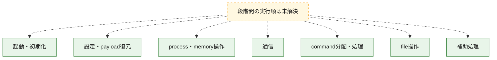
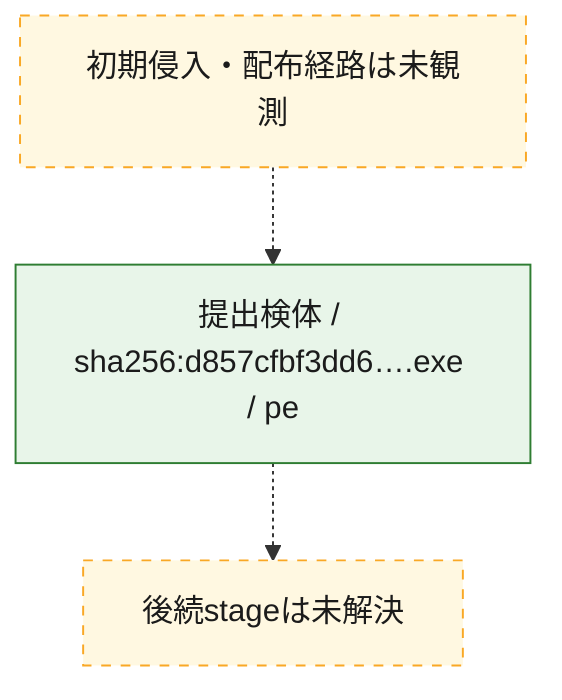
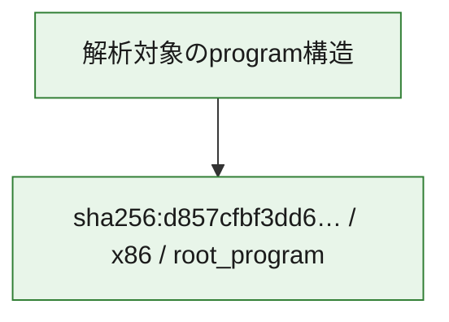

# 全体ロジック：d857cfbf3dd631c57c8334f813e5afedeeecc2931e8e145c001bc8403d27f6af

代表関数の静的証跡から、起動・初期化、設定・payload復元、process・memory操作、通信、command分配・処理、file操作の処理群を確認しました。

## 読み方

- phaseの掲載順は解析上の整理順です。observed_call_edgesがない段階間の実行順を断定しません。
- 図の実線は静的に観測した関係、点線と黄色のノードは未観測・未解決の関係を示します。
- 図は静的な要約であり、動的実行を再現するものではありません。
- 詳細な関数解説とfingerprintは[STATIC-LOGIC.md](STATIC-LOGIC.md)を参照してください。

## 静的可視化

### 実行フロー

### 感染チェーン

### モジュール関係

## 処理段階

### 1. 起動・初期化

entry pointから初期化と後続処理への移行を確認します。
確度: `confirmed_static_function_evidence`

- `d857cfbf3dd631c57c8334f813e5afedeeecc2931e8e145c001bc8403d27f6af:ghidra:00500b20` — 初期化と主要処理への分岐を行う入口関数です。 状態: `succeeded`、選定理由: `entry_point`, `meaningful_symbol_name`, `probable_go_main_user_code`, `reviewed_call_centrality:48`, `role:entrypoint`
- `d857cfbf3dd631c57c8334f813e5afedeeecc2931e8e145c001bc8403d27f6af:ghidra:00518de0` — 初期化と主要処理への分岐を行う入口関数です。 状態: `succeeded`、選定理由: `entry_point`, `meaningful_symbol_name`, `probable_go_main_user_code`, `reviewed_call_centrality:18`, `role:entrypoint`
- `d857cfbf3dd631c57c8334f813e5afedeeecc2931e8e145c001bc8403d27f6af:ghidra:0051bc00` — 初期化と主要処理への分岐を行う入口関数です。 状態: `succeeded`、選定理由: `entry_point`, `meaningful_symbol_name`, `probable_go_main_user_code`, `reviewed_call_centrality:17`, `role:entrypoint`
- `d857cfbf3dd631c57c8334f813e5afedeeecc2931e8e145c001bc8403d27f6af:ghidra:00520de0` — 初期化と主要処理への分岐を行う入口関数です。 状態: `succeeded`、選定理由: `entry_point`, `meaningful_symbol_name`, `probable_go_main_user_code`, `reviewed_call_centrality:19`, `role:entrypoint`
- `d857cfbf3dd631c57c8334f813e5afedeeecc2931e8e145c001bc8403d27f6af:ghidra:005229c0` — 初期化と主要処理への分岐を行う入口関数です。 状態: `succeeded`、選定理由: `entry_point`, `meaningful_symbol_name`, `probable_go_main_user_code`, `reviewed_call_centrality:21`, `role:entrypoint`
- `d857cfbf3dd631c57c8334f813e5afedeeecc2931e8e145c001bc8403d27f6af:ghidra:00525880` — 初期化と主要処理への分岐を行う入口関数です。 状態: `succeeded`、選定理由: `entry_point`, `meaningful_symbol_name`, `probable_go_main_user_code`, `reviewed_call_centrality:24`, `role:entrypoint`
- `d857cfbf3dd631c57c8334f813e5afedeeecc2931e8e145c001bc8403d27f6af:ghidra:0052b640` — 初期化と主要処理への分岐を行う入口関数です。 状態: `succeeded`、選定理由: `entry_point`, `meaningful_symbol_name`, `probable_go_main_user_code`, `reviewed_call_centrality:26`, `role:entrypoint`
- `d857cfbf3dd631c57c8334f813e5afedeeecc2931e8e145c001bc8403d27f6af:ghidra:00531440` — 初期化と主要処理への分岐を行う入口関数です。 状態: `succeeded`、選定理由: `entry_point`, `meaningful_symbol_name`, `probable_go_main_user_code`, `reviewed_call_centrality:21`, `role:entrypoint`
- `d857cfbf3dd631c57c8334f813e5afedeeecc2931e8e145c001bc8403d27f6af:ghidra:00535560` — 初期化と主要処理への分岐を行う入口関数です。 状態: `succeeded`、選定理由: `entry_point`, `meaningful_symbol_name`, `probable_go_main_user_code`, `reviewed_call_centrality:17`, `role:entrypoint`
- `d857cfbf3dd631c57c8334f813e5afedeeecc2931e8e145c001bc8403d27f6af:ghidra:005379c0` — 初期化と主要処理への分岐を行う入口関数です。 状態: `succeeded`、選定理由: `entry_point`, `meaningful_symbol_name`, `probable_go_main_user_code`, `reviewed_call_centrality:18`, `role:entrypoint`
- `d857cfbf3dd631c57c8334f813e5afedeeecc2931e8e145c001bc8403d27f6af:ghidra:0053b020` — 初期化と主要処理への分岐を行う入口関数です。 状態: `succeeded`、選定理由: `entry_point`, `meaningful_symbol_name`, `probable_go_main_user_code`, `reviewed_call_centrality:19`, `role:entrypoint`
- `d857cfbf3dd631c57c8334f813e5afedeeecc2931e8e145c001bc8403d27f6af:ghidra:0054a1e0` — 初期化と主要処理への分岐を行う入口関数です。 状態: `succeeded`、選定理由: `entry_point`, `meaningful_symbol_name`, `probable_go_main_user_code`, `reviewed_call_centrality:21`, `role:entrypoint`
- `d857cfbf3dd631c57c8334f813e5afedeeecc2931e8e145c001bc8403d27f6af:ghidra:005509c0` — 初期化と主要処理への分岐を行う入口関数です。 状態: `succeeded`、選定理由: `entry_point`, `meaningful_symbol_name`, `probable_go_main_user_code`, `reviewed_call_centrality:22`, `role:entrypoint`
- `d857cfbf3dd631c57c8334f813e5afedeeecc2931e8e145c001bc8403d27f6af:ghidra:00555520` — 初期化と主要処理への分岐を行う入口関数です。 状態: `succeeded`、選定理由: `entry_point`, `meaningful_symbol_name`, `probable_go_main_user_code`, `reviewed_call_centrality:17`, `role:entrypoint`
- `d857cfbf3dd631c57c8334f813e5afedeeecc2931e8e145c001bc8403d27f6af:ghidra:00559ec0` — 初期化と主要処理への分岐を行う入口関数です。 状態: `succeeded`、選定理由: `entry_point`, `meaningful_symbol_name`, `probable_go_main_user_code`, `reviewed_call_centrality:22`, `role:entrypoint`
- `d857cfbf3dd631c57c8334f813e5afedeeecc2931e8e145c001bc8403d27f6af:ghidra:0055df60` — 初期化と主要処理への分岐を行う入口関数です。 状態: `succeeded`、選定理由: `entry_point`, `meaningful_symbol_name`, `probable_go_main_user_code`, `reviewed_call_centrality:19`, `role:entrypoint`
- `d857cfbf3dd631c57c8334f813e5afedeeecc2931e8e145c001bc8403d27f6af:ghidra:005628c0` — 初期化と主要処理への分岐を行う入口関数です。 状態: `succeeded`、選定理由: `entry_point`, `meaningful_symbol_name`, `probable_go_main_user_code`, `reviewed_call_centrality:30`, `role:entrypoint`
- `d857cfbf3dd631c57c8334f813e5afedeeecc2931e8e145c001bc8403d27f6af:ghidra:0056e020` — 初期化と主要処理への分岐を行う入口関数です。 状態: `succeeded`、選定理由: `entry_point`, `meaningful_symbol_name`, `probable_go_main_user_code`, `reviewed_call_centrality:21`, `role:entrypoint`
- `d857cfbf3dd631c57c8334f813e5afedeeecc2931e8e145c001bc8403d27f6af:ghidra:0057a9e0` — 初期化と主要処理への分岐を行う入口関数です。 状態: `succeeded`、選定理由: `entry_point`, `meaningful_symbol_name`, `probable_go_main_user_code`, `reviewed_call_centrality:18`, `role:entrypoint`
- `d857cfbf3dd631c57c8334f813e5afedeeecc2931e8e145c001bc8403d27f6af:ghidra:0057ce40` — 初期化と主要処理への分岐を行う入口関数です。 状態: `succeeded`、選定理由: `entry_point`, `meaningful_symbol_name`, `probable_go_main_user_code`, `reviewed_call_centrality:18`, `role:entrypoint`
- `d857cfbf3dd631c57c8334f813e5afedeeecc2931e8e145c001bc8403d27f6af:ghidra:0057f260` — 初期化と主要処理への分岐を行う入口関数です。 状態: `succeeded`、選定理由: `entry_point`, `meaningful_symbol_name`, `probable_go_main_user_code`, `reviewed_call_centrality:19`, `role:entrypoint`
- `d857cfbf3dd631c57c8334f813e5afedeeecc2931e8e145c001bc8403d27f6af:ghidra:00582940` — 初期化と主要処理への分岐を行う入口関数です。 状態: `succeeded`、選定理由: `entry_point`, `meaningful_symbol_name`, `probable_go_main_user_code`, `reviewed_call_centrality:17`, `role:entrypoint`
- `d857cfbf3dd631c57c8334f813e5afedeeecc2931e8e145c001bc8403d27f6af:ghidra:00584d60` — 初期化と主要処理への分岐を行う入口関数です。 状態: `succeeded`、選定理由: `entry_point`, `meaningful_symbol_name`, `probable_go_main_user_code`, `reviewed_call_centrality:17`, `role:entrypoint`
- `d857cfbf3dd631c57c8334f813e5afedeeecc2931e8e145c001bc8403d27f6af:ghidra:00587a80` — 初期化と主要処理への分岐を行う入口関数です。 状態: `succeeded`、選定理由: `entry_point`, `meaningful_symbol_name`, `probable_go_main_user_code`, `reviewed_call_centrality:21`, `role:entrypoint`

### 2. 設定・payload復元

設定、resource、payload、暗号化データの復元・変換を確認します。
確度: `confirmed_static_function_evidence`

- `d857cfbf3dd631c57c8334f813e5afedeeecc2931e8e145c001bc8403d27f6af:ghidra:00470280` — 設定、resource、payloadなどの解析・変換を行う関数です。 状態: `succeeded`、選定理由: `meaningful_symbol_name`, `reviewed_call_centrality:4`, `role:config_or_data_transform`
- `d857cfbf3dd631c57c8334f813e5afedeeecc2931e8e145c001bc8403d27f6af:ghidra:0049b960` — 暗号、hash、encoding、または復号処理に関係する関数です。 状態: `succeeded`、選定理由: `meaningful_symbol_name`, `reviewed_call_centrality:8`, `role:cryptographic_transform`

### 3. process・memory操作

process、thread、module、memory操作と実行移行を確認します。
確度: `confirmed_static_function_evidence`

- `d857cfbf3dd631c57c8334f813e5afedeeecc2931e8e145c001bc8403d27f6af:ghidra:004693a0` — process、thread、module、またはmemory操作に関係する関数です。 状態: `succeeded`、選定理由: `meaningful_symbol_name`, `reviewed_call_centrality:2`, `role:process_or_memory_operation`

### 4. 通信

通信初期化、endpoint処理、送受信の役割を確認します。
確度: `confirmed_static_function_evidence`

- `d857cfbf3dd631c57c8334f813e5afedeeecc2931e8e145c001bc8403d27f6af:ghidra:004911a0` — 通信初期化、送受信、またはendpoint処理に関係する関数です。 状態: `succeeded`、選定理由: `meaningful_symbol_name`, `reviewed_call_centrality:8`, `role:network_communication`

### 5. command分配・処理

受信commandやtaskの解釈、分配、個別handlerへの移行を確認します。
確度: `confirmed_static_function_evidence`

- `d857cfbf3dd631c57c8334f813e5afedeeecc2931e8e145c001bc8403d27f6af:ghidra:004a3cc0` — commandの解釈、分配、または個別処理を担当する関数です。 状態: `succeeded`、選定理由: `meaningful_symbol_name`, `reviewed_call_centrality:5`, `role:command_dispatch_or_handler`

### 6. file操作

fileやdirectoryの作成、読書き、削除を確認します。
確度: `confirmed_static_function_evidence`

- `d857cfbf3dd631c57c8334f813e5afedeeecc2931e8e145c001bc8403d27f6af:ghidra:004a2700` — fileまたはdirectoryの読書き・管理に関係する関数です。 状態: `succeeded`、選定理由: `meaningful_symbol_name`, `reviewed_call_centrality:7`, `role:file_operation`

### 7. 補助処理

主要処理を支える一般内部関数またはlibrary処理を確認します。
確度: `confirmed_static_function_evidence`

- `d857cfbf3dd631c57c8334f813e5afedeeecc2931e8e145c001bc8403d27f6af:ghidra:00401080` — compiler生成処理または汎用library処理とみられる関数です。 状態: `succeeded`、選定理由: `meaningful_symbol_name`, `reviewed_call_centrality:10`
- `d857cfbf3dd631c57c8334f813e5afedeeecc2931e8e145c001bc8403d27f6af:ghidra:0045e220` — 検体内部の一般処理を実装する関数です。 状態: `succeeded`、選定理由: `meaningful_symbol_name`, `reviewed_call_centrality:4`

## 観測したcall関係

- `ghidra-function:06eb655f885e37b73ca8c013` → `ghidra-external:02ab776a2219e1ef86fb8123` （`unclassified` → `unclassified`）
- `ghidra-function:06eb655f885e37b73ca8c013` → `ghidra-external:1e6306bac169bf2f6878da30` （`unclassified` → `unclassified`）
- `ghidra-function:06eb655f885e37b73ca8c013` → `ghidra-external:265e24afa2150ed06b9d86d5` （`unclassified` → `unclassified`）
- `ghidra-function:06eb655f885e37b73ca8c013` → `ghidra-external:3b38ab4139b562dc23a04636` （`unclassified` → `unclassified`）
- `ghidra-function:06eb655f885e37b73ca8c013` → `ghidra-external:4ce9668a031ac6986e1816ec` （`unclassified` → `unclassified`）
- `ghidra-function:06eb655f885e37b73ca8c013` → `ghidra-external:5ded8a03f736ef3256a544b9` （`unclassified` → `unclassified`）
- `ghidra-function:06eb655f885e37b73ca8c013` → `ghidra-external:7e3bf814e6367b0cd12d0669` （`unclassified` → `unclassified`）
- `ghidra-function:06eb655f885e37b73ca8c013` → `ghidra-external:89c9b20ff3983c87e9c6dd13` （`unclassified` → `unclassified`）
- `ghidra-function:06eb655f885e37b73ca8c013` → `ghidra-external:985991b60d02d4372af547df` （`unclassified` → `unclassified`）
- `ghidra-function:06eb655f885e37b73ca8c013` → `ghidra-external:9cd8b2d5eaab0dee5f6d7147` （`unclassified` → `unclassified`）
- `ghidra-function:06eb655f885e37b73ca8c013` → `ghidra-external:a014a3a6d53a049de8bac58a` （`unclassified` → `unclassified`）
- `ghidra-function:06eb655f885e37b73ca8c013` → `ghidra-external:a56eac28562c444223ad8101` （`unclassified` → `unclassified`）
- `ghidra-function:06eb655f885e37b73ca8c013` → `ghidra-external:a5b51cc2656c687fe0978b27` （`unclassified` → `unclassified`）
- `ghidra-function:06eb655f885e37b73ca8c013` → `ghidra-external:bc3e20862f53cd218a7a0de2` （`unclassified` → `unclassified`）
- `ghidra-function:06eb655f885e37b73ca8c013` → `ghidra-external:bc6fd45fe80e414a42c8bb2b` （`unclassified` → `unclassified`）
- `ghidra-function:06eb655f885e37b73ca8c013` → `ghidra-external:be0705613146ff934f91d46e` （`unclassified` → `unclassified`）
- `ghidra-function:06eb655f885e37b73ca8c013` → `ghidra-external:d7b0a2f2c909b87ba97f66bc` （`unclassified` → `unclassified`）
- `ghidra-function:06eb655f885e37b73ca8c013` → `ghidra-external:e50043595168e82443a6d45a` （`unclassified` → `unclassified`）
- `ghidra-function:06eb655f885e37b73ca8c013` → `ghidra-external:efeb055cc57bdf39d834bcf5` （`unclassified` → `unclassified`）
- `ghidra-function:0893a40b7c3136be11d49552` → `ghidra-external:02ab776a2219e1ef86fb8123` （`unclassified` → `unclassified`）
- `ghidra-function:0893a40b7c3136be11d49552` → `ghidra-external:265e24afa2150ed06b9d86d5` （`unclassified` → `unclassified`）
- `ghidra-function:0893a40b7c3136be11d49552` → `ghidra-external:3a4a495a0e96072e8fbb94a0` （`unclassified` → `unclassified`）
- `ghidra-function:0893a40b7c3136be11d49552` → `ghidra-external:3b38ab4139b562dc23a04636` （`unclassified` → `unclassified`）
- `ghidra-function:0893a40b7c3136be11d49552` → `ghidra-external:4ce9668a031ac6986e1816ec` （`unclassified` → `unclassified`）
- `ghidra-function:0893a40b7c3136be11d49552` → `ghidra-external:5256d0ae7389e085c8d70ded` （`unclassified` → `unclassified`）
- `ghidra-function:0893a40b7c3136be11d49552` → `ghidra-external:5ded8a03f736ef3256a544b9` （`unclassified` → `unclassified`）
- `ghidra-function:0893a40b7c3136be11d49552` → `ghidra-external:7e3bf814e6367b0cd12d0669` （`unclassified` → `unclassified`）
- `ghidra-function:0893a40b7c3136be11d49552` → `ghidra-external:89c9b20ff3983c87e9c6dd13` （`unclassified` → `unclassified`）
- `ghidra-function:0893a40b7c3136be11d49552` → `ghidra-external:985991b60d02d4372af547df` （`unclassified` → `unclassified`）
- `ghidra-function:0893a40b7c3136be11d49552` → `ghidra-external:9cd8b2d5eaab0dee5f6d7147` （`unclassified` → `unclassified`）
- `ghidra-function:0893a40b7c3136be11d49552` → `ghidra-external:a56eac28562c444223ad8101` （`unclassified` → `unclassified`）
- `ghidra-function:0893a40b7c3136be11d49552` → `ghidra-external:b44c89599bd627ac2d4968f3` （`unclassified` → `unclassified`）
- `ghidra-function:0893a40b7c3136be11d49552` → `ghidra-external:bc3e20862f53cd218a7a0de2` （`unclassified` → `unclassified`）
- `ghidra-function:0893a40b7c3136be11d49552` → `ghidra-external:bc6fd45fe80e414a42c8bb2b` （`unclassified` → `unclassified`）
- `ghidra-function:0893a40b7c3136be11d49552` → `ghidra-external:be0705613146ff934f91d46e` （`unclassified` → `unclassified`）
- `ghidra-function:0893a40b7c3136be11d49552` → `ghidra-external:d7b0a2f2c909b87ba97f66bc` （`unclassified` → `unclassified`）
- `ghidra-function:0893a40b7c3136be11d49552` → `ghidra-external:e50043595168e82443a6d45a` （`unclassified` → `unclassified`）
- `ghidra-function:0893a40b7c3136be11d49552` → `ghidra-external:efeb055cc57bdf39d834bcf5` （`unclassified` → `unclassified`）
- `ghidra-function:0893a40b7c3136be11d49552` → `ghidra-external:f0ef2ed6d86394ac327176df` （`unclassified` → `unclassified`）
- `ghidra-function:0893a40b7c3136be11d49552` → `ghidra-external:fac40b5f8a217dbc633b9abe` （`unclassified` → `unclassified`）
- `ghidra-function:1be494ded35a9d1a8baff0c1` → `ghidra-external:265e24afa2150ed06b9d86d5` （`unclassified` → `unclassified`）
- `ghidra-function:1be494ded35a9d1a8baff0c1` → `ghidra-external:2bf0e779c6a2b4ffd2953556` （`unclassified` → `unclassified`）
- `ghidra-function:1be494ded35a9d1a8baff0c1` → `ghidra-external:5bb0fcc22c3424ab5dda2781` （`unclassified` → `unclassified`）
- `ghidra-function:1be494ded35a9d1a8baff0c1` → `ghidra-external:5d4ca5dd480a978614dd84d1` （`unclassified` → `unclassified`）
- `ghidra-function:1be494ded35a9d1a8baff0c1` → `ghidra-external:c77f5f2df5a634f8c7d0b177` （`unclassified` → `unclassified`）
- `ghidra-function:262bf5233bbaa4b06c0a2f6f` → `ghidra-external:02ab776a2219e1ef86fb8123` （`unclassified` → `unclassified`）
- `ghidra-function:262bf5233bbaa4b06c0a2f6f` → `ghidra-external:265e24afa2150ed06b9d86d5` （`unclassified` → `unclassified`）
- `ghidra-function:262bf5233bbaa4b06c0a2f6f` → `ghidra-external:3b38ab4139b562dc23a04636` （`unclassified` → `unclassified`）
- `ghidra-function:262bf5233bbaa4b06c0a2f6f` → `ghidra-external:4ce9668a031ac6986e1816ec` （`unclassified` → `unclassified`）
- `ghidra-function:262bf5233bbaa4b06c0a2f6f` → `ghidra-external:59409ee98cc7f5f7726152a0` （`unclassified` → `unclassified`）
- `ghidra-function:262bf5233bbaa4b06c0a2f6f` → `ghidra-external:5ded8a03f736ef3256a544b9` （`unclassified` → `unclassified`）
- `ghidra-function:262bf5233bbaa4b06c0a2f6f` → `ghidra-external:7e3bf814e6367b0cd12d0669` （`unclassified` → `unclassified`）
- `ghidra-function:262bf5233bbaa4b06c0a2f6f` → `ghidra-external:89c9b20ff3983c87e9c6dd13` （`unclassified` → `unclassified`）
- `ghidra-function:262bf5233bbaa4b06c0a2f6f` → `ghidra-external:985991b60d02d4372af547df` （`unclassified` → `unclassified`）
- `ghidra-function:262bf5233bbaa4b06c0a2f6f` → `ghidra-external:9cd8b2d5eaab0dee5f6d7147` （`unclassified` → `unclassified`）
- `ghidra-function:262bf5233bbaa4b06c0a2f6f` → `ghidra-external:a56eac28562c444223ad8101` （`unclassified` → `unclassified`）
- `ghidra-function:262bf5233bbaa4b06c0a2f6f` → `ghidra-external:bc3e20862f53cd218a7a0de2` （`unclassified` → `unclassified`）
- `ghidra-function:262bf5233bbaa4b06c0a2f6f` → `ghidra-external:bc6fd45fe80e414a42c8bb2b` （`unclassified` → `unclassified`）
- `ghidra-function:262bf5233bbaa4b06c0a2f6f` → `ghidra-external:be0705613146ff934f91d46e` （`unclassified` → `unclassified`）
- `ghidra-function:262bf5233bbaa4b06c0a2f6f` → `ghidra-external:d7b0a2f2c909b87ba97f66bc` （`unclassified` → `unclassified`）
- `ghidra-function:262bf5233bbaa4b06c0a2f6f` → `ghidra-external:e50043595168e82443a6d45a` （`unclassified` → `unclassified`）
- `ghidra-function:262bf5233bbaa4b06c0a2f6f` → `ghidra-external:efeb055cc57bdf39d834bcf5` （`unclassified` → `unclassified`）
- `ghidra-function:2e027bf44f54823e6ae4b935` → `ghidra-external:02ab776a2219e1ef86fb8123` （`unclassified` → `unclassified`）
- `ghidra-function:2e027bf44f54823e6ae4b935` → `ghidra-external:265e24afa2150ed06b9d86d5` （`unclassified` → `unclassified`）
- `ghidra-function:2e027bf44f54823e6ae4b935` → `ghidra-external:3b38ab4139b562dc23a04636` （`unclassified` → `unclassified`）
- `ghidra-function:2e027bf44f54823e6ae4b935` → `ghidra-external:47d1fb34314c231a78fb5674` （`unclassified` → `unclassified`）
- `ghidra-function:2e027bf44f54823e6ae4b935` → `ghidra-external:4c4722a9119ebb2d5efcd238` （`unclassified` → `unclassified`）
- `ghidra-function:2e027bf44f54823e6ae4b935` → `ghidra-external:4ce9668a031ac6986e1816ec` （`unclassified` → `unclassified`）
- `ghidra-function:2e027bf44f54823e6ae4b935` → `ghidra-external:5ded8a03f736ef3256a544b9` （`unclassified` → `unclassified`）
- `ghidra-function:2e027bf44f54823e6ae4b935` → `ghidra-external:7e3bf814e6367b0cd12d0669` （`unclassified` → `unclassified`）
- `ghidra-function:2e027bf44f54823e6ae4b935` → `ghidra-external:89c9b20ff3983c87e9c6dd13` （`unclassified` → `unclassified`）
- `ghidra-function:2e027bf44f54823e6ae4b935` → `ghidra-external:985991b60d02d4372af547df` （`unclassified` → `unclassified`）
- `ghidra-function:2e027bf44f54823e6ae4b935` → `ghidra-external:9cd8b2d5eaab0dee5f6d7147` （`unclassified` → `unclassified`）
- `ghidra-function:2e027bf44f54823e6ae4b935` → `ghidra-external:a56eac28562c444223ad8101` （`unclassified` → `unclassified`）
- `ghidra-function:2e027bf44f54823e6ae4b935` → `ghidra-external:b44c89599bd627ac2d4968f3` （`unclassified` → `unclassified`）
- `ghidra-function:2e027bf44f54823e6ae4b935` → `ghidra-external:bc3e20862f53cd218a7a0de2` （`unclassified` → `unclassified`）
- `ghidra-function:2e027bf44f54823e6ae4b935` → `ghidra-external:bc6fd45fe80e414a42c8bb2b` （`unclassified` → `unclassified`）
- `ghidra-function:2e027bf44f54823e6ae4b935` → `ghidra-external:be0705613146ff934f91d46e` （`unclassified` → `unclassified`）
- `ghidra-function:2e027bf44f54823e6ae4b935` → `ghidra-external:d01192472314bebc5284f0d4` （`unclassified` → `unclassified`）
- `ghidra-function:2e027bf44f54823e6ae4b935` → `ghidra-external:d7b0a2f2c909b87ba97f66bc` （`unclassified` → `unclassified`）
- `ghidra-function:2e027bf44f54823e6ae4b935` → `ghidra-external:d812210016b07371179f244d` （`unclassified` → `unclassified`）
- `ghidra-function:2e027bf44f54823e6ae4b935` → `ghidra-external:e50043595168e82443a6d45a` （`unclassified` → `unclassified`）
- `ghidra-function:2e027bf44f54823e6ae4b935` → `ghidra-external:efeb055cc57bdf39d834bcf5` （`unclassified` → `unclassified`）
- `ghidra-function:2e027bf44f54823e6ae4b935` → `ghidra-external:fa7230ed465283b1cb761565` （`unclassified` → `unclassified`）
- `ghidra-function:300a49ae4c7d67b20dbf5af9` → `ghidra-external:02ab776a2219e1ef86fb8123` （`unclassified` → `unclassified`）
- `ghidra-function:300a49ae4c7d67b20dbf5af9` → `ghidra-external:265e24afa2150ed06b9d86d5` （`unclassified` → `unclassified`）
- `ghidra-function:300a49ae4c7d67b20dbf5af9` → `ghidra-external:372f3d38353b0daab31656be` （`unclassified` → `unclassified`）
- `ghidra-function:300a49ae4c7d67b20dbf5af9` → `ghidra-external:3b38ab4139b562dc23a04636` （`unclassified` → `unclassified`）
- `ghidra-function:300a49ae4c7d67b20dbf5af9` → `ghidra-external:4ce9668a031ac6986e1816ec` （`unclassified` → `unclassified`）
- `ghidra-function:300a49ae4c7d67b20dbf5af9` → `ghidra-external:5ded8a03f736ef3256a544b9` （`unclassified` → `unclassified`）
- `ghidra-function:300a49ae4c7d67b20dbf5af9` → `ghidra-external:7e3bf814e6367b0cd12d0669` （`unclassified` → `unclassified`）
- `ghidra-function:300a49ae4c7d67b20dbf5af9` → `ghidra-external:8651c0356b768b74030cff60` （`unclassified` → `unclassified`）
- `ghidra-function:300a49ae4c7d67b20dbf5af9` → `ghidra-external:89c9b20ff3983c87e9c6dd13` （`unclassified` → `unclassified`）
- `ghidra-function:300a49ae4c7d67b20dbf5af9` → `ghidra-external:985991b60d02d4372af547df` （`unclassified` → `unclassified`）
- `ghidra-function:300a49ae4c7d67b20dbf5af9` → `ghidra-external:9cd8b2d5eaab0dee5f6d7147` （`unclassified` → `unclassified`）
- `ghidra-function:300a49ae4c7d67b20dbf5af9` → `ghidra-external:a56eac28562c444223ad8101` （`unclassified` → `unclassified`）
- `ghidra-function:300a49ae4c7d67b20dbf5af9` → `ghidra-external:bc3e20862f53cd218a7a0de2` （`unclassified` → `unclassified`）
- `ghidra-function:300a49ae4c7d67b20dbf5af9` → `ghidra-external:bc6fd45fe80e414a42c8bb2b` （`unclassified` → `unclassified`）
- `ghidra-function:300a49ae4c7d67b20dbf5af9` → `ghidra-external:be0705613146ff934f91d46e` （`unclassified` → `unclassified`）
- `ghidra-function:300a49ae4c7d67b20dbf5af9` → `ghidra-external:d7b0a2f2c909b87ba97f66bc` （`unclassified` → `unclassified`）
- `ghidra-function:300a49ae4c7d67b20dbf5af9` → `ghidra-external:e4aeda9bad0318e2144f2861` （`unclassified` → `unclassified`）
- `ghidra-function:300a49ae4c7d67b20dbf5af9` → `ghidra-external:e50043595168e82443a6d45a` （`unclassified` → `unclassified`）
- `ghidra-function:300a49ae4c7d67b20dbf5af9` → `ghidra-external:efeb055cc57bdf39d834bcf5` （`unclassified` → `unclassified`）
- `ghidra-function:313418112269881e04ec28b8` → `ghidra-external:02ab776a2219e1ef86fb8123` （`unclassified` → `unclassified`）
- `ghidra-function:313418112269881e04ec28b8` → `ghidra-external:265e24afa2150ed06b9d86d5` （`unclassified` → `unclassified`）
- `ghidra-function:313418112269881e04ec28b8` → `ghidra-external:3b38ab4139b562dc23a04636` （`unclassified` → `unclassified`）
- `ghidra-function:313418112269881e04ec28b8` → `ghidra-external:4ce9668a031ac6986e1816ec` （`unclassified` → `unclassified`）
- `ghidra-function:313418112269881e04ec28b8` → `ghidra-external:5ded8a03f736ef3256a544b9` （`unclassified` → `unclassified`）
- `ghidra-function:313418112269881e04ec28b8` → `ghidra-external:7e3bf814e6367b0cd12d0669` （`unclassified` → `unclassified`）
- `ghidra-function:313418112269881e04ec28b8` → `ghidra-external:89c9b20ff3983c87e9c6dd13` （`unclassified` → `unclassified`）
- `ghidra-function:313418112269881e04ec28b8` → `ghidra-external:978eb8c7bad587b09dc55206` （`unclassified` → `unclassified`）
- `ghidra-function:313418112269881e04ec28b8` → `ghidra-external:985991b60d02d4372af547df` （`unclassified` → `unclassified`）
- `ghidra-function:313418112269881e04ec28b8` → `ghidra-external:9cd8b2d5eaab0dee5f6d7147` （`unclassified` → `unclassified`）
- `ghidra-function:313418112269881e04ec28b8` → `ghidra-external:a56eac28562c444223ad8101` （`unclassified` → `unclassified`）
- `ghidra-function:313418112269881e04ec28b8` → `ghidra-external:bc3e20862f53cd218a7a0de2` （`unclassified` → `unclassified`）
- `ghidra-function:313418112269881e04ec28b8` → `ghidra-external:bc6fd45fe80e414a42c8bb2b` （`unclassified` → `unclassified`）
- `ghidra-function:313418112269881e04ec28b8` → `ghidra-external:be0705613146ff934f91d46e` （`unclassified` → `unclassified`）
- `ghidra-function:313418112269881e04ec28b8` → `ghidra-external:d7b0a2f2c909b87ba97f66bc` （`unclassified` → `unclassified`）
- `ghidra-function:313418112269881e04ec28b8` → `ghidra-external:e50043595168e82443a6d45a` （`unclassified` → `unclassified`）
- `ghidra-function:313418112269881e04ec28b8` → `ghidra-external:efeb055cc57bdf39d834bcf5` （`unclassified` → `unclassified`）
- `ghidra-function:3f1a7e351ee87544e3f9692d` → `ghidra-external:02ab776a2219e1ef86fb8123` （`unclassified` → `unclassified`）
- `ghidra-function:3f1a7e351ee87544e3f9692d` → `ghidra-external:265e24afa2150ed06b9d86d5` （`unclassified` → `unclassified`）
- `ghidra-function:3f1a7e351ee87544e3f9692d` → `ghidra-external:3b38ab4139b562dc23a04636` （`unclassified` → `unclassified`）
- `ghidra-function:3f1a7e351ee87544e3f9692d` → `ghidra-external:3c287e6a8dbc958803412299` （`unclassified` → `unclassified`）
- `ghidra-function:3f1a7e351ee87544e3f9692d` → `ghidra-external:4ce9668a031ac6986e1816ec` （`unclassified` → `unclassified`）
- `ghidra-function:3f1a7e351ee87544e3f9692d` → `ghidra-external:5ded8a03f736ef3256a544b9` （`unclassified` → `unclassified`）
- `ghidra-function:3f1a7e351ee87544e3f9692d` → `ghidra-external:7e3bf814e6367b0cd12d0669` （`unclassified` → `unclassified`）
- `ghidra-function:3f1a7e351ee87544e3f9692d` → `ghidra-external:89c9b20ff3983c87e9c6dd13` （`unclassified` → `unclassified`）
- `ghidra-function:3f1a7e351ee87544e3f9692d` → `ghidra-external:985991b60d02d4372af547df` （`unclassified` → `unclassified`）
- `ghidra-function:3f1a7e351ee87544e3f9692d` → `ghidra-external:9cd8b2d5eaab0dee5f6d7147` （`unclassified` → `unclassified`）
- `ghidra-function:3f1a7e351ee87544e3f9692d` → `ghidra-external:a56eac28562c444223ad8101` （`unclassified` → `unclassified`）
- `ghidra-function:3f1a7e351ee87544e3f9692d` → `ghidra-external:bc3e20862f53cd218a7a0de2` （`unclassified` → `unclassified`）
- `ghidra-function:3f1a7e351ee87544e3f9692d` → `ghidra-external:bc6fd45fe80e414a42c8bb2b` （`unclassified` → `unclassified`）
- `ghidra-function:3f1a7e351ee87544e3f9692d` → `ghidra-external:be0705613146ff934f91d46e` （`unclassified` → `unclassified`）
- `ghidra-function:3f1a7e351ee87544e3f9692d` → `ghidra-external:d4ee0c183227b11a348b8118` （`unclassified` → `unclassified`）
- `ghidra-function:3f1a7e351ee87544e3f9692d` → `ghidra-external:d7b0a2f2c909b87ba97f66bc` （`unclassified` → `unclassified`）
- `ghidra-function:3f1a7e351ee87544e3f9692d` → `ghidra-external:e50043595168e82443a6d45a` （`unclassified` → `unclassified`）
- `ghidra-function:3f1a7e351ee87544e3f9692d` → `ghidra-external:efeb055cc57bdf39d834bcf5` （`unclassified` → `unclassified`）
- `ghidra-function:484ee12647cd8f5ca855b05a` → `ghidra-external:02ab776a2219e1ef86fb8123` （`unclassified` → `unclassified`）
- `ghidra-function:484ee12647cd8f5ca855b05a` → `ghidra-external:065603a295f2812b8c03a41d` （`unclassified` → `unclassified`）
- `ghidra-function:484ee12647cd8f5ca855b05a` → `ghidra-external:265e24afa2150ed06b9d86d5` （`unclassified` → `unclassified`）
- `ghidra-function:484ee12647cd8f5ca855b05a` → `ghidra-external:3b38ab4139b562dc23a04636` （`unclassified` → `unclassified`）
- `ghidra-function:484ee12647cd8f5ca855b05a` → `ghidra-external:47d1fb34314c231a78fb5674` （`unclassified` → `unclassified`）
- `ghidra-function:484ee12647cd8f5ca855b05a` → `ghidra-external:4ce9668a031ac6986e1816ec` （`unclassified` → `unclassified`）
- `ghidra-function:484ee12647cd8f5ca855b05a` → `ghidra-external:5ded8a03f736ef3256a544b9` （`unclassified` → `unclassified`）
- `ghidra-function:484ee12647cd8f5ca855b05a` → `ghidra-external:76f39049e78fef7550856fc4` （`unclassified` → `unclassified`）
- `ghidra-function:484ee12647cd8f5ca855b05a` → `ghidra-external:7750d3143439e5b1c8a485c1` （`unclassified` → `unclassified`）
- `ghidra-function:484ee12647cd8f5ca855b05a` → `ghidra-external:7e3bf814e6367b0cd12d0669` （`unclassified` → `unclassified`）
- `ghidra-function:484ee12647cd8f5ca855b05a` → `ghidra-external:82c0a0c04c3269d70a795faf` （`unclassified` → `unclassified`）
- `ghidra-function:484ee12647cd8f5ca855b05a` → `ghidra-external:8651c0356b768b74030cff60` （`unclassified` → `unclassified`）
- `ghidra-function:484ee12647cd8f5ca855b05a` → `ghidra-external:89c9b20ff3983c87e9c6dd13` （`unclassified` → `unclassified`）
- `ghidra-function:484ee12647cd8f5ca855b05a` → `ghidra-external:8a79c6609ad95acd6fb5d2ae` （`unclassified` → `unclassified`）
- `ghidra-function:484ee12647cd8f5ca855b05a` → `ghidra-external:985991b60d02d4372af547df` （`unclassified` → `unclassified`）
- `ghidra-function:484ee12647cd8f5ca855b05a` → `ghidra-external:9cd8b2d5eaab0dee5f6d7147` （`unclassified` → `unclassified`）
- `ghidra-function:484ee12647cd8f5ca855b05a` → `ghidra-external:a014a3a6d53a049de8bac58a` （`unclassified` → `unclassified`）
- `ghidra-function:484ee12647cd8f5ca855b05a` → `ghidra-external:a56eac28562c444223ad8101` （`unclassified` → `unclassified`）
- `ghidra-function:484ee12647cd8f5ca855b05a` → `ghidra-external:bc3e20862f53cd218a7a0de2` （`unclassified` → `unclassified`）
- `ghidra-function:484ee12647cd8f5ca855b05a` → `ghidra-external:bc6fd45fe80e414a42c8bb2b` （`unclassified` → `unclassified`）
- `ghidra-function:484ee12647cd8f5ca855b05a` → `ghidra-external:be0705613146ff934f91d46e` （`unclassified` → `unclassified`）
- `ghidra-function:484ee12647cd8f5ca855b05a` → `ghidra-external:c2807353f1470a04dc47ef94` （`unclassified` → `unclassified`）
- `ghidra-function:484ee12647cd8f5ca855b05a` → `ghidra-external:d7b0a2f2c909b87ba97f66bc` （`unclassified` → `unclassified`）
- `ghidra-function:484ee12647cd8f5ca855b05a` → `ghidra-external:e50043595168e82443a6d45a` （`unclassified` → `unclassified`）
- `ghidra-function:484ee12647cd8f5ca855b05a` → `ghidra-external:ea98ba84eca5c48237aba0e5` （`unclassified` → `unclassified`）
- `ghidra-function:484ee12647cd8f5ca855b05a` → `ghidra-external:efeb055cc57bdf39d834bcf5` （`unclassified` → `unclassified`）
- `ghidra-function:49a2008b194ac2114260f27b` → `ghidra-external:503c99bfcf69efb159b92161` （`unclassified` → `unclassified`）
- `ghidra-function:49a2008b194ac2114260f27b` → `ghidra-external:f10d864f932ba3607e9709f2` （`unclassified` → `unclassified`）
- `ghidra-function:4dcce3915b3962cdb768cab0` → `ghidra-external:20c4f221bd6eabaaa799a534` （`unclassified` → `unclassified`）
- `ghidra-function:4dcce3915b3962cdb768cab0` → `ghidra-external:265e24afa2150ed06b9d86d5` （`unclassified` → `unclassified`）
- `ghidra-function:4dcce3915b3962cdb768cab0` → `ghidra-external:57a54333247e6f92a6f061e0` （`unclassified` → `unclassified`）
- `ghidra-function:4dcce3915b3962cdb768cab0` → `ghidra-external:614b7293b5ba794c2f4b379f` （`unclassified` → `unclassified`）
- `ghidra-function:4dcce3915b3962cdb768cab0` → `ghidra-external:736cc42ab09a1d53e3907c7c` （`unclassified` → `unclassified`）
- `ghidra-function:4dcce3915b3962cdb768cab0` → `ghidra-external:d536b7d945ec24635550ce4a` （`unclassified` → `unclassified`）
- `ghidra-function:4dcce3915b3962cdb768cab0` → `ghidra-external:ee2a4faa618d1ad4f70a4e37` （`unclassified` → `unclassified`）
- `ghidra-function:4ebb9fe330d6aa29509e0922` → `ghidra-external:02ab776a2219e1ef86fb8123` （`unclassified` → `unclassified`）
- `ghidra-function:4ebb9fe330d6aa29509e0922` → `ghidra-external:18149b196f4110556f695b4c` （`unclassified` → `unclassified`）
- `ghidra-function:4ebb9fe330d6aa29509e0922` → `ghidra-external:265e24afa2150ed06b9d86d5` （`unclassified` → `unclassified`）
- `ghidra-function:4ebb9fe330d6aa29509e0922` → `ghidra-external:372f3d38353b0daab31656be` （`unclassified` → `unclassified`）
- `ghidra-function:4ebb9fe330d6aa29509e0922` → `ghidra-external:3b38ab4139b562dc23a04636` （`unclassified` → `unclassified`）
- `ghidra-function:4ebb9fe330d6aa29509e0922` → `ghidra-external:4ce9668a031ac6986e1816ec` （`unclassified` → `unclassified`）
- `ghidra-function:4ebb9fe330d6aa29509e0922` → `ghidra-external:5ded8a03f736ef3256a544b9` （`unclassified` → `unclassified`）
- `ghidra-function:4ebb9fe330d6aa29509e0922` → `ghidra-external:7e3bf814e6367b0cd12d0669` （`unclassified` → `unclassified`）
- `ghidra-function:4ebb9fe330d6aa29509e0922` → `ghidra-external:89c9b20ff3983c87e9c6dd13` （`unclassified` → `unclassified`）
- `ghidra-function:4ebb9fe330d6aa29509e0922` → `ghidra-external:985991b60d02d4372af547df` （`unclassified` → `unclassified`）
- `ghidra-function:4ebb9fe330d6aa29509e0922` → `ghidra-external:9cd8b2d5eaab0dee5f6d7147` （`unclassified` → `unclassified`）
- `ghidra-function:4ebb9fe330d6aa29509e0922` → `ghidra-external:a56eac28562c444223ad8101` （`unclassified` → `unclassified`）
- `ghidra-function:4ebb9fe330d6aa29509e0922` → `ghidra-external:bc3e20862f53cd218a7a0de2` （`unclassified` → `unclassified`）
- `ghidra-function:4ebb9fe330d6aa29509e0922` → `ghidra-external:bc6fd45fe80e414a42c8bb2b` （`unclassified` → `unclassified`）
- `ghidra-function:4ebb9fe330d6aa29509e0922` → `ghidra-external:be0705613146ff934f91d46e` （`unclassified` → `unclassified`）
- `ghidra-function:4ebb9fe330d6aa29509e0922` → `ghidra-external:d7b0a2f2c909b87ba97f66bc` （`unclassified` → `unclassified`）
- `ghidra-function:4ebb9fe330d6aa29509e0922` → `ghidra-external:e50043595168e82443a6d45a` （`unclassified` → `unclassified`）
- `ghidra-function:4ebb9fe330d6aa29509e0922` → `ghidra-external:efeb055cc57bdf39d834bcf5` （`unclassified` → `unclassified`）
- `ghidra-function:520a5bb4c508e1cda10c0812` → `ghidra-external:02ab776a2219e1ef86fb8123` （`unclassified` → `unclassified`）
- `ghidra-function:520a5bb4c508e1cda10c0812` → `ghidra-external:265e24afa2150ed06b9d86d5` （`unclassified` → `unclassified`）
- `ghidra-function:520a5bb4c508e1cda10c0812` → `ghidra-external:2beaf6d6eaaf6dcfc43f767a` （`unclassified` → `unclassified`）
- `ghidra-function:520a5bb4c508e1cda10c0812` → `ghidra-external:372f3d38353b0daab31656be` （`unclassified` → `unclassified`）
- `ghidra-function:520a5bb4c508e1cda10c0812` → `ghidra-external:3b38ab4139b562dc23a04636` （`unclassified` → `unclassified`）
- `ghidra-function:520a5bb4c508e1cda10c0812` → `ghidra-external:4ce9668a031ac6986e1816ec` （`unclassified` → `unclassified`）
- `ghidra-function:520a5bb4c508e1cda10c0812` → `ghidra-external:5ded8a03f736ef3256a544b9` （`unclassified` → `unclassified`）
- `ghidra-function:520a5bb4c508e1cda10c0812` → `ghidra-external:76f39049e78fef7550856fc4` （`unclassified` → `unclassified`）
- `ghidra-function:520a5bb4c508e1cda10c0812` → `ghidra-external:7e3bf814e6367b0cd12d0669` （`unclassified` → `unclassified`）
- 残り358件は`static-logic.json`に記録しています。

## 解析範囲と制約

- 選定外関数は全体inventoryへ残しますが、関数本体の個別解説対象にはしていません。
- indirect call、難読化、packer、VM、壊れたcontrol flowによりcall関係が欠落する場合があります。
- 文書は静的解析に基づき、検体実行や外部通信による動的確認は行っていません。
