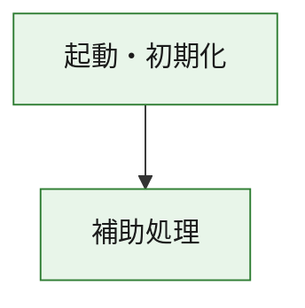
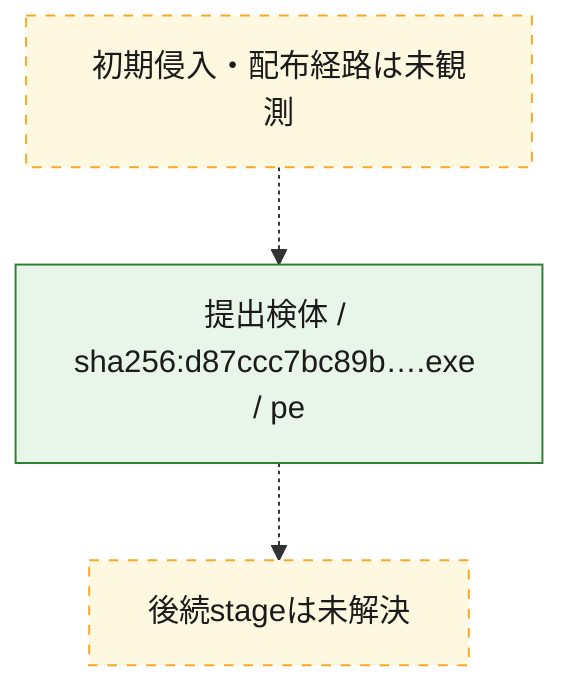
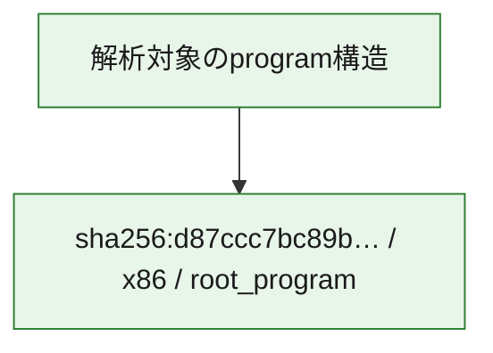

# 全体ロジック：d87ccc7bc89b989d96a212b7829f33853c8f187e35bf2f58be7b6f5089a8d24a

代表関数の静的証跡から、起動・初期化の処理群を確認しました。

## 読み方

- phaseの掲載順は解析上の整理順です。observed_call_edgesがない段階間の実行順を断定しません。
- 図の実線は静的に観測した関係、点線と黄色のノードは未観測・未解決の関係を示します。
- 図は静的な要約であり、動的実行を再現するものではありません。
- 詳細な関数解説とfingerprintは[STATIC-LOGIC.md](STATIC-LOGIC.md)を参照してください。

## 静的可視化

### 実行フロー

### 感染チェーン

### モジュール関係

## 処理段階

### 1. 起動・初期化

entry pointから初期化と後続処理への移行を確認します。
確度: `confirmed_static_function_evidence`

- `d87ccc7bc89b989d96a212b7829f33853c8f187e35bf2f58be7b6f5089a8d24a:ghidra:180001010` — 初期化と主要処理への分岐を行う入口関数です。 状態: `succeeded`、選定理由: `entry_point`, `meaningful_symbol_name`, `reviewed_call_centrality:22`, `role:entrypoint`, `small_program_complete_context`

### 2. 補助処理

主要処理を支える一般内部関数またはlibrary処理を確認します。
確度: `confirmed_static_function_evidence`

- `d87ccc7bc89b989d96a212b7829f33853c8f187e35bf2f58be7b6f5089a8d24a:ghidra:180001240` — 検体内部の一般処理を実装する関数です。 状態: `succeeded`、選定理由: `context_representative`, `reviewed_call_centrality:2`, `small_program_complete_context`
- `d87ccc7bc89b989d96a212b7829f33853c8f187e35bf2f58be7b6f5089a8d24a:ghidra:180001350` — 検体内部の一般処理を実装する関数です。 状態: `succeeded`、選定理由: `context_representative`, `reviewed_call_centrality:25`, `small_program_complete_context`
- `d87ccc7bc89b989d96a212b7829f33853c8f187e35bf2f58be7b6f5089a8d24a:ghidra:180003780` — 検体内部の一般処理を実装する関数です。 状態: `succeeded`、選定理由: `context_representative`, `reviewed_call_centrality:2`, `small_program_complete_context`
- `d87ccc7bc89b989d96a212b7829f33853c8f187e35bf2f58be7b6f5089a8d24a:ghidra:1800038e0` — 検体内部の一般処理を実装する関数です。 状態: `succeeded`、選定理由: `context_representative`, `reviewed_call_centrality:2`, `small_program_complete_context`

## 観測したcall関係

- `d87ccc7bc89b989d96a212b7829f33853c8f187e35bf2f58be7b6f5089a8d24a:ghidra:180001010` → `d87ccc7bc89b989d96a212b7829f33853c8f187e35bf2f58be7b6f5089a8d24a:ghidra:180001240` （`startup` → `support`）
- `d87ccc7bc89b989d96a212b7829f33853c8f187e35bf2f58be7b6f5089a8d24a:ghidra:180001010` → `d87ccc7bc89b989d96a212b7829f33853c8f187e35bf2f58be7b6f5089a8d24a:ghidra:180001350` （`startup` → `support`）
- `d87ccc7bc89b989d96a212b7829f33853c8f187e35bf2f58be7b6f5089a8d24a:ghidra:180001350` → `d87ccc7bc89b989d96a212b7829f33853c8f187e35bf2f58be7b6f5089a8d24a:ghidra:180001240` （`support` → `support`）
- `d87ccc7bc89b989d96a212b7829f33853c8f187e35bf2f58be7b6f5089a8d24a:ghidra:180001350` → `d87ccc7bc89b989d96a212b7829f33853c8f187e35bf2f58be7b6f5089a8d24a:ghidra:180003780` （`support` → `support`）
- `d87ccc7bc89b989d96a212b7829f33853c8f187e35bf2f58be7b6f5089a8d24a:ghidra:180001350` → `d87ccc7bc89b989d96a212b7829f33853c8f187e35bf2f58be7b6f5089a8d24a:ghidra:1800038e0` （`support` → `support`）
- `d87ccc7bc89b989d96a212b7829f33853c8f187e35bf2f58be7b6f5089a8d24a:ghidra:180003780` → `d87ccc7bc89b989d96a212b7829f33853c8f187e35bf2f58be7b6f5089a8d24a:ghidra:1800038e0` （`support` → `support`）
- `ghidra-function:0c267ba059c035e425b9df15` → `ghidra-external:0442ea667b1b7af3cb73260a` （`unclassified` → `unclassified`）
- `ghidra-function:0c267ba059c035e425b9df15` → `ghidra-external:05b99e41c4a09c3d1fa8c792` （`unclassified` → `unclassified`）
- `ghidra-function:0c267ba059c035e425b9df15` → `ghidra-external:06d90389f8183b1d6c6f066b` （`unclassified` → `unclassified`）
- `ghidra-function:0c267ba059c035e425b9df15` → `ghidra-external:11b130a0986639ce6c1c6d27` （`unclassified` → `unclassified`）
- `ghidra-function:0c267ba059c035e425b9df15` → `ghidra-external:1689cbe5df08fdbc8b774d31` （`unclassified` → `unclassified`）
- `ghidra-function:0c267ba059c035e425b9df15` → `ghidra-external:1e9b239d8fe4aaef3bee809f` （`unclassified` → `unclassified`）
- `ghidra-function:0c267ba059c035e425b9df15` → `ghidra-external:2329480eb0b743909c93796f` （`unclassified` → `unclassified`）
- `ghidra-function:0c267ba059c035e425b9df15` → `ghidra-external:3b5697b11bded86920366924` （`unclassified` → `unclassified`）
- `ghidra-function:0c267ba059c035e425b9df15` → `ghidra-external:3f2de75a51b8c39ecb2504e9` （`unclassified` → `unclassified`）
- `ghidra-function:0c267ba059c035e425b9df15` → `ghidra-external:458a64cde654b8d166d13fca` （`unclassified` → `unclassified`）
- `ghidra-function:0c267ba059c035e425b9df15` → `ghidra-external:5a266d5635c2aab9baf0bae4` （`unclassified` → `unclassified`）
- `ghidra-function:0c267ba059c035e425b9df15` → `ghidra-external:68108084e74a3f3368fc7704` （`unclassified` → `unclassified`）
- `ghidra-function:0c267ba059c035e425b9df15` → `ghidra-external:716512ba8ba42b501bc8ea58` （`unclassified` → `unclassified`）
- `ghidra-function:0c267ba059c035e425b9df15` → `ghidra-external:7c73d54c4c1efe9135401149` （`unclassified` → `unclassified`）
- `ghidra-function:0c267ba059c035e425b9df15` → `ghidra-external:7ec4cdd3756fbb628e149a83` （`unclassified` → `unclassified`）
- `ghidra-function:0c267ba059c035e425b9df15` → `ghidra-external:8314ab0549f2af33a951f455` （`unclassified` → `unclassified`）
- `ghidra-function:0c267ba059c035e425b9df15` → `ghidra-external:98875290b3e9ee718d114368` （`unclassified` → `unclassified`）
- `ghidra-function:0c267ba059c035e425b9df15` → `ghidra-external:a6ffdde301792cae78544a35` （`unclassified` → `unclassified`）
- `ghidra-function:0c267ba059c035e425b9df15` → `ghidra-external:b347c8327856702c0aa7cc95` （`unclassified` → `unclassified`）
- `ghidra-function:0c267ba059c035e425b9df15` → `ghidra-external:c19ae2d96fbbd1d47a899201` （`unclassified` → `unclassified`）
- `ghidra-function:0c267ba059c035e425b9df15` → `ghidra-external:f6da0fae4cd002ad4490ee57` （`unclassified` → `unclassified`）
- `ghidra-function:0c267ba059c035e425b9df15` → `ghidra-function:031afd9ee02008d9c9951f61` （`unclassified` → `unclassified`）
- `ghidra-function:0c267ba059c035e425b9df15` → `ghidra-function:88a37b1952e23c6302a6bba5` （`unclassified` → `unclassified`）
- `ghidra-function:0c267ba059c035e425b9df15` → `ghidra-function:a73bf0a4b47cd3758f046438` （`unclassified` → `unclassified`）
- `ghidra-function:20a0186f356d6dc0162437b4` → `ghidra-function:0c267ba059c035e425b9df15` （`unclassified` → `unclassified`）
- `ghidra-function:20a0186f356d6dc0162437b4` → `ghidra-function:0dc73d8b1d8ea45baf1636f4` （`unclassified` → `unclassified`）
- `ghidra-function:20a0186f356d6dc0162437b4` → `ghidra-function:15ece832e8c3180c2201eea4` （`unclassified` → `unclassified`）
- `ghidra-function:20a0186f356d6dc0162437b4` → `ghidra-function:22321568a6245e1bf775d050` （`unclassified` → `unclassified`）
- `ghidra-function:20a0186f356d6dc0162437b4` → `ghidra-function:373f40f669271af94349d6b1` （`unclassified` → `unclassified`）
- `ghidra-function:20a0186f356d6dc0162437b4` → `ghidra-function:3a42de00f0a6ca546acbf7e2` （`unclassified` → `unclassified`）
- `ghidra-function:20a0186f356d6dc0162437b4` → `ghidra-function:66deb0496720e83daed8c10c` （`unclassified` → `unclassified`）
- `ghidra-function:20a0186f356d6dc0162437b4` → `ghidra-function:7659268f6c48117791915d4e` （`unclassified` → `unclassified`）
- `ghidra-function:20a0186f356d6dc0162437b4` → `ghidra-function:a73bf0a4b47cd3758f046438` （`unclassified` → `unclassified`）
- `ghidra-function:20a0186f356d6dc0162437b4` → `ghidra-function:d41eee5476da68a1c07ee834` （`unclassified` → `unclassified`）
- `ghidra-function:20a0186f356d6dc0162437b4` → `ghidra-function:fa992a2ee3416e28652fd406` （`unclassified` → `unclassified`）
- `ghidra-function:20a0186f356d6dc0162437b4` → `ghidra-function:fb2b2e9a8f01b9322f1bb39e` （`unclassified` → `unclassified`）
- `ghidra-function:88a37b1952e23c6302a6bba5` → `ghidra-function:031afd9ee02008d9c9951f61` （`unclassified` → `unclassified`）

## 解析範囲と制約

- 選定外関数は全体inventoryへ残しますが、関数本体の個別解説対象にはしていません。
- indirect call、難読化、packer、VM、壊れたcontrol flowによりcall関係が欠落する場合があります。
- 文書は静的解析に基づき、検体実行や外部通信による動的確認は行っていません。
