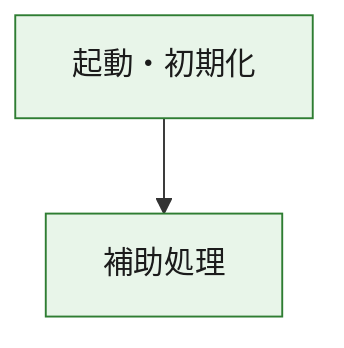
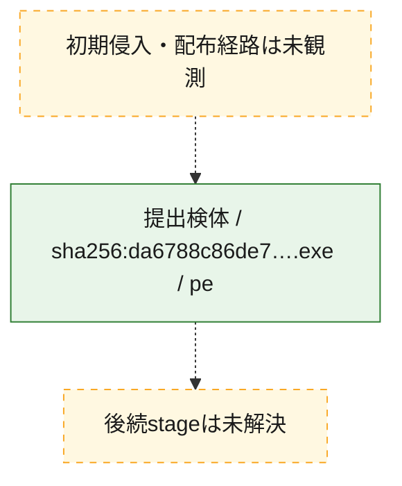
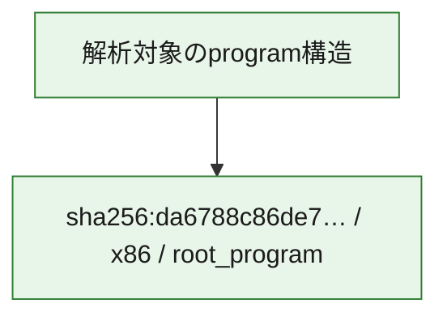

# 全体ロジック：da6788c86de7e6e6406daa84625566fb41c62658641993c00194e84654c61264

代表関数の静的証跡から、起動・初期化の処理群を確認しました。

## 読み方

- phaseの掲載順は解析上の整理順です。observed_call_edgesがない段階間の実行順を断定しません。
- 図の実線は静的に観測した関係、点線と黄色のノードは未観測・未解決の関係を示します。
- 図は静的な要約であり、動的実行を再現するものではありません。
- 詳細な関数解説とfingerprintは[STATIC-LOGIC.md](STATIC-LOGIC.md)を参照してください。

## 静的可視化

### 実行フロー

### 感染チェーン

### モジュール関係

## 処理段階

### 1. 起動・初期化

entry pointから初期化と後続処理への移行を確認します。
確度: `confirmed_static_function_evidence`

- `da6788c86de7e6e6406daa84625566fb41c62658641993c00194e84654c61264:ghidra:180001010` — 初期化と主要処理への分岐を行う入口関数です。 状態: `succeeded`、選定理由: `entry_point`, `meaningful_symbol_name`, `reviewed_call_centrality:22`, `role:entrypoint`, `small_program_complete_context`

### 2. 補助処理

主要処理を支える一般内部関数またはlibrary処理を確認します。
確度: `confirmed_static_function_evidence`

- `da6788c86de7e6e6406daa84625566fb41c62658641993c00194e84654c61264:ghidra:180001240` — 検体内部の一般処理を実装する関数です。 状態: `succeeded`、選定理由: `context_representative`, `reviewed_call_centrality:2`, `small_program_complete_context`
- `da6788c86de7e6e6406daa84625566fb41c62658641993c00194e84654c61264:ghidra:180001350` — 検体内部の一般処理を実装する関数です。 状態: `succeeded`、選定理由: `context_representative`, `reviewed_call_centrality:25`, `small_program_complete_context`
- `da6788c86de7e6e6406daa84625566fb41c62658641993c00194e84654c61264:ghidra:180003780` — 検体内部の一般処理を実装する関数です。 状態: `succeeded`、選定理由: `context_representative`, `reviewed_call_centrality:2`, `small_program_complete_context`
- `da6788c86de7e6e6406daa84625566fb41c62658641993c00194e84654c61264:ghidra:1800038e0` — 検体内部の一般処理を実装する関数です。 状態: `succeeded`、選定理由: `context_representative`, `reviewed_call_centrality:2`, `small_program_complete_context`

## 観測したcall関係

- `da6788c86de7e6e6406daa84625566fb41c62658641993c00194e84654c61264:ghidra:180001010` → `da6788c86de7e6e6406daa84625566fb41c62658641993c00194e84654c61264:ghidra:180001240` （`startup` → `support`）
- `da6788c86de7e6e6406daa84625566fb41c62658641993c00194e84654c61264:ghidra:180001010` → `da6788c86de7e6e6406daa84625566fb41c62658641993c00194e84654c61264:ghidra:180001350` （`startup` → `support`）
- `da6788c86de7e6e6406daa84625566fb41c62658641993c00194e84654c61264:ghidra:180001350` → `da6788c86de7e6e6406daa84625566fb41c62658641993c00194e84654c61264:ghidra:180001240` （`support` → `support`）
- `da6788c86de7e6e6406daa84625566fb41c62658641993c00194e84654c61264:ghidra:180001350` → `da6788c86de7e6e6406daa84625566fb41c62658641993c00194e84654c61264:ghidra:180003780` （`support` → `support`）
- `da6788c86de7e6e6406daa84625566fb41c62658641993c00194e84654c61264:ghidra:180001350` → `da6788c86de7e6e6406daa84625566fb41c62658641993c00194e84654c61264:ghidra:1800038e0` （`support` → `support`）
- `da6788c86de7e6e6406daa84625566fb41c62658641993c00194e84654c61264:ghidra:180003780` → `da6788c86de7e6e6406daa84625566fb41c62658641993c00194e84654c61264:ghidra:1800038e0` （`support` → `support`）
- `ghidra-function:0ad82432d09d23742457d797` → `ghidra-external:0b1f9cf644e9b0d4098617f3` （`unclassified` → `unclassified`）
- `ghidra-function:0ad82432d09d23742457d797` → `ghidra-external:1444b1585e12f2ecc87de7c9` （`unclassified` → `unclassified`）
- `ghidra-function:0ad82432d09d23742457d797` → `ghidra-external:1609593b59be4680710837df` （`unclassified` → `unclassified`）
- `ghidra-function:0ad82432d09d23742457d797` → `ghidra-external:20e38eb52c109e50d4cc189e` （`unclassified` → `unclassified`）
- `ghidra-function:0ad82432d09d23742457d797` → `ghidra-external:33c29904021faf57e4dd532b` （`unclassified` → `unclassified`）
- `ghidra-function:0ad82432d09d23742457d797` → `ghidra-external:521dbf5acb813566a8bc429e` （`unclassified` → `unclassified`）
- `ghidra-function:0ad82432d09d23742457d797` → `ghidra-external:5546e8b7b5b7ce70e260470b` （`unclassified` → `unclassified`）
- `ghidra-function:0ad82432d09d23742457d797` → `ghidra-external:61f50b09a4b0edce47e2b354` （`unclassified` → `unclassified`）
- `ghidra-function:0ad82432d09d23742457d797` → `ghidra-external:8d892e1c3d42d4292b9bd639` （`unclassified` → `unclassified`）
- `ghidra-function:0ad82432d09d23742457d797` → `ghidra-external:9c31bfecbb4126c2eb24651f` （`unclassified` → `unclassified`）
- `ghidra-function:0ad82432d09d23742457d797` → `ghidra-external:9d2636b3982382dda8e79505` （`unclassified` → `unclassified`）
- `ghidra-function:0ad82432d09d23742457d797` → `ghidra-external:a4593a39e3de200fc2cc1a44` （`unclassified` → `unclassified`）
- `ghidra-function:0ad82432d09d23742457d797` → `ghidra-external:a93ea72d5a94ec1243313141` （`unclassified` → `unclassified`）
- `ghidra-function:0ad82432d09d23742457d797` → `ghidra-external:b576e8b715c123ac0fbba223` （`unclassified` → `unclassified`）
- `ghidra-function:0ad82432d09d23742457d797` → `ghidra-external:b89767987668b1509181e075` （`unclassified` → `unclassified`）
- `ghidra-function:0ad82432d09d23742457d797` → `ghidra-external:bf71f52a5e0a834f6875b3c9` （`unclassified` → `unclassified`）
- `ghidra-function:0ad82432d09d23742457d797` → `ghidra-external:c71c955b6af553a6dbde54a8` （`unclassified` → `unclassified`）
- `ghidra-function:0ad82432d09d23742457d797` → `ghidra-external:d33277e9a031ac3d4dadc899` （`unclassified` → `unclassified`）
- `ghidra-function:0ad82432d09d23742457d797` → `ghidra-external:e365a8a9ac2fcbf8f2abf1c8` （`unclassified` → `unclassified`）
- `ghidra-function:0ad82432d09d23742457d797` → `ghidra-external:e4a04a17fde0313608c48df1` （`unclassified` → `unclassified`）
- `ghidra-function:0ad82432d09d23742457d797` → `ghidra-external:ecde3e4a95c30a5a77c2587d` （`unclassified` → `unclassified`）
- `ghidra-function:0ad82432d09d23742457d797` → `ghidra-function:254652b021ef12f1b45cb40a` （`unclassified` → `unclassified`）
- `ghidra-function:0ad82432d09d23742457d797` → `ghidra-function:9315114042bd1154cc858ff7` （`unclassified` → `unclassified`）
- `ghidra-function:0ad82432d09d23742457d797` → `ghidra-function:982ae661938c048e8ec8de1c` （`unclassified` → `unclassified`）
- `ghidra-function:6a99a73c66f8312ea242c84b` → `ghidra-function:03028fb26688cca54075dca1` （`unclassified` → `unclassified`）
- `ghidra-function:6a99a73c66f8312ea242c84b` → `ghidra-function:0ad82432d09d23742457d797` （`unclassified` → `unclassified`）
- `ghidra-function:6a99a73c66f8312ea242c84b` → `ghidra-function:3bc12be55ee5df23cf9f4397` （`unclassified` → `unclassified`）
- `ghidra-function:6a99a73c66f8312ea242c84b` → `ghidra-function:6ba59e7405c87d019284f24f` （`unclassified` → `unclassified`）
- `ghidra-function:6a99a73c66f8312ea242c84b` → `ghidra-function:6f01fb30445d2502bc0fe554` （`unclassified` → `unclassified`）
- `ghidra-function:6a99a73c66f8312ea242c84b` → `ghidra-function:7bc8b364ab4fb38404be2b13` （`unclassified` → `unclassified`）
- `ghidra-function:6a99a73c66f8312ea242c84b` → `ghidra-function:87572397a430ce6dda323dfb` （`unclassified` → `unclassified`）
- `ghidra-function:6a99a73c66f8312ea242c84b` → `ghidra-function:8ed0d16e6eb6c0cf3bb8c235` （`unclassified` → `unclassified`）
- `ghidra-function:6a99a73c66f8312ea242c84b` → `ghidra-function:91bdacfacf5fda37a790f6bb` （`unclassified` → `unclassified`）
- `ghidra-function:6a99a73c66f8312ea242c84b` → `ghidra-function:9315114042bd1154cc858ff7` （`unclassified` → `unclassified`）
- `ghidra-function:6a99a73c66f8312ea242c84b` → `ghidra-function:938b41600ea3160a5ab0d4c5` （`unclassified` → `unclassified`）
- `ghidra-function:6a99a73c66f8312ea242c84b` → `ghidra-function:f8f21e1390a73276727776a2` （`unclassified` → `unclassified`）
- `ghidra-function:982ae661938c048e8ec8de1c` → `ghidra-function:254652b021ef12f1b45cb40a` （`unclassified` → `unclassified`）

## 解析範囲と制約

- 選定外関数は全体inventoryへ残しますが、関数本体の個別解説対象にはしていません。
- indirect call、難読化、packer、VM、壊れたcontrol flowによりcall関係が欠落する場合があります。
- 文書は静的解析に基づき、検体実行や外部通信による動的確認は行っていません。
