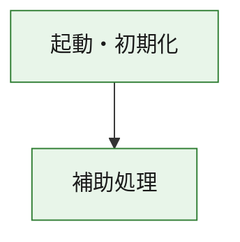
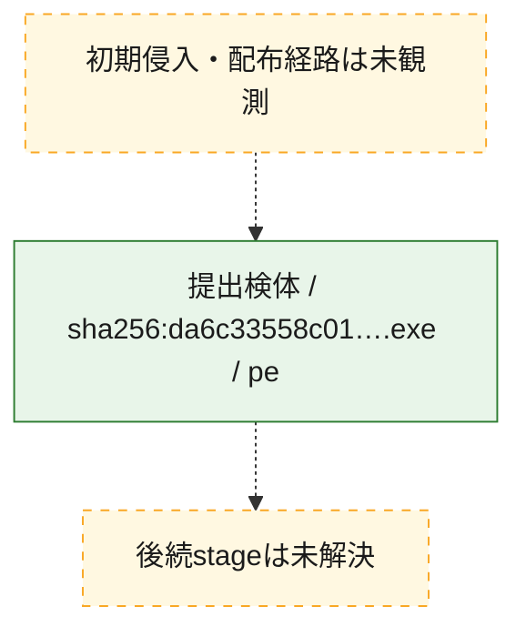
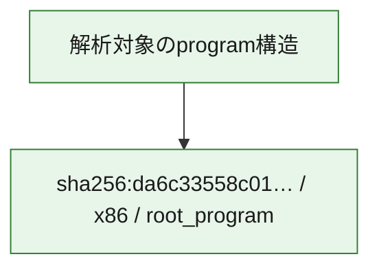

# 全体ロジック：da6c33558c017a4cd130c3a743cc1a76521e13f276cd8a36fb4da649aa0af700

代表関数の静的証跡から、起動・初期化の処理群を確認しました。

## 読み方

- phaseの掲載順は解析上の整理順です。observed_call_edgesがない段階間の実行順を断定しません。
- 図の実線は静的に観測した関係、点線と黄色のノードは未観測・未解決の関係を示します。
- 図は静的な要約であり、動的実行を再現するものではありません。
- 詳細な関数解説とfingerprintは[STATIC-LOGIC.md](STATIC-LOGIC.md)を参照してください。

## 静的可視化

### 実行フロー

### 感染チェーン

### モジュール関係

## 処理段階

### 1. 起動・初期化

entry pointから初期化と後続処理への移行を確認します。
確度: `confirmed_static_function_evidence`

- `da6c33558c017a4cd130c3a743cc1a76521e13f276cd8a36fb4da649aa0af700:ghidra:180001010` — 初期化と主要処理への分岐を行う入口関数です。 状態: `succeeded`、選定理由: `entry_point`, `meaningful_symbol_name`, `reviewed_call_centrality:22`, `role:entrypoint`, `small_program_complete_context`

### 2. 補助処理

主要処理を支える一般内部関数またはlibrary処理を確認します。
確度: `confirmed_static_function_evidence`

- `da6c33558c017a4cd130c3a743cc1a76521e13f276cd8a36fb4da649aa0af700:ghidra:180001240` — 検体内部の一般処理を実装する関数です。 状態: `succeeded`、選定理由: `context_representative`, `reviewed_call_centrality:2`, `small_program_complete_context`
- `da6c33558c017a4cd130c3a743cc1a76521e13f276cd8a36fb4da649aa0af700:ghidra:180001350` — 検体内部の一般処理を実装する関数です。 状態: `succeeded`、選定理由: `context_representative`, `reviewed_call_centrality:25`, `small_program_complete_context`
- `da6c33558c017a4cd130c3a743cc1a76521e13f276cd8a36fb4da649aa0af700:ghidra:180003780` — 検体内部の一般処理を実装する関数です。 状態: `succeeded`、選定理由: `context_representative`, `reviewed_call_centrality:2`, `small_program_complete_context`
- `da6c33558c017a4cd130c3a743cc1a76521e13f276cd8a36fb4da649aa0af700:ghidra:1800038e0` — 検体内部の一般処理を実装する関数です。 状態: `succeeded`、選定理由: `context_representative`, `reviewed_call_centrality:2`, `small_program_complete_context`

## 観測したcall関係

- `da6c33558c017a4cd130c3a743cc1a76521e13f276cd8a36fb4da649aa0af700:ghidra:180001010` → `da6c33558c017a4cd130c3a743cc1a76521e13f276cd8a36fb4da649aa0af700:ghidra:180001240` （`startup` → `support`）
- `da6c33558c017a4cd130c3a743cc1a76521e13f276cd8a36fb4da649aa0af700:ghidra:180001010` → `da6c33558c017a4cd130c3a743cc1a76521e13f276cd8a36fb4da649aa0af700:ghidra:180001350` （`startup` → `support`）
- `da6c33558c017a4cd130c3a743cc1a76521e13f276cd8a36fb4da649aa0af700:ghidra:180001350` → `da6c33558c017a4cd130c3a743cc1a76521e13f276cd8a36fb4da649aa0af700:ghidra:180001240` （`support` → `support`）
- `da6c33558c017a4cd130c3a743cc1a76521e13f276cd8a36fb4da649aa0af700:ghidra:180001350` → `da6c33558c017a4cd130c3a743cc1a76521e13f276cd8a36fb4da649aa0af700:ghidra:180003780` （`support` → `support`）
- `da6c33558c017a4cd130c3a743cc1a76521e13f276cd8a36fb4da649aa0af700:ghidra:180001350` → `da6c33558c017a4cd130c3a743cc1a76521e13f276cd8a36fb4da649aa0af700:ghidra:1800038e0` （`support` → `support`）
- `da6c33558c017a4cd130c3a743cc1a76521e13f276cd8a36fb4da649aa0af700:ghidra:180003780` → `da6c33558c017a4cd130c3a743cc1a76521e13f276cd8a36fb4da649aa0af700:ghidra:1800038e0` （`support` → `support`）
- `ghidra-function:0252cee6c5a4b100c4c0d40e` → `ghidra-function:5dd9dd2f3d386f2964406447` （`unclassified` → `unclassified`）
- `ghidra-function:cb9bf352d4c4e706f3191972` → `ghidra-external:0150115cc47281100dc9a008` （`unclassified` → `unclassified`）
- `ghidra-function:cb9bf352d4c4e706f3191972` → `ghidra-external:0af08eb5245b20d148a3fb8f` （`unclassified` → `unclassified`）
- `ghidra-function:cb9bf352d4c4e706f3191972` → `ghidra-external:0bc15f805615638465893b4b` （`unclassified` → `unclassified`）
- `ghidra-function:cb9bf352d4c4e706f3191972` → `ghidra-external:0c1ff175e622e4c4fb398ba6` （`unclassified` → `unclassified`）
- `ghidra-function:cb9bf352d4c4e706f3191972` → `ghidra-external:0c8053aa48418683dd0a2bdc` （`unclassified` → `unclassified`）
- `ghidra-function:cb9bf352d4c4e706f3191972` → `ghidra-external:15a937f09ae09c47a386fb91` （`unclassified` → `unclassified`）
- `ghidra-function:cb9bf352d4c4e706f3191972` → `ghidra-external:1d02693845508311f1b90786` （`unclassified` → `unclassified`）
- `ghidra-function:cb9bf352d4c4e706f3191972` → `ghidra-external:2ab07b96c377e9206830e439` （`unclassified` → `unclassified`）
- `ghidra-function:cb9bf352d4c4e706f3191972` → `ghidra-external:2ae921565809844c0fca45d4` （`unclassified` → `unclassified`）
- `ghidra-function:cb9bf352d4c4e706f3191972` → `ghidra-external:383250e4ae966448b453b141` （`unclassified` → `unclassified`）
- `ghidra-function:cb9bf352d4c4e706f3191972` → `ghidra-external:4713180f986b2104278798df` （`unclassified` → `unclassified`）
- `ghidra-function:cb9bf352d4c4e706f3191972` → `ghidra-external:7221976861b573f832484ced` （`unclassified` → `unclassified`）
- `ghidra-function:cb9bf352d4c4e706f3191972` → `ghidra-external:72c21ceee75912ad99ed0724` （`unclassified` → `unclassified`）
- `ghidra-function:cb9bf352d4c4e706f3191972` → `ghidra-external:747c26d6b9d1a66c60b6ed94` （`unclassified` → `unclassified`）
- `ghidra-function:cb9bf352d4c4e706f3191972` → `ghidra-external:8e28e3101bf3bd4a8ee7e574` （`unclassified` → `unclassified`）
- `ghidra-function:cb9bf352d4c4e706f3191972` → `ghidra-external:946e2a136439bf40dc05dd5d` （`unclassified` → `unclassified`）
- `ghidra-function:cb9bf352d4c4e706f3191972` → `ghidra-external:961f54a6185aa8ab845bf571` （`unclassified` → `unclassified`）
- `ghidra-function:cb9bf352d4c4e706f3191972` → `ghidra-external:a8077a95ed4652a93d592c97` （`unclassified` → `unclassified`）
- `ghidra-function:cb9bf352d4c4e706f3191972` → `ghidra-external:e09eac0529a30c068ca3fe81` （`unclassified` → `unclassified`）
- `ghidra-function:cb9bf352d4c4e706f3191972` → `ghidra-external:f17daefc69e95c0fa2775f5b` （`unclassified` → `unclassified`）
- `ghidra-function:cb9bf352d4c4e706f3191972` → `ghidra-external:ffcffc2bf5ffdeb971634889` （`unclassified` → `unclassified`）
- `ghidra-function:cb9bf352d4c4e706f3191972` → `ghidra-function:0252cee6c5a4b100c4c0d40e` （`unclassified` → `unclassified`）
- `ghidra-function:cb9bf352d4c4e706f3191972` → `ghidra-function:5dd9dd2f3d386f2964406447` （`unclassified` → `unclassified`）
- `ghidra-function:cb9bf352d4c4e706f3191972` → `ghidra-function:7e00d550b102746889109fec` （`unclassified` → `unclassified`）
- `ghidra-function:cd6a5e6eb511ef4d5561ce95` → `ghidra-function:57e565b1f83e83a912e3c729` （`unclassified` → `unclassified`）
- `ghidra-function:cd6a5e6eb511ef4d5561ce95` → `ghidra-function:6fcea6036d4fece6f837cdec` （`unclassified` → `unclassified`）
- `ghidra-function:cd6a5e6eb511ef4d5561ce95` → `ghidra-function:7e00d550b102746889109fec` （`unclassified` → `unclassified`）
- `ghidra-function:cd6a5e6eb511ef4d5561ce95` → `ghidra-function:8c373242b3e15e72400ba89b` （`unclassified` → `unclassified`）
- `ghidra-function:cd6a5e6eb511ef4d5561ce95` → `ghidra-function:8d9f102c81a3f1f0905ddf39` （`unclassified` → `unclassified`）
- `ghidra-function:cd6a5e6eb511ef4d5561ce95` → `ghidra-function:93041469ece5ebab1ec7c064` （`unclassified` → `unclassified`）
- `ghidra-function:cd6a5e6eb511ef4d5561ce95` → `ghidra-function:ab267e3b8055e40fb9697485` （`unclassified` → `unclassified`）
- `ghidra-function:cd6a5e6eb511ef4d5561ce95` → `ghidra-function:beea6e6fdeb34a78903c00fa` （`unclassified` → `unclassified`）
- `ghidra-function:cd6a5e6eb511ef4d5561ce95` → `ghidra-function:c8b185a1a06d181f1440bfcf` （`unclassified` → `unclassified`）
- `ghidra-function:cd6a5e6eb511ef4d5561ce95` → `ghidra-function:cb9bf352d4c4e706f3191972` （`unclassified` → `unclassified`）
- `ghidra-function:cd6a5e6eb511ef4d5561ce95` → `ghidra-function:d24e7f2c865e0fb0d1ff7aac` （`unclassified` → `unclassified`）
- `ghidra-function:cd6a5e6eb511ef4d5561ce95` → `ghidra-function:fcffb2b855146220813633ec` （`unclassified` → `unclassified`）

## 解析範囲と制約

- 選定外関数は全体inventoryへ残しますが、関数本体の個別解説対象にはしていません。
- indirect call、難読化、packer、VM、壊れたcontrol flowによりcall関係が欠落する場合があります。
- 文書は静的解析に基づき、検体実行や外部通信による動的確認は行っていません。
