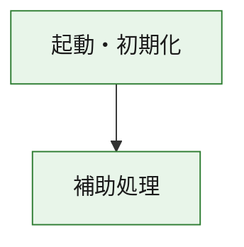
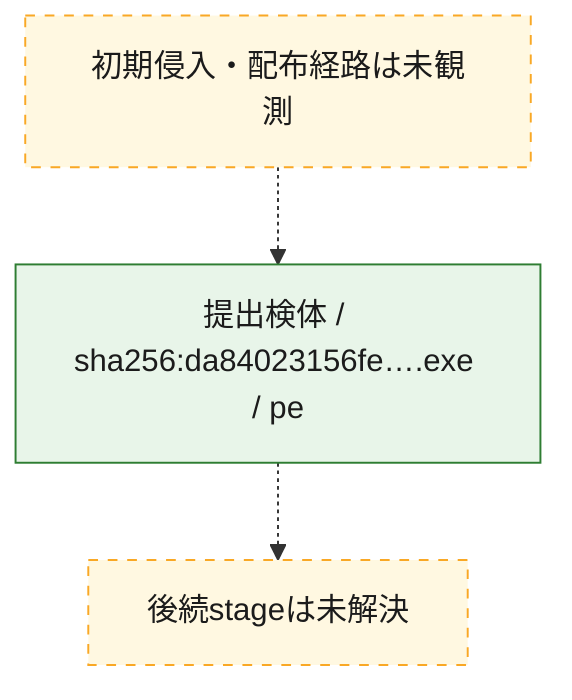
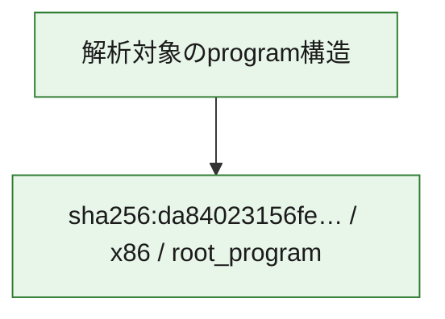

# 全体ロジック：da84023156fef1899da62391cf4df54682359b48deef8ae8e51bbd6f603ba08f

代表関数の静的証跡から、起動・初期化の処理群を確認しました。

## 読み方

- phaseの掲載順は解析上の整理順です。observed_call_edgesがない段階間の実行順を断定しません。
- 図の実線は静的に観測した関係、点線と黄色のノードは未観測・未解決の関係を示します。
- 図は静的な要約であり、動的実行を再現するものではありません。
- 詳細な関数解説とfingerprintは[STATIC-LOGIC.md](STATIC-LOGIC.md)を参照してください。

## 静的可視化

### 実行フロー

### 感染チェーン

### モジュール関係

## 処理段階

### 1. 起動・初期化

entry pointから初期化と後続処理への移行を確認します。
確度: `confirmed_static_function_evidence`

- `da84023156fef1899da62391cf4df54682359b48deef8ae8e51bbd6f603ba08f:ghidra:180001010` — 初期化と主要処理への分岐を行う入口関数です。 状態: `succeeded`、選定理由: `entry_point`, `meaningful_symbol_name`, `reviewed_call_centrality:22`, `role:entrypoint`, `small_program_complete_context`

### 2. 補助処理

主要処理を支える一般内部関数またはlibrary処理を確認します。
確度: `confirmed_static_function_evidence`

- `da84023156fef1899da62391cf4df54682359b48deef8ae8e51bbd6f603ba08f:ghidra:180001240` — 検体内部の一般処理を実装する関数です。 状態: `succeeded`、選定理由: `context_representative`, `reviewed_call_centrality:2`, `small_program_complete_context`
- `da84023156fef1899da62391cf4df54682359b48deef8ae8e51bbd6f603ba08f:ghidra:180001350` — 検体内部の一般処理を実装する関数です。 状態: `succeeded`、選定理由: `context_representative`, `reviewed_call_centrality:25`, `small_program_complete_context`
- `da84023156fef1899da62391cf4df54682359b48deef8ae8e51bbd6f603ba08f:ghidra:180003780` — 検体内部の一般処理を実装する関数です。 状態: `succeeded`、選定理由: `context_representative`, `reviewed_call_centrality:2`, `small_program_complete_context`
- `da84023156fef1899da62391cf4df54682359b48deef8ae8e51bbd6f603ba08f:ghidra:1800038e0` — 検体内部の一般処理を実装する関数です。 状態: `succeeded`、選定理由: `context_representative`, `reviewed_call_centrality:2`, `small_program_complete_context`

## 観測したcall関係

- `da84023156fef1899da62391cf4df54682359b48deef8ae8e51bbd6f603ba08f:ghidra:180001010` → `da84023156fef1899da62391cf4df54682359b48deef8ae8e51bbd6f603ba08f:ghidra:180001240` （`startup` → `support`）
- `da84023156fef1899da62391cf4df54682359b48deef8ae8e51bbd6f603ba08f:ghidra:180001010` → `da84023156fef1899da62391cf4df54682359b48deef8ae8e51bbd6f603ba08f:ghidra:180001350` （`startup` → `support`）
- `da84023156fef1899da62391cf4df54682359b48deef8ae8e51bbd6f603ba08f:ghidra:180001350` → `da84023156fef1899da62391cf4df54682359b48deef8ae8e51bbd6f603ba08f:ghidra:180001240` （`support` → `support`）
- `da84023156fef1899da62391cf4df54682359b48deef8ae8e51bbd6f603ba08f:ghidra:180001350` → `da84023156fef1899da62391cf4df54682359b48deef8ae8e51bbd6f603ba08f:ghidra:180003780` （`support` → `support`）
- `da84023156fef1899da62391cf4df54682359b48deef8ae8e51bbd6f603ba08f:ghidra:180001350` → `da84023156fef1899da62391cf4df54682359b48deef8ae8e51bbd6f603ba08f:ghidra:1800038e0` （`support` → `support`）
- `da84023156fef1899da62391cf4df54682359b48deef8ae8e51bbd6f603ba08f:ghidra:180003780` → `da84023156fef1899da62391cf4df54682359b48deef8ae8e51bbd6f603ba08f:ghidra:1800038e0` （`support` → `support`）
- `ghidra-function:0a5daf1d5ba46aecfef8a8e1` → `ghidra-function:1641ca82fe9d6e43be9ea3eb` （`unclassified` → `unclassified`）
- `ghidra-function:7e694440c9e835526626d5ad` → `ghidra-external:030424543dc65f1ddcaf5e4c` （`unclassified` → `unclassified`）
- `ghidra-function:7e694440c9e835526626d5ad` → `ghidra-external:08e6b297b1debded18180ed3` （`unclassified` → `unclassified`）
- `ghidra-function:7e694440c9e835526626d5ad` → `ghidra-external:1265692f8dd9fed594863fb1` （`unclassified` → `unclassified`）
- `ghidra-function:7e694440c9e835526626d5ad` → `ghidra-external:39d45eb59881fc66c8da2ab9` （`unclassified` → `unclassified`）
- `ghidra-function:7e694440c9e835526626d5ad` → `ghidra-external:5d20f07f657c53f0a13bbb8c` （`unclassified` → `unclassified`）
- `ghidra-function:7e694440c9e835526626d5ad` → `ghidra-external:5f4b3a7642914f7d710fce43` （`unclassified` → `unclassified`）
- `ghidra-function:7e694440c9e835526626d5ad` → `ghidra-external:6267faf96768e81a773dfe18` （`unclassified` → `unclassified`）
- `ghidra-function:7e694440c9e835526626d5ad` → `ghidra-external:658f4a826b7a93ecea1e8074` （`unclassified` → `unclassified`）
- `ghidra-function:7e694440c9e835526626d5ad` → `ghidra-external:7e217959c8602bdbf6648b4a` （`unclassified` → `unclassified`）
- `ghidra-function:7e694440c9e835526626d5ad` → `ghidra-external:7f71cd925c340e9502adf388` （`unclassified` → `unclassified`）
- `ghidra-function:7e694440c9e835526626d5ad` → `ghidra-external:883246c8d088b8724ad301c7` （`unclassified` → `unclassified`）
- `ghidra-function:7e694440c9e835526626d5ad` → `ghidra-external:b4de48622bbf7cb84b84133c` （`unclassified` → `unclassified`）
- `ghidra-function:7e694440c9e835526626d5ad` → `ghidra-external:c14c42bea8770464558e86ff` （`unclassified` → `unclassified`）
- `ghidra-function:7e694440c9e835526626d5ad` → `ghidra-external:c1ec8d8b3712b47bd08a3d6a` （`unclassified` → `unclassified`）
- `ghidra-function:7e694440c9e835526626d5ad` → `ghidra-external:c6b7887996671069713c2c6a` （`unclassified` → `unclassified`）
- `ghidra-function:7e694440c9e835526626d5ad` → `ghidra-external:cfd1743d9290206b8746840b` （`unclassified` → `unclassified`）
- `ghidra-function:7e694440c9e835526626d5ad` → `ghidra-external:d252c56fc9c5bf6c787aa892` （`unclassified` → `unclassified`）
- `ghidra-function:7e694440c9e835526626d5ad` → `ghidra-external:d6a143b6b99ce79a257ee3f5` （`unclassified` → `unclassified`）
- `ghidra-function:7e694440c9e835526626d5ad` → `ghidra-external:e0023a551e975b61b045d69f` （`unclassified` → `unclassified`）
- `ghidra-function:7e694440c9e835526626d5ad` → `ghidra-external:ea72c75b14940fb56cc1acc8` （`unclassified` → `unclassified`）
- `ghidra-function:7e694440c9e835526626d5ad` → `ghidra-external:fec6e85ab0ffdc4bf47689f5` （`unclassified` → `unclassified`）
- `ghidra-function:7e694440c9e835526626d5ad` → `ghidra-function:0a5daf1d5ba46aecfef8a8e1` （`unclassified` → `unclassified`）
- `ghidra-function:7e694440c9e835526626d5ad` → `ghidra-function:1641ca82fe9d6e43be9ea3eb` （`unclassified` → `unclassified`）
- `ghidra-function:7e694440c9e835526626d5ad` → `ghidra-function:efc03937ebf04b46e07b039b` （`unclassified` → `unclassified`）
- `ghidra-function:9c40c5356ae1b7c7d4bee34c` → `ghidra-function:215d6e2938e340bcdcafdeb0` （`unclassified` → `unclassified`）
- `ghidra-function:9c40c5356ae1b7c7d4bee34c` → `ghidra-function:26c7f625dc14e90abc542fad` （`unclassified` → `unclassified`）
- `ghidra-function:9c40c5356ae1b7c7d4bee34c` → `ghidra-function:329f7e4b2d372e11b13552fb` （`unclassified` → `unclassified`）
- `ghidra-function:9c40c5356ae1b7c7d4bee34c` → `ghidra-function:33f95012f784ca1b9096af33` （`unclassified` → `unclassified`）
- `ghidra-function:9c40c5356ae1b7c7d4bee34c` → `ghidra-function:534f40aa3033817ec80dd49e` （`unclassified` → `unclassified`）
- `ghidra-function:9c40c5356ae1b7c7d4bee34c` → `ghidra-function:69af9de5b2197ba482be3d32` （`unclassified` → `unclassified`）
- `ghidra-function:9c40c5356ae1b7c7d4bee34c` → `ghidra-function:6a1c411f9cc1221fc4b7fafc` （`unclassified` → `unclassified`）
- `ghidra-function:9c40c5356ae1b7c7d4bee34c` → `ghidra-function:6d585f85f9594778c287432b` （`unclassified` → `unclassified`）
- `ghidra-function:9c40c5356ae1b7c7d4bee34c` → `ghidra-function:7e694440c9e835526626d5ad` （`unclassified` → `unclassified`）
- `ghidra-function:9c40c5356ae1b7c7d4bee34c` → `ghidra-function:89d5ac0ff60b94023d0ed971` （`unclassified` → `unclassified`）
- `ghidra-function:9c40c5356ae1b7c7d4bee34c` → `ghidra-function:d94fe398113f7eefd37f3b9c` （`unclassified` → `unclassified`）
- `ghidra-function:9c40c5356ae1b7c7d4bee34c` → `ghidra-function:efc03937ebf04b46e07b039b` （`unclassified` → `unclassified`）

## 解析範囲と制約

- 選定外関数は全体inventoryへ残しますが、関数本体の個別解説対象にはしていません。
- indirect call、難読化、packer、VM、壊れたcontrol flowによりcall関係が欠落する場合があります。
- 文書は静的解析に基づき、検体実行や外部通信による動的確認は行っていません。
