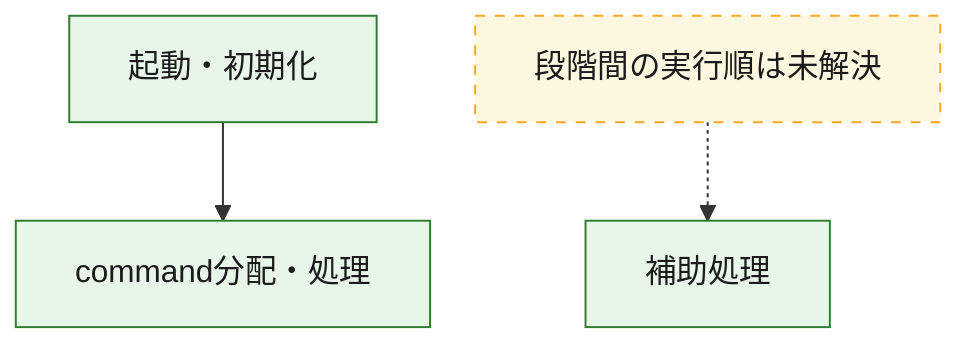
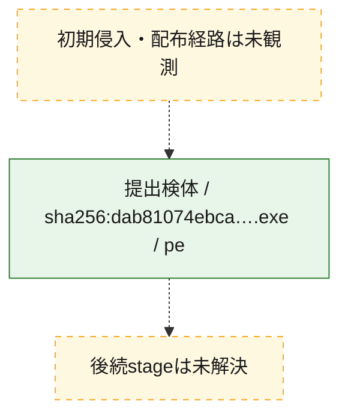
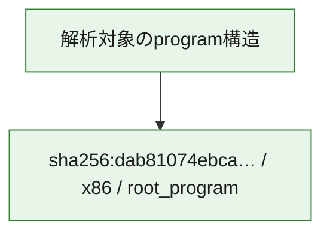

# 全体ロジック：dab81074ebca6d207fce705490af9afbd5e0ba7d12b7b84603afdb0d17396bc0

代表関数の静的証跡から、起動・初期化、command分配・処理の処理群を確認しました。

## 読み方

- phaseの掲載順は解析上の整理順です。observed_call_edgesがない段階間の実行順を断定しません。
- 図の実線は静的に観測した関係、点線と黄色のノードは未観測・未解決の関係を示します。
- 図は静的な要約であり、動的実行を再現するものではありません。
- 詳細な関数解説とfingerprintは[STATIC-LOGIC.md](STATIC-LOGIC.md)を参照してください。

## 静的可視化

### 実行フロー

### 感染チェーン

### モジュール関係

## 処理段階

### 1. 起動・初期化

entry pointから初期化と後続処理への移行を確認します。
確度: `confirmed_static_function_evidence`

- `dab81074ebca6d207fce705490af9afbd5e0ba7d12b7b84603afdb0d17396bc0:ghidra:14000c520` — 初期化と主要処理への分岐を行う入口関数です。 状態: `succeeded`、選定理由: `entry_point`, `meaningful_symbol_name`, `reviewed_call_centrality:22`, `role:entrypoint`

### 2. command分配・処理

受信commandやtaskの解釈、分配、個別handlerへの移行を確認します。
確度: `confirmed_static_function_evidence_with_limits`

- `dab81074ebca6d207fce705490af9afbd5e0ba7d12b7b84603afdb0d17396bc0:ghidra:140019270` — commandの解釈、分配、または個別処理を担当する関数です。 状態: `limited_bad_instruction_or_flow`、選定理由: `meaningful_symbol_name`, `reviewed_call_centrality:1`, `role:command_dispatch_or_handler`

### 3. 補助処理

主要処理を支える一般内部関数またはlibrary処理を確認します。
確度: `confirmed_static_function_evidence_with_limits`

- `dab81074ebca6d207fce705490af9afbd5e0ba7d12b7b84603afdb0d17396bc0:ghidra:140001000` — 検体内部の一般処理を実装する関数です。 状態: `limited_bad_instruction_or_flow`、選定理由: `context_representative`, `reviewed_call_centrality:11`
- `dab81074ebca6d207fce705490af9afbd5e0ba7d12b7b84603afdb0d17396bc0:ghidra:140002021` — 検体内部の一般処理を実装する関数です。 状態: `limited_bad_instruction_or_flow`、選定理由: `context_representative`, `reviewed_call_centrality:10`
- `dab81074ebca6d207fce705490af9afbd5e0ba7d12b7b84603afdb0d17396bc0:ghidra:140002082` — 検体内部の一般処理を実装する関数です。 状態: `succeeded`、選定理由: `context_representative`, `reviewed_call_centrality:1`
- `dab81074ebca6d207fce705490af9afbd5e0ba7d12b7b84603afdb0d17396bc0:ghidra:1400020ed` — 検体内部の一般処理を実装する関数です。 状態: `succeeded`、選定理由: `context_representative`, `reviewed_call_centrality:1`
- `dab81074ebca6d207fce705490af9afbd5e0ba7d12b7b84603afdb0d17396bc0:ghidra:140002146` — 検体内部の一般処理を実装する関数です。 状態: `succeeded`、選定理由: `context_representative`
- `dab81074ebca6d207fce705490af9afbd5e0ba7d12b7b84603afdb0d17396bc0:ghidra:14000220e` — 検体内部の一般処理を実装する関数です。 状態: `limited_bad_instruction_or_flow`、選定理由: `context_representative`, `reviewed_call_centrality:4`
- `dab81074ebca6d207fce705490af9afbd5e0ba7d12b7b84603afdb0d17396bc0:ghidra:140002264` — 検体内部の一般処理を実装する関数です。 状態: `succeeded`、選定理由: `context_representative`
- `dab81074ebca6d207fce705490af9afbd5e0ba7d12b7b84603afdb0d17396bc0:ghidra:140002430` — 検体内部の一般処理を実装する関数です。 状態: `limited_bad_instruction_or_flow`、選定理由: `context_representative`, `reviewed_call_centrality:3`
- `dab81074ebca6d207fce705490af9afbd5e0ba7d12b7b84603afdb0d17396bc0:ghidra:140002596` — 検体内部の一般処理を実装する関数です。 状態: `limited_bad_instruction_or_flow`、選定理由: `context_representative`, `reviewed_call_centrality:11`
- `dab81074ebca6d207fce705490af9afbd5e0ba7d12b7b84603afdb0d17396bc0:ghidra:1400025d9` — 検体内部の一般処理を実装する関数です。 状態: `succeeded`、選定理由: `context_representative`, `reviewed_call_centrality:7`
- `dab81074ebca6d207fce705490af9afbd5e0ba7d12b7b84603afdb0d17396bc0:ghidra:140002f14` — 検体内部の一般処理を実装する関数です。 状態: `succeeded`、選定理由: `context_representative`
- `dab81074ebca6d207fce705490af9afbd5e0ba7d12b7b84603afdb0d17396bc0:ghidra:140002f33` — 検体内部の一般処理を実装する関数です。 状態: `limited_bad_instruction_or_flow`、選定理由: `context_representative`, `reviewed_call_centrality:5`
- `dab81074ebca6d207fce705490af9afbd5e0ba7d12b7b84603afdb0d17396bc0:ghidra:140002fb0` — 検体内部の一般処理を実装する関数です。 状態: `limited_bad_instruction_or_flow`、選定理由: `context_representative`, `reviewed_call_centrality:2`
- `dab81074ebca6d207fce705490af9afbd5e0ba7d12b7b84603afdb0d17396bc0:ghidra:140003179` — 検体内部の一般処理を実装する関数です。 状態: `succeeded`、選定理由: `context_representative`, `reviewed_call_centrality:1`
- `dab81074ebca6d207fce705490af9afbd5e0ba7d12b7b84603afdb0d17396bc0:ghidra:1400031d1` — 検体内部の一般処理を実装する関数です。 状態: `succeeded`、選定理由: `context_representative`
- `dab81074ebca6d207fce705490af9afbd5e0ba7d12b7b84603afdb0d17396bc0:ghidra:140003332` — 検体内部の一般処理を実装する関数です。 状態: `limited_bad_instruction_or_flow`、選定理由: `context_representative`, `reviewed_call_centrality:8`
- `dab81074ebca6d207fce705490af9afbd5e0ba7d12b7b84603afdb0d17396bc0:ghidra:140007624` — 検体内部の一般処理を実装する関数です。 状態: `limited_bad_instruction_or_flow`、選定理由: `context_representative`, `reviewed_call_centrality:3`
- `dab81074ebca6d207fce705490af9afbd5e0ba7d12b7b84603afdb0d17396bc0:ghidra:140007700` — 検体内部の一般処理を実装する関数です。 状態: `succeeded`、選定理由: `context_representative`, `reviewed_call_centrality:2`
- `dab81074ebca6d207fce705490af9afbd5e0ba7d12b7b84603afdb0d17396bc0:ghidra:14000773b` — 検体内部の一般処理を実装する関数です。 状態: `succeeded`、選定理由: `context_representative`, `reviewed_call_centrality:2`
- `dab81074ebca6d207fce705490af9afbd5e0ba7d12b7b84603afdb0d17396bc0:ghidra:140007752` — 検体内部の一般処理を実装する関数です。 状態: `succeeded`、選定理由: `context_representative`, `reviewed_call_centrality:1`
- `dab81074ebca6d207fce705490af9afbd5e0ba7d12b7b84603afdb0d17396bc0:ghidra:1400077de` — 検体内部の一般処理を実装する関数です。 状態: `succeeded`、選定理由: `context_representative`, `reviewed_call_centrality:1`
- `dab81074ebca6d207fce705490af9afbd5e0ba7d12b7b84603afdb0d17396bc0:ghidra:14000789b` — 検体内部の一般処理を実装する関数です。 状態: `succeeded`、選定理由: `context_representative`, `reviewed_call_centrality:4`
- `dab81074ebca6d207fce705490af9afbd5e0ba7d12b7b84603afdb0d17396bc0:ghidra:14000796a` — 検体内部の一般処理を実装する関数です。 状態: `succeeded`、選定理由: `context_representative`, `reviewed_call_centrality:2`
- `dab81074ebca6d207fce705490af9afbd5e0ba7d12b7b84603afdb0d17396bc0:ghidra:140007a5c` — 検体内部の一般処理を実装する関数です。 状態: `succeeded`、選定理由: `context_representative`, `reviewed_call_centrality:1`
- `dab81074ebca6d207fce705490af9afbd5e0ba7d12b7b84603afdb0d17396bc0:ghidra:140007bb1` — 検体内部の一般処理を実装する関数です。 状態: `succeeded`、選定理由: `context_representative`, `reviewed_call_centrality:4`
- `dab81074ebca6d207fce705490af9afbd5e0ba7d12b7b84603afdb0d17396bc0:ghidra:140007c3c` — 検体内部の一般処理を実装する関数です。 状態: `succeeded`、選定理由: `context_representative`, `reviewed_call_centrality:5`
- `dab81074ebca6d207fce705490af9afbd5e0ba7d12b7b84603afdb0d17396bc0:ghidra:140007d42` — 検体内部の一般処理を実装する関数です。 状態: `succeeded`、選定理由: `context_representative`
- `dab81074ebca6d207fce705490af9afbd5e0ba7d12b7b84603afdb0d17396bc0:ghidra:140007d4e` — 検体内部の一般処理を実装する関数です。 状態: `limited_bad_instruction_or_flow`、選定理由: `context_representative`, `reviewed_call_centrality:9`
- `dab81074ebca6d207fce705490af9afbd5e0ba7d12b7b84603afdb0d17396bc0:ghidra:140007f8f` — 検体内部の一般処理を実装する関数です。 状態: `succeeded`、選定理由: `context_representative`, `reviewed_call_centrality:8`
- `dab81074ebca6d207fce705490af9afbd5e0ba7d12b7b84603afdb0d17396bc0:ghidra:14000cbd0` — 検体内部の一般処理を実装する関数です。 状態: `succeeded`、選定理由: `meaningful_symbol_name`

## 観測したcall関係

- `dab81074ebca6d207fce705490af9afbd5e0ba7d12b7b84603afdb0d17396bc0:ghidra:140002430` → `dab81074ebca6d207fce705490af9afbd5e0ba7d12b7b84603afdb0d17396bc0:ghidra:140002fb0` （`support` → `support`）
- `dab81074ebca6d207fce705490af9afbd5e0ba7d12b7b84603afdb0d17396bc0:ghidra:140007c3c` → `dab81074ebca6d207fce705490af9afbd5e0ba7d12b7b84603afdb0d17396bc0:ghidra:140002021` （`support` → `support`）
- `dab81074ebca6d207fce705490af9afbd5e0ba7d12b7b84603afdb0d17396bc0:ghidra:140007f8f` → `dab81074ebca6d207fce705490af9afbd5e0ba7d12b7b84603afdb0d17396bc0:ghidra:140007700` （`support` → `support`）
- `dab81074ebca6d207fce705490af9afbd5e0ba7d12b7b84603afdb0d17396bc0:ghidra:14000c520` → `dab81074ebca6d207fce705490af9afbd5e0ba7d12b7b84603afdb0d17396bc0:ghidra:140019270` （`startup` → `dispatch`）
- `ghidra-function:02c588c685df0d5c3d621efa` → `ghidra-external:3c1cc33ed82fde19002ef641` （`unclassified` → `unclassified`）
- `ghidra-function:1b70a4c7d84db5bb8525ca38` → `ghidra-function:8b38d2f5c66d5fce3cc7c7c1` （`unclassified` → `unclassified`）
- `ghidra-function:1b70a4c7d84db5bb8525ca38` → `ghidra-function:ee87c263d4cf12342f08c046` （`unclassified` → `unclassified`）
- `ghidra-function:1d8c526755f43aad69f2b383` → `ghidra-external:113928c752102b854755672c` （`unclassified` → `unclassified`）
- `ghidra-function:1d8c526755f43aad69f2b383` → `ghidra-external:1bd7e81523fc640eba76943b` （`unclassified` → `unclassified`）
- `ghidra-function:1d8c526755f43aad69f2b383` → `ghidra-external:3c1cc33ed82fde19002ef641` （`unclassified` → `unclassified`）
- `ghidra-function:2f81c0831e1d6a7f89ca77eb` → `ghidra-external:1bd7e81523fc640eba76943b` （`unclassified` → `unclassified`）
- `ghidra-function:2f81c0831e1d6a7f89ca77eb` → `ghidra-external:418ee8dfc68714a43a5c66f0` （`unclassified` → `unclassified`）
- `ghidra-function:2f81c0831e1d6a7f89ca77eb` → `ghidra-external:7e96e9201c349782aa14d61e` （`unclassified` → `unclassified`）
- `ghidra-function:2f81c0831e1d6a7f89ca77eb` → `ghidra-external:a771b2efca932a7cdea23b32` （`unclassified` → `unclassified`）
- `ghidra-function:2f81c0831e1d6a7f89ca77eb` → `ghidra-external:c8ee13b20e44776435bcda89` （`unclassified` → `unclassified`）
- `ghidra-function:2f81c0831e1d6a7f89ca77eb` → `ghidra-external:d1b2e51f5db51fbcbc534b9d` （`unclassified` → `unclassified`）
- `ghidra-function:2f81c0831e1d6a7f89ca77eb` → `ghidra-external:d1f49e17aa800b6681a428a7` （`unclassified` → `unclassified`）
- `ghidra-function:2f81c0831e1d6a7f89ca77eb` → `ghidra-function:b357e2a3ac5d462f480f6006` （`unclassified` → `unclassified`）
- `ghidra-function:37dae588f5f050144e247cf0` → `ghidra-external:0b66cfe33fe9d98ba08e770b` （`unclassified` → `unclassified`）
- `ghidra-function:37dae588f5f050144e247cf0` → `ghidra-function:c1141c2c9c83cef810b9bc22` （`unclassified` → `unclassified`）
- `ghidra-function:460ab88edc404a6cda27fd8b` → `ghidra-external:0b66cfe33fe9d98ba08e770b` （`unclassified` → `unclassified`）
- `ghidra-function:508e4427b5880cd6495f7430` → `ghidra-external:0b66cfe33fe9d98ba08e770b` （`unclassified` → `unclassified`）
- `ghidra-function:508e4427b5880cd6495f7430` → `ghidra-function:17ab04e0c00b132ba21ccd0b` （`unclassified` → `unclassified`）
- `ghidra-function:508e4427b5880cd6495f7430` → `ghidra-function:2f81c0831e1d6a7f89ca77eb` （`unclassified` → `unclassified`）
- `ghidra-function:508e4427b5880cd6495f7430` → `ghidra-function:5bd14544afe2ef87b5b5f18a` （`unclassified` → `unclassified`）
- `ghidra-function:58a2fced79fda3d6cdccb213` → `ghidra-external:0b66cfe33fe9d98ba08e770b` （`unclassified` → `unclassified`）
- `ghidra-function:70eeebef13d7b9317a2c46c0` → `ghidra-function:8b38d2f5c66d5fce3cc7c7c1` （`unclassified` → `unclassified`）
- `ghidra-function:741d286406850ffd7572e4b5` → `ghidra-function:194bbf27948610038578ab47` （`unclassified` → `unclassified`）
- `ghidra-function:741d286406850ffd7572e4b5` → `ghidra-function:d631be67fe55b0c9083400a3` （`unclassified` → `unclassified`）
- `ghidra-function:7e69ee068662a4dcc7f4a561` → `ghidra-external:d1b2e51f5db51fbcbc534b9d` （`unclassified` → `unclassified`）
- `ghidra-function:7e69ee068662a4dcc7f4a561` → `ghidra-function:17ab04e0c00b132ba21ccd0b` （`unclassified` → `unclassified`）
- `ghidra-function:7e69ee068662a4dcc7f4a561` → `ghidra-function:c85f49c82b7152b393647f8f` （`unclassified` → `unclassified`）
- `ghidra-function:7e69ee068662a4dcc7f4a561` → `ghidra-function:e9e025d978d1d098f74e5578` （`unclassified` → `unclassified`）
- `ghidra-function:7ed413c03c6a920df77add2f` → `ghidra-external:0cf30eb0f24f572d81e1c492` （`unclassified` → `unclassified`）
- `ghidra-function:7ed413c03c6a920df77add2f` → `ghidra-function:211befbe0d29ba7f29e7b663` （`unclassified` → `unclassified`）
- `ghidra-function:7ed413c03c6a920df77add2f` → `ghidra-function:44004abc04b10d1b9a4c324b` （`unclassified` → `unclassified`）
- `ghidra-function:7ed413c03c6a920df77add2f` → `ghidra-function:a7ca6c797cd29577eb1418b0` （`unclassified` → `unclassified`）
- `ghidra-function:7ed413c03c6a920df77add2f` → `ghidra-function:fee32da65944b9c373053963` （`unclassified` → `unclassified`）
- `ghidra-function:8956fcff568a40521267bf2d` → `ghidra-external:05f2b14a360d52422465bfd6` （`unclassified` → `unclassified`）
- `ghidra-function:8956fcff568a40521267bf2d` → `ghidra-external:10d1244b1da44aead596a2fa` （`unclassified` → `unclassified`）
- `ghidra-function:8956fcff568a40521267bf2d` → `ghidra-external:1afa78969a8d949af73a4eff` （`unclassified` → `unclassified`）
- `ghidra-function:8956fcff568a40521267bf2d` → `ghidra-external:2fe5e66d6032e69f64b75d5d` （`unclassified` → `unclassified`）
- `ghidra-function:8956fcff568a40521267bf2d` → `ghidra-external:43f9721135c3f681156e8c4e` （`unclassified` → `unclassified`）
- `ghidra-function:8956fcff568a40521267bf2d` → `ghidra-external:71368f23ce285e4cf7f36e8e` （`unclassified` → `unclassified`）
- `ghidra-function:8956fcff568a40521267bf2d` → `ghidra-external:8c5dd8956b5dc71748ce8ca1` （`unclassified` → `unclassified`）
- `ghidra-function:8956fcff568a40521267bf2d` → `ghidra-external:961806a480025216c914ec0e` （`unclassified` → `unclassified`）
- `ghidra-function:8956fcff568a40521267bf2d` → `ghidra-external:bc2eedbed4c8093d41b2ce54` （`unclassified` → `unclassified`）
- `ghidra-function:8956fcff568a40521267bf2d` → `ghidra-external:e03fb95e26db6362e7295548` （`unclassified` → `unclassified`）
- `ghidra-function:8956fcff568a40521267bf2d` → `ghidra-function:101bff82edbf6b9598fa739e` （`unclassified` → `unclassified`）
- `ghidra-function:8956fcff568a40521267bf2d` → `ghidra-function:1fd449657b9951a746fa9d4d` （`unclassified` → `unclassified`）
- `ghidra-function:8956fcff568a40521267bf2d` → `ghidra-function:2fef12bb21ca62489ceda86f` （`unclassified` → `unclassified`）
- `ghidra-function:8956fcff568a40521267bf2d` → `ghidra-function:9840e177cd3cc7ac68945a47` （`unclassified` → `unclassified`）
- `ghidra-function:8956fcff568a40521267bf2d` → `ghidra-function:9e895f1e90c82b7bf8886240` （`unclassified` → `unclassified`）
- `ghidra-function:8956fcff568a40521267bf2d` → `ghidra-function:bde8c4600d1fbd3512f1129a` （`unclassified` → `unclassified`）
- `ghidra-function:8956fcff568a40521267bf2d` → `ghidra-function:c4f69d7ca03dc061f82dc581` （`unclassified` → `unclassified`）
- `ghidra-function:8956fcff568a40521267bf2d` → `ghidra-function:c808e2bd386b17541ab8b002` （`unclassified` → `unclassified`）
- `ghidra-function:8956fcff568a40521267bf2d` → `ghidra-function:cd0dcf4d38b22c9c6b858169` （`unclassified` → `unclassified`）
- `ghidra-function:8956fcff568a40521267bf2d` → `ghidra-function:d7300d2087985a4bdbc7d58c` （`unclassified` → `unclassified`）
- `ghidra-function:8956fcff568a40521267bf2d` → `ghidra-function:d91c536d201fe56dc5dfc484` （`unclassified` → `unclassified`）
- `ghidra-function:8956fcff568a40521267bf2d` → `ghidra-function:dc3507030a20a0b06075dad6` （`unclassified` → `unclassified`）
- `ghidra-function:8aed4bd5bf84816f72c4bb27` → `ghidra-external:0b66cfe33fe9d98ba08e770b` （`unclassified` → `unclassified`）
- `ghidra-function:98d9ea7bbeb4074c2cfe8d72` → `ghidra-external:0b66cfe33fe9d98ba08e770b` （`unclassified` → `unclassified`）
- `ghidra-function:a0334fafdd4f7d70f7723d5b` → `ghidra-function:8b9c13b6c841befd55a129e6` （`unclassified` → `unclassified`）
- `ghidra-function:a22049aa07f65e9bf551e48f` → `ghidra-external:1bd7e81523fc640eba76943b` （`unclassified` → `unclassified`）
- `ghidra-function:a22049aa07f65e9bf551e48f` → `ghidra-external:410f240ee8774fd6ad581644` （`unclassified` → `unclassified`）
- `ghidra-function:a22049aa07f65e9bf551e48f` → `ghidra-external:68cdd39e5d16f824354feb0d` （`unclassified` → `unclassified`）
- `ghidra-function:a22049aa07f65e9bf551e48f` → `ghidra-external:8c75f1c3181e17aef87e750b` （`unclassified` → `unclassified`）
- `ghidra-function:a22049aa07f65e9bf551e48f` → `ghidra-external:c9da65107486c7f0b27ea11a` （`unclassified` → `unclassified`）
- `ghidra-function:a22049aa07f65e9bf551e48f` → `ghidra-external:d1b2e51f5db51fbcbc534b9d` （`unclassified` → `unclassified`）
- `ghidra-function:a22049aa07f65e9bf551e48f` → `ghidra-external:d5f06e89b8fc197a1adac953` （`unclassified` → `unclassified`）
- `ghidra-function:a22049aa07f65e9bf551e48f` → `ghidra-external:ef2796bf5253c5db7f8ad297` （`unclassified` → `unclassified`）
- `ghidra-function:aa239a59a54c0d7065e47110` → `ghidra-external:0b66cfe33fe9d98ba08e770b` （`unclassified` → `unclassified`）
- `ghidra-function:aa239a59a54c0d7065e47110` → `ghidra-external:1bd7e81523fc640eba76943b` （`unclassified` → `unclassified`）
- `ghidra-function:aa239a59a54c0d7065e47110` → `ghidra-external:2af3a9f63a431615dc561519` （`unclassified` → `unclassified`）
- `ghidra-function:aa239a59a54c0d7065e47110` → `ghidra-external:8e9e56790633aa80fcc81183` （`unclassified` → `unclassified`）
- `ghidra-function:aa239a59a54c0d7065e47110` → `ghidra-external:d7429bc4534867bef49f9ecd` （`unclassified` → `unclassified`）
- `ghidra-function:aa239a59a54c0d7065e47110` → `ghidra-external:d759ddfe3efdbc9fd272d4e7` （`unclassified` → `unclassified`）
- `ghidra-function:aa239a59a54c0d7065e47110` → `ghidra-external:e265751f2d07bd31e901d0c0` （`unclassified` → `unclassified`）
- `ghidra-function:aa239a59a54c0d7065e47110` → `ghidra-function:98d9ea7bbeb4074c2cfe8d72` （`unclassified` → `unclassified`）
- `ghidra-function:b8d9a5509e9ec251d01bb1a8` → `ghidra-external:1bd7e81523fc640eba76943b` （`unclassified` → `unclassified`）
- `ghidra-function:b8d9a5509e9ec251d01bb1a8` → `ghidra-external:3c1cc33ed82fde19002ef641` （`unclassified` → `unclassified`）
- `ghidra-function:b8d9a5509e9ec251d01bb1a8` → `ghidra-function:02c588c685df0d5c3d621efa` （`unclassified` → `unclassified`）
- `ghidra-function:bafc0168f9e63d3c1fa21842` → `ghidra-function:1d71ef1fbb7d2b09432f9c76` （`unclassified` → `unclassified`）
- `ghidra-function:bcb2d78c7ed2ccc20d9c8075` → `ghidra-function:b31a8239ccd5fabaa17002a6` （`unclassified` → `unclassified`）
- `ghidra-function:ca8a55e668bc1add82a4bcb5` → `ghidra-external:0b66cfe33fe9d98ba08e770b` （`unclassified` → `unclassified`）
- `ghidra-function:ca8a55e668bc1add82a4bcb5` → `ghidra-external:17d9f647720ae102456a482c` （`unclassified` → `unclassified`）
- `ghidra-function:ca8a55e668bc1add82a4bcb5` → `ghidra-external:4ca4066b544d660279bacb66` （`unclassified` → `unclassified`）
- `ghidra-function:ca8a55e668bc1add82a4bcb5` → `ghidra-external:ef2796bf5253c5db7f8ad297` （`unclassified` → `unclassified`）
- `ghidra-function:dab31a9ac8afea27f965e105` → `ghidra-external:130bd61f47728c625842bbdc` （`unclassified` → `unclassified`）
- `ghidra-function:dab31a9ac8afea27f965e105` → `ghidra-external:1bd7e81523fc640eba76943b` （`unclassified` → `unclassified`）
- `ghidra-function:dab31a9ac8afea27f965e105` → `ghidra-external:418ee8dfc68714a43a5c66f0` （`unclassified` → `unclassified`）
- `ghidra-function:dab31a9ac8afea27f965e105` → `ghidra-external:a771b2efca932a7cdea23b32` （`unclassified` → `unclassified`）
- `ghidra-function:dab31a9ac8afea27f965e105` → `ghidra-external:bae31502d3825d3159af3913` （`unclassified` → `unclassified`）
- `ghidra-function:dab31a9ac8afea27f965e105` → `ghidra-function:1011526a4aa83e0676c26dbb` （`unclassified` → `unclassified`）
- `ghidra-function:dab31a9ac8afea27f965e105` → `ghidra-function:856e98784ec51eb5fb165517` （`unclassified` → `unclassified`）
- `ghidra-function:dab31a9ac8afea27f965e105` → `ghidra-function:d631be67fe55b0c9083400a3` （`unclassified` → `unclassified`）
- `ghidra-function:e32fbaae8cf5a9858d275e90` → `ghidra-function:50534655b747a71e7c26e1ad` （`unclassified` → `unclassified`）
- `ghidra-function:e32fbaae8cf5a9858d275e90` → `ghidra-function:bc66b600b5ae2123000cd0d1` （`unclassified` → `unclassified`）
- `ghidra-function:e32fbaae8cf5a9858d275e90` → `ghidra-function:d46f780dd398bc148d668058` （`unclassified` → `unclassified`）
- `ghidra-function:ef519e03649fe3fe947568e9` → `ghidra-external:0b66cfe33fe9d98ba08e770b` （`unclassified` → `unclassified`）
- `ghidra-function:ef519e03649fe3fe947568e9` → `ghidra-external:1bd7e81523fc640eba76943b` （`unclassified` → `unclassified`）
- `ghidra-function:ef519e03649fe3fe947568e9` → `ghidra-external:2af3a9f63a431615dc561519` （`unclassified` → `unclassified`）
- `ghidra-function:ef519e03649fe3fe947568e9` → `ghidra-external:37be774e8bbf05910290fe9d` （`unclassified` → `unclassified`）
- `ghidra-function:ef519e03649fe3fe947568e9` → `ghidra-external:4d5ed496992f69d49768605b` （`unclassified` → `unclassified`）
- `ghidra-function:ef519e03649fe3fe947568e9` → `ghidra-external:77288ec655e5a5f70d14db07` （`unclassified` → `unclassified`）
- `ghidra-function:ef519e03649fe3fe947568e9` → `ghidra-external:7e96e9201c349782aa14d61e` （`unclassified` → `unclassified`）
- `ghidra-function:ef519e03649fe3fe947568e9` → `ghidra-external:c8ee13b20e44776435bcda89` （`unclassified` → `unclassified`）
- `ghidra-function:ef519e03649fe3fe947568e9` → `ghidra-external:d1f49e17aa800b6681a428a7` （`unclassified` → `unclassified`）
- `ghidra-function:ef519e03649fe3fe947568e9` → `ghidra-function:b357e2a3ac5d462f480f6006` （`unclassified` → `unclassified`）

## 解析範囲と制約

- 選定外関数は全体inventoryへ残しますが、関数本体の個別解説対象にはしていません。
- indirect call、難読化、packer、VM、壊れたcontrol flowによりcall関係が欠落する場合があります。
- 文書は静的解析に基づき、検体実行や外部通信による動的確認は行っていません。
