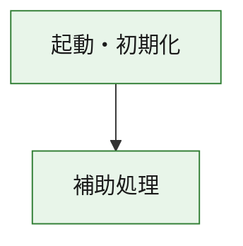
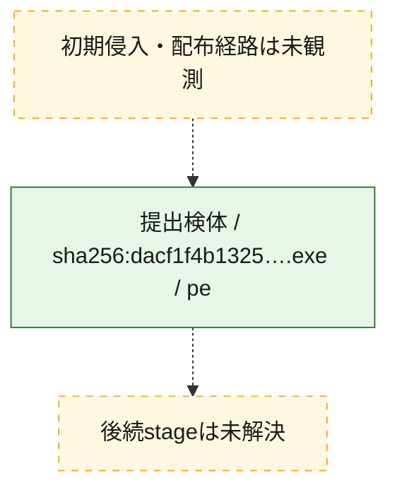
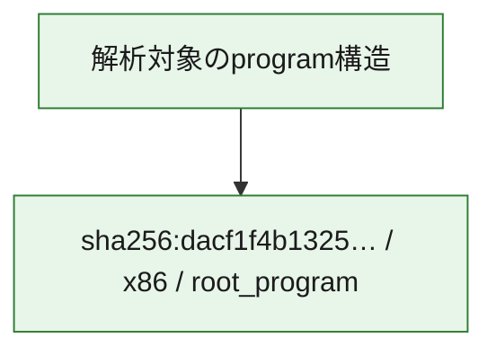

# 全体ロジック：dacf1f4b132579e7f8a61175f51e5dd13dbb386e99be6cf0c061675d445a2a47

代表関数の静的証跡から、起動・初期化の処理群を確認しました。

## 読み方

- phaseの掲載順は解析上の整理順です。observed_call_edgesがない段階間の実行順を断定しません。
- 図の実線は静的に観測した関係、点線と黄色のノードは未観測・未解決の関係を示します。
- 図は静的な要約であり、動的実行を再現するものではありません。
- 詳細な関数解説とfingerprintは[STATIC-LOGIC.md](STATIC-LOGIC.md)を参照してください。

## 静的可視化

### 実行フロー

### 感染チェーン

### モジュール関係

## 処理段階

### 1. 起動・初期化

entry pointから初期化と後続処理への移行を確認します。
確度: `confirmed_static_function_evidence`

- `dacf1f4b132579e7f8a61175f51e5dd13dbb386e99be6cf0c061675d445a2a47:ghidra:180001010` — 初期化と主要処理への分岐を行う入口関数です。 状態: `succeeded`、選定理由: `entry_point`, `meaningful_symbol_name`, `reviewed_call_centrality:22`, `role:entrypoint`, `small_program_complete_context`

### 2. 補助処理

主要処理を支える一般内部関数またはlibrary処理を確認します。
確度: `confirmed_static_function_evidence`

- `dacf1f4b132579e7f8a61175f51e5dd13dbb386e99be6cf0c061675d445a2a47:ghidra:180001240` — 検体内部の一般処理を実装する関数です。 状態: `succeeded`、選定理由: `context_representative`, `reviewed_call_centrality:2`, `small_program_complete_context`
- `dacf1f4b132579e7f8a61175f51e5dd13dbb386e99be6cf0c061675d445a2a47:ghidra:180001350` — 検体内部の一般処理を実装する関数です。 状態: `succeeded`、選定理由: `context_representative`, `reviewed_call_centrality:25`, `small_program_complete_context`
- `dacf1f4b132579e7f8a61175f51e5dd13dbb386e99be6cf0c061675d445a2a47:ghidra:180003780` — 検体内部の一般処理を実装する関数です。 状態: `succeeded`、選定理由: `context_representative`, `reviewed_call_centrality:2`, `small_program_complete_context`
- `dacf1f4b132579e7f8a61175f51e5dd13dbb386e99be6cf0c061675d445a2a47:ghidra:1800038e0` — 検体内部の一般処理を実装する関数です。 状態: `succeeded`、選定理由: `context_representative`, `reviewed_call_centrality:2`, `small_program_complete_context`

## 観測したcall関係

- `dacf1f4b132579e7f8a61175f51e5dd13dbb386e99be6cf0c061675d445a2a47:ghidra:180001010` → `dacf1f4b132579e7f8a61175f51e5dd13dbb386e99be6cf0c061675d445a2a47:ghidra:180001240` （`startup` → `support`）
- `dacf1f4b132579e7f8a61175f51e5dd13dbb386e99be6cf0c061675d445a2a47:ghidra:180001010` → `dacf1f4b132579e7f8a61175f51e5dd13dbb386e99be6cf0c061675d445a2a47:ghidra:180001350` （`startup` → `support`）
- `dacf1f4b132579e7f8a61175f51e5dd13dbb386e99be6cf0c061675d445a2a47:ghidra:180001350` → `dacf1f4b132579e7f8a61175f51e5dd13dbb386e99be6cf0c061675d445a2a47:ghidra:180001240` （`support` → `support`）
- `dacf1f4b132579e7f8a61175f51e5dd13dbb386e99be6cf0c061675d445a2a47:ghidra:180001350` → `dacf1f4b132579e7f8a61175f51e5dd13dbb386e99be6cf0c061675d445a2a47:ghidra:180003780` （`support` → `support`）
- `dacf1f4b132579e7f8a61175f51e5dd13dbb386e99be6cf0c061675d445a2a47:ghidra:180001350` → `dacf1f4b132579e7f8a61175f51e5dd13dbb386e99be6cf0c061675d445a2a47:ghidra:1800038e0` （`support` → `support`）
- `dacf1f4b132579e7f8a61175f51e5dd13dbb386e99be6cf0c061675d445a2a47:ghidra:180003780` → `dacf1f4b132579e7f8a61175f51e5dd13dbb386e99be6cf0c061675d445a2a47:ghidra:1800038e0` （`support` → `support`）
- `ghidra-function:4b685508242b9087a10b3c9d` → `ghidra-function:3b1a2388830c2564cb4ac6ee` （`unclassified` → `unclassified`）
- `ghidra-function:d62fabc1d48c6be0075ac72b` → `ghidra-function:0ccf241e312bb130b4171368` （`unclassified` → `unclassified`）
- `ghidra-function:d62fabc1d48c6be0075ac72b` → `ghidra-function:1a39dfe5e7850e81af034739` （`unclassified` → `unclassified`）
- `ghidra-function:d62fabc1d48c6be0075ac72b` → `ghidra-function:25a6d5984e8362b80b7076fa` （`unclassified` → `unclassified`）
- `ghidra-function:d62fabc1d48c6be0075ac72b` → `ghidra-function:2d3c09a6917227b3d34193a6` （`unclassified` → `unclassified`）
- `ghidra-function:d62fabc1d48c6be0075ac72b` → `ghidra-function:5902473e8d565a242b91740a` （`unclassified` → `unclassified`）
- `ghidra-function:d62fabc1d48c6be0075ac72b` → `ghidra-function:6197c4995fef1d2c7d65e5ca` （`unclassified` → `unclassified`）
- `ghidra-function:d62fabc1d48c6be0075ac72b` → `ghidra-function:945bce72a9e4d1fbb1b2aef0` （`unclassified` → `unclassified`）
- `ghidra-function:d62fabc1d48c6be0075ac72b` → `ghidra-function:9b6e75004b474114f3015764` （`unclassified` → `unclassified`）
- `ghidra-function:d62fabc1d48c6be0075ac72b` → `ghidra-function:a673c3d71c381c15e2bf64e8` （`unclassified` → `unclassified`）
- `ghidra-function:d62fabc1d48c6be0075ac72b` → `ghidra-function:c8c4dd8379ef278535d0050d` （`unclassified` → `unclassified`）
- `ghidra-function:d62fabc1d48c6be0075ac72b` → `ghidra-function:dbf2d038585d2c7f7e80d192` （`unclassified` → `unclassified`）
- `ghidra-function:d62fabc1d48c6be0075ac72b` → `ghidra-function:fcdc3fb428db482b08461915` （`unclassified` → `unclassified`）
- `ghidra-function:fcdc3fb428db482b08461915` → `ghidra-external:06d6ea29c9978d25b97d14c8` （`unclassified` → `unclassified`）
- `ghidra-function:fcdc3fb428db482b08461915` → `ghidra-external:06eb739dea374dbbce9983e9` （`unclassified` → `unclassified`）
- `ghidra-function:fcdc3fb428db482b08461915` → `ghidra-external:141c9faae4486b4dedc57830` （`unclassified` → `unclassified`）
- `ghidra-function:fcdc3fb428db482b08461915` → `ghidra-external:20103bbaaba52cec3fc3f6c9` （`unclassified` → `unclassified`）
- `ghidra-function:fcdc3fb428db482b08461915` → `ghidra-external:2468f294cff5a8069fc4b661` （`unclassified` → `unclassified`）
- `ghidra-function:fcdc3fb428db482b08461915` → `ghidra-external:2ac980989684d55037855a8e` （`unclassified` → `unclassified`）
- `ghidra-function:fcdc3fb428db482b08461915` → `ghidra-external:410e8e7536197e48284c60d7` （`unclassified` → `unclassified`）
- `ghidra-function:fcdc3fb428db482b08461915` → `ghidra-external:415be6a5119f7429372a4629` （`unclassified` → `unclassified`）
- `ghidra-function:fcdc3fb428db482b08461915` → `ghidra-external:4bb4c53f2e2f7a4f74575e58` （`unclassified` → `unclassified`）
- `ghidra-function:fcdc3fb428db482b08461915` → `ghidra-external:504173eec20e11c556cb40fe` （`unclassified` → `unclassified`）
- `ghidra-function:fcdc3fb428db482b08461915` → `ghidra-external:6aec6581b562dae307e295c9` （`unclassified` → `unclassified`）
- `ghidra-function:fcdc3fb428db482b08461915` → `ghidra-external:6d7d40d6e8e3d25bceb0c138` （`unclassified` → `unclassified`）
- `ghidra-function:fcdc3fb428db482b08461915` → `ghidra-external:93fe3e8280d189748ef66b66` （`unclassified` → `unclassified`）
- `ghidra-function:fcdc3fb428db482b08461915` → `ghidra-external:980756de2d5f7496a206e2e1` （`unclassified` → `unclassified`）
- `ghidra-function:fcdc3fb428db482b08461915` → `ghidra-external:a3aab143f7b3834e1e313bf1` （`unclassified` → `unclassified`）
- `ghidra-function:fcdc3fb428db482b08461915` → `ghidra-external:aa9eb072fcdb8efc04c0c6e6` （`unclassified` → `unclassified`）
- `ghidra-function:fcdc3fb428db482b08461915` → `ghidra-external:b72cabcb1237669197967032` （`unclassified` → `unclassified`）
- `ghidra-function:fcdc3fb428db482b08461915` → `ghidra-external:c2c915426ead7b970901aaee` （`unclassified` → `unclassified`）
- `ghidra-function:fcdc3fb428db482b08461915` → `ghidra-external:c6677e09171dd7fdcbb0fedd` （`unclassified` → `unclassified`）
- `ghidra-function:fcdc3fb428db482b08461915` → `ghidra-external:da11bcd4769907583033c0af` （`unclassified` → `unclassified`）
- `ghidra-function:fcdc3fb428db482b08461915` → `ghidra-external:e8a4b97e1ff40b15f0773f5e` （`unclassified` → `unclassified`）
- `ghidra-function:fcdc3fb428db482b08461915` → `ghidra-function:3b1a2388830c2564cb4ac6ee` （`unclassified` → `unclassified`）
- `ghidra-function:fcdc3fb428db482b08461915` → `ghidra-function:4b685508242b9087a10b3c9d` （`unclassified` → `unclassified`）
- `ghidra-function:fcdc3fb428db482b08461915` → `ghidra-function:945bce72a9e4d1fbb1b2aef0` （`unclassified` → `unclassified`）

## 解析範囲と制約

- 選定外関数は全体inventoryへ残しますが、関数本体の個別解説対象にはしていません。
- indirect call、難読化、packer、VM、壊れたcontrol flowによりcall関係が欠落する場合があります。
- 文書は静的解析に基づき、検体実行や外部通信による動的確認は行っていません。
