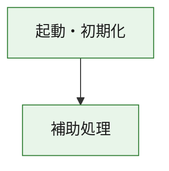
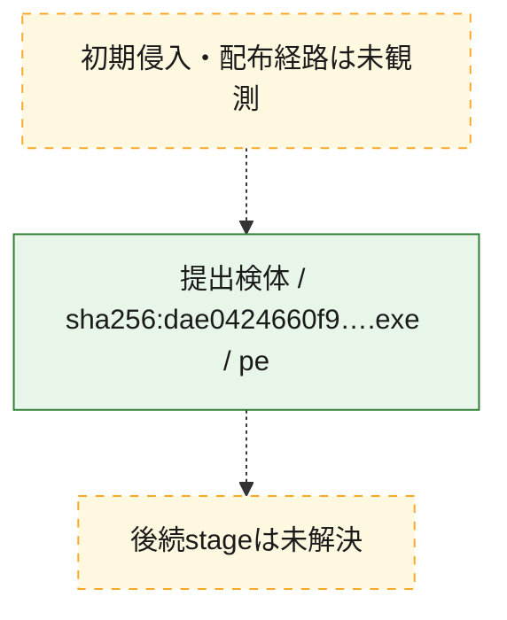
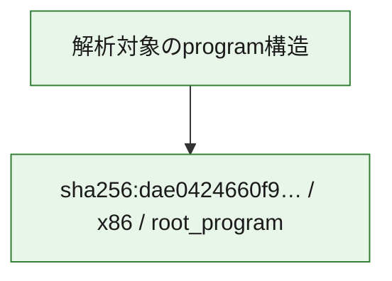

# 全体ロジック：dae0424660f934f585b0b76da212be524553e49c166848a49c32896e39e022f7

代表関数の静的証跡から、起動・初期化の処理群を確認しました。

## 読み方

- phaseの掲載順は解析上の整理順です。observed_call_edgesがない段階間の実行順を断定しません。
- 図の実線は静的に観測した関係、点線と黄色のノードは未観測・未解決の関係を示します。
- 図は静的な要約であり、動的実行を再現するものではありません。
- 詳細な関数解説とfingerprintは[STATIC-LOGIC.md](STATIC-LOGIC.md)を参照してください。

## 静的可視化

### 実行フロー

### 感染チェーン

### モジュール関係

## 処理段階

### 1. 起動・初期化

entry pointから初期化と後続処理への移行を確認します。
確度: `confirmed_static_function_evidence`

- `dae0424660f934f585b0b76da212be524553e49c166848a49c32896e39e022f7:ghidra:180001010` — 初期化と主要処理への分岐を行う入口関数です。 状態: `succeeded`、選定理由: `entry_point`, `meaningful_symbol_name`, `reviewed_call_centrality:22`, `role:entrypoint`, `small_program_complete_context`

### 2. 補助処理

主要処理を支える一般内部関数またはlibrary処理を確認します。
確度: `confirmed_static_function_evidence`

- `dae0424660f934f585b0b76da212be524553e49c166848a49c32896e39e022f7:ghidra:180001240` — 検体内部の一般処理を実装する関数です。 状態: `succeeded`、選定理由: `context_representative`, `reviewed_call_centrality:2`, `small_program_complete_context`
- `dae0424660f934f585b0b76da212be524553e49c166848a49c32896e39e022f7:ghidra:180001350` — 検体内部の一般処理を実装する関数です。 状態: `succeeded`、選定理由: `context_representative`, `reviewed_call_centrality:25`, `small_program_complete_context`
- `dae0424660f934f585b0b76da212be524553e49c166848a49c32896e39e022f7:ghidra:180003780` — 検体内部の一般処理を実装する関数です。 状態: `succeeded`、選定理由: `context_representative`, `reviewed_call_centrality:2`, `small_program_complete_context`
- `dae0424660f934f585b0b76da212be524553e49c166848a49c32896e39e022f7:ghidra:1800038e0` — 検体内部の一般処理を実装する関数です。 状態: `succeeded`、選定理由: `context_representative`, `reviewed_call_centrality:2`, `small_program_complete_context`

## 観測したcall関係

- `dae0424660f934f585b0b76da212be524553e49c166848a49c32896e39e022f7:ghidra:180001010` → `dae0424660f934f585b0b76da212be524553e49c166848a49c32896e39e022f7:ghidra:180001240` （`startup` → `support`）
- `dae0424660f934f585b0b76da212be524553e49c166848a49c32896e39e022f7:ghidra:180001010` → `dae0424660f934f585b0b76da212be524553e49c166848a49c32896e39e022f7:ghidra:180001350` （`startup` → `support`）
- `dae0424660f934f585b0b76da212be524553e49c166848a49c32896e39e022f7:ghidra:180001350` → `dae0424660f934f585b0b76da212be524553e49c166848a49c32896e39e022f7:ghidra:180001240` （`support` → `support`）
- `dae0424660f934f585b0b76da212be524553e49c166848a49c32896e39e022f7:ghidra:180001350` → `dae0424660f934f585b0b76da212be524553e49c166848a49c32896e39e022f7:ghidra:180003780` （`support` → `support`）
- `dae0424660f934f585b0b76da212be524553e49c166848a49c32896e39e022f7:ghidra:180001350` → `dae0424660f934f585b0b76da212be524553e49c166848a49c32896e39e022f7:ghidra:1800038e0` （`support` → `support`）
- `dae0424660f934f585b0b76da212be524553e49c166848a49c32896e39e022f7:ghidra:180003780` → `dae0424660f934f585b0b76da212be524553e49c166848a49c32896e39e022f7:ghidra:1800038e0` （`support` → `support`）
- `ghidra-function:a06307e4ba42d056de5a845f` → `ghidra-function:a7c9811531477fc6ecb3af99` （`unclassified` → `unclassified`）
- `ghidra-function:c91ee1dccd76bbb66413bbd3` → `ghidra-function:1936e9691c340901cb0a0542` （`unclassified` → `unclassified`）
- `ghidra-function:c91ee1dccd76bbb66413bbd3` → `ghidra-function:407d315b5508ba84648c07ae` （`unclassified` → `unclassified`）
- `ghidra-function:c91ee1dccd76bbb66413bbd3` → `ghidra-function:4f723da8e60d4255b7f971cc` （`unclassified` → `unclassified`）
- `ghidra-function:c91ee1dccd76bbb66413bbd3` → `ghidra-function:8e3d7e6c607de3e1ffdf217b` （`unclassified` → `unclassified`）
- `ghidra-function:c91ee1dccd76bbb66413bbd3` → `ghidra-function:8e5fb33bae565d344a5083c0` （`unclassified` → `unclassified`）
- `ghidra-function:c91ee1dccd76bbb66413bbd3` → `ghidra-function:8e784068ccdb607232347ade` （`unclassified` → `unclassified`）
- `ghidra-function:c91ee1dccd76bbb66413bbd3` → `ghidra-function:a68301efe271897a97391bee` （`unclassified` → `unclassified`）
- `ghidra-function:c91ee1dccd76bbb66413bbd3` → `ghidra-function:b481881693e29611a635a91a` （`unclassified` → `unclassified`）
- `ghidra-function:c91ee1dccd76bbb66413bbd3` → `ghidra-function:c960a3c1b0835545df9aaab8` （`unclassified` → `unclassified`）
- `ghidra-function:c91ee1dccd76bbb66413bbd3` → `ghidra-function:d9d0ab898669d2fc89b48bde` （`unclassified` → `unclassified`）
- `ghidra-function:c91ee1dccd76bbb66413bbd3` → `ghidra-function:f0b0bb2aebb9ac61c76e0a37` （`unclassified` → `unclassified`）
- `ghidra-function:c91ee1dccd76bbb66413bbd3` → `ghidra-function:f624880452cd93835f008e1d` （`unclassified` → `unclassified`）
- `ghidra-function:c960a3c1b0835545df9aaab8` → `ghidra-external:05c0e2daabb83e56a11d6bed` （`unclassified` → `unclassified`）
- `ghidra-function:c960a3c1b0835545df9aaab8` → `ghidra-external:1783cf34a44d4a5b012355ea` （`unclassified` → `unclassified`）
- `ghidra-function:c960a3c1b0835545df9aaab8` → `ghidra-external:1957299a558b007ef7bfe47d` （`unclassified` → `unclassified`）
- `ghidra-function:c960a3c1b0835545df9aaab8` → `ghidra-external:2a28cb30478fb59bf5e7d187` （`unclassified` → `unclassified`）
- `ghidra-function:c960a3c1b0835545df9aaab8` → `ghidra-external:31dd497671a02243f3ed0370` （`unclassified` → `unclassified`）
- `ghidra-function:c960a3c1b0835545df9aaab8` → `ghidra-external:40cda861999b17a627e39f5e` （`unclassified` → `unclassified`）
- `ghidra-function:c960a3c1b0835545df9aaab8` → `ghidra-external:513957685633ef4194b3dff6` （`unclassified` → `unclassified`）
- `ghidra-function:c960a3c1b0835545df9aaab8` → `ghidra-external:5351e196a741c5016ab46d07` （`unclassified` → `unclassified`）
- `ghidra-function:c960a3c1b0835545df9aaab8` → `ghidra-external:60bc3ad8205a94141bb508d1` （`unclassified` → `unclassified`）
- `ghidra-function:c960a3c1b0835545df9aaab8` → `ghidra-external:70ed96bc17359d1fb8982201` （`unclassified` → `unclassified`）
- `ghidra-function:c960a3c1b0835545df9aaab8` → `ghidra-external:74b6289a0ccf5314a6b9a2d2` （`unclassified` → `unclassified`）
- `ghidra-function:c960a3c1b0835545df9aaab8` → `ghidra-external:885851c57dc4dfb954aef6a1` （`unclassified` → `unclassified`）
- `ghidra-function:c960a3c1b0835545df9aaab8` → `ghidra-external:9ee1e4ff6e813c73acc146e7` （`unclassified` → `unclassified`）
- `ghidra-function:c960a3c1b0835545df9aaab8` → `ghidra-external:bbbb47c017ffb61d74c2085c` （`unclassified` → `unclassified`）
- `ghidra-function:c960a3c1b0835545df9aaab8` → `ghidra-external:d8d29525a932429ca79cd7cc` （`unclassified` → `unclassified`）
- `ghidra-function:c960a3c1b0835545df9aaab8` → `ghidra-external:db20d9d76e230fb9a85e4a5d` （`unclassified` → `unclassified`）
- `ghidra-function:c960a3c1b0835545df9aaab8` → `ghidra-external:dce5c43834ac2bac1cb332db` （`unclassified` → `unclassified`）
- `ghidra-function:c960a3c1b0835545df9aaab8` → `ghidra-external:e0e25ce817404ce97909b71a` （`unclassified` → `unclassified`）
- `ghidra-function:c960a3c1b0835545df9aaab8` → `ghidra-external:f0fed6369940b5524d499b55` （`unclassified` → `unclassified`）
- `ghidra-function:c960a3c1b0835545df9aaab8` → `ghidra-external:f2509a3a9a4ee51cdf2eb3a4` （`unclassified` → `unclassified`）
- `ghidra-function:c960a3c1b0835545df9aaab8` → `ghidra-external:ff618c949b8ffd7f689dfd2c` （`unclassified` → `unclassified`）
- `ghidra-function:c960a3c1b0835545df9aaab8` → `ghidra-function:4f723da8e60d4255b7f971cc` （`unclassified` → `unclassified`）
- `ghidra-function:c960a3c1b0835545df9aaab8` → `ghidra-function:a06307e4ba42d056de5a845f` （`unclassified` → `unclassified`）
- `ghidra-function:c960a3c1b0835545df9aaab8` → `ghidra-function:a7c9811531477fc6ecb3af99` （`unclassified` → `unclassified`）

## 解析範囲と制約

- 選定外関数は全体inventoryへ残しますが、関数本体の個別解説対象にはしていません。
- indirect call、難読化、packer、VM、壊れたcontrol flowによりcall関係が欠落する場合があります。
- 文書は静的解析に基づき、検体実行や外部通信による動的確認は行っていません。
