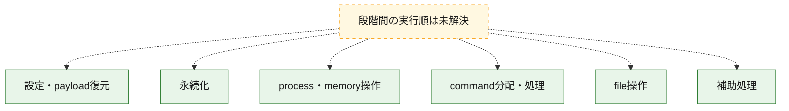
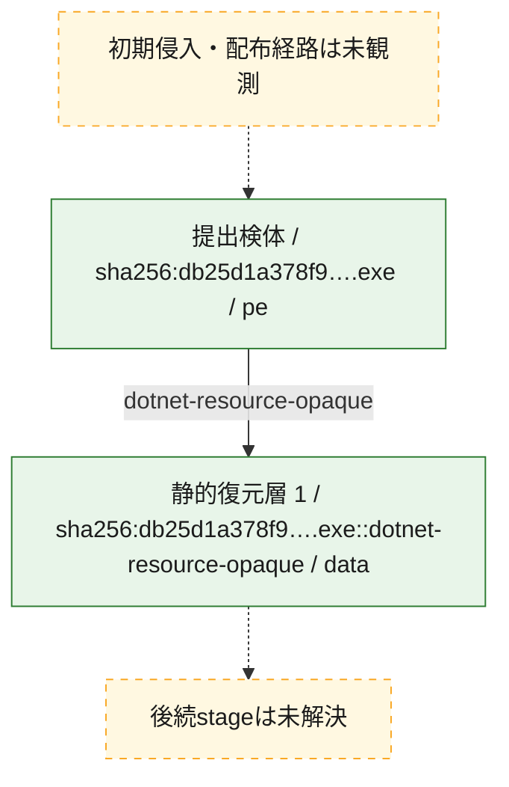
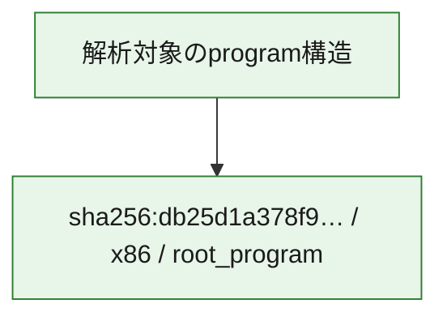

# 全体ロジック：db25d1a378f932e8e6afd0ad46e0181a68310ab9e7a6e204ed7609e302082a39

代表関数の静的証跡から、設定・payload復元、永続化、process・memory操作、command分配・処理、file操作の処理群を確認しました。

## 読み方

- phaseの掲載順は解析上の整理順です。observed_call_edgesがない段階間の実行順を断定しません。
- 図の実線は静的に観測した関係、点線と黄色のノードは未観測・未解決の関係を示します。
- 図は静的な要約であり、動的実行を再現するものではありません。
- 詳細な関数解説とfingerprintは[STATIC-LOGIC.md](STATIC-LOGIC.md)を参照してください。

## 静的可視化

### 実行フロー

### 感染チェーン

### モジュール関係

## 処理段階

### 1. 設定・payload復元

設定、resource、payload、暗号化データの復元・変換を確認します。
確度: `confirmed_static_function_evidence`

- `db25d1a378f932e8e6afd0ad46e0181a68310ab9e7a6e204ed7609e302082a39:cil:0x06000009` — 設定、resource、payloadなどの解析・変換を行う関数です。 状態: `succeeded`、選定理由: `large_function:instructions=96`, `reviewed_call_centrality:24`, `role:config_or_data_transform`
- `db25d1a378f932e8e6afd0ad46e0181a68310ab9e7a6e204ed7609e302082a39:cil:0x0600001d` — 設定、resource、payloadなどの解析・変換を行う関数です。 状態: `succeeded`、選定理由: `reviewed_call_centrality:8`, `role:config_or_data_transform`
- `db25d1a378f932e8e6afd0ad46e0181a68310ab9e7a6e204ed7609e302082a39:cil:0x0600009d` — 設定、resource、payloadなどの解析・変換を行う関数です。 状態: `succeeded`、選定理由: `large_function:instructions=344`, `reviewed_call_centrality:78`, `role:config_or_data_transform`
- `db25d1a378f932e8e6afd0ad46e0181a68310ab9e7a6e204ed7609e302082a39:cil:0x0600009e` — 設定、resource、payloadなどの解析・変換を行う関数です。 状態: `succeeded`、選定理由: `large_function:instructions=309`, `reviewed_call_centrality:60`, `role:config_or_data_transform`
- `db25d1a378f932e8e6afd0ad46e0181a68310ab9e7a6e204ed7609e302082a39:cil:0x060000b4` — 暗号、hash、encoding、または復号処理に関係する関数です。 状態: `succeeded`、選定理由: `large_function:instructions=134`, `reviewed_call_centrality:16`, `role:cryptographic_transform`
- `db25d1a378f932e8e6afd0ad46e0181a68310ab9e7a6e204ed7609e302082a39:cil:0x060000ba` — 暗号、hash、encoding、または復号処理に関係する関数です。 状態: `succeeded`、選定理由: `large_function:instructions=222`, `reviewed_call_centrality:34`, `role:cryptographic_transform`
- `db25d1a378f932e8e6afd0ad46e0181a68310ab9e7a6e204ed7609e302082a39:cil:0x060000bc` — 設定、resource、payloadなどの解析・変換を行う関数です。 状態: `succeeded`、選定理由: `large_function:instructions=143`, `reviewed_call_centrality:46`, `role:config_or_data_transform`
- `db25d1a378f932e8e6afd0ad46e0181a68310ab9e7a6e204ed7609e302082a39:cil:0x06000173` — 設定、resource、payloadなどの解析・変換を行う関数です。 状態: `succeeded`、選定理由: `large_function:instructions=2627`, `reviewed_call_centrality:384`, `role:config_or_data_transform`
- `db25d1a378f932e8e6afd0ad46e0181a68310ab9e7a6e204ed7609e302082a39:cil:0x0600020f` — 設定、resource、payloadなどの解析・変換を行う関数です。 状態: `succeeded`、選定理由: `large_function:instructions=83`, `reviewed_call_centrality:16`, `role:config_or_data_transform`
- `db25d1a378f932e8e6afd0ad46e0181a68310ab9e7a6e204ed7609e302082a39:cil:0x06000213` — 設定、resource、payloadなどの解析・変換を行う関数です。 状態: `succeeded`、選定理由: `large_function:instructions=148`, `reviewed_call_centrality:50`, `role:config_or_data_transform`
- `db25d1a378f932e8e6afd0ad46e0181a68310ab9e7a6e204ed7609e302082a39:cil:0x06000218` — 設定、resource、payloadなどの解析・変換を行う関数です。 状態: `succeeded`、選定理由: `reviewed_call_centrality:24`, `role:config_or_data_transform`
- `db25d1a378f932e8e6afd0ad46e0181a68310ab9e7a6e204ed7609e302082a39:cil:0x0600026a` — 設定、resource、payloadなどの解析・変換を行う関数です。 状態: `succeeded`、選定理由: `reviewed_call_centrality:10`, `role:config_or_data_transform`
- `db25d1a378f932e8e6afd0ad46e0181a68310ab9e7a6e204ed7609e302082a39:cil:0x060002b7` — 設定、resource、payloadなどの解析・変換を行う関数です。 状態: `succeeded`、選定理由: `large_function:instructions=84`, `reviewed_call_centrality:30`, `role:config_or_data_transform`

### 2. 永続化

自動起動や永続化に関係する設定変更を確認します。
確度: `confirmed_static_function_evidence`

- `db25d1a378f932e8e6afd0ad46e0181a68310ab9e7a6e204ed7609e302082a39:cil:0x060000a3` — 自動起動または永続化に関係する処理を含む関数です。 状態: `succeeded`、選定理由: `large_function:instructions=267`, `reviewed_call_centrality:76`, `role:persistence`
- `db25d1a378f932e8e6afd0ad46e0181a68310ab9e7a6e204ed7609e302082a39:cil:0x060000a5` — 自動起動または永続化に関係する処理を含む関数です。 状態: `succeeded`、選定理由: `large_function:instructions=169`, `reviewed_call_centrality:36`, `role:persistence`
- `db25d1a378f932e8e6afd0ad46e0181a68310ab9e7a6e204ed7609e302082a39:cil:0x060000a7` — 自動起動または永続化に関係する処理を含む関数です。 状態: `succeeded`、選定理由: `reviewed_call_centrality:16`, `role:persistence`
- `db25d1a378f932e8e6afd0ad46e0181a68310ab9e7a6e204ed7609e302082a39:cil:0x06000212` — 自動起動または永続化に関係する処理を含む関数です。 状態: `succeeded`、選定理由: `reviewed_call_centrality:16`, `role:persistence`
- `db25d1a378f932e8e6afd0ad46e0181a68310ab9e7a6e204ed7609e302082a39:cil:0x06000216` — 自動起動または永続化に関係する処理を含む関数です。 状態: `succeeded`、選定理由: `large_function:instructions=77`, `reviewed_call_centrality:36`, `role:persistence`
- `db25d1a378f932e8e6afd0ad46e0181a68310ab9e7a6e204ed7609e302082a39:cil:0x06000288` — 自動起動または永続化に関係する処理を含む関数です。 状態: `succeeded`、選定理由: `large_function:instructions=347`, `reviewed_call_centrality:40`, `role:persistence`

### 3. process・memory操作

process、thread、module、memory操作と実行移行を確認します。
確度: `confirmed_static_function_evidence`

- `db25d1a378f932e8e6afd0ad46e0181a68310ab9e7a6e204ed7609e302082a39:cil:0x06000263` — process、thread、module、またはmemory操作に関係する関数です。 状態: `succeeded`、選定理由: `reviewed_call_centrality:16`, `role:process_or_memory_operation`
- `db25d1a378f932e8e6afd0ad46e0181a68310ab9e7a6e204ed7609e302082a39:cil:0x06000268` — process、thread、module、またはmemory操作に関係する関数です。 状態: `succeeded`、選定理由: `large_function:instructions=86`, `reviewed_call_centrality:30`, `role:process_or_memory_operation`
- `db25d1a378f932e8e6afd0ad46e0181a68310ab9e7a6e204ed7609e302082a39:cil:0x06000269` — process、thread、module、またはmemory操作に関係する関数です。 状態: `succeeded`、選定理由: `large_function:instructions=83`, `reviewed_call_centrality:24`, `role:process_or_memory_operation`

### 4. command分配・処理

受信commandやtaskの解釈、分配、個別handlerへの移行を確認します。
確度: `confirmed_static_function_evidence`

- `db25d1a378f932e8e6afd0ad46e0181a68310ab9e7a6e204ed7609e302082a39:cil:0x06000024` — commandの解釈、分配、または個別処理を担当する関数です。 状態: `succeeded`、選定理由: `reviewed_call_centrality:8`, `role:command_dispatch_or_handler`
- `db25d1a378f932e8e6afd0ad46e0181a68310ab9e7a6e204ed7609e302082a39:cil:0x06000042` — commandの解釈、分配、または個別処理を担当する関数です。 状態: `succeeded`、選定理由: `reviewed_call_centrality:6`, `role:command_dispatch_or_handler`
- `db25d1a378f932e8e6afd0ad46e0181a68310ab9e7a6e204ed7609e302082a39:cil:0x06000060` — commandの解釈、分配、または個別処理を担当する関数です。 状態: `succeeded`、選定理由: `reviewed_call_centrality:6`, `role:command_dispatch_or_handler`
- `db25d1a378f932e8e6afd0ad46e0181a68310ab9e7a6e204ed7609e302082a39:cil:0x06000062` — commandの解釈、分配、または個別処理を担当する関数です。 状態: `succeeded`、選定理由: `reviewed_call_centrality:6`, `role:command_dispatch_or_handler`
- `db25d1a378f932e8e6afd0ad46e0181a68310ab9e7a6e204ed7609e302082a39:cil:0x06000064` — commandの解釈、分配、または個別処理を担当する関数です。 状態: `succeeded`、選定理由: `reviewed_call_centrality:6`, `role:command_dispatch_or_handler`
- `db25d1a378f932e8e6afd0ad46e0181a68310ab9e7a6e204ed7609e302082a39:cil:0x06000066` — commandの解釈、分配、または個別処理を担当する関数です。 状態: `succeeded`、選定理由: `reviewed_call_centrality:6`, `role:command_dispatch_or_handler`
- `db25d1a378f932e8e6afd0ad46e0181a68310ab9e7a6e204ed7609e302082a39:cil:0x06000201` — commandの解釈、分配、または個別処理を担当する関数です。 状態: `succeeded`、選定理由: `reviewed_call_centrality:6`, `role:command_dispatch_or_handler`
- `db25d1a378f932e8e6afd0ad46e0181a68310ab9e7a6e204ed7609e302082a39:cil:0x0600020e` — commandの解釈、分配、または個別処理を担当する関数です。 状態: `succeeded`、選定理由: `large_function:instructions=99`, `reviewed_call_centrality:32`, `role:command_dispatch_or_handler`

### 5. file操作

fileやdirectoryの作成、読書き、削除を確認します。
確度: `confirmed_static_function_evidence`

- `db25d1a378f932e8e6afd0ad46e0181a68310ab9e7a6e204ed7609e302082a39:cil:0x060000bd` — fileまたはdirectoryの読書き・管理に関係する関数です。 状態: `succeeded`、選定理由: `large_function:instructions=91`, `reviewed_call_centrality:32`, `role:file_operation`

### 6. 補助処理

主要処理を支える一般内部関数またはlibrary処理を確認します。
確度: `confirmed_static_function_evidence`

- `db25d1a378f932e8e6afd0ad46e0181a68310ab9e7a6e204ed7609e302082a39:cil:0x06000026` — 検体内部の一般処理を実装する関数です。 状態: `succeeded`、選定理由: `large_function:instructions=2419`, `reviewed_call_centrality:348`

## 観測したcall関係

- 代表関数間で直接解決できた呼出関係はありません。

## 解析範囲と制約

- 選定外関数は全体inventoryへ残しますが、関数本体の個別解説対象にはしていません。
- indirect call、難読化、packer、VM、壊れたcontrol flowによりcall関係が欠落する場合があります。
- 文書は静的解析に基づき、検体実行や外部通信による動的確認は行っていません。
