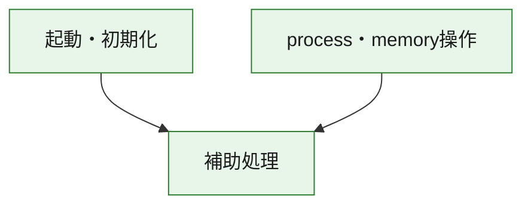
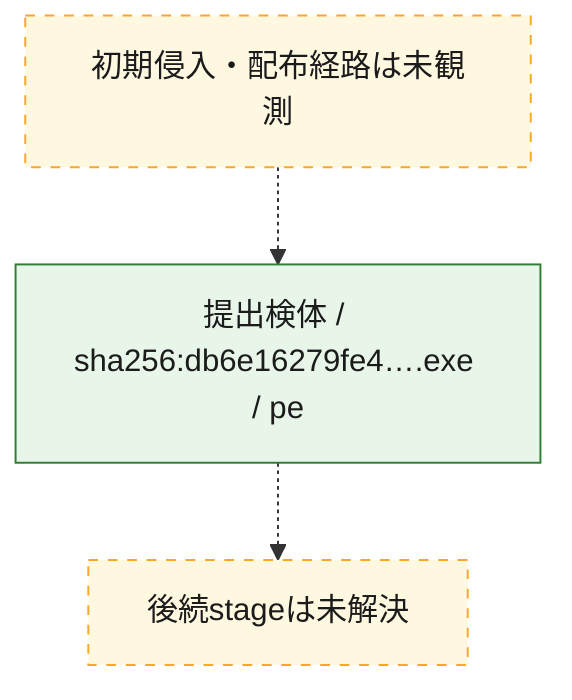
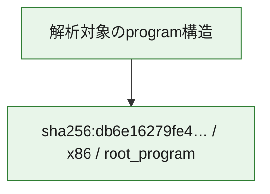

# 全体ロジック：db6e16279fe4c6c21bfd6141f6f4f0d285242fd66238358aa92ec7bc9debc5e6

代表関数の静的証跡から、起動・初期化、process・memory操作の処理群を確認しました。

## 読み方

- phaseの掲載順は解析上の整理順です。observed_call_edgesがない段階間の実行順を断定しません。
- 図の実線は静的に観測した関係、点線と黄色のノードは未観測・未解決の関係を示します。
- 図は静的な要約であり、動的実行を再現するものではありません。
- 詳細な関数解説とfingerprintは[STATIC-LOGIC.md](STATIC-LOGIC.md)を参照してください。

## 静的可視化

### 実行フロー

### 感染チェーン

### モジュール関係

## 処理段階

### 1. 起動・初期化

entry pointから初期化と後続処理への移行を確認します。
確度: `confirmed_static_function_evidence`

- `db6e16279fe4c6c21bfd6141f6f4f0d285242fd66238358aa92ec7bc9debc5e6:ghidra:140001420` — 初期化と主要処理への分岐を行う入口関数です。 状態: `succeeded`、選定理由: `entry_point`, `meaningful_symbol_name`, `reviewed_call_centrality:1`, `role:entrypoint`

### 2. process・memory操作

process、thread、module、memory操作と実行移行を確認します。
確度: `confirmed_static_function_evidence`

- `db6e16279fe4c6c21bfd6141f6f4f0d285242fd66238358aa92ec7bc9debc5e6:ghidra:140015920` — process、thread、module、またはmemory操作に関係する関数です。 状態: `succeeded`、選定理由: `context_representative`, `reviewed_call_centrality:16`, `role:process_or_memory_operation`
- `db6e16279fe4c6c21bfd6141f6f4f0d285242fd66238358aa92ec7bc9debc5e6:ghidra:140015980` — process、thread、module、またはmemory操作に関係する関数です。 状態: `succeeded`、選定理由: `context_representative`, `reviewed_call_centrality:12`, `role:process_or_memory_operation`

### 3. 補助処理

主要処理を支える一般内部関数またはlibrary処理を確認します。
確度: `confirmed_static_function_evidence_with_limits`

- `db6e16279fe4c6c21bfd6141f6f4f0d285242fd66238358aa92ec7bc9debc5e6:ghidra:140001000` — 検体内部の一般処理を実装する関数です。 状態: `succeeded`、選定理由: `context_representative`
- `db6e16279fe4c6c21bfd6141f6f4f0d285242fd66238358aa92ec7bc9debc5e6:ghidra:140001010` — 検体内部の一般処理を実装する関数です。 状態: `limited_bad_instruction_or_flow`、選定理由: `context_representative`, `reviewed_call_centrality:2`
- `db6e16279fe4c6c21bfd6141f6f4f0d285242fd66238358aa92ec7bc9debc5e6:ghidra:140001020` — 検体内部の一般処理を実装する関数です。 状態: `succeeded`、選定理由: `context_representative`, `reviewed_call_centrality:35`
- `db6e16279fe4c6c21bfd6141f6f4f0d285242fd66238358aa92ec7bc9debc5e6:ghidra:140001440` — 検体内部の一般処理を実装する関数です。 状態: `succeeded`、選定理由: `context_representative`, `reviewed_call_centrality:1`
- `db6e16279fe4c6c21bfd6141f6f4f0d285242fd66238358aa92ec7bc9debc5e6:ghidra:140001460` — 検体内部の一般処理を実装する関数です。 状態: `limited_bad_instruction_or_flow`、選定理由: `context_representative`, `reviewed_call_centrality:2`
- `db6e16279fe4c6c21bfd6141f6f4f0d285242fd66238358aa92ec7bc9debc5e6:ghidra:140001470` — 検体内部の一般処理を実装する関数です。 状態: `limited_bad_instruction_or_flow`、選定理由: `context_representative`, `reviewed_call_centrality:2`
- `db6e16279fe4c6c21bfd6141f6f4f0d285242fd66238358aa92ec7bc9debc5e6:ghidra:140001480` — 検体内部の一般処理を実装する関数です。 状態: `succeeded`、選定理由: `context_representative`
- `db6e16279fe4c6c21bfd6141f6f4f0d285242fd66238358aa92ec7bc9debc5e6:ghidra:140015760` — 検体内部の一般処理を実装する関数です。 状態: `succeeded`、選定理由: `context_representative`, `reviewed_call_centrality:1`
- `db6e16279fe4c6c21bfd6141f6f4f0d285242fd66238358aa92ec7bc9debc5e6:ghidra:140015770` — compiler生成処理または汎用library処理とみられる関数です。 状態: `succeeded`、選定理由: `entry_point`, `meaningful_symbol_name`, `reviewed_call_centrality:7`
- `db6e16279fe4c6c21bfd6141f6f4f0d285242fd66238358aa92ec7bc9debc5e6:ghidra:140015790` — compiler生成処理または汎用library処理とみられる関数です。 状態: `succeeded`、選定理由: `entry_point`, `meaningful_symbol_name`, `reviewed_call_centrality:4`
- `db6e16279fe4c6c21bfd6141f6f4f0d285242fd66238358aa92ec7bc9debc5e6:ghidra:140015810` — 検体内部の一般処理を実装する関数です。 状態: `succeeded`、選定理由: `context_representative`
- `db6e16279fe4c6c21bfd6141f6f4f0d285242fd66238358aa92ec7bc9debc5e6:ghidra:140015820` — 検体内部の一般処理を実装する関数です。 状態: `succeeded`、選定理由: `context_representative`, `reviewed_call_centrality:2`
- `db6e16279fe4c6c21bfd6141f6f4f0d285242fd66238358aa92ec7bc9debc5e6:ghidra:140015af0` — 検体内部の一般処理を実装する関数です。 状態: `succeeded`、選定理由: `context_representative`, `reviewed_call_centrality:4`
- `db6e16279fe4c6c21bfd6141f6f4f0d285242fd66238358aa92ec7bc9debc5e6:ghidra:140015e80` — 検体内部の一般処理を実装する関数です。 状態: `succeeded`、選定理由: `context_representative`
- `db6e16279fe4c6c21bfd6141f6f4f0d285242fd66238358aa92ec7bc9debc5e6:ghidra:140015ec0` — 検体内部の一般処理を実装する関数です。 状態: `limited_bad_instruction_or_flow`、選定理由: `context_representative`, `reviewed_call_centrality:3`
- `db6e16279fe4c6c21bfd6141f6f4f0d285242fd66238358aa92ec7bc9debc5e6:ghidra:140015ed0` — 検体内部の一般処理を実装する関数です。 状態: `succeeded`、選定理由: `context_representative`, `reviewed_call_centrality:2`
- `db6e16279fe4c6c21bfd6141f6f4f0d285242fd66238358aa92ec7bc9debc5e6:ghidra:140016070` — 検体内部の一般処理を実装する関数です。 状態: `limited_bad_instruction_or_flow`、選定理由: `context_representative`, `reviewed_call_centrality:2`
- `db6e16279fe4c6c21bfd6141f6f4f0d285242fd66238358aa92ec7bc9debc5e6:ghidra:140016240` — 検体内部の一般処理を実装する関数です。 状態: `limited_bad_instruction_or_flow`、選定理由: `context_representative`, `reviewed_call_centrality:10`
- `db6e16279fe4c6c21bfd6141f6f4f0d285242fd66238358aa92ec7bc9debc5e6:ghidra:1400162b0` — 検体内部の一般処理を実装する関数です。 状態: `succeeded`、選定理由: `context_representative`, `reviewed_call_centrality:5`
- `db6e16279fe4c6c21bfd6141f6f4f0d285242fd66238358aa92ec7bc9debc5e6:ghidra:140016340` — 検体内部の一般処理を実装する関数です。 状態: `succeeded`、選定理由: `context_representative`, `reviewed_call_centrality:5`
- `db6e16279fe4c6c21bfd6141f6f4f0d285242fd66238358aa92ec7bc9debc5e6:ghidra:1400163d0` — 検体内部の一般処理を実装する関数です。 状態: `succeeded`、選定理由: `context_representative`, `reviewed_call_centrality:7`
- `db6e16279fe4c6c21bfd6141f6f4f0d285242fd66238358aa92ec7bc9debc5e6:ghidra:1400164e0` — 検体内部の一般処理を実装する関数です。 状態: `succeeded`、選定理由: `context_representative`, `reviewed_call_centrality:5`
- `db6e16279fe4c6c21bfd6141f6f4f0d285242fd66238358aa92ec7bc9debc5e6:ghidra:1400164f0` — 検体内部の一般処理を実装する関数です。 状態: `succeeded`、選定理由: `context_representative`
- `db6e16279fe4c6c21bfd6141f6f4f0d285242fd66238358aa92ec7bc9debc5e6:ghidra:140016520` — 検体内部の一般処理を実装する関数です。 状態: `succeeded`、選定理由: `context_representative`
- `db6e16279fe4c6c21bfd6141f6f4f0d285242fd66238358aa92ec7bc9debc5e6:ghidra:140016570` — 検体内部の一般処理を実装する関数です。 状態: `succeeded`、選定理由: `context_representative`, `reviewed_call_centrality:2`
- `db6e16279fe4c6c21bfd6141f6f4f0d285242fd66238358aa92ec7bc9debc5e6:ghidra:140016610` — 検体内部の一般処理を実装する関数です。 状態: `succeeded`、選定理由: `context_representative`, `reviewed_call_centrality:2`
- `db6e16279fe4c6c21bfd6141f6f4f0d285242fd66238358aa92ec7bc9debc5e6:ghidra:140016690` — 検体内部の一般処理を実装する関数です。 状態: `succeeded`、選定理由: `context_representative`, `reviewed_call_centrality:4`
- `db6e16279fe4c6c21bfd6141f6f4f0d285242fd66238358aa92ec7bc9debc5e6:ghidra:1400166d0` — 検体内部の一般処理を実装する関数です。 状態: `succeeded`、選定理由: `context_representative`
- `db6e16279fe4c6c21bfd6141f6f4f0d285242fd66238358aa92ec7bc9debc5e6:ghidra:140016750` — 検体内部の一般処理を実装する関数です。 状態: `succeeded`、選定理由: `context_representative`, `reviewed_call_centrality:3`

## 観測したcall関係

- `db6e16279fe4c6c21bfd6141f6f4f0d285242fd66238358aa92ec7bc9debc5e6:ghidra:140001020` → `db6e16279fe4c6c21bfd6141f6f4f0d285242fd66238358aa92ec7bc9debc5e6:ghidra:140015760` （`support` → `support`）
- `db6e16279fe4c6c21bfd6141f6f4f0d285242fd66238358aa92ec7bc9debc5e6:ghidra:140001020` → `db6e16279fe4c6c21bfd6141f6f4f0d285242fd66238358aa92ec7bc9debc5e6:ghidra:140015790` （`support` → `support`）
- `db6e16279fe4c6c21bfd6141f6f4f0d285242fd66238358aa92ec7bc9debc5e6:ghidra:140001020` → `db6e16279fe4c6c21bfd6141f6f4f0d285242fd66238358aa92ec7bc9debc5e6:ghidra:140015af0` （`support` → `support`）
- `db6e16279fe4c6c21bfd6141f6f4f0d285242fd66238358aa92ec7bc9debc5e6:ghidra:140001020` → `db6e16279fe4c6c21bfd6141f6f4f0d285242fd66238358aa92ec7bc9debc5e6:ghidra:140015ec0` （`support` → `support`）
- `db6e16279fe4c6c21bfd6141f6f4f0d285242fd66238358aa92ec7bc9debc5e6:ghidra:140001020` → `db6e16279fe4c6c21bfd6141f6f4f0d285242fd66238358aa92ec7bc9debc5e6:ghidra:1400164e0` （`support` → `support`）
- `db6e16279fe4c6c21bfd6141f6f4f0d285242fd66238358aa92ec7bc9debc5e6:ghidra:140001420` → `db6e16279fe4c6c21bfd6141f6f4f0d285242fd66238358aa92ec7bc9debc5e6:ghidra:140001020` （`startup` → `support`）
- `db6e16279fe4c6c21bfd6141f6f4f0d285242fd66238358aa92ec7bc9debc5e6:ghidra:140001440` → `db6e16279fe4c6c21bfd6141f6f4f0d285242fd66238358aa92ec7bc9debc5e6:ghidra:140001020` （`support` → `support`）
- `db6e16279fe4c6c21bfd6141f6f4f0d285242fd66238358aa92ec7bc9debc5e6:ghidra:140015770` → `db6e16279fe4c6c21bfd6141f6f4f0d285242fd66238358aa92ec7bc9debc5e6:ghidra:140016240` （`support` → `support`）
- `db6e16279fe4c6c21bfd6141f6f4f0d285242fd66238358aa92ec7bc9debc5e6:ghidra:140015770` → `db6e16279fe4c6c21bfd6141f6f4f0d285242fd66238358aa92ec7bc9debc5e6:ghidra:1400164e0` （`support` → `support`）
- `db6e16279fe4c6c21bfd6141f6f4f0d285242fd66238358aa92ec7bc9debc5e6:ghidra:140015920` → `db6e16279fe4c6c21bfd6141f6f4f0d285242fd66238358aa92ec7bc9debc5e6:ghidra:140016610` （`execution` → `support`）
- `db6e16279fe4c6c21bfd6141f6f4f0d285242fd66238358aa92ec7bc9debc5e6:ghidra:140015920` → `db6e16279fe4c6c21bfd6141f6f4f0d285242fd66238358aa92ec7bc9debc5e6:ghidra:140016690` （`execution` → `support`）
- `db6e16279fe4c6c21bfd6141f6f4f0d285242fd66238358aa92ec7bc9debc5e6:ghidra:140015920` → `db6e16279fe4c6c21bfd6141f6f4f0d285242fd66238358aa92ec7bc9debc5e6:ghidra:140016750` （`execution` → `support`）
- `db6e16279fe4c6c21bfd6141f6f4f0d285242fd66238358aa92ec7bc9debc5e6:ghidra:140015980` → `db6e16279fe4c6c21bfd6141f6f4f0d285242fd66238358aa92ec7bc9debc5e6:ghidra:140015920` （`execution` → `execution`）
- `db6e16279fe4c6c21bfd6141f6f4f0d285242fd66238358aa92ec7bc9debc5e6:ghidra:140015980` → `db6e16279fe4c6c21bfd6141f6f4f0d285242fd66238358aa92ec7bc9debc5e6:ghidra:140016610` （`execution` → `support`）
- `db6e16279fe4c6c21bfd6141f6f4f0d285242fd66238358aa92ec7bc9debc5e6:ghidra:140015980` → `db6e16279fe4c6c21bfd6141f6f4f0d285242fd66238358aa92ec7bc9debc5e6:ghidra:140016690` （`execution` → `support`）
- `db6e16279fe4c6c21bfd6141f6f4f0d285242fd66238358aa92ec7bc9debc5e6:ghidra:140015980` → `db6e16279fe4c6c21bfd6141f6f4f0d285242fd66238358aa92ec7bc9debc5e6:ghidra:140016750` （`execution` → `support`）
- `db6e16279fe4c6c21bfd6141f6f4f0d285242fd66238358aa92ec7bc9debc5e6:ghidra:140015af0` → `db6e16279fe4c6c21bfd6141f6f4f0d285242fd66238358aa92ec7bc9debc5e6:ghidra:140016690` （`support` → `support`）
- `db6e16279fe4c6c21bfd6141f6f4f0d285242fd66238358aa92ec7bc9debc5e6:ghidra:140015ed0` → `db6e16279fe4c6c21bfd6141f6f4f0d285242fd66238358aa92ec7bc9debc5e6:ghidra:1400164e0` （`support` → `support`）
- `db6e16279fe4c6c21bfd6141f6f4f0d285242fd66238358aa92ec7bc9debc5e6:ghidra:140016070` → `db6e16279fe4c6c21bfd6141f6f4f0d285242fd66238358aa92ec7bc9debc5e6:ghidra:1400164e0` （`support` → `support`）
- `db6e16279fe4c6c21bfd6141f6f4f0d285242fd66238358aa92ec7bc9debc5e6:ghidra:1400163d0` → `db6e16279fe4c6c21bfd6141f6f4f0d285242fd66238358aa92ec7bc9debc5e6:ghidra:140016240` （`support` → `support`）
- `db6e16279fe4c6c21bfd6141f6f4f0d285242fd66238358aa92ec7bc9debc5e6:ghidra:1400163d0` → `db6e16279fe4c6c21bfd6141f6f4f0d285242fd66238358aa92ec7bc9debc5e6:ghidra:1400164e0` （`support` → `support`）
- `ghidra-function:05f7059a98eb2782542468ad` → `ghidra-external:9ab7ee59091a6c18dbe3e4ab` （`unclassified` → `unclassified`）
- `ghidra-function:05f7059a98eb2782542468ad` → `ghidra-function:007ef644dbf18e250a7d5aaf` （`unclassified` → `unclassified`）
- `ghidra-function:05f7059a98eb2782542468ad` → `ghidra-function:1bfd9fd3e2d4960980cd004d` （`unclassified` → `unclassified`）
- `ghidra-function:06ccc23b841f9ee29a5a0e5d` → `ghidra-function:cde031772edcda4f51f01bb4` （`unclassified` → `unclassified`）
- `ghidra-function:1127bcef7db381dea15f745b` → `ghidra-function:007ef644dbf18e250a7d5aaf` （`unclassified` → `unclassified`）
- `ghidra-function:1127bcef7db381dea15f745b` → `ghidra-function:1bfd9fd3e2d4960980cd004d` （`unclassified` → `unclassified`）
- `ghidra-function:1127bcef7db381dea15f745b` → `ghidra-function:39dc7b47db498d35c33867d8` （`unclassified` → `unclassified`）
- `ghidra-function:1127bcef7db381dea15f745b` → `ghidra-function:d9da02ee38e90de3b5f6ed60` （`unclassified` → `unclassified`）
- `ghidra-function:1bffd956ef08aee68e123a40` → `ghidra-external:219e5a25fb7efc71bcec680b` （`unclassified` → `unclassified`）
- `ghidra-function:1bffd956ef08aee68e123a40` → `ghidra-function:d4443759b6adc8a58df501c3` （`unclassified` → `unclassified`）
- `ghidra-function:335ff49f1420de227e14d22c` → `ghidra-external:cdaec190f6417ebb550e7fda` （`unclassified` → `unclassified`）
- `ghidra-function:335ff49f1420de227e14d22c` → `ghidra-function:7c02d86ac964a282e1cdac7c` （`unclassified` → `unclassified`）
- `ghidra-function:55107ca41701b1e26159eb34` → `ghidra-external:c227fce792f9a972b0406093` （`unclassified` → `unclassified`）
- `ghidra-function:55107ca41701b1e26159eb34` → `ghidra-function:6a597fd2c3b13b4a44500c01` （`unclassified` → `unclassified`）
- `ghidra-function:7b41024032361979ac0e1495` → `ghidra-external:2e4a244130bcb0a392a36e4d` （`unclassified` → `unclassified`）
- `ghidra-function:7b41024032361979ac0e1495` → `ghidra-external:435ea1275ca574858f59a87d` （`unclassified` → `unclassified`）
- `ghidra-function:818d6bb75c74fcc152e6c2fc` → `ghidra-function:8dd7a85af276c58226f78d00` （`unclassified` → `unclassified`）
- `ghidra-function:89e721bdb64cc53ae56a3334` → `ghidra-external:b6546935f116adfcaf89791d` （`unclassified` → `unclassified`）
- `ghidra-function:89e721bdb64cc53ae56a3334` → `ghidra-function:1127bcef7db381dea15f745b` （`unclassified` → `unclassified`）
- `ghidra-function:89e721bdb64cc53ae56a3334` → `ghidra-function:6a597fd2c3b13b4a44500c01` （`unclassified` → `unclassified`）
- `ghidra-function:89e721bdb64cc53ae56a3334` → `ghidra-function:d4443759b6adc8a58df501c3` （`unclassified` → `unclassified`）
- `ghidra-function:89e721bdb64cc53ae56a3334` → `ghidra-function:efae1ae427d256c5bd113185` （`unclassified` → `unclassified`）
- `ghidra-function:8c2cf01ac8b36eab48627105` → `ghidra-external:219e5a25fb7efc71bcec680b` （`unclassified` → `unclassified`）
- `ghidra-function:8c2cf01ac8b36eab48627105` → `ghidra-external:389d6aa878e3b955cf9892a6` （`unclassified` → `unclassified`）
- `ghidra-function:8c2cf01ac8b36eab48627105` → `ghidra-external:cdaec190f6417ebb550e7fda` （`unclassified` → `unclassified`）
- `ghidra-function:8c2cf01ac8b36eab48627105` → `ghidra-external:dbcda71807083a024a3d3b50` （`unclassified` → `unclassified`）
- `ghidra-function:8c2cf01ac8b36eab48627105` → `ghidra-external:ea2078eca7a112e504b4f141` （`unclassified` → `unclassified`）
- `ghidra-function:8c2cf01ac8b36eab48627105` → `ghidra-function:2ddf0ef86e549c446d6c3c48` （`unclassified` → `unclassified`）
- `ghidra-function:8c2cf01ac8b36eab48627105` → `ghidra-function:399280ad7dd91a3460c3711c` （`unclassified` → `unclassified`）
- `ghidra-function:8c2cf01ac8b36eab48627105` → `ghidra-function:7c02d86ac964a282e1cdac7c` （`unclassified` → `unclassified`）
- `ghidra-function:8c2cf01ac8b36eab48627105` → `ghidra-function:c0ddc78ed6b77d69f39345eb` （`unclassified` → `unclassified`）
- `ghidra-function:8c2cf01ac8b36eab48627105` → `ghidra-function:d9da02ee38e90de3b5f6ed60` （`unclassified` → `unclassified`）
- `ghidra-function:8c2cf01ac8b36eab48627105` → `ghidra-function:e95bfca5ac2d1d693772511d` （`unclassified` → `unclassified`）
- `ghidra-function:8c2cf01ac8b36eab48627105` → `ghidra-function:ee1ef3d6d5e8756bc5bef772` （`unclassified` → `unclassified`）
- `ghidra-function:9c6ac17cf14ba7d0c900d388` → `ghidra-external:219e5a25fb7efc71bcec680b` （`unclassified` → `unclassified`）
- `ghidra-function:9c6ac17cf14ba7d0c900d388` → `ghidra-external:389d6aa878e3b955cf9892a6` （`unclassified` → `unclassified`）
- `ghidra-function:9c6ac17cf14ba7d0c900d388` → `ghidra-function:2ddf0ef86e549c446d6c3c48` （`unclassified` → `unclassified`）
- `ghidra-function:9c6ac17cf14ba7d0c900d388` → `ghidra-function:399280ad7dd91a3460c3711c` （`unclassified` → `unclassified`）
- `ghidra-function:9c6ac17cf14ba7d0c900d388` → `ghidra-function:8c2cf01ac8b36eab48627105` （`unclassified` → `unclassified`）
- `ghidra-function:9c6ac17cf14ba7d0c900d388` → `ghidra-function:c0ddc78ed6b77d69f39345eb` （`unclassified` → `unclassified`）
- `ghidra-function:9c6ac17cf14ba7d0c900d388` → `ghidra-function:d9da02ee38e90de3b5f6ed60` （`unclassified` → `unclassified`）
- `ghidra-function:9c6ac17cf14ba7d0c900d388` → `ghidra-function:e95bfca5ac2d1d693772511d` （`unclassified` → `unclassified`）
- `ghidra-function:9c6ac17cf14ba7d0c900d388` → `ghidra-function:ee1ef3d6d5e8756bc5bef772` （`unclassified` → `unclassified`）
- `ghidra-function:a109643dae07e465da63edd5` → `ghidra-function:83220cb39bf0b3874f3b89cf` （`unclassified` → `unclassified`）
- `ghidra-function:a75550c4771e9393b4ec39ab` → `ghidra-external:c227fce792f9a972b0406093` （`unclassified` → `unclassified`）
- `ghidra-function:a75550c4771e9393b4ec39ab` → `ghidra-function:6a597fd2c3b13b4a44500c01` （`unclassified` → `unclassified`）
- `ghidra-function:aa5508c178cc6b1c2f717a69` → `ghidra-external:b6546935f116adfcaf89791d` （`unclassified` → `unclassified`）
- `ghidra-function:aa5508c178cc6b1c2f717a69` → `ghidra-function:1127bcef7db381dea15f745b` （`unclassified` → `unclassified`）
- `ghidra-function:aa5508c178cc6b1c2f717a69` → `ghidra-function:6a597fd2c3b13b4a44500c01` （`unclassified` → `unclassified`）
- `ghidra-function:aa5508c178cc6b1c2f717a69` → `ghidra-function:d4443759b6adc8a58df501c3` （`unclassified` → `unclassified`）
- `ghidra-function:aa5508c178cc6b1c2f717a69` → `ghidra-function:efae1ae427d256c5bd113185` （`unclassified` → `unclassified`）
- `ghidra-function:c0ddc78ed6b77d69f39345eb` → `ghidra-external:219e5a25fb7efc71bcec680b` （`unclassified` → `unclassified`）
- `ghidra-function:cc6dd8f7aa86f353b7adc36f` → `ghidra-function:c8f86c1535513c54760e5b8d` （`unclassified` → `unclassified`）
- `ghidra-function:cde031772edcda4f51f01bb4` → `ghidra-external:00430c1f95c6b09bff8febb0` （`unclassified` → `unclassified`）
- `ghidra-function:cde031772edcda4f51f01bb4` → `ghidra-external:03694c331868d3583d931b3b` （`unclassified` → `unclassified`）
- `ghidra-function:cde031772edcda4f51f01bb4` → `ghidra-external:219e5a25fb7efc71bcec680b` （`unclassified` → `unclassified`）
- `ghidra-function:cde031772edcda4f51f01bb4` → `ghidra-external:257d3d5cd01a10b77270d356` （`unclassified` → `unclassified`）
- `ghidra-function:cde031772edcda4f51f01bb4` → `ghidra-external:26984fb097d656a425ba5a5c` （`unclassified` → `unclassified`）
- `ghidra-function:cde031772edcda4f51f01bb4` → `ghidra-external:2e4a244130bcb0a392a36e4d` （`unclassified` → `unclassified`）
- `ghidra-function:cde031772edcda4f51f01bb4` → `ghidra-external:4514863f0fee9acdfb416d58` （`unclassified` → `unclassified`）
- `ghidra-function:cde031772edcda4f51f01bb4` → `ghidra-external:52c6c5acc5ce5b80ff431bb5` （`unclassified` → `unclassified`）
- `ghidra-function:cde031772edcda4f51f01bb4` → `ghidra-external:6f19c964b7783928bac9e34f` （`unclassified` → `unclassified`）
- `ghidra-function:cde031772edcda4f51f01bb4` → `ghidra-external:7005043069875e05a25eb171` （`unclassified` → `unclassified`）
- `ghidra-function:cde031772edcda4f51f01bb4` → `ghidra-external:80f7ff33323a2f5ae7f8a3e0` （`unclassified` → `unclassified`）
- `ghidra-function:cde031772edcda4f51f01bb4` → `ghidra-external:8ac8a213a16c53cfcf627ee8` （`unclassified` → `unclassified`）
- `ghidra-function:cde031772edcda4f51f01bb4` → `ghidra-external:8c4d045a5f205f33b8f102af` （`unclassified` → `unclassified`）
- `ghidra-function:cde031772edcda4f51f01bb4` → `ghidra-external:d027828d99e631780c290cb7` （`unclassified` → `unclassified`）
- `ghidra-function:cde031772edcda4f51f01bb4` → `ghidra-external:d2497d67a60c7bbee256b57b` （`unclassified` → `unclassified`）
- `ghidra-function:cde031772edcda4f51f01bb4` → `ghidra-external:dbcda71807083a024a3d3b50` （`unclassified` → `unclassified`）
- `ghidra-function:cde031772edcda4f51f01bb4` → `ghidra-function:15e3b965740145861f683203` （`unclassified` → `unclassified`）
- `ghidra-function:cde031772edcda4f51f01bb4` → `ghidra-function:1bffd956ef08aee68e123a40` （`unclassified` → `unclassified`）
- `ghidra-function:cde031772edcda4f51f01bb4` → `ghidra-function:21973c57ac116df09cd75d39` （`unclassified` → `unclassified`）
- `ghidra-function:cde031772edcda4f51f01bb4` → `ghidra-function:5391569d1dcc8dc92a8da4d0` （`unclassified` → `unclassified`）
- `ghidra-function:cde031772edcda4f51f01bb4` → `ghidra-function:60e016daa0df689f8f58ab5a` （`unclassified` → `unclassified`）
- `ghidra-function:cde031772edcda4f51f01bb4` → `ghidra-function:6a597fd2c3b13b4a44500c01` （`unclassified` → `unclassified`）
- `ghidra-function:cde031772edcda4f51f01bb4` → `ghidra-function:7aa26d4b2255bd9d582afcc9` （`unclassified` → `unclassified`）
- `ghidra-function:cde031772edcda4f51f01bb4` → `ghidra-function:7c02d86ac964a282e1cdac7c` （`unclassified` → `unclassified`）
- `ghidra-function:cde031772edcda4f51f01bb4` → `ghidra-function:818d6bb75c74fcc152e6c2fc` （`unclassified` → `unclassified`）
- `ghidra-function:cde031772edcda4f51f01bb4` → `ghidra-function:950324767942b1af0b351062` （`unclassified` → `unclassified`）
- `ghidra-function:cde031772edcda4f51f01bb4` → `ghidra-function:a02bdb8735087564e3f0ce1c` （`unclassified` → `unclassified`）
- `ghidra-function:cde031772edcda4f51f01bb4` → `ghidra-function:aa1acd7c68b19ea1b3e55889` （`unclassified` → `unclassified`）
- `ghidra-function:cde031772edcda4f51f01bb4` → `ghidra-function:ae18e16030a597c4ffdabdbb` （`unclassified` → `unclassified`）
- `ghidra-function:cde031772edcda4f51f01bb4` → `ghidra-function:e72d0b2c2c9e1fcba98eeeac` （`unclassified` → `unclassified`）
- `ghidra-function:cde031772edcda4f51f01bb4` → `ghidra-function:f19d473f4a0dc1492eac77ca` （`unclassified` → `unclassified`）
- `ghidra-function:e72d0b2c2c9e1fcba98eeeac` → `ghidra-external:219e5a25fb7efc71bcec680b` （`unclassified` → `unclassified`）
- `ghidra-function:e72d0b2c2c9e1fcba98eeeac` → `ghidra-external:389d6aa878e3b955cf9892a6` （`unclassified` → `unclassified`）
- `ghidra-function:e72d0b2c2c9e1fcba98eeeac` → `ghidra-function:ee1ef3d6d5e8756bc5bef772` （`unclassified` → `unclassified`）
- `ghidra-function:ee1ef3d6d5e8756bc5bef772` → `ghidra-external:219e5a25fb7efc71bcec680b` （`unclassified` → `unclassified`）
- `ghidra-function:f357cd13aab30ea8c2920bad` → `ghidra-external:b6546935f116adfcaf89791d` （`unclassified` → `unclassified`）
- `ghidra-function:f357cd13aab30ea8c2920bad` → `ghidra-function:007ef644dbf18e250a7d5aaf` （`unclassified` → `unclassified`）
- `ghidra-function:f357cd13aab30ea8c2920bad` → `ghidra-function:1bfd9fd3e2d4960980cd004d` （`unclassified` → `unclassified`）
- `ghidra-function:f42a4f76e18cfec1e0eefc26` → `ghidra-function:83220cb39bf0b3874f3b89cf` （`unclassified` → `unclassified`）
- `ghidra-function:fb3b2c143e4ca57dbfc7a5cb` → `ghidra-function:cde031772edcda4f51f01bb4` （`unclassified` → `unclassified`）

## 解析範囲と制約

- 選定外関数は全体inventoryへ残しますが、関数本体の個別解説対象にはしていません。
- indirect call、難読化、packer、VM、壊れたcontrol flowによりcall関係が欠落する場合があります。
- 文書は静的解析に基づき、検体実行や外部通信による動的確認は行っていません。
